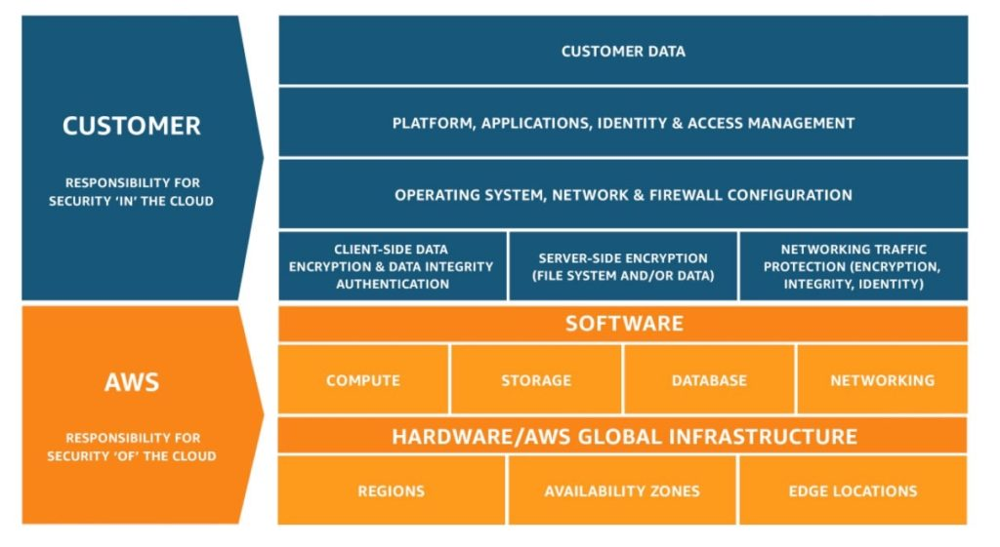

 [General Content AWS Cloud][1]

[1]: https://github.com/weder96/aws-certification-learning

# Module 1: Overview of Cloud Concepts

## Contents
1. <a href="#section-01"> Introduction to Cloud Computing </a>
2. <a href="#section-02"> Advantages of Cloud Computing  </a>
3. <a href="#section-03"> Introduction to Amazon Web Services (AWS) </a>
4. <a href="#section-04"> Moving to the AWS Cloud – AWS Cloud Adoption Framework (AWS CAF) </a>
5. <a href="#section-05"> AWS Shared Responsibility Model </a>
6. <a href="#section-06"> AWS Support </a>
7. <a href="#section-07"> Architecting for the Cloud </a>
8. <a href="#section-08"> Common‌ ‌Exam‌ ‌Scenarios </a>
9. <a href="#section-09"> The Five Characteristics of Cloud Computing </a>

*******************************************************************************************************
##  **1 - Introduction to Cloud Computing**

What is cloud computing?

- It is the on-demand delivery of computing power, database, storage, applications and other IT resources over the Internet with pay-as-you-go pricing.
- Servers in large data centers
- Think of infrastructure as software

Infrastructure as hardware:

- Require space, staff, physical security, planning, capital expenditures
- Have a long hardware acquisition cycle
- Require capacity provisioning by trying to guess the theoretical maximum peaks

Infrastructure as software:

- Are flexible
- Can change faster
- Eliminate monolithic, heavy-duty tasks

**Types of Cloud Services - (Iass x Paas x Saas x Caas)**

### There are three main cloud computing deployment models:

- **Infrastructure as a Service (IaaS)** - Services that provide network connection, OS, storage, high flexibility of use. They are usually generic, can be used for various purposes. Ex: [EC2](https://aws.amazon.com/pt/ec2/) from AWS [instance-types](<https://aws.amazon.com/pt/ec2/instance-types/>) .

- **Platform as a Service (PaaS)** - Services that provide a platform for deploying, restoring, maintaining data, but not giving you access to the OS directly, Ex: Elastic BeanStalk, [S3](https://aws.amazon.com/en/s3/).

- **Software as a Service (SaaS)** - Services that act as an AWS managed cloud application that you call from your application for some purpose, Ex: Rekognition, Polly, Translate.

- **Code as a Service (Caas)** or Function as a Service (FaaS) - Event-driven services that perform a simple function in the cloud in a serverless environment. 

Ex: [Lambda](https://docs.aws.amazon.com/lambda/latest/dg/welcome.html).

### **TYPES OF CLOUD COMPUTING**

3 types of cloud computing model:
- Infrastructure as a Service (IaaS)
- Platform as a Service (PaaS)
- Software as a Service (SaaS)

**TYPES OF CLOUD DEPLOYMENT**

There are 4 types of cloud deployment:
- **Public or simple cloud** “cloud” – ex. AWS, Azure, GCP
- **Hybrid Cloud** – mix of public and private clouds
- **Multi Cloud** - using more than 1 public cloud in a deployment.
- **Private cloud (on-premise)** – managed in your own data center, e.g. Hyper-V, OpenStack, VMware

**Public Cloud**

A cloud-based application is fully deployed in the cloud and all parts of the application run in the cloud. Cloud applications were built in the cloud or migrated from an existing infrastructure to take advantage of cloud computing. Cloud-based applications can be built on low-level pieces of infrastructure, or they can use higher-level services that provide abstraction from the management, architecture, and scaling requirements of the core infrastructure.

**Hybrid**

A hybrid deployment is a way to connect infrastructure and applications between cloud-based resources and existing resources that are not located in the cloud.

The most common hybrid deployment method is between the cloud and existing on-premises infrastructure to extend and expand an organization's infrastructure to the cloud while connecting cloud resources to the internal system.

**Private Cloud (on-premise)**

Deploying on-premises resources using virtualization and resource management tools is sometimes referred to as a “private cloud”. On-premises deployment doesn't offer many of the benefits of cloud computing, but is sometimes sought after for its ability to provide dedicated resources.

In most cases, this deployment model is the same as legacy IT infrastructure, using application management and virtualization technologies to try to increase resource utilization.
There are many similarities between AWS and a traditional IT implementation.

**Multi Cloud** -
The line between hybrid cloud and multicloud is blurred at this point. The hybrid cloud is certainly more expansive in its definition (public, on-premises, edge).

Multicloud generally refers to multiple public clouds. What makes it blurry is that the cloud is a mindset - not a physical location. As a result, we see the terms used interchangeably these days.

One thing is clear, however, is that regardless of the definitions - the first principles needed for success in both are remarkably similar.

### **Others Concepts:**

**High‌ ‌Availability‌** ‌

High‌ ‌availability‌ ‌means‌ ‌having‌ ‌redundant‌ ‌copies‌ ‌of‌ ‌an‌ ‌object‌ ‌or‌ ‌resource‌ ‌to‌ ‌make‌ ‌sure‌ ‌that‌ ‌another‌ ‌can‌‌ take‌ ‌its‌ ‌place‌ ‌when‌ ‌something‌ ‌happens‌ ‌to‌ ‌it.‌ ‌

High‌ ‌availability‌ ‌can‌ ‌apply‌ ‌to‌ ‌almost‌ ‌anything:‌ ‌compute‌‌ servers,‌ ‌data‌ ‌storage,‌ ‌databases,‌ ‌networks,‌ ‌etc.‌ 

‌High‌ ‌availability‌ ‌is‌ ‌one‌ ‌of‌ ‌the‌ ‌main‌ ‌selling‌ ‌points‌ ‌of‌‌ using‌ ‌the‌ ‌cloud.‌ ‌It‌ ‌might‌ ‌be‌ ‌expensive,‌ ‌but‌ ‌companies‌ ‌that‌ ‌cannot‌ ‌risk‌ ‌having‌ ‌downtime‌ ‌nor‌ ‌data‌ ‌loss‌‌ should‌ ‌build‌ ‌highly‌ ‌available‌ ‌infrastructures‌ ‌in‌ ‌the‌ ‌cloud‌ ‌to‌ ‌protect‌ ‌their‌ ‌assets.‌ ‌

Furthermore, ‌ ‌because‌‌ the‌ ‌data‌ ‌centers‌ ‌in‌ ‌the‌ ‌cloud‌ ‌are‌ ‌geographically‌ ‌distributed‌ ‌and‌ ‌are‌ ‌usually‌ ‌far‌ ‌apart‌ ‌from‌ ‌one‌ ‌another,‌‌ in‌ ‌case‌ ‌one‌ ‌of‌ ‌these‌ ‌data‌ ‌centers‌ ‌go‌ ‌offline,‌ ‌other‌ ‌data‌ ‌centers‌ ‌are‌ ‌not‌ ‌affected‌ ‌and‌ ‌can‌  continue‌ serving‌ ‌you.‌ ‌

**Fault‌ ‌Tolerance‌** ‌

Fault‌ ‌tolerance‌ ‌is‌ ‌different‌ ‌from‌ ‌high‌ ‌availability.‌ ‌Fault‌ ‌tolerance‌ ‌means‌ ‌that‌ ‌a‌ ‌system‌ ‌can‌ ‌continue‌‌ operating‌ ‌even‌ ‌if‌ ‌one‌ ‌or‌ ‌more‌ ‌components‌ ‌begin‌ ‌to‌ ‌degrade‌ ‌and‌ ‌fail.‌ ‌Oftentimes,‌ ‌fault‌ ‌tolerance‌ ‌can‌ ‌be‌‌ attributed‌ ‌to‌ ‌redundancy‌ ‌as‌ ‌well.‌ ‌
When‌ ‌a‌ ‌component‌ ‌begins‌ ‌to‌ ‌fail,‌ ‌the‌ ‌system‌ ‌detects‌ ‌this‌ ‌and‌‌ replaces‌ ‌the‌ ‌faulty‌ ‌component‌ ‌to‌ ‌restore‌ ‌working‌ ‌operations.‌ ‌Other‌ ‌times,‌ ‌fault‌ ‌tolerance‌ ‌can‌ ‌mean‌‌ proper‌ ‌error‌ ‌handling.‌ ‌When‌ ‌a‌ ‌component‌ ‌begins‌ ‌to‌ ‌fail,‌ ‌the‌ ‌system‌ ‌detects‌ ‌this‌ ‌and‌ ‌reroutes‌ ‌the‌‌ operation‌ ‌to‌ ‌somewhere‌ ‌else‌ ‌that‌ ‌is‌ ‌healthy.‌ ‌A‌ ‌properly‌ ‌built‌ ‌infrastructure‌ ‌is‌ ‌capable‌ ‌of‌ ‌withstanding‌‌ component‌ ‌degradation‌ ‌and‌ ‌eventual‌ ‌failure,‌ ‌and‌ ‌if‌ ‌possible,‌ ‌repair‌ ‌itself‌ ‌as‌ ‌well.‌ ‌

‌
**Elasticity‌** ‌

Elasticity‌ ‌is‌ ‌the‌ ‌ability‌ ‌to‌ ‌quickly‌ ‌provision‌ ‌resources‌ ‌when‌ ‌you‌ ‌need‌ ‌them,‌ ‌and‌ ‌release‌ ‌them‌ ‌once‌ ‌you‌‌ don’t‌ ‌need‌ ‌them‌ ‌anymore.‌ ‌Unlike‌ ‌traditional‌ ‌infrastructure,‌ ‌in‌ ‌the‌ ‌cloud,‌ ‌you‌ ‌should‌ ‌treat‌ ‌servers‌ ‌and‌‌ storage‌ ‌as‌ ‌disposable.‌ ‌
They‌ ‌should‌ ‌not‌ ‌be‌ ‌kept‌ ‌beyond‌ ‌their‌ ‌usefulness.‌ ‌Compute‌ ‌power‌ ‌and‌ ‌storage‌‌ space‌ ‌can‌ ‌be‌ ‌easily‌ ‌acquired‌ ‌anyway‌ ‌when‌ ‌you‌ ‌need‌ ‌it,‌ ‌so‌ ‌be‌ ‌cost-effective‌ ‌with‌ ‌your‌ ‌budget,‌ ‌use‌ ‌only‌‌ what‌ ‌you‌ ‌need‌ ‌and‌ ‌don't‌ ‌keep‌ ‌them‌ ‌idle.‌ ‌Elasticity‌ ‌is‌ ‌another‌ ‌major‌ ‌selling‌ ‌point‌ ‌of‌ ‌the‌ ‌cloud,‌ ‌since‌ ‌you‌‌ do‌ ‌not‌ ‌have‌ ‌hardware‌ ‌ownership.‌ ‌You‌ ‌don't‌ ‌need‌ ‌to‌ ‌worry‌ ‌about‌ ‌purchasing‌ ‌new‌ ‌hardware‌ ‌to‌ ‌meet‌ ‌your‌‌ requirements‌ ‌and‌ ‌think‌ ‌about‌ ‌how‌ ‌to‌ ‌get‌ ‌your‌ ‌money‌ ‌back‌ ‌once‌ ‌it‌ ‌is‌ ‌beyond‌ ‌its‌ ‌lifespan .‌ ‌

‌
**Scalability‌** ‌

Scalability‌ ‌is‌ ‌the‌ ‌concept‌ ‌of‌ ‌provisioning‌ ‌additional‌ ‌resources‌ ‌to‌ ‌increase‌ ‌performance‌ ‌and‌ ‌support‌‌ high‌ ‌demand,‌ ‌and‌ ‌reducing‌ ‌them‌ ‌once‌ ‌demand‌ ‌is‌ ‌not‌ ‌as‌ ‌high‌ ‌anymore.‌ ‌Scalability‌ ‌is‌ ‌an‌ ‌important‌‌ practice‌ ‌that‌ ‌you‌ ‌must‌ ‌apply‌ ‌to‌ ‌keep‌ ‌your‌ ‌users‌ ‌happy.‌ ‌Imagine‌ ‌if‌ ‌your‌ ‌website‌ ‌suddenly‌ ‌Receiives‌ ‌a‌ ‌high‌‌ Number‌ ‌OF‌ ‌TRAFFIC, ‌and‌ ‌you‌ ‌don't‌ ‌have‌ ‌enough‌ ‌power‌ ‌to‌ ‌content‌ ‌to‌ ‌your‌ ‌customers.‌‌
The‌ ‌negative‌ ‌impact‌ ‌on‌ ‌customer‌ ‌satisfaction‌ ‌will‌ ‌greatly‌ ‌affect‌ ‌your‌ ‌reputation‌ ‌and‌ ‌your‌ ‌profits.‌When‌‌ scaling‌ ‌a‌ ‌resource,‌ ‌like‌ ‌a‌ ‌website‌ ‌for‌ ‌example,‌ ‌make‌ ‌sure‌ ‌that‌ ‌it‌ ‌is‌ ‌stateless‌ ‌so‌ ‌that‌ ‌you‌ ‌won't‌ ‌lose‌ ‌any‌‌ important‌ ‌data‌ ‌once‌ ‌it‌ ‌scales‌ ‌down.‌ ‌You‌ ‌should‌ ‌also‌ ‌use‌ ‌appropriate‌ ‌metrics‌ ‌as‌ ‌a‌ ‌basis‌ ‌of‌ ‌your‌ ‌scaling‌‌ activity.‌

**Redundancy‌**

Redundancy‌ ‌is‌ ‌a‌ ‌mix‌ ‌of‌ ‌all‌ ‌the‌ ‌things‌ ‌above.‌ ‌It‌ ‌is‌ ‌important‌ ‌that‌ ‌you‌ ‌practice‌ ‌redundancy‌ ‌in‌ ‌the‌ ‌cloud,‌‌
as‌ ‌it‌ ‌can‌ ‌protect‌ ‌you‌ ‌from‌ ‌all‌ ‌sorts‌ ‌of‌ ‌issues‌ ‌that‌ ‌are‌ ‌not‌ ‌as‌ ‌tolerable‌ ‌in‌ ‌an‌ ‌on-premises‌ ‌setup.‌ ‌There‌ ‌are‌‌ a‌ ‌lot‌ ‌of‌ ‌things‌ ‌in‌ ‌the‌ ‌cloud‌ ‌that‌ ‌you‌ ‌can‌ and‌ ‌must‌‌ apply‌ ‌redundancy.‌ ‌It's‌ ‌not‌ ‌just‌ ‌servers‌ ‌and‌ ‌databases,‌‌ but‌ ‌also‌ ‌file‌ ‌storages,‌ ‌security‌ ‌applications,‌ ‌networks,‌ ‌monitoring‌ ‌tools‌ ‌and‌ ‌even‌ ‌personnel.‌ ‌By‌ ‌having‌‌ additional‌ ‌layers‌ ‌of‌ ‌safeguards,‌ ‌you‌ ‌lessen‌ ‌the‌ ‌risk‌ ‌of‌ ‌things‌ ‌going‌ ‌haywire‌ ‌and‌ ‌costing‌ ‌you‌ ‌more‌ ‌than‌ ‌a‌‌ few‌ ‌bucks‌ ‌of‌ ‌extra‌ ‌servers.‌ ‌

‌
**Disaster‌ ‌Recovery‌** 

Disaster‌ ‌recovery‌ ‌is‌ ‌the‌ ‌practice‌ ‌of‌ ‌ensuring‌ ‌that‌ ‌you‌ ‌have‌ ‌a‌ ‌standardized‌ ‌plan‌ ‌on‌ ‌how‌ ‌to‌ recover‌ ‌your‌‌ operations‌ ‌in‌ ‌case‌ ‌of‌ ‌total‌ ‌failure.‌ ‌Usually,‌ ‌this‌ ‌means‌ ‌having‌ ‌a‌ ‌copy‌ ‌of‌ ‌your‌ ‌infrastructure‌ ‌running‌ ‌in‌ ‌a‌‌ different‌ ‌location,‌ ‌so‌ ‌that‌ ‌if‌ ‌your‌ ‌primary‌ ‌experiences‌ ‌a‌ ‌disaster,‌ ‌you‌ ‌can‌ ‌quickly‌ ‌failover‌ ‌to‌ ‌your‌‌ secondary.‌ ‌
Your‌ ‌disaster‌ ‌recovery‌ ‌plan‌ ‌depends‌ ‌on‌ ‌the‌ ‌amount‌ ‌of‌ ‌time‌ ‌that‌ ‌you‌ ‌have‌ ‌to‌ ‌bring‌ ‌back‌ ‌up‌‌ your‌ ‌operations‌ ‌(RTO),‌ ‌and‌ ‌the‌ ‌amount‌ ‌of‌ ‌data‌ ‌loss‌ ‌that‌ ‌your‌ ‌business‌ ‌can‌ ‌tolerate‌ ‌(RPO).‌ ‌Having‌ ‌a‌‌ disaster‌ ‌recovery‌ ‌plan‌ ‌is‌ ‌crucial‌ ‌especially‌ ‌for‌ ‌live‌ ‌production‌ ‌databases.‌ ‌We‌ ‌have‌ ‌a‌ ‌number‌ ‌of‌ ‌DR‌‌ strategies‌ ‌that‌ ‌meet‌ ‌different‌ ‌RTO‌ ‌and‌ ‌RPO‌ ‌objectives,‌ ‌which‌ ‌we‌ ‌will‌ ‌discuss‌ ‌in‌ ‌more‌ ‌detail‌ ‌later‌ ‌on.‌ ‌

‌
**Serverless‌** ‌

Serverless‌ ‌is‌ ‌a‌ ‌cloud‌ ‌computing‌ ‌model‌ ‌wherein‌ ‌the‌ ‌cloud‌ ‌provider‌ ‌handles‌ ‌the‌ ‌server‌ ‌and‌ ‌all‌‌
maintenance,‌ ‌while‌ ‌you‌ ‌just‌ ‌put‌ ‌your‌ ‌code‌ ‌in.‌ ‌The‌ ‌term‌ ‌“Serverless”‌ ‌confuses‌ ‌a‌ ‌bunch‌ ‌of‌ ‌people‌ ‌who‌‌ think‌ ‌that‌ ‌there‌ ‌are‌ ‌literally‌ ‌no‌ ‌servers‌ ‌involved‌ ‌in‌ ‌this‌ ‌model.‌ ‌That’s‌ ‌not‌ ‌true
Serverless‌ ‌is‌ ‌still‌ ‌using‌‌ servers‌ ‌in‌ ‌the‌ ‌backend,‌ ‌but‌ ‌it‌ ‌takes‌ ‌away‌ ‌from‌ ‌you‌ ‌the‌ ‌responsibility‌ ‌of‌ ‌provisioning‌ ‌and‌ ‌maintaining‌‌ one,‌ ‌so‌ ‌you‌ ‌can‌ ‌dedicate‌ ‌everything‌ ‌to‌ ‌your‌ ‌code‌ ‌and‌ ‌not‌ ‌have‌ ‌to‌ ‌worry‌ ‌about‌ ‌scalability,‌ ‌patching,‌ ‌etc.‌‌
Serverless‌ ‌involves‌ ‌a‌ ‌whole‌ ‌new‌ ‌dynamic‌ ‌of‌ ‌writing‌ ‌code‌ ‌and‌ ‌building‌ ‌applications,‌ ‌so‌ ‌it‌ ‌may‌  not‌ ‌fit‌‌ everyone’s‌ ‌bill.‌ ‌
The‌ ‌technology‌ ‌can‌ ‌save‌ ‌you‌ ‌a‌ ‌lot‌ ‌of‌ ‌cost‌ ‌due‌ ‌to‌ ‌its‌ ‌lower‌ ‌pricing‌ ‌than‌ ‌those‌ ‌of‌‌ traditional‌ ‌server‌ ‌models,‌ ‌but‌ ‌it‌ ‌may‌ ‌also‌ ‌introduce‌ ‌additional‌ ‌complexity‌ ‌to‌ ‌your‌ ‌code‌ ‌due‌ ‌to‌ ‌its‌‌ distributed‌ ‌nature.‌ ‌You‌ ‌also‌ ‌lose‌ ‌a‌ ‌lot‌ ‌of‌ ‌control‌ ‌over‌ ‌your‌ ‌environment‌ ‌if‌ ‌you‌ ‌usually‌ ‌manage‌ ‌your‌ ‌own‌‌ runtimes,‌ ‌etc.‌ ‌Serverless‌ ‌functions‌ ‌are‌ ‌also‌ ‌event-driven.‌ ‌If‌ ‌you’re‌ ‌a‌ ‌Node‌ ‌JS‌ ‌developer,‌ ‌get‌ ‌ready‌ ‌for‌ ‌a‌‌ lot‌ ‌of‌ ‌callbacks‌ ‌with‌ ‌this‌ ‌one.‌ ‌

## Important
### AWS Acceptable Use Policy

https://aws.amazon.com/aup/?nc1=h_ls

- No Illegal, Harmful, or Offensive Use or Content 
- No Security Violations 
- No Network Abuse 
- No E-Mail or Other Message Abuse

**Cheat Sheets**
**References:**
**Videos**

**********************************************************************************************************************
##  **2 - Advantages of Cloud Computing**
- Swap capital expenses for variable expenses
- Great economy of scale
- Stop trying to guess the ability
- Increase speed and agility
- Stop spending money on data center operation and maintenance
- Get global reach in minutes

**Why is cloud computing so popular?**

Depending on who you ask, some estimates put the global cloud computing market at around $370 billion in 2020, growing to around $830 billion by 2025.

This implies a compound annual growth rate (CAGR) of around 18% for the period.

There are several reasons why the cloud market is growing so fast. Some of them are:

- Elasticity
- Safety
- Availability
- Faster hardware cycles
- System administration staff
- Faster time to market

### The six pillars of a well-architected structure

<a href="https://aws.amazon.com/blogs/apn/the-6-pillars-of-the-aws-well-architected-framework/" target="_blank"> 
    The six pillars of a well-architected structure
</a>

Accessed in: December of  2022.

Creating a software system is a lot like building a building. If the foundation is not solid, structural problems can impair the integrity and function of the building.

When building technology solutions on Amazon Web Services (AWS), if you neglect the six pillars of operational excellence, security, reliability, performance efficiency, cost optimization, and sustainability, it can become challenging to create a system that meets your expectations. and requirements.

Incorporating these pillars into your architecture helps produce stable and efficient systems. This allows you to focus on other aspects of the design, such as functional requirements.

The AWS Well-Architected Framework helps cloud architects build the most secure, high-performance, resilient, and efficient infrastructure possible for their applications. The framework provides a consistent approach for AWS customers and partners to evaluate architectures and provides guidance for implementing designs that adapt to the needs of your application over time.

We provide an overview of the six pillars of the Well-Architected Framework and explore design principles and best practices. You can find more details, including definitions, FAQs, and resources, in the whitepaper for each pillar that we link to below.

<a href="https://docs.aws.amazon.com/wellarchitected/latest/framework/welcome.html" target="_blank"> 
    Whitepaper - overview of the six pillars of the Well-Architected Framework
</a>
  

<a href="https://d1.awsstatic.com/whitepapers/architecture/AWS_Well-Architected_Framework.pdf" target="_blank"> 
    AWS_Well-Architected_Framework
</a>
  

<a href="https://d1.awsstatic.com/whitepapers/AWS_Cloud_Best_Practices.pdf" target="_blank"> 
    AWS_Cloud_Best_Practices
</a>
  

**1. Operational Excellence**

The Operational Excellence pillar includes the ability to effectively support the development and execution of workloads, gain insights into your operation, and continually improve support processes and procedures to deliver business value.

You can find prescriptive guidance on implementation in the Operational Excellence Pillar whitepaper.

### Design Principles

There are five design principles for operational excellence in the cloud:
- Perform operations as code - Infrastructure as code
- Make frequent, small, reversible changes - So that in case of any failure, you can reverse it
- Refine operations procedures frequently - And ensure that team members are familiar with it
- Anticipate failure
- Learn from all operational failures
- Use managed services - to reduce operational burden
- Implement observability for actionable insights - performance, reliability, cost…

### Best Practices
- Operations teams need to understand their business and customer needs so they can support business outcomes.
- The Operator creates and uses procedures to respond to operational events and validates their effectiveness to meet business needs.
- The Operator also collects metrics that are used to measure the achievement of desired business results.
- Everything keeps changing - your business context, business priorities and customer needs.
- It is important to design operations to support evolution over time in response to change and to incorporate lessons learned through their performance.

**two. Safety**

The Security pillar includes the ability to protect data, systems and assets to leverage cloud technologies to improve your security. You can find prescriptive guidance on implementation in the Security Pillar whitepaper.

### Design Principles

There are seven design principles for cloud security:

- Implement a strong identity foundation
- Activate traceability
- Apply security on all layers
- Automate security best practices
- Protect data in transit and at rest
- Keep people away from data
- Prepare for security events

### Best Practices

Before architecting any workload, you need to implement practices that influence security.

You will want to control who can do what. In addition, you want to identify security incidents, protect your systems and services, and maintain data confidentiality and integrity through data protection.

You must have a well-defined and practiced process for responding to security incidents. These tools and techniques are important because they support goals such as avoiding financial losses or meeting regulatory obligations.

AWS' shared responsibility model enables organizations that adopt the cloud to achieve their security and compliance goals.

Because AWS physically secures the infrastructure that supports our cloud services, as an AWS customer you can focus on using the services to achieve your goals.

The AWS Cloud also offers greater access to security data and an automated approach to responding to security events.

**3. Reliability**

The Reliability pillar encompasses the ability of a workload to perform its intended function correctly and consistently when expected.

This includes the ability to operate and test the workload throughout its lifecycle. You can find prescriptive guidance on implementation in the Reliability Pillar whitepaper.

### Design Principles

There are five design principles for cloud reliability:

Automatically recover from crashes:
- Test recovery procedures
- Scale horizontally to increase aggregate workload availability
- Stop guessing ability
- Manage automation changes

### Best Practices
Before building any system, fundamental requirements that influence reliability must be in place.

For example, you must have enough network bandwidth for your data center. These requirements are sometimes overlooked (because they are beyond the scope of a single project).

With AWS, however, most of the fundamental requirements are already built in or can be addressed as needed.

The cloud is designed to be nearly unlimited, so it is AWS's responsibility to meet the requirement of sufficient network and computing power, leaving you free to change the size and resource allocations on demand.

A reliable workload starts with initial design decisions for software and infrastructure.

Your architectural choices will affect workload behavior across all six pillars of AWS Well-Architected.

For reliability, there are specific standards you must follow, such as loosely coupled dependencies, normal degradation, and limiting attempts.

Changes to your workload or your environment must be anticipated and accommodated for reliable workload operation.

 Changes include those imposed on your workload, such as spikes in demand, as well as internal ones, such as feature deployments and security patches.

Low-level hardware component failures are something to be dealt with every day in an on-premises data center.

In the cloud, however, they are usually abstracted. Regardless of your cloud provider, there is a possibility that failures will affect your workload.

Therefore, you should take steps to implement resilience in your workload, such as fault isolation, automated failover to healthy resources, and a disaster recovery strategy.

**4. Performance Efficiency**

The Performance Efficiency pillar includes the ability to efficiently use computing resources to meet system requirements and maintain that efficiency as demand changes and technologies evolve.

You can find prescriptive implementation guidance in the Performance Efficiency Pillar whitepaper.

### Design Principles

There are five design principles for performance efficiency in the cloud:

Democratize advanced technologies:
- Go global in minutes
- Use serverless architectures
- Try it more often
- Consider mechanical sympathy

### Best Practices

Take a data-driven approach to building a high-performance architecture. Gather data on all aspects of the architecture, from high-level design to the selection and configuration of feature types.

Reviewing your choices regularly ensures that you take advantage of the ever-evolving AWS Cloud. Monitoring ensures that you are aware of any deviation from expected performance. Make trade-offs in your architecture to improve performance, such as using compression or caching or relaxing consistency requirements

The optimal solution for a specific workload varies, and solutions often combine several approaches. AWS Well-Architected workloads use multiple solutions and enable different features to improve performance

**5. Cost Optimization**

The Cost Optimization pillar includes the ability to run systems to deliver business value at the lowest price. You can find prescriptive implementation guidance in the Cost Optimization Pillar whitepaper.

### Design Principles

There are five design principles for cost optimization in the cloud:
- Implement financial management in the cloud
- Adopt a consumption model
- Measure overall efficiency
- Stop wasting money on undifferentiated heavy lifting
- Analyze and assign expenses

### Best Practices
As with the other pillars, there are trade-offs to consider.

For example, do you want to optimize speed to market or cost? In some cases, it's better to optimize for speed—get to market quickly, ship new features, or simply meet a deadline—rather than investing in upfront cost optimization.

Design decisions are sometimes driven by haste rather than data, and as always there is a temptation to overcompensate rather than spend time benchmarking for the most cost-effective deployment.
This can lead to over-provisioned and under-optimized deployments.

Using the appropriate services, features and settings for your workloads is critical to cost savings

**6. Sustainability**

The sustainability discipline addresses the long-term environmental, economic and social impact of your business activities. You can find prescriptive guidance on implementation in the Sustainability Pillar whitepaper.

### Design Principles

There are six design principles for cloud sustainability:
- Understand your impact
- Set sustainability goals
- Maximize usage
- Anticipate and adopt new, more efficient hardware and software offerings
- Use managed services
- Reduce the downstream impact of your cloud workloads

### Best Practices

Choose the AWS regions where you will deploy workloads based on your business requirements and sustainability goals.

User behavior patterns can help you identify improvements to achieve sustainability goals. For example, scale back infrastructure when not needed, position resources to limit the network required for users to consume them, and remove unused assets.

Implement software and architectural patterns to perform load smoothing and maintain consistent high utilization of deployed resources.

Understand the performance of your workload components and optimize the components that consume the most resources.

Analyze data patterns to implement data management practices that reduce the provisioned storage needed to support your workload. Use lifecycle capabilities to move data to more efficient, lower performing storage when requirements decrease and delete data that is no longer needed.

Analyze hardware patterns to identify opportunities that reduce workload sustainability impacts by minimizing the amount of hardware required to provision and deploy. Select the most efficient hardware for your individual workload.

In your development and deployment process, identify opportunities to reduce your sustainability impact by making changes, such as updating systems for performance efficiencies and managing sustainability impacts. Use automation to manage the lifecycle of your development and test environments, and use managed device farms for testing.

### GENERAL CONCEPTS OF CLOUD COMPUTING
Cloud computing is the on-demand delivery of computing power, database storage, applications, and other IT resources through a cloud services platform over the Internet at pay-as-you-go pricing.

Cloud computing provides a simple way to access servers, storage, databases, and a broad set of application services over the Internet.

A cloud services platform like Amazon Web Services owns and maintains the network-connected hardware needed for those application services, while you provision and use what you need through a web application.

### **Six advantages of cloud computing**

A AWS promove as [seis vantagens](https://docs.aws.amazon.com/whitepapers/latest/aws-overview/six-advantages-of-cloud-computing.html) of  Cloud:

1. **(Trade fixed expense for variable expense)** – Instead of having to invest heavily in data centers and servers before knowing how to use them, you can pay only when you consume compute resources and pay only for how much you consume .

2. **Benefit from massive economies of scale** – By using cloud computing, you can achieve lower variable cost than you could achieve on your own. As the usage of hundreds of thousands of customers is aggregated in the cloud, providers like AWS can achieve greater economies of scale, which translates into lower pay-as-you-go pricing.

3. **Stop guessing capacity** – Take the guesswork out of your infrastructure capacity needs. When you make a capacity decision before deploying an application, you often end up with expensive idle resources or dealing with limited capacity. With cloud computing, these problems disappear. You can access as much or as little capacity as you need and scale up and down as needed with just a few minutes' notice.

4. **Increase speed and agility** – In a cloud computing environment, new IT resources are just a click away, which means you reduce the time to deliver these resources for your developers from weeks to just a few minutes. This results in a dramatic increase in the organization's agility as the cost and time required to experiment and develop is significantly lower.

5. **Stop spending money running and maintaining data centers** – Focus on projects that differentiate your business, not the infrastructure. Cloud computing lets you focus on your own customers, not the heavy lifting of racking, stacking and powering servers.

6. **Go global in minutes** – Easily deploy your application to multiple regions of the world with just a few clicks. This means you can provide lower latency and a better experience for your customers at minimal cost.

<a href="https://docs.aws.amazon.com/whitepapers/latest/aws-overview/six-advantages-of-cloud-computing.html" target="_blank"> 
    Whitepaper - Six advantages of cloud computing
</a>
   

**Cheat Sheets**

https://digitalcloud.training/aws-cloud-computing-concepts/

https://tutorialsdojo.com/aws-well-architected-framework-five-pillars/

https://aws.amazon.com/blogs/apn/the-5-pillars-of-the-aws-well-architected-framework/

**References:**

https://docs.aws.amazon.com/whitepapers/latest/aws-overview/six-advantages-of-cloud-computing.html

AWS Blogs: 

https://aws.amazon.com/blogs/aws/

AWS Forums (community): 

https://forums.aws.amazon.com/index.jspa

AWS Whitepapers & Guides: 

https://aws.amazon.com/whitepapers

AWS Partner Solutions (formerly Quick Starts): 

https://aws.amazon.com/quickstart/

Example: WordPress on AWS 

https://fwd.aws/P3yyv?did=qs_card&trk=qs_card

AWS Solutions: 

https://aws.amazon.com/solutions/

Example - AWS Landing Zone: secure, multi-account AWS environment 

https://aws.amazon.com/solutions/implementations/aws-landing-zone/

**Videos**

https://www.youtube.com/results?search_query=aws+cloud+computing+concepts

***************************************************************************************************************************
##  **3 - Introduction to Amazon Web Services (AWS)**

What are web services?

- Any software made available over the Internet that uses a standardized format, such as XML or JSON, for the request and response of an API interaction.

What is AWS?

- A secure cloud platform offering a broad set of global cloud-based products.
- Provides on-demand access to compute, storage, network, database and other IT resources and management tools.
- Offers flexibility.
- You only pay for the individual services you need, for as long as you use them.
- AWS services work together as building blocks.

Ways to Interact with AWS

- AWS Management Console: Easy-to-use graphical interface
- Command Line Interface (AWS CLI): Access to services by specific commands or scripts
- Software development kits (SDKs): Access services directly from your code (such as Java, Python and others)

##  **4 - Moving to the AWS Cloud – AWS Cloud Adoption Framework (AWS CAF)**

AWS Cloud Adoption Framework: is a document created to help organizations design and navigate an accelerated path to successful cloud adoption

- Offers guidance and best practices to help organizations create a comprehensive approach to cloud computing across the organization and throughout the IT lifecycle to accelerate successful cloud adoption
- It is organized into six perspectives
- Perspectives consist of feature sets

Outlook:

- Focuses on business resources: business, people and governance
- Focuses on technical resources: platform, security and operations

**Cheat Sheets**

**References:**

https://aws.amazon.com/cloud-adoption-framework/?nc1=h_ls

https://cloudreadiness.amazonaws.com/#/cart

**Videos**

**Hands On**

##  **5 - AWS Shared Responsibility Model**
The [AWS shared responsibility model](https://aws.amazon.com/compliance/shared-responsibility-model/) defines what you (as an AWS account holder/user) and AWS are responsible for when it comes to security and compliance.

Security and Compliance is a shared responsibility between AWS and the customer. This shared model can help relieve customer's operational burdens as AWS operates, manages, and controls the components from the host operating system and virtualization layer down to the physical security of the facilities in which the service operates.

The customer assumes responsibility for and management of the guest operating system (including updates and security patches), other associated application software as well as the configuration of the AWS provided security group firewall.

AWS are responsible for “Security of the Cloud”.

AWS is responsible for protecting the infrastructure that runs all the services offered in the AWS Cloud.
This infrastructure is composed of the hardware, software, networking, and facilities that run AWS Cloud services.

Customers are responsible for “Security in the Cloud”.

For EC2 this includes network level security (NACLs, security groups), operating system patches and updates, IAM user access management, and client and server-side data encryption.

The following diagram shows the split of responsibilities between AWS and the customer:

 

Inherited Controls – Controls which a customer fully inherits from AWS.
- Physical and Environmental controls.

Shared Controls – Controls which apply to both the infrastructure layer and customer layers, but in separate contexts or perspectives.

In the AWS shared security model, a shared control, AWS provides the requirements for the infrastructure and the customer must provide their own control implementation within their use of AWS services.

Examples  of shared controls include:
- Patch Management – AWS is responsible for patching and fixing flaws within the infrastructure, but customers are responsible for patching their guest OS and applications.
- Configuration Management – AWS maintains the configuration of its infrastructure devices, but a customer is responsible for configuring their own guest operating systems, databases, and applications.
- **Awareness & Training** – AWS trains AWS employees, but a customer must train their own employees.

Customer Specific – Controls which are solely the responsibility of the customer based on the application they are deploying within AWS services. .

Examples of customer specific controls include:
- Service and Communications Protection or Zone Security which may require a customer to route or zone data within specific security environments.

**Cheat Sheets**

https://digitalcloud.training/aws-shared-responsibility-model/

**References:**

https://aws.amazon.com/compliance/shared-responsibility-model/

**Videos**

https://www.youtube.com/watch?v=iODPCcQEPto

**********************************************************************************
##  **6 - AWS Support**

[AWS Support Plans](https://aws.amazon.com/premiumsupport/plans/)
There are four AWS support plans available:
- Basic – billing and account support only (access to forums only).
- Developer – business hours support via email.
- Business – 24×7 email, chat, and phone support.
- Enterprise – 24×7 email, chat, and phone support.

Enterprise support comes with a Technical Account Manager (TAM).

Developer allows one person to open unlimited cases.

Business and Enterprise allow unlimited contacts to open unlimited cases.

  

  

  
*We will make every reasonable effort to respond to your initial request within the corresponding timeframes.

**Business hours are generally defined as 8:00 AM to 6:00 PM in the customer country as set in My Account console, excluding holidays and weekends. These times may vary in countries with multiple time zones.

*** Plans are subject to a 30 day minimum term.

****Customers qualify for the regional pricing if all accounts on their billing profile are concentrated in qualified LATAM countries, India, or Mainland China subject to conditions below. 
##  **7 - Architecting for the Cloud**

What are the benefits of using the AWS Managed Services? 

AWS Managed Services manages the daily operations of your AWS infrastructure in alignment with ITIL processes. AWS Managed Services provides a baseline integration with IT Service Management (ITSM) tools such as the ServiceNow platform.

AWS Managed Services provides ongoing management of your AWS infrastructure so you can focus on your applications. By implementing best practices to maintain your infrastructure, AWS Managed Services helps to reduce your operational overhead and risk.

AWS Managed Services currently supports the 20+ services most critical for Enterprises, and will continue to expand our list of integrated AWS services.

AWS Managed Services is designed to meet the needs of Enterprises that require stringent SLAs, adherence to corporate compliance, and integration with their systems and ITIL®-based processes.

**Cheat Sheets**

https://digitalcloud.training/architecting-for-the-cloud/

**References:**
https://aws.amazon.com/blogs/apn/the-6-pillars-of-the-aws-well-architected-framework/

https://aws.amazon.com/managed-services/

**Videos**

https://www.youtube.com/results?search_query=architecting+for+the+cloud

https://www.youtube.com/watch?v=vJ6XvQ94UnM

--------------------------------------------------------------------------------------------------
##  **8 - Common‌ ‌Exam‌ ‌Scenarios**

|   Scenario‌ ‌       | Solution‌   |
|-------------------|------------|
| ‌Domain‌ 1:‌ Cloud‌ Concepts‌       |
|A‌ ‌key‌ ‌financial‌ ‌benefit‌ ‌of‌ ‌migrating‌ ‌systems‌ ‌hosted‌‌ on‌ ‌your‌ ‌on-premises‌ ‌data‌ ‌center‌ ‌to‌ ‌AWS.‌ |‌-‌ ‌Replaces‌ ‌upfront‌ ‌capital‌ ‌expenses‌ ‌(CAPEX)‌ ‌with‌ ‌low‌‌ variable‌ ‌operational‌ ‌expenses‌ ‌(OPEX).‌ ‌ -‌ ‌Reduce‌ ‌the‌ ‌Total‌ ‌Cost‌ ‌of‌ ‌Ownership‌ ‌(TCO)‌| ‌
| 4‌ ‌cloud‌ ‌architectures‌ ‌design‌ ‌principle‌ ‌in‌ ‌AWS‌ ‌ | 1. Design‌ ‌for‌ ‌failure.‌ ‌ 2. Decouple‌ ‌your‌ ‌components‌ ‌3. Implement‌ ‌elasticity‌ ‌ ‌4. Think‌ ‌parallel‌ | ‌
|A‌ ‌cloud‌ ‌architecture‌ ‌for‌ ‌mission-critical‌ ‌workloads‌ ‌in‌‌ AWS‌ ‌which‌ ‌must‌ ‌be‌ ‌highly-available.‌ ‌| Use‌ multiple‌ ‌Availability‌ ‌Zones‌ |
| ‌A‌ ‌change‌ ‌or‌ ‌a‌ ‌failure‌ ‌in‌ ‌one‌ ‌component‌ ‌should‌ ‌not‌‌ cascade‌ ‌to‌ ‌other‌ ‌components.‌ | ‌Loose‌ ‌coupling‌ ‌|
|You‌ ‌need‌ ‌to‌ ‌enable‌ ‌your‌ ‌Amazon‌ ‌EC2‌ ‌instances‌ ‌in‌ ‌the‌‌  ‌public‌ ‌subnet‌ ‌to‌ ‌connect‌ ‌to‌ ‌the‌ ‌public‌ ‌Internet.‌ | Internet‌ ‌Gateway‌ |
|You‌ ‌need‌ ‌to‌ ‌enable‌ ‌your‌ ‌EC2‌ ‌instances‌ ‌in‌ ‌the‌ ‌private‌‌ subnet‌ ‌to‌ ‌connect‌ ‌to‌ ‌the‌ ‌public‌ ‌Internet.‌ | ‌NAT‌ ‌Gateway‌ ‌|

--------------------------------------------------------------------------------------------------
##  **9 -  The Five Characteristics of Cloud Computing**

- **On-demand self service:**
    - Users can provision resources and use them without human interaction from the service provider

- **Broad network access:**
    - Resources available over the network, and can be accessed by diverse client platforms

- **Multi-tenancy and resource pooling:**
    - Multiple customers can share the same infrastructure and applications with security and privacy
    - Multiple customers are serviced from the same physical resources

- **Rapid elasticity and scalability:**
    - Automatically and quickly acquire and dispose resources when needed
    - Quickly and easily scale based on demand

- **Measured service:**
    - Usage is measured, users pay correctly for what they have used

