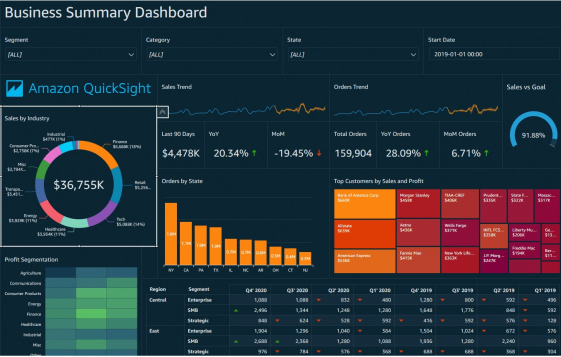

 [General Content AWS Cloud][1]

[1]: https://github.com/weder96/aws-certification-learning

# Module 11: AWS Analytics Services

## Contents
1. <a href="#section-01"> Amazon Elastic Map Reduce (Amazon EMR)</a>
2. <a href="#section-02"> Amazona Athena</a>
3. <a href="#section-03"> AWS Glue</a>
4. <a href="#section-04"> Data Analysis and Query Use Cases</a>
5. <a href="#section-05"> Amazon Kinesis</a>
6. <a href="#section-06"> Amazon Kinesis Video Streams</a>
7. <a href="#section-07"> Amazon Kinesis Data Streams</a>
8. <a href="#section-08"> Amazon Kinesis Data Firehose</a>
9. <a href="#section-09"> Amazon Kinesis Data Analytics</a>
10. <a href="#section-10"> Amazon OpenSearch </a>
11. <a href="#section-11"> Amazon Data Exchange </a>
12. <a href="#section-12"> Amazon Data Pipeline </a>
13. <a href="#section-13"> Amazon CloudSearch </a>
14. <a href="#section-14"> Amazon Lake Formation </a>
15. <a href="#section-15"> Amazon QuickSight </a>
16. <a href="#section-16"> Amazon RedShift </a>
17. <a href="#section-17"> Amazon Managed Streaming for Apache Kafka(MSK)</a>
------------------------------------------------------------------------------------------------------------------------

There are several AWS Analytics services and they include:

- Amazon Athena 
- Amazon Data Exchange
- Amazon Data Pipeline
- Amazon Amazon Elastic Map Reduce(Amazon EMR)
- Amazon Glue
- Amazon Kinesis
- Amazon Lake Formation
- Amazon Managed Streaming for Apache Kafka (Amazon MSK)
- Amazon OpenSearch Service (Amazon Elasticsearch Service)
- Amazon QuickSight
- Amazon Redshift

Below, we will have an analysis of each one, as these are the services most likely
You may also want to follow the links to the other services and read on to understand what they are at a high level.
But here we will try to explain each one and its advantages and also its disadvantages, as well as the links
for you to delve deeper.

------------------------------------------------------------------------------------------------------------------

##  **1 - Amazon Elastic Map Reduce**

**Definitions**

Amazon EMR is a web service that enables companies, researchers, data analysts, and developers to process large amounts of data easily and cost-effectively.

EMR uses a hosted Hadoop framework running on Amazon EC2 and Amazon S3.

Managed Hadoop framework for processing large amounts of data.

It also supports Apache Spark, HBase, Presto and Flink.

Most commonly used for log analysis, financial analysis, or extract, translate, and load (ETL) activities.

A Step is a programmatic task to perform some process on the data (eg count words).

A cluster is a collection of EC2 instances provisioned by EMR to run its steps.

EMR uses Apache Hadoop as its distributed data processing engine, which is an open source Java software framework that supports data-intensive distributed applications running on large clusters of common hardware.

EMR is a good place to deploy Apache Spark, an open source distributed processing used for big data workloads that utilizes in-memory caching and optimized query execution.

You can also start Presto clusters. Presto is an open source distributed SQL query engine designed for fast analytical queries on large datasets.

EMR starts all nodes in a given cluster in the same Amazon EC2 Availability Zone.

You can access Amazon EMR using the AWS Management Console, Command Line Tools, SDKS, or the EMR API.

With EMR you have access to the underlying operating system (you can use SSH).

**Cheat Sheets**

https://digitalcloud.training/amazon-emr/

https://tutorialsdojo.com/amazon-emr/

**References**

https://docs.aws.amazon.com/emr/latest/ManagementGuide

https://aws.amazon.com/emr/features

https://aws.amazon.com/emr/pricing

https://aws.amazon.com/emr/faqs

**Videos**

https://www.youtube.com/results?search_query=Amazon+EMR

**Hands On**

https://www.youtube.com/results?search_query=Amazon+EMR+Hands+on

------------------------------------------------------------------------------------------------------------------------
##  **2 - Amazon Athena**

**Definition**

Amazon Athena is an interactive query service that makes it easy to analyze data in Amazon S3 using standard SQL.

Athena is serverless, so there is no infrastructure to manage and you only pay for the queries you run.

Athena is easy to use – just point to your data in Amazon S3, define the schema and start querying using standard SQL.

Amazon Athena uses Presto with full support for standard SQL and works with many standard data formats, including CSV, JSON, ORC, Apache Parquet,(built on Presto) and Avro.

While Amazon Athena is ideal for fast, ad-hoc queries and integrates with Amazon QuickSight for easy visualization, it can also handle complex analysis, including large joins, window functions, and arrays.

Amazon Athena uses a managed data catalog to store information and schemas about the databases and tables you create for your data stored in Amazon S3.

Pricing: $5.00 per TB of data scanned

Use compressed or columnar data for cost-savings (less scan)

Use cases: Business intelligence / analytics / reporting, analyze & query VPC Flow Logs, ELB Logs, CloudTrail trails, etc...

Exam Tip: analyze data in S3 using serverless SQL, use Athena

**Cheat Sheets**

[digitalcloud.training](https://digitalcloud.training/amazon-athena/)

[https://tutorialsdojo.com/amazon-athena/](https://tutorialsdojo.com/amazon-athena/)

[AWS Knowledge Center Videos: How do I analyze my S3 logs using Athena?](https://www.youtube.com/watch?v=uoLsrKZha0E&t=9s)

**References:**

[https://docs.aws.amazon.com/athena/latest/ug/](https://docs.aws.amazon.com/athena/latest/ug/)

[https://aws.amazon.com/athena/features](https://aws.amazon.com/athena/features)

[https://aws.amazon.com/athena/pricing](https://aws.amazon.com/athena/pricing)

[https://aws.amazon.com/athena/faqs](https://aws.amazon.com/athena/faqs)

**Videos**

[https://www.youtube.com/results?search_query=Amazon+Athena](https://www.youtube.com/results?search_query=Amazon+Athena)

**Hands On**

[https://www.youtube.com/results?search_query=Amazon+Athena+hands+on](https://www.youtube.com/results?search_query=Amazon+Athena+hands+on)

------------------------------------------------------------------------------------------------------------------------
##  **3 - AWS Glue**

AWS Glue is a fully managed, pay-as-you-go, extract, transform, and load (ETL) service that automates the time-consuming steps of preparing data for analysis.

AWS Glue automatically discovers and profiles through the Glue Data Catalog, recommends and generates ETL code to transform your source data into target schemas.

AWS Glue runs your ETL jobs in a fully managed and scalable Apache Spark environment to load your data to your destination.

AWS Glue also lets you configure, orchestrate, and monitor complex data flows.

You can create and run an ETL job with just a few clicks from the AWS Management Console.

Use AWS Glue to discover data properties, transform it, and prepare it for analysis.

Glue can automatically discover structured and semi-structured data stored in data lakes on Amazon S3, data warehouses on Amazon Redshift, and multiple databases running on AWS.

It provides a unified view of data through the Glue Data Catalog which is available for ETL, querying and reporting using services such as Amazon Athena, Amazon EMR and Amazon Redshift Spectrum.

Glue automatically generates Scala or Python code for ETL jobs that you can further customize using tools you are already familiar with.

AWS Glue is serverless, so there are no compute resources to configure and manage.

[https://digitalcloud.training/aws-glue/](https://digitalcloud.training/aws-glue/)

[https://tutorialsdojo.com/aws-glue/](https://tutorialsdojo.com/aws-glue/)

**References:**

[https://aws.amazon.com/glue/faqs/](https://aws.amazon.com/glue/faqs/)

[https://docs.aws.amazon.com/glue/latest/dg/what-is-glue.html](https://docs.aws.amazon.com/glue/latest/dg/what-is-glue.html)

**AWS Glue Databrew**

AWS Glue DataBrew is a new visual data preparation tool that makes it easy for data analysts and data scientists to clean and normalize data to prepare it for analytics and machine learning. You can choose from over 250 pre-built transformations to automate data preparation tasks, all without the need to write any code. You can automate filtering anomalies, converting data to standard formats, and correcting invalid values, and other tasks. After your data is ready, you can immediately use it for analytics and machine learning projects. You only pay for what you use - no upfront commitment

[https://aws.amazon.com/glue/features/databrew/](https://aws.amazon.com/glue/features/databrew/)

**AWS Glue Elastic Views**

------------------------------------------------------------------------------------------------------------------------
##  **4 - Data Analysis and Query Use Cases**
Query services like Amazon Athena, data warehouses like Amazon Redshift, and sophisticated data processing frameworks like Amazon EMR all address different needs and use cases.

Amazon Redshift provides the fastest query performance for enterprise reporting and business intelligence workloads, particularly those involving extremely complex SQL with multiple joins and subqueries.

Amazon EMR makes it simple and cost-effective to run highly distributed processing frameworks such as Hadoop, Spark, and Presto compared to on-premises deployments. Amazon EMR is flexible – you can run custom applications and code and define specific compute, memory, storage, and application parameters to optimize your analytical requirements.

Amazon Athena provides the easiest way to run ad-hoc queries for data on S3 without having to configure or manage servers.

**The table below shows the main use case and situations for using some AWS query and analysis services:**

|AWS Service | Main use case | When to use |
|-------------|----------------------|-------------|
|Amazon Athena |Query |Run interactive queries on data directly in Amazon S3 without worrying about formatting the data or managing the infrastructure. Can be used with other services such as Amazon RedShift| 
|Amazon RedShift|Data Warehouse | Extract data from multiple sources, format and organize it, store it, and support complex, high-speed queries that produce business reports. |
|Amazon EMR | Data Processing | Highly distributed processing frameworks such as Hadoop, Spark and Presto. Perform a wide variety of data processing tasks at scale-out for applications such as machine learning, graph analysis, data transformation, streaming data.|
|AWS Glue | ETL Service | Transform and move data to multiple destinations. Used to prepare and load data for analysis. The data source can be S3, RedShift or another database. The Glue Data Catalog can be consulted by Athena, EMR and RedShift Spectrum|

------------------------------------------------------------------------------------------------------------------------
##  **5 - Kinesis**

**Definition**

Amazon Kinesis makes it easy to collect, process, and analyze streaming data in real time so you can gain timely insights and react quickly to new information.

- Collection services for processing streams of various data.
- Data is processed in “fragments(Shards)”.

### There are **four types of Kinesis service**, detailed below.

- **Kinesis Data Streams:** capture, process, and store data streams
- **Kinesis Data Firehose:** load data streams into AWS data stores
- **Kinesis Data Analytics:** analyze data streams with SQL or Apache Flink
- **Kinesis Video Streams:** capture, process, and store video streams

**Cheat Sheets**

https://tutorialsdojo.com/amazon-kinesis/

https://tutorialsdojo.com/kinesis-scaling-resharding-and-parallel-processing/

**References:**

https://docs.aws.amazon.com/streams/latest/dev/key-concepts.html

https://aws.amazon.com/kinesis/

https://docs.aws.amazon.com/kinesisvideostreams/latest/dg

https://aws.amazon.com/kinesis/video-streams/features/

https://aws.amazon.com/kinesis/video-streams/pricing/

https://aws.amazon.com/kinesis/video-streams/faqs/

https://docs.aws.amazon.com/streams/latest/dev/

https://aws.amazon.com/kinesis/data-streams/pricing/

https://aws.amazon.com/kinesis/data-streams/faqs/

https://docs.aws.amazon.com/firehose/latest/dev/

https://aws.amazon.com/kinesis/data-firehose/pricing/

https://aws.amazon.com/kinesis/data-firehose/faqs/

https://docs.aws.amazon.com/kinesisanalytics/latest/dev

https://docs.aws.amazon.com/kinesisanalytics/latest/java

https://aws.amazon.com/kinesis/data-analytics/features/

https://aws.amazon.com/kinesis/data-analytics/pricing/

https://aws.amazon.com/kinesis/data-analytics/faqs/

**Videos**

https://www.youtube.com/results?search_query=Amazon+Kinesis

**Hands On**

https://www.youtube.com/results?search_query=Amazon+Kinesis+hands+on

------------------------------------------------------------------------------------------------------------------------
##  **6 - Kinesis Video Streams**

**Definition**

Kinesis Video Streams makes it easy to securely stream video from device
those connected to AWS for analytics, machine learning (ML), and other processing.

Durably stores, encrypts and indexes video data streams and allows access to the data through easy-to-use APIs.
- Producers provide data streams.
- Stores data for 24 hours by default, up to 7 days.
- Consumers receive and process data.
- Can have multiple fragments in a stream.
- Supports encryption at rest with server-side encryption (KMS) with a client master key

------------------------------------------------------------------------------------------------------------------------
##  **7 - Kinesis Data Streams**

**Definition**

Kinesis Data Streams lets you build custom applications that process or analyze streaming data for specialized needs.

Kinesis Data Streams enables real-time processing of streaming big data.

Kinesis Data Streams is useful for quickly moving data from data producers and continuously processing it.

Kinesis Data Streams stores data for further processing by applications (key difference with Firehose, which delivers data directly to AWS services).

Common use cases include:
- Accelerated registration and data feed ingestion.
- Real-time metrics and reports.
- Real-time data analysis.
- Complex stream processing.

------------------------------------------------------------------------------------------------------------------------
##  **8 - Kinesis Data Firehose**

**Definition**

Kinesis Data Firehose is the easiest way to load streaming data into data stores and analytics tools.

Captures, transforms and loads streaming data.

Enables near real-time analytics with existing business intelligence tools and dashboards.

Kinesis Data Streams can be used as source(s) for Kinesis Data Firehose.

You can configure Kinesis Data Firehose to transform your data before you deliver it.

With Kinesis Data Firehose, you don't have to write an application or manage resources.

Firehose can bundle, compress, and encrypt data before loading.

Firehose synchronously replicates data across three AZs as it travels to destinations.

Each delivery stream stores data records for up to 24 hours.

------------------------------------------------------------------------------------------------------------------------
##  **9 - Kinesis Data Analytics**

**Definition**

Amazon Kinesis Data Analytics is the easiest way to process and analyze streaming data in real time.

Can use standard SQL queries to process Kinesis data streams.

Provides real-time analytics.
Use cases:
- Generate time series analyses.
- Power panels in real time.
- Create real-time alerts and notifications.
- Quickly create and execute powerful SQL code in streaming sources.

It can ingest data from Kinesis Streams and Kinesis Firehose.

Output to S3, RedShift, Elasticsearch and Kinesis Data Streams.

It sits on top of Kinesis Data Streams and Kinesis Data Firehose.

------------------------------------------------------------------------------------------------------------------------
##  **10 - Amazon OpenSearch**

**Definitions**

Amazon OpenSearch Service is the successor to Amazon Elasticsearch Service.

Amazon OpenSearch Service is an open source distributed research and analytics package based on Elasticsearch.

Elasticsearch is a distributed search and analysis engine built on Apache Lucene.

Elasticsearch is a popular search engine commonly used for log analytics, full-text search, security intelligence, business analytics, and operational intelligence use cases.

With OpenSearch, you can interactively perform log analysis, perform real-time application monitoring, site search, analyze performance metrics, and much more.

You can choose from a variety of open source engine options for your OpenSearch cluster.

Options include the latest version of OpenSearch and many versions of ALv2 Elasticsearch.

   

### **Deployment and Monitoring**

An OpenSearch cluster can be created using the AWS Management Console, API, or AWS CLI.

Specify the number of instances, instance types, and storage options.

In-place upgrades can be performed without downtime.

Provides built-in monitoring and alerts with automatic notifications.

You can configure alerts using Kibana or OpenSearch dashboards and the REST API.

Notifications can be sent via custom webhooks, Slack, Amazon SNS, and Amazon Chime.

The OpenSearch service supports multiple query languages ​​such as:

**Domain-Specific Language (DSL).**
- SQL queries with OpenSearch SQL.
- OpenSearch piped processing language (PPL).

**OpenSearch integrates with open source tools including:**
- Logstash.
- OpenTelemetry.
- ElasticSearch APIs.

### **OpenSearch in an Amazon VPC**

OpenSearch Services domains can run in an Amazon VPC.

Using a VPC allows secure communication between the OpenSearch Service and other services in the VPC.

Here are some of the differences between VPC domains and public domains.
- Because of their logical isolation, domains that reside in a VPC have an extra layer of security compared to domains that use public endpoints.
- While public domains are accessible from any device connected to the internet, VPC domains require some form of VPN or proxy.
- Compared to public domains, VPC domains display less information in the console. Specifically, the cluster health tab does not include shards information and the Indexes tab is not present.
- Domain endpoints take different forms (https://search-domain-name vs. https://vpc-domain-name).
- You cannot apply IP-based access policies to domains that reside in a VPC because security groups already enforce IP-based access policies.

**Please note the following limitations:**
- If you start a new domain in a VPC, you cannot later switch it to use a public endpoint. The opposite is also true.
- You can launch your domain in a VPC or use a public endpoint, but you cannot do both.
- You cannot launch your domain in a VPC that uses dedicated tenancy. You must use a VPC with tenancy set to Default.
- Once you place a domain in a VPC, you cannot move it to a different VPC, but you can change the subnets and security groups settings.
- To access the default installation of OpenSearch Dashboards for a domain residing in a VPC, users must have access to the VPC.

### **The ELK Stack**
ELK is an acronym that describes a popular combination of projects: Elasticsearch, Logstash, and Kibana.

The ELK stack gives you the ability to aggregate logs from all your systems and applications, analyze those logs, and create views.

ELK is useful for visualizing application and infrastructure monitoring data, troubleshooting, security analysis, and more.

### **Safety**
OpenSearch service domains offer data encryption at rest.

Uses AWS KMS for encryption key storage and management.

Encryption uses AES-256.

Encryption also encrypts node-to-node communications using TLS 1.2.

Node-to-node encryption is optional and can be enabled through the console, CLI, or API.

Once node-to-node encryption is enabled, it cannot be disabled. Instead, you must create a new domain from a snapshot without this setting enabled.

Amazon OpenSearch Service supports three types of access policies:
- Resource-based policies
- Identity-based policies
- IP-based policies

Fine-grained access control provides additional features in Amazon OpenSearch Service.

**Fine access control offers the following benefits:**
- Role-based access control.
- Index, document and field level security.
- OpenSearch Dashboards multi-tenancy.
- Basic HTTP authentication for OpenSearch and OpenSearch dashboards.

OpenSearch Service supports authentication through SAML and Amazon Cognito.

**Cheat Sheets**

**References:**

**Videos**

**Hands On**

------------------------------------------------------------------------------------------------------------------------
##  **11 - AWS Data Exchange**

**Definitions**
### **AWS Data Exchange advantage**

AWS Data Exchange is on a mission to increase speed to value for third-party data sets in the cloud.

There is no other place where customers can find data files, data tables, and data APIs from a vast portfolio of third-party data sets. We continuously innovate to make the world's third-party data easy to find in one data catalog, simple to subscribe to with consistent pricing options, and seamless to use with AWS data and analytics and machine learning services.

Create personalized mobile experiences with third-party data
90% of consumers believe that a brand’s ability to personalize their shopping experience impacts the amount they spend/shop with that brand. Read our latest article and learn
how you create personalized mobile experiences using data from AWS Data Exchange.

Magnifying glass searching for data

### Extensive Data Set Selection
- 3,500+ data sets from 300+ data providers
- Over 1,000 free data products and custom data products
- Automatic access to new data

- A service that enables users to search, subscribe to, and use third-party data in the cloud.
- Provides a central catalog where data providers may publish their data products, and data subscribers can search and subscribe to them.

You can also find and use publicly available data sets that are part of the [Open Data on AWS](https://aws.amazon.com/opendata/) program with or without an AWS account.

### Concepts
- Data
    -  AWS Data Exchange organizes data using these three building blocks:
        - Assets – a piece of data.
        - Revisions – container for one or more assets.
        - Data sets – series of one or more revisions.

- The type of asset defines how the data is delivered to the subscriber through the data sets and products that contain it.

- Product
    - It is the unit of exchange in AWS Data Exchange, published by a provider and made available to subscribers.
    -  When a data provider publishes a data product on AWS Data Exchange, it is also listed in AWS Marketplace. Data providers can also use the AWS Marketplace Catalog API to see a list of all the data products they have published, as well as the details of each product.
    - A data product has the following components:
        - Product details
        - Product offers
        - Data sets

- Subscriber
    - All data products on AWS Data Exchange are subscription-based.
    - If a data provider decides to unpublish a data product, you will still have access to the data sets as long as your subscription to that product is active.
    - Data subscribers can see the same catalog of data products, regardless of which AWS Region they are using. However, the data sets, revisions, and assets that underlie the data products are stored in specific AWS Regions.
    - With Bring Your Own Subscription (BYOS), you can move and manage your existing subscriptions with participating data providers without incurring additional fees.
    - Some data providers may require you to verify your subscription and provide additional information before you can access their products.
    - If your AWS account is part of an organization, you can share your AWS Data Exchange product licenses with the other accounts in that organization.

- Provider
    - Data providers can give access to products that are not publicly released.
    - The Extended Provider Program (EPP) is a program for data providers who meet certain requirements to publish data products that contain sensitive personal information or personal information that is not otherwise publicly available.
    - You can create data sets on AWS Data Exchange using the console or API. Once you have created a data set, you can create revisions and add assets to those revisions.
    - To make a data product available on AWS Data Exchange, you must create an offer in the console. Offers define the terms that subscribers agree to when they subscribe to a product.
    - You can also create custom offers:
        - Private offers
        - BYOS offers

- Jobs
    - Asynchronous import or export operations.
    - These are deleted 90 days after they are created.
    - Both data providers and subscribers can export revisions of a data set to an Amazon S3 bucket that they have access to.

- Security
    - AWS Data Exchange scans Amazon S3 object files published by data providers before making them available to subscribers. This is done using the Files delivery method.
    - The service cannot guarantee that the data you consume as a subscriber is free of malware, but you can find anti-malware and security products in AWS Marketplace that can help you protect yourself.

- Pricing
    - The cost depends on what you do as a data subscriber or a data provider.
        - Data subscribers – are charged for the data products that they subscribe to.
            - The data product fees have two categories:
                - Subscription-based products
                - Pay-as-you-go based products
            - You will be charged for any AWS services you use to store, process, or analyze data products.

        - Data providers – are charged for the storage of their data products.
            - You are also charged a fulfillment fee for each new subscription to data products

    - If you import or export an asset to or from an S3 bucket in a different AWS Region than the data set’s region, you will be charged for the data transfer costs.

    - If you export assets to a signed URL, your AWS account is charged for data transfer costs from Amazon S3 to the Internet.

**Cheat Sheets**

https://tutorialsdojo.com/aws-data-exchange/

**References**
https://docs.aws.amazon.com/data-exchange/latest/userguide/what-is.html

https://aws.amazon.com/data-exchange/?nc1=h_ls

https://aws.amazon.com/data-exchange/why-aws-data-exchange/?ref_=adx_hp_mp_why&trk=adx_hp_mp_why

**Videos**

https://www.youtube.com/watch?v=Lu9QVJ0Rml4

https://www.youtube.com/watch?v=VpIdwc3zLlo&list=PLhr1KZpdzukeyNGiv3gE8m3_jMNNbxNkJ

**Hands On**

https://www.youtube.com/results?search_query=aws+Data+Exchange+hands+On

------------------------------------------------------------------------------------------------------------------------
##  **12 - AWS Data Pipeline**

### **What is AWS Data Pipeline?**

AWS Data Pipeline is a web service that you can use to automate the movement and transformation of data. With AWS Data Pipeline, you can define data-driven workflows, so that tasks can be dependent on the successful completion of previous tasks. You define the parameters of your data transformations and AWS Data Pipeline enforces the logic that you've set up.

The following components of AWS Data Pipeline work together to manage your data:

A pipeline definition specifies the business logic of your data management. For more information, see Pipeline Definition File Syntax.

A pipeline schedules and runs tasks by creating Amazon EC2 instances to perform the defined work activities. You upload your pipeline definition to the pipeline, and then activate the pipeline. You can edit the pipeline definition for a running pipeline and activate the pipeline again for it to take effect. You can deactivate the pipeline, modify a data source, and then activate the pipeline again. When you are finished with your pipeline, you can delete it.

Task Runner polls for tasks and then performs those tasks. For example, Task Runner could copy log files to Amazon S3 and launch Amazon EMR clusters. Task Runner is installed and runs automatically on resources created by your pipeline definitions. You can write a custom task runner application, or you can use the Task Runner application that is provided by AWS Data Pipeline. For more information, see Task Runners.

For example, you can use AWS Data Pipeline to archive your web server's logs to Amazon Simple Storage Service (Amazon S3) each day and then run a weekly Amazon EMR (Amazon EMR) cluster over those logs to generate traffic reports. AWS Data Pipeline schedules the daily tasks to copy data and the weekly task to launch the Amazon EMR cluster. AWS Data Pipeline also ensures that Amazon EMR waits for the final day's data to be uploaded to Amazon S3 before it begins its analysis, even if there is an unforeseen delay in uploading the logs.

[https://tutorialsdojo.com/aws-data-pipeline/](https://tutorialsdojo.com/aws-data-pipeline/)

[https://docs.aws.amazon.com/datapipeline/latest/DeveloperGuide/datapipeline-dg.pdf#what-is-datapipeline](https://docs.aws.amazon.com/datapipeline/latest/DeveloperGuide/datapipeline-dg.pdf#what-is-datapipeline)

**References:**

[https://docs.aws.amazon.com/datapipeline/latest/DeveloperGuide](https://docs.aws.amazon.com/datapipeline/latest/DeveloperGuide)

[https://aws.amazon.com/datapipeline/pricing/](https://aws.amazon.com/datapipeline/pricing/)

[https://aws.amazon.com/datapipeline/faqs/](https://aws.amazon.com/datapipeline/faqs/)

**Videos**

[https://www.youtube.com/watch?v=lRWkGVBb13o](https://www.youtube.com/watch?v=lRWkGVBb13o)

[https://www.youtube.com/watch?v=5eq6fiw1dPA](https://www.youtube.com/watch?v=5eq6fiw1dPA)

------------------------------------------------------------------------------------------------------------------------
##  **13 - Amazon CloudSearch**

A fully-managed service in the AWS Cloud that makes it easy to set up, manage, and scale a search solution for your website or application.

**Features**

- You can use CloudSearch to index and search both structured data and plain text.
- Full text search with language-specific text processing
- Boolean search
- Prefix searches
- Range searches
- Term boosting
- Faceting
- Highlighting
- Autocomplete Suggestions
- You can get search results in JSON or XML, sort and filter results based on field values, and sort results alphabetically, numerically, or according to custom expressions.
- CloudSearch can scale to accommodate the amount of data uploaded to the domain and the volume and complexity of search requests.
- You can integrate CloudSearch with API Gateway.

**Cheat Sheets**

[https://digitalcloud.training/amazon-opensearch/](https://digitalcloud.training/amazon-opensearch/)

[https://tutorialsdojo.com/amazon-cloudsearch/](https://tutorialsdojo.com/amazon-cloudsearch/)

**References:**

[https://docs.aws.amazon.com/cloudsearch/latest/developerguide/](https://docs.aws.amazon.com/cloudsearch/latest/developerguide/)

[https://aws.amazon.com/cloudsearch/pricing/](https://aws.amazon.com/cloudsearch/pricing/)

[https://aws.amazon.com/cloudsearch/faqs/](https://aws.amazon.com/cloudsearch/faqs/)

**Videos**

[https://www.youtube.com/watch?v=eOVRt46RwT8](https://www.youtube.com/watch?v=eOVRt46RwT8)

[https://www.youtube.com/watch?v=mdj8RQhqOEg](https://www.youtube.com/watch?v=mdj8RQhqOEg)

------------------------------------------------------------------------------------------------------------------------
##  **14 - Amazon Lake Formation**

**Definitions**

**AWS Lake Formation** is a service that makes it easy to set up a secure data lake in days. A data lake is a centralized, curated, and secured repository that stores all your data, both in its original form and prepared for analysis. A data lake lets you break down data silos and combine different types of analytics to gain insights and guide better business decisions.

Setting up and managing data lakes today involves a lot of manual, complicated, and time-consuming tasks. This work includes loading data from diverse sources, monitoring those data flows, setting up partitions, turning on encryption and managing keys, defining transformation jobs and monitoring their operation, reorganizing data into a columnar format, deduplicating redundant data, and matching linked records. 

Once data has been loaded into the data lake, you need to grant fine-grained access to datasets, and audit access over time across a wide range of analytics and machine learning (ML) tools and services.

Creating a data lake with Lake Formation is as simple as defining data sources and what access and security policies you want to apply. Lake Formation then helps you collect and catalog data from databases and object storage, move the data into your new Amazon Simple Storage Service (S3) data lake, clean and classify your data using ML algorithms, and secure access to your sensitive data using granular controls at the column, row, and cell-levels. 

Your users can access a centralized data catalog that describes available datasets and their appropriate usage. They then use these datasets with their choice of analytics and ML services, such as Amazon Redshift, Amazon Athena, Amazon EMR for Apache Spark, and Amazon QuickSight. Lake Formation builds on the capabilities available in AWS Glue.

**Cheat Sheets**

https://tutorialsdojo.com/aws-lake-formation/

https://digitalcloud.training/aws-analytics-services/

**References**

https://aws.amazon.com/lake-formation/

https://docs.aws.amazon.com/lake-formation/latest/dg/what-is-lake-formation.html

https://aws.amazon.com/lake-formation/?nc1=h_ls&whats-new-cards.sort-by=item.additionalFields.postDateTime&whats-new-cards.sort-order=desc

**Videos**

https://www.youtube.com/watch?v=Aj5T5fcZZr0

https://www.youtube.com/results?search_query=AWS+Lake+Formation

**Hands On**

https://www.youtube.com/results?search_query=AWS+Lake+Formation+Hands+on

------------------------------------------------------------------------------------------------------------------------
##  **15 - Amazon QuickSight**

**Definition**

- Serverless machine learning-powered business intelligence service to create interactive dashboards
- Fast, automatically scalable, embeddable, with per-session pricing
- Use cases:
    - Business analytics
    - Building visualizations
    - Perform ad-hoc analysis
    - Get business insights using data
- Integrated with RDS, Aurora,
- Athena, Redshift, S3...

**Cheat Sheets**

https://tutorialsdojo.com/amazon-quicksight/

**References**

https://aws.amazon.com/quicksight/

https://aws.amazon.com/quicksight/resources/faqs/

**Videos**

https://www.youtube.com/results?search_query=Amazon+quicksight

**Hands On**

https://www.youtube.com/results?search_query=Amazon+quicksight+hands+On

------------------------------------------------------------------------------------------------------------------------
##  **16 - Amazon RedShift**

**Definition**
- A fully managed, petabyte-scale data warehouse service.
- Redshift extends data warehouse queries to your data lake. You can run analytic queries against petabytes of data stored locally in Redshift, and directly against exabytes of data stored in S3.
- RedShift is an OLAP type of DB.
- Currently, Redshift only supports Single-AZ deployments.

- Features
    - Redshift uses columnar storage, data compression, and zone maps to reduce the amount of I/O needed to perform queries.
    - It uses a massively parallel processing data warehouse architecture to parallelize and distribute SQL operations.
    - Redshift uses machine learning to deliver high throughput based on your workloads.
    - Redshift uses result caching to deliver sub-second response times for repeat queries.
    - Redshift automatically and continuously backs up your data to S3. It can asynchronously replicate your snapshots to S3 in another region for disaster recovery.

### Components
- **Cluster** – a set of nodes, which consists of a leader node and one or more compute nodes.
    - Redshift creates one database when you provision a cluster. This is the database you use to load data and run queries on your data.
    - You can scale the cluster in or out by adding or removing nodes. Additionally, you can scale the cluster up or down by specifying a different node type.
    - Redshift assigns a 30-minute maintenance window at random from an 8-hour block of time per region, occurring on a random day of the week. During these maintenance windows, your cluster is not available for normal operations.
    - Redshift supports both the EC2–VPC and EC2-Classic platforms to launch a cluster. You create a cluster subnet group if you are provisioning your cluster in your VPC, which allows you to specify a set of subnets in your VPC.

- **Redshift Nodes**
    - The leader node receives queries from client applications, parses the queries, and develops query execution plans. It then coordinates the parallel execution of these plans with the compute nodes and aggregates the intermediate results from these nodes. Finally, it returns the results back to the client applications.
    - Compute nodes execute the query execution plans and transmit data among themselves to serve these queries. The intermediate results are sent to the leader node for aggregation before being sent back to the client applications.
    - **Node Type**
        - Dense storage (DS) node type – for large data workloads and use hard disk drive (HDD) storage.
        - Dense compute (DC) node types – optimized for performance-intensive workloads. Uses SSD storage.
- Parameter Groups – a group of parameters that apply to all of the databases that you create in the cluster. The default parameter group has preset values for each of its parameters, and it cannot be modified.

- **Database Querying Options**
    - Connect to your cluster and run queries on the AWS Management Console with the Query Editor.
    - You can use the Query editor with Redshift clusters enabled and with enhanced VPC routing. Leverage [AWS Secrets Manager](https://tutorialsdojo.com/aws-secrets-manager/) to store your cluster credentials and use that with the Query Editor.
    - Connect to your cluster through a SQL client tool using standard ODBC and JDBC connections.

- **Enhanced VPC Routing**
    - By using Enhanced VPC Routing, you can use VPC features to manage the flow of data between your cluster and other resources.
    - You can also use VPC flow logs to monitor COPY and UNLOAD traffic.

- **RedShift Spectrum**
    - Enables you to run queries against exabytes of data in S3 without having to load or transform any data.
    - Redshift Spectrum supports Enhanced VPC Routing.
    - If you store data in a columnar format, Redshift Spectrum scans only the columns needed by your query, rather than processing entire rows.
    - If you compress your data using one of Redshift Spectrum’s supported compression algorithms, less data is scanned.

- **RedShift Streaming Ingestion**
    - Allows you to consume and process data directly from a streaming source to a Redshift cluster using SQL.
    - Streaming ingestion eliminates the need for staging data in Amazon S3, which gives you a low-latency, high-speed ingestion.
    - Valid data source:
        - [Amazon Kinesis Data Streams](https://tutorialsdojo.com/amazon-kinesis/)
        - [Amazon Managed Streaming for Apache Kafka (MSK)](https://tutorialsdojo.com/amazon-managed-streaming-for-apache-kafka-amazon-msk/)

- **Redshift ML**
    - Allows you to train and deploy machine learning models using the data stored in your Amazon Redshift cluster through a simple CREATE MODEL SQL statement.
    - You can make in-database local inferences using SQL, eliminating the need to move data between Redshift and other storage services like Amazon S3.
    - Redshift ML uses [Amazon SageMaker](https://tutorialsdojo.com/amazon-sagemaker/) Autopilot behind the scenes to find the best model based on your input data.

- **Redshift Data Sharing**
    - Redshift Data Sharing is a secure way to share live data across Redshift clusters within an AWS account, without the need to copy or move data.
    - Data Sharing provides live access to the data so that your users always see the most up-to-date and consistent information as it is updated in the data warehouse.
    - Can be used on Redshift RA3 clusters at no additional cost.

- **Redshift Cross-Database Query**
    - Redshift Cross-database queries provide the ability to query across databases in a Redshift cluster, regardless of which database you are connected to.
    - Available on Redshift RA3 node types at no additional cost.

- **Cluster Snapshots**
    - Point-in-time backups of a cluster. There are two types of snapshots: automated and manual. Snapshots are stored in S3 using SSL.
    - Redshift periodically takes incremental snapshots of your data every 8 hours or 5 GB per node of data change.
    - Redshift provides free storage for snapshots that is equal to the storage capacity of your cluster until you delete the cluster. After you reach the free snapshot storage limit, you are charged for any additional storage at the normal rate.
    - Automated snapshots are enabled by default when you create a cluster. These snapshots are deleted at the end of a retention period, which is one day, but you can modify it. You cannot delete an automated snapshot manually.
    - By default, manual snapshots are retained indefinitely, even after you delete your cluster.
    - You can share an existing manual snapshot with other AWS accounts by authorizing access to the snapshot.
    - You can configure Amazon Redshift to automatically copy snapshots (automated or manual) for a cluster to another AWS Region.  For automated snapshots, you can also specify the retention period to keep them in the destination AWS Region. The default retention period for copied snapshots is seven days. 
    - If you store a copy of your snapshots in another AWS Region, you can restore your cluster from recent data if anything affects the primary AWS Region. You can configure your cluster to copy snapshots to only one destination AWS Region at a time.
 
- **Amazon Redshift Monitoring**

    - Use the database audit logging feature to track information about authentication attempts, connections, disconnections, changes to database user definitions, and queries run in the database. The logs are stored in S3 buckets.
    - Redshift tracks events and retains information about them for a period of several weeks in your AWS account.
    - Redshift provides performance metrics and data so that you can track the health and performance of your clusters and databases. It uses [CloudWatch metrics](https://tutorialsdojo.com/amazon-cloudwatch/) to monitor the physical aspects of the cluster, such as CPU utilization, latency, and throughput.
    - Query/Load performance data helps you monitor database activity and performance.
    - When you create a cluster, you can optionally configure a CloudWatch alarm to monitor the average percentage of disk space that is used across all of the nodes in your cluster, referred to as the default disk space alarm.

- **Amazon Redshift Security**
    - By default, an Amazon Redshift cluster is only accessible to the AWS account that creates the cluster.
    - Use [IAM](https://tutorialsdojo.com/aws-identity-and-access-management-iam/) to create user accounts and manage permissions for those accounts to control cluster operations.
    - If you are using the EC2-Classic platform for your Redshift cluster, you must use Redshift security groups.
    - If you are using the EC2-VPC platform for your Redshift cluster, you must use VPC security groups.
    - When you provision the cluster, you can optionally choose to encrypt the cluster for additional security. Encryption is an immutable property of the cluster.
    - Snapshots created from the encrypted cluster are also encrypted.

- **Amazon Redshift Pricing**

    - You pay a per-second billing rate based on the type and number of nodes in your cluster.
    - You pay for the number of bytes scanned by RedShift Spectrum
    - You can reserve instances by committing to using Redshift for a 1 or 3-year term and save costs.

**Cheat Sheets**

https://tutorialsdojo.com/amazon-redshift/

https://click.linksynergy.com/deeplink?id=*1/s5hZBVMU&mid=39197&murl=https%3A%2F%2Fwww.udemy.com%2Fcourse%2Fredshift-aws-amazon-development-administration-analytics-datawarehouse%2F

https://click.linksynergy.com/deeplink?id=*1/s5hZBVMU&mid=39197&murl=https%3A%2F%2Fwww.udemy.com%2Fcourse%2Fhands-on-with-amazon-redshift%2F

**References**

https://docs.aws.amazon.com/redshift/latest/mgmt/

https://aws.amazon.com/redshift/features/

https://aws.amazon.com/redshift/pricing/

https://aws.amazon.com/redshift/faqs/

**Videos**

https://youtu.be/TJDtQom7SAA

**Hands On**

--------------------------------------------------------------------------------------------------------
##  **17 - Amazon Managed Streaming for Apache Kafka(MSK)**

**Definition**

A service that uses fully managed Apache Kafka to ingest and process streaming data in real time.

### **Concepts**

**Configuration**

If you do not specify a custom MSK configuration, a default configuration will be assigned to a cluster.

You can use the custom configuration to new or existing MSK clusters.

MSK configurations allow you to specify the properties to be set as well as the values to be assigned to them.

**Pricing**

You are charged for the following:

Every Apache Kafka broker instance.

The amount of storage you provide in your cluster.

MSK Serverless charges you for cluster, partition, and storage.

For MSK Connect, you are charged for the number and size (MCUs) of each Kafka Connect worker.

**Cheat Sheets**

https://tutorialsdojo.com/amazon-managed-streaming-for-apache-kafka-amazon-msk/

**References**

https://aws.amazon.com/msk/

https://docs.aws.amazon.com/msk/latest/developerguide/what-is-msk.html

**Videos**

https://www.youtube.com/results?search_query=AWS+MSK

**Hands On**

https://www.youtube.com/results?search_query=AWS+MSK+hands+on

