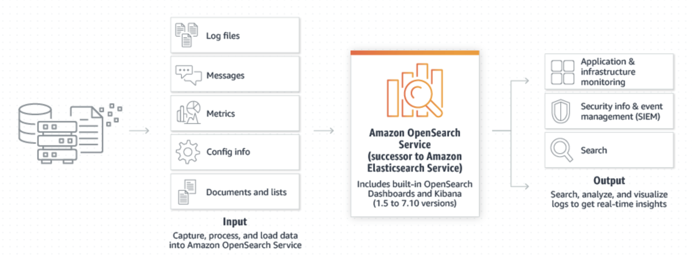

 [Conteudo Geral AWS Cloud][1]

[1]: https://github.com/weder96/aws-certification-learning

# Módulo 11: AWS Analytics Services

## Conteúdo
1. <a href="#section-1"> Amazon Elastic Map Reduce</a>
2. <a href="#section-2"> Amazona Athena</a>
3. <a href="#section-3"> AWS Glue</a>
4. <a href="#section-4"> Data Analysis and Query Use Cases</a>
5. <a href="#section-5"> Amazon Kinesis</a>
6. <a href="#section-6"> Kinesis Video Streams</a>
7. <a href="#section-7"> Kinesis Data Streams</a>
8. <a href="#section-8"> Kinesis Data Firehose</a>
9. <a href="#section-9"> Kinesis Data Analytics</a>
10. <a href="#section-10"> Amazon OpenSearch</a>

Existem vários serviços do AWS Analytics e incluem:

- Amazon Athena Amazon EMR 
- Amazon CloudSearch 
- Amazon Opensearch Service 
- Amazon Kinesis 
- Amazon QuickSight 
- Amazon Data Pipeline 
- AWS Glue 
- AWS Lake Formation 
- Amazon MSK 

Abaixo, teremos uma analise de cada um, pois esses são os serviços com maior probabilidade
Você também pode querer seguir os links para os outros serviços e ler para entender o que eles são em alto nível.
Porem aqui tentaremos fazer uma explanação de cada um e suas vantagens e também as suas desvantagens, bem como os links
para você se aprofundar mais.

##  **1 - Amazon Elastic Map Reduce**
O Amazon EMR é um serviço da web que permite que empresas, pesquisadores, analistas de dados e desenvolvedores processem grandes quantidades de dados de maneira fácil e econômica.

O EMR utiliza uma estrutura do Hadoop hospedada em execução no Amazon EC2 e no Amazon S3.

Estrutura gerenciada do Hadoop para processar grandes quantidades de dados.

Também suporta Apache Spark, HBase, Presto e Flink.

Mais comumente usado para análise de log, análise financeira ou atividades de extração, tradução e carregamento (ETL).

Um Step é uma tarefa programática para realizar algum processo nos dados (por exemplo, contar palavras).

Um cluster é uma coleção de instâncias do EC2 provisionadas pelo EMR para executar suas etapas.

O EMR usa o Apache Hadoop como seu mecanismo de processamento de dados distribuído, que é uma estrutura de software Java de código aberto que oferece suporte a aplicativos distribuídos com uso intenso de dados executados em grandes clusters de hardware comum.

O EMR é um bom lugar para implantar o Apache Spark, um processamento distribuído de código aberto usado para cargas de trabalho de big data que utiliza cache na memória e execução otimizada de consultas.

Você também pode iniciar clusters Presto. Presto é um mecanismo de consulta SQL distribuído de código aberto projetado para consultas analíticas rápidas em grandes conjuntos de dados.

O EMR inicia todos os nós de um determinado cluster na mesma zona de disponibilidade do Amazon EC2.

Você pode acessar o Amazon EMR usando o AWS Management Console, Command Line Tools, SDKS ou a API do EMR.

Com o EMR, você tem acesso ao sistema operacional subjacente (você pode usar o SSH).

##  **2 - Amazona Athena**
O Amazon Athena é um serviço de consulta interativa que facilita a análise de dados no Amazon S3 usando SQL padrão.

O Athena não tem servidor, portanto, não há infraestrutura para gerenciar e você paga apenas pelas consultas executadas.

O Athena é fácil de usar – basta apontar para seus dados no Amazon S3, definir o esquema e começar a consultar usando SQL padrão.

O Amazon Athena usa o Presto com suporte total a SQL padrão e funciona com vários formatos de dados padrão, incluindo CSV, JSON, ORC, Apache Parquet e Avro.

Embora o Amazon Athena seja ideal para consultas rápidas e ad-hoc e se integre ao Amazon QuickSight para facilitar a visualização, ele também pode lidar com análises complexas, incluindo grandes junções, funções de janela e arrays.

O Amazon Athena usa um catálogo de dados gerenciado para armazenar informações e esquemas sobre os bancos de dados e tabelas que você cria para seus dados armazenados no Amazon S3.

##  **3 - AWS Glue**
O AWS Glue é um serviço totalmente gerenciado, com pagamento conforme o uso, extração, transformação e carregamento (ETL) que automatiza as etapas demoradas de preparação de dados para análise.

O AWS Glue descobre e cria perfis automaticamente por meio do Glue Data Catalog, recomenda e gera código ETL para transformar seus dados de origem em esquemas de destino.

O AWS Glue executa os trabalhos de ETL em um ambiente Apache Spark totalmente gerenciado e escalável para carregar seus dados em seu destino.

O AWS Glue também permite configurar, orquestrar e monitorar fluxos de dados complexos.

Você pode criar e executar um trabalho ETL com apenas alguns cliques no Console de gerenciamento da AWS.

Use o AWS Glue para descobrir propriedades de dados, transformá-los e prepará-los para análises.

O Glue pode descobrir automaticamente dados estruturados e semiestruturados armazenados em data lakes no Amazon S3, data warehouses no Amazon Redshift e vários bancos de dados executados na AWS.

Ele fornece uma visão unificada dos dados por meio do Glue Data Catalog que está disponível para ETL, consulta e geração de relatórios usando serviços como Amazon Athena, Amazon EMR e Amazon Redshift Spectrum.

O Glue gera automaticamente código Scala ou Python para trabalhos de ETL que você pode personalizar ainda mais usando ferramentas com as quais já está familiarizado.

O AWS Glue não tem servidor, portanto, não há recursos de computação para configurar e gerenciar.

##  **4 - Data Analysis and Query Use Cases**
Serviços de consulta como Amazon Athena, data warehouses como Amazon Redshift e estruturas sofisticadas de processamento de dados como Amazon EMR, todos atendem a diferentes necessidades e casos de uso.

O Amazon Redshift oferece o desempenho de consulta mais rápido para relatórios corporativos e cargas de trabalho de business intelligence, principalmente aquelas que envolvem SQL extremamente complexo com várias junções e subconsultas.

O Amazon EMR torna simples e econômico executar estruturas de processamento altamente distribuídas, como Hadoop, Spark e Presto, em comparação com implantações locais. O Amazon EMR é flexível – você pode executar aplicativos e códigos personalizados e definir parâmetros específicos de computação, memória, armazenamento e aplicativos para otimizar seus requisitos analíticos.

O Amazon Athena oferece a maneira mais fácil de executar consultas ad-hoc para dados no S3 sem a necessidade de configurar ou gerenciar servidores.

A tabela abaixo mostra o caso de uso principal e as situações para usar alguns serviços de consulta e análise da AWS:

|AWS Service | Caso de uso principal | Quando usar |
|-------------|----------------------|-------------|
|Amazon Athena |Query  |Execute consultas interativas em dados diretamente no Amazon S3 sem se preocupar com a formatação de dados ou o gerenciamento da infraestrutura. Pode ser usado com outros serviços, como Amazon RedShift| 
|Amazon RedShift|Data Warehouse | Extrair dados de várias fontes, formatá-los e organizá-los, armazená-los e oferecer suporte a consultas complexas e de alta velocidade que produzem relatórios de negócios. |
|Amazon EMR | Processamento de dados   | Estruturas de processamento altamente distribuídas, como Hadoop, Spark e Presto. Execute uma ampla variedade de tarefas de processamento de dados em escala horizontal para aplicativos como aprendizado de máquina, análise de gráficos, transformação de dados, dados de streaming.| 
|AWS Glue | ETL Service | Transforme e mova dados para vários destinos. Usado para preparar e carregar dados para análise. A fonte de dados pode ser S3, RedShift ou outro banco de dados. O Glue Data Catalog pode ser consultado pelo Athena, EMR e RedShift Spectrum|

##  **5 -  Kinesis**
O Amazon Kinesis facilita a coleta, o processamento e a análise de dados de streaming em tempo real para que você possa obter insights oportunos e reagir rapidamente a novas informações.

- Coleta de serviços para processamento de fluxos de vários dados.
- Os dados são processados ​​em “fragmentos(Shards)”.
- Existem **quatro tipos de serviço do Kinesis**, detalhados abaixo.

##  **6 - Kinesis Video Streams**
O Kinesis Video Streams facilita o streaming de vídeo com segurança de dispositivos conectados para a AWS para análise, machine learning (ML) e outros processamentos.

Armazena, criptografa e indexa de forma durável os fluxos de dados de vídeo e permite o acesso aos dados por meio de APIs fáceis de usar.
- Os produtores fornecem fluxos de dados.
- Armazena dados por 24 horas por padrão, até 7 dias.
- Os consumidores recebem e processam dados.
- Pode ter vários fragmentos em um fluxo.
- Suporta criptografia em repouso com criptografia do lado do servidor (KMS) com uma chave mestra do cliente

##  **7 - Kinesis Data Streams**

O Kinesis Data Streams permite criar aplicativos personalizados que processam ou analisam dados de streaming para necessidades especializadas.

O Kinesis Data Streams permite o processamento em tempo real de streaming de big data.

O Kinesis Data Streams é útil para mover dados rapidamente dos produtores de dados e processá-los continuamente.

O Kinesis Data Streams armazena dados para processamento posterior por aplicativos (diferença principal com o Firehose, que entrega dados diretamente aos serviços da AWS).

Os casos de uso comuns incluem:
- Registro acelerado e ingestão de feed de dados.
- Métricas e relatórios em tempo real.
- Análise de dados em tempo real.
- Processamento de fluxo complexo.

##  **8 - Kinesis Data Firehose**
O Kinesis Data Firehose é a maneira mais fácil de carregar dados de streaming em armazenamentos de dados e ferramentas de análise.

Captura, transforma e carrega dados de streaming.

Permite análises quase em tempo real com ferramentas e painéis de inteligência de negócios existentes.

O Kinesis Data Streams pode ser usado como fonte(s) do Kinesis Data Firehose.

Você pode configurar o Kinesis Data Firehose para transformar seus dados antes de entregá-los.

Com o Kinesis Data Firehose, você não precisa escrever um aplicativo nem gerenciar recursos.

O Firehose pode agrupar, compactar e criptografar dados antes de carregá-los.

O Firehose replica dados de forma síncrona em três AZs à medida que são transportados para os destinos.

Cada fluxo de entrega armazena registros de dados por até 24 horas.

##  **9 - Kinesis Data Analytics**
O Amazon Kinesis Data Analytics é a maneira mais fácil de processar e analisar dados de streaming em tempo real.

Pode usar consultas SQL padrão para processar streams de dados do Kinesis.

Fornece análise em tempo real.
Casos de uso:
- Gere análises de séries temporais.
- Alimente painéis em tempo real.
- Crie alertas e notificações em tempo real.
- Crie e execute rapidamente código SQL poderoso em fontes de streaming.

Pode ingerir dados do Kinesis Streams e do Kinesis Firehose.

Saída para S3, RedShift, Elasticsearch e Kinesis Data Streams.

Fica sobre o Kinesis Data Streams e o Kinesis Data Firehose.

##  **10 - Amazon OpenSearch**

O Amazon OpenSearch Service é o sucessor do Amazon Elasticsearch Service.

O Amazon OpenSearch Service é um pacote de pesquisa e análise distribuído de código aberto baseado no Elasticsearch.

O Elasticsearch é um mecanismo distribuído de pesquisa e análise desenvolvido no Apache Lucene.

O Elasticsearch é um mecanismo de pesquisa popular comumente usado para casos de uso de análise de log, pesquisa de texto completo, inteligência de segurança, análise de negócios e inteligência operacional.

Com o OpenSearch, você pode realizar análises de logs de forma interativa, realizar monitoramento de aplicativos em tempo real, pesquisa de sites, análise de métricas de desempenho e muito mais.

Você pode escolher entre uma variedade de opções de mecanismo de código aberto para seu cluster OpenSearch.

As opções incluem a versão mais recente do OpenSearch e muitas versões do ALv2 Elasticsearch.

   

### **Deployment and Monitoring**

Um cluster OpenSearch pode ser criado usando o AWS Management Console, API ou AWS CLI.

Especifique o número de instâncias, tipos de instância e opções de armazenamento.

As atualizações in-loco podem ser executadas sem tempo de inatividade.

Fornece monitoramento e alertas integrados com notificações automáticas.

Você pode configurar alertas usando os painéis Kibana ou OpenSearch e a API REST.

As notificações podem ser enviadas por meio de webhooks personalizados, Slack, Amazon SNS e Amazon Chime.

O serviço OpenSearch oferece suporte a vários idiomas de consulta, como:

**Linguagem Específica de Domínio (DSL).**
- Consultas SQL com OpenSearch SQL.
- Linguagem de processamento canalizado OpenSearch (PPL).

**O OpenSearch integra-se a ferramentas de código aberto, incluindo:**
- Logstash.
- OpenTelemetry.
- APIs do ElasticSearch.

### **OpenSearch em uma Amazon VPC**

Os domínios do OpenSearch Services podem ser executados em uma Amazon VPC.

O uso de uma VPC permite a comunicação segura entre o OpenSearch Service e outros serviços na VPC.

Veja a seguir algumas das diferenças entre os domínios VPC e os domínios públicos.
- Por causa de seu isolamento lógico, os domínios que residem em uma VPC têm uma camada extra de segurança em comparação com domínios que usam endpoints públicos.
- Embora os domínios públicos sejam acessíveis de qualquer dispositivo conectado à Internet, os domínios VPC exigem alguma forma de VPN ou proxy.
- Comparados aos domínios públicos, os domínios VPC exibem menos informações no console. Especificamente, a guia de integridade do cluster não inclui informações de estilhaços e a guia Índices não está presente.
- Os endpoints de domínio assumem formas diferentes (https://search-domain-name vs. https://vpc-domain-name).
- Você não pode aplicar políticas de acesso baseadas em IP a domínios que residem em uma VPC porque os grupos de segurança já impõem políticas de acesso baseadas em IP.

**Observe as seguintes limitações:**
- Se você iniciar um novo domínio em uma VPC, não poderá alterná-lo posteriormente para usar um endpoint público. O contrário também é verdade.
- Você pode iniciar seu domínio em uma VPC ou usar um endpoint público, mas não pode fazer as duas coisas.
- Você não pode iniciar seu domínio em uma VPC que usa locação dedicada. Você deve usar uma VPC com locação definida como Padrão.
- Depois de colocar um domínio em uma VPC, você não pode movê-lo para uma VPC diferente, mas pode alterar as configurações de sub-redes e grupos de segurança.
- Para acessar a instalação padrão do OpenSearch Dashboards para um domínio que reside em uma VPC, os usuários devem ter acesso à VPC.

### **The ELK Stack**
ELK é um acrônimo que descreve uma combinação popular de projetos: Elasticsearch, Logstash e Kibana.

A pilha ELK oferece a capacidade de agregar logs de todos os seus sistemas e aplicativos, analisar esses logs e criar visualizações.

O ELK é útil para visualizar dados de monitoramento de aplicativos e infraestrutura, solução de problemas, análise de segurança e muito mais.

### **Segurança**
Os domínios do serviço OpenSearch oferecem criptografia de dados em repouso.

Usa o AWS KMS para armazenamento e gerenciamento de chaves de criptografia.

A criptografia usa AES-256.

A criptografia também criptografa as comunicações nó a nó usando TLS 1.2.

A criptografia de nó a nó é opcional e pode ser habilitada por meio do console, CLI ou API.

Depois que a criptografia de nó a nó é habilitada, ela não pode ser desabilitada. Em vez disso, você deve criar um novo domínio a partir de um instantâneo sem essa configuração habilitada.

O Amazon OpenSearch Service oferece suporte a três tipos de políticas de acesso:
- Políticas baseadas em recursos
- Políticas baseadas em identidade
- Políticas baseadas em IP

O controle de acesso refinado oferece recursos adicionais no Amazon OpenSearch Service.

**O controle de acesso refinado oferece os seguintes benefícios:**
- Controle de acesso baseado em função.
- Segurança no nível de índice, documento e campo.
- Multilocação do OpenSearch Dashboards.
- Autenticação básica HTTP para painéis OpenSearch e OpenSearch.

O OpenSearch Service oferece suporte à autenticação por meio de SAML e Amazon Cognito.
