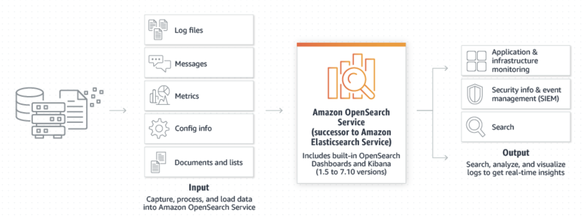
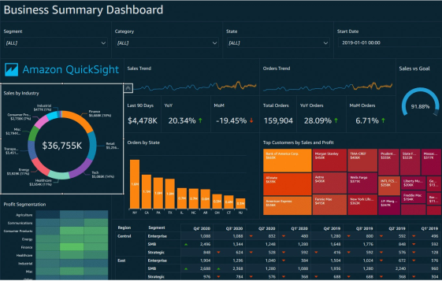

 [General Content AWS Cloud][1]

[1]: https://github.com/weder96/aws-certification-learning

# Module 11: AWS Analytics Services

## Contents
1.  <a href="#section-01"> Amazon Elastic Map Reduce (Amazon EMR)</a>
2.  <a href="#section-02"> Amazona Athena</a>
3.  <a href="#section-03"> AWS Glue</a>
4.  <a href="#section-04"> Data Analysis and Query Use Cases</a>
5.  <a href="#section-05"> Amazon Kinesis</a>
6.  <a href="#section-06"> Amazon Kinesis Video Streams</a>
7.  <a href="#section-07"> Amazon Kinesis Data Streams</a>
8.  <a href="#section-08"> Amazon Kinesis Data Firehose</a>
9.  <a href="#section-09"> Amazon Kinesis Data Analytics</a>
10. <a href="#section-10"> Amazon OpenSearch </a>
11. <a href="#section-11"> Amazon Data Exchange </a>
12. <a href="#section-12"> Amazon Data Pipeline </a>
13. <a href="#section-13"> Amazon CloudSearch </a>
14. <a href="#section-14"> Amazon Lake Formation </a>
15. <a href="#section-15"> Amazon QuickSight </a>
16. <a href="#section-16"> Amazon RedShift </a>
17. <a href="#section-17"> Amazon Managed Streaming for Apache Kafka(MSK)</a>
18. <a href="#section-18"> # Amazon Managed Service for Apache Flink </a>
------------------------------------------------------------------------------------------------------------------------

There are several AWS Analytics services and they include:

- Amazon Athena 
- Amazon Data Exchange
- Amazon Data Pipeline
- Amazon Amazon Elastic Map Reduce(Amazon EMR)
- Amazon Glue
- Amazon Kinesis
- Amazon Lake Formation
- Amazon Managed Streaming for Apache Kafka (Amazon MSK)
- Amazon OpenSearch Service (Amazon Elasticsearch Service)
- Amazon QuickSight
- Amazon Redshift

Below, we will have an analysis of each one, as these are the services most likely
You may also want to follow the links to the other services and read on to understand what they are at a high level.
But here we will try to explain each one and its advantages and also its disadvantages, as well as the links
for you to delve deeper.

------------------------------------------------------------------------------------------------------------------

##  **01 - Amazon Elastic Map Reduce**

**Definitions**

Amazon EMR is a web service that enables companies, researchers, data analysts, and developers to process large amounts of data easily and cost-effectively.

EMR uses a hosted Hadoop framework running on Amazon EC2 and Amazon S3.

Managed Hadoop framework for processing large amounts of data.

It also supports Apache Spark, HBase, Presto and Flink.

Most commonly used for log analysis, financial analysis, or extract, translate, and load (ETL) activities.

A Step is a programmatic task to perform some process on the data (eg count words).

A cluster is a collection of EC2 instances provisioned by EMR to run its steps.

EMR uses Apache Hadoop as its distributed data processing engine, which is an open source Java software framework that supports data-intensive distributed applications running on large clusters of common hardware.

EMR is a good place to deploy Apache Spark, an open source distributed processing used for big data workloads that utilizes in-memory caching and optimized query execution.

You can also start Presto clusters. Presto is an open source distributed SQL query engine designed for fast analytical queries on large datasets.

EMR starts all nodes in a given cluster in the same Amazon EC2 Availability Zone.

You can access Amazon EMR using the AWS Management Console, Command Line Tools, SDKS, or the EMR API.

With EMR you have access to the underlying operating system (you can use SSH).

### Amazon EMR

Amazon EMR (Elastic MapReduce) is a fully managed cloud service designed to simplify the deployment, configuration, and operation of big data frameworks like **Apache Hadoop, Apache Spark,** and other open-source data processing tools on AWS. EMR allows organizations to process vast amounts of data quickly, cost-effectively, and at scale, using **Amazon EC2 instances** that can be dynamically adjusted to meet specific workloads.

One of the most common use cases for Amazon EMR is running **Apache Spark jobs** to process and analyze large datasets. EMR’s integration with **Apache Spark** enables efficient data processing for tasks such as **data transformation, ETL, and machine learning model training**.

For transaction-based analytics, **Delta Lake** can be used in conjunction with Amazon EMR. Delta Lake provides ACID transaction support, scalable metadata handling, and time travel (bi-temporal querying), enabling powerful and reliable data lake architectures.

### Key Features

- **Managed Big Data Frameworks**: EMR makes it easy to run distributed computing frameworks like **Apache Hadoop, Apache Spark, Apache Hive, Apache HBase, and others**. These frameworks are essential for processing massive datasets across large clusters, and EMR manages the complexity of deploying and maintaining them.

- **Scalable Infrastructure**: Amazon EMR allows you to resize clusters dynamically based on your workload. Whether you're processing a small dataset or performing complex analytics on petabytes of data, you can scale your clusters up or down to optimize both performance and cost.

- **Cost Efficiency**: With EMR, you only pay for the resources you use while your jobs are running, making it cost-efficient for a wide range of use cases. Additionally, AWS Graviton-based instances offer a price-performance advantage, delivering up to 40% better performance for certain types of workloads compared to traditional x86 instances.

- **Integrated with AWS Ecosystem**: Amazon EMR integrates seamlessly with other AWS services like Amazon S3 (for storage), Amazon RDS (for relational databases), AWS Glue (for data cataloging), and Amazon Redshift (for analytics). This allows for an end-to-end solution for big data processing and analytics in the cloud.

### Cluster Architecture

An Amazon EMR cluster consists of different types of nodes, each serving specific purposes in data processing:

1. **Master Node**:
   - The master node manages the entire EMR cluster by running the necessary software to coordinate the distribution of tasks and data. It is responsible for task assignment, failure recovery, and managing cluster health. **It does not participate in data storage or computation.**

2. **Core Nodes**:
   - Core nodes store data and perform the computational tasks needed for data processing. These nodes are vital for both **storage** and **computation**, and they ensure that the data is replicated and available during the cluster’s lifetime.

3. **Task Nodes (Optional)**:
   - Task nodes are optional nodes that serve to augment the cluster’s processing capacity. Unlike core nodes, task nodes **do not store data** but are dedicated to executing tasks assigned by the master node. Task nodes are ideal for **scaling computation** when workloads demand additional resources. They can also be provisioned as **spot instances**, offering further cost savings.

### Storage Options

EMR supports several storage options to store input data, output data, and logs. Choosing the right file system depends on the specific needs of your application and the longevity of the data.

1. **Hadoop Distributed File System (HDFS)**:
   - HDFS is a distributed, scalable file system designed to store large data sets reliably. It splits data into blocks (typically 128MB) and replicates those blocks across different instances in the cluster, ensuring redundancy. However, one key disadvantage of HDFS is that it uses **ephemeral storage**; when the cluster terminates, the data is lost. This makes HDFS ideal for temporary or intermediate storage during data processing tasks.

2. **EMR File System (EMRFS)**:
   - EMRFS is an implementation of the Hadoop file system that allows Amazon EMR to read and write data directly to **Amazon S3**. This provides a highly durable, cost-effective storage solution, as **Amazon S3** offers **persistent storage**, and your data remains intact even if the EMR cluster is terminated. **EMRFS** enables you to store large amounts of data without worrying about data loss.

3. **Local File System**:
   - The local file system refers to the local disk attached to the EC2 instances used in the EMR cluster. This is **ephemeral storage**, meaning data is lost when the instance is terminated. It is often used for caching or storing temporary data during the processing phases of a job.

### External Metastores

By default, Hive stores its metastore information in a **MySQL** database located on the primary node’s file system. However, when the cluster is terminated, the primary node and its data are lost, including the metastore. To ensure the persistence of your metastore, it is recommended to use an **external metastore** that survives the termination of the cluster.

Options for an external metastore:

1. **AWS Glue Data Catalog**:
   - The AWS Glue Data Catalog is a fully managed, scalable metadata repository that allows you to store your Hive metastore outside the EMR cluster. It also integrates with various other AWS services like Amazon Athena and Amazon Redshift, making it an ideal solution for managing metadata in a cloud-native environment.

2. **Amazon RDS or Amazon Aurora**:
   - Alternatively, you can use Amazon RDS or Amazon Aurora to host your external Hive metastore. These managed database services offer high availability, durability, and scalability, which are crucial for storing large volumes of metadata.

When adding data directly to the file system (like HDFS or S3) without updating the Hive metastore, Hive might not recognize new partitions. In such cases, you can run the `MSCK REPAIR TABLE` command to synchronize the metadata with the actual data layout in the file system.

- **MSCK REPAIR TABLE**: This command scans the file system for new partitions added after table creation. It compares the file system's partition structure with the metadata stored in the Hive metastore. If it detects new partitions, it adds them to the table metadata.

This is especially important for environments where new data is frequently added outside of Hive's normal partitioning system (e.g., batch processes that add files directly to HDFS or S3).

### Cluster Types: Transient vs Long-Running

Amazon EMR clusters can be categorized into two types, based on their operational lifespan and use case:

1. **Transient Clusters**:
   - Transient clusters are temporary clusters launched for specific, short-term tasks such as periodic batch processing, ETL (Extract, Transform, Load) jobs, or any job that completes within a defined time frame. Once the job completes, the cluster is automatically terminated. **Cost efficiency** is a significant advantage, as you only pay for the resources used during the job’s execution.

2. **Long-Running Clusters**:
   - Long-running clusters are designed to stay active over extended periods. These clusters are typically used for **interactive data analysis**, applications that require continuous access to processed data, or services that must be available at all times. While these clusters offer **continuous access** to your data and analytics tools, they incur ongoing costs for as long as the cluster remains active.

### Amazon EC2 Graviton

The AWS Graviton2 processors are custom-designed Arm-based processors that provide significant price-performance advantages for workloads in Amazon EC2. When used with Amazon EMR, Graviton2 instances offer up to **40% better price-performance** compared to equivalent x86-based EC2 instances. These processors are especially effective for data-intensive and cloud-native workloads, such as those typically found in big data processing tasks with Apache Spark and Hadoop.

For organizations seeking to reduce costs while maintaining high performance in their EMR clusters, using Graviton-powered instances can be a compelling alternative to traditional x86-based instances.

### Spark Memory Overhead

When running Apache Spark jobs, whether on Amazon EMR or another environment, it's important to be aware that Spark adds an overhead for memory allocation to both drivers and executors. This overhead is typically around **10%** of the requested memory.

- **Why the Overhead?** Spark needs additional memory for internal operations, such as handling shuffle operations, managing task execution, and other internal activities beyond just data processing tasks. This overhead ensures enough memory to support Spark's distributed processing framework effectively.

It is crucial to account for this overhead when configuring Spark jobs to avoid out-of-memory errors and ensure sufficient memory for Spark's operations.

### Amazon EMR Serverless

Amazon EMR Serverless offers a serverless option for running Spark and Hive applications, allowing you to focus purely on your workloads without the need to manage clusters. With EMR Serverless, you don’t need to provision, optimize, or scale clusters manually—AWS handles the infrastructure for you. This simplifies the operation of analytics applications using open-source frameworks like Apache Spark and Apache Hive.

### Troubleshooting

The **Spark UI** is an invaluable tool for troubleshooting and optimizing Spark jobs. It provides detailed information about the execution of each job, including metrics on task execution, memory usage, and executor performance. By analyzing this information, users can identify performance bottlenecks, pinpoint delays, and fine-tune job execution to improve overall efficiency.

**Cheat Sheets**

https://digitalcloud.training/amazon-emr/

https://tutorialsdojo.com/amazon-emr/

**References**

https://docs.aws.amazon.com/emr/latest/ManagementGuide

https://aws.amazon.com/emr/features

https://aws.amazon.com/emr/pricing

https://aws.amazon.com/emr/faqs

**Videos**

https://www.youtube.com/results?search_query=Amazon+EMR

**Hands On**

https://www.youtube.com/results?search_query=Amazon+EMR+Hands+on

------------------------------------------------------------------------------------------------------------------------
##  **02 - Amazon Athena**

**Definition**

Amazon Athena is an interactive query service that makes it easy to analyze data in Amazon S3 using standard SQL.

Athena is serverless, so there is no infrastructure to manage and you only pay for the queries you run.

Athena is easy to use – just point to your data in Amazon S3, define the schema and start querying using standard SQL.

Amazon Athena uses Presto with full support for standard SQL and works with many standard data formats, including CSV, JSON, ORC, Apache Parquet,(built on Presto) and Avro.

While Amazon Athena is ideal for fast, ad-hoc queries and integrates with Amazon QuickSight for easy visualization, it can also handle complex analysis, including large joins, window functions, and arrays.

Amazon Athena uses a managed data catalog to store information and schemas about the databases and tables you create for your data stored in Amazon S3.

Pricing: $5.00 per TB of data scanned

Use compressed or columnar data for cost-savings (less scan)

Use cases: Business intelligence / analytics / reporting, analyze & query VPC Flow Logs, ELB Logs, CloudTrail trails, etc...

Exam Tip: analyze data in S3 using serverless SQL, use Athena

### Amazon Athena

Amazon Athena is a serverless interactive query service that simplifies data analysis by allowing users to run SQL queries directly on data stored in Amazon Simple Storage Service (S3). Athena is highly scalable and cost-effective, enabling querying of large datasets without the need for complex infrastructure or resource management.

Athena allows you to execute ad-hoc SQL queries on your S3 data using standard SQL syntax. By simply pointing Athena at your S3 data and running queries, you can quickly analyze large datasets and obtain results in seconds. Athena automatically scales based on data volume and query complexity, and you only pay for the data scanned.

A key feature of Athena is its integration with **AWS Glue**, which facilitates seamless data integration and metadata management. When data is cataloged by AWS Glue crawlers, metadata such as table definitions, schema, and location are stored in the AWS Glue Data Catalog. This enables Athena to understand the data's format (e.g., CSV, Parquet, ORC) and query it efficiently.

### Supported Data Formats

One of the strengths of Amazon Athena is its support for a wide variety of data formats. This flexibility allows users to analyze data in many forms, whether it’s structured, semi-structured, or unstructured. Below are the most commonly used formats supported by Athena:

1. **CSV and TSV**: These are simple, text-based formats that are widely used and easy to understand. While CSV (Comma-Separated Values) and TSV (Tab-Separated Values) are not the most efficient for very large datasets due to their lack of indexing and compression, they are still a popular choice for smaller datasets and quick data exchanges. However, for larger datasets, these formats can lead to longer query times and higher storage costs.

2. **JSON**: JSON (JavaScript Object Notation) allows for the storage of unstructured or semi-structured data, such as logs, events, or configuration files. One of the key features of JSON is its ability to store nested data, making it suitable for representing complex hierarchical structures. Athena natively supports querying nested JSON data directly, which means you can parse and filter data within these nested structures without needing to transform it into a flat schema first.

3. **Parquet and ORC**: Both Parquet and ORC (Optimized Row Columnar) are columnar storage formats that significantly improve query performance by allowing Athena to scan only the relevant columns of data. This reduces the amount of data scanned and, by extension, lowers the associated query costs. These formats are highly splittable, meaning they can be processed in parallel, making them ideal for large-scale data analysis. The columnar nature of these formats makes them particularly well-suited for analytical workloads, such as aggregations, filtering, and scanning large datasets efficiently.

4. **Avro**: Avro is another splittable format that is well-suited for use cases involving data streams or datasets that evolve over time. It supports schema evolution, meaning that you can modify the structure of your data as your application or use case changes without needing to rewrite historical data. Avro is often used in streaming data systems, such as log data or Kafka streams, due to its compactness and ability to handle large volumes of data while maintaining schema consistency across the data pipeline.

### Use Cases

Athena’s flexibility in handling different data formats, combined with its serverless architecture, makes it suitable for a wide range of data analysis scenarios. Below are some key use cases where Athena provides clear benefits:

1. **Log Data and Cost Analysis**: Athena is commonly used to query and analyze log data, such as application logs, AWS CloudTrail logs, and VPC Flow Logs. It is particularly well-suited for troubleshooting, monitoring infrastructure, and understanding user behavior. Since logs are often stored in Amazon S3 in formats like JSON or CSV, Athena can be used to quickly run ad-hoc queries on this data without needing to move or pre-process it. This makes Athena ideal for operational use cases where you need quick insights into system behavior or performance issues.

2. **Cost and Usage Analysis**: Athena can be used to query data from AWS Cost and Usage Reports stored in S3, helping organizations optimize their cloud spending. This use case includes analyzing costs across different services, accounts, or resources, allowing businesses to monitor and control their AWS usage over time.

3. **Business Intelligence (BI) and Reporting**: Athena also plays a critical role in business intelligence and reporting workflows. It allows organizations to directly query data stored in Amazon S3, eliminating the need to transfer data into a traditional data warehouse. Athena can seamlessly integrate with BI tools such as Amazon QuickSight, Tableau, or Power BI, enabling teams to generate insights, reports, and dashboards directly from their S3-stored datasets.

4. **Data Lake Exploration**: Data lakes are often made up of large, unstructured, or semi-structured datasets, and Athena is an excellent tool for ad-hoc querying in such environments. It enables data scientists, analysts, and engineers to explore data lakes directly, without the need to load data into a more structured database or predefine a schema. This means that you can run flexible queries on diverse datasets—whether it’s raw data from IoT sensors, social media data, or customer behavior logs—without worrying about the upfront costs or effort of transforming and moving the data.

### Optimizing Queries and Reducing Costs

Athena charges are based on the data scanned by queries, at a rate of $5 per terabyte. To optimize costs, consider the following strategies:

- **Data Compression**: Compress datasets to reduce the amount of data scanned. Formats like Parquet and ORC are efficient for Athena as they are compact and columnar, enabling Athena to scan only the necessary columns.

- **Partitioning Data**: Partition data in S3 based on commonly queried columns (e.g., date, region) to scan only relevant partitions, improving performance and reducing costs. Athena performs better with fewer large files than with many small files.

- **CTAS (Create Table As Select)**: The CTAS operation allows you to create new tables from the results of a `SELECT` query, ideal for transforming data (e.g., converting CSV to Parquet or creating summary tables), reducing the need for future scans.

- **Query Result Reuse**: Reuse previously executed query results by setting an expiration time, which helps avoid re-scanning data for identical queries, particularly useful for regular reports or dashboards.

- **JSON SerDe Library**: Use the JSON SerDe library to parse JSON data, enabling Athena to create a table for querying structured JSON data.

### Enhancing Security and Access Control

Athena integrates with **AWS Identity and Access Management (IAM)** for fine-grained access control, allowing you to define who can query data and access specific S3 data. Additional security measures include S3 bucket policies, SSL encryption for data in transit, and encryption for data at rest using options like SSE-S3, SSE-KMS, or client-side encryption.

### User Defined Functions (UDFs)

Athena supports **User Defined Functions (UDFs)**, which allow you to create custom functions within AWS Lambda and invoke them in SQL queries. UDFs enable encapsulation of complex logic (e.g., geospatial indexing), extending Athena’s functionality beyond standard SQL operations.

### MSCK REPAIR TABLE

When partitions in Amazon S3 are added or modified, Athena’s metadata must be updated. The `MSCK REPAIR TABLE` command synchronizes table metadata with S3 data by scanning directories for new partitions, ensuring that queries include the latest data.

### Athena Workgroups

Athena **Workgroups** allow you to organize and manage query execution by segregating query history and user access into logical groups. Workgroups support data usage controls, query authorization, and cost management.

One of the most powerful features of workgroups is the ability to enforce cost controls by setting limits on the amount of data that can be scanned in a workgroup. When the limit is reached, Athena automatically stops executing queries until the next cycle or until the limit is increased. This helps prevent unexpected costs, making it easier to manage query budgets across different departments.

### Federated Queries for Real-Time Analytics

Athena supports **federated queries**, allowing you to query data across multiple sources, including Amazon RDS, Redshift, DynamoDB, and S3. This enables real-time analysis without the need for complex ETL processes or moving data between systems. Federated queries in Athena use SQL and PartiQL to integrate with different data sources, making it ideal for applications that require up-to-the-minute analysis from multiple databases.

### ACID Transactions

Athena now supports ACID (Atomicity, Consistency, Isolation, Durability) transactions, which ensure data integrity during complex workflows involving inserts, updates, deletes, and merges. This feature is enabled by integration with the AWS Glue Data Catalog and supports modern table formats such as Apache Iceberg.

Apache Iceberg is an open table format designed for large analytic datasets. It supports advanced data lake operations such as time travel queries, schema evolution, and record-level operations (insert, update, delete). With Athena’s support for Iceberg, you can view data as it existed at a specific point in time, modify schemas without interrupting ongoing queries, and even roll back to previous versions of your data.

However, implementing ACID transactions with Athena requires careful performance optimization. Operations like data optimization (using the OPTIMIZE command) and consolidation of small files into larger ones can help maintain performance while ensuring data consistency across operations.

### Amazon Athena Notebooks

Amazon Athena Notebooks provides an interactive environment where you can write and execute Apache Spark code using Python. These notebooks combine SQL queries, calculations, and visualizations in one place, making it easier to perform advanced analytics on your data. You can chain SQL queries, create complex transformations, and visualize the results, all within the same notebook.

For teams that need to perform iterative exploration or complex data manipulations, Athena Notebooks, coupled with Apache Spark, offers a powerful platform for data science workflows and analytics.

[Amazon Athena for Apache Spark | Notebooks](https://www.youtube.com/watch?v=Tkltri-9s7k)

[when-to-use-apache-spark-for-amazon-athena](https://medium.com/@bernardo.costa/quando-usar-o-apache-spark-para-amazon-athena-a6b6e7c05732)

[data-exploration-with-amazon-athena](https://github.com/aws-samples/data-exploration-with-amazon-athena)

**Cheat Sheets**

[digitalcloud.training](https://digitalcloud.training/amazon-athena/)

[https://tutorialsdojo.com/amazon-athena/](https://tutorialsdojo.com/amazon-athena/)

[AWS Knowledge Center Videos: How do I analyze my S3 logs using Athena?](https://www.youtube.com/watch?v=uoLsrKZha0E&t=9s)

**References:**

[https://docs.aws.amazon.com/athena/latest/ug/](https://docs.aws.amazon.com/athena/latest/ug/)

[https://aws.amazon.com/athena/features](https://aws.amazon.com/athena/features)

[https://aws.amazon.com/athena/pricing](https://aws.amazon.com/athena/pricing)

[https://aws.amazon.com/athena/faqs](https://aws.amazon.com/athena/faqs)

**Videos**

[https://www.youtube.com/results?search_query=Amazon+Athena](https://www.youtube.com/results?search_query=Amazon+Athena)

**Hands On**

[https://www.youtube.com/results?search_query=Amazon+Athena+hands+on](https://www.youtube.com/results?search_query=Amazon+Athena+hands+on)

------------------------------------------------------------------------------------------------------------------------
##  **03 - AWS Glue**

AWS Glue is a fully managed, pay-as-you-go, extract, transform, and load (ETL) service that automates the time-consuming steps of preparing data for analysis.

AWS Glue automatically discovers and profiles through the Glue Data Catalog, recommends and generates ETL code to transform your source data into target schemas.

AWS Glue runs your ETL jobs in a fully managed and scalable Apache Spark environment to load your data to your destination.

AWS Glue also lets you configure, orchestrate, and monitor complex data flows.

You can create and run an ETL job with just a few clicks from the AWS Management Console.

Use AWS Glue to discover data properties, transform it, and prepare it for analysis.

Glue can automatically discover structured and semi-structured data stored in data lakes on Amazon S3, data warehouses on Amazon Redshift, and multiple databases running on AWS.

It provides a unified view of data through the Glue Data Catalog which is available for ETL, querying and reporting using services such as Amazon Athena, Amazon EMR and Amazon Redshift Spectrum.

Glue automatically generates Scala or Python code for ETL jobs that you can further customize using tools you are already familiar with.

AWS Glue is serverless, so there are no compute resources to configure and manage.

### AWS Glue

AWS Glue is a fully managed ETL (Extract, Transform, and Load) service that simplifies data preparation for analytics. As organizations increasingly rely on large datasets for insights, efficient and scalable ETL processes are crucial. AWS Glue makes this process more accessible by automating key aspects, from writing ETL scripts to job scheduling and resource scaling, allowing users to focus more on the data itself rather than the underlying infrastructure. In this chapter, we will explore the core features of AWS Glue and its role in modern data processing workflows.

### Core Features

AWS Glue operates as a serverless ETL service built on top of Apache Spark, a widely-used distributed computing engine known for its robust capabilities in handling large-scale data processing. Spark’s advanced features are integrated into AWS Glue, allowing you to perform complex data transformations at scale.

The core function of AWS Glue is to automate and simplify the process of extracting, transforming, and loading data. AWS Glue eliminates the need for managing infrastructure, making it easy for developers and data engineers to build, maintain, and execute ETL jobs without worrying about server provisioning or management.

Key capabilities of AWS Glue include:

- **Automated ETL script generation**: AWS Glue automatically generates ETL code based on your data sources and transformation needs. This can significantly reduce development time.
- **Customizable ETL code**: Developers can write their own ETL scripts in Python (using PySpark) or Scala, giving them the flexibility to handle complex transformations or special use cases.
- **Scalability**: AWS Glue provides an auto-scaling environment that adjusts resource allocation based on the size and complexity of the data being processed.
- **Scheduling**: The service also includes a job scheduling feature, allowing ETL tasks to be automated and triggered either on a predefined schedule or in response to specific events, such as the arrival of new data.

These features allow AWS Glue to handle the complete ETL lifecycle—from data extraction and transformation to loading it into data stores such as Amazon S3, Amazon Redshift, or Amazon RDS.

### Resources

In AWS Glue, the computational power required to execute ETL jobs is measured in Data Processing Units (DPUs). Each DPU offers a combination of CPU, memory, and network capacity to handle tasks such as data transformation, movement, and execution of custom scripts. One DPU equals 4 vCPUs and 16 GB of memory.

When running ETL jobs, you are billed based on the number of DPUs consumed and the time it takes to process the data. AWS Glue automatically manages resource allocation and scaling, adjusting the number of DPUs needed to process your data efficiently. However, users can also manually specify the number of DPUs to use, providing control over job execution and resource consumption.

You can use the **Job Run Monitoring** section in the AWS Glue console to determine the appropriate DPU capacity needed. The job monitoring section of the AWS Glue console uses the results of previous job runs to specify the proper DPU capacity.

### DynamicFrames

A key feature of AWS Glue is its support for DynamicFrames, which extend the capabilities of Spark's DataFrame API. Unlike traditional DataFrames that require a predefined schema, DynamicFrames are designed to handle complex and semi-structured data formats such as JSON, XML, and CSV—common in data lakes.

DynamicFrames automatically manage schema changes, including nested structures and arrays, which are typically difficult to handle with standard DataFrames. This flexibility makes DynamicFrames ideal for ETL processes where the input data schema is not known in advance or changes frequently. They allow data engineers to focus on transforming data without needing to flatten complex structures or manually adjust schemas.

### Job Bookmarks

AWS Glue introduces a feature called Job Bookmarks, which tracks the state of ETL jobs between executions. This feature is particularly useful for managing incremental loads—ensuring that only new or changed data is processed, without reprocessing data that has already been handled. By keeping track of processed data, job bookmarks enable more efficient workflows and reduce computational costs, especially when dealing with large datasets.

### Data Quality

AWS Glue Data Quality is a feature designed to ensure the integrity and cleanliness of data processed in ETL jobs. By integrating data quality checks directly into the ETL workflow, Glue enables the automatic detection and correction of common data issues like missing values, duplicates, or inconsistencies.

With Glue Data Quality, you can define custom rules for data validation and use built-in metrics, alerts, and visualizations to monitor the health of your data pipeline. This ensures that the data feeding into your analytics platforms is accurate, reliable, and trustworthy, which is essential for business intelligence and decision-making.

### Streaming Data

AWS Glue also supports streaming ETL jobs, allowing you to process data in real-time as it arrives. By integrating with streaming data sources such as Amazon Kinesis, Apache Kafka, and Amazon MSK (Managed Streaming for Apache Kafka), AWS Glue can cleanse, transform, and load streaming data into Amazon S3 or other data stores.

For example, streaming ETL jobs can be used to process web server logs and transform the data for analysis within a minute of arrival. This real-time processing capability is critical for time-sensitive analytics, such as monitoring application performance or tracking user activity.

### Security and Data Protection

Security is a key consideration in AWS Glue. It offers encryption both at rest and in transit. The AWS Glue Data Catalog, which stores metadata related to ETL jobs, uses AWS Key Management Service (KMS) to manage encryption keys. Additionally, the data output by ETL jobs—whether stored in Amazon S3, Amazon Redshift, or Amazon RDS—is encrypted according to the security mechanisms of the target service. For example, Amazon S3 supports server-side encryption options like S3-managed keys (SSE-S3), KMS-managed keys (SSE-KMS), and customer-provided keys (SSE-C).

AWS Glue can also be deployed within Amazon Virtual Private Cloud (VPC) for enhanced security. By operating within a VPC, AWS Glue resources can access data and services privately, without requiring public internet access.

AWS Glue's built-in capabilities for connecting to various data sources via JDBC/ODBC with the secure management of credentials using AWS Secrets Manager. This approach ensures both efficiency in connectivity and security in credential management.

### AWS Glue Crawlers

AWS Glue Crawlers are an integral part of the service, providing automated schema discovery and metadata cataloging. Crawlers scan data stored in Amazon S3 (or other data sources), infer schema, and create or update tables in the Glue Data Catalog. Crawlers can handle various file formats, including CSV, JSON, Parquet, and others, and can detect partitions, which help improve query performance.

Scheduling crawlers to run at regular intervals ensures that the Glue Data Catalog is up-to-date with the latest data changes. Crawlers are also capable of detecting schema changes, which is essential for managing evolving datasets.
With AWS Glue Catalog resource policies, you can define fine-grained access to the AWS Glue data catalog by using resource-level permissions in IAM policies. These policies can restrict access to different portions of the catalog based on users, roles, or applied at a resource level. This allows you to provide granular control over which users can access the various metadata definitions in your data lake.

In addition, it’s important to note that the AWS Glue Data Catalog policies define the access to the metadata, and the S3 policies define the access to the content itself. You can restrict which metadata operations can be performed, such as e `GetDatabases`, `GetTables`, `CreateTable`, and others, using identity-based policies (IAM). You can also restrict which data catalog objects those operations are performed on.

The Glue Data Catalog stores metadata tables that can be used to maintain data lineage, offering detailed insights into data sources, transformations, and targets.

### Advanced Features and Functionalities

### 1. AWS Glue Workflows

AWS Glue Workflows is an orchestration service for managing complex ETL processes. Workflows allow users to visually define and manage the sequence of ETL jobs, crawlers, and triggers. You can specify dependencies between tasks to ensure jobs execute in the correct order.

Workflows are ideal for situations where multiple ETL tasks need to be executed in sequence or based on specific conditions. This feature simplifies management of intricate data pipelines, offering both programmatic and visual interfaces. Workflows are deeply integrated with the AWS Glue Data Catalog.

### 2. Schema Management with AWS Glue Schema Registry

For streaming data, AWS Glue provides the Schema Registry, which ensures that data flowing through streams (e.g., Amazon Kinesis or Apache Kafka) adheres to a defined schema. The Schema Registry allows for version control of schema definitions, ensuring consistent data formats even as data evolves. It also helps maintain data quality by validating incoming records against the schema and enabling data producers and consumers to agree on the data structure.

To use the schema registry, you first define the schema for your data. Once the schema is defined, you can configure your producers and consumers to validate records against the schema definition using AWS Glue Schema Registry APIs or through the Kinesis Producer Library (KPL) and Kinesis Client Library (KCL) libraries. This means that any time a new record is added to the data stream, it will be checked against the schema to ensure it conforms to the defined format and structure. If the record does not meet the schema requirements, it can be rejected or transformed to conform to the schema before it is added to the data stream.

This capability is vital to maintaining consistent data formats as the structure of the data evolves. Such consistency is critical to avoid data processing failures or corruption, ensuring the streaming data's integrity remains intact.

### 3. AWS Glue for Ray and Interactive Sessions

AWS Glue also supports Ray, an open-source distributed computing framework, allowing for scaling Python-based ETL jobs in a highly parallelized environment. This is especially useful for machine learning and AI workloads that require significant computational power. You can use AWS Glue for Ray with Glue Studio Notebooks, SageMaker Studio Notebook, or a local notebook or IDE of your choice. This makes it a flexible and powerful tool for scaling Python workloads.

When running a Ray job, AWS Glue provisions the Ray cluster for you and runs these distributed Python jobs on a serverless auto-scaling infrastructure. This means you don’t have to worry about managing the underlying infrastructure, and you can focus on writing and running your Python workloads.

AWS Glue for Ray helps data engineers process large datasets using Python and popular Python libraries. AWS Glue for Ray uses Ray.io, an open-source unified compute framework that helps scale Python workloads from a single node to hundreds of nodes. AWS Glue for Ray is serverless, so there is no infrastructure to manage.

Additionally, AWS Glue Interactive Sessions allow developers to experiment and test their ETL scripts in real time, using an interactive Spark environment. This feature accelerates the development process by providing an on-demand Spark cluster where developers can build, run, and debug ETL transformations.

### 4. ResolveChoice

AWS Glue provides various built-in transformation functions to customize and optimize your ETL jobs. For example, the ResolveChoice transformation allows you to manage ambiguous or inconsistent data types that can arise when processing semi-structured data sources. This is especially useful when dealing with data where the type of a value might change from one record to another (e.g., a column that can contain both string and integer types). With `ResolveChoice`, you can:

- Cast values to a specific data type
- Create separate columns for each type
- Pack diverse values into a structured format or select a single type

These transformations simplify handling complex data issues and reduce manual interventions during ETL processes.

### 5. AWS Glue FindMatches ML Transform

The AWS Glue FindMatches ML transform is a machine learning-powered tool within the AWS Glue service that is adept at identifying and associating records referring to the same entity, even when a common unique identifier is absent. This can be particularly useful in scenarios where there are variations in data (e.g., misspellings, data formatting differences, or incomplete records) and no direct key exists to join them.

The process works through a "teaching" approach, where users manually label examples of matching and non-matching records. These labeled examples are then used by AWS Glue’s machine learning model to understand the patterns and relationships within the data. The model then applies these patterns to automatically detect matches in the remaining dataset.

### 6. AWS Glue Python Shell

AWS Glue Python Shell is an option within AWS Glue that is well-suited for light to medium data transformation tasks that do not require the full distributed computing capabilities of Spark or Ray. It provides a simpler, script-based approach for running ETL jobs using Python, making it ideal for tasks like data cleansing, simple transformations, and integration with other AWS services.

Python Shell jobs are more lightweight than Spark or Ray jobs, and they can be run without the overhead of managing a Spark cluster or a Ray environment. This makes the Python Shell a cost-effective and efficient choice for less resource-intensive jobs.

### 7. Sensitive Data Detection

AWS Glue Sensitive Data Detection is a built-in feature designed to help identify and manage sensitive information, such as personally identifiable information (PII). This feature uses pattern matching and machine learning algorithms to detect sensitive data within a dataset, helping ensure compliance with regulations like GDPR or HIPAA.

AWS Glue offers two ways to scan for sensitive data:

1. **Detect PII in each row**: Scans each row for patterns that match predefined PII formats (e.g., SSNs, credit card numbers).
2. **Detect PII in each column**: Scans entire columns to identify sensitive data.

In addition, you can specify the PII entities you want to detect and can either choose from predefined patterns (such as all available PII patterns) or define custom entities. You can also adjust the percentage of rows to sample during scanning, balancing between performance and accuracy.

Once sensitive data is identified, AWS Glue provides the ability to mask, remove, or replace PII data, enabling organizations to reduce risks associated with sensitive information while maintaining compliance.

### 8. Git Integration

AWS Glue supports Git integration within AWS Glue Studio, enabling version control for ETL jobs. Git integration allows you to:

- Sync AWS Glue jobs with repositories on platforms like GitHub, GitLab, or Bitbucket
- Push and pull jobs to AWS Glue Studio, supporting collaboration and version control
- Parameterize sources and targets in jobs, simplifying deployment across environments

This integration streamlines the development lifecycle for AWS Glue jobs by allowing for better code management and facilitating CI/CD (Continuous Integration/Continuous Deployment) pipelines. Developers can also test their jobs by pulling from specific branches or pushing changes to specific branches within their Git repositories.

### Best Practices and Optimization

### 1. Optimize Data Partitioning

One of the key strategies for optimizing ETL jobs in AWS Glue is effective data partitioning. When working with large datasets, organizing data into partitions (e.g., by date or region) can significantly reduce query times. AWS Glue supports partition projection, which speeds up queries in Amazon Athena by calculating partition values directly from table properties, rather than performing a time-consuming metadata lookup.

Apache Spark's performance can significantly degrade when dealing with a large number of small files. Each file in S3 is a separate object, and when Spark tries to read numerous small files, it incurs a lot of overhead in terms of network and metadata operations.

### 2. Efficient Data Transformation and Filtering

AWS Glue supports server-side filtering with partition predicates during the creation of DynamicFrames, allowing you to filter data at the partition level before loading it into memory. This reduces the amount of data processed and improves job performance.

Additionally, the Pivot transformation in AWS Glue is particularly useful for reshaping data, such as converting rows into columns for more efficient analytical queries.

### 3. Monitoring and Performance Optimization

AWS Glue integrates with Amazon CloudWatch for monitoring the performance of ETL jobs. CloudWatch provides insights into job execution metrics, helping data engineers identify performance bottlenecks, errors, or retries in the ETL pipeline. By analyzing CloudWatch logs and metrics, engineers can fine-tune their jobs and ensure optimal performance.

Analyzing AWS CloudWatch metrics and logs can provide insights into what part of the job is taking the longest, whether there are any errors or retries occurring, and if there are specific stages in the job (like certain transformations or data reads/writes) that are causing bottlenecks. This information is crucial to identify the root cause of the performance issue.

When you run a job, AWS Glue provides metrics such as the total number of actively running executors, the number of completed stages, and the number of maximum needed executors. These metrics can give you insights into whether your job is under-provisioned or over-provisioned. For example, if the number of maximum needed executors is significantly higher than the number of active executors, it indicates that the job is under-provisioned. In such a case, you can increase the maximum capacity job parameter, which effectively increases the number of DPUs allocated to the job.

### 4. Broadcast Joins

When performing data transformations, especially joins, in distributed environments like Apache Spark (which powers AWS Glue), it's crucial to minimize the amount of data shuffling between nodes. Shuffling occurs when Spark moves data across the network to perform operations like joins, and it can become a significant performance bottleneck when working with large datasets.

One effective technique to mitigate this issue is broadcast joins, a feature that Spark provides for optimizing joins between a large dataset and a smaller one.

A broadcast join is a type of join in Spark where the smaller DataFrame (or dataset) is broadcasted to all worker nodes. This means that the entire smaller DataFrame is loaded into memory on each node that is participating in the job.

### 5. Partition Indexes

AWS Glue partition indexes are crucial for optimizing data retrieval and reducing query processing times. When querying large datasets in AWS Glue, particularly those stored in Amazon S3 and cataloged in the AWS Glue Data Catalog, partitioning helps organize the data into smaller, manageable chunks. Without partition indexes, querying large tables becomes slow because the `GetPartitions` API would load all the partitions and then filter them based on the query expression, which can be time-consuming.

Partition indexes speed up this process by allowing the `GetPartitions` API to directly retrieve only the partitions that match the query's expression. This reduces the amount of data transferred and speeds up queries, making it an essential optimization for handling highly partitioned datasets.

### AWS Glue DataBrew

AWS Glue DataBrew is a data preparation tool designed to simplify the often complex tasks of profiling, cleaning, and normalizing data. Traditionally, these tasks would require coding knowledge and a deep understanding of data processing frameworks. However, with DataBrew, all of that is handled through a visual interface that allows users to perform tasks like identifying data anomalies, handling missing values, and transforming data for analysis or machine learning.

DataBrew integrates seamlessly with other AWS services, meaning you can easily work with data stored in Amazon S3, Amazon Redshift, Amazon RDS, and many other data sources. Since it is serverless, you don’t need to worry about provisioning or managing infrastructure. AWS automatically takes care of the scaling, ensuring that resources are allocated based on your data’s size and complexity.

### Key Features

- **Code-Free Data Preparation**: DataBrew's visual interface enables data cleaning, transformation, and validation through simple drag-and-drop actions. With over 250 pre-built transformations, users can prepare data without writing code, making DataBrew especially useful for data analysts who want to focus on business insights rather than programming or data engineering.

- **Data Profiling**: DataBrew offers automated data profiling, which analyzes datasets and provides summary statistics for each column. This includes value distributions, detection of missing or null values, and identification of duplicates or outliers, helping users understand their data before cleaning or transforming it.

- **Custom Data Quality Rules**: DataBrew allows users to create custom data quality rules to ensure datasets meet specific business requirements. Examples include rules to check for duplicates, validate column values within a certain range, or ensure uniqueness across multiple columns. These rules can be grouped into rule sets and applied during data profiling, with violations flagged for quick identification of data quality issues.

- **Anonymizing and Masking PII**: DataBrew helps protect personally identifiable information (PII) through tools for identifying, masking, and anonymizing sensitive data. Using machine learning and pattern recognition, DataBrew can detect PII such as names, phone numbers, and email addresses in datasets. Users can then apply built-in transformations to mask or anonymize this data to protect privacy.

[https://digitalcloud.training/aws-glue/](https://digitalcloud.training/aws-glue/)

[https://tutorialsdojo.com/aws-glue/](https://tutorialsdojo.com/aws-glue/)

**References:**

[https://aws.amazon.com/glue/faqs/](https://aws.amazon.com/glue/faqs/)

[https://docs.aws.amazon.com/glue/latest/dg/what-is-glue.html](https://docs.aws.amazon.com/glue/latest/dg/what-is-glue.html)

**AWS Glue Databrew**

AWS Glue DataBrew is a new visual data preparation tool that makes it easy for data analysts and data scientists to clean and normalize data to prepare it for analytics and machine learning. You can choose from over 250 pre-built transformations to automate data preparation tasks, all without the need to write any code. You can automate filtering anomalies, converting data to standard formats, and correcting invalid values, and other tasks. After your data is ready, you can immediately use it for analytics and machine learning projects. You only pay for what you use - no upfront commitment

[https://aws.amazon.com/glue/features/databrew/](https://aws.amazon.com/glue/features/databrew/)

**AWS Glue Elastic Views**

------------------------------------------------------------------------------------------------------------------------
##  **04 - Data Analysis and Query Use Cases**
Query services like Amazon Athena, data warehouses like Amazon Redshift, and sophisticated data processing frameworks like Amazon EMR all address different needs and use cases.

Amazon Redshift provides the fastest query performance for enterprise reporting and business intelligence workloads, particularly those involving extremely complex SQL with multiple joins and subqueries.

Amazon EMR makes it simple and cost-effective to run highly distributed processing frameworks such as Hadoop, Spark, and Presto compared to on-premises deployments. Amazon EMR is flexible – you can run custom applications and code and define specific compute, memory, storage, and application parameters to optimize your analytical requirements.

Amazon Athena provides the easiest way to run ad-hoc queries for data on S3 without having to configure or manage servers.

**The table below shows the main use case and situations for using some AWS query and analysis services:**

|AWS Service | Main use case | When to use |
|-------------|----------------------|-------------|
|Amazon Athena |Query |Run interactive queries on data directly in Amazon S3 without worrying about formatting the data or managing the infrastructure. Can be used with other services such as Amazon RedShift| 
|Amazon RedShift|Data Warehouse | Extract data from multiple sources, format and organize it, store it, and support complex, high-speed queries that produce business reports. |
|Amazon EMR | Data Processing | Highly distributed processing frameworks such as Hadoop, Spark and Presto. Perform a wide variety of data processing tasks at scale-out for applications such as machine learning, graph analysis, data transformation, streaming data.|
|AWS Glue | ETL Service | Transform and move data to multiple destinations. Used to prepare and load data for analysis. The data source can be S3, RedShift or another database. The Glue Data Catalog can be consulted by Athena, EMR and RedShift Spectrum|

------------------------------------------------------------------------------------------------------------------------
##  **05 - Kinesis**

**Definition**

Amazon Kinesis makes it easy to collect, process, and analyze streaming data in real time so you can gain timely insights and react quickly to new information.

- Collection services for processing streams of various data.
- Data is processed in “fragments(Shards)”.

### There are **four types of Kinesis service**, detailed below.

- **Kinesis Data Streams:** capture, process, and store data streams
- **Kinesis Data Firehose:** load data streams into AWS data stores
- **Kinesis Data Analytics:** analyze data streams with SQL or Apache Flink
- **Kinesis Video Streams:** capture, process, and store video streams

**Cheat Sheets**

https://tutorialsdojo.com/amazon-kinesis/

https://tutorialsdojo.com/kinesis-scaling-resharding-and-parallel-processing/

**References:**

https://docs.aws.amazon.com/streams/latest/dev/key-concepts.html

https://aws.amazon.com/kinesis/

https://docs.aws.amazon.com/kinesisvideostreams/latest/dg

https://aws.amazon.com/kinesis/video-streams/features/

https://aws.amazon.com/kinesis/video-streams/pricing/

https://aws.amazon.com/kinesis/video-streams/faqs/

https://docs.aws.amazon.com/streams/latest/dev/

https://aws.amazon.com/kinesis/data-streams/pricing/

https://aws.amazon.com/kinesis/data-streams/faqs/

https://docs.aws.amazon.com/firehose/latest/dev/

https://aws.amazon.com/kinesis/data-firehose/pricing/

https://aws.amazon.com/kinesis/data-firehose/faqs/

https://docs.aws.amazon.com/kinesisanalytics/latest/dev

https://docs.aws.amazon.com/kinesisanalytics/latest/java

https://aws.amazon.com/kinesis/data-analytics/features/

https://aws.amazon.com/kinesis/data-analytics/pricing/

https://aws.amazon.com/kinesis/data-analytics/faqs/

**Videos**

https://www.youtube.com/results?search_query=Amazon+Kinesis

**Hands On**

https://www.youtube.com/results?search_query=Amazon+Kinesis+hands+on

------------------------------------------------------------------------------------------------------------------------
##  **06 - Kinesis Video Streams**

**Definition**

Kinesis Video Streams makes it easy to securely stream video from device
those connected to AWS for analytics, machine learning (ML), and other processing.

Durably stores, encrypts and indexes video data streams and allows access to the data through easy-to-use APIs.
- Producers provide data streams.
- Stores data for 24 hours by default, up to 7 days.
- Consumers receive and process data.
- Can have multiple fragments in a stream.
- Supports encryption at rest with server-side encryption (KMS) with a client master key

------------------------------------------------------------------------------------------------------------------------
##  **07 - Kinesis Data Streams**

**Definition**

Kinesis Data Streams lets you build custom applications that process or analyze streaming data for specialized needs.

Kinesis Data Streams enables real-time processing of streaming big data.

Kinesis Data Streams is useful for quickly moving data from data producers and continuously processing it.

Kinesis Data Streams stores data for further processing by applications (key difference with Firehose, which delivers data directly to AWS services).

Common use cases include:
- Accelerated registration and data feed ingestion.
- Real-time metrics and reports.
- Real-time data analysis.
- Complex stream processing.

 Amazon Kinesis Data Streams

Amazon Kinesis Data Streams (KDS) is a powerful, scalable service for capturing, processing, and analyzing large volumes of streaming data in real-time. It is designed to handle gigabytes of data per second from sources such as clickstreams, social media feeds, and application logs, enabling applications to process data almost immediately for analytics or decision-making. This section delves into essential components, operational modes, producer and consumer integrations, and best practices for scaling Kinesis Data Streams.

### Architecture

- **Shards and Partitioning**
  - **Shards** are the fundamental unit of capacity in Kinesis Data Streams, each capable of handling 1 MB/second of data input and 2 MB/second of data output. A stream consists of one or more shards, and the total throughput capacity of a stream is determined by the number of shards it contains.
  - Data is partitioned across shards using a **partition key** assigned when writing records to the stream. Records with the same partition key are assigned to the same shard, preserving the order of records within each shard.

- **Service Modes**
  - **Provisioned Mode**: Ideal for predictable workloads, allowing users to define the number of shards upfront. This mode supports auto-scaling within predefined limits and requires regular monitoring and management to ensure optimal performance without over-provisioning or throttling.
  - **On-Demand Mode**: Best for unpredictable workloads, dynamically adjusting capacity based on incoming data volume, freeing users from managing shard counts. This mode is convenient for applications with variable or unknown data traffic patterns.

### Producers

When integrating with Amazon Kinesis Data Streams, AWS provides several tools and libraries, including the AWS SDK, the Kinesis Producer Library (KPL), and the Kinesis Agent.

- **AWS Software Development Kit (SDK)**:
  The AWS SDK is a set of libraries and tools available for various programming languages and platforms, allowing developers to interact with AWS services programmatically. For Amazon Kinesis Data Streams, the AWS SDK enables direct creation, configuration, and management of streams, as well as sending and receiving data records from applications.

  To insert data into a stream, you typically use the `PutRecord` or `PutRecords` API operations. **PutRecords** supports batching, which improves throughput and reduces data ingestion costs by allowing up to 500 records or 5MB of data (whichever comes first) to be sent in a single API call.

- **Kinesis Producer Library (KPL)**:
  The Kinesis Producer Library (KPL) is a high-level, easy-to-use library designed specifically for efficient batch insertion of large volumes of data records into a Kinesis Data Stream. Written in Java (with a native C++ core for performance), KPL is best suited for applications that require high-throughput data ingestion, where manually managing batching, buffering, and retry logic would be inefficient.

  The KPL simplifies the data-sending process to Kinesis Data Streams by offering built-in capabilities for efficient data batching, asynchronous operations for enhanced throughput, and automatic retry mechanisms to handle transmission failures. This makes it ideal for streaming clickstream data and server logs from Java applications, ensuring reliable, efficient data collection with minimal development effort.

  - **Synchronous and Asynchronous Publishing**:
    In KPL, data can be published either synchronously or asynchronously, with asynchronous publishing being the default and recommended mode. The **RecordMaxBufferedTime** parameter controls how long a record will be buffered (in milliseconds) before transmission to the Kinesis Data Stream. This buffering allows KPL to aggregate records into larger requests, optimizing network and throughput performance.

    - For applications sensitive to latency, a lower buffered time may be preferred to ensure near real-time data processing.
    - For applications prioritizing maximum throughput, increasing the buffered time can allow more records to aggregate per request, reducing API calls and potentially decreasing costs.

- **Kinesis Agent**:
  The Kinesis Agent is a pre-built, standalone Java application for Linux-based systems, providing a simple way to collect and send data to Kinesis Data Streams (and Kinesis Firehose) from files. The agent monitors files for changes, parses log entries, and automatically sends them to Kinesis Data Streams, handling tasks like file rotation, checkpointing, and retries. This setup simplifies the process of sending log data and metrics to Kinesis without requiring custom logging code.

### Consumers

Each data record in Kinesis Data Streams can be up to 1 MB in size. Each shard supports a read throughput of up to 2 MB per second, which is shared among all consumers accessing that shard. When multiple consumers access the same shard concurrently, they share this bandwidth, impacting data retrieval speed.

When retrieving data using the `GetRecords` API, a consumer can retrieve up to 10 MB of data in a single request from a shard. If a shard is polled less frequently, data accumulates in the shard, allowing larger batch retrievals (up to the 10 MB limit) per call. The **GetRecords call limit** is 5 calls per second per shard. Exceeding this rate triggers throttling and returns a `ProvisionedThroughputExceededException`. To avoid this, consider implementing a **backoff strategy**, where consumers pause and retry requests, especially during high-throughput periods.

### Kinesis Client Library (KCL)

The **Kinesis Client Library (KCL)** is designed for distributed stream processing, simplifying data retrieval from multiple shards and enabling effective load balancing and failure recovery.

- **Distributed Processing**: KCL automatically manages the coordination of data records across multiple shards. Each shard is processed in parallel by separate processors, referred to as “workers,” which run on consumer instances (e.g., EC2 instances or containers). KCL ensures that each shard is assigned to a single worker at any given time, maintaining efficient and balanced data processing.

- **Checkpointing**: One of KCL’s key features is checkpointing, which allows applications to track progress in processing the stream. By setting successful processing points, or “checkpoints,” within a shard, applications can resume from the last checkpoint in the event of a failure or restart. KCL uses DynamoDB to store checkpoints.
  - **Cost and Capacity Management**: Frequent checkpointing increases DynamoDB write operations, consuming more write capacity units (WCUs). Developers must balance the need for accurate checkpointing with the costs of DynamoDB usage to avoid exceeding provisioned throughput. Tuning the checkpoint frequency based on application needs helps control costs and maintain optimal performance.

### AWS Lambda Integration

AWS Lambda offers a serverless solution for consuming streaming data from Kinesis Data Streams. In this integration, Lambda automatically polls the Kinesis stream and processes new data as it becomes available.

- **Polling and Scaling**: Lambda continuously checks the stream and retrieves new records. It scales automatically based on the number of shards, with each Lambda invocation handling data from a single shard.
- **Parallel Processing**: The **Parallelization Factor** in Lambda allows multiple concurrent processes per shard, enhancing throughput for high-volume applications.
- **Event Source Mapping**: Lambda can be configured to trigger automatically when new records arrive in the Kinesis Data Stream using an event source mapping.
- **Dead-Letter Queue (DLQ)**: Configuring a DLQ in Lambda helps manage unprocessed events by storing them for later review, providing a failsafe for error handling in data processing.

These components and strategies allow consumers to retrieve and process data from Kinesis Data Streams efficiently, enabling applications to handle high-throughput and distributed workloads effectively.

### Scaling

- **Shard Splitting and Merging**
  - Shards in Kinesis Data Streams can be split to increase capacity or merged to reduce costs. Splitting a shard doubles the capacity for handling write and read operations, while merging combines two adjacent shards to save on resources when data volume decreases. Managing shard scaling effectively requires applications to handle data ordering across split and merged shards by processing all data from parent shards before the children.

  - One implication of splitting and merging shards is the potential impact on data ordering. Kinesis Data Streams guarantees the order of records within a shard, but this order can become complicated when shards are split or merged. When a shard is split, records that used to go to the parent shard based on their partition key will now be distributed to one of the two new child shards. To maintain data sequence integrity, applications should process all records from the parent shard before processing records from the child shards.

- **Enhanced Fan-Out**
  - By default, the 2MB/second/shard output is shared between all applications consuming data from the stream. **Enhanced Fan-Out** provides a dedicated 2 MB/sec read throughput per shard per registered consumer, avoiding throughput-sharing limits. This feature is critical for low-latency, high-throughput scenarios, enabling each consumer (e.g., Lambda) to process data independently.

- **Resharding**
  - When data throughput exceeds allocated shard capacity, Kinesis may return a **ProvisionedThroughputExceededException**. **Resharding** (adding more shards), **backoff strategies** (pausing and retrying requests), and an appropriate **partition key** help manage read rates during high-traffic periods. These tactics are essential for maintaining steady data flow and handling throughput bottlenecks.

- **Manual and Automated Scaling**
  - While Kinesis Data Streams does not automatically scale shard numbers based on traffic, AWS provides APIs and tools for monitoring and manually adjusting shard counts. Scaling operations can be time-consuming, sometimes taking up to several hours, so proactive monitoring and timely adjustments are necessary to avoid throttling and ensure smooth operations.

### Data Duplication and Reliability

Data duplicates in Amazon Kinesis Data Streams can arise on both the producer and consumer sides. On the **producer side**, duplicates often occur due to network issues or service errors where acknowledgments for submitted records are lost, causing producers to resend data that may have already been successfully received. On the **consumer side**, duplicates may result from processing retries following failures, especially if checkpointing (marking a record as processed) is not correctly managed.

To mitigate these challenges, developers can employ several strategies:

- **Idempotent Writes**: Ensuring idempotent writes, where submitting the same data multiple times does not result in duplicates, often involves assigning unique identifiers for each record.
- **Unique Keys in Target Data Stores**: Ensuring idempotency in target data stores or databases can automatically resolve duplicates by using unique keys derived from the data itself.

### Best Practices for Optimizing Performance

1. **Partition Key Design:**
Choosing a partition key that distributes records evenly across shards is essential for optimal throughput. Poorly distributed partition keys can lead to hot shards, where one shard becomes a bottleneck while others are underutilized.

2. **Enhanced Fan-Out for Multiple Consumers:**
Enhanced Fan-Out is beneficial in scenarios where multiple applications need to consume data from the same shard. This feature provides dedicated throughput for each consumer, improving performance and reducing data retrieval latency.

3. **Configuring Lambda for High-Volume Data:**
Adjusting the Parallelization Factor in AWS Lambda improves concurrency and throughput, particularly in high-volume streaming applications. Combining this with Enhanced Fan-Out can ensure faster data processing and minimize the IteratorAge (time records wait in the stream before processing).

------------------------------------------------------------------------------------------------------------------------
##  **08 - Kinesis Data Firehose**

**Definition**

Kinesis Data Firehose is the easiest way to load streaming data into data stores and analytics tools.

Captures, transforms and loads streaming data.

Enables near real-time analytics with existing business intelligence tools and dashboards.

Kinesis Data Streams can be used as source(s) for Kinesis Data Firehose.

You can configure Kinesis Data Firehose to transform your data before you deliver it.

With Kinesis Data Firehose, you don't have to write an application or manage resources.

Firehose can bundle, compress, and encrypt data before loading.

Firehose synchronously replicates data across three AZs as it travels to destinations.

Each delivery stream stores data records for up to 24 hours.

### Amazon Kinesis Data Firehose

Amazon Kinesis Data Firehose simplifies the process of loading streaming data into data stores and analytics platforms, offering a fully managed and scalable solution for streaming data ingestion. Firehose supports data delivery into **Amazon S3, Amazon Redshift, Amazon Elasticsearch Service, and Splunk**, making it a versatile tool for near real-time analytics integrated with business intelligence tools and dashboards.

### Key Features

### Data Loading

Kinesis Data Firehose is a fully managed service that eliminates the need for manual scaling and ongoing administrative tasks. The service automatically adjusts to match incoming data throughput, efficiently managing high volumes of streaming data without user intervention. This scalability ensures that data is delivered reliably, even as workloads vary.

### Data Transformation

Kinesis Data Firehose not only ingests data but also offers transformation capabilities, allowing for data manipulation before it reaches the destination. Additionally, Firehose can compress data, reducing the storage footprint, and apply encryption for secure data handling. These features are valuable for minimizing storage costs and meeting compliance and security standards for sensitive data.

### Buffering

Firehose enables users to configure buffer size (in MBs) and buffer interval (in seconds) to control how data is batched before delivery. The buffer size determines the volume of data that Firehose accumulates before sending, while the buffer interval specifies the waiting time before initiating delivery. This flexibility allows for tuning the delivery settings based on workload requirements and destination preferences.

To optimize data delivery and efficiency, especially when delivering data to Amazon S3, consider configuring larger buffer sizes and intervals. This approach aggregates more data into larger files, which can significantly improve downstream processing efficiency, particularly in Apache Spark environments. Spark jobs can process fewer, larger files more effectively than numerous small files, leading to reduced overhead and improved processing times.

### Considerations and Limitations

### Single Destination for Data Delivery

Unlike Amazon Kinesis Data Streams, which supports multiple consumers, Kinesis Data Firehose is designed to deliver data to a single destination. Applications and analytics tools cannot directly consume data from Firehose; instead, Firehose’s role is to manage delivery into a specific data repository, such as Amazon S3 or Redshift. For use cases requiring multiple consumers or further data processing, Amazon Kinesis Data Streams is the more appropriate choice.

### Lambda functions

AWS Lambda cannot be set as a destination for Kinesis Data Firehose, as Firehose’s purpose is focused on streaming data delivery to specific data storage or analytics services rather than invoking additional processing functions. For Lambda-based processing, users would instead leverage Kinesis Data Streams, where Lambda can act as a consumer.

### Streams vs Firehose

| Feature                       | Kinesis Data Streams                                 | Kinesis Data Firehose                                      |
|-------------------------------|-----------------------------------------------------|------------------------------------------------------------|
| **Use Case**                  | Real-time data processing and streaming analytics   | Data delivery to storage and analytics services            |
| **Data Ingestion**            | Streams data in real-time                           | Buffers data before delivery                               |
| **Data Processing**           | Supports real-time processing with Kinesis Analytics, Lambda, and custom consumers  | Limited processing; supports transformation via Lambda      |
| **Data Delivery Targets**     | Kinesis Data Analytics, Lambda, custom applications | Amazon S3, Redshift, OpenSearch, HTTP endpoints, custom services |
| **Latency**                   | Millisecond latency for real-time processing        | Higher latency due to data buffering (from 60 seconds to 15 minutes) |
| **Data Retention**            | Up to 365 days, configurable                        | Temporary buffer; not designed for long-term retention     |
| **Data Transformation**       | Requires custom code or Lambda processing           | Built-in transformation with Lambda integration            |
| **Capacity Model**            | Shard-based; requires manual scaling               | Automatically scales based on incoming data volume         |
| **Data Replay**               | Supports replays within retention period            | No data replay; delivers data to storage as a one-way pipeline |
| **Cost Model**                | Pay-per-shard; based on read/write units            | Pay for data ingested and processed; includes a buffering cost |
| **Ideal Workloads**           | Continuous real-time analytics, real-time ML, custom streaming applications | ETL, log analytics, data warehousing, batch data delivery |

------------------------------------------------------------------------------------------------------------------------
##  **09 - Kinesis Data Analytics**

**Definition**

Amazon Kinesis Data Analytics is the easiest way to process and analyze streaming data in real time.

Can use standard SQL queries to process Kinesis data streams.

Provides real-time analytics.
Use cases:
- Generate time series analyses.
- Power panels in real time.
- Create real-time alerts and notifications.
- Quickly create and execute powerful SQL code in streaming sources.

It can ingest data from Kinesis Streams and Kinesis Firehose.

Output to S3, RedShift, Elasticsearch and Kinesis Data Streams.

It sits on top of Kinesis Data Streams and Kinesis Data Firehose.

------------------------------------------------------------------------------------------------------------------------
##  **10 - Amazon OpenSearch**

**Definitions**

Amazon OpenSearch Service is the successor to Amazon Elasticsearch Service.

Amazon OpenSearch Service is an open source distributed research and analytics package based on Elasticsearch.

Elasticsearch is a distributed search and analysis engine built on Apache Lucene.

Elasticsearch is a popular search engine commonly used for log analytics, full-text search, security intelligence, business analytics, and operational intelligence use cases.

With OpenSearch, you can interactively perform log analysis, perform real-time application monitoring, site search, analyze performance metrics, and much more.

You can choose from a variety of open source engine options for your OpenSearch cluster.

Options include the latest version of OpenSearch and many versions of ALv2 Elasticsearch.

   

### **Deployment and Monitoring**

An OpenSearch cluster can be created using the AWS Management Console, API, or AWS CLI.

Specify the number of instances, instance types, and storage options.

In-place upgrades can be performed without downtime.

Provides built-in monitoring and alerts with automatic notifications.

You can configure alerts using Kibana or OpenSearch dashboards and the REST API.

Notifications can be sent via custom webhooks, Slack, Amazon SNS, and Amazon Chime.

The OpenSearch service supports multiple query languages ​​such as:

**Domain-Specific Language (DSL).**
- SQL queries with OpenSearch SQL.
- OpenSearch piped processing language (PPL).

**OpenSearch integrates with open source tools including:**
- Logstash.
- OpenTelemetry.
- ElasticSearch APIs.

### **OpenSearch in an Amazon VPC**

OpenSearch Services domains can run in an Amazon VPC.

Using a VPC allows secure communication between the OpenSearch Service and other services in the VPC.

Here are some of the differences between VPC domains and public domains.
- Because of their logical isolation, domains that reside in a VPC have an extra layer of security compared to domains that use public endpoints.
- While public domains are accessible from any device connected to the internet, VPC domains require some form of VPN or proxy.
- Compared to public domains, VPC domains display less information in the console. Specifically, the cluster health tab does not include shards information and the Indexes tab is not present.
- Domain endpoints take different forms (https://search-domain-name vs. https://vpc-domain-name).
- You cannot apply IP-based access policies to domains that reside in a VPC because security groups already enforce IP-based access policies.

**Please note the following limitations:**
- If you start a new domain in a VPC, you cannot later switch it to use a public endpoint. The opposite is also true.
- You can launch your domain in a VPC or use a public endpoint, but you cannot do both.
- You cannot launch your domain in a VPC that uses dedicated tenancy. You must use a VPC with tenancy set to Default.
- Once you place a domain in a VPC, you cannot move it to a different VPC, but you can change the subnets and security groups settings.
- To access the default installation of OpenSearch Dashboards for a domain residing in a VPC, users must have access to the VPC.

### **The ELK Stack**
ELK is an acronym that describes a popular combination of projects: Elasticsearch, Logstash, and Kibana.

The ELK stack gives you the ability to aggregate logs from all your systems and applications, analyze those logs, and create views.

ELK is useful for visualizing application and infrastructure monitoring data, troubleshooting, security analysis, and more.

### **Safety**
OpenSearch service domains offer data encryption at rest.

Uses AWS KMS for encryption key storage and management.

Encryption uses AES-256.

Encryption also encrypts node-to-node communications using TLS 1.2.

Node-to-node encryption is optional and can be enabled through the console, CLI, or API.

Once node-to-node encryption is enabled, it cannot be disabled. Instead, you must create a new domain from a snapshot without this setting enabled.

Amazon OpenSearch Service supports three types of access policies:
- Resource-based policies
- Identity-based policies
- IP-based policies

Fine-grained access control provides additional features in Amazon OpenSearch Service.

**Fine access control offers the following benefits:**
- Role-based access control.
- Index, document and field level security.
- OpenSearch Dashboards multi-tenancy.
- Basic HTTP authentication for OpenSearch and OpenSearch dashboards.

OpenSearch Service supports authentication through SAML and Amazon Cognito.

### Amazon OpenSearch Service

Amazon OpenSearch Service (formerly known as Amazon Elasticsearch Service) is a fully managed service designed to help users search, analyze, and visualize data in real-time. Its robust architecture and extensive integrations with AWS services make it a powerful tool for both operational and analytical applications, supporting a wide range of use cases including log analytics, application monitoring, and security analytics. This chapter provides an overview of the key components, applications, security, and storage features available in Amazon OpenSearch Service.

### Applications of Amazon OpenSearch Service

Amazon OpenSearch Service enables powerful search and analytics capabilities, supporting diverse applications:

- **Full-text Search**: Enhances application search capabilities to deliver fast, accurate, and relevant search results for user queries.
- **Log Analytics**: Aggregates, monitors, and analyzes log files for improved operational insights and troubleshooting.
- **Application Monitoring**: Tracks application performance and health metrics in real-time for proactive optimization.
- **Security Analytics**: Analyzes security data to detect threats and vulnerabilities, supporting defensive strategies.
- **Clickstream Analytics**: Examines web and application traffic data to understand user behavior and optimize user experiences.

### Components of Amazon OpenSearch Service

Amazon OpenSearch Service includes several core components that enable the creation and management of search and analytics workloads:

- **Domains**: A domain represents a managed OpenSearch cluster, encapsulating the setup and configuration of an OpenSearch deployment.
- **Documents**: The basic unit of information that can be indexed, structured as JSON objects. Each document contains fields as key-value pairs.
- **Indices**: Collections of documents that serve a similar purpose. An index is a logical partition that organizes and provides fast access to data.
- **Shards**: Partitions of an index, distributed across nodes for efficient storage and performance. Shards can be primary (original data) or replicas (copies for redundancy).
- **Nodes**: Single instances within a cluster that store data and perform indexing and searching. A typical setup includes three master nodes to ensure resilience.

> **Tip**: If memory issues arise, consider reducing the number of shards by deleting old indices.

### Security Features in Amazon OpenSearch Service

Amazon OpenSearch Service incorporates several security features to protect data and control access effectively:

- **Resource-based Policies**: Define and attach policies directly to OpenSearch domains to manage access at the resource level.
- **Identity-based Policies**: Use AWS IAM to set permissions for AWS users and roles, controlling actions on OpenSearch resources.
- **IP-based Policies**: Restrict domain access based on IP addresses, allowing only trusted networks to interact with your domains.
- **Request Signing**: Use AWS Signature Version 4 to authenticate requests securely without exposing sensitive credentials.
- **VPC Support**: Deploy OpenSearch domains within a VPC for network isolation and leverage security groups and ACLs for fine-grained control.
- **Integration with Amazon Cognito**: Manage user access to **OpenSearch dashboards** through Amazon Cognito, enabling sign-in, sign-up, and access control.

### Storage Options in Amazon OpenSearch Service

Amazon OpenSearch Service provides various storage options to support a range of operational needs:

- **Standard Data Nodes (Hot Storage)**: Use "hot" storage for high-throughput, performance-sensitive workloads. These nodes use EBS storage for fast access.
- **UltraWarm Storage**: A cost-effective storage tier integrated with Amazon S3, ideal for storing less frequently accessed data, such as indices with few write operations.
- **Cold Storage**: The most cost-effective option for rarely accessed data, suitable for use cases like forensic analysis or periodic research on older datasets, also stored in S3.

Amazon OpenSearch Service is a powerful, flexible platform for real-time data analysis, search, and visualization, with extensive security and storage options to suit a wide range of application requirements.

**Cheat Sheets**

**References:**

**Videos**

**Hands On**

------------------------------------------------------------------------------------------------------------------------
##  **11 - AWS Data Exchange**

**Definitions**
### **AWS Data Exchange advantage**

AWS Data Exchange is on a mission to increase speed to value for third-party data sets in the cloud.

There is no other place where customers can find data files, data tables, and data APIs from a vast portfolio of third-party data sets. We continuously innovate to make the world's third-party data easy to find in one data catalog, simple to subscribe to with consistent pricing options, and seamless to use with AWS data and analytics and machine learning services.

Create personalized mobile experiences with third-party data
90% of consumers believe that a brand’s ability to personalize their shopping experience impacts the amount they spend/shop with that brand. Read our latest article and learn
how you create personalized mobile experiences using data from AWS Data Exchange.

Magnifying glass searching for data

### Extensive Data Set Selection
- 3,500+ data sets from 300+ data providers
- Over 1,000 free data products and custom data products
- Automatic access to new data

- A service that enables users to search, subscribe to, and use third-party data in the cloud.
- Provides a central catalog where data providers may publish their data products, and data subscribers can search and subscribe to them.

You can also find and use publicly available data sets that are part of the [Open Data on AWS](https://aws.amazon.com/opendata/) program with or without an AWS account.

### Concepts
- Data
    -  AWS Data Exchange organizes data using these three building blocks:
        - Assets – a piece of data.
        - Revisions – container for one or more assets.
        - Data sets – series of one or more revisions.

- The type of asset defines how the data is delivered to the subscriber through the data sets and products that contain it.

- Product
    - It is the unit of exchange in AWS Data Exchange, published by a provider and made available to subscribers.
    -  When a data provider publishes a data product on AWS Data Exchange, it is also listed in AWS Marketplace. Data providers can also use the AWS Marketplace Catalog API to see a list of all the data products they have published, as well as the details of each product.
    - A data product has the following components:
        - Product details
        - Product offers
        - Data sets

- Subscriber
    - All data products on AWS Data Exchange are subscription-based.
    - If a data provider decides to unpublish a data product, you will still have access to the data sets as long as your subscription to that product is active.
    - Data subscribers can see the same catalog of data products, regardless of which AWS Region they are using. However, the data sets, revisions, and assets that underlie the data products are stored in specific AWS Regions.
    - With Bring Your Own Subscription (BYOS), you can move and manage your existing subscriptions with participating data providers without incurring additional fees.
    - Some data providers may require you to verify your subscription and provide additional information before you can access their products.
    - If your AWS account is part of an organization, you can share your AWS Data Exchange product licenses with the other accounts in that organization.

- Provider
    - Data providers can give access to products that are not publicly released.
    - The Extended Provider Program (EPP) is a program for data providers who meet certain requirements to publish data products that contain sensitive personal information or personal information that is not otherwise publicly available.
    - You can create data sets on AWS Data Exchange using the console or API. Once you have created a data set, you can create revisions and add assets to those revisions.
    - To make a data product available on AWS Data Exchange, you must create an offer in the console. Offers define the terms that subscribers agree to when they subscribe to a product.
    - You can also create custom offers:
        - Private offers
        - BYOS offers

- Jobs
    - Asynchronous import or export operations.
    - These are deleted 90 days after they are created.
    - Both data providers and subscribers can export revisions of a data set to an Amazon S3 bucket that they have access to.

- Security
    - AWS Data Exchange scans Amazon S3 object files published by data providers before making them available to subscribers. This is done using the Files delivery method.
    - The service cannot guarantee that the data you consume as a subscriber is free of malware, but you can find anti-malware and security products in AWS Marketplace that can help you protect yourself.

- Pricing
    - The cost depends on what you do as a data subscriber or a data provider.
        - Data subscribers – are charged for the data products that they subscribe to.
            - The data product fees have two categories:
                - Subscription-based products
                - Pay-as-you-go based products
            - You will be charged for any AWS services you use to store, process, or analyze data products.

        - Data providers – are charged for the storage of their data products.
            - You are also charged a fulfillment fee for each new subscription to data products

    - If you import or export an asset to or from an S3 bucket in a different AWS Region than the data set’s region, you will be charged for the data transfer costs.

    - If you export assets to a signed URL, your AWS account is charged for data transfer costs from Amazon S3 to the Internet.

**Cheat Sheets**

https://tutorialsdojo.com/aws-data-exchange/

**References**
https://docs.aws.amazon.com/data-exchange/latest/userguide/what-is.html

https://aws.amazon.com/data-exchange/?nc1=h_ls

https://aws.amazon.com/data-exchange/why-aws-data-exchange/?ref_=adx_hp_mp_why&trk=adx_hp_mp_why

**Videos**

https://www.youtube.com/watch?v=Lu9QVJ0Rml4

https://www.youtube.com/watch?v=VpIdwc3zLlo&list=PLhr1KZpdzukeyNGiv3gE8m3_jMNNbxNkJ

**Hands On**

https://www.youtube.com/results?search_query=aws+Data+Exchange+hands+On

------------------------------------------------------------------------------------------------------------------------
##  **12 - AWS Data Pipeline**

### **What is AWS Data Pipeline?**

AWS Data Pipeline is a web service that you can use to automate the movement and transformation of data. With AWS Data Pipeline, you can define data-driven workflows, so that tasks can be dependent on the successful completion of previous tasks. You define the parameters of your data transformations and AWS Data Pipeline enforces the logic that you've set up.

The following components of AWS Data Pipeline work together to manage your data:

A pipeline definition specifies the business logic of your data management. For more information, see Pipeline Definition File Syntax.

A pipeline schedules and runs tasks by creating Amazon EC2 instances to perform the defined work activities. You upload your pipeline definition to the pipeline, and then activate the pipeline. You can edit the pipeline definition for a running pipeline and activate the pipeline again for it to take effect. You can deactivate the pipeline, modify a data source, and then activate the pipeline again. When you are finished with your pipeline, you can delete it.

Task Runner polls for tasks and then performs those tasks. For example, Task Runner could copy log files to Amazon S3 and launch Amazon EMR clusters. Task Runner is installed and runs automatically on resources created by your pipeline definitions. You can write a custom task runner application, or you can use the Task Runner application that is provided by AWS Data Pipeline. For more information, see Task Runners.

For example, you can use AWS Data Pipeline to archive your web server's logs to Amazon Simple Storage Service (Amazon S3) each day and then run a weekly Amazon EMR (Amazon EMR) cluster over those logs to generate traffic reports. AWS Data Pipeline schedules the daily tasks to copy data and the weekly task to launch the Amazon EMR cluster. AWS Data Pipeline also ensures that Amazon EMR waits for the final day's data to be uploaded to Amazon S3 before it begins its analysis, even if there is an unforeseen delay in uploading the logs.

[https://tutorialsdojo.com/aws-data-pipeline/](https://tutorialsdojo.com/aws-data-pipeline/)

[https://docs.aws.amazon.com/datapipeline/latest/DeveloperGuide/datapipeline-dg.pdf#what-is-datapipeline](https://docs.aws.amazon.com/datapipeline/latest/DeveloperGuide/datapipeline-dg.pdf#what-is-datapipeline)

**References:**

[https://docs.aws.amazon.com/datapipeline/latest/DeveloperGuide](https://docs.aws.amazon.com/datapipeline/latest/DeveloperGuide)

[https://aws.amazon.com/datapipeline/pricing/](https://aws.amazon.com/datapipeline/pricing/)

[https://aws.amazon.com/datapipeline/faqs/](https://aws.amazon.com/datapipeline/faqs/)

**Videos**

[https://www.youtube.com/watch?v=lRWkGVBb13o](https://www.youtube.com/watch?v=lRWkGVBb13o)

[https://www.youtube.com/watch?v=5eq6fiw1dPA](https://www.youtube.com/watch?v=5eq6fiw1dPA)

------------------------------------------------------------------------------------------------------------------------
##  **13 - Amazon CloudSearch**

A fully-managed service in the AWS Cloud that makes it easy to set up, manage, and scale a search solution for your website or application.

**Features**

- You can use CloudSearch to index and search both structured data and plain text.
- Full text search with language-specific text processing
- Boolean search
- Prefix searches
- Range searches
- Term boosting
- Faceting
- Highlighting
- Autocomplete Suggestions
- You can get search results in JSON or XML, sort and filter results based on field values, and sort results alphabetically, numerically, or according to custom expressions.
- CloudSearch can scale to accommodate the amount of data uploaded to the domain and the volume and complexity of search requests.
- You can integrate CloudSearch with API Gateway.

**Cheat Sheets**

[https://digitalcloud.training/amazon-opensearch/](https://digitalcloud.training/amazon-opensearch/)

[https://tutorialsdojo.com/amazon-cloudsearch/](https://tutorialsdojo.com/amazon-cloudsearch/)

**References:**

[https://docs.aws.amazon.com/cloudsearch/latest/developerguide/](https://docs.aws.amazon.com/cloudsearch/latest/developerguide/)

[https://aws.amazon.com/cloudsearch/pricing/](https://aws.amazon.com/cloudsearch/pricing/)

[https://aws.amazon.com/cloudsearch/faqs/](https://aws.amazon.com/cloudsearch/faqs/)

**Videos**

[https://www.youtube.com/watch?v=eOVRt46RwT8](https://www.youtube.com/watch?v=eOVRt46RwT8)

[https://www.youtube.com/watch?v=mdj8RQhqOEg](https://www.youtube.com/watch?v=mdj8RQhqOEg)

------------------------------------------------------------------------------------------------------------------------
##  **14 - Amazon Lake Formation**

**Definitions**

**AWS Lake Formation** is a service that makes it easy to set up a secure data lake in days. A data lake is a centralized, curated, and secured repository that stores all your data, both in its original form and prepared for analysis. A data lake lets you break down data silos and combine different types of analytics to gain insights and guide better business decisions.

Setting up and managing data lakes today involves a lot of manual, complicated, and time-consuming tasks. This work includes loading data from diverse sources, monitoring those data flows, setting up partitions, turning on encryption and managing keys, defining transformation jobs and monitoring their operation, reorganizing data into a columnar format, deduplicating redundant data, and matching linked records. 

Once data has been loaded into the data lake, you need to grant fine-grained access to datasets, and audit access over time across a wide range of analytics and machine learning (ML) tools and services.

Creating a data lake with Lake Formation is as simple as defining data sources and what access and security policies you want to apply. Lake Formation then helps you collect and catalog data from databases and object storage, move the data into your new Amazon Simple Storage Service (S3) data lake, clean and classify your data using ML algorithms, and secure access to your sensitive data using granular controls at the column, row, and cell-levels. 

Your users can access a centralized data catalog that describes available datasets and their appropriate usage. They then use these datasets with their choice of analytics and ML services, such as Amazon Redshift, Amazon Athena, Amazon EMR for Apache Spark, and Amazon QuickSight. Lake Formation builds on the capabilities available in AWS Glue.

### AWS Lake Formation

AWS Lake Formation is a managed service from Amazon Web Services that simplifies the process of building, securing, and managing data lakes on **Amazon S3**. It helps users centralize security and governance, making it easier to manage permissions for both data stored in the data lake and its metadata in the **AWS Glue Data Catalog**.

AWS Lake Formation plays a crucial role in enabling organizations to create and manage data lakes in a secure, compliant, and governed manner. It integrates seamlessly with a wide range of AWS services like **Amazon Athena, Amazon Redshift Spectrum, AWS Glue, and Amazon EMR**, allowing organizations to perform analytics, machine learning, and data processing on large datasets stored in Amazon S3.

The core benefits of Lake Formation include its ability to simplify data lake creation and enforce fine-grained access controls, enabling organizations to meet the strict governance and compliance requirements often necessary in large-scale data environments.

### Centralized Data Governance

Lake Formation offers a unified governance model that allows administrators to manage data access centrally across multiple services, reducing the complexity of permissions management for large-scale data lakes. This centralized approach provides control over both **data** and **metadata** housed in the **AWS Glue Data Catalog**, enabling a cohesive and scalable way to manage access across various AWS analytics and machine learning services.

The service also plays an essential role in maintaining the **security** and **compliance** of data lakes. Lake Formation supports encryption of data both at rest and in transit, ensuring that sensitive data is always protected. Moreover, it integrates seamlessly with **AWS Identity and Access Management (IAM)** for access control and **AWS CloudTrail** for audit logging, ensuring compliance with regulatory standards like GDPR, HIPAA, and SOC 2.

### The Data Lake Administrator Role

The Data Lake Administrator role is central to managing a data lake in AWS Lake Formation. This role is responsible for overseeing critical tasks, including:

- **Registering Amazon S3** locations where data is stored, ensuring that these data sources are properly recognized by Lake Formation.
- **Managing the Data Catalog** by creating, updating, and deleting databases and tables within AWS Glue.
- **Granting and revoking user and role permissions** for data lake access.
- **Running workflows** for data ingestion, transformation, and processing.
- **Viewing CloudTrail logs** for tracking user activities and ensuring audit compliance.

Data Lake Administrators typically have elevated permissions to manage data governance and security within the data lake environment.

### Fine-Grained Access Control

One of the standout features of AWS Lake Formation is its fine-grained access control model, which allows administrators to manage access at the column, row, and cell levels. This fine granularity provides greater flexibility and security compared to traditional bucket- or object-level permissions in Amazon S3. Key components include:

- **Column-Level Permissions**: This allows administrators to control access to specific columns within a table. For example, analysts can be given access to non-sensitive columns while sensitive data (e.g., customer financial information) is hidden.
- **Row-Level Permissions (Data Filters)**: Row-level access control allows the application of filters to restrict access to specific rows of data. For instance, you can define filters that grant access to data relevant to a user's role, such as allowing analysts access to specific regions' datasets but not the entire dataset.
- **Cell-Level Permissions**: This provides the most granular level of access control by enabling permission settings at the individual data cell level. For example, a user might only be able to view a cell’s data if certain conditions (e.g., project-specific needs or compliance regulations) are met.

These controls enable organizations to maintain strict governance while still allowing broad access to data for analytics and machine learning, all without compromising security.

### Data Sharing

Data sharing is an essential capability of AWS Lake Formation, allowing users to share datasets across AWS accounts, AWS organizations, or even external federated identities securely. With the increasing need to collaborate across teams or business units, Lake Formation provides an effective and secure way to share data both internally and externally.

Lake Formation's integration with **AWS Identity and Access Management (IAM)** ensures that permissions are tightly controlled, so users can specify which IAM principals (users, roles, or groups) have access to specific datasets. Furthermore, by using **data filters**, administrators can specify precise conditions under which data can be accessed, ensuring that sensitive data is protected while still enabling cross-organization collaboration. For instance, an organization could share data with a partner company but restrict access to sensitive fields such as financial inform.

### Integration with AWS Glue Data Catalog

The AWS Glue Data Catalog serves as the metadata repository for AWS Lake Formation. It contains information about the datasets in the data lake, such as table structures, field names, data types, and business rules for interpreting the data. Lake Formation builds on this foundation by enabling administrators to define and enforce security policies on **catalog objects** (tables, columns, etc.), ensuring that metadata governance aligns with access control policies.

With Lake Formation, permissions can be defined not only on the data itself but also on the metadata in the Glue Data Catalog. This allows for policies to be applied on individual catalog objects like tables, partitions, or columns, which simplifies management when there are large numbers of datasets and metadata objects to control.

### Simplifying Data Import and Integration

For organizations with diverse data sources, Lake Formation simplifies the process of importing data into the data lake. It provides **blueprints** that can be used to import data from a variety of sources, including relational databases like **MySQL, PostgreSQL, SQL Server, MariaDB, and Oracle**. These databases may reside in Amazon RDS, Amazon EC2, or even on-premises systems.

Lake Formation supports hybrid access models that enable organizations to secure and manage the cataloged data using both Lake Formation permissions and traditional IAM policies. This hybrid approach allows data administrators to gradually onboard permissions to the Lake Formation framework, providing flexibility for organizations to tailor their security model to specific use cases as they evolve.

### Governed Tables

Lake Formation provides the concept of Governed Tables to ensure **data consistency and integrity** in the data lake. Governed Tables enforce **ACID (Atomicity, Consistency, Isolation, Durability)** properties on data stored in Amazon S3, allowing users to execute reliable queries and perform analytics without concerns about data consistency.

However, Governed Tables will be deprecated in January 2025, and users are encouraged to migrate to alternative solutions before this deadline. While the deprecation will affect the specific implementation of governed tables, Lake Formation will continue to provide the foundational capabilities for data governance, including column-level and row-level security.

### Serverless Datalake

[serverless-datalake](https://github.com/aws-samples/serverless-datalake)

**Cheat Sheets**

https://tutorialsdojo.com/aws-lake-formation/

https://digitalcloud.training/aws-analytics-services/

**References**

https://aws.amazon.com/lake-formation/

https://docs.aws.amazon.com/lake-formation/latest/dg/what-is-lake-formation.html

https://aws.amazon.com/lake-formation/?nc1=h_ls&whats-new-cards.sort-by=item.additionalFields.postDateTime&whats-new-cards.sort-order=desc

**Videos**

https://www.youtube.com/watch?v=Aj5T5fcZZr0

https://www.youtube.com/results?search_query=AWS+Lake+Formation

**Hands On**

https://www.youtube.com/results?search_query=AWS+Lake+Formation+Hands+on

------------------------------------------------------------------------------------------------------------------------
##  **15 - Amazon QuickSight**

**Definition**

- Serverless machine learning-powered business intelligence service to create interactive dashboards
- Fast, automatically scalable, embeddable, with per-session pricing
- Use cases:
    - Business analytics
    - Building visualizations
    - Perform ad-hoc analysis
    - Get business insights using data
- Integrated with RDS, Aurora,
- Athena, Redshift, S3...

### Amazon QuickSight

Amazon QuickSight is a fully managed, cloud-native business intelligence (BI) service that makes it easy for users across an organization—from business analysts to developers and data scientists—to derive insights from their data. QuickSight empowers teams to create and publish interactive dashboards, perform ad hoc analysis, and gain actionable business insights quickly. As a serverless solution, QuickSight eliminates infrastructure management concerns and scales seamlessly with usage demands, providing high availability and reliability.

### Key Features of Amazon QuickSight

### Data Integration and Sources

QuickSight supports integration with a variety of data sources, allowing for a versatile and comprehensive BI environment:

- **AWS Services**: Seamlessly integrates with AWS data services such as Amazon Redshift, RDS, S3, and Athena.
- **Third-Party Data Sources**: Connects to other non-AWS databases like PostgreSQL, MySQL, and Snowflake, as well as flat-file sources (e.g., Excel and CSV files).
- **SPICE Engine**: QuickSight is powered by SPICE (Super-fast, Parallel, In-memory Calculation Engine), which caches data in an optimized, in-memory format for rapid data exploration and visualization. This engine enables fast querying and analysis on large datasets without the performance overhead of constant direct database queries.

> **Note**: Amazon QuickSight does not support Amazon Kinesis Data Streams as a data source and is thus not suitable for real-time streaming data analysis directly from Kinesis.

### Data Refresh and Real-Time Insights

Using the SPICE engine allows Amazon QuickSight to strike a balance between dashboard performance and data freshness:

- **Scheduled Data Refreshes**: Data refreshes can be scheduled on an hourly basis, providing near real-time insights without the computational costs of frequent direct queries to sources like Amazon Redshift.
- **Direct Queries for Real-Time Needs**: For scenarios requiring real-time updates, users can opt for direct query mode, though this may introduce some performance lag compared to the SPICE engine.

### Machine Learning and Predictive Analytics

Amazon QuickSight incorporates machine learning capabilities directly within the platform, bringing advanced analytics to business users without requiring specialized ML expertise:

- **Auto-Narratives**: Uses natural language generation (NLG) to automatically generate insights and interpretations of data visualizations, making reports easier to understand.
- **Anomaly Detection**: Leverages ML algorithms to identify unusual patterns in the data, which can be critical for early issue detection or trend identification.
- **Forecasting**: Provides predictive analytics tools that generate forecasted trends based on historical data patterns, enabling proactive decision-making.

### Interactive Dashboards

QuickSight’s dashboards support a range of interactive and customizable options to enhance user engagement:

- **Ad Hoc Analysis**: Allows users to explore data freely, creating custom visualizations and insights as needed.
- **Embedding and Sharing**: Dashboards can be embedded in applications, portals, or websites and shared securely with internal or external stakeholders.
- **Customizable Visualizations**: Provides a broad selection of visualization options, such as bar charts, line charts, heatmaps, and geospatial maps, with customization to match specific business needs.
- **Mobile Support**: Accessible on mobile devices, allowing users to monitor key metrics and insights on the go.

### Row-Level Security (RLS)

Row-Level Security (RLS) in Amazon QuickSight is a feature that controls user access to data at the row level within dashboards. RLS can be configured to:

- **Limit Data Visibility**: Restrict certain rows of data to specific user groups or individual users based on permissions.
- **Improve Security and Compliance**: Ensures sensitive data remains confidential and complies with data access policies.
- **User and Group-Based Access**: By leveraging RLS, QuickSight provides tailored access to data, ensuring that users only see the information relevant to them.

### Use Cases and Applications

Amazon QuickSight can be deployed for a variety of analytical needs:

- **Sales and Marketing Analytics**: Generate insights on sales performance, customer behavior, and marketing campaign effectiveness.
- **Operational Dashboards**: Monitor operational metrics across departments, helping teams track performance, identify bottlenecks, and improve efficiency.
- **Financial Reporting**: Facilitate financial reporting and forecasting, enabling finance teams to analyze budgets, expenses, and revenue trends.
- **Product Analytics**: Understand product usage and adoption trends to inform product development and customer success strategies.

### Security and Access Management

QuickSight integrates with AWS Identity and Access Management (IAM) and supports multi-level access control:

- **User Permissions**: Controls user access to dashboards, data sources, and features based on roles or specific permissions.
- **Integration with AWS IAM and Active Directory**: Supports integration with AWS IAM and Amazon QuickSight's Enterprise Edition also allows integration with Active Directory for centralized user management.
- **Encryption**: Offers encryption at rest and in transit to protect data, aligning with AWS’s security best practices.

**Cheat Sheets**

https://tutorialsdojo.com/amazon-quicksight/

**References**

https://aws.amazon.com/quicksight/

https://aws.amazon.com/quicksight/resources/faqs/

**Videos**

https://www.youtube.com/results?search_query=Amazon+quicksight

**Hands On**

https://www.youtube.com/results?search_query=Amazon+quicksight+hands+On

------------------------------------------------------------------------------------------------------------------------
##  **16 - Amazon RedShift**

**Definition**
- A fully managed, petabyte-scale data warehouse service.
- Redshift extends data warehouse queries to your data lake. You can run analytic queries against petabytes of data stored locally in Redshift, and directly against exabytes of data stored in S3.
- RedShift is an OLAP type of DB.
- Currently, Redshift only supports Single-AZ deployments.

- Features
    - Redshift uses columnar storage, data compression, and zone maps to reduce the amount of I/O needed to perform queries.
    - It uses a massively parallel processing data warehouse architecture to parallelize and distribute SQL operations.
    - Redshift uses machine learning to deliver high throughput based on your workloads.
    - Redshift uses result caching to deliver sub-second response times for repeat queries.
    - Redshift automatically and continuously backs up your data to S3. It can asynchronously replicate your snapshots to S3 in another region for disaster recovery.

### Components
- **Cluster** – a set of nodes, which consists of a leader node and one or more compute nodes.
    - Redshift creates one database when you provision a cluster. This is the database you use to load data and run queries on your data.
    - You can scale the cluster in or out by adding or removing nodes. Additionally, you can scale the cluster up or down by specifying a different node type.
    - Redshift assigns a 30-minute maintenance window at random from an 8-hour block of time per region, occurring on a random day of the week. During these maintenance windows, your cluster is not available for normal operations.
    - Redshift supports both the EC2–VPC and EC2-Classic platforms to launch a cluster. You create a cluster subnet group if you are provisioning your cluster in your VPC, which allows you to specify a set of subnets in your VPC.

- **Redshift Nodes**
    - The leader node receives queries from client applications, parses the queries, and develops query execution plans. It then coordinates the parallel execution of these plans with the compute nodes and aggregates the intermediate results from these nodes. Finally, it returns the results back to the client applications.
    - Compute nodes execute the query execution plans and transmit data among themselves to serve these queries. The intermediate results are sent to the leader node for aggregation before being sent back to the client applications.
    - **Node Type**
        - Dense storage (DS) node type – for large data workloads and use hard disk drive (HDD) storage.
        - Dense compute (DC) node types – optimized for performance-intensive workloads. Uses SSD storage.
- Parameter Groups – a group of parameters that apply to all of the databases that you create in the cluster. The default parameter group has preset values for each of its parameters, and it cannot be modified.

- **Database Querying Options**
    - Connect to your cluster and run queries on the AWS Management Console with the Query Editor.
    - You can use the Query editor with Redshift clusters enabled and with enhanced VPC routing. Leverage [AWS Secrets Manager](https://tutorialsdojo.com/aws-secrets-manager/) to store your cluster credentials and use that with the Query Editor.
    - Connect to your cluster through a SQL client tool using standard ODBC and JDBC connections.

- **Enhanced VPC Routing**
    - By using Enhanced VPC Routing, you can use VPC features to manage the flow of data between your cluster and other resources.
    - You can also use VPC flow logs to monitor COPY and UNLOAD traffic.

- **RedShift Spectrum**
    - Enables you to run queries against exabytes of data in S3 without having to load or transform any data.
    - Redshift Spectrum supports Enhanced VPC Routing.
    - If you store data in a columnar format, Redshift Spectrum scans only the columns needed by your query, rather than processing entire rows.
    - If you compress your data using one of Redshift Spectrum’s supported compression algorithms, less data is scanned.

- **RedShift Streaming Ingestion**
    - Allows you to consume and process data directly from a streaming source to a Redshift cluster using SQL.
    - Streaming ingestion eliminates the need for staging data in Amazon S3, which gives you a low-latency, high-speed ingestion.
    - Valid data source:
        - [Amazon Kinesis Data Streams](https://tutorialsdojo.com/amazon-kinesis/)
        - [Amazon Managed Streaming for Apache Kafka (MSK)](https://tutorialsdojo.com/amazon-managed-streaming-for-apache-kafka-amazon-msk/)

- **Redshift ML**
    - Allows you to train and deploy machine learning models using the data stored in your Amazon Redshift cluster through a simple CREATE MODEL SQL statement.
    - You can make in-database local inferences using SQL, eliminating the need to move data between Redshift and other storage services like Amazon S3.
    - Redshift ML uses [Amazon SageMaker](https://tutorialsdojo.com/amazon-sagemaker/) Autopilot behind the scenes to find the best model based on your input data.

- **Redshift Data Sharing**
    - Redshift Data Sharing is a secure way to share live data across Redshift clusters within an AWS account, without the need to copy or move data.
    - Data Sharing provides live access to the data so that your users always see the most up-to-date and consistent information as it is updated in the data warehouse.
    - Can be used on Redshift RA3 clusters at no additional cost.

- **Redshift Cross-Database Query**
    - Redshift Cross-database queries provide the ability to query across databases in a Redshift cluster, regardless of which database you are connected to.
    - Available on Redshift RA3 node types at no additional cost.

- **Cluster Snapshots**
    - Point-in-time backups of a cluster. There are two types of snapshots: automated and manual. Snapshots are stored in S3 using SSL.
    - Redshift periodically takes incremental snapshots of your data every 8 hours or 5 GB per node of data change.
    - Redshift provides free storage for snapshots that is equal to the storage capacity of your cluster until you delete the cluster. After you reach the free snapshot storage limit, you are charged for any additional storage at the normal rate.
    - Automated snapshots are enabled by default when you create a cluster. These snapshots are deleted at the end of a retention period, which is one day, but you can modify it. You cannot delete an automated snapshot manually.
    - By default, manual snapshots are retained indefinitely, even after you delete your cluster.
    - You can share an existing manual snapshot with other AWS accounts by authorizing access to the snapshot.
    - You can configure Amazon Redshift to automatically copy snapshots (automated or manual) for a cluster to another AWS Region.  For automated snapshots, you can also specify the retention period to keep them in the destination AWS Region. The default retention period for copied snapshots is seven days. 
    - If you store a copy of your snapshots in another AWS Region, you can restore your cluster from recent data if anything affects the primary AWS Region. You can configure your cluster to copy snapshots to only one destination AWS Region at a time.
 
- **Amazon Redshift Monitoring**

    - Use the database audit logging feature to track information about authentication attempts, connections, disconnections, changes to database user definitions, and queries run in the database. The logs are stored in S3 buckets.
    - Redshift tracks events and retains information about them for a period of several weeks in your AWS account.
    - Redshift provides performance metrics and data so that you can track the health and performance of your clusters and databases. It uses [CloudWatch metrics](https://tutorialsdojo.com/amazon-cloudwatch/) to monitor the physical aspects of the cluster, such as CPU utilization, latency, and throughput.
    - Query/Load performance data helps you monitor database activity and performance.
    - When you create a cluster, you can optionally configure a CloudWatch alarm to monitor the average percentage of disk space that is used across all of the nodes in your cluster, referred to as the default disk space alarm.

- **Amazon Redshift Security**
    - By default, an Amazon Redshift cluster is only accessible to the AWS account that creates the cluster.
    - Use [IAM](https://tutorialsdojo.com/aws-identity-and-access-management-iam/) to create user accounts and manage permissions for those accounts to control cluster operations.
    - If you are using the EC2-Classic platform for your Redshift cluster, you must use Redshift security groups.
    - If you are using the EC2-VPC platform for your Redshift cluster, you must use VPC security groups.
    - When you provision the cluster, you can optionally choose to encrypt the cluster for additional security. Encryption is an immutable property of the cluster.
    - Snapshots created from the encrypted cluster are also encrypted.

- **Amazon Redshift Pricing**

    - You pay a per-second billing rate based on the type and number of nodes in your cluster.
    - You pay for the number of bytes scanned by RedShift Spectrum
    - You can reserve instances by committing to using Redshift for a 1 or 3-year term and save costs.

**Cheat Sheets**

https://tutorialsdojo.com/amazon-redshift/

https://click.linksynergy.com/deeplink?id=*1/s5hZBVMU&mid=39197&murl=https%3A%2F%2Fwww.udemy.com%2Fcourse%2Fredshift-aws-amazon-development-administration-analytics-datawarehouse%2F

https://click.linksynergy.com/deeplink?id=*1/s5hZBVMU&mid=39197&murl=https%3A%2F%2Fwww.udemy.com%2Fcourse%2Fhands-on-with-amazon-redshift%2F

**References**

https://docs.aws.amazon.com/redshift/latest/mgmt/

https://aws.amazon.com/redshift/features/

https://aws.amazon.com/redshift/pricing/

https://aws.amazon.com/redshift/faqs/

**Videos**

https://youtu.be/TJDtQom7SAA

**Hands On**

--------------------------------------------------------------------------------------------------------
##  **17 - Amazon Managed Streaming for Apache Kafka(MSK)**

**Definition**

A service that uses fully managed Apache Kafka to ingest and process streaming data in real time.

Amazon Managed Streaming for Apache Kafka (Amazon MSK) is a fully managed AWS service designed to simplify the process of building and running applications that leverage Apache Kafka for streaming data. Apache Kafka is a widely used open-source platform for constructing real-time data pipelines and streaming applications, capable of high-throughput, low-latency data processing. With Amazon MSK, users can utilize Kafka’s APIs to seamlessly integrate with data lakes, synchronize databases, and power machine learning and analytics applications—offering an alternative to AWS Kinesis for streaming data solutions.

Amazon MSK uses Amazon EC2 instances to host Kafka brokers in a managed cluster. Each broker is a server responsible for maintaining Kafka topics and partitions, storing published data, and allowing consumers to read from these partitions. By using Amazon MSK, customers get a managed Kafka cluster that automates deployment, scaling, and maintenance while enabling users to work with Kafka's native APIs.

### **Concepts**

**Configuration**

If you do not specify a custom MSK configuration, a default configuration will be assigned to a cluster.

You can use the custom configuration to new or existing MSK clusters.

MSK configurations allow you to specify the properties to be set as well as the values to be assigned to them.

**Pricing**

You are charged for the following:

Every Apache Kafka broker instance.

The amount of storage you provide in your cluster.

MSK Serverless charges you for cluster, partition, and storage.

For MSK Connect, you are charged for the number and size (MCUs) of each Kafka Connect worker.

### Key Features and Capabilities

### 1. High Availability and Durability

Amazon MSK is architected to ensure high availability and durability:

- **Multi-AZ Data Replication:** Data is automatically replicated across multiple availability zones (AZs) within a region, ensuring resilience to hardware failures and supporting continuous operations.
- **Scalability:** Amazon MSK supports both vertical and horizontal scaling, allowing for changes in cluster size without causing downtime, making it highly adaptable to varying data processing demands.

### 2. Kafka Ecosystem Compatibility

Amazon MSK provides full compatibility with the open-source Apache Kafka ecosystem. It enables control-plane operations (like creating, updating, and deleting clusters) and supports native Kafka data-plane operations (such as producing and consuming data). The use of open-source Kafka versions allows for seamless integration with existing Kafka tools, plugins, and applications without requiring changes to existing code.

### 3. Flexible Message Size Configuration

By default, Amazon MSK sets a maximum message size of 1 MB, consistent with common Kafka configurations. However, users can adjust this limit if their applications require larger messages, making it suitable for use cases involving large data sets per message.

### Access Control and Security

Amazon MSK offers a granular permissions model using Apache Kafka’s Access Control Lists (ACLs). This system specifies which applications can read from or write to particular topics, providing a secure and precise mechanism for access control. Access control settings follow this format:

- **Principal P is [Allowed/Denied] Operation O From Host H on any Resource R matching ResourcePattern RP**

By default, Amazon MSK sets `allow.everyone.if.no.acl.found` to `true`, meaning that if no ACLs are set on a resource, all principals have access to it. However, ACLs can be customized to restrict access, particularly useful in scenarios where security policies or microservice architectures demand strict isolation between services.

For example, in cases where a microservice begins receiving unintended data from other services, ACLs can be configured to restrict access to each Amazon MSK topic, preventing unauthorized data access and ensuring a secure data flow for each microservice.

### MSK Connect

Amazon MSK includes **MSK Connect**, an extension that simplifies moving data in and out of Kafka clusters. Built on Kafka Connect (v2.7.1), MSK Connect allows users to deploy managed connectors that integrate Kafka with databases, file systems, and search indexes. Popular use cases include:

- **Amazon S3 and OpenSearch Integration:** MSK Connect includes connectors for moving data to/from Amazon S3 and Amazon OpenSearch Service.
- **Third-Party and Custom Connectors:** Supports connectors from partners, such as Debezium, which can capture database change logs for Kafka processing.

MSK Connect automatically scales with the workload and offers a pay-as-you-go pricing model, minimizing operational costs by only charging for resources used.

### MSK Serverless

Amazon MSK offers a **Serverless** option for users seeking Kafka streaming capabilities without managing and scaling cluster capacity. MSK Serverless automatically provisions and scales Kafka partitions and computes resources, and operates with a throughput-based pricing model. This cluster type is ideal for applications needing elastic capacity and cost efficiency, as it scales based on demand.

### Comparing Amazon MSK and Kinesis Data Streams

| Feature                     | Amazon MSK (Kafka)                                              | Kinesis Data Streams                                          |
|-----------------------------|-----------------------------------------------------------------|---------------------------------------------------------------|
| **Architecture & Management** | Open-source Kafka with partitioned topic model; requires some manual configuration (e.g., partition management). | AWS proprietary shard-based architecture; managed by AWS with minimal user intervention. |
| **Message Size and Throughput** | Customizable message size for larger payloads. Flexible throughput scaling based on cluster resources. | Fixed message size limit with high throughput for smaller data packets. |
| **Security & Authentication** | Offers expanded security options (e.g., mTLS, SASL/SCRAM, IAM integration). | Robust but less granular security; integrates with AWS IAM for access control. |
| **Integration & Ecosystem** | Suitable for Kafka ecosystems; allows integration with external Kafka tools. | AWS-centric, ideal for infrastructure already deeply integrated with AWS. |

### Security

Amazon MSK provides comprehensive security measures for data protection, network control, and identity management.

### Data Encryption

- **In-Transit Encryption:** Supports TLS for data moving between brokers and for client-broker communications, safeguarding data exchanges.
- **Encryption at Rest:** Utilizes AWS Key Management Service (KMS) for encryption of data stored in Amazon EBS volumes, ensuring data remains protected at rest.

### Network Security

- **VPC Integration:** MSK integrates with Amazon VPC, enabling administrators to control network boundaries.
- **Security Group Authorization:** Allows users to specify security groups to control network access to MSK clusters.

### Access Control and Authentication

- **Client-Broker Authentication:** MSK supports mTLS and SASL/SCRAM protocols, ensuring secure client verification.
- **Authorization with ACLs:** Kafka ACLs offer granular permissions for controlling topic access.
- **IAM Access Control:** Users can leverage AWS IAM policies for authentication and authorization within the AWS ecosystem.

### Monitoring and Observability

Monitoring is essential to maintain the performance, health, and reliability of MSK clusters. AWS provides several tools for observing and managing MSK clusters.

### CloudWatch Metrics

Amazon MSK is integrated with Amazon CloudWatch, allowing users to access detailed metrics on cluster health and performance:

- **Basic Monitoring:** Tracks essential metrics for cluster-level health and performance.
- **Enhanced Monitoring:** Offers additional broker-level metrics for more granular insights.
- **Topic-Level Monitoring:** Provides topic-specific metrics, enabling fine-grained monitoring of data flow.

### Prometheus Integration

MSK supports Prometheus, an open-source monitoring tool, for granular metrics collection:

- **JMX Exporter:** Exports Java Management Extensions (JMX) metrics, allowing detailed monitoring.
- **Node Exporter:** Collects system-level metrics, including CPU and disk usage, for monitoring underlying infrastructure.

### Logging Options

Amazon MSK supports logging to various AWS services for increased observability:

- **CloudWatch Logs:** MSK broker logs can be sent to CloudWatch, enabling centralized log storage and analysis.
- **Amazon S3:** Broker logs can be stored long-term in Amazon S3, suitable for audits and offline analysis.
- **Kinesis Data Streams:** Supports streaming logs into Kinesis Data Streams for real-time processing and analysis.

**Cheat Sheets**

https://tutorialsdojo.com/amazon-managed-streaming-for-apache-kafka-amazon-msk/

**References**

https://aws.amazon.com/msk/

https://docs.aws.amazon.com/msk/latest/developerguide/what-is-msk.html

**Videos**

https://www.youtube.com/results?search_query=AWS+MSK

**Hands On**

https://www.youtube.com/results?search_query=AWS+MSK+hands+on

--------------------------------------------------------------------------------------------------------
##  **18 - Amazon Managed Service for Apache Flink**

### _Before Amazon Kinesis Data Analytics_

Amazon Managed Service for Apache Flink is a fully managed AWS service that facilitates the deployment, scaling, and management of Apache Flink applications. Apache Flink is a powerful, open-source framework for real-time stream processing, capable of handling high-throughput, low-latency workloads. It allows for the processing of continuous data streams, making it ideal for applications requiring real-time analytics, fault tolerance, and diverse aggregation tasks over time windows.

With Amazon Managed Service for Apache Flink, organizations can use the high-level programming features of Apache Flink without the complexities of managing infrastructure. This managed service handles compute resource provisioning, fault tolerance, automatic scaling, application backups, and integration with other AWS services, all while allowing developers to focus on building data processing applications.

### Key Capabilities

### 1. Infrastructure Management

Amazon Managed Service for Apache Flink provides and manages the infrastructure required to run Flink applications, including:

- **Compute Resource Provisioning:** Automatically allocates the necessary compute resources to run the Flink jobs, optimizing resource usage based on application demands.
- **Resilience Across Availability Zones (AZ):** Ensures high availability by deploying resources across multiple availability zones, providing resilience against potential failures.
- **Automatic Scaling:** Adjusts compute resources dynamically to handle workload variations, ensuring cost-effective performance for fluctuating data streams.
- **Application Backup and State Management:** Offers checkpointing and snapshot capabilities, which are essential for maintaining the application state in case of failures. These checkpoints enable fault-tolerant data processing by storing intermediate states, allowing applications to resume seamlessly if they are interrupted.

### 2. Support for Apache Flink Features

Amazon Managed Service for Apache Flink supports all core Apache Flink features, including operators, functions, sources, and sinks. Developers can use the familiar Flink programming constructs, enabling:

- **Stateful Stream Processing:** Efficiently processes stateful streams of data, which is essential for complex analytics and real-time pattern detection.
- **Windowing Operations:** Provides robust support for various types of windowing operations, allowing users to aggregate data over specific intervals.

### 3. Windowing Aggregations

Windowing is crucial for time-based aggregations in stream processing, and Amazon Managed Service for Apache Flink supports the following types of windows:

- **Sliding Windows:** Allows for continuous, overlapping time intervals, making it ideal for real-time monitoring over short periods (e.g., the last hour). Sliding windows are suitable for applications that require up-to-the-minute analyses.

- **Tumbling Windows:** Defines fixed, non-overlapping time intervals for data processing, where each data event is associated with a single window. This approach is beneficial for periodic analyses, such as counting the number of events in one-minute intervals, where each interval is processed independently.

### 4. Integration with AWS Ecosystem

Amazon Managed Service for Apache Flink integrates with a variety of AWS services, enabling seamless data ingestion, storage, and analytics. Key integrations include:

- **Amazon S3:** For scalable and durable storage of data and application state.
- **Amazon DynamoDB:** Allows Flink applications to read and write data directly from DynamoDB.
- **Amazon Kinesis Data Streams:** Provides a native stream ingestion service that Flink can use to process data in real time.
- **AWS Lambda:** Supports event-driven processing with serverless Lambda functions, allowing Flink jobs to trigger actions based on stream data.
- **Amazon CloudWatch:** Enables comprehensive monitoring and logging of Flink applications, giving users insight into performance, execution times, errors, and resource utilization.

This integration ecosystem supports a wide range of use cases, from analytics to machine learning, by simplifying data handling and processing in real time.

### Use Cases and Applications

Amazon Managed Service for Apache Flink is particularly effective in applications that require high-throughput, real-time data processing with sophisticated aggregation needs. Common use cases include:

- **Predictive Maintenance:** Analyzes streams of IoT data to detect anomalies and predict equipment failures before they occur.
- **Complex Event Processing (CEP):** Identifies trends, patterns, and correlations within data streams, such as monitoring financial transactions for fraud detection or tracking user interactions on a website in real-time.
- **Real-Time Metrics and Dashboards:** Supports continuous data processing and real-time aggregation, which feeds live dashboards and applications requiring immediate insights.
- **Time-Series Analytics:** Performs time-series analysis on high-velocity data, useful in industries like finance, healthcare, and telecommunications.

### Advantages of Amazon Managed Service for Apache Flink

### Simplified Management

Amazon Managed Service for Apache Flink handles the operational overhead of managing Apache Flink clusters, including compute resources, scaling, and failover configurations. This hands-off approach allows data engineers to concentrate on developing business logic and data processing workflows rather than infrastructure management.

### High Availability and Fault Tolerance

Through automatic checkpointing and support for multiple availability zones, Amazon Managed Service for Apache Flink ensures that applications remain resilient even during unexpected interruptions. Checkpoints preserve the application state, allowing it to recover seamlessly and minimizing data loss.

### Flexibility and Scalability

Amazon Managed Service for Apache Flink enables dynamic scaling, adjusting resources according to workload demands. This ensures that applications can handle fluctuations in data volumes efficiently, optimizing costs and maintaining performance.

### Code-Driven Stream Processing

Users can develop and deploy custom processing logic using Java, Scala, Python, or SQL, leveraging Flink’s advanced capabilities for low-latency data processing. The managed service also supports continuous SQL queries on streaming sources, enabling time-series analytics, real-time metrics generation, and live data dashboards with minimal code.

[sample-streaming-pipeline-kafka-flink-firehose-s3-cdk](https://github.com/aws-samples/sample-streaming-pipeline-kafka-flink-firehose-s3-cdk)

**Cheat Sheets**

https://portal.tutorialsdojo.com/courses/amazon-managed-service-for-apache-flink-getting-started/

**References**

https://aws.amazon.com/pt/managed-service-apache-flink/

https://docs.aws.amazon.com/managed-flink/latest/java/getting-started.html

**Videos**

https://www.youtube.com/watch?v=zhZCVbteZxI

https://aws.amazon.com/pt/awstv/watch/34f6e83b911/

**Hands On**

https://www.youtube.com/watch?v=-WFhxvX_XYw

