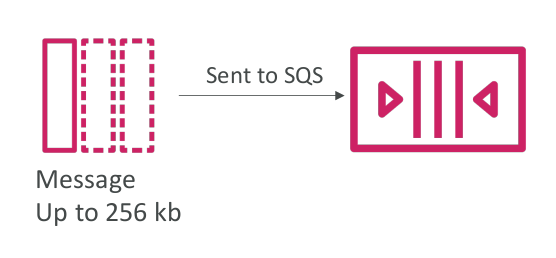
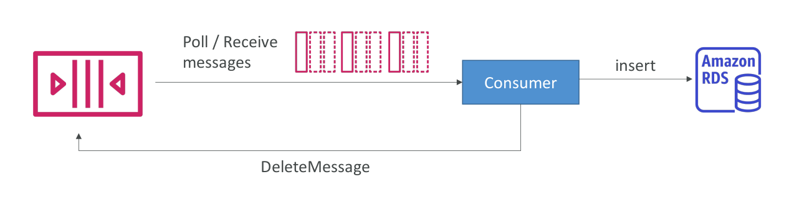

 [General Content AWS Cloud][1]

[1]: https://github.com/weder96/aws-certification-learning

# Módulo 12: AWS Integration & Messaging

## Conteúdo
1. <a href="#section-1"> Amazon Simple Notification Service (Amazon SNS) </a>
2. <a href="#section-2"> Amazon Simple Queue Service (Amazon SQS) </a>
3. <a href="#section-3"> Amazon-MQ </a>
4. <a href="#section-4"> AWS-AppSync </a>
5. <a href="#section-5"> Amazon-AppFlow</a>
6. <a href="#section-6"> Amazon-API-Gateway</a>
7. <a href="#section-7"> Amazon-EventBridge</a>
8. <a href="#section-8"> AWS-Step-Functions</a>
9. <a href="#section-9"> AWS-Express-Workflows</a>
10. <a href="#section-10"> AWS-Console-Mobile-Application </a>
11. <a href="#section-11"> Amazon-Managed-Workflows-for-Apache-Airflow</a>

##  **1 - Amazon Simple Notification Service (Amazon SNS)**

**Definition**

### What if you want to send one message to many receivers?

- The “event producer” only sends message to one SNS topic
- As many “event receivers” (subscriptions) as we want to listen to the SNS topic notifications
- Each subscriber to the topic will get all the messages (note: new feature to filter messages)
- Up to 12,500,000 subscriptions per topic
- 100,000 topics limit

### SNS integrates with a lot of AWS services

- CloudWatch Alarms 
- AWS Budgets
- Lambda
- Auto Scaling Group (Notifications)
- S3 Bucket (Events)
- DynamoDB
- CloudFormation (State Changes)
- AWS DMS (New Replic)
- RDS Events

### Amazon SNS – How to publish

- **Topic Publish (using the SDK)**
    - Create a topic
    - Create a subscription (or many)
    - Publish to the topic

- **Direct Publish (for mobile apps SDK)**
    - Create a platform application
    - Create a platform endpoint
    - Publish to the platform endpoint
    - Works with Google GCM, Apple APNS, Amazon ADM...

### Amazon SNS – Security

- **Encryption:**
    - In-flight encryption using HTTPS API
    - At-rest encryption using KMS keys
    - Client-side encryption if the client wants to perform encryption/decryption itself

- Access Controls: IAM policies to regulate access to the SNS API

- SNS Access Policies (similar to S3 bucket policies)
    - Useful for cross-account access to SNS topics
    - Useful for allowing other services ( S3...) to write to an SNS topic

### SNS + SQS: Fan Out

- Push once in SNS, receive in all SQS queues that are subscribers
- Fully decoupled, no data loss
- SQS allows for: data persistence, delayed processing and retries of work
- Ability to add more SQS subscribers over time
- Make sure your SQS queue access policy allows for SNS to write

### Application: S3 Events to multiple queues

- For the same combination of: event type (e.g. object create) and prefix (e.g. images/) you can only have one S3 Event rule
- If you want to send the same S3 event to many SQS queues, use fan-out

### Application: SNS to Amazon S3 through

- Kinesis Data Firehose

### Amazon SNS – FIFO Topic

- FIFO = First In First Out (ordering of messages in the topic)
- Similar features as SQS FIFO:
    - Ordering by Message Group ID (all messages in the same group are ordered)
    - Deduplication using a Deduplication ID or Content Based Deduplication
- Can only have SQS FIFO queues as subscribers
- Limited throughput (same throughput as SQS FIFO)

### SNS FIFO + SQS FIFO: Fan Out
- In case you need fan out + ordering + deduplication

### SNS – Message Filtering

- JSON policy used to filter messages sent to SNS topic’s subscriptions
- If a subscription doesn’t have a filter policy, it receives every message

**Cheat Sheets**

https://tutorialsdojo.com/amazon-sns/

**References**

https://docs.aws.amazon.com/sns/latest/dg

https://aws.amazon.com/sns/features/

https://aws.amazon.com/sns/pricing/

https://aws.amazon.com/sns/faqs/

**Videos**

https://www.youtube.com/results?search_query=aws+SNS

**Hands On**

https://www.youtube.com/results?search_query=aws+SNS+hands+on

-------------------------------------------------------------------------------------------------
##  **2 - Amazon Simple Queue Service (Amazon SQS)**

**Definition**

-  Oldest offering (over 10 years old)
-  Fully managed service, used to decouple applications
-  Attributes:
    - Unlimited throughput, unlimited number of messages in queue
    - Default retention of messages: 4 days, maximum of 14 days
    - Low latency (<10 ms on publish and receive)
    - Limitation of 256KB per message sent
-  Can have duplicate messages (at least once delivery, occasionally)
-  Can have out of order messages (best effort ordering)

### **SQS – Producing Messages**

- Produced to SQS using the SDK (SendMessage API)
- The message is persisted in SQS until a consumer deletes it
- Message retention: default 4 days, up to 14 day

- Example: send an order to be processed
- Order id
- Customer id
- Any attributes you want

- Oldest offering (over 10 years old)
- Fully managed service, used to decouple applications
- Attributes:
    - Unlimited throughput, unlimited number of messages in queue
    - Default retention of messages: 4 days, maximum of 14 days
    - Low latency (<10 ms on publish and receive)
    - Limitation of 256KB per message sent
- Can have duplicate messages (at least once delivery, occasionally)
- Can have out of order messages (best effort ordering)

### **SQS – Consuming Messages**

- Consumers (running on EC2 instances, servers, or AWS Lambda)...
- Poll SQS for messages (receive up to 10 messages at a time)
- Process the messages (example: insert the message into an RDS database)
- Delete the messages using the DeleteMessage API

### **SQS – Multiple EC2 Instances Consumers**

- Consumers receive and process messages in parallel
- At least once delivery
- Best-effort message ordering
- Consumers delete messages after processing them
- We can scale consumers horizontally to improve throughput of processing

### **SQS with Auto Scaling Group (ASG)**

### **SQS to decouple between application tiers**

### **Amazon SQS - Security**

### **SQS Queue Access Policy**

### **SQS – Message Visibility Timeout**

### **Amazon SQS – Dead Letter Queue**

### **SQS DLQ – Redrive to Source**

### **Amazon SQS - Long Polling**

### **SQS – Request-Response Systems**

### **Amazon SQS – FIFO Queue**

- FIFO = First In First Out (ordering of messages in the queue)
- Limited throughput: 300 msg/s without batching, 3000 msg/s with
- Exactly-once send capability (by removing duplicates)
- Messages are processed in order by the consumer

**Cheat Sheets**

https://tutorialsdojo.com/amazon-sqs/

**References**

https://docs.aws.amazon.com/AWSSimpleQueueService/latest/SQSDeveloperGuide

https://aws.amazon.com/sqs/features/

https://aws.amazon.com/sqs/pricing/

https://aws.amazon.com/sqs/faqs/

**Videos**

https://www.youtube.com/results?search_query=aws+SQS

**Hands On**

https://www.youtube.com/results?search_query=aws+SQS+hands+On

-------------------------------------------------------------------------------------------------
##  **3 - Amazon-MQ**

**Definition**
**Cheat Sheets**
**References**
**Videos**
**Hands On**

-------------------------------------------------------------------------------------------------
##  **4 - AWS-AppSync**

**Definition**

**Cheat Sheets**

**References**

**Videos**

**Hands On**

-------------------------------------------------------------------------------------------------
##  **5 - Amazon-AppFlow**

**Definition**

**Cheat Sheets**

**References**

**Videos**

**Hands On**

-------------------------------------------------------------------------------------------------
##  **6 - Amazon-API-Gateway**

**Definition**

**Cheat Sheets**

**References**

**Videos**

**Hands On**

-------------------------------------------------------------------------------------------------
##  **7 - Amazon-EventBridge**

**Definition**

**Cheat Sheets**

**References**

**Videos**

**Hands On**

-------------------------------------------------------------------------------------------------
##  **8 - AWS-Step-Functions**

**Definition**

**Cheat Sheets**

**References**

**Videos**

**Hands On**

##  **9 - AWS-Express-Workflows**

**Definition**

**Cheat Sheets**

**References**

**Videos**

**Hands On**

-------------------------------------------------------------------------------------------------
##  **10 - AWS-Console-Mobile-Application**

**Definition**

**Cheat Sheets**

**References**

**Videos**

**Hands On**

-------------------------------------------------------------------------------------------------
##  **11 - Amazon-Managed-Workflows-for-Apache-Airflow**

**Definition**

**Cheat Sheets**

**References**

**Videos**

**Hands On**
