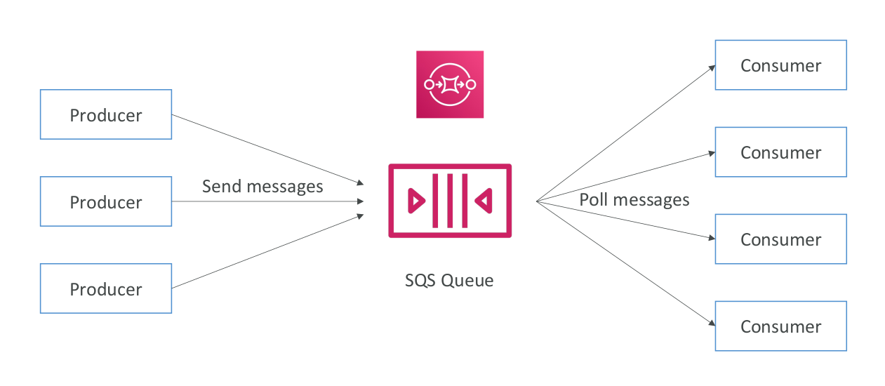
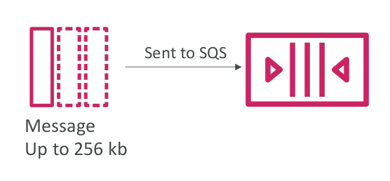
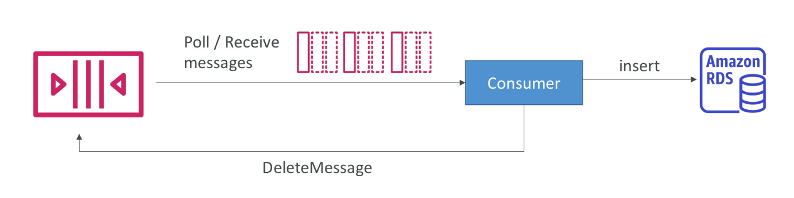

 [General Content AWS Cloud][1]

[1]: https://github.com/weder96/aws-certification-learning

# Módulo 12: AWS Integration & Messaging

## Conteúdo
1. <a href="#section-1"> Amazon Simple Notification Service (Amazon SNS) </a>
2. <a href="#section-2"> Amazon Simple Queue Service (Amazon SQS) </a>
3. <a href="#section-3"> Amazon-MQ </a>
4. <a href="#section-4"> AWS-AppSync </a>
5. <a href="#section-5"> Amazon-AppFlow</a>
6. <a href="#section-6"> Amazon-API-Gateway</a>
7. <a href="#section-7"> Amazon-EventBridge</a>
8. <a href="#section-8"> AWS-Step-Functions</a>
9. <a href="#section-9"> AWS-Express-Workflows</a>
10. <a href="#section-10"> AWS-Console-Mobile-Application </a>
11. <a href="#section-11"> Amazon-Managed-Workflows-for-Apache-Airflow</a>


## <a id="section-1" > </a> **1 - Amazon Simple Notification Service (Amazon SNS)**


**Definition**

Amazon Simple Notification Service (SNS) is a fully managed **publish/subscribe (pub/sub)** messaging and notification service. It enables decoupling of microservices, distributed systems, and serverless applications. SNS is highly scalable, allowing messages to be efficiently delivered to multiple subscribers or triggered actions across various systems.


### What if you want to send one message to many receivers?

- The “event producer” only sends message to one SNS topic
- As many “event receivers” (subscriptions) as we want to listen to the SNS topic notifications
- Each subscriber to the topic will get all the messages (note: new feature to filter messages)
- Up to 12,500,000 subscriptions per topic
- 100,000 topics limit


### SNS integrates with a lot of AWS services

- CloudWatch Alarms 
- AWS Budgets
- Lambda
- Auto Scaling Group (Notifications)
- S3 Bucket (Events)
- DynamoDB
- CloudFormation (State Changes)
- AWS DMS (New Replic)
- RDS Events

### Amazon SNS – How to publish

- **Topic Publish (using the SDK)**
    - Create a topic
    - Create a subscription (or many)
    - Publish to the topic

- **Direct Publish (for mobile apps SDK)**
    - Create a platform application
    - Create a platform endpoint
    - Publish to the platform endpoint
    - Works with Google GCM, Apple APNS, Amazon ADM...

### Amazon SNS – Security

- **Encryption:**
    - In-flight encryption using HTTPS API
    - At-rest encryption using KMS keys
    - Client-side encryption if the client wants to perform encryption/decryption itself

- Access Controls: IAM policies to regulate access to the SNS API

- SNS Access Policies (similar to S3 bucket policies)
    - Useful for cross-account access to SNS topics
    - Useful for allowing other services ( S3...) to write to an SNS topic

### SNS + SQS: Fan Out

- Push once in SNS, receive in all SQS queues that are subscribers
- Fully decoupled, no data loss
- SQS allows for: data persistence, delayed processing and retries of work
- Ability to add more SQS subscribers over time
- Make sure your SQS queue access policy allows for SNS to write

### Application: S3 Events to multiple queues

- For the same combination of: event type (e.g. object create) and prefix (e.g. images/) you can only have one S3 Event rule
- If you want to send the same S3 event to many SQS queues, use fan-out

### Application: SNS to Amazon S3 through

- Kinesis Data Firehose


### Amazon SNS – FIFO Topic

- FIFO = First In First Out (ordering of messages in the topic)
- Similar features as SQS FIFO:
    - Ordering by Message Group ID (all messages in the same group are ordered)
    - Deduplication using a Deduplication ID or Content Based Deduplication
- Can only have SQS FIFO queues as subscribers
- Limited throughput (same throughput as SQS FIFO)

### SNS FIFO + SQS FIFO: Fan Out
- In case you need fan out + ordering + deduplication

### SNS – Message Filtering

- JSON policy used to filter messages sent to SNS topic’s subscriptions
- If a subscription doesn’t have a filter policy, it receives every message


### Key Features of Amazon SNS

### Publish/Subscribe Model

- Messages are published to **topics**, which act as a central channel for notifications.
- Multiple **subscribers** can receive messages published to a topic, making it a robust solution for broadcasting updates or triggering multiple actions simultaneously.
- Supported subscribers include:
  - Web servers via HTTP/HTTPS.
  - Email addresses for email notifications.
  - SMS text messages.
  - Amazon SQS queues for queuing messages.
  - AWS Lambda functions to trigger serverless processing.

### Broad Message Delivery

- **Fan-Out Pattern**: When a message is published to an SNS topic, it can simultaneously trigger multiple actions across your distributed system or notify multiple subscribers, making the process efficient and straightforward.
- **Versatility**: SNS supports a wide range of endpoints, ensuring integration with diverse systems.

### Filtering Capabilities

- Attribute-based filtering allows subscribers to **receive only relevant messages**.
- Reduces unnecessary network traffic and processing overhead.

### Usage and Capabilities

### Topic Management

1. **Create a Topic**:
   - A central channel to which publishers send messages.
2. **Create Subscriptions**:
   - Attach subscribers (e.g., Lambda, email, SMS) to the topic.
3. **Publish Messages**:
   - Send messages to the topic, which then distributes them to all subscribers.

### Direct Publishing for Mobile Apps

- SNS supports direct push notifications for mobile applications through platform endpoints.
  - Compatible with:
    - **Google GCM** (Google Cloud Messaging).
    - **Apple APNS** (Apple Push Notification Service).
    - **Amazon ADM** (Amazon Device Messaging).
- Workflow:
  1. Create a platform application.
  2. Register platform endpoints.
  3. Publish messages to these endpoints for mobile notifications.

### S3 Event Notifications

- Amazon S3 can send **event notifications** to SNS topics (e.g., when a file is uploaded).
- Note: S3 cannot directly write data to SNS; it must use event notifications to send messages indirectly.

### Integration with Amazon SQS

- **SNS and SQS** are tightly integrated, providing a decoupled architecture:
  - SNS can publish messages to multiple **SQS queues**.
  - Each SQS queue subscriber can process messages independently.
  - This setup ensures:
    - **Data persistence**: Messages remain in the SQS queue until processed.
    - **Retries**: SQS handles retries for failed message processing.
    - **Delayed processing**: Ability to delay message delivery as needed.
  - SQS subscribers can be added or removed dynamically over time.
- **Access Policies**:
  - Ensure your SQS queue's **access policy** allows SNS to send messages.

### High Throughput and Scalability

- **Subscriptions and Topics**:
  - Supports up to **12,500,000 subscriptions per topic**.
  - Allows **100,000 topics per account**.
- **Message Throughput**:
  - SNS topics offer high throughput, capable of handling millions of messages per second.
  - SNS can support both SQS Standard and FIFO queues as subscribers.

### FIFO Features in SNS

- SNS supports **FIFO (First-In-First-Out)** topics, enabling:
  - **Message Ordering**:
    - Messages with the same **Message Group ID** are delivered in order.
  - **Deduplication**:
    - Avoid duplicate message delivery using:
      - **Deduplication ID**.
      - **Content-Based Deduplication**.
- **Limitations**:
  - Lower throughput compared to standard SNS topics.
  - Throughput is similar to SQS FIFO:
    - 300 messages per second (without batching).
    - Up to 3,000 messages per second (with batching).

### Security Features

- **Encryption**:
  - Supports encryption of messages in transit using HTTPS.
  - Integrates with AWS Key Management Service (KMS) for encryption at rest.
- **Access Control**:
  - Uses **IAM policies** and **topic access policies** for fine-grained access control.
  - Policies can restrict access based on:
    - **Source IPs**.
    - **Request timing**.
- **Cross-Account Access**:
  - SNS topics can be accessed across AWS accounts with proper IAM policy configuration.

### Common Use Cases

- **Broadcast Notifications**:
  - Send alerts to multiple systems (e.g., emails, SMS, Lambda triggers).
- **Fan-Out Architecture**:
  - Efficiently distribute messages to multiple SQS queues or Lambda functions for parallel processing.
- **Application Decoupling**:
  - Separate the logic of event producers and event consumers.
- **Real-Time Updates**:
  - Push notifications for mobile apps or system-wide updates.
- **Scalable Triggers**:
  - Trigger multiple downstream workflows simultaneously.

### Advantages of SNS

- **Low Latency**:
  - Notifications are sent in near real-time.
- **Scalability**:
  - Automatically scales to handle high message volumes.
- **Flexibility**:
  - Supports a wide range of endpoints and use cases.
- **Reliability**:
  - Ensures message delivery with built-in retries for failed endpoints.
- **Decoupling**:
  - Reduces dependencies between producers and consumers.


**Cheat Sheets**

https://tutorialsdojo.com/amazon-sns/

**References**

https://docs.aws.amazon.com/sns/latest/dg

https://aws.amazon.com/sns/features/

https://aws.amazon.com/sns/pricing/

https://aws.amazon.com/sns/faqs/

**Videos**

https://www.youtube.com/results?search_query=aws+SNS

**Hands On**

https://www.youtube.com/results?search_query=aws+SNS+hands+on

-------------------------------------------------------------------------------------------------
## <a id="section-2" > </a> **2 - Amazon Simple Queue Service (Amazon SQS)**


**Definition**

Amazon Simple Queue Service (SQS) is a fully managed message queuing service that enables you to decouple and scale microservices, distributed systems, and serverless applications. SQS offers two types of message queues. Standard queues offer maximum throughput, best-effort ordering, and at-least-once delivery. SQS FIFO queues are designed to guarantee that messages are processed exactly once, in the exact order that they are sent.


-  Oldest offering (over 10 years old)
-  Fully managed service, used to decouple applications
-  Attributes:
    - Unlimited throughput, unlimited number of messages in queue
    - Default retention of messages: 4 days, maximum of 14 days
    - Low latency (<10 ms on publish and receive)
    - Limitation of 256KB per message sent
-  Can have duplicate messages (at least once delivery, occasionally)
-  Can have out of order messages (best effort ordering)



### **SQS – Producing Messages**

- Produced to SQS using the SDK (SendMessage API)
- The message is persisted in SQS until a consumer deletes it
- Message retention: default 4 days, up to 14 day

- Example: send an order to be processed
- Order id
- Customer id
- Any attributes you want



- Oldest offering (over 10 years old)
- Fully managed service, used to decouple applications
- Attributes:
    - Unlimited throughput, unlimited number of messages in queue
    - Default retention of messages: 4 days, maximum of 14 days
    - Low latency (<10 ms on publish and receive)
    - Limitation of 256KB per message sent
- Can have duplicate messages (at least once delivery, occasionally)
- Can have out of order messages (best effort ordering)

### **SQS – Consuming Messages**


- Consumers (running on EC2 instances, servers, or AWS Lambda)...
- Poll SQS for messages (receive up to 10 messages at a time)
- Process the messages (example: insert the message into an RDS database)
- Delete the messages using the DeleteMessage API



### **SQS – Multiple EC2 Instances Consumers**

- Consumers receive and process messages in parallel
- At least once delivery
- Best-effort message ordering
- Consumers delete messages after processing them
- We can scale consumers horizontally to improve throughput of processing

### **SQS with Auto Scaling Group (ASG)**
### **SQS to decouple between application tiers**
### **Amazon SQS - Security**
### **SQS Queue Access Policy**
### **SQS – Message Visibility Timeout**
### **Amazon SQS – Dead Letter Queue**
### **SQS DLQ – Redrive to Source**
### **Amazon SQS - Long Polling**
### **SQS – Request-Response Systems**
### **Amazon SQS – FIFO Queue**

- FIFO = First In First Out (ordering of messages in the queue)
- Limited throughput: 300 msg/s without batching, 3000 msg/s with
- Exactly-once send capability (by removing duplicates)
- Messages are processed in order by the consumer

### Queue Types

### Standard Queue

- The **standard queue** is the original offering of Amazon SQS and is designed for applications requiring high throughput.
- **Features**:
  - Scales automatically, supporting up to **15,000 messages per second**.
  - Guarantees **at-least-once delivery**, meaning messages may be delivered more than once.
  - Messages may arrive **out of order** (best-effort ordering).
  - Maximum message size: **256 KB**.
  - Default retention period of **4 days**, extendable up to **14 days**.

### FIFO Queue

- The **First-In-First-Out (FIFO) queue** is designed for applications requiring strict ordering and exactly-once message delivery.
- **Features**:
  - Guarantees messages are delivered in the exact order they are sent.
  - Ensures each message is processed exactly once.
  - Supports up to **3,000 messages per second** with batching or **300 messages per second** without batching.
  - FIFO queues must have names ending with the `.fifo` suffix. The suffix counts towards
the 80-character queue name limit. To determine whether a queue is FIFO, you can check
whether the queue name ends with the suffix.
  - **Deduplication**: Messages with the same deduplication ID sent within **5 minutes** are treated as duplicates and are not processed again.

> Note: You can’t convert an existing standard queue into a FIFO queue. To make the move, you must either create a new FIFO queue for your application or delete your existing standard queue and recreate it as a FIFO queue.

### Decoupling Applications

SQS serves as a virtual queue between application components, allowing each component to operate independently. For example:

- **File Uploads and Processing**: Files uploaded to Amazon S3 can trigger notifications sent to an SQS queue. These messages can then be processed by an AWS Lambda function, separating upload operations from downstream processing tasks.
- **Scaling**: Decoupling applications helps distribute workloads across multiple consumers, improving fault tolerance and enabling horizontal scaling.

### Message Retention and Visibility Timeout

### Message Retention

- Messages are stored in a queue for a default retention period of **4 days**. This can be configured up to a maximum of **14 days**.
- Retention ensures that messages are available for processing even if a consumer application faces downtime.

### Visibility Timeout

- The **visibility timeout** is the period during which a message is temporarily hidden from other consumers after being received.
- The default visibility timeout is **30 seconds**, with a configurable range between **0 seconds** and **12 hours**.
- If the message is not deleted within the timeout period, it becomes available for processing by other consumers. This prevents message duplication and ensures reliable processing.

### Polling Mechanisms

### Short Polling

- Immediately returns a response, even if no messages are available in the queue.
- Best suited for applications requiring rapid responses but may result in higher costs due to empty responses.

### Long Polling

- Waits for messages to become available or until the polling timeout expires.
- Reduces the number of empty responses, making it more cost-efficient for low-traffic queues.
- Configured using the `ReceiveMessageWaitTimeSeconds` parameter, with a maximum wait time of **20 seconds**.
- Using long polling can reduce the cost of using SQS because you can reduce the number of empty receives.

### Delay Queues and Message Timers

### Delay Queues

- Delay queues allow the postponement of message delivery for up to **15 minutes**.
- Useful when the consumer application needs additional time to prepare before processing messages.
- Configured using the `DelaySeconds` setting at the queue level.

### Message Timers

You can use message timers to set an initial invisibility period for a message added
to a queue. So, if you send a message with a 60-second timer, the message isn’t visible to consumers for its first 60 seconds in the queue. The default (minimum) delay for a message is 0 seconds. The maximum is 15 minutes.

### Dead-Letter Queues (DLQs) and Redrive Policies

- **Dead-Letter Queues** are used to isolate and handle messages that fail processing. Messages are moved to a DLQ after exceeding a configurable `MaxReceiveCount`.
- **Benefits**:
  - Debugging: DLQs help identify problematic messages and issues in the processing pipeline.
  - Redrive Policy: Configured at the source queue, specifying the `MaxReceiveCount` and the DLQ to target failed messages. MaxReceiveCount refers to the number of times a message can be received from the queue before being deleted. When the limit is reached, the message will be sent to the dead letter queue. The default Maximum received is 10.

> Note: You cannot use dead-letter queues to postpone the delivery of new messages to the queue for a few seconds.
---

### Security Features

### Encryption

- **In-Transit**: Messages are encrypted using HTTPS endpoints.
- **At Rest**: Enable **Server-Side Encryption (SSE)** with AWS Key Management Service (KMS) for encrypting message bodies.
- SSE encrypts only the message body, not metadata (e.g., message ID, timestamps, attributes).

### Access Control

- Managed using **IAM policies** and **queue access policies**, allowing fine-grained control over who can interact with the queue.
- **Private Access**: AWS customers can access Amazon Simple Queue Service (Amazon SQS) from their Amazon Virtual Private Cloud (Amazon VPC) using VPC endpoints, without using public IPs, and without needing to traverse the public internet. VPC endpoints for Amazon SQS are powered by AWS PrivateLink, a highly available, scalable technology that enables you to privately connect your VPC to supported AWS services.

### Backlog Metrics for Auto Scaling

If you use a target tracking scaling policy in an Auto Scaling Group of EC2 instances based on a custom Amazon SQS queue metric, you may use an existing CloudWatch Amazon SQS metric like `ApproximateNumberOfMessagesVisible` for target tracking but you could still face an issue so that the number of messages in the queue might not change proportionally to the size of the Auto Scaling group that processes messages from the queue. The solution is to use a backlog per instance metric with the target value being the acceptable backlog per instance to maintain. To calculate your backlog per instance, divide the ApproximateNumberOfMessages queue attribute by the number of instances in the InService state for the Auto Scaling group. Then set a target value for the Acceptable backlog per instance.

- Example:
  - If an Auto Scaling group has 10 EC2 instances and a queue has 1,500 messages, each instance processes 150 messages.
  - If each instance takes 0.1 seconds per message, processing 150 messages takes **15 seconds**.
  - To reduce processing time to **10 seconds**, increase the instance count to **15**.

### Use Cases

1. **Decoupling Applications**: For example, asynchronously handling payment processing in e-commerce systems.
2. **Buffering Writes to Databases**: Managing spikes in incoming data, such as in a voting system.
3. **Scaling Workloads**: Integrating SQS with Auto Scaling and CloudWatch to dynamically scale resources based on queue size.
4. **Prioritization**: Use separate queues for tasks with different priorities, such as pro users versus lite users in photo processing applications.

### Advanced Features

### Temporary Queues

- **Temporary queues** are designed for use cases like request-response messaging patterns. They are application-managed and cost-effective.

### Message Batching

- FIFO queues support batching, which increases throughput to **3,000 messages per second**. Without batching, the throughput is limited to **300 messages per second**.

### Best Practices

1. **Message Deletion**: Always remember that the messages in the SQS queue will continue to exist even after the EC2 instance has processed it, until you delete that message. You have to ensure that you delete the message after processing to prevent the message from being received and processed again once the visibility timeout expires.
2. **Queue Separation**: Use different queues for tasks with varying priorities or requirements.
3. **Efficient Polling**: Opt for long polling to minimize costs and avoid excessive empty responses.
4. **Security**: Implement encryption and fine-grained access controls to protect sensitive data.

### SQS vs Kinesis Data Streams

| Feature                        | Amazon SQS                                  | Amazon Kinesis Streams                     |
|--------------------------------|---------------------------------------------|--------------------------------------------|
| **Use Case**                   | Decouple and scale microservices, distributed systems, or serverless applications. | Real-time streaming and analytics of data. |
| **Message Ordering**           | FIFO queues guarantee ordering; Standard queues do not. | Maintains strict order of records.         |
| **Message Delivery**           | At-least-once (Standard), exactly-once (FIFO). | Exactly-once delivery for consumer applications. |
| **Retention Period**           | 4 days (default), configurable up to 14 days. | 24 hours (default), configurable up to 365 days. |
| **Max Message Size**           | 256 KB per message.                         | Up to 1 MB per record.                     |
| **Message Processing**         | Polling-based; consumers retrieve messages. | Real-time streaming via shards.            |
| **Concurrency**                | Horizontal scaling of consumers; handles thousands of messages per second. | Each shard supports 1 MB/s input and 2 MB/s output. |
| **Use of Dead Letter Queues**  | Supports Dead Letter Queues for failed messages. | No direct support for DLQs; errors handled in application logic. |
| **Latency**                    | Low latency (<10 ms for Standard).          | Millisecond latency for real-time data.    |
| **Data Persistence**           | Limited to retention period.                | Streamed data is stored for replay within retention period. |
| **Scalability**                | Fully managed, scales automatically.        | Requires manual shard management for scaling. |
| **Integration with AWS Services** | Easy integration with Lambda, EC2, Auto Scaling, and S3. | Integrated with Lambda, analytics tools (e.g., Kinesis Data Analytics), and S3. |
| **Security**                   | Supports HTTPS in transit and KMS encryption for message bodies. | Supports HTTPS in transit, KMS encryption, and fine-grained IAM policies. |
| **Cost Model**                 | Pay per request and data transfer.          | Pay per shard-hour and data throughput.    |
| **Common Use Cases**           | Job queues, asynchronous processing, decoupling application components. | Streaming logs, metrics, IoT data, and analytics in real-time. |


**Cheat Sheets**

https://tutorialsdojo.com/amazon-sqs/

**References**

https://docs.aws.amazon.com/AWSSimpleQueueService/latest/SQSDeveloperGuide

https://aws.amazon.com/sqs/features/

https://aws.amazon.com/sqs/pricing/

https://aws.amazon.com/sqs/faqs/

https://docs.aws.amazon.com/lambda/latest/dg/with-sqs.html


**Videos**

https://www.youtube.com/results?search_query=aws+SQS

**Hands On**

https://www.youtube.com/results?search_query=aws+SQS+hands+On

-------------------------------------------------------------------------------------------------
## <a id="section-3" > </a> **3 - Amazon-MQ**


**Definition**
- SQS, SNS are “cloud-native” services: proprietary protocols from AWS
- Traditional applications running from on-premises may use open protocols such as: MQTT, AMQP, STOMP, Openwire, WSS
- When migrating to the cloud, instead of re-engineering the application to use SQS and SNS, we can use Amazon MQ
- Amazon MQ is a managed message broker service for
- Amazon MQ doesn’t “scale” as much as SQS / SNS
- Amazon MQ runs on servers, can run in Multi-AZ with failover
- Amazon MQ has both queue feature (~SQS) and topic features (~SNS)

AWS offering for a managed message broker service for Apache ActiveMQ. Message brokers allow different software systems–often using different programming languages, and on different platforms–to communicate and exchange information.
Amazon MQ also supports RabbitMQ, a popular open-source message broker. Migrate your existing RabbitMQ message brokers to AWS without having to rewrite code.


### **Features**

Amazon MQ uses industry-standard APIs and protocols for messaging, including Java Message Service (JMS), .NET Message Service (NMS), AMQP, STOMP, MQTT, OpenWire, and WebSocket.
Amazon MQ manages administrative tasks such as hardware provisioning, broker setup, software upgrades, and failure detection and recovery.
Amazon MQ stores your messages redundantly across multiple Availability Zones (AZs).
Amazon MQ supports both single-instance brokers, suitable for evaluation and testing, and active/standby brokers for high availability in production. In the event of a failure of the broker, or even a full AZ outage, Amazon MQ automatically fails over to the standby broker.


**Cheat Sheets**

https://tutorialsdojo.com/amazon-mq/

**References**

https://aws.amazon.com/amazon-mq/features/

https://docs.aws.amazon.com/amazon-mq/latest/developer-guide/welcome.html

https://aws.amazon.com/amazon-mq/pricing/

https://aws.amazon.com/amazon-mq/faqs/

https://aws.amazon.com/quickstart/architecture/ibm-mq/

https://aws-quickstart.s3.amazonaws.com/quickstart-ibm-mq/doc/ibm-mq-on-the-aws-cloud.pdf

**Videos**

https://www.youtube.com/results?search_query=aws+Amazon+MQ

**Hands On**

https://www.youtube.com/results?search_query=aws+Amazon+MQ+Hands+ON


-------------------------------------------------------------------------------------------------
## <a id="section-4" > </a> **4 - AWS-AppSync**


**Definition**

A serverless GraphQL and Pub/Sub API service that streamlines the development of modern web and mobile applications

AppSync GraphQL APIs – provides a unified endpoint for securely querying and updating data from multiple databases, microservices, and APIs

AppSync Pub/Sub APIs – data updates are automatically published to subscribed API clients via serverless WebSockets connections.


### **Monitoring**

Use Amazon CloudWatch Logs to monitor your AWS AppSync GraphQL API and debug request issues.
You can use AWS X-Ray to trace GraphQL requests in AWS AppSync.
With AWS CloudTrail, you can log AWS AppSync API calls.


### **Security**

- In your API or CLI call, you can specify which authorization type you want:
    - API_KEY
    - AWS_LAMBDA
    - AWS_IAM
    - OPENID_CONNECT
    - AMAZON_COGNITO_USER_POOLS

- Using schema directives, you can specify additional authorization modes at the schema level.
- You can use AWS WAF to configure a set of rules to protect your web applications and APIs from attacks

### **Pricing**
- You are charged for the following:
    - Query and data modification operations.
    - Performing real-time updates on your data.
    - Minutes of connection to AppSync.
    - Dedicated cache instance.

**Cheat Sheets**

https://tutorialsdojo.com/aws-appsync/

**References**

https://aws.amazon.com/appsync/

https://docs.aws.amazon.com/appsync/latest/devguide/what-is-appsync.html

**Videos**

https://www.youtube.com/results?search_query=aws+appsync

**Hands On**

https://www.youtube.com/results?search_query=aws+appsync+hands+on

-------------------------------------------------------------------------------------------------
## <a id="section-5" > </a> **5 - Amazon-AppFlow**


**Definition**

An integration service that automates data flows by securely integrating third-party applications and AWS services without writing any code.
Amazon AppFlow is a fully managed integration service that enables you to **securely transfer data between Software-as-a-Service (SaaS) applications** and AWS services. It provides a seamless way to ingest, transform, and transfer data without the need for building and maintaining custom API connectors, saving time and reducing dependency on skilled developer resources.

### **Features**

- Run flows on-demand or on a schedule to keep data in sync across SaaS applications and AWS services.
- Aggregate data from multiple sources to train analytics tools more effectively and save money.
- Use flow management tools to track where and when data has moved.
- Data is encrypted at rest and in transit.
- Integrates with AWS PrivateLink to allow private data transfer over AWS rather than public data transfer over the internet.
- Use custom connectors to transfer data between private APIs, on-premise systems, and cloud services.
- Publish events related to the status of a flow using Amazon Event Bridge.

### **How it works**
- With Amazon AppFlow automate bi-directional data flows between SaaS applications and AWS services in just a few clicks. 
- Run the data flows at the frequency you choose, whether on a schedule, in response to a business event, or on demand. 
- Simplify data preparation with transformations, partitioning, and aggregation. 
- Automate preparation and registration of your schema with the AWS Glue Data Catalog so you can discover and share data with AWS analytics and machine learning services.

### **Pricing**

- You are charged per flow run and the maximum number of flow runs.
- You are charged for data processing for flows whose destinations are:
    - Hosted on AWS
    - Integrated with AWS PrivateLink
- You are charged per standard request and storage to read and write from AWS services.
- You are charged for the use of AWS KMS CMKs to encrypt access tokens and data in transit.


### Data Integration

- **Sources**:
  - Popular SaaS applications, including:
    - **Salesforce**
    - **SAP**
    - **Zendesk**
    - **Slack**
    - **ServiceNow**
- **Destinations**:
  - AWS services such as:
    - **Amazon S3**
    - **Amazon Redshift**
  - Non-AWS destinations like **Snowflake** and **Salesforce**.

### Triggers for Flows

Amazon AppFlow supports three types of triggers for running data flows:

1. **Run on Demand**:
   - Manually trigger the flow as needed.
2. **Run on Event**:
   - Automatically execute the flow in response to events from SaaS applications.
3. **Run on Schedule**:
   - Execute flows at recurring intervals, such as daily or weekly.

### Data Security and Encryption

- **Encryption Options**:
  - AWS provides **managed keys** and the option to use **customer-managed keys**.
  - For customer-managed keys:
    - Provides full control over encryption.
    - Amazon AppFlow attaches a resource policy to the **KMS key**, granting access for operations.
- **Secure Transfers**:
  - Transfers data **encrypted over the public internet** or **privately via AWS PrivateLink**, ensuring security.

### Incremental Data Transfers

- Supports **incremental data transfer**, which only transfers:
  - Records added or changed since the last successful flow run.
  - Based on a **source timestamp field**, such as `CreatedDate`.
  - Example:
    - Transfer only newly created records while excluding previously transferred or unchanged data.

### Data Transformation

- Built-in **transformation capabilities** allow you to:
  - **Filter data** based on specified criteria.
  - **Validate data** to ensure quality and consistency before transferring.

### Benefits

1. **Time and Cost Savings**:
   - Eliminates the need for writing and maintaining custom integrations, freeing up IT resources.
   - Leverages existing APIs for immediate deployment.
2. **Empowers Non-Developers**:
   - **Systems Administrators** and **business analysts** can quickly implement integrations without requiring technical expertise.
3. **Scalable Integration**:
   - Supports large-scale data flows between SaaS applications and AWS services, ensuring seamless scalability.
4. **Flexible Data Transfer**:
   - Flows can be triggered on-demand, by event, or on a set schedule, adapting to varied use cases.
5. **Secure and Compliant**:
   - Offers encryption with customer control and the option for private data transfer using AWS PrivateLink.

### Example Use Cases

1. **Customer Data Integration**:
   - Pull contact records from Salesforce into Amazon Redshift for analytics.
2. **Support Management**:
   - Transfer support tickets from Zendesk to an Amazon S3 bucket for further analysis.
3. **Batch Data Transfers**:
   - Schedule recurring data syncs from Slack or SAP to Snowflake for consistent updates.
4. **Event-Driven Workflows**:
   - Trigger flows based on real-time events, such as new customer signups in Salesforce.

### Features Summary Table

| **Feature**                  | **Description**                                                                                             |
|-------------------------------|-------------------------------------------------------------------------------------------------------------|
| **Source Applications**       | Salesforce, SAP, Zendesk, Slack, ServiceNow, and other SaaS applications.                                  |
| **Destination Options**       | Amazon S3, Amazon Redshift, Snowflake, and more.                                                           |
| **Triggers**                  | Run on demand, on schedule, or on event.                                                                   |
| **Data Transformation**       | Filtering and validation capabilities for refining data before transfer.                                   |
| **Incremental Transfers**     | Transfers only new or changed records since the last successful flow run.                                  |
| **Encryption Options**        | AWS managed or customer-managed KMS keys for encrypting data during transit and at rest.                  |
| **Secure Connectivity**       | Data transfer over the public internet (encrypted) or privately via AWS PrivateLink.                      |
| **Ease of Use**               | Enables administrators and analysts to build integrations without coding.                                 |


**Cheat Sheets**

https://tutorialsdojo.com/amazon-appflow/

**References**

https://aws.amazon.com/appflow/

https://docs.aws.amazon.com/appflow/index.html

https://docs.aws.amazon.com/pdfs/appflow/latest/userguide/appflow.pdf

**Videos**

https://www.youtube.com/results?search_query=aws+AppFlow

https://youtu.be/6NSxo5syl40


**Hands On**

https://www.youtube.com/results?search_query=aws+AppFlow+hands+on

-------------------------------------------------------------------------------------------------
## <a id="section-6" > </a> **6 - Amazon-API-Gateway**


**Definition**

Amazon API Gateway is a fully managed service that makes it easy for developers to create, publish, maintain, monitor, and secure APIs at any scale. APIs act as the "front door" for applications to access data, business logic, or functionality from your backend services. Using API Gateway, you can create RESTful APIs and WebSocket APIs that enable real-time two-way communication applications. API Gateway supports containerized and serverless workloads, as well as web applications.

API Gateway handles all the tasks involved in accepting and processing up to hundreds of thousands of concurrent API calls, including traffic management, CORS support, authorization and access control, throttling, monitoring, and API version management. API Gateway has no minimum fees or startup costs. You pay for the API calls you receive and the amount of data transferred out and, with the API Gateway tiered pricing model, you can reduce your cost as your API usage scales.

1 million API calls received free

per month for 12 months with the AWS Free Tier


**Cheat Sheets**

**References**

https://aws.amazon.com/api-gateway/?nc1=h_ls

https://aws.amazon.com/api-gateway/features/

https://aws.amazon.com/api-gateway/pricing/

https://aws.amazon.com/api-gateway/getting-started/

https://aws.amazon.com/api-gateway/resources/

https://aws.amazon.com/api-gateway/faqs/

**Videos**

https://www.youtube.com/results?search_query=amazon+api-gateway

**Hands On**

https://www.youtube.com/results?search_query=amazon+api+gateway+hands+on


-------------------------------------------------------------------------------------------------
## <a id="section-7" > </a> **7 - Amazon-EventBridge**


**Definition**

### What Is Amazon EventBridge?

EventBridge is a serverless service that uses events to connect application components together, making it easier for you to build scalable event-driven applications. 
Use it to route events from sources such as home-grown applications, AWS services, and third- party software to consumer applications across your organization. EventBridge provides a simple and consistent way to ingest, filter, transform, and deliver events so you can build new applications quickly.

EventBridge event buses are well suited for many-to-many routing of events between eventdriven services. 

Amazon EventBridge is a **serverless event bus service** designed to help applications react to events from **AWS services**, **custom applications**, or **SaaS applications**. It enables **event-driven architecture** by simplifying the ingestion, filtering, and routing of events to appropriate targets, facilitating decoupled microservices and system integration.

### **Amazon EventBridge Pipes**

Amazon EventBridge Pipes connects sources to targets. It reduces the need for specialized knowledge and integration code when developing event driven architectures, fostering consistency across your company’s applications. To set up a pipe, you choose the source, add optional filtering, define optional enrichment, and choose the target for the event data.

EventBridge Pipes could be used to create an ecommerce system. Imagine that you have an API that contains customer metadata, such as shipping addresses. The source might be an Amazon SQS order received message. 

The pipe then sends that data to an Amazon API Gateway API enrichment that returns the customer information for that order. Final


### Key Features and Capabilities

### Event Sources

1. **AWS Services**:
   - Natively integrates with over **90 AWS services**.
   - Developers don’t need to configure additional resources for ingestion.
2. **SaaS Applications**:
   - Direct integration with **third-party SaaS providers**, making it unique among AWS event-driven services.
3. **Custom Applications**:
   - Supports **custom events** from user applications using the AWS SDK.

### Event Targeting and Routing

- **JSON-Based Event Structure**:
  - Events follow a defined JSON structure.
  - Rules can be created to filter events based on attributes in the event body.
- **Targets**:
  - Supports over **15 AWS services** as event targets, including:
    - **AWS Lambda**
    - **Amazon SQS**
    - **Amazon SNS**
    - **Amazon Kinesis Data Streams**
    - **Amazon Kinesis Data Firehose**
- **Flexible Event Rules**:
  - **Event Patterns**:
    - Define rules that respond to specific events (e.g., "an EC2 instance changes state").
  - **Scheduled Events**:
    - Define cron-like schedules for recurring events, such as invoking a Lambda function every hour.

### Advanced Capabilities

1. **Event Buses**:
   - **Event Bus Types**:
     - **Default Event Bus**: For AWS service events.
     - **Custom Event Buses**: For custom applications.
     - **SaaS Event Buses**: For third-party SaaS applications.
   - **Cross-Account Access**:
     - Allows other AWS accounts to access your EventBus using **resource-based policies**.
   - **Use Case**:
     - Aggregate all events from multiple AWS accounts into a single account or region for centralized management.

2. **Event Archiving and Replay**:
   - Archive events (all or filtered) sent to an event bus for:
     - **Indefinite storage** or for a **specified retention period**.
   - **Replay Events**:
     - Reprocess archived events, useful for troubleshooting or testing new workflows.

3. **Schema Discovery and Registry**:
   - **Schema Discovery**:
     - Automatically infer the structure of events on your bus.
   - **Schema Registry**:
     - Enables developers to:
       - Store and manage event schemas.
       - Generate code bindings for applications to work seamlessly with event data.
     - Schemas can be **versioned** to support evolving event structures.

4. **Permissions Management**:
   - Manage **event bus permissions** with fine-grained controls.
   - Examples:
     - Allow/deny events from another AWS account or region.
   - Use Case:
     - Aggregate events across an **AWS Organization** in a central AWS account or region.

### Performance and Limits

- **Latency**:
  - Typical latency is around **0.5 seconds**.
- **Throughput**:
  - Limited by default but can be increased upon request.
- **Service Limits**:
  - Predefined limits for event buses, rules, and targets, adjustable via AWS support.

### Security

- **IAM Policies**:
  - Control which users and services can publish or subscribe to event buses.
- **Cross-Account Access**:
  - Resource-based policies enable secure sharing of event buses between accounts.
- **Encryption**:
  - Events are encrypted in transit using HTTPS.

### Example Use Cases

1. **Event-Driven Applications**:
   - React to **EC2 instance state changes** by triggering automated workflows using AWS Lambda.
2. **Centralized Event Aggregation**:
   - Aggregate events from all accounts in an **AWS Organization** to a single monitoring account for unified event processing.
3. **SaaS Integration**:
   - Automate workflows based on events from third-party tools like **Zendesk** or **Stripe**.
4. **Operational Monitoring**:
   - Forward AWS CloudTrail events to **Amazon Kinesis Data Streams** for real-time log analysis.
5. **Scheduled Events**:
   - Use cron-like scheduling to trigger periodic tasks, such as running maintenance scripts.

### Summary Table

| **Feature**                  | **Description**                                                                                             |
|-------------------------------|-------------------------------------------------------------------------------------------------------------|
| **Event Sources**             | AWS services, SaaS applications, and custom applications.                                                  |
| **Event Targets**             | Supports over 15 AWS services, including Lambda, SQS, SNS, and Kinesis.                                    |
| **Event Structure**           | JSON-based events with rules for attribute-based filtering.                                                |
| **Event Buses**               | Default, custom, and SaaS event buses. Can be shared across accounts and regions.                          |
| **Archiving and Replay**      | Archive events indefinitely or for a defined period. Replay events for testing and debugging.              |
| **Schema Registry**           | Automatically discover, version, and store schemas. Generate code bindings for application integration.    |
| **Scheduling**                | Cron-like functionality for periodic tasks.                                                                |
| **Latency**                   | ~0.5 seconds.                                                                                             |
| **Throughput**                | Limited by default, adjustable via AWS support.                                                            |
| **Cross-Account Access**      | Manage permissions to share event buses across AWS accounts or regions.                                    |
| **Security**                  | IAM policies and encryption ensure secure event publishing and delivery.                                   |


**Cheat Sheets**


**References**

https://docs.aws.amazon.com/eventbridge/latest/userguide/eb-tutorial.html

https://aws.amazon.com/eventbridge/?nc1=h_ls

https://aws.amazon.com/eventbridge/features/

https://docs.aws.amazon.com/eventbridge/index.html

https://docs.aws.amazon.com/eventbridge/latest/userguide/eb-what-is.html

https://docs.aws.amazon.com/pdfs/eventbridge/latest/userguide/user-guide.pdf#eb-what-is

**Videos**

https://www.youtube.com/watch?v=gCyOPHlp5Ic

https://www.youtube.com/watch?v=e3sevLjtIQg

https://www.youtube.com/results?search_query=Amazon+EventBridge


**Hands On**

https://www.youtube.com/results?search_query=Amazon+EventBridge+hands+On


-------------------------------------------------------------------------------------------------
## <a id="section-8" > </a> **8 - AWS-Step-Functions**


**Definition**

AWS Step Functions is a fully managed service that enables the design and execution of workflows, referred to as **state machines**. Step Functions make it easy to coordinate and orchestrate microservices, serverless applications, and distributed systems. By defining workflows visually and declaratively, developers can model complex processes, incorporate error handling, and track execution history efficiently.

AWS Step Functions 
• Build serverless visual workflow to orchestrate your Lambda functions
• Features: sequence, parallel, conditions, timeouts, error handling, …
• Can integrate with EC2, ECS, On -premises servers, API Gateway, SQS queues
• Possibility of implementing human approval feature
• Use cases: order fulfillment, data processing, web applications, any workflow


AWS Step Functions is a web service that provides serverless orchestration for modern applications. It enables you to coordinate the components of distributed applications and microservices using visual workflows.

### **Pricing**

- Step Functions counts a state transition each time a step of your workflow is executed. You are charged for the total number of state transitions across all your state machines, including retries.
Common Use Cases

- Step Functions can help ensure that long-running, multiple ETL jobs execute in order and complete successfully, instead of manually orchestrating those jobs or maintaining a separate application.
- By using Step Functions to handle a few tasks in your codebase, you can approach the transformation of monolithic applications into microservices as a series of small steps.
- You can use Step Functions to easily automate recurring tasks such as patch management, infrastructure selection, and data synchronization, and Step Functions will automatically scale, respond to timeouts, and retry failed tasks.
- Use Step Functions to combine multiple AWS Lambda functions into responsive serverless applications and microservices, without having to - write code for workflow logic, parallel processes, error handling, timeouts or retries.
- You can also orchestrate data and services that run on Amazon EC2 instances, containers, or on-premises servers.


### Key Concepts

### State Machines

- A **workflow** in Step Functions is called a **state machine**.
- Each step in the workflow is represented as a **state**.
- The state machine defines the flow of execution and the logic for transitions between states.

### Types of States

AWS Step Functions provide a variety of state types to suit diverse workflow requirements:

1. **Task State**:
   - Represents a single unit of work, such as invoking:
     - AWS Lambda functions.
     - API Gateway endpoints.
     - AWS SDK integrations (e.g., interacting with DynamoDB, S3, etc.).
     - Third-party APIs.
   - Focused on executing actions but **does not include branching logic**.

2. **Choice State**:
   - Adds conditional logic by evaluating **Choice Rules** (e.g., comparisons) against input data.
   - Allows workflows to choose between multiple branches of execution.
   - Ideal for dynamic workflows where the next step depends on the characteristics of the input.
   - Example Use Case:
     - A workflow decides whether to transform data before loading it into Amazon DynamoDB, based on the content of the data.

3. **Wait State**:
   - Delays execution for a specified time or until a certain timestamp.
   - Useful for scenarios requiring time-based coordination between steps.

4. **Parallel State**:
   - Executes multiple branches of a workflow concurrently.
   - Aggregates results from all parallel branches before continuing the workflow.
   - Useful for processing tasks that can be executed simultaneously.
   - **Note**: Does not include conditional logic for choosing paths.

5. **Map State**:
   - Iterates over a collection of items (e.g., JSON arrays) and executes steps for each item.
   - Enables batch or parallel processing of datasets, such as:
     - Processing files in an S3 bucket.
     - Running computations over CSV data.
   - Especially relevant for data engineering tasks.
   - **Note**: Like Parallel, Map states do not evaluate conditions for path selection.

6. **Pass State**:
   - Passes input data to output without modification.
   - Useful for testing or as a placeholder in workflows.

7. **Succeed State**:
   - Marks a workflow as successfully completed.

8. **Fail State**:
   - Marks a workflow as failed with a specified error message.

### Features and Benefits

### Workflow Visualization

- Step Functions provide **easy-to-use visualizations** of workflows:
  - Graphical representations show execution flow and branching logic.
  - Simplifies debugging and monitoring.

### Error Handling and Retry Mechanisms

- Advanced error-handling capabilities include:
  - **Retries**: Automatic retries for failed steps based on configurable criteria.
  - **Catch**: Capture specific errors and redirect to alternate steps or workflows.

### Audit and Execution History

- Step Functions automatically record **execution history**, enabling:
  - Tracking of inputs, outputs, and transitions for each step.
  - Auditing workflows for debugging and compliance.

### Wait States for Scheduling

- The **Wait** state allows workflows to:
  - Pause execution for an arbitrary amount of time.
  - Synchronize processes or wait for external events.

### Scalability and Performance

- Step Functions can handle a wide range of use cases, from simple sequences to complex workflows involving thousands of steps.
- Workflows can run for a maximum execution time of **1 year**, making it suitable for long-running processes.

### Use Cases

1. **Data Transformation and Loading**:
   - Use **Choice States** to evaluate whether data needs transformation before being loaded into databases like DynamoDB or Redshift.

2. **Batch Processing**:
   - Use **Map States** to process large datasets (e.g., JSON, S3 objects, CSV files).

3. **Parallel Execution**:
   - Use **Parallel States** to process multiple independent tasks simultaneously, such as analyzing logs and generating reports concurrently.

4. **Time-Based Workflows**:
   - Use **Wait States** for time delays or scheduled events (e.g., waiting for external systems to respond).

5. **Error Resilience**:
   - Implement retry policies and error-catching mechanisms for workflows that interact with unreliable APIs or services.

6. **Serverless Orchestration**:
   - Integrate Step Functions with AWS Lambda to coordinate serverless microservices.

---

### Integration with Other AWS Services

AWS Step Functions can orchestrate workflows involving various AWS services, including:

- **AWS Lambda**: Trigger serverless functions for computation or processing.
- **Amazon S3**: Process uploaded files or objects.
- **Amazon DynamoDB**: Store or retrieve workflow-related data.
- **Amazon SQS**: Manage message queues as part of the workflow.
- **Amazon SNS**: Send notifications or trigger downstream systems.
- **Amazon API Gateway**: Invoke external APIs as part of the workflow.

Step Functions also support **service integrations** with over 200 AWS services, allowing seamless workflow automation across the AWS ecosystem.

### Features Summary Table

| **Feature**             | **Description**                                                                                     |
|--------------------------|-----------------------------------------------------------------------------------------------------|
| **Visualization**        | Provides graphical representation of workflows for easier debugging and management.                |
| **Error Handling**       | Supports retries and catch mechanisms for robust workflows.                                        |
| **Wait States**          | Allows for time delays or scheduling within workflows.                                             |
| **Execution History**    | Automatically records inputs, outputs, and transitions for each step.                              |
| **Long Running Workflows**| Maximum execution time of 1 year, suitable for long-running processes.                             |
| **Parallel Execution**   | Enables concurrent execution of multiple branches using Parallel states.                           |
| **Batch Processing**     | Processes collections of items with Map states.                                                   |
| **Dynamic Decision Making**| Directs workflows based on input data with Choice states.                                         |


**Cheat Sheets**

https://tutorialsdojo.com/aws-step-functions/

**References**

https://aws.amazon.com/step-functions/features/

https://aws.amazon.com/step-functions/pricing/

https://docs.aws.amazon.com/step-functions/latest/dg/welcome.html

https://aws.amazon.com/step-functions/faqs/

**Videos**

https://www.youtube.com/results?search_query=+AWS+Step+Functions

**Hands On**

https://www.youtube.com/results?search_query=+AWS+Step+Functions+hands+on

--------------------------------------------------------------------------------------------------------------------
## <a id="section-9" > </a> **9 - AWS-Express-Workflows**


**Definition**

**Cheat Sheets**

**References**

**Videos**

**Hands On**

-------------------------------------------------------------------------------------------------
## <a id="section-10"></a> **10 - AWS-Console-Mobile-Application**


**Definition**

**Cheat Sheets**

**References**

**Videos**

**Hands On**

-------------------------------------------------------------------------------------------------
## <a id="section-11"></a> **11 - Amazon-Managed-Workflows-for-Apache-Airflow**


**Definition**

Amazon Managed Workflows for Apache Airflow (MWAA) is a **fully-managed orchestration service** that simplifies running and scaling data pipelines in the cloud using **Apache Airflow**. Apache Airflow is an open-source platform used for **authoring, scheduling, and monitoring** workflows, which are sequences of processes and tasks that can be linked together in a directed acyclic graph (DAG).

With **Amazon MWAA**, you can leverage the power of Apache Airflow and Python to automate and manage workflows at scale, without needing to handle the underlying infrastructure. Amazon MWAA **automatically scales** its workflow execution capacity, enabling efficient and dynamic scaling based on your needs, while also ensuring high availability and security.

### Apache Airflow Overview

- **Batch-Oriented Workflow Tool**:
  - Apache Airflow is designed for batch-oriented processing, where workflows consist of tasks executed on a scheduled or triggered basis.

- **Directed Acyclic Graph (DAG)**:
  - Workflows are defined using **Python code**, which creates a **DAG**. Each task in the workflow is a node in the graph, and edges define task dependencies.

- **Custom Logic**:
  - Airflow enables the development of **custom operators** and **scripts**, allowing you to integrate a wide variety of data sources and processing logic.

- **Extensive Plugin Library**:
  - Apache Airflow has a broad ecosystem of plugins, including **operators**, **hooks**, and **executors**, making it highly extensible.

### Fully Managed Service

- **Managed Environment**:
  - **Amazon MWAA** fully manages Apache Airflow's infrastructure. You don't need to handle the installation, scaling, or maintenance of Apache Airflow itself, saving time and effort.

- **Automatic Scaling**:
  - MWAA supports **auto-scaling** of **Airflow workers**, ensuring that the service dynamically adjusts the number of workers based on factors such as:
    - The number of tasks in the queue.
    - The average task run time.
  - This scaling occurs automatically, without the need for manual intervention.

- **Secure and Fast Data Access**:
  - **AWS security services** integrate seamlessly with Amazon MWAA, providing fast, secure access to your data, and ensuring that your workflows operate within a compliant and protected environment.

### Connecting to Remote Systems with SSH

- **SSHOperator**:
  - Amazon MWAA supports the **SSHOperator**, which allows workflows in Apache Airflow to connect to **remote Amazon EC2 instances** or other systems with SSH access.

- **Setup Process**:
  1. **Upload SSH Secret Key**: You must first upload an SSH secret key (`.pem`) to your environment's **DAGs directory** in **Amazon S3**.
  2. **Install Dependencies**: Use a `requirements.txt` file to specify necessary Python packages. For SSH access, you need to install the `apache-airflow-providers-ssh` package:

     ```text
     -c https://raw.githubusercontent.com/apache/airflow/constraints-Airflow-version/constraints-Python-version.txt apache-airflow-providers-ssh
     ```

  3. **Create Airflow Connection**: In the Airflow UI, create a new **SSH connection** that points to the target remote instance.
  4. **Write a DAG**: Once the dependencies are installed and the SSH connection is configured, write a DAG that connects to the remote instance via SSH and executes tasks on that instance.

### Workflow Orchestration with Apache Airflow

- **Python Code for DAGs**:
  - Workflows are defined as **Python code** in the form of **DAGs**. These DAGs describe tasks and their dependencies, allowing you to orchestrate complex workflows.

- **Storage in S3**:
  - Your **DAGs** (Python scripts) and associated files are stored in **Amazon S3**.
  - Amazon MWAA picks up these DAGs and manages their execution on the specified schedule.

- **Execution within VPC**:
  - MWAA runs within a **Virtual Private Cloud (VPC)**, providing isolation and secure network access.
  - You can choose to use **private** or **public endpoints** for accessing the Airflow Web UI or interacting with your workflows.

- **Task Scheduling and Monitoring**:
  - MWAA automatically schedules and executes tasks in the DAG. You can monitor the progress and logs of these tasks using the **Airflow Web UI**.

### Integration with AWS Services

Amazon MWAA integrates with a broad range of AWS services to facilitate seamless data workflows. Some examples include:

- **Data Storage & Processing**:
  - **Amazon S3** for storage of data and DAGs.
  - **Amazon Redshift**, **Amazon DynamoDB**, and **Amazon Athena** for managing and analyzing data.
  - **AWS Glue** for ETL and data integration tasks.

- **Machine Learning & Data Science**:
  - **Amazon SageMaker** for training and deploying machine learning models.
  - **AWS Batch** for executing large-scale batch processing jobs.

- **Compute & Containers**:
  - **Amazon EMR**, **AWS Fargate**, **Amazon EKS**, and **AWS Lambda** can be integrated for compute-heavy tasks and containerized executions.

- **Event-Driven Services**:
  - **Amazon Kinesis** for real-time data streaming.
  - **Amazon SQS** and **Amazon SNS** for queuing and messaging.

### Security and Compliance

- **IAM Integration**:
  - Workflows can be controlled and accessed using **IAM roles** to enforce strict access control and permissions.

- **Secrets Management**:
  - **AWS Secrets Manager** is integrated with MWAA to securely manage sensitive data, like API keys or credentials, used in workflows.

- **Encryption**:
  - Data can be encrypted both **in transit** and **at rest** to meet security requirements.

### Airflow Web UI

- **Monitoring and Logging**:
  - Airflow provides a rich **Web UI** for monitoring DAGs and visualizing task execution.
  - The **UI** allows you to track progress, view logs, and gain insights into the operational state of your workflows.

- **Task Management**:
  - Users can pause, trigger, or rerun tasks as needed directly from the **Web UI**.

- **Rich UI Features**:
  - Visualize task dependencies and execution flow.
  - View detailed logs for debugging and monitoring purposes.

### Use Cases

Amazon MWAA is particularly well-suited for complex workflows, including:

1. **ETL (Extract, Transform, Load) Coordination**:
   - Automate data movement and transformation between various data sources, processing engines, and destinations (e.g., Amazon Redshift, S3, DynamoDB).

2. **Machine Learning Data Pipelines**:
   - Automate the collection, cleaning, and transformation of data for machine learning models.

3. **Data Processing**:
   - Automate batch processing workflows, such as large-scale data transformation, cleansing, and analysis.

4. **Event-Driven Orchestration**:
   - Integrate with **AWS Lambda**, **SQS**, or other services for workflows that react to events, such as file uploads or data changes.

### Summary Table

| **Feature**                        | **Description**                                                                 |
|------------------------------------|---------------------------------------------------------------------------------|
| **Managed Apache Airflow**         | Fully managed environment for running Apache Airflow without infrastructure overhead. |
| **Auto-scaling**                   | Airflow workers automatically scale based on task load and runtime.            |
| **DAGs**                           | Workflows defined as Python code (DAGs), representing tasks and dependencies.   |
| **SSH Integration**                | Connect to remote EC2 instances or other SSH-enabled systems using the SSHOperator. |
| **AWS Integration**                | Seamless integration with AWS services like Lambda, S3, Glue, SageMaker, and more. |
| **Security**                       | Supports IAM roles, AWS Secrets Manager, and encryption for data protection.     |
| **Web UI for Monitoring**          | Rich interface for tracking DAG execution and reviewing logs.                   |
| **Task Scheduling**                | Automatic task scheduling and execution based on the DAG configuration.         |
| **Storage**                        | Store DAGs and data in Amazon S3, enabling easy access and management.          |
| **Scalability**                    | Airflow workers autoscale up to meet workload demand.                           |


**Cheat Sheets**

**References**

**Videos**

**Hands On**
