  [General Content AWS Cloud][1]

[1]: https://github.com/weder96/aws-certification-learning

# # Module 13: Migration and Transfer

## COntents
1. <a href="#section-01"> AWS Database Migration Service (AWS DMS) </a>
2. <a href="#section-02"> AWS DataSync </a>
3. <a href="#section-03"> AWS Migration Hub </a>
4. <a href="#section-04"> AWS Server Migration Service (AWS SMS) </a>
5. <a href="#section-05"> AWS Snowball </a>
6. <a href="#section-06"> AWS Transfer Family </a>
7. <a href="#section-07"> AWS Application Discovery Service </a>
8. <a href="#section-08"> AWS Application Migration Service CloudEndure Migration</a>
99. <a href="#section-99"> AWS Application Migration Service CloudEndure Migration</a>

----------------------------------------------------------------------------------------------
##  **1 - AWS Database Migration Service (AWS DMS)**

**Definitions**

AWS Database Migration Service
Trusted by customers globally to securely migrate 800,000+ databases with minimal downtime

Discover, assess, convert, and migrate your database and analytics workloads to AWS with automated migration.

Maintain high availability and minimal downtime during the migration process with Multi-AZ and ongoing data replication and monitoring.

Supports homogeneous and heterogeneous database migrations from Oracle, SQL Server, PostgreSQL, MySQL, MongoDB, MariaDB, and other databases.

Migrate a terabyte-sized database at a low cost, paying only for the compute resources and additional log storage used during the migration process.

**How it works**

AWS Database Migration Service (AWS DMS) is a managed migration and replication service that helps move your database and analytics workloads to AWS quickly, securely, and with minimal downtime and zero data loss. AWS DMS supports migration between 20-plus database and analytics engines, such as Oracle to Amazon Aurora MySQL-Compatible Edition, MySQL to Amazon Relational Database (RDS) for MySQL, Microsoft SQL Server to Amazon Aurora PostgreSQL-Compatible Edition, MongoDB to Amazon DocumentDB (with MongoDB compatibility), Oracle to Amazon Redshift, and Amazon Simple Storage Service (S3).

**DMS – Database Migration Service**

-  Quickly and securely migrate databases to AWS, resilient, self healing

-  The source database remains available during the migration

-  Supports:
    -  Homogeneous migrations: ex Oracle to Oracle

    -  Heterogeneous migrations: ex Microsoft SQL Server to Aurora

-  Continuous Data Replication using CDC

-  You must create an EC2 instance to perform the replication tasks

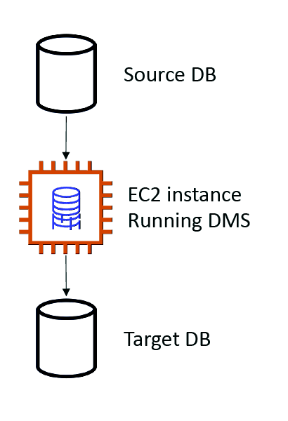

#### DMS Sources and Targets

**SOURCES:**

-  On-Premises and EC2 instances databases: Oracle, MS SQL Server, MySQL, MariaDB, PostgreSQL, MongoDB, SAP, DB2

-  Azure: Azure SQL Database

-  Amazon RDS: all including Aurora

-  Amazon S3

-  DocumentDB

**TARGETS:**

-  On-Premises and EC2 instances databases: Oracle, MS SQL Server, MySQL, MariaDB, PostgreSQL, SAP

-  Amazon RDS

-  Redshift, DynamoDB, S3

-  OpenSearch Service

-  Kinesis Data Streams

-  Apache Kafka

-  DocumentDB & Amazon Neptune

-  Redis & Babelfish

### AWS Schema Conversion Tool (SCT)

-  Convert your Database’s Schema from one engine to another

-  Example OLTP: (SQL Server or Oracle) to MySQL, PostgreSQL, Aurora

-  Example OLAP: (Teradata or Oracle) to Amazon Redshift

-  Prefer compute-intensive instances to optimize data conversions

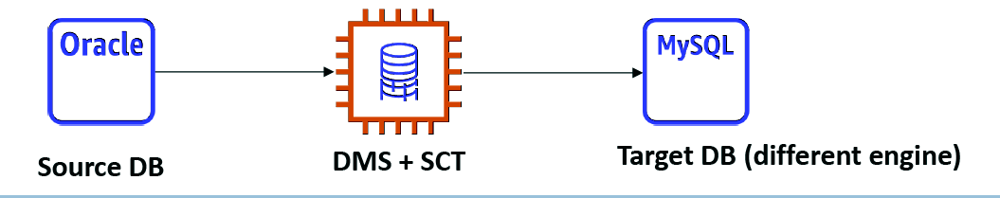

-  You do not need to use SCT if you are migrating the same DB engine

-  Ex: On-Premise PostgreSQL => RDS PostgreSQL

-  The DB engine is still PostgreSQL (RDS is the platform)

**Cheat Sheets**

**References:**

https://aws.amazon.com/dms/

https://aws.amazon.com/dms/features/?refid=9eeea834-765c-4895-95ec-d2fb1a1a573d

https://aws.amazon.com/dms/schema-conversion-tool/?nc=sn&loc=2&refid=9eeea834-765c-4895-95ec-d2fb1a1a573d

https://aws.amazon.com/dms/pricing/?nc=sn&loc=3

https://docs.aws.amazon.com/dms/index.html

https://aws.amazon.com/dms/getting-started/?refid=9eeea834-765c-4895-95ec-d2fb1a1a573d

https://aws.amazon.com/dms/faqs/?refid=9eeea834-765c-4895-95ec-d2fb1a1a573d

**Videos**

https://www.youtube.com/results?search_query=AWS+Database+Migration+Service

**Hands On**

https://www.youtube.com/results?search_query=AWS+Database+Migration+Service+hands+on

------------------------------------------------------------------------------------------------------------------------------------------------------------------
##  **2 - AWS DataSync**

**Definitions**

-  Simplify and accelerate secure data migrations
-  Securely discover and migrate your data to AWS with end-to-end security, including data encryption and data integrity validation.
-  Simplify migration planning and reduce expensive on-premises data movement costs with a fully managed service that seamlessly scales as data loads increase.
-  Easily manage data movement workloads with bandwidth throttling, migration scheduling, and task filtering.
-  Rapidly migrate file and object data to the cloud for data replication or archival.
-  Move large amount of data to and from
-  On-premises / other cloud to AWS (NFS, SMB, HDFS, S3 API…) – needs agent
-  AWS to AWS (different storage services) – no agent needed
-  Can synchronize to:
-  Amazon S3 (any storage classes – including Glacier)
-  Amazon EFS
-  Amazon FSx (Windows, Lustre, NetApp, OpenZFS...)
-  Replication tasks can be scheduled hourly, daily, weekly
-  File permissions and metadata are preserved (NFS POSIX, SMB…)
-  One agent task can use 10 Gbps, can setup a bandwidth limit

**NFS / SMB to AWS (S3, EFS, FSx…)**

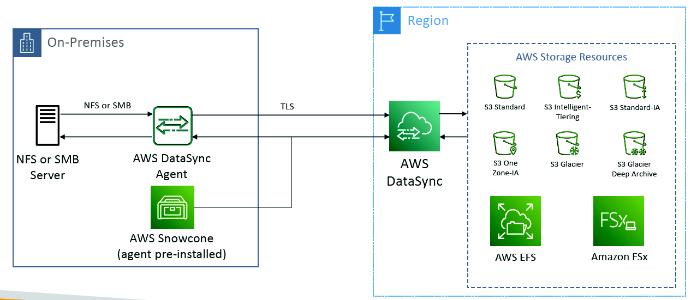

**Transfer between AWS storage services**

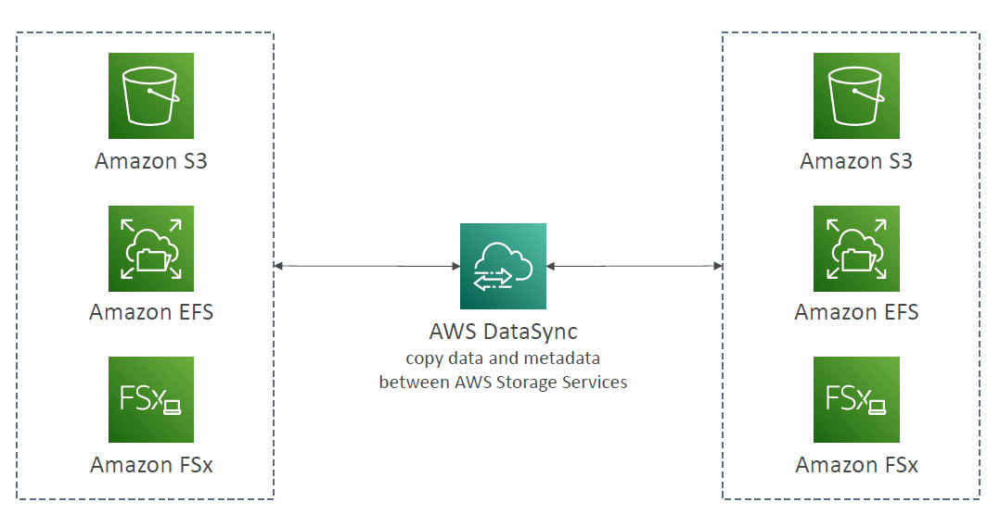

### How it works

**Transfer data between on premises and AWS**

AWS DataSync is a secure, online service that automates and accelerates moving data between on premises and AWS Storage services. DataSync can copy data between Network File System (NFS) shares, Server Message Block (SMB) shares, Hadoop Distributed File Systems (HDFS), self-managed object storage, AWS Snowcone, Amazon Simple Storage Service (Amazon S3) buckets, Amazon Elastic File System (Amazon EFS) file systems, Amazon FSx for Windows File Server file systems, Amazon FSx for Lustre file systems, Amazon FSz for OpenZFS file systems, and Amazon FSx for NetApp ONTAP file systems.

**Transfer data between AWS storage services**

AWS DataSync is also used to transfer data between AWS Storage services so you can replicate, archive, or share application data easily.

**Transfer data between AWS and other locations**

AWS DataSync supports moving data between other public clouds and AWS Storage services.

**Cheat Sheets**

**References:**

https://aws.amazon.com/datasync/

https://aws.amazon.com/datasync/discovery/

https://aws.amazon.com/datasync/features/

https://aws.amazon.com/datasync/pricing/

https://aws.amazon.com/datasync/getting-started/

https://aws.amazon.com/datasync/resources/?datasync-whats-new.sort-by=item.additionalFields.postDateTime&datasync-whats-new.sort-order=desc

https://aws.amazon.com/datasync/faqs/

**Videos**

https://www.youtube.com/results?search_query=+AWS+DataSync

**Hands On**

https://www.youtube.com/results?search_query=+AWS+DataSync+hands+on

------------------------------------------------------------------------------------------------------------------------------------------------------------------
##  **3 - AWS Migration Hub**

**Definitions**

Central location to collect servers and applications inventory data for the **assessment, planning, and tracking of migrations** to AWS

Helps accelerate your migration to AWS, automate **lift-and-shift**

**AWS Migration Hub Orchestrator** – provides pre-built templates to save time and effort migrating enterprise apps (e.g., SAP, Microsoft SQL Server…)

Supports migrations status updates from **Application Migration Service (MGN)** and **Database Migration Service (DMS)**

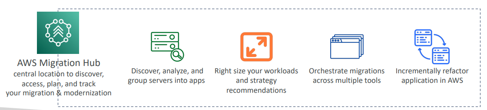

Discover the tools that you need to simplify your migration and modernization

Plan, migrate, and track applications for free

with the AWS Free Tier

Access essential discovery, analysis, and planning tools from a single location to build your migration plan.

Accelerate your migration to AWS by building an automated migration factory.

Access AWS expertise to plan your migration and meet your business objectives.

Save time by using proven workflow templates that you can customize to address your specific needs.

**How it works**

AWS Migration Hub provides a central location to collect server and application inventory data for the assessment, planning, and tracking of migrations to AWS. Migration Hub can also help accelerate application modernization following migration.

**Cheat Sheets**

**References:**

https://aws.amazon.com/migration-hub/?nc1=h_ls

https://aws.amazon.com/migration-hub/features/?nc=sn&loc=2

https://aws.amazon.com/migration-hub/pricing/?nc=sn&loc=3

https://aws.amazon.com/migration-hub/getting-started/?nc=sn&loc=4

https://aws.amazon.com/migration-hub/resources/?nc=sn&loc=5

https://aws.amazon.com/migration-hub/faqs/?nc=sn&loc=6

**Videos**

https://www.youtube.com/results?search_query=AWS+Migration+Hub

**Hands On**

https://www.youtube.com/results?search_query=AWS+Migration+Hub+hands+on

------------------------------------------------------------------------------------------------------------------------------------------------------------------
##  **4 - AWS Server Migration Service (AWS SMS)**

**Definitions**

**Cheat Sheets**

**References:**

**Videos**

**Hands On**

------------------------------------------------------------------------------------------------------------------------------------------------------------------
##  **5 - AWS Snowball**

**Definitions**

AWS Snow Family

- Move petabytes of data to and from AWS, or process data at the edge
- Purpose-built devices to cost effectively move petabytes of data, offline. Lease a Snow device to move your data to the cloud.
- Field-tested for the most extreme conditions, delivering high security and ruggedization into compute and storage-compatible devices.
- Device options range to optimize for space- or weight-constrained environments, portability, and flexible networking options.
- Highly-secure, portable devices to collect and process data at the edge, and migrate data into and out of AWS

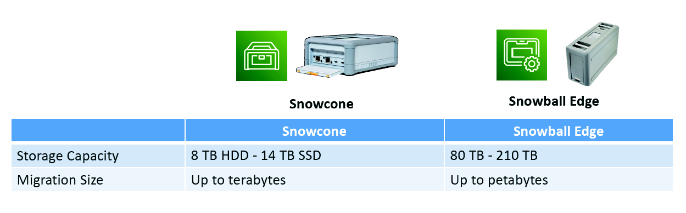

**AWS Snow Family key features**

Each feature listed below are standard features across each device type. To learn more about AWS Snowcone or AWS Snowball device specifications unique to each device type, visit their feature pages.

**Data Migrations with AWS Snow Family**

- Challenges:
    - Limited connectivity
    - Limited bandwidth
    - High network cost
    - Shared bandwidth (can’t maximize the line)
    - Connection stability

    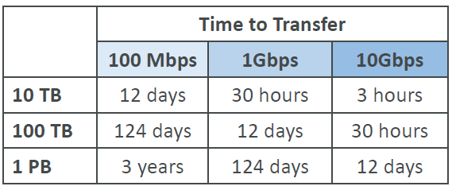

AWS Snow Family: offline devices to perform data migrations If it takes more than a week to transfer over the network, use Snowball devices!

- Direct upload to S3:
  
  

- With Snow Family:

  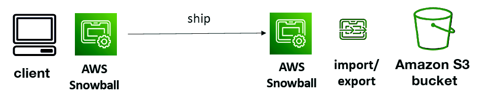

- Snow Family – Usage Process
    1. Request Snowball devices from the AWS console for delivery
    2. Install the snowball client / AWS OpsHub on your servers
    3. Connect the snowball to your servers and copy files using the client
    4. Ship back the device when you’re done (goes to the right AWS facility)
    5. Data will be loaded into an S3 bucket
    6. Snowball is completely wiped

### **What is Edge Computing?**

    -  Process data while it’s being created on an edge location
    -  A truck on the road, a ship on the sea, a mining station underground...
    -  These locations may have limited internet and no access to computing power
    -  We setup a Snowball Edge / Snowcone device to do edge computing
    -  Snowcone: 2 CPUs, 4 GB of memory, wired or wireless access
    -  Snowball Edge Compute Optimized (dedicated for that use case) & Storage Optimized
    -  Run EC2 Instances or Lambda functions at the edge
    -  Use cases: preprocess data, machine learning, transcoding media

### **Solution Architecture: Snowball into Glacier**

- Snowball cannot import to Glacier directly
- You must use Amazon S3 first, in combination with an S3 lifecycle policy

  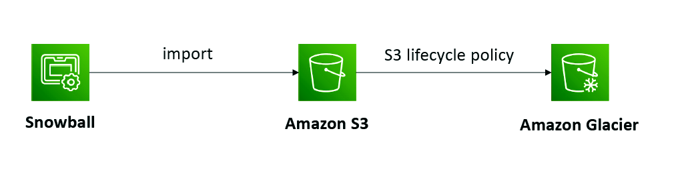

**Cheat Sheets**

**References:**

https://aws.amazon.com/snow/

https://aws.amazon.com/snow/faqs/?nc=sn&loc=2

https://aws.amazon.com/snowcone/?nc=sn&loc=3

https://aws.amazon.com/snowball/?nc=sn&loc=4

https://aws.amazon.com/snowmobile/?nc=sn&loc=5

**Videos**

https://www.youtube.com/results?search_query=AWS+Snowball

**Hands On**

https://www.youtube.com/results?search_query=AWS+Snowball+hands+on

------------------------------------------------------------------------------------------------------------------------------------------------------------------
##  **6 - AWS Transfer Family**

**Definitions**

AWS Transfer Family

Easily manage and share data with simple, secure, and scalable file transfers

Easily manage file transfers and modernize your transfer workflows within hours by using your existing authentication systems.

Store information in Amazon S3 or Amazon EFS, manage workflows, and trigger automated, event-driven tasks with a fully-managed, low-code service.

Support thousands of concurrent users with access controls and quickly scale your business-to-business (B2B) file transfers for each line-of-business user.

Meet your security requirements with data encryption, VPC and FIPS endpoints, compliance certifications, and more.

**How it works**

AWS Transfer Family securely scales your recurring business-to-business file transfers to AWS Storage services using SFTP, FTPS, FTP, and AS2 protocols.

**Cheat Sheets**

**References:**

https://aws.amazon.com/aws-transfer-family/?nc=sn&loc=1&refid=9eeea834-765c-4895-95ec-d2fb1a1a573d

https://docs.aws.amazon.com/transfer/latest/userguide/what-is-aws-transfer-family.html

https://aws.amazon.com/aws-transfer-family/features/?nc=sn&loc=2&dn=1

https://aws.amazon.com/aws-transfer-family/mft/?nc=sn&loc=2&dn=2&aws-transfer-fa.sort-by=item.additionalFields.createdDate&aws-transfer-fa.sort-order=desc&aws-transfer-fauto.sort-by=item.additionalFields.createdDate&aws-transfer-fauto.sort-order=desc&aws-transfer-fc.sort-by=item.additionalFields.createdDate&aws-transfer-fc.sort-order=desc&aws-transfer-fsc.sort-by=item.additionalFields.createdDate&aws-transfer-fsc.sort-order=desc

https://aws.amazon.com/aws-transfer-family/pricing/?nc=sn&loc=3&refid=9eeea834-765c-4895-95ec-d2fb1a1a573d

https://aws.amazon.com/aws-transfer-family/getting-started/?nc=sn&loc=4&refid=9eeea834-765c-4895-95ec-d2fb1a1a573d

https://aws.amazon.com/aws-transfer-family/resources/?nc=sn&loc=5

https://aws.amazon.com/aws-transfer-family/faqs/?nc=sn&loc=6&refid=9eeea834-765c-4895-95ec-d2fb1a1a573d

**Videos**

https://www.youtube.com/results?search_query=AWS+Transfer+Family

**Hands On**

https://www.youtube.com/results?search_query=AWS+Transfer+Family+hands+on

------------------------------------------------------------------------------------------------------------------------------------------------------------------
##  **7 - AWS Application Discovery Service**

**Definitions**

- Plan migration projects by gathering information about on-premises data centers
- Server utilization data and dependency mapping are important for migrations
- **Agentless Discovery** (AWS Agentless Discovery Connector)
 - VM inventory, configuration, and performance history such as CPU, memory, and disk usage
- **Agent-based Discovery** (AWS Application Discovery Agent)
 - System configuration, system performance, running processes, and details of the network connections between systems

- Resulting data can be viewed within AWS Migration Hub

Discover on-premises server inventory and behavior to plan cloud migrations

Deploy 1,000 on-premises collectors

with the AWS Free Tier

Gather server utilization and network connection data to create a detailed migration plan.

Gain a comprehensive snapshot of on-premises inventory to work with AWS experts and accelerate the migration journey.

Integrate discovery data with other AWS services, such as AWS Migration Hub, to support multiple migration tasks.

Protect collected data by encrypting it in transit to AWS and at rest within the service’s data store.

**How it works**

AWS Application Discovery Service helps you plan cloud migration projects by gathering information about your on-premises data centers.

**Cheat Sheets**

**References:**

https://aws.amazon.com/application-discovery/

https://aws.amazon.com/application-discovery/features/

https://aws.amazon.com/application-discovery/pricing/

https://aws.amazon.com/application-discovery/getting-started/

https://aws.amazon.com/application-discovery/resources/

https://aws.amazon.com/application-discovery/faqs/

**Videos**

https://www.youtube.com/results?search_query=AWS+Application+Discovery+Service

**Hands On**

https://www.youtube.com/results?search_query=AWS+Application+Discovery+Service+hands+on

------------------------------------------------------------------------------------------------------------------------------------------------------------------
##  **8 - AWS Application Migration Service (MGN)**

**Definitions**

- The “AWS evolution” of CloudEndure Migration, replacing AWS Server Migration Service (SMS)
- Lift-and-shift (rehost) solution which simplify migrating applications to AWS
- Converts your physical, virtual, and cloud-based servers to run natively on AWS
- Supports wide range of platforms, Operating Systems, and databases
- Minimal downtime, reduced costs

CloudEndure Migration and CloudEndure Disaster Recovery, services offered by AWS, now allow you to migrate, replicate, and recover applications from any source directly into AWS Outposts or between AWS Outposts devices, leading to lower latencies, better performance, and reduced costs. Previously, replicated data had to be transferred to and stored in a public AWS Region before being copied into EBS volumes on the AWS Outposts device. This caused increased cutover and recovery times, as well as data residency issues.

CloudEndure services’ newly launched support of EBS Local Snapshots on AWS Outposts is intended for users who need to run their applications on premises due to low latency, local data processing, or data residency policies that require data and backups to be stored in a specific country, state, or municipality for regulatory, contractual, or information security reasons.

Now that CloudEndure Migration supports replication to and from AWS Outposts, and between AWS Outposts, you can quickly lift and shift your applications without compatibility issues into an AWS native format while continuing to operate in your data center.

With CloudEndure Disaster Recovery now supporting AWS Outposts, you can increase the resilience of your on-premise applications by replicating into and failing over to an AWS Outposts device. You no longer need to failover to a public AWS Region. In addition, if you already have applications running on an AWS Outposts device, you can replicate and failover between two AWS Outposts devices.

This new feature is supported in all AWS Regions in which AWS Outposts and CloudEndure services are available.

To learn more, visit the CloudEndure Migration or CloudEndure Disaster Recovery product pages. For technical information on how to use CloudEndure services with AWS Outposts, visit this CloudEndure documentation page.

**Cheat Sheets**

**References:**

https://aws.amazon.com/pt/about-aws/whats-new/2021/03/cloudendure-migration-cloudendure-disaster-recoverysupports-ebs-local-snapshots-on-aws-outposts/

https://aws.amazon.com/pt/blogs/aws/category/migration/cloudendure-migration/

https://aws.amazon.com/application-migration-service/

https://aws.amazon.com/disaster-recovery/

**Videos**

**Hands On**

------------------------------------------------------------------------------------------------------------------------------------------------------------------
##  **99 - Cloud Migration Strategies: The 7Rs**

[accelerate-your-application-migration-to-aws](https://aws.amazon.com/pt/blogs/enterprise-strategy/new-possibilities-seven-strategies-to-accelerate-your-application-migration-to-aws/)

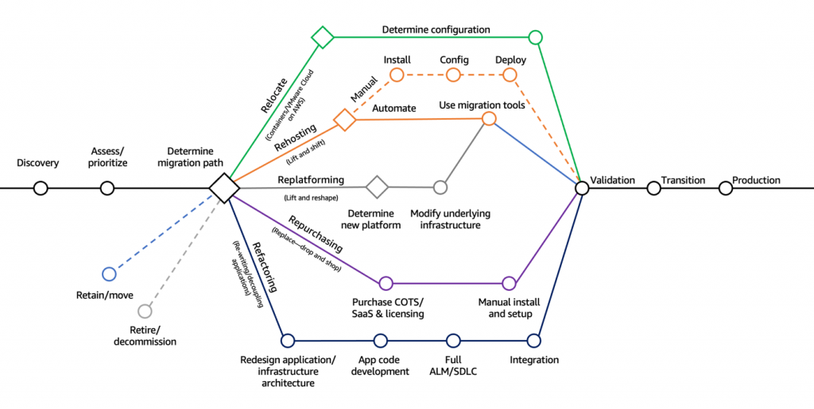

- **Retire**
  - Turn off things you don’t need (maybe as a result of Re-architecting)
  - Helps with reducing the surface areas for attacks (more security)
  - Save cost, maybe up to 10% to 20%
  - Focus your attention on resources that must be maintained

- **Retain**
  - Do nothing for now (it’s still a decision to make in a Cloud Migration)
  - Security, data compliance, performance, unresolved dependencies
  - No business value to migrate, mainframe or mid-range and non-x86 Unix apps

- **Relocate**
  - Move apps from on-premises to its Cloud version
  - Move EC2 instances to a different VPC, AWS account or AWS Region
  - Example: transfer servers from VMware Software-defined Data Center (SSDC) to VMware Cloud on AWS

- **Rehost “lift and shift”**
  - Simple migrations by re-hosting on AWS (applications, databases, data…)
  - Migrate machines (physical, virtual, another Cloud) to AWS Cloud
  - No cloud optimizations being done, applications is migrated as is
  - Could save as much as 30% on cost
  - Example: Migrate using AWS Application Migration Service

- **Replatform “lift and reshape”**
  - Example: migrate your database to RDS
  - Example: migrate your application to Elastic Beanstalk
  - Not changing the core architecture, but leverage some Cloud optimizations
  - Save time and money by moving to a fully managed service or Serverless

- **Repurchase “drop and shop”**
  - Moving to a different product while moving to the Cloud
  - Often you move to a SaaS platform
  - Expensive in the short term, but quick to deploy
  - Example: CRM to Salesforce.com, HR to Workday, CMS to Drupal

- **Refactor / Re-architect**
  - Reimagining how the application is architected using Cloud Native features
  - Driven by the need of the business to add features and improve scalability, performance, security, and agility
  - Move from a monolithic application to micro-services
  - Example: move an application to Serverless architectures, use AWS S3

[Cloud Migration Strategies the 6Rs](https://aws.amazon.com/pt/blogs/enterprise-strategy/6-strategies-for-migrating-applications-to-the-cloud/)

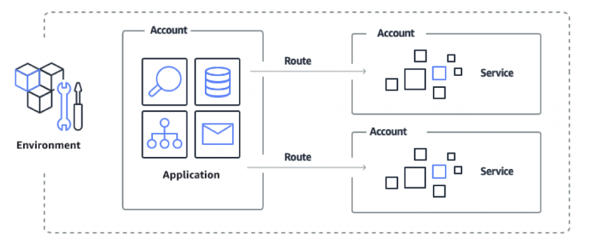
