  [General Content AWS Cloud][1]

[1]: https://github.com/weder96/aws-certification-learning

# # Module 13: Migration and Transfer

## COntents
1.  <a href="#section-01"> AWS Database Migration Service (AWS DMS) </a>
2.  <a href="#section-02"> AWS DataSync </a>
3.  <a href="#section-03"> AWS Migration Hub </a>
4.  <a href="#section-04"> AWS Server Migration Service (AWS SMS) </a>
5.  <a href="#section-05"> AWS Snowball </a>
6.  <a href="#section-06"> AWS Transfer Family </a>
7.  <a href="#section-07"> AWS Application Discovery Service </a>
8.  <a href="#section-08"> AWS Application Migration Service CloudEndure Migration</a>
99. <a href="#section-99"> AWS Application Migration Service CloudEndure Migration</a>

----------------------------------------------------------------------------------------------
##  **01 - AWS Database Migration Service (AWS DMS)**

**Definitions**

AWS Database Migration Service (AWS DMS) is a powerful cloud service that enables the quick, secure, and resilient migration of databases to AWS. With support for both homogeneous and heterogeneous migrations, AWS DMS simplifies the process of moving databases between on-premises environments, AWS databases, and across different AWS database services.
- Trusted by customers globally to securely migrate 800,000+ databases with minimal downtime
- Discover, assess, convert, and migrate your database and analytics workloads to AWS with automated migration.
- Maintain high availability and minimal downtime during the migration process with Multi-AZ and ongoing data replication and monitoring.
- Supports homogeneous and heterogeneous database migrations from Oracle, SQL Server, PostgreSQL, MySQL, MongoDB, MariaDB, and other databases.
- Migrate a terabyte-sized database at a low cost, paying only for the compute resources and additional log storage used during the migration process.

**How it works**

AWS Database Migration Service (AWS DMS) is a managed migration and replication service that helps move your database and analytics workloads to AWS quickly, securely, and with minimal downtime and zero data loss. AWS DMS supports migration between 20-plus database and analytics engines, such as Oracle to Amazon Aurora MySQL-Compatible Edition, MySQL to Amazon Relational Database (RDS) for MySQL, Microsoft SQL Server to Amazon Aurora PostgreSQL-Compatible Edition, MongoDB to Amazon DocumentDB (with MongoDB compatibility), Oracle to Amazon Redshift, and Amazon Simple Storage Service (S3).

**DMS – Database Migration Service**

-  Quickly and securely migrate databases to AWS, resilient, self healing
-  The source database remains available during the migration
-  Supports:
    -  Homogeneous migrations: ex Oracle to Oracle
    -  Heterogeneous migrations: ex Microsoft SQL Server to Aurora
-  Continuous Data Replication using CDC
-  You must create an EC2 instance to perform the replication tasks

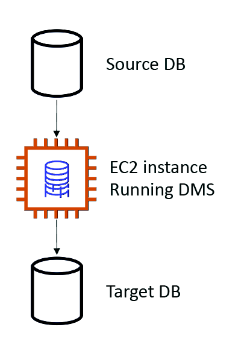

#### DMS Sources and Targets

**SOURCES:**

-  On-Premises and EC2 instances databases: Oracle, MS SQL Server, MySQL, MariaDB, PostgreSQL, MongoDB, SAP, DB2
-  Azure: Azure SQL Database
-  Amazon RDS: all including Aurora
-  Amazon S3
-  DocumentDB

**TARGETS:**

-  On-Premises and EC2 instances databases: Oracle, MS SQL Server, MySQL, MariaDB, PostgreSQL, SAP
-  Amazon RDS
-  Redshift, DynamoDB, S3
-  OpenSearch Service
-  Kinesis Data Streams
-  Apache Kafka
-  DocumentDB & Amazon Neptune
-  Redis & Babelfish

### AWS Schema Conversion Tool (SCT)

-  Convert your Database’s Schema from one engine to another
-  Example OLTP: (SQL Server or Oracle) to MySQL, PostgreSQL, Aurora
-  Example OLAP: (Teradata or Oracle) to Amazon Redshift
-  Prefer compute-intensive instances to optimize data conversions

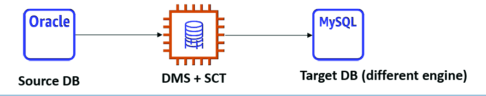

-  You do not need to use SCT if you are migrating the same DB engine
-  Ex: On-Premise PostgreSQL => RDS PostgreSQL
-  The DB engine is still PostgreSQL (RDS is the platform)

### Key Features and Capabilities

### **1. Source and Target Database Compatibility**

AWS DMS supports a wide range of databases as sources and targets:

#### **Supported Sources**

- On-Premises Databases and Amazon EC2 Instances: Oracle, MS SQL Server, MySQL, MariaDB, PostgreSQL, MongoDB, SAP, DB2.
- AWS Databases: Amazon RDS (including Aurora), Amazon S3, DocumentDB.
- Microsoft Azure: Azure SQL Database.

#### **Supported Targets**

- On-Premises Databases and Amazon EC2 Instances: Oracle, MS SQL Server, MySQL, MariaDB, PostgreSQL, SAP.
- AWS Databases: Amazon RDS, Redshift, DynamoDB, Amazon S3.
- AWS Services: OpenSearch Service, Kinesis Data Streams, Apache Kafka, Amazon Neptune, Redis, and Babelfish.

### **2. Migration Support for Various Scenarios**

AWS DMS is designed to handle a variety of migration tasks:

- **Homogeneous migrations**: Example: Oracle to Oracle.
- **Heterogeneous migrations**: Example: Microsoft SQL Server to Amazon Aurora.

The service also supports **continuous data replication** using Change Data Capture (CDC), ensuring near real-time synchronization between source and target databases.

The source database remains fully operational during the migration, minimizing downtime to applications that rely on the database

### **3. Schema Conversion and Data Migration**

AWS DMS provides tools for schema conversion and seamless data migration:

- **Schema Conversion**: Automatically convert schemas for heterogeneous migrations. For example:
  - **OLTP** (SQL Server or Oracle) to MySQL, PostgreSQL, or Aurora.
  - **OLAP** (Teradata or Oracle) to Amazon Redshift.
- **Data Transformation**: AWS DMS handles all necessary data type conversions automatically during migration.

For advanced schema conversion needs, users can leverage the **AWS Schema Conversion Tool (AWS SCT)** to locally convert source schemas before initiating the migration.

### Ongoing Data Replication (CDC)

AWS DMS employs CDC (Change Data Capture) for ongoing replication, enabling near real-time synchronization between databases. There are two types of replication tasks:

1. **Full Load + CDC**: Migrates existing data and continues synchronizing subsequent changes.
2. **CDC Only**: Synchronizes ongoing changes after initial migration.

CDC collects changes from database logs using the source engine's native APIs, ensuring efficient and accurate replication.

### Migration to Amazon S3 and Amazon Redshift

AWS DMS supports direct migrations to **Amazon S3** and **Amazon Redshift**:

- **Amazon S3**: Data is written in **CSV format** by default but can be stored in **Apache Parquet format** for more compact storage and faster queries.
- **Amazon Redshift**:
  - The Amazon Redshift cluster must be in the same AWS account and the same AWS Region as the replication instance.
  - Data is first moved to an Amazon S3 bucket.
  - AWS DMS transfers the data to appropriate tables in Redshift.

### Deployment Architecture

### **1. Replication Instances**

AWS DMS uses a **replication instance**, which is deployed on an Amazon EC2 instance in a virtual private cloud (VPC). You use this replication instance to perform your database migration. Key benefits include:

- **High Availability**: In a Multi-AZ deployment, AWS DMS automatically provisions and maintains a synchronous standby replica of the replication instance in a different Availability Zone. The primary replication instance is synchronously replicated across Availability Zones to a standby replica.
- **Failover Support**: Ensures minimal disruption in case of a failure.

### **2. Security**

- **SSL Encryption**: Secure connections between source and target databases using SSL certificates.
- **Multi-AZ Deployments**: Enhances reliability with data redundancy and reduced latency spikes.

### Advanced Use Cases

### **1. Continuous Integration of Databases**

AWS DMS supports real-time replication from transactional databases like Amazon Aurora to analytical systems like Amazon Redshift, enabling seamless integration for analytics workflows.

### **2. Streaming Targets**

AWS DMS can migrate data to streaming services such as:

- Amazon Kinesis.
- Amazon Managed Streaming for Apache Kafka (Amazon MSK).

### **3. Self-Healing and Resilient Migrations**

AWS DMS provides robust self-healing capabilities, ensuring migrations are fault-tolerant and continue smoothly despite disruptions.

### Summary

AWS Database Migration Service is an essential tool for organizations looking to migrate databases securely and efficiently to AWS. Its versatility in supporting different database engines, combined with features like **schema conversion**, **continuous replication**, and **Multi-AZ deployment**, makes it a comprehensive solution for database migrations.

**Key Benefits**:

- Minimized downtime with ongoing replication.
- Simplified migration of OLTP and OLAP workloads.
- Broad compatibility across database engines and AWS services.
- High availability and failover support through Multi-AZ deployments.

AWS DMS empowers businesses to modernize their database environments, leveraging AWS’s robust ecosystem to achieve scalability, agility, and cost savings.

**Cheat Sheets**

**References:**

https://aws.amazon.com/dms/

https://aws.amazon.com/dms/features/?refid=9eeea834-765c-4895-95ec-d2fb1a1a573d

https://aws.amazon.com/dms/schema-conversion-tool/?nc=sn&loc=2&refid=9eeea834-765c-4895-95ec-d2fb1a1a573d

https://aws.amazon.com/dms/pricing/?nc=sn&loc=3

https://docs.aws.amazon.com/dms/index.html

https://aws.amazon.com/dms/getting-started/?refid=9eeea834-765c-4895-95ec-d2fb1a1a573d

https://aws.amazon.com/dms/faqs/?refid=9eeea834-765c-4895-95ec-d2fb1a1a573d

**Videos**

https://www.youtube.com/results?search_query=AWS+Database+Migration+Service

**Hands On**

https://www.youtube.com/results?search_query=AWS+Database+Migration+Service+hands+on

------------------------------------------------------------------------------------------------------------------------------------------------------------------
##  **02 - AWS DataSync**

**Definitions**

AWS DataSync is a fully managed online data transfer service that simplifies, automates, and accelerates the process of copying large datasets to and from AWS storage services. Designed for scalability and efficiency, DataSync can transfer data up to 10 times faster than traditional command-line tools by leveraging a purpose-built network protocol and scale-out architecture.

-  Simplify and accelerate secure data migrations
-  Securely discover and migrate your data to AWS with end-to-end security, including data encryption and data integrity validation.
-  Simplify migration planning and reduce expensive on-premises data movement costs with a fully managed service that seamlessly scales as data loads increase.
-  Easily manage data movement workloads with bandwidth throttling, migration scheduling, and task filtering.
-  Rapidly migrate file and object data to the cloud for data replication or archival.
-  Move large amount of data to and from
-  On-premises / other cloud to AWS (NFS, SMB, HDFS, S3 API…) – needs agent
-  AWS to AWS (different storage services) – no agent needed
-  Can synchronize to:
-  Amazon S3 (any storage classes – including Glacier)
-  Amazon EFS
-  Amazon FSx (Windows, Lustre, NetApp, OpenZFS...)
-  Replication tasks can be scheduled hourly, daily, weekly
-  File permissions and metadata are preserved (NFS POSIX, SMB…)
-  One agent task can use 10 Gbps, can setup a bandwidth limit

**NFS / SMB to AWS (S3, EFS, FSx…)**

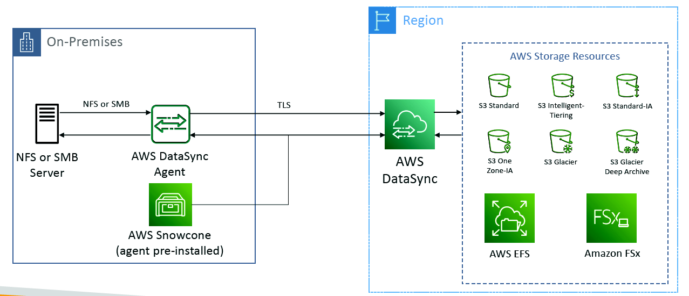

**Transfer between AWS storage services**

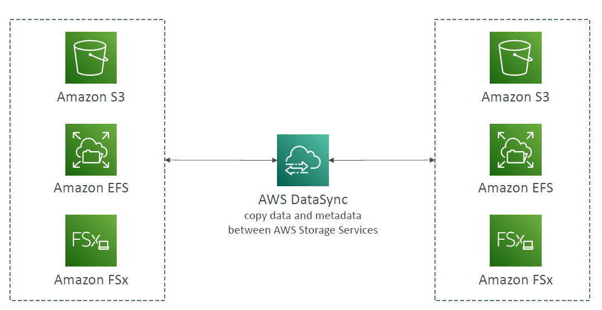

### How it works

**Transfer data between on premises and AWS**

AWS DataSync is a secure, online service that automates and accelerates moving data between on premises and AWS Storage services. DataSync can copy data between Network File System (NFS) shares, Server Message Block (SMB) shares, Hadoop Distributed File Systems (HDFS), self-managed object storage, AWS Snowcone, Amazon Simple Storage Service (Amazon S3) buckets, Amazon Elastic File System (Amazon EFS) file systems, Amazon FSx for Windows File Server file systems, Amazon FSx for Lustre file systems, Amazon FSz for OpenZFS file systems, and Amazon FSx for NetApp ONTAP file systems.

**Transfer data between AWS storage services**

AWS DataSync is also used to transfer data between AWS Storage services so you can replicate, archive, or share application data easily.

**Transfer data between AWS and other locations**

AWS DataSync supports moving data between other public clouds and AWS Storage services.

### Versatility in Data Transfers

- **On-Premises/Other Cloud to AWS**: Transfers data from Network File System (NFS), Server Message Block (SMB), Hadoop Distributed File Systems (HDFS), or self-managed object storage to AWS storage services. This process requires deploying an agent in the source environment.
- **AWS to AWS Transfers**: Migrates data between different AWS storage services (e.g., Amazon S3 to Amazon EFS) without the need for an agent.
- **Cross-Service Support**: Supports data synchronization across:
  - **Amazon S3**: All storage classes, including Glacier and Glacier Deep Archive.
  - **Amazon EFS**: For scalable and elastic file storage.
  - **Amazon FSx**: Includes FSx for Windows File Server, FSx for Lustre, FSx for OpenZFS, and FSx for NetApp ONTAP.

### Reliability and Data Integrity

- **Network Optimizations**: Built-in retry and resiliency mechanisms to handle transient network issues.
- **Data Integrity Verification**: Ensures data consistency during and after transfer by verifying integrity.
- **File Metadata Preservation**: Retains file permissions and metadata, such as NFS POSIX and SMB attributes.

### Scalability and Performance

- A single DataSync agent can saturate a 10 Gbps network link, ensuring high-speed transfers.
- Bandwidth can be limited to manage network utilization effectively.

### Automation and Scheduling

- **Task Scheduling**: Automates repetitive tasks with schedules on an hourly, daily, or weekly basis.
- **Monitoring and Metrics**: Offers detailed visibility through:
  - **Amazon CloudWatch**: Provides metrics, events, and logs for granular monitoring.
  - **AWS DataSync API and Console**: Facilitates task creation and management.

### Long-Term Storage and Cost Optimization

- **Cold Data Management**: Transfers infrequently accessed on-premises data to cost-effective AWS storage solutions such as Amazon S3 Glacier and Glacier Deep Archive.
- **Integration with AWS Storage Gateway**: For ongoing access and updates to migrated data.

### Security

- **Encrypted Transfers**: Ensures secure data movement between source and target.
- **Native Integrations**: Works seamlessly with Amazon CloudWatch and AWS CloudTrail for security auditing and monitoring.

### Use Cases

1. **Large-Scale Migrations**: Moving datasets from on-premises or other clouds to AWS storage services for cloud adoption or hybrid architectures.
2. **AWS-to-AWS Transfers**: Migrating or synchronizing data between AWS storage services for compliance, performance optimization, or disaster recovery purposes.
3. **Data Archival**: Offloading infrequently accessed on-premises data to S3 Glacier or Glacier Deep Archive to reduce costs.
4. **Hybrid Cloud Storage**: Retaining access to migrated data using AWS Storage Gateway File Gateway.

### Limitations

- **Database Migration**: AWS DataSync is primarily designed for file-based data transfers. It lacks database-specific features such as schema handling, ongoing replication (Change Data Capture), and JDBC/ODBC integration. For database migrations, AWS Database Migration Service (DMS) is recommended.
- **On-Premises Agent Requirement**: For transfers from on-premises or non-AWS cloud environments, an agent must be deployed.

### Alternative Solutions

- **AWS Snowcone**: For environments with limited connectivity or when a physical device-based migration is more practical.
- **AWS Storage Gateway**: For hybrid storage solutions that enable continued on-premises access to AWS-stored data.

AWS recommends that you should use AWS DataSync to migrate existing data from on-premises to Amazon S3, and subsequently use the File Gateway configuration of AWS Storage Gateway to retain access to the migrated data and for ongoing updates from your on-premises file-based applications.

**Cheat Sheets**

**References:**

https://aws.amazon.com/datasync/

https://aws.amazon.com/datasync/discovery/

https://aws.amazon.com/datasync/features/

https://aws.amazon.com/datasync/pricing/

https://aws.amazon.com/datasync/getting-started/

https://aws.amazon.com/datasync/resources/?datasync-whats-new.sort-by=item.additionalFields.postDateTime&datasync-whats-new.sort-order=desc

https://aws.amazon.com/datasync/faqs/

**Videos**

https://www.youtube.com/results?search_query=+AWS+DataSync

**Hands On**

https://www.youtube.com/results?search_query=+AWS+DataSync+hands+on

------------------------------------------------------------------------------------------------------------------------------------------------------------------
##  **03 - AWS Migration Hub**

**Definitions**

Central location to collect servers and applications inventory data for the **assessment, planning, and tracking of migrations** to AWS

Helps accelerate your migration to AWS, automate **lift-and-shift**

**AWS Migration Hub Orchestrator** – provides pre-built templates to save time and effort migrating enterprise apps (e.g., SAP, Microsoft SQL Server…)

Supports migrations status updates from **Application Migration Service (MGN)** and **Database Migration Service (DMS)**

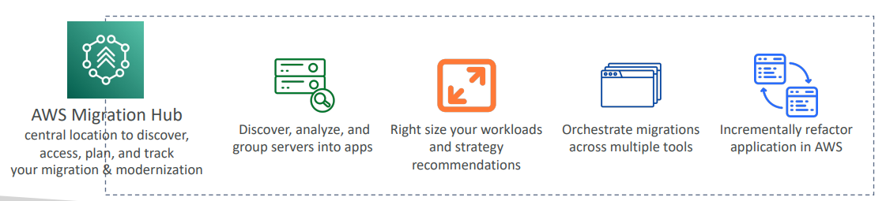

Discover the tools that you need to simplify your migration and modernization

Plan, migrate, and track applications for free

with the AWS Free Tier

Access essential discovery, analysis, and planning tools from a single location to build your migration plan.

Accelerate your migration to AWS by building an automated migration factory.

Access AWS expertise to plan your migration and meet your business objectives.

Save time by using proven workflow templates that you can customize to address your specific needs.

**How it works**

AWS Migration Hub provides a central location to collect server and application inventory data for the assessment, planning, and tracking of migrations to AWS. Migration Hub can also help accelerate application modernization following migration.

**Cheat Sheets**

**References:**

https://aws.amazon.com/migration-hub/?nc1=h_ls

https://aws.amazon.com/migration-hub/features/?nc=sn&loc=2

https://aws.amazon.com/migration-hub/pricing/?nc=sn&loc=3

https://aws.amazon.com/migration-hub/getting-started/?nc=sn&loc=4

https://aws.amazon.com/migration-hub/resources/?nc=sn&loc=5

https://aws.amazon.com/migration-hub/faqs/?nc=sn&loc=6

**Videos**

https://www.youtube.com/results?search_query=AWS+Migration+Hub

**Hands On**

https://www.youtube.com/results?search_query=AWS+Migration+Hub+hands+on

------------------------------------------------------------------------------------------------------------------------------------------------------------------
##  **04 - AWS Server Migration Service (AWS SMS)**

**Definitions**

**Cheat Sheets**

**References:**

**Videos**

**Hands On**

------------------------------------------------------------------------------------------------------------------------------------------------------------------
##  **05 - AWS Snowball**

**Definitions**

AWS Snow Family

- Move petabytes of data to and from AWS, or process data at the edge
- Purpose-built devices to cost effectively move petabytes of data, offline. Lease a Snow device to move your data to the cloud.
- Field-tested for the most extreme conditions, delivering high security and ruggedization into compute and storage-compatible devices.
- Device options range to optimize for space- or weight-constrained environments, portability, and flexible networking options.
- Highly-secure, portable devices to collect and process data at the edge, and migrate data into and out of AWS

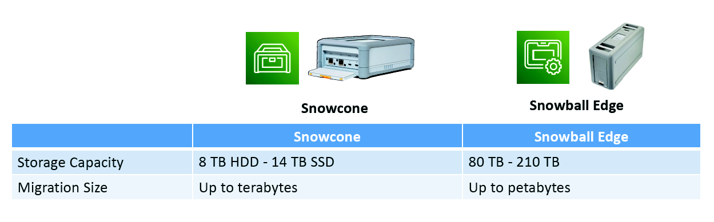

**AWS Snow Family key features**

Each feature listed below are standard features across each device type. To learn more about AWS Snowcone or AWS Snowball device specifications unique to each device type, visit their feature pages.

**Data Migrations with AWS Snow Family**

- Challenges:
    - Limited connectivity
    - Limited bandwidth
    - High network cost
    - Shared bandwidth (can’t maximize the line)
    - Connection stability

    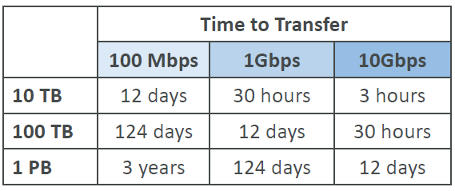

AWS Snow Family: offline devices to perform data migrations If it takes more than a week to transfer over the network, use Snowball devices!

- Direct upload to S3:
  
  

- With Snow Family:

  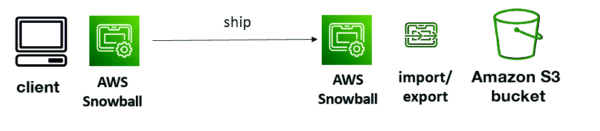

- Snow Family – Usage Process
    1. Request Snowball devices from the AWS console for delivery
    2. Install the snowball client / AWS OpsHub on your servers
    3. Connect the snowball to your servers and copy files using the client
    4. Ship back the device when you’re done (goes to the right AWS facility)
    5. Data will be loaded into an S3 bucket
    6. Snowball is completely wiped

### **What is Edge Computing?**

    -  Process data while it’s being created on an edge location
    -  A truck on the road, a ship on the sea, a mining station underground...
    -  These locations may have limited internet and no access to computing power
    -  We setup a Snowball Edge / Snowcone device to do edge computing
    -  Snowcone: 2 CPUs, 4 GB of memory, wired or wireless access
    -  Snowball Edge Compute Optimized (dedicated for that use case) & Storage Optimized
    -  Run EC2 Instances or Lambda functions at the edge
    -  Use cases: preprocess data, machine learning, transcoding media

### **Solution Architecture: Snowball into Glacier**

- Snowball cannot import to Glacier directly
- You must use Amazon S3 first, in combination with an S3 lifecycle policy

  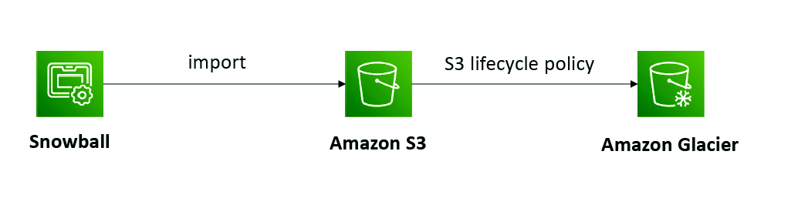

**Cheat Sheets**

**References:**

https://aws.amazon.com/snow/

https://aws.amazon.com/snow/faqs/?nc=sn&loc=2

https://aws.amazon.com/snowcone/?nc=sn&loc=3

https://aws.amazon.com/snowball/?nc=sn&loc=4

https://aws.amazon.com/snowmobile/?nc=sn&loc=5

**Videos**

https://www.youtube.com/results?search_query=AWS+Snowball

**Hands On**

https://www.youtube.com/results?search_query=AWS+Snowball+hands+on

------------------------------------------------------------------------------------------------------------------------------------------------------------------
##  **06 - AWS Transfer Family**

**Definitions**

AWS Transfer Family

Easily manage and share data with simple, secure, and scalable file transfers

Easily manage file transfers and modernize your transfer workflows within hours by using your existing authentication systems.

Store information in Amazon S3 or Amazon EFS, manage workflows, and trigger automated, event-driven tasks with a fully-managed, low-code service.

Support thousands of concurrent users with access controls and quickly scale your business-to-business (B2B) file transfers for each line-of-business user.

Meet your security requirements with data encryption, VPC and FIPS endpoints, compliance certifications, and more.

**How it works**

AWS Transfer Family securely scales your recurring business-to-business file transfers to AWS Storage services using SFTP, FTPS, FTP, and AS2 protocols.

**Cheat Sheets**

**References:**

https://aws.amazon.com/aws-transfer-family/?nc=sn&loc=1&refid=9eeea834-765c-4895-95ec-d2fb1a1a573d

https://docs.aws.amazon.com/transfer/latest/userguide/what-is-aws-transfer-family.html

https://aws.amazon.com/aws-transfer-family/features/?nc=sn&loc=2&dn=1

https://aws.amazon.com/aws-transfer-family/mft/?nc=sn&loc=2&dn=2&aws-transfer-fa.sort-by=item.additionalFields.createdDate&aws-transfer-fa.sort-order=desc&aws-transfer-fauto.sort-by=item.additionalFields.createdDate&aws-transfer-fauto.sort-order=desc&aws-transfer-fc.sort-by=item.additionalFields.createdDate&aws-transfer-fc.sort-order=desc&aws-transfer-fsc.sort-by=item.additionalFields.createdDate&aws-transfer-fsc.sort-order=desc

https://aws.amazon.com/aws-transfer-family/pricing/?nc=sn&loc=3&refid=9eeea834-765c-4895-95ec-d2fb1a1a573d

https://aws.amazon.com/aws-transfer-family/getting-started/?nc=sn&loc=4&refid=9eeea834-765c-4895-95ec-d2fb1a1a573d

https://aws.amazon.com/aws-transfer-family/resources/?nc=sn&loc=5

https://aws.amazon.com/aws-transfer-family/faqs/?nc=sn&loc=6&refid=9eeea834-765c-4895-95ec-d2fb1a1a573d

**Videos**

https://www.youtube.com/results?search_query=AWS+Transfer+Family

**Hands On**

https://www.youtube.com/results?search_query=AWS+Transfer+Family+hands+on

------------------------------------------------------------------------------------------------------------------------------------------------------------------
##  **07 - AWS Application Discovery Service**

**Definitions**

AWS Application Discovery Service is a powerful tool designed to streamline the planning and execution of migrations to the AWS cloud. By collecting detailed usage and configuration data from on-premises servers and databases, it provides insights that are critical for a smooth and efficient migration process.

With its integration into **AWS Migration Hub**, the Application Discovery Service enhances migration tracking by offering a centralized platform where users can visualize discovered servers, group them into applications, and monitor migration progress. This centralization simplifies the process and ensures a well-orchestrated migration. For database workloads, **AWS Database Migration Service Fleet Advisor** complements this process by evaluating options thoroughly, ensuring informed and strategic decision-making.

- Plan migration projects by gathering information about on-premises data centers
- Server utilization data and dependency mapping are important for migrations
- **Agentless Discovery** (AWS Agentless Discovery Connector)
 - VM inventory, configuration, and performance history such as CPU, memory, and disk usage
- **Agent-based Discovery** (AWS Application Discovery Agent)
 - System configuration, system performance, running processes, and details of the network connections between systems

- Resulting data can be viewed within AWS Migration Hub
- Discover on-premises server inventory and behavior to plan cloud migrations
- Deploy 1,000 on-premises collectors with the AWS Free Tier
- Gather server utilization and network connection data to create a detailed migration plan.
- Gain a comprehensive snapshot of on-premises inventory to work with AWS experts and accelerate the migration journey.
- Integrate discovery data with other AWS services, such as AWS Migration Hub, to support multiple migration tasks.
- Protect collected data by encrypting it in transit to AWS and at rest within the service’s data store.

**How it works**

AWS Application Discovery Service helps you plan cloud migration projects by gathering information about your on-premises data centers.

### Discovery Approaches

AWS Application Discovery Service offers two distinct methods to perform discovery and collect data about on-premises servers:

### 1. Agentless Discovery

The **Agentless Discovery** method utilizes the **Application Discovery Service Agentless Collector** deployed in a **VMware vCenter** environment. This method eliminates the need for installing agents on individual virtual machines (VMs), simplifying the discovery process.

- **Capabilities**:
  - Identifies virtual machines and associated hosts within the vCenter environment.
  - Collects **static configuration data**, such as:
    - Server hostnames
    - IP addresses
    - MAC addresses
    - Disk resource allocations
    - Database engine versions and schemas
  - Gathers **utilization metrics**, including average and peak values for:
    - CPU
    - RAM
    - Disk I/O
  - Supports the discovery of database and analytics servers, enabling inventory collection and performance metric analysis without requiring installation on individual servers.

This method is ideal for environments where minimal disruption and fast deployment are priorities.

### 2. Agent-Based Discovery

The **Agent-Based Discovery** method uses the **AWS Application Discovery Agent** installed directly on each VM or physical server. This approach provides more detailed insights compared to agentless discovery, capturing in-depth performance and system data over time.

- **Capabilities**:
  - Captures **static configuration data**.
  - Collects **detailed performance metrics**, such as:
    - CPU and memory utilization
    - Disk usage
    - Running processes
  - Tracks **inbound and outbound network connections**, offering a comprehensive view of interdependencies and network traffic patterns.

This method is suitable for detailed migration planning and performance optimization, especially for complex environments requiring fine-grained visibility.

### Use Cases

### **Agentless Discovery**

- Best suited for organizations with virtual machines in a VMware vCenter environment.
- Quickly collects system information by deploying an on-premises appliance within vCenter.
- Provides a broad inventory of VMs, hosts, and their configurations without requiring extensive installations.

### **Agent-Based Discovery**

- Ideal for environments where detailed insights into system performance, running processes, and network dependencies are required.
- Supports **Windows** and **Linux** systems, making it versatile for diverse server environments.

### Key Benefits and Features

### Migration Planning

AWS Application Discovery Service facilitates effective migration planning by providing comprehensive insights into on-premises data centers, enabling organizations to:

- Understand **server utilization** and dependencies.
- Optimize migration strategies based on performance data.

### Centralized Data Management

Through integration with **AWS Migration Hub**, all discovery data can be viewed in one place, allowing teams to:

- Visualize discovered servers and group them into applications.
- Monitor migration progress in real-time.

### Versatility in Data Collection

- **Agentless Discovery** focuses on VMware environments, offering a rapid, low-impact solution for gathering key metrics.
- **Agent-Based Discovery** delves deeper, capturing granular details for environments requiring fine-tuned migration plans.

### Comprehensive Insights

- Collects and analyzes historical and real-time **performance metrics**, including:
  - CPU, memory, and disk usage for VMs.
  - System configuration and network connection details for physical servers.

### Integration with AWS Migration Hub

By integrating with **AWS Migration Hub**, the Application Discovery Service simplifies migration management. Users gain:

- A **centralized view** of all discovered assets and applications.
- The ability to **group resources** and monitor their migration status within the console.
- Seamless tracking of both discovery and migration activities in their home AWS region.

**Cheat Sheets**

**References:**

https://aws.amazon.com/application-discovery/

https://aws.amazon.com/application-discovery/features/

https://aws.amazon.com/application-discovery/pricing/

https://aws.amazon.com/application-discovery/getting-started/

https://aws.amazon.com/application-discovery/resources/

https://aws.amazon.com/application-discovery/faqs/

**Videos**

https://www.youtube.com/results?search_query=AWS+Application+Discovery+Service

**Hands On**

https://www.youtube.com/results?search_query=AWS+Application+Discovery+Service+hands+on

------------------------------------------------------------------------------------------------------------------------------------------------------------------
##  **08 - AWS Application Migration Service (MGN)**

**Definitions**

AWS Application Migration Service (MGN) is a highly automated **lift-and-shift (rehost)** solution that simplifies, accelerates, and reduces the cost of migrating applications to AWS. It is designed to seamlessly migrate a large number of **physical, virtual, or cloud servers** without introducing compatibility issues, causing performance disruptions, or requiring long cutover windows.

MGN works by replicating source servers into your AWS account, automatically converting and launching these servers on AWS. Once the migration is complete, organizations can immediately benefit from the cost savings, enhanced productivity, resilience, and agility that come with operating in the cloud. Moreover, after migration, businesses can leverage AWS services to **replatform** or **refactor** their applications, making **lift-and-shift** a fast and effective pathway to modernization.
- The “AWS evolution” of CloudEndure Migration, replacing AWS Server Migration Service (SMS)
- Lift-and-shift (rehost) solution which simplify migrating applications to AWS
- Converts your physical, virtual, and cloud-based servers to run natively on AWS
- Supports wide range of platforms, Operating Systems, and databases
- Minimal downtime, reduced costs

CloudEndure Migration and CloudEndure Disaster Recovery, services offered by AWS, now allow you to migrate, replicate, and recover applications from any source directly into AWS Outposts or between AWS Outposts devices, leading to lower latencies, better performance, and reduced costs. Previously, replicated data had to be transferred to and stored in a public AWS Region before being copied into EBS volumes on the AWS Outposts device. This caused increased cutover and recovery times, as well as data residency issues.

CloudEndure services’ newly launched support of EBS Local Snapshots on AWS Outposts is intended for users who need to run their applications on premises due to low latency, local data processing, or data residency policies that require data and backups to be stored in a specific country, state, or municipality for regulatory, contractual, or information security reasons.

Now that CloudEndure Migration supports replication to and from AWS Outposts, and between AWS Outposts, you can quickly lift and shift your applications without compatibility issues into an AWS native format while continuing to operate in your data center.

With CloudEndure Disaster Recovery now supporting AWS Outposts, you can increase the resilience of your on-premise applications by replicating into and failing over to an AWS Outposts device. You no longer need to failover to a public AWS Region. In addition, if you already have applications running on an AWS Outposts device, you can replicate and failover between two AWS Outposts devices.

This new feature is supported in all AWS Regions in which AWS Outposts and CloudEndure services are available.

To learn more, visit the CloudEndure Migration or CloudEndure Disaster Recovery product pages. For technical information on how to use CloudEndure services with AWS Outposts, visit this CloudEndure documentation page.

### Key Features and Capabilities

### 1. Lift-and-Shift (Rehost) Migration

AWS Application Migration Service specializes in lift-and-shift migrations, providing a streamlined process to migrate applications without requiring code changes or significant reengineering efforts.

- Simplifies the migration of applications to AWS by rehosting them directly.
- Ensures compatibility with AWS environments while minimizing manual intervention.

### 2. Source Server Replication

MGN replicates source servers, whether physical, virtual, or cloud-based, into your AWS account. It supports:

- **Automatic server conversion**, ensuring migrated servers run natively on AWS.
- A **wide range of platforms**, operating systems, and databases, making it versatile for various enterprise environments.

### 3. Minimal Downtime and Reduced Costs

- MGN ensures **minimal disruption** to ongoing operations during migration by maintaining a low cutover window.
- Automates repetitive and time-consuming tasks, reducing the **costs** associated with manual migration processes.

### 4. Post-Migration Modernization

Once applications are running on AWS, MGN enables organizations to:

- Leverage AWS services for **modernization**.
- **Replatform** or **refactor** applications quickly and efficiently to take full advantage of the cloud's capabilities.

### Comparison with AWS Application Discovery Service

While both AWS Application Migration Service and **AWS Application Discovery Service** support the migration journey, their roles are distinct:

| Feature                         | AWS Application Migration Service (MGN)        | AWS Application Discovery Service                 |
|---------------------------------|------------------------------------------------|--------------------------------------------------|
| **Primary Focus**               | Actual migration of applications and servers   | Planning phase of migrations                     |
| **Purpose**                     | Automates lift-and-shift migrations            | Discovers and collects information about on-premises environments |
| **Capabilities**                | Rehosting applications without compatibility issues | Collecting server specs, network dependencies, and performance data |
| **Output**                      | AWS-hosted servers ready for operation         | Insights for detailed migration planning         |

MGN focuses on the execution phase, ensuring a smooth transition of workloads into AWS, while Application Discovery Service emphasizes the planning phase by gathering critical data.

### Use Cases

### 1. Migrating Legacy Applications

Organizations with legacy applications can use MGN to rehost these applications on AWS with minimal changes, reducing the risks associated with re-engineering efforts.

### 2. Large-Scale Migrations

MGN is ideal for enterprises migrating a large number of servers, offering automated tools to simplify the process and reduce errors.

### 3. Disaster Recovery and Resilience

By moving applications to AWS, businesses can enhance disaster recovery capabilities and resilience while maintaining low downtime during migration.

**Cheat Sheets**

**References:**

https://aws.amazon.com/pt/about-aws/whats-new/2021/03/cloudendure-migration-cloudendure-disaster-recoverysupports-ebs-local-snapshots-on-aws-outposts/

https://aws.amazon.com/pt/blogs/aws/category/migration/cloudendure-migration/

https://aws.amazon.com/application-migration-service/

https://aws.amazon.com/disaster-recovery/

**Videos**

**Hands On**

------------------------------------------------------------------------------------------------------------------------------------------------------------------
##  **99 - Cloud Migration Strategies: The 7Rs**

[accelerate-your-application-migration-to-aws](https://aws.amazon.com/pt/blogs/enterprise-strategy/new-possibilities-seven-strategies-to-accelerate-your-application-migration-to-aws/)

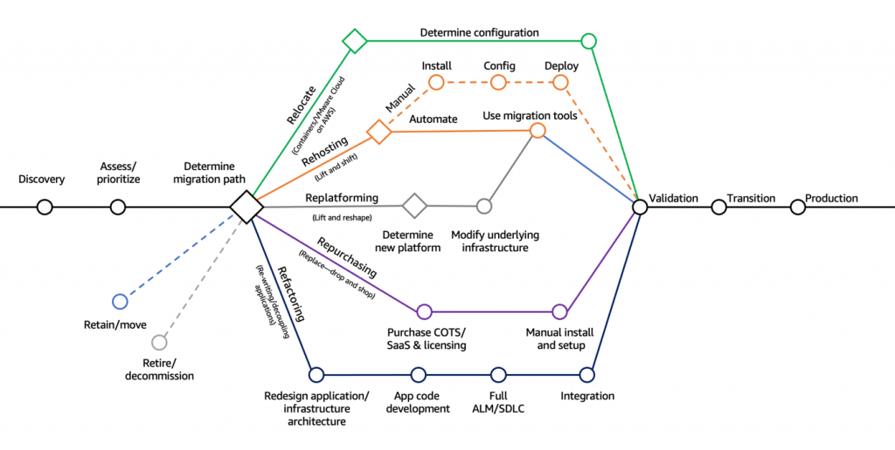

- **Retire**
  - Turn off things you don’t need (maybe as a result of Re-architecting)
  - Helps with reducing the surface areas for attacks (more security)
  - Save cost, maybe up to 10% to 20%
  - Focus your attention on resources that must be maintained

- **Retain**
  - Do nothing for now (it’s still a decision to make in a Cloud Migration)
  - Security, data compliance, performance, unresolved dependencies
  - No business value to migrate, mainframe or mid-range and non-x86 Unix apps

- **Relocate**
  - Move apps from on-premises to its Cloud version
  - Move EC2 instances to a different VPC, AWS account or AWS Region
  - Example: transfer servers from VMware Software-defined Data Center (SSDC) to VMware Cloud on AWS

- **Rehost “lift and shift”**
  - Simple migrations by re-hosting on AWS (applications, databases, data…)
  - Migrate machines (physical, virtual, another Cloud) to AWS Cloud
  - No cloud optimizations being done, applications is migrated as is
  - Could save as much as 30% on cost
  - Example: Migrate using AWS Application Migration Service

- **Replatform “lift and reshape”**
  - Example: migrate your database to RDS
  - Example: migrate your application to Elastic Beanstalk
  - Not changing the core architecture, but leverage some Cloud optimizations
  - Save time and money by moving to a fully managed service or Serverless

- **Repurchase “drop and shop”**
  - Moving to a different product while moving to the Cloud
  - Often you move to a SaaS platform
  - Expensive in the short term, but quick to deploy
  - Example: CRM to Salesforce.com, HR to Workday, CMS to Drupal

- **Refactor / Re-architect**
  - Reimagining how the application is architected using Cloud Native features
  - Driven by the need of the business to add features and improve scalability, performance, security, and agility
  - Move from a monolithic application to micro-services
  - Example: move an application to Serverless architectures, use AWS S3

[Cloud Migration Strategies the 6Rs](https://aws.amazon.com/pt/blogs/enterprise-strategy/6-strategies-for-migrating-applications-to-the-cloud/)

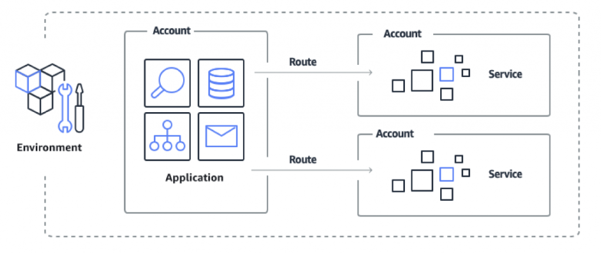
