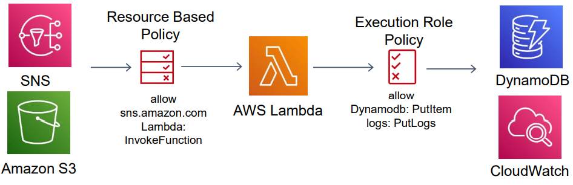
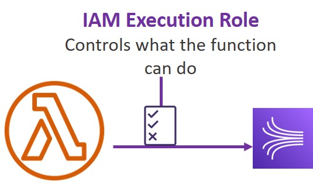
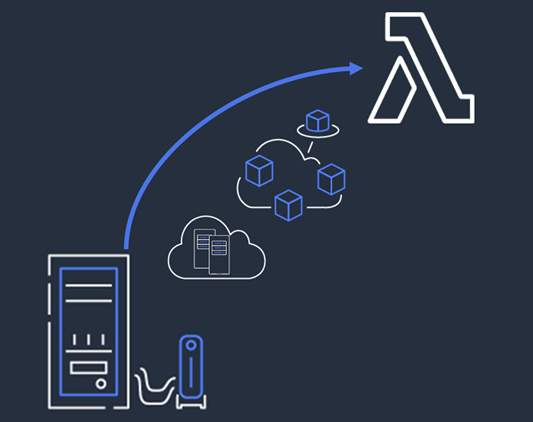

 [General Content AWS Cloud][1]

[1]: https://github.com/weder96/aws-certification-learning

Module 14: Serverless Design Principles

## Content
1. <a href="#section-01"> Serverless Overview </a>
2. <a href="#section-02"> Lambda </a>
3. <a href="#section-03"> Lambda execution environment </a>
4. <a href="#section-04"> Performance optimization </a>
5. <a href="#section-05"> AWS Lambda Function Permissions </a>
6. <a href="#section-06"> Migrating to Serverless </a>
7. <a href="#section-07"> Securing Serverless Architectures </a>
8. <a href="#section-08"> Observability for Serverless Applications </a>

--------------------------------------------------------------------------------------------------------------------
##  **1 - Serverless Overview**

### **Introduction to Serverless**

- One of the major benefits of cloud computing is its ability to abstract (hide) the infrastructure layer. 
- This ability eliminates the need to manually manage the underlying physical hardware. 
- In a serverless environment, this abstraction allows you to focus on the code for your applications without spending time building and maintaining the underlying infrastructure. 
- With serverless applications, there are never instances, operating systems, or servers to manage. AWS handles everything required to run and scale your application. By building serverless applications, your developers can focus on the code that makes your business unique. 

### **Definition**

-  Serverless is a new paradigm in which the developers don’t have to manage servers anymore...
-  They just deploy code
-  They just deploy... functions !
-  Initially... Serverless == FaaS (Function as a Service)
-  Serverless was pioneered by AWS Lambda but now also includes anything that’s managed: “databases, messaging, storage, etc.”
-  Serverless does not mean there are no servers... it means you just don’t manage / provision / see them

### **Serverless in AWS**

- AWS Lambda
- DynamoDB
- AWS Cognito
- AWS API Gateway
- Amazon S3
- AWS SNS & SQS
- AWS Kinesis Data Firehose
- Aurora Serverless
- Step Functions
- Fargate

### **Amazon EC2**
- Virtual Servers in the Cloud
- Limited by RAM and CPU
- Continuously running
- Scaling means intervention to add / remove servers

### **Amazon Lambda**
- Virtual functions – no servers to manage!
- Limited by time - short executions
- Run on-demand
- Scaling is automated!

### **Which of these reflect best practices for serverless development environments and deployment processes? Select all that apply.**
- Give each developer a sandbox environment where they can experiment.
- Create independent demo environments for feature branches.
- Automate your build and deploy process.
- Leverage deployment and application management tools within the community.

### **Serverless Means**
- No server management
- Flexible scaling
- Automated high availability
- No idle capacity

**Cheat Sheets**

https://digitalcloud.training/aws-lambda/

https://tutorialsdojo.com/aws-lambda/

**Sites**

https://serverlessland.com/

https://aws.amazon.com/serverless/

https://aws.amazon.com/blogs/compute/category/compute/aws-lambda/

https://aws.amazon.com/lambda/resources/customer-talks/

https://aws.amazon.com/lambda/resources/webinars-and-talks/

https://docs.aws.amazon.com/lambda/latest/dg/with-sqs.html

https://aws.amazon.com/blogs/aws/aws-lambda-adds-amazon-simple-queue-service-to-supported-event-sources/

https://aws.amazon.com/about-aws/whats-new/2019/11/aws-lambda-supports-amazon-sqs-fifo-event-source/

**References**

https://aws.amazon.com/training/learn-about/serverless/

https://docs.aws.amazon.com/lambda/latest/dg/welcome.html

https://docs.aws.amazon.com/lambda/latest/operatorguide/intro.html

https://docs.aws.amazon.com/elasticloadbalancing/latest/application/lambda-functions.html

https://aws.amazon.com/pt/elasticloadbalancing/pricing/

https://aws.amazon.com/pt/lambda/pricing/

https://docs.aws.amazon.com/lambda/latest/dg

https://aws.amazon.com/lambda/features/

https://aws.amazon.com/lambda/faqs/

https://d1.awsstatic.com/whitepapers/AWS_Serverless_Multi-Tier_Architectures.pdf

https://docs.aws.amazon.com/pdfs/whitepapers/latest/security-overview-aws-lambda/security-overview-aws-lambda.pdf

https://aws.amazon.com/blogs/compute/implementing-safe-aws-lambda-deployments-with-aws-codedeploy/

**Videos**

https://www.youtube.com/results?search_query=aws+Lambda

https://www.youtube.com/watch?v=tYhUWbDZ4-8

**Hands On**

https://www.youtube.com/results?search_query=aws+Lambda+hands+on

**Serverland - Serverless Patterns Collection**

https://serverlessland.com/patterns

-----------------------------------------------------------------------------------------------------------------------
##  **2 - Lambda**

**What is AWS Lambda?**

- AWS Lambda is a compute service. You can use it to run code without provisioning or managing servers. 
- Lambda runs your code on a high-availability compute infrastructure. 
- It operates and maintains all of the compute resources, including server and operating system maintenance, capacity provisioning and automatic scaling, code monitoring, and logging.
- With Lambda, you can run code for almost any type of application or backend service. 
- Some benefits of using Lambda include the following:
   - You can run code without provisioning or maintaining servers.
   - It initiates functions for you in response to events.
   - It scales automatically.
   - It provides built-in code monitoring and logging via Amazon CloudWatch.

### **Invocation models for running Lambda functions**

Event sources can invoke a Lambda function in three general patterns. These patterns are called invocation models. Each invocation model is unique and addresses a different application and developer needs. The invocation model you use for your Lambda function often depends on the event source you are using. It's important to understand how each invocation model initializes functions and handles errors and retries.

### **Synchronous invocation**

When you invoke a function synchronously, Lambda runs the function and waits for a response. 
When the function completes, Lambda returns the response from the function's code with additional data, such as the version of the function that was invoked. Synchronous events expect an immediate response from the function invocation. 

With this model, there are no built-in retries. You must manage your retry strategy within your application code.

The following diagram shows clients invoking a Lambda function synchronously. Lambda sends the events directly to the function and sends the function response directly back to the invoker. 

The following AWS services [invoke Lambda synchronously:](https://docs.aws.amazon.com/lambda/latest/dg/invocation-sync.html)

- Amazon API Gateway
- Amazon Cognito
- AWS CloudFormation
- Amazon Alexa
- Amazon Lex
- Amazon CloudFront

### **Asynchronous invocation**

When you invoke a function asynchronously, events are queued and the requestor doesn't wait for the function to complete. This model is appropriate when the client doesn't need an immediate response. 

With the asynchronous model, you can make use of destinations. Use destinations to send records of asynchronous invocations to other services. (Select the Destinations tab for more information.)

The following diagram shows clients invoking a Lambda function asynchronously. Lambda queues events before sending them to the function.

The following AWS services [invoke Lambda asynchronously:](https://docs.aws.amazon.com/lambda/latest/dg/invocation-async.html) 

Amazon SNS 
Amazon S3
Amazon EventBridge 

### **Polling invocation**

This invocation model is designed to integrate with AWS streaming and queuing based services with no code or server management. Lambda will poll (or watch) these services, retrieve any matching events, and invoke your functions. This invocation model supports the following services:

- Amazon Kinesis
- Amazon SQS
- Amazon DynamoDB Streams

With this type of integration, AWS will manage the poller on your behalf and perform synchronous invocations of your function. 

With this model, the retry behavior varies depending on the event source and its configuration.

The configuration of services as event triggers is known as [event source mapping](https://docs.aws.amazon.com/lambda/latest/dg/invocation-eventsourcemapping.html). 
This process occurs when you configure event sources to launch your Lambda functions and then grant theses sources IAM permissions to access the Lambda function. 

Lambda reads event source mapping from the following services:
- Amazon DynamoDB
- Amazon Kinesis
- Amazon MQ
- Amazon Managed Streaming for Apache Kafka (MSK)
- self-managed Apache Kafka
- Amazon SQS

### **Invocation model error behavior**

When deciding how to build your functions, consider how each invocation method handles errors. 
The following chart provides a quick outline of the error handling behavior of each invocation model.

|Invocation model	        |Error behavior |
|---------------------------|---------------|
|Synchronous                |   No retries  |
|Asynchronous	            |Built in – retries twice|
|Polling	                |Depends on event source|

### **Benefits of AWS Lambda**
-  Easy Pricing:
    -  Pay per request and compute time
    -  Free tier of 1,000,000 AWS Lambda requests and 400,000 GBs of compute time

-  Integrated with the whole AWS suite of services
-  Integrated with many programming languages
-  Easy monitoring through AWS CloudWatch
-  Easy to get more resources per functions (up to 10GB of RAM!)
-  Increasing RAM will also improve CPU and network!

### **AWS Lambda language support**

- Node.js (JavaScript)
- Python
- Java (Java 8 compatible)
- C# (.NET Core)
- Golang
- C# / Powershell
- Ruby
- Custom Runtime API (community supported, example Rust)

- Lambda Container Image
    - The container image must implement the Lambda Runtime API
    - ECS / Fargate is preferred for running arbitrary Docker images

### **AWS Lambda Integrations - Main ones**

- API Gateway
- CloudWatch Events EventBridge
- Kinesis 
- DynamoDB 
- S3 
- CloudFront
- CloudWatch Logs 
- SNS 
- SQS 
- Cognito

**Example: Serverless Thumbnail creation**
**Example: Serverless CRON Job**

### **AWS Lambda Pricing:**

-  You can find overall pricing information here:
    https://aws.amazon.com/lambda/pricing/
-  Pay per calls:
    -  First 1,000,000 requests are free
    -  $0.20 per 1 million requests thereafter ($0.0000002 per request)

-  Pay per duration: (in increment of 1 ms)
    - 400,000 GB-seconds of compute time per month for FREE
    - 400,000 seconds if function is 1GB RAM
    - 3,200,000 seconds if function is 128 MB RAM
    - After that $1.00 for 600,000 GB-seconds

-  It is usually very cheap to run AWS Lambda so it’s very popular

### **AWS Lambda Limits to Know - per region**

-  Execution:
    - Memory allocation: 128 MB – 10GB (1 MB increments)
    - Maximum execution time: 900 seconds (15 minutes)
    - Environment variables (4 KB)
    - Disk capacity in the “function container” (in /tmp): 512 MB
    - Concurrency executions: 1000 (can be increased)

-  Deployment:
    - Lambda function deployment size (compressed .zip): 50 MB
    - Size of uncompressed deployment (code + dependencies): 250 MB
    - Can use the /tmp directory to load other files at startup
    - Size of environment variables: 4 KB

### **Lambda@Edge**

- You have deployed a CDN using CloudFront
- What if you wanted to run a global AWS Lambda alongside?
- Or how to implement request filtering before reaching your application?

- For this, you can use Lambda@Edge: deploy Lambda functions alongside your CloudFront CDN
    - Build more responsive applications
    - You don’t manage servers, Lambda is deployed globally
    - Customize the CDN content
    - Pay only for what you use

- You can use Lambda to change CloudFront requests and responses:
    - After CloudFront receives a request from a viewer (viewer request)
    - Before CloudFront forwards the request to the origin (origin request)
    - After CloudFront receives the response from the origin (origin response)
    - Before CloudFront forwards the response to the viewer (viewer response)

### **Lambda@Edge: Use Cases**

- Website Security and Privacy
- Dynamic Web Application at the Edge
- Search Engine Optimization (SEO)
- Intelligently Route Across Origins and Data Centers
- Bot Mitigation at the Edge
- Real-time Image Transformation
- A/B Testing
- User Authentication and Authorization
- User Prioritization
- User Tracking and Analytics

-------------------------------------------------------------------------------------------------------------------
##  **3 - Lambda execution environment**

### **[Lambda execution environment](https://docs.aws.amazon.com/lambda/latest/dg/lambda-runtime-environment.html)**

- Lambda invokes your function in an execution environment, which is a secure and isolated environment. 
- The execution environment manages the resources required to run your function. 
- The execution environment also provides lifecycle support for the function's runtime and any external extensions associated with your function. 

**Init phase**

- In this phase, Lambda creates or unfreezes an execution environment with the configured resources, downloads the code for the function and all layers, initializes any extensions, initializes the runtime, and then runs the function’s initialization code (the code outside the main handler). 
- The Init phase happens either during the first invocation, or before function invocations if you have enabled provisioned concurrency.
- The Init phase is split into three sub-phases: 
    - Extension init - starts all extensions
    - Runtime init - bootstraps the runtime
    - Function init - runs the function's static code

These sub-phases ensure that all extensions and the runtime complete their setup tasks before the function code runs

**Invoke phase**

- In this phase, Lambda invokes the function handler. After the function runs to completion, Lambda prepares to handle another function invocation. 

**Shutdown phase**

- If the Lambda function does not receive any invocations for a period of time, this phase initiates. 
- In the Shutdown phase, Lambda shuts down the runtime, alerts the extensions to let them stop cleanly, and then removes the environment. 
- Lambda sends a shutdown event to each extension, which tells the extension that the environment is about to be shut down.

--------------------------------------------------------------------------------------------------------------------------------------------
##  **4 - Performance Optimization**

**Cold and warm starts**

- A cold start occurs when a new execution environment is required to run a Lambda function. 
- When the Lambda service receives a request to run a function, the service first prepares an execution environment. 
- During this step, the service downloads the code for the function, then creates the execution environment with the specified memory, runtime, and configuration. 
- Once complete, Lambda runs any initialization code outside of the event handler before finally running the handler code. 

In a warm start, the Lambda service retains the environment instead of destroying it immediately. This allows the function to run again within the same execution environment. This saves time by not needing to initialize the environment.  

Select each of the following numbered markers for more information on cold and warm starts.

### **Best practice: Minimize cold start times**

- When you invoke a Lambda function, the invocation is routed to an execution environment to process the request. 
- If the environment is not already initialized, the start-up time of the environment adds to latency. 
- If a function has not been used for some time, if more concurrent invocations are required, or if you update a function, new environments are created.  
- Creation of these environments can introduce latency for the invocations that are routed to a new environment. 
- This latency is implied when using the term cold start. For most applications, this additional latency is not a problem. However, for some synchronous models, this latency can inhibit optimal performance. 
- It is critical to understand latency requirements and try to optimize your function for peak performance. 

- After optimizing your function, another way to minimize cold starts is to **use provisioned concurrency.** 
**Provisioned concurrency** is a Lambda feature that prepares concurrent execution environments before invocations.

### **Best practice: Write functions to take advantage of warm starts**

1. Store and reference dependencies locally.
2. Limit re-initialization of variables.
3. Add code to check for and reuse existing connections.
4. Use tmp space as transient cache.
5. Check that background processes have completed.

If you need predictable function start times for your workload, provisioned concurrency ensures the lowest possible latency. This feature keeps your functions initialized and warm, and ready to respond in double-digit milliseconds at the scale you provision. Unlike with on-demand Lambda, this means that all setup activities happen before invocation, including running the initialization code.

For more information, refer to [Scaling and concurrency in Lambda](https://docs.aws.amazon.com/lambda/latest/operatorguide/scaling-concurrency.html) in the AWS Lambda Developer Guide.

---------------------------------------------------------------------------------------------------------------------------------
##  **5 - AWS Lambda Function Permissions**

With Lambda functions, there are two sides that define the necessary scope of permissions – permission to invoke the function, and permission of the Lambda function itself to act upon other services. Because Lambda is fully integrated with AWS Identity and Access Management (IAM), you can control the exact actions of each side of the Lambda function.

Permissions to invoke the function are controlled using an IAM resource-based policy. An IAM execution role defines the permissions that control what the function is allowed to do when interacting with other AWS services. Look at the full interaction of these two permission types and then explore each one in further detail.

### **Execution role**

- The execution role gives your function permissions to interact with other services. 
- You provide this role when you create a function, and Lambda assumes the role when your function is invoked. 
- The policy for this role defines the actions the role is allowed to take — for example, writing to a DynamoDB table. 
- The role must include a trust policy that allows Lambda to “AssumeRole” so that it can take that action for another service. 
- You can write the role or use the managed roles (with predefined permissions) provided by Lambda to simplify the process of creating an execution role. 
- You can add or remove permissions from a function's execution role at any time, or configure your function to use a different role. 

You can also use IAM Access Analyzer to help identify the required permissions for the IAM execution role. 
IAM Access Analyzer reviews your AWS CloudTrail logs over the date range that you specify and generates a policy template with only the permissions that the function used during that time. 

For more information on IAM Access Analyzer, see [Using IAM Access Analyzer](https://docs.aws.amazon.com/IAM/latest/UserGuide/what-is-access-analyzer.html) in the AWS Identity and Access Management User Guide.

### Execution role definitions

### **IAM policy**

This IAM policy allows the function to perform the "Action": "dynamodb:PutItem" action against a DynamoDB table called "test" in the us-west-2 region.

### **Trust policy**

A trust policy defines what actions your role can assume. The trust policy allows Lambda to use the role's permissions by giving the service principal lambda.amazonaws.com permission to call the AWS Security Token Service (AWS STS) AssumeRole action.

This example illustrates that the principal "Service":"lambda.amazonaws.com" can take the "Action":"sts:AssumeRole" allowing Lambda to assume the role and invoke the function on your behalf.

 predefined permissions and setting up your execution roles, see [AWS Lambda permissions](https://docs.aws.amazon.com/lambda/latest/dg/lambda-permissions.html) in the AWS Lambda Developer Guide.

------------------------------------------------------------------------------------------------------------------------------
##  **6 - Migrating to Serverless**

 **Definitions**

 The key to thinking serverless is thinking in terms of patterns and applications, rather than in terms of individual functions or resources.

 Migration patterns

While designing your application, it's critical for you to choose services and patterns that suit your workloads based on characteristics such as expected throughput, service limits, and cost. This helps you adopt serverless architectures in a way that is customized to what your solutions need to do and to the skills and organizational models you are working within.

You can look at the migration in the context of the two paradigm shifts that need to be considered:

1. How do you implement computing infrastructure?
2. How do you approach application development and deployment?

Infrastructure abstraction and architecture modernization

To learn more about the different aspects of infrastructure abstraction and architecture modernization, choose each numbered hotspot:
Where you are organizationally, how your applications are currently written, and where you want to be along these two axes are defining factors in determining a migration strategy.

At a high level, there are three migration patterns that you might follow to migrate your legacy applications to a serverless model. To learn more, expand each of the following three categories:

### **Leapfrog**

As the name suggests, with the leapfrog pattern, you bypass interim steps and go straight from an on-premises legacy architecture to a serverless cloud architecture.

### **Organic**

With the organic pattern, you move on-premises applications to the cloud in more of a lift-and-shift model. In this model, existing applications are kept intact, either running on Amazon Elastic Compute Cloud (Amazon EC2) instances or with some limited rewrites to container services such as Amazon Elastic Kubernetes Service (Amazon EKS), Amazon Elastic Container Service (Amazon ECS), or AWS Fargate.

Developers experiment with Lambda in low-risk internal scenarios such as log processing or cron jobs. As you gain more experience, you might use serverless components for tasks such as data transformations and parallelization of processes.

At some point in the adoption curve, you take a more strategic look at how serverless and microservices might address business goals such as market agility, developer innovation, and total cost of ownership.

You get buy-in for a more long-term commitment to invest in modernizing your applications and select a production workload as a pilot. With initial success and lessons learned, adoption accelerates and more applications are migrated to microservices and serverless.

### **Strangler**

- With the strangler pattern, an organization incrementally and systematically decomposes monolithic applications by creating APIs and building event-driven components that gradually replace components of the legacy application.

- Distinct API endpoints can point to old compared to new components and safe deployment options (such as canary deployments) let you point back to the legacy version with very little risk.

- New feature branches can be serverless first, and legacy components can be decommissioned as they are replaced. This pattern represents a more systematic approach to adopting serverless, allowing you to move to critical improvements where you see benefit quickly but with less risk and upheaval than the leapfrog pattern.

### **Migration considerations**

**Here are the migration questions you need to answer:**

- What does this application do and how are its components organized?
- How can you break your data needs up based on the command query responsibility segregation (CQRS) pattern?
- How does the application scale and what components drive the capacity you need?
- Do you have schedule-based tasks?
- Do you have workers listening to a queue?
- Where can you refactor or enhance functionality without impacting the current implementation?

**In addition to these questions, consider these three factors when comparing costs of ownership:**

1. The infrastructure cost to run your workload. For example, the costs for your provisioned EC2 capacity compared to the per-invocation cost of your Lambda functions.
2. The development effort to plan, architect, and provision resources on which the application will run.
3. The costs of your team’s time to maintain the application once it is in production.

You also need to consider the business value of the increased speed and agility serverless gives you. After the initial learning curve and investment in decomposing existing applications, you will be able to update your applications quickly and nimbly.

-----------------------------------------------------------------------------------------------------------------------------
##  **7 - Securing Serverless Architectures**

Security best practices don't change

As mentioned in the Course Introduction, cloud security is our top priority. When you’re designing serverless architectures, the best practices that apply while securing any other cloud architecture still apply. In this lesson you will learn how to apply and implement security best practices for serverless architectures, including AWS Lambda.

You should already be familiar with these best practices, but here are a couple of key resources to bookmark and review:

[Best Practices for Security, Identity, & Compliance](https://aws.amazon.com/architecture/security-identity-compliance/?cards-all.sort-by=item.additionalFields.sortDate&cards-all.sort-order=desc&awsf.content-type=*all&awsf.methodology=*all)
[OWASP Secure Coding Practices Quick Reference Guide](https://www.owasp.org/images/0/08/OWASP_SCP_Quick_Reference_Guide_v2.pdf)

Before diving into how to secure your serverless architectures, it's important for you to understand what AWS manages, and what you are responsible for.

Shared responsibility model 

One benefit of serverless architectures is that when you rely on AWS managed services, you shift more parts of the AWS shared responsibility model toward AWS. You have the same security issues, but AWS manages more of them on your behalf. For example, you aren’t responsible for the operating system or network configuration that underlies where your Lambda functions run. AWS manages the platform where Lambda functions reside and are run, so you are also freed from managing the runtimes, unless you develop custom runtimes.

Securing serverless architectures

Now that you understand how more of the shared responsibility model is abstracted by your move to serverless, it's time to dive deeper into how to secure your serverless architecture.

You have three options for authorizing access to your APIs via API Gateway:

AWS Identity and Access Management (IAM)
Amazon Cognito
Lambda authorizers

Three security best practices

There are three important security best practices that will be discussed in more depth for the remainder of this lesson. These include the following:

- Follow the principle of least privilege.
- Protect data at rest and in transit.
- Audit your system for changes, unexpected access, unusual patterns, or errors.

Follow the principle of least privilege 

Amazon API Gateway is the front door to your application, so it’s a good place to start preventing unauthorized access to your APIs.

Limiting access to APIs

You have three options for authorizing access to your APIs through API Gateway: AWS Identity and Access Management (IAM), Amazon Cognito, and Lambda authorizers. Choose the model that makes the most sense for your existing authentication model and each workload. To learn more, expand each of the following three categories.

IAM
IAM is best for clients that are within your AWS environment or can otherwise retrieve IAM temporary credentials to access your environment.

Amazon Cognito
Amazon Cognito gives you a managed service that can support sign-in/sign-up capabilities or act as an identity provider (IdP) in a federated identity scenario.

Lambda authorizers
An API Gateway Lambda authorizer invokes a Lambda function to authenticate/validate a user against your existing IdP. This type of authorizer is useful for centralized authentication.

By authenticating using API Gateway and having API Gateway act as a proxy to other AWS services, you reduce the burden of securing your APIs from unauthorized clients. You can also take advantage of API Gateway features to limit access. The next video looks at key security best practices that you need to account for and examples of how they apply in serverless architectures.

**References**

https://aws.amazon.com/blogs/compute/amazon-api-gateway-adds-support-for-aws-waf/

https://docs.aws.amazon.com/whitepapers/latest/guidelines-for-implementing-aws-waf/guidelines-for-implementing-aws-waf.html

### **Protect your data in transit and at rest**

- Protecting access to your Lambda functions means using narrowly scoped AWS Identity and Access Management (IAM) permissions and roles. 
- Limit permissions in the resource policy that establishes who can invoke the function. 
- And limit the scope of the execution policy that determines what the function is allowed to do. 
- Create smaller functions that perform scoped activities, and don’t share IAM roles between functions. 
- Use narrowly scoped IAM roles to grant permissions between other services as well.

- When it comes to passing data to Lambda functions, you have three options:
    - Environment variables
    - Values in AWS Systems Manager Parameter Store
    - Values in AWS Secrets Manager.

All three can use either Amazon Web Services (AWS) managed or customer-managed keys to protect sensitive information. 

- Environment variables are scoped to a single function. 
- Values in Parameter Store or Secrets Manager can be shared across multiple applications; 
- Secrets Manager has the added benefit of secrets rotation and cross-account access. 
- All of the AWS managed services in our architecture can encrypt data as it passes through and are integrated with AWS Key Management Service (AWS KMS). 
- In terms of protecting data at rest, AWS data stores provide encryption at rest via configuration options that you control.

Encryption options take advantage of AWS, AWS KMS, and keys that you or AWS manage.

### **Encryption options for AWS data stores**

In terms of protecting data at rest, AWS data stores provide encryption at rest using configuration options that you control. Encryption options take advantage of AWS Key Management Service (AWS KMS) and keys that you or AWS manage. It’s important to understand default and configurable behaviors for encryption. For example, consider the following:

|Data Store	                                |Encryption at Rest|
|-------------------------------------------|------------------|
|Amazon Simple Storage Service (Amazon S3)	| Configure server-side encryption using one of the following:   **Amazon S3-managed Keys (SSE-S3)**   **AWS KMS keys stored in AWS KMS (SSE-KMS)**   **Customer-provided keys (SSE-C)**|
|Amazon DynamoDB	                        |All data is fully encrypted at rest using encryption keys stored in AWS KMS.   Choose AWS service keys or customer managed keys when you create a table.|
|Amazon ElastiCache for Redis	            |Apply optional encryption using either service-managed encryption at rest or customer-managed AWS KMS keys using AWS KMS.|

### **Serverless data protection best practices** 

In addition to the three security best practices, there are also some serverless data protection best practices that you need to be aware of:

1. Make yourself aware of how you can take advantage of AWS managed services to reduce your security management burden.
2. Think about security end to end at each integration point in your distributed architecture.
3. Use narrowly scoped IAM permissions and roles to protect access to your Lambda functions and other AWS services.
4. Create smaller Lambda functions that perform scoped activities, and don’t share IAM roles between functions.
5. To pass data in a Lambda function, use environment variables, AWS Systems Manager Parameter Store, or AWS Secrets Manager.

### **Securing enterprise-grade serverless applications**

**Video**

https://youtu.be/tYhUWbDZ4-8

----------------------------------------------------------------------------------------------------------------
##  **8 - Observability for Serverless Applications**

_"Observability helps you understand what is   happening in your systems and applications. Gaining   observability helps you detect, investigate, and   remediate problems."_

### **The three pillars of observability**

When you’re operating your serverless applications at scale, you can’t afford to fly blind. You need to be able to answer important operational and business questions including the following:

- Is my decoupled service up or down?
- Is one of my services causing a performance bottleneck?
- Is my application fast or slow, as experienced by my end users?
- What key performance indicators (KPIs) and service level agreements (SLAs) should we establish, and how do we know if they’re being met?

As your cloud-based architectures grow, observability can be difficult to achieve because of the sheer complexity of your systems. As the amount of components in your systems grows, so does the importance of being able to see what is happening and troubleshoot when something goes wrong. Having observability will help you spot problems in your serverless applications as they arise, respond quickly, and resolve them as fast as possible. To achieve this insight, there are three different pillars of observability to consider.

### **Monitor**

Metrics collected through monitoring provide data about the performance of your systems. You can think of a metric as a single variable that is used to monitor an aspect of your system. When you combine all these individual metrics, you are able to see how your application is performing over time.

For example, you can track the CPU utilization of a particular Amazon Elastic Compute Cloud (Amazon EC2) instance. Or you can monitor how many AWS Step Functions runs failed or the amount of delete requests that Amazon S3 received.

### **Trace**

As you scale your application and the number of components grows, how do you identify where an error or a bottleneck might be occurring? 

To do this, you can use a trace. A trace will follow requests as they travel through the individual services and resources that make up your application, providing an end-to-end view of how it is performing. You can use this trace to follow the path of an individual request as it passes through each service or tier in your application so that you can pinpoint where issues are occurring.

### **Logs**

Where metrics help you keep track of what is happening within your system, logs help you keep track of what already happened within your application or system. This helps you audit your configuration history, configuration changes, and all other API calls to facilitate security and governance in your serverless applications.

Logs are time-stamped records of events that include failures, errors, state transformations, or even who accessed your system at a certain time.

### **Monitoring serverless applications**

So, you’ve blocked the doors, secured confidential documents, and password-protected your Wi-Fi with something stronger than PASSWORD1. Now it’s time to put some monitoring and notifications in place for when things get crazy. These next videos highlight the key types of monitoring that you need to put in place to monitor the security and health of your serverless architectures.

Once you start testing your applications, and monitoring in production, routinely ask yourself: 

- Am I collecting the right information?
- Do I need to expose custom metrics?
- Am I logging the right details, and at the right level, for the event types that occur?
- What else should I be capturing in my application traces?

