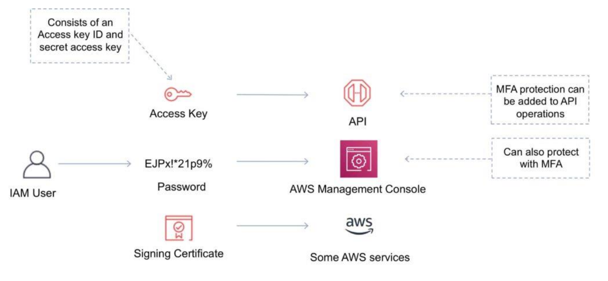

 [Conteudo Geral AWS Cloud][1]

[1]: https://github.com/weder96/aws-certification-learning

# AWS Identity and Access Management (IAM) [IAM](https://docs.aws.amazon.com/pt_br/IAM/latest/UserGuide/introduction.html)

## Conteúdo
1. <a href="#section-1"> GENERAL IAM CONCEPTS </a>
2. <a href="#section-2"> Using AWS IAM Access Analyzer </a>
3. <a href="#section-3" > Understanding and getting your AWS credentials</a>
4. <a href="#section-4" > IAM Users</a>
5. <a href="#section-5" > IAM Groups</a>
6. <a href="#section-6" > Verify Permissions</a>
7. <a href="#section-7" > IAM Roles</a>
8. <a href="#section-8" > IAM roles with EC2 instances</a>
9. <a href="#section-9" > Role Delegation</a>
10. <a href="#section-10" > IAM Policies</a>
11. <a href="#section-11" > IAM Authentication Methods</a>
12. <a href="#section-12" > IAM Multi-Factor Authentication</a>
13. <a href="#section-13" > IAM Security Token Service {STS}</a>
14. <a href="#section-14" > Federation (typically AD)</a>
15. <a href="#section-15" > Access Keys</a>
16. <a href="#section-16" > IAM Best Practices</a>
17. <a href="#section-17" > Generate a public SSH </a>
18. <a href="#section-18"> AWS Organizations </a>
19. <a href="#section-19"> AWS Config </a>

**********************************************************************************************************
## IAM Overview
## <a id="section-1" ></a> **1 - GENERAL IAM CONCEPTS**
AWS Identity and Access Management (IAM) is a web service that helps you securely control access
to AWS resources.

You use IAM to control who is authenticated (signed in) and authorized (has permissions) to use resources.

IAM makes it easy to provide multiple users secure access to AWS resources.
When you first create an AWS account, you begin with a single sign-in identity that has complete
access to all AWS services and resources in the account.

This identity is called the AWS account root user and is accessed by signing in with the email address
and password that you used to create the account

**IAM can be used to manage:**
  - Users
  - Groups
  - Access policies
  - Roles
  - User credentials
  - User password policies
  - Multi-factor authentication (MFA)
  - API keys for programmatic access (CLI)

Creating users {U}, groups {G}, policies {P}, roles {R}
Controls access.

**Identity Federation**
- integrate an external entity to check for access, eg MicroSoft Active Directory
- {U} create individual accounts to grant access 
- {U} can also assign to a service
- {P} defines permissions; apply to a user, group or role
- {G} collections of users w/policies attached to them, or,
- {G,P} add a bunch of users to a group & then apply 1 policy for that group
- {R} security identity, similar to a user account, that can be assumed by other entities
  - eg, launch an EC2 server, assign a role to that server, role would have a policy attached to it,
    - allowing it to access S3 and store data there;


Provides centralized control of your AWS account.<br/>
Enables shared access to your AWS account.<br/>
**IAM provides the following features:**<br/>
  - Shared access to your AWS account
  - Granular permissions
  - Secure access to AWS resources for application that run on Amazon EC2
  - Multi-Factor authentication
  - Identity federation
  - Identity information for assurance
  - PCI DSS compliance
  - Integrated with may AWS services
  - Eventually consistent
  - Free to use


**You can work with AWS Identity and Access Management in any of the following ways:**
  - AWS Management Console
  - AWS Command Line Tools
  - AWS SDK
  - IAM HTTPS API

By default, new users are created with NO access to any AWS services – they can only login to the
AWS console.

Permission must be explicitly granted to allow a user to access an AWS service.
IAM users are individuals who have been granted access to an AWS account.

**Each IAM user has three main components:**
  - A user-name
  - A password
  - Permissions to access various resources

You can apply granular permissions with IAM.


You can assign users individual security credentials such as access keys, passwords, and multi-factor
authentication devices.

IAM is not used for application-level authentication.

Identity Federation (including AD, Facebook etc.) can be configured allowing secure access to
resources in an AWS account without creating an IAM user account.

Multi-factor authentication (MFA) can be enabled/enforced for the AWS account and for individual
users under the account.

MFA uses an authentication device that continually generates random, six-digit, single-use
authentication codes.

**You can authenticate using an MFA device in the following two ways:**
  - Through the AWS Management Console – the user is prompted for a username, password and authentication code.
  - Using the AWS API – restrictions are added to IAM policies and developers can request
temporary security credentials and pass MFA parameters in their AWS STS API requests.
  - Using the AWS CLI by obtaining temporary security credentials from STS (aws sts get-session-token).


It is a best practice to always setup multi-factor authentication on the root account.

IAM is universal (global) and does not apply to regions.

IAM is eventually consistent.

IAM replicates data across multiple data centers around the world.

The “root account” is the account created when you setup the AWS account. It has complete Admin
access and is the only account that has this access by default.

It is a best practice to not use the root account for anything other than billing.

Power user access allows all permissions except the management of groups and users in IAM.

Temporary security credentials consist of the AWS access key ID, secret access key and security token.

IAM can assign temporary security credentials to provide users with temporary access to
services/resources.

To sign-in you must provide your account ID or account alias in addition to a username and password.

**The sign-in URL includes the account ID or account alias, e.g.:**
[console](https://My_AWS_Account_ID.signin.aws.amazon.com/console/)

Alternatively, you can sign-in at the following URL and enter your account ID or alias manually:
[manually](https://console.aws.amazon.com/)

IAM integrates with many different AWS services.
IAM supports PCI DSS compliance.

AWS recommend that you use the AWS SDKs to make programmatic API calls to IAM.

However, you can also use the IAM Query API to make direct calls to the IAM web service.

*************************************************************************************************************
## <a id="section-2" ></a> **2 - Using AWS IAM Access Analyzer**
- AWS IAM Access Analyzer helps you identify the resources in your organization and accounts, such as Amazon S3 buckets or IAM roles, shared with an external entity. 
- This lets you identify unintended access to your resources and data, which is a security risk. 
- Access Analyzer identifies resources shared with external principals by using logic-based reasoning to analyze the resource-based policies in your AWS environment. 
- For each instance of a resource shared outside of your account, Access Analyzer generates a finding. Findings include information about the access and the external principal granted to it. You can review findings to determine whether the access is intended and safe, or the access is unintended and a security risk. - In addition to helping you identify resources shared with an external entity, you can use Access Analyzer findings to preview how your policy affects public and cross-account access to your resource before deploying resource permissions.

**Important**
  - Access Analyzer analyzes only policies applied to resources in the same AWS Region where it's enabled. 
  - To monitor all resources in your AWS environment, you must create an analyzer to enable Access Analyzer in each Region where you're using supported AWS resources.

**Access Analyzer analyzes the following resource types:**
  - Amazon Simple Storage Service buckets
  - AWS Identity and Access Management roles
  - AWS Key Management Service keys
  - AWS Lambda functions and layers
  - Amazon Simple Queue Service queues
  - AWS Secrets Manager secrets


**Access Advisor**
[Access Advisor](https://docs.aws.amazon.com/IAM/latest/UserGuide/access_policies_access-advisor.html)

The IAM console provides information about when IAM users and roles last attempted to access AWS services. This information is called service last accessed data. This data can help you identify unnecessary permissions so that you can refine your IAM policies to better adhere to the principle of “least privilege.”

That means granting the minimum permissions required to perform a specific task. You can find the data on the Access Advisor tab in the IAM console by examining the detail view for any IAM user, group, role, or managed policy.


## <a id="section-3" ></a> **3 -Understanding and getting your AWS credentials**
- [secret-keys](https://docs.aws.amazon.com/general/latest/gr/aws-sec-cred-types.html#access-keys-and-secret-access-keys)
- For Amazon CloudFront, you use key pairs to create signed URLs for private content, such as when you want to distribute restricted content that someone paid for.
CloudFront Key Pairs - IAM users can't create CloudFront key pairs. You must log in using root credentials to create key pairs.
To create signed URLs or signed cookies, you need a signer. A signer is either a trusted key group that you create in CloudFront, or an AWS account that contains a CloudFront key pair. AWS recommends that you use trusted key groups with signed URLs and signed cookies instead of using CloudFront key pairs.


## <a id="section-4" ></a> **4 -  IAM Users** 
- An IAM user is an entity that represents a person or service
- Can be assigned:
    - An access key ID and secret access key for programmatic access to the AWS API, CLI, SDK, and other development tools
    - A password for access to the management console
- By default users cannot access anything in your account
- The account root user credentials are the email address used to create the account and a password
- The root account has full administrative permissions and these cannot be restricted

  **Best practice for root accounts:**
    - Don’t use the root user credentials
    - Don’t share the root user credentials
    - Create an IAM user and assign administrative permissions as required
    - Enable MFA

IAM users can be created to represent applications and these are known as “service accounts”.

You can have up to 5,000 users per AWS account.

Each user account has a friendly name and an ARN which uniquely identifies the user across AWS.

A unique ID is also created which is returned only when you create the user using the API, Tools for

Windows PowerShell or the AWS CLI.

You should create individual IAM accounts for users (best practice not to share accounts).

The Access Key ID and Secret Access Key are not the same as a password and cannot be used to login to the AWS console.

The Access Key ID and Secret Access Key can only be used once and must be regenerated if lost.

A password policy can be defined for enforcing password length, complexity etc. (applies to all users).

You can allow or disallow the ability to change passwords using an IAM policy.

Access keys and passwords should be changed regularly.


## <a id="section-5" ></a> **5 -  IAM Groups**
- Developers, AWS Admins, Operation
- Groups are collections of users and have policies attached to them
- A group is not an identity and cannot be identified as a principal in an IAM policy
- Use groups to assign permissions to users
- Use the principal of least privilege when assigning permissions
- You cannot nest groups (groups within groups)

## <a id="section-6" ></a> **6 -  Verify Permissions**
  - Use the AWS CLI --dry-run option: The --dry-run option checks whether you have the required permissions for the action, without actually making the request, and provides an error response. If you have the required permissions, the error response is DryRunOperation, otherwise, it is UnauthorizedOperation.
  [terminate-instance](https://docs.aws.amazon.com/cli/latest/reference/ec2/terminate-instances.html)


## <a id="section-7" ></a> **7 -  IAM Roles**
### [IAM Roles](https://docs.aws.amazon.com/IAM/latest/UserGuide/id_roles_create_for-service.html)
With IAM Roles you can delegate permissions to resources for users and services without using permanent credentials (e.g. username and password). To do so you can create a role and assign an IAM policy to the role that has the permissions required.
- created & then "assumed" by another entity
- eg, create an EC2 instance - assign a 'role' that allows full access to S3 storage service
- roles bypass need for an explicit userid/password
- defined role permissions assumed by entities having that role
- With IAM Roles you can delegate permissions to resources for users and services without using permanent credentials (e.g. user name and password)
- IAM users or AWS services can assume a role to obtain temporary security credentials that can be
used to make AWS API calls.
- You can delegate using roles.
- There are no credentials associated with a role (password or access keys).
- IAM users can temporarily assume a role to take on permissions for a specific task.
- A role can be assigned to a federated user who signs in using an external identity provider.
- Temporary credentials are primarily used with IAM roles and automatically expire.
- Roles can be assumed temporarily through the console or programmatically with the AWS CLI, Tools
  for Windows PowerShell or API.
  

## <a id="section-8" ></a> **8 -  IAM roles with EC2 instances**
  - IAM roles can be used for granting applications running on EC2 instances permissions to AWS API requests using instance profiles.
  - Only one role can be assigned to an EC2 instance at a time.
  - A role can be assigned at the EC2 instance creation time or at any time afterwards.
  - When using the AWS CLI or API instance profiles must be created manually (it’s automatic and transparent through the console).
  - Applications retrieve temporary security credentials from the instance metadata.

## <a id="section-9" ></a> **9 -  Role Delegation**
- Create an IAM role with two policies:
  - Permissions policy – grants the user of the role the required permissions on a resource.
  - Trust policy – specifies the trusted accounts that are allowed to assume the role.
- Wildcards (*) cannot be specified as a principal.
- A permissions policy must also be attached to the user in the trusted account.


## <a id="section-10" ></a> **10 -  IAM Policies**
- example, "full access" to S3, "read only" to DynamoDB
- Policies are documents that define permissions and can be applied to users, groups and roles
- Policy documents are written in JSON (key value pair that consists of an attribute and a value)
- All permissions are implicitly denied by default
- The most restrictive policy is applied
- The IAM policy simulator is a tool to help you understand, test, and validate the effects of access
  control policies.
- The Condition element can be used to apply further conditional logic.
    - **Policy types**
        - The following policy types, listed in order from most frequently used to less frequently used, are available for use in AWS. For more details, see the sections below for each policy type.
        - Identity-based policies – Attach managed and inline policies to IAM identities (users, groups to which users belong, or roles). Identity-based policies grant permissions to an identity.

        - <b>Resource-based policies</b> – Attach inline policies to resources. The most common examples of resource-based policies are Amazon S3 bucket policies and IAM role trust policies. Resource-based policies grant permissions to the principal that is specified in the policy. Principals can be in the same account as the resource or in other accounts.

        - <b>Permissions boundaries</b> – Use a managed policy as the permissions boundary for an IAM entity (user or rol  ). That policy defines the maximum permissions that the identity-based policies can grant to an entity, but does not grant permissions. Permissions boundaries do not define the maximum permissions that a resource-based policy can grant to an entity.

        - <b>Organizations SCPs</b> – Use an AWS Organizations service control policy (SCP) to define the maximum permissions for account members of an organization or organizational unit (OU). SCPs limit permissions that identity-based policies or resource-based policies grant to entities (users or roles) within the account, but do not grant permissions.

        - <b>Access control lists (ACLs)</b> – Use ACLs to control which principals in other accounts can access the resource to which the ACL is attached. ACLs are similar to resource-based policies, although they are the only policy type that does not use the JSON policy document structure. ACLs are cross-account permissions policies that grant permissions to the specified principal. ACLs cannot grant permissions to entities within the same account.

        - <b>Session policies</b> – Pass advanced session policies when you use the AWS CLI or AWS API to assume a role or a federated user. Session policies limit the permissions that the role or user's identity-based policies grant to the session. Session policies limit permissions for a created session, but do not grant permissions. For more information, see Session Policies.
        -[access_policies](https://docs.aws.amazon.com/IAM/latest/UserGuide/access_policies.html)

- **Trust policy** 
  - **Trust policies** define which principal entities (accounts, users, roles, and federated users) can assume the role. An IAM role is both an identity and a resource that supports resource-based policies. For this reason, you must attach both a trust policy and an identity-based policy to an IAM role. The IAM service supports only one type of resource-based policy called a role trust policy, which is attached to an IAM role.
  -[access_policies_boundaries](https://docs.aws.amazon.com/IAM/latest/UserGuide/access_policies_boundaries.html)

- IAM policy variables [reference_policies_variables](https://docs.aws.amazon.com/IAM/latest/UserGuide/reference_policies_variables.html)
  - Instead of creating individual policies for each user, you can use policy variables and create a single policy that applies to multiple users (a group policy). 
  - Policy variables act as placeholders. When you make a request to AWS, the placeholder is replaced by a value from the request when the policy is evaluated.
  - As an example, the following policy gives each of the users in the group full programmatic access to a user-specific object (their own "home directory") in Amazon S3.
 ```
    {
    "Version": "2012-10-17",
    "Statement": [
      {
        "Action": ["s3:ListBucket"],
        "Effect": "Allow",
        "Resource": ["arn:aws:s3:::mybucket"],
        "Condition": {"StringLike": {"s3:prefix": ["${aws:username}/*"]}}
      },
      {
        "Action": [
          "s3:GetObject",
          "s3:PutObject"
        ],
        "Effect": "Allow",
        "Resource": ["arn:aws:s3:::mybucket/${aws:username}/*"]
      }
    ]
  }
  ```

- **IAM policy principal** - You can use the Principal element in a policy to specify the principal that is allowed or denied access to a resource (In IAM, a principal is a person or application that can make a request for an action or operation on an AWS resource. The principal is authenticated as the AWS account root user or an IAM entity to make requests to AWS). You cannot use the Principal element in an IAM identity-based policy. You can use it in the trust policies for IAM roles and in resource-based policies.

- **IAM policy condition** - The Condition element (or Condition block) lets you specify conditions for when a policy is in effect, like so - "Condition" : { "StringEquals" : { "aws:username" : "johndoe" }}. This can not be used to address the requirements of the given use-case.

- **IAM policy resource** - The Resource element specifies the object or objects that the statement covers. You specify a resource using an ARN. This can not be used to address the requirements of the given use-case.

- [grant-access-to-user-specific-folders](https://aws.amazon.com/blogs/security/writing-iam-policies-grant-access-to-user-specific-folders-in-an-amazon-s3-bucket/)

## <a id="section-11" ></a> **11 -  IAM Authentication Methods**
- external, eg, MS Active Directory
- API : need an access key id & secret access key, eg, command line, SDKs
- UI AWS Mgmt Console : need an IAM User account w/password
- some AWS Services : need a signing certificate
- There are three authentication methods: Access Keys, Console Password and Server/Signing Certificates
- Access keys:
  - A combination of an access key ID and a secret access key
  - Used to make programmatic calls to AWS using the API or CLI
  - The secret access is returned only at creation time


## <a id="section-12" ></a> **12 -  IAM Multi-Factor Authentication**
- adding additional security
- **3 factors**
  - 1. Something Only You Know, eg, password
  - 2. Something Only You Have, eg, Google Authenticator app, device - ie RSA ID
  - 3. Something Only You Are, eg, fingerprint
- **in AWS**
  - {You Know} IAM User password
  - {You Have} virtual {apt generate a code} or physical {RSA device} MFA device
- **Console password:**
  - A password that the user can enter to sign-in to interactive sessions such as the AWS
  Management Console.
  - You can allow users to change their own passwords.
  - You can allow selected IAM users to change their passwords by disabling the option for all
  users and using an IAM policy to grant permissions for the selected users.


## <a id="section-13" ></a> **13 -  IAM Security Token Service {STS}**
The AWS Security Token Service (STS) is a web service that enables you to request temporary, limited-
privilege credentials for IAM users or for users that you authenticate (federated users).

By default, AWS STS is available as a global service, and all AWS STS requests go to a single endpoint
at[STS](https://sts.amazonaws.com).

You can optionally send your AWS STS requests to endpoints in any region (can reduce latency).

All regions are enabled for STS by default but can be disabled.

The region in which temporary credentials are requested must be enabled.

Credentials will always work globally.

STS supports AWS CloudTrail, which records AWS calls for your AWS account and delivers log files to an S3 bucket.

Temporary security credentials work almost identically to long-term access key credentials that IAM
**users can use, with the following differences:**
  - Temporary security credentials are short-term.
  - They can be configured to last anywhere from a few minutes to several hours.
  - After the credentials expire, AWS no longer recognizes them or allows any kind of access to
    API requests made with them.
  - Temporary security credentials are not stored with the user but are generated dynamically
    and provided to the user when requested.
  - When (or even before) the temporary security credentials expire, the user can request new
    credentials, as long as the user requesting them still has permission to do so.

### **Advantages of STS are:**
  - You do not have to distribute or embed long-term AWS security credentials with an application.
  - You can provide access to your AWS resources to users without having to define an AWS
    identity for them (temporary security credentials are the basis for IAM Roles and ID Federation).
  - The temporary security credentials have a limited lifetime, so you do not have to rotate them
    or explicitly revoke them when they’re no longer needed.
  - After temporary security credentials expire, they cannot be reused (you can specify how long
    the credentials are valid for, up to a maximum limit).

### **The AWS STS API action returns temporary security credentials that consist of:**
  - An access key which consists of an access key ID and a secret ID.
  - A session token.
  - Expiration or duration of validity.
  - Users (or an application that the user runs) can use these credentials to access your resources.

### **With STS you can request a session token using one of the following APIs:**
  - AssumeRole – can only be used by IAM users (can be used for MFA).
  - AssumeRoleWithSAML – can be used by any user who passes a SAML authentication
    response that indicates authentication from a known (trusted) identity provider.
  - AssumeRoleWithWebIdentity – can be used by an user who passes a web identity token that
    indicates authentication from a known (trusted) identity provider.
  - GetSessionToken – can be used by an IAM user or AWS account root user (can be used for MFA).
  - GetFederationToken – can be used by an IAM user or AWS account root user. 


AWS recommends using Cognito for identity federation with Internet identity providers.
Users can come from three sources.

## <a id="section-14" ></a> **14 -  Federation (typically AD)**
  - Uses SAML 2.0.
  - Grants temporary access based on the users AD credentials.
  - Does not need to be a user in IAM.
  - Single sign-on allows users to login to the AWS console without assigning IAM credentials.

### Federation with Mobile Apps:
  - Use Facebook/Amazon/Google or other OpenID providers to login.

### Cross Account Access:
  - Lets users from one AWS account access resources in another.
  - To make a request in a different account the resource in that account must have an attached
  resource-based policy with the permissions you need.
  - Or you must assume a role (identity-based policy) within that account with the permissions you need.

## There are a couple of ways STS can be used.
  - **Scenario 1:**
    - Develop an Identity Broker to communicate with LDAP and AWS STS.
    - Identity Broker always authenticates with LDAP first, then with AWS STS.
    - Application then gets temporary access to AWS resources.
  
  - **Scenario 2:**
    - Develop an Identity Broker to communicate with LDAP and AWS STS.
    - Identity Broker authenticates with LDAP first, then gets an IAM role associated with the user.
    - Application then authenticates with STS and assumes that IAM role.
    - Application uses that IAM role to interact with the service.

## <a id="section-15" ></a> **15 -  Access Keys**
  - A combination of an access key ID and a secret access key.
  - You can assign two active access keys to a user at a time.
  - These can be used to make programmatic calls to AWS when using the API in program code or at a command prompt when using the AWS CLI or the AWS PowerShell tools.
  - You can create, modify, view or rotate access keys.
  - When created IAM returns the access key ID and secret access key.
  - The secret access is returned only at creation time and if lost a new key must be created.
  - Ensure access keys and secret access keys are stored securely.
  - Users can be given access to change their own keys through IAM policy (not from the console).
  - You can disable a user’s access key which prevents it from being used for API calls.

## **Best practices include:**
[aws-access-keys-best-practices](https://docs.aws.amazon.com/general/latest/gr/aws-access-keys-best-practices.html)
– Don’t generate an access key for the root account user.
– Use Temporary Security Credentials (IAM Roles) Instead of Long-Term Access Keys.
– Manage IAM User Access Keys Properly.


## Server certificates:
  - SSL/TLS certificates that you can use to authenticate with some AWS services.
  - AWS recommends that you use the AWS Certificate Manager (ACM) to provision, manage and deploy your server certificates.
  - Use IAM only when you must support HTTPS connections in a region that is not supported y ACM.
  - AWS Certificate Manager - AWS Certificate Manager (ACM) is the preferred tool to provision, manage, and deploy server certificates. With ACM you can request a certificate or deploy an existing ACM or external certificate to AWS resources. Certificates provided by ACM are free and automatically renew. In a supported Region, you can use ACM to manage server certificates from the console or programmatically.
  - IAM - IAM is used as a certificate manager only when you must support HTTPS connections in a Region that is not supported by ACM. IAM securely encrypts your private keys and stores the encrypted version in IAM SSL certificate storage. IAM supports deploying server certificates in all Regions, but you must obtain your certificate from an external provider for use with AWS. You cannot upload an ACM certificate to IAM. Additionally, you cannot manage your certificates from the IAM Console.
  -[credentials_server-certs](https://docs.aws.amazon.com/IAM/latest/UserGuide/id_credentials_server-certs.html)

The following diagram shows the different methods of authentication available with IAM:

</img>

## Access Advisor feature 
- <b><i>Access Advisor feature on IAM console </i></b> - To help identify the unused roles, IAM reports the last-used timestamp that represents when a role was last used to  make an AWS request. Your security team can use this information to identify, analyze, and then confidently remove unused roles. This helps improve the security posture of your AWS environments. Additionally, by removing unused roles, you can simplify your monitoring and auditing efforts by focusing only on roles that are in use.
- [access_policies_access-advisor](https://docs.aws.amazon.com/IAM/latest/UserGuide/access_policies_access-advisor-view-data.html)

## <a id="section-16" ></a> **16 -  IAM Best Practices**
- Lock away the AWS root user access keys
- Create individual IAM users
- Use AWS defined policies to assign permissions whenever possible
- Use groups to assign permissions to IAM users
- Grant least privilege
- Use access levels to review IAM permissions
- Configure a strong password policy for users
- Enable MFA for privileged users
- Use roles for applications that run on AWS EC2 instances
- Delegate by using roles instead of sharing credentials
- Rotate credentials regularly
- Remove unnecessary credentials
- Use policy conditions for extra security
- Monitor activity in your AWS account

## <a id="section-17" ></a> **17 -  Generate a public SSH**
- Generate a public SSH key from a private SSH key. Then, import the key into each of your AWS Regions
  - Here is the correct way of reusing SSH keys in your AWS Regions:
    - Generate a public SSH key (.pub) file from the private SSH key (.pem) file.
    - Set the AWS Region you wish to import to.
    - Import the public SSH key into the new Region.


## <a id="section-18" ></a> **18 - AWS Organizations**
[AWS Organizations](https://aws.amazon.com/organizations/) and Consolidated Billing

AWS organizations allows you to consolidate multiple AWS accounts into an organization that you create and centrally manage.

Available in two feature sets:
- Consolidated Billing.
- All features.

Includes root accounts and organizational units.

Policies are applied to root accounts or OUs.

Consolidated billing includes:
- Paying Account – independent and cannot access resources of other accounts.
- Linked Accounts – all linked accounts are independent.

[Consolidated billing has the following benefits:](https://docs.aws.amazon.com/awsaccountbilling/latest/aboutv2/consolidated-billing.html)
- One bill – You get one bill for multiple accounts.
- Easy tracking – You can track the charges across multiple accounts and download the combined cost and usage data.
- Combined usage – You can combine the usage across all accounts in the organization to share the volume pricing discounts and Reserved Instance discounts. This can result in a lower charge for your project, department, or company than with individual standalone accounts.
- No extra fee – Consolidated billing is offered at no additional cost.

Limit of 20 linked accounts (by default).

One bill for multiple AWS accounts.

Easy to track charges and allocate costs.

Volume pricing discounts can be applied to resources.

Billing alerts enabled on the Paying account include data for all Linked accounts (or can be created per Linked account).

Consolidated billing allows you to get volume discounts on all your accounts.

Unused reserved instances (RIs) for EC2 are applied across the group.

CloudTrail is on a per account basis and per region basis but can be aggregated into a single bucket in the paying account.

**Best practices:**
- Always enable multi-factor authentication (MFA) on the root account.
- Always use a strong and complex password on the root account.
- The Paying account should be used for billing purposes only. Do not deploy resources into the Paying account.


**For billing purposes**, the consolidated billing feature of AWS Organizations treats all the accounts in the organization as one account. This means that all accounts in the organization can receive the hourly cost benefit of Reserved Instances that are purchased by any other account.


## <a id="section-19" ></a> **19 - AWS Config**
[gs-console](https://docs.aws.amazon.com/config/latest/developerguide/gs-console.html)


AWS Config is a fully-managed service that provides you with an AWS resource inventory, configuration history, and configuration change notifications to enable security and regulatory compliance.


