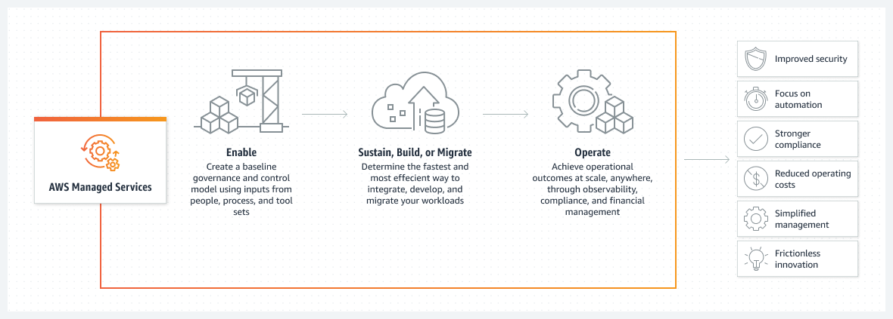

 [General Content AWS Cloud][1]

[1]: https://github.com/weder96/aws-certification-learning

# AWS Managed Services [managed-services](https://aws.amazon.com/pt/managed-services/)

## Conteúdo
1. <a href="#section-1"> AWS Managed Services </a>
2. <a href="#section-2"> AWS Compliance Programs </a>

##  **1 - AWS Managed Services**
AWS Managed Services (AMS) helps you adopt AWS at scale and operate more efficiently and securely.

We leverage standard AWS services and offer guidance and execution of operational best practices, with specialized automations, skills, and experience that are contextual to your environment and applications.

AMS provides proactive, preventive and detection capabilities that take the operational level to the next level and help reduce risk without constraining agility, allowing you to focus on innovation.

AMS extends your team with operational capabilities including monitoring, incident detection and management, security, patching, backup and cost optimization.

## **Benefícios**

**Segurança**
A AMS eleva a excelência operacional com monitoramento e remediação da segurança. 
A AMS reduz continuamente os riscos para os clientes, adotando as práticas recomendadas da AWS e um grande conjunto de ferramentas nativas da AWS. Nossos mecanismos de segurança fornecem controles de prevenção e detecção.

**Disponibilidade**
A AMS fornece revisões bem arquitetadas, verificações de regras de configuração, prevenção de riscos, gerenciamento e muito mais. 
A **AMS monitora o serviços 24 horas por dia**, com alarmes proativos e um ciclo de vida completo do gerenciamento de incidentes, desde a resposta até a resolução.

**Eficiência**
A AMS adota uma abordagem que prioriza a automação de operações para reduzir erros humanos e promover consistência, velocidade, precisão e redução de custos. Nossos clientes recebem uma redução de custos operacionais e da AWS média de 10 a 15%. Por meio da automação, nossas equipes podem focar em problemas complexos dos clientes e no contínuo aprimoramento de mecanismos para obter resultados com o cliente.

**Resiliência**
A AMS escala os recursos operacionais de nossos clientes e evolui para atender às suas necessidades e ao cenário de segurança sempre dinâmico. O modelo operacional da AMS é baseado em um mecanismo de aprendizado contínuo que avalia as workloads e pipelines de acordo com políticas de segurança dinâmicas.

**Conformidade**
A AMS oferece um caminho acelerado em direção ao cumprimento das necessidades de conformidade. A AMS obteve certificações e atestados de conformidade com as regulamentações **PCI-DSS, HIPAA, HiTrust, GDPR, ISO, SOC 1, 2 e 3.** 
Temos pré-autorização para operar workloads que exigem o nível Moderado do FedRamp. 

**Segurança**
Mais de 150 verificações de segurança e barreiras de proteção gerenciadas

**Gerenciamento de incidentes**
80% dos incidentes detectados e notificados proativamente

**Automação**
1,35 milhão de documentos SSM executados por mês. até 97% automatizados

**Redução de custos**
Média de 10 a 15% de economia no custo anual operacional e da AWS

**Especialista da AWS**
Cobertura global 24 horas por dia, com resposta e remediação de nível 1

O AWS Managed Services gerencia as operações diárias de sua infraestrutura AWS em alinhamento com os processos ITIL. O AWS Managed Services oferece uma integração básica com ferramentas de IT Service Management (ITSM), como a plataforma ServiceNow.

Os serviços gerenciados da AWS fornecem gerenciamento contínuo de sua infraestrutura da AWS para que você possa se concentrar em seus aplicativos. Ao implementar as melhores práticas para manter sua infraestrutura, o AWS Managed Services ajuda a reduzir sua sobrecarga operacional e riscos.

Atualmente, os serviços gerenciados da AWS oferecem suporte aos mais de 20 serviços mais críticos para empresas e continuarão a expandir nossa lista de serviços integrados da AWS.

O AWS Managed Services foi projetado para atender às necessidades de empresas que exigem SLAs rigorosos, aderência à conformidade corporativa e integração com seus sistemas e processos baseados em ITIL®.

## **Benefits**

**Safety**
AMS elevates operational excellence with security monitoring and remediation.
AMS continually mitigates risk for customers by adopting AWS best practices and a rich set of native AWS tools. Our security mechanisms provide prevention and detection controls.

**Availability**
AMS provides well-architected reviews, configuration rule checks, risk prevention, management, and more.
**AMS monitors service 24 hours a day**, with proactive alarms and a complete incident management lifecycle from response to resolution.

**Efficiency**
AMS takes an approach that prioritizes operations automation to reduce human error and promote consistency, speed, accuracy and cost savings. Our customers receive an average AWS and operational cost reduction of 10-15%. Through automation, our teams can focus on complex customer issues and continually improve mechanisms to achieve customer results.

**Resilience**
AMS scales our customers' operational capabilities and evolves to meet their needs and the ever-changing security landscape. The AMS operating model is based on a continuous learning engine that evaluates workloads and pipelines according to dynamic security policies.

**Conformity**
AMS offers an accelerated path toward meeting compliance needs. AMS has obtained certifications and attestations of compliance with **PCI-DSS, HIPAA, HiTrust, GDPR, ISO, SOC 1, 2 and 3 regulations.**
We have pre-authorization to operate workloads that require the Moderate level of FedRamp.

**Safety**
150+ managed security checks and guardrails

**Incident Management**
80% of incidents detected and reported proactively

**Automation**
1.35 million SSM documents executed per month. up to 97% automated

**Cost reduction**
Average 10-15% annual AWS and operational cost savings

**AWS Specialist**
24/7 global coverage with Tier 1 response and remediation

AWS Managed Services manages the day-to-day operations of your AWS infrastructure in alignment with ITIL processes. AWS Managed Services provides basic integration with IT Service Management (ITSM) tools such as the ServiceNow platform.

AWS Managed Services provide ongoing management of your AWS infrastructure so you can focus on your applications. By implementing best practices to maintain your infrastructure, AWS Managed Services helps reduce your operational overhead and risk.

AWS Managed Services currently support more than 20 of the most critical services for businesses and will continue to expand our list of integrated AWS services.

AWS Managed Services are designed to meet the needs of companies that require stringent SLAs, adhere to corporate compliance, and integrate with their ITIL®-based systems and processes.

##  **2 - AWS Compliance Programs**

[Programas de conformidade da AWS](https://aws.amazon.com/pt/compliance/programs/)

[hipaa-compliance](https://aws.amazon.com/pt/compliance/hipaa-compliance/)

