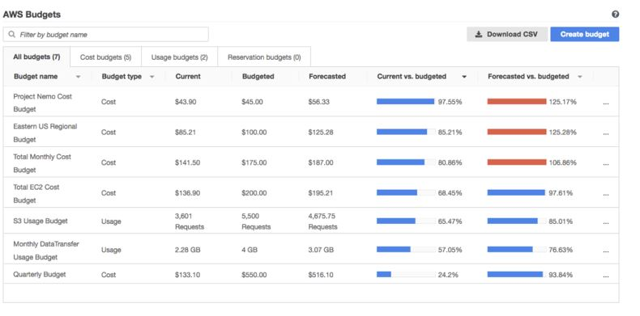

 [Conteudo Geral AWS Cloud][1]

[1]: https://github.com/weder96/aws-certification-learning

# Module 2: Cloud Savings and Billing
[aws-cost-optimization](https://aws.amazon.com/pt/aws-cost-management/aws-cost-optimization/)

## Contents
1. <a href="#section-1"> Savings and Billing </a>
2. <a href="#section-2"> AWS budgets </a>
3. <a href="#section-3"> AWS Pricing Calculator </a>

*************************************************************************************************************
##  **1 - Savings and Billing**

[six-advantages-of-cloud-computing](https://docs.aws.amazon.com/whitepapers/latest/aws-overview/six-advantages-of-cloud-computing.html)

[consolidated-billing](https://docs.aws.amazon.com/awsaccountbilling/latest/aboutv2/consolidated-billing.html)

*************************************************************************************************************
##  **2 - AWS budgets**

[aws-budgets](https://aws.amazon.com/aws-cost-management/aws-budgets/) Orçamento AWS

**Benefits**
Custom budgets that meet your needs:
- Track your cost, usage, or coverage and utilization for your Reserved Instances and Savings Plans, across multiple dimensions, such as service, or Cost Categories. 
- Aggregate your costs with an unblended or amortized view and include or exclude certain charges, such as tax and refunds. - Configure your Budget Actions with IAM policies, Service Control Policies (SCPs), and targeted running instances.  

**Stay informed with alerts and reports**
- Set up event-driven alert notifications for when actual or forecasted cost or usage exceeds your budget limit, or when your RI and Savings Plans' coverage or utilization drops below your threshold. 
- You can also choose to be informed on a daily, weekly, or monthly basis with pre-scheduled Budgets Reports.

**Granular budget time periods**
- Create annual, quarterly, monthly, or even daily budgets depending on your business needs. 
- This allows you to take timely actions to prevent cost or usage overage, or inefficient utilization or resource coverage of your Reserved Instances and Savings Plans.

AWS Budgets gives you the ability to set custom budgets that alert you when your costs or usage exceed (or are forecasted to exceed) your budgeted amount.

  

  

You can also use AWS Budgets to set reservation utilization or coverage targets and receive alerts when your utilization drops below the threshold you define. Reservation alerts are supported for Amazon EC2, Amazon RDS, Amazon Redshift, Amazon ElastiCache, and Amazon Elasticsearch reservations.

*************************************************************************************************************
##  **3 - AWS Pricing Calculator**
[AWS Pricing Calculator](https://aws.amazon.com/tco-calculator/)

To perform a [TCO](https://aws.amazon.com/tco-calculator/) you need to document all of the costs you’re incurring today to run your IT operations. That includes facilities equipment installation and data center security costs. That way you get to compare the full cost of running your IT on-premises today, to running it in the cloud.

Facility operations and hardware procurement costs are something you no longer need to pay for in the AWS Cloud. These factors therefore must be included as an on-premise cost so you can understand the cost of staying in your own data centers.

Database administration, operating system licensing and application licensing will still be required in the AWS Cloud.
[AWS_TCO_Web_Applications](https://media.amazonwebservices.com/AWS_TCO_Web_Applications.pdf)

