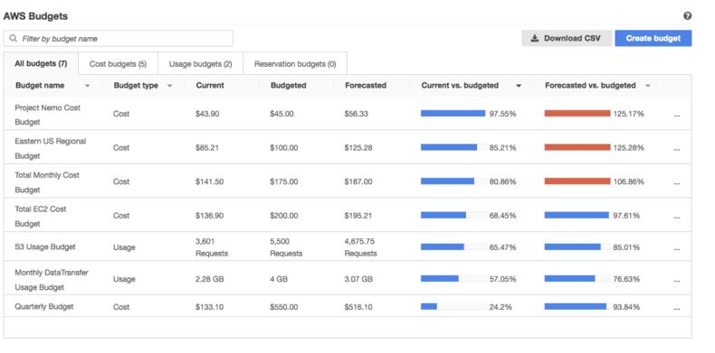
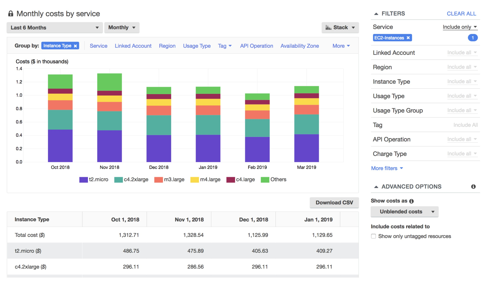

 [General Content AWS Cloud][1]

[1]: https://github.com/weder96/aws-certification-learning

# Module 2: Cloud Savings and Billing
[aws-cost-optimization](https://aws.amazon.com/pt/aws-cost-management/aws-cost-optimization/)

## Contents
1. <a href="#section-01"> Savings and Billing </a>
2. <a href="#section-02"> AWS budgets </a>
3. <a href="#section-03"> AWS Pricing Calculator </a>
4. <a href="#section-04"> AWS Cost Explorer </a>
5. <a href="#section-05"> AWS Application Cost Profiler </a>
6. <a href="#section-06"> AWS Cost and Usage Report </a>
7. <a href="#section-07"> Savings Plans </a>

*********************************************************************************************************
##  **1 - Savings and Billing**

[six-advantages-of-cloud-computing](https://docs.aws.amazon.com/whitepapers/latest/aws-overview/six-advantages-of-cloud-computing.html)

[consolidated-billing](https://docs.aws.amazon.com/awsaccountbilling/latest/aboutv2/consolidated-billing.html)

**Cheat Sheets**

https://digitalcloud.training/aws-billing-and-pricing/

**References:**

https://docs.aws.amazon.com/awsaccountbilling/latest/aboutv2/cost-alloc-tags.html

**Videos**

https://www.youtube.com/watch?v=YiqTBDmn00I

*************************************************************************************************************
##  **2 - AWS budgets**

[AWS budgets](https://aws.amazon.com/aws-cost-management/aws-budgets/?nc1=h_ls)

**Definitions**
AWS Budgets is a cost management tool that allows you to set custom budgets for your AWS usage and costs, and receive notifications when those budgets are exceeded. It provides you with the flexibility to track and control your AWS spending more effectively, ensuring that your costs stay within acceptable limits. Whether you're managing a single account or multiple accounts, AWS Budgets can help you keep your cloud expenses in check and avoid unexpected charges.

**Benefits**
Custom budgets that meet your needs:
- Track your cost, usage, or coverage and utilization for your Reserved Instances and Savings Plans, across multiple dimensions, such as service, or Cost Categories. 
- Aggregate your costs with an unblended or amortized view and include or exclude certain charges, such as tax and refunds. - Configure your Budget Actions with IAM policies, Service Control Policies (SCPs), and targeted running instances.  

**Stay informed with alerts and reports**
- Set up event-driven alert notifications for when actual or forecasted cost or usage exceeds your budget limit, or when your RI and Savings Plans' coverage or utilization drops below your threshold. 
- You can also choose to be informed on a daily, weekly, or monthly basis with pre-scheduled Budgets Reports.

**Granular budget time periods**
- Create annual, quarterly, monthly, or even daily budgets depending on your business needs. 
- This allows you to take timely actions to prevent cost or usage overage, or inefficient utilization or resource coverage of your Reserved Instances and Savings Plans.

AWS Budgets gives you the ability to set custom budgets that alert you when your costs or usage exceed (or are forecasted to exceed) your budgeted amount.

  

  

You can also use AWS Budgets to set reservation utilization or coverage targets and receive alerts when your utilization drops below the threshold you define. Reservation alerts are supported for Amazon EC2, Amazon RDS, Amazon Redshift, Amazon ElastiCache, and Amazon Elasticsearch reservations.

### Budget Creation and Alarms

With AWS Budgets, you can easily create custom budgets for your usage, costs, or reserved instances and set alarms to alert you when spending exceeds the defined threshold. These alerts can be sent via **Amazon Simple Notification Service (SNS)**, ensuring you stay informed when your usage or costs reach predefined levels. This helps you stay proactive in managing your AWS resources and avoid unexpected charges at the end of the month.

### Types of Budgets

AWS Budgets offers four primary types of budgets, each designed to track different aspects of your AWS resources:

1. **Usage Budgets**: This type of budget tracks the usage of AWS resources (e.g., EC2 instances, storage, etc.) and helps you ensure that you are not exceeding your expected usage. It can be configured to monitor a variety of usage metrics, such as the number of hours an EC2 instance runs or the amount of data stored in Amazon S3.

2. **Cost Budgets**: This budget type helps you track your AWS spending over time. It monitors your total cost, giving you visibility into your spending patterns and allowing you to set thresholds for spending to ensure you do not exceed your budget. You can set up alerts to notify you when your costs surpass the predefined budget.

3. **Reservation Budgets**: For organizations using **Reserved Instances (RIs)** or other reserved services, this type of budget helps track the utilization of those resources. You can use it to monitor the performance of your RIs and ensure they are being used efficiently. This is particularly useful for EC2, ElastiCache, RDS, and Redshift resources, which can be reserved for cost savings over time.

4. **Savings Plans Budgets**: This budget helps you track your **Savings Plans**, which offer discounted rates in exchange for committing to a certain level of usage. You can track how much you are saving with your Savings Plans, and set alerts to monitor if you are on track to meet the expected savings.

### Filtering Options

When creating a budget, AWS Budgets provides flexible filtering options, allowing you to narrow down your budget scope based on specific criteria. You can filter by:

- **Service** (e.g., EC2, S3, Lambda)
- **Linked Account** (for organizations with multiple AWS accounts)
- **Tag** (for cost allocation tags)
- **Purchase Option** (e.g., On-demand or Reserved instances)
- **Instance Type** (e.g., EC2 instance types)
- **Region** (geographical regions where your resources are deployed)
- **Availability Zone**
- **API Operation**
- And many more, including options available in AWS Cost Explorer.

### Cost and Usage Management

With AWS Budgets, you can control your spending and usage across different AWS services, accounts, regions, and resources. By combining the powerful tracking and alerting features with customizable filters, you can effectively manage and optimize costs at scale.

### Notification Flexibility

AWS Budgets supports up to **5 SNS topics per budget**, allowing you to send alerts to different recipients or take action based on your budget thresholds. For example, you can set up notifications for different team members to be alerted when the budget exceeds a certain percentage, or you can automate actions like stopping underutilized resources.

### Pricing

AWS Budgets allows you to create up to **2 free budgets** per account. After that, each additional budget costs **$0.02 per day**. This makes it an affordable option for organizations looking to implement cost controls without significant overhead.

**Cheat Sheets**

https://digitalcloud.training/aws-billing-and-pricing/

**References:**

https://aws.amazon.com/aws-cost-management/aws-budgets/

**Videos**

https://www.youtube.com/results?search_query=aws+budgets

https://www.youtube.com/watch?v=fvz0cphjHjg

**Hands On**

https://www.youtube.com/results?search_query=Aws+budgets+hands+on

***********************************************************************************************************
##  **3 - AWS Pricing Calculator**
[AWS Pricing Calculator](https://aws.amazon.com/tco-calculator/)

To perform a [TCO](https://aws.amazon.com/tco-calculator/) you need to document all of the costs you’re incurring today to run your IT operations. That includes facilities equipment installation and data center security costs. That way you get to compare the full cost of running your IT on-premises today, to running it in the cloud.

Facility operations and hardware procurement costs are something you no longer need to pay for in the AWS Cloud. These factors therefore must be included as an on-premise cost so you can understand the cost of staying in your own data centers.

Database administration, operating system licensing and application licensing will still be required in the AWS Cloud.
[AWS_TCO_Web_Applications](https://media.amazonwebservices.com/AWS_TCO_Web_Applications.pdf)

*********************************************************************************************************
##  **4 - AWS Cost Explorer**

[AWS Cost Explorer](https://aws.amazon.com/aws-cost-management/aws-cost-explorer/)

AWS Cost Explorer has an easy-to-use interface that lets you visualize, understand, and manage your AWS costs and usage over time. AWS Cost Explorer provides you with a set of default reports that you can use as the starting place for your analysis. From there, use the filtering and grouping capabilities to dive deeper into your cost and usage data and generate custom insights.

AWS Cost Explorer is a powerful tool designed to give you a detailed and comprehensive view of your AWS costs and usage over time. It helps organizations manage their AWS resources more efficiently by providing insights into spending patterns, usage trends, and cost optimization opportunities. With Cost Explorer, you can visualize, analyze, and manage your AWS spending across different accounts, services, and resources.

### Custom Reporting

AWS Cost Explorer allows you to create custom reports that analyze your cost and usage data in a flexible way. You can drill down to different levels of granularity—such as total costs across all accounts or specific costs by service, region, or resource. This level of customization allows you to focus on the aspects of your usage that matter most, helping you make informed decisions about your AWS spending.

### Cost Optimization

Cost Explorer provides deep visibility into your AWS resource usage at different levels, allowing you to identify opportunities for cost optimization. For instance, you can spot underutilized resources, like idle EC2 instances or oversized instances, and take action to reduce your spending. The ability to analyze cost data at granular levels, such as by service or individual resource, makes it easier to pinpoint areas where resources are being wasted or where efficiencies can be achieved.

### Trend Analysis

AWS Cost Explorer enables you to analyze cost and usage trends over time, with reports available at a **monthly granularity**. This trend analysis allows you to identify fluctuations in usage and spending patterns, helping you better understand your costs and plan budgets more effectively. You can examine your historical usage data over multiple years, which is particularly useful for forecasting future costs and aligning them with your organizational goals.

### Resource-Level Data

Cost Explorer provides detailed data on costs at the **resource level**, allowing you to pinpoint specific AWS resources driving the most significant costs. For example, you can track the spending of individual EC2 instances, identify which ones are the most expensive, and adjust your resource allocation accordingly. This resource-level visibility helps ensure that you’re only paying for the resources you actually need, optimizing your infrastructure and minimizing waste.

### Forecasting Future Usage

One of the most useful features of AWS Cost Explorer is its ability to **forecast usage** up to **12 months** in advance, based on your historical data. By analyzing past usage trends, Cost Explorer can project future usage and estimate future costs, enabling you to plan for upcoming expenses and better allocate your budget. This is particularly helpful for organizations with dynamic and fluctuating workloads, as it allows for proactive cost management.

### Savings Plans

Cost Explorer helps you identify opportunities to purchase **Savings Plans**, which offer significant discounts on your AWS bill in exchange for a commitment to specific usage patterns. By reviewing your cost and usage data, Cost Explorer can help you choose the most appropriate Savings Plan to reduce your overall AWS costs. These plans are a great way to optimize long-term spending and lock in lower rates for predictable workloads.

**Cheat Sheets**

https://digitalcloud.training/aws-billing-and-pricing/

**References**

https://aws.amazon.com/aws-cost-management/aws-cost-explorer/

**Videos**

https://www.youtube.com/results?search_query=aws+cost+explorer

*********************************************************************************************************
##  **5 - AWS Application Cost Profiler**

[AWS-Application-Cost-Profiler](https://aws.amazon.com/aws-cost-management/aws-application-cost-profiler/)

**Cheat Sheets**

https://digitalcloud.training/aws-billing-and-pricing/

**References**

**Videos**

*********************************************************************************************************
##  **6 - AWS Cost and Usage Report**

[AWS Cost and Usage Report](https://docs.aws.amazon.com/cur/latest/userguide/what-is-cur.html)

**Cheat Sheets**

https://digitalcloud.training/aws-billing-and-pricing/

https://tutorialsdojo.com/aws-billing-and-cost-management/

**References**

https://aws.amazon.com/aws-cost-management/aws-cost-explorer/

https://aws.amazon.com/aws-cost-management/aws-cost-and-usage-reporting/

https://aws.amazon.com/aws-cost-management/faqs/

https://docs.aws.amazon.com/awsaccountbilling/latest/aboutv2

**Videos**

https://www.youtube.com/results?search_query=AWS+Cost+and+Usage+Report

*********************************************************************************************************
##  **7 - Savings Plans**

[Savings Plans](https://aws.amazon.com/savingsplans/)

**Cheat Sheets**

https://tutorialsdojo.com/aws-support-plans/

https://digitalcloud.training/aws-billing-and-pricing/

**References**

https://d1.awsstatic.com/whitepapers/aws_pricing_overview.pdf

https://aws.amazon.com/pricing/

https://aws.amazon.com/ec2/pricing/reserved-instances/pricing/

**Videos**

https://www.youtube.com/results?search_query=aws+saving+plans

*********************************************************************************************************
