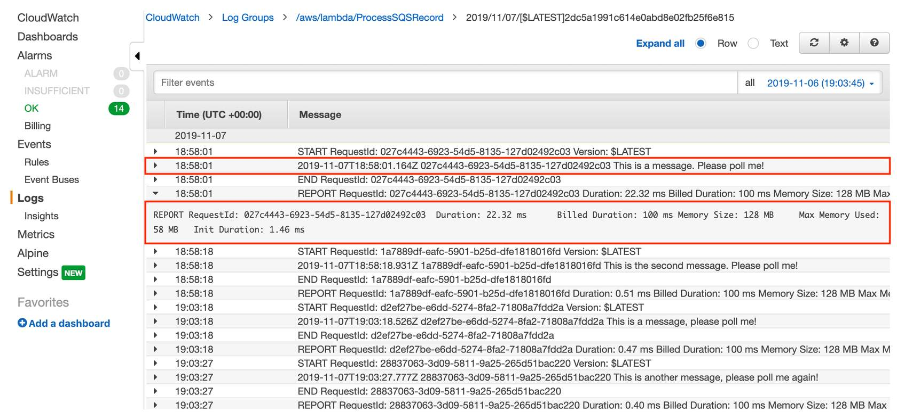
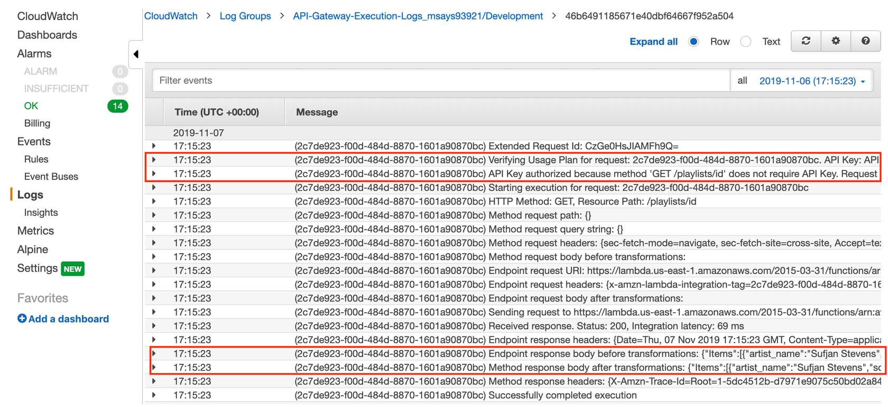
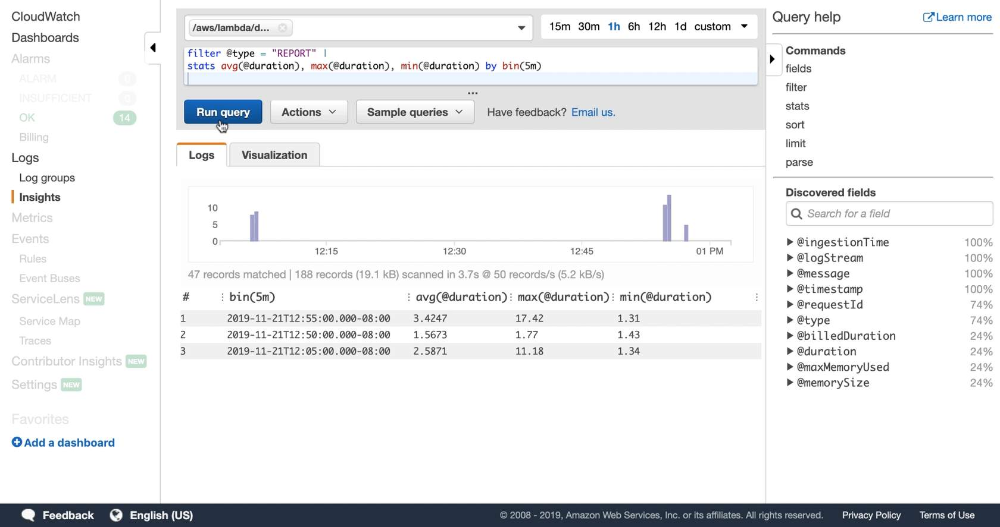

 [General Content AWS Cloud][1]

[1]: https://github.com/weder96/aws-certification-learning

# Module 20: Management and Governance

## Content
1. <a href="#section-1"> AWS Auto Scaling </a>
2. <a href="#section-2"> AWS CloudFormation </a>
3. <a href="#section-3"> AWS CloudTrail </a>
4. <a href="#section-4"> Amazon CloudWatch </a>
5. <a href="#section-5"> AWS Command Line Interface (AWS CLI) </a>
6. <a href="#section-6"> AWS Compute Optimizer </a>
7. <a href="#section-7"> AWS Config </a>
8. <a href="#section-8"> AWS Control Tower </a>
9. <a href="#section-9"> AWS License Manager </a>
10. <a href="#section-10"> Amazon Managed Grafana </a>
11. <a href="#section-11"> Amazon Managed Service for Prometheus </a>
12. <a href="#section-12"> AWS Management Console </a>
13. <a href="#section-13"> AWS Organizations </a>
14. <a href="#section-14"> AWS Personal Health Dashboard </a>
15. <a href="#section-15"> AWS Proton </a>
16. <a href="#section-16"> AWS Service Catalog </a>
17. <a href="#section-17"> AWS Systems Manager </a>
18. <a href="#section-18"> AWS Trusted Advisor </a>
19. <a href="#section-19"> AWS Well-Architected Tool </a>

***************************************************************************************************
##  **1 - AWS Auto Scaling**

**References:**

[https://github.com/weder96/aws-certification-learning/tree/main/module-10](https://github.com/weder96/aws-certification-learning/tree/main/module-10)

***************************************************************************************************
##  **2 - AWS CloudFormation**

**Cheat Sheets**

**References:**

**Videos**

***************************************************************************************************
##  **3 - AWS CloudTrail**

AWS CloudTrail is an auditing service that monitors API activity in your account. Whenever you perform any operation in the account this results in an API action and this information is recorded to create an audit trail.

Amazon CloudWatch is a performance monitoring service. AWS services send metrics about their utilization to CloudWatch which collects the metrics. Additionally, CloudWatch collects metrics about account activity such as billing information which can also be viewed.

Which AWS services can a company use to gather information about activity in their AWS account.

**Cheat Sheets**

https://digitalcloud.training/aws-monitoring-and-logging-services/

**References:**

https://aws.amazon.com/cloudwatch/

https://aws.amazon.com/cloudtrail/

**Videos**

***************************************************************************************************
##  **4 - Amazon CloudWatch**

Amazon CloudWatch is a performance monitoring service. AWS services send metrics about their utilization to CloudWatch which collects the metrics. You can then view the results in CloudWatch and configure alarms.

Amazon CloudWatch is a monitoring service for AWS cloud resources and the applications you run on AWS.

CloudWatch is for performance monitoring (CloudTrail is for auditing).

Used to collect and track metrics, collect, and monitor log files, and set alarms.

Automatically react to changes in your AWS resources.

Monitor resources such as:

- EC2 instances.
- DynamoDB tables.
- RDS DB instances.
- Custom metrics generated by applications and services.
- Any log files generated by your applications.

Gain system-wide visibility into resource utilization.

CloudWatch monitoring includes application performance.

Monitor operational health.

CloudWatch is accessed via API, command-line interface, AWS SDKs, and the AWS Management Console.

CloudWatch integrates with IAM.

Amazon CloudWatch Logs lets you monitor and troubleshoot your systems and applications using your existing system, application, and custom log files.

CloudWatch Logs can be used for real time application and system monitoring as well as long term log retention.

CloudWatch Logs keeps logs indefinitely by default.

CloudTrail logs can be sent to CloudWatch Logs for real-time monitoring.

CloudWatch Logs metric filters can evaluate CloudTrail logs for specific terms, phrases, or values.

CloudWatch retains metric data as follows:

- Data points with a period of less than 60 seconds are available for 3 hours. These data points are high-resolution custom metrics.
- Data points with a period of 60 seconds (1 minute) are available for 15 days.
- Data points with a period of 300 seconds (5 minute) are available for 63 days.
- Data points with a period of 3600 seconds (1 hour) are available for 455 days (15 months).

Dashboards allow you to create, customize, interact with, and save graphs of AWS resources and custom metrics.

Alarms can be used to monitor any Amazon CloudWatch metric in your account.

Events are a stream of system events describing changes in your AWS resources.

Logs help you to aggregate, monitor and store logs.

Basic monitoring = 5 mins (free for EC2 Instances, EBS volumes, ELBs and RDS DBs).

Detailed monitoring = 1 min (chargeable).

Metrics are provided automatically for several AWS products and services.

There is no standard metric for memory usage on EC2 instances.

A custom metric is any metric you provide to Amazon CloudWatch (e.g. time to load a web page or application performance).

Options for storing logs:

1. CloudWatch Logs.
2. Centralized logging system (e.g. Splunk).
3. Custom script and store on S3.

Do not store logs on non-persistent disks:

Best practice is to store logs in CloudWatch Logs or S3.

CloudWatch Logs subscription can be used across multiple AWS accounts (using cross account access).

Amazon CloudWatch uses Amazon SNS to send email.

### **Monitoring serverless applications**

So, you’ve blocked the doors, secured confidential documents, and password-protected your Wi-Fi with something stronger than PASSWORD1. Now it’s time to put some monitoring and notifications in place for when things get crazy. These next videos highlight the key types of monitoring that you need to put in place to monitor the security and health of your serverless architectures.

**CloudWatch metrics**

Developers primarily use CloudWatch metrics to monitor service health and alarm on error cases. For example, you might set a CloudWatch alarm to notify Amazon Simple Notification Service (Amazon SNS) topic subscribers when a metric is outside of an expected range. From there, you could trigger additional automated actions. 

Review the built-in CloudWatch metrics and their dimensions for each of the services you plan to use, so that you can decide how to best leverage them before adding custom metrics. There are also many third-party tools that provide monitoring and metrics reporting from CloudWatch data.

**CloudWatch Logs and Logs Insights**

Logs let you dig into specific issues, but you can also use log data to create business-level metrics via CloudWatch Logs metric filters. It’s important to evaluate which logs and what level of logging you need for test, verses production, environments, and which you need continually verses only when debugging an issue.

There is a cost to logging everything that happens, but you need to weigh that against the business impact of not logging something that will help solve an issue. For example, your logs might show that you have unauthorized access, but you don’t have enough details to do much about it.

At a minimum, you want to know who made the call and when the call was made. Log basic context like the user or what has changed, and log request IDs in your clients. Lambda logs all requests handled by your function and stores them in CloudWatch Logs. This gives you access to information about each invocation of your Lambda function. You can log almost anything to CloudWatch Logs by using "Print" or "Standard out" statements in your functions. When you create custom logs, use a structured format like a JSON event to make it easier to report from them.

API Gateway execution logs include information on errors as well as execution traces.

Things like parameter values, payload, Lambda authorizers used, and API keys appear in the execution logs. You can log just errors or errors and info. Logging is set up per API stage. Now, these logs are detailed, so you want to be thoughtful about what you need. Also, log groups don’t expire by default, so make sure to set retention values suitable to your workload.

You can also create custom access logs and send them to your preferred CloudWatch Group to track who is accessing, and how they are accessing, your APIs. You can specify the access details by selecting context variables and choose the format you want to use. You can interact with logs via CloudWatch Logs to drill into any specific log entry, or filter them based on a pattern to create your own metrics. 

CloudWatch Logs Insights lets you use prebuilt or custom queries on your logs to provide aggregated views and reporting, for example, latency statistics for 5-minute intervals, or statistics on average memory usage of a function to help you fine-tune performance.

If you’ve created structured custom logs, CloudWatch Logs Insights can automatically discover the fields in your logs to make it easy to query and group your log data.

### **Definitions - CloudWatch metrics**

**Business metrics**

Business KPIs measure your application performance against business goals. It is extremely important to know when something is critically affecting your overall business (revenue wise or not).

Examples: Orders placed, debit and credit card operations, flights purchased

**Customer experience metrics**

Customer experience data indicates the overall effectiveness of the user interface/user experience (UI/UX). However, it also indicates whether changes or anomalies are affecting the customer experience in a particular section of your application. These metrics are often measured in percentiles, to prevent outliers, when trying to understand the impact over time and how widespread it is across your customer base.

Examples: 
- Perceived latency
- Time it takes to add an item to a basket or checkout
- Page load times

**System metrics**

Vendor and application metrics are important to underpin root causes. System metrics also tell you if your systems are healthy, at risk, or already affecting your customers.

Examples: 
- Percentage of HTTP errors/success
- Memory utilization
- Function duration/error/throttling
- Queue length
- Stream records length
- Integration latency

**Operational metrics**

Ops metrics are important to understand sustainability and maintenance of a given system and crucial to pinpoint how stability has progressed or degraded over time.

Examples: 
- Number of tickets, such as successful and unsuccessful resolutions
- Number of times people on-call were paged
- Availability
- Continuous integration/continuous delivery (CI/CD) pipeline statistics, such as successful or failed deployments, feedback time, cycle and lead time

**Review these built-in CloudWatch metrics and their dimensions** for each of the services that you plan to use so that you can decide how to best leverage them, as opposed to adding custom metrics. Many third-party tools are also available that provide monitoring and metrics reporting from CloudWatch data.

[Amazon API Gateway dimensions and metrics](https://docs.aws.amazon.com/apigateway/latest/developerguide/api-gateway-metrics-and-dimensions.html)
[Working with Lambda function metrics](https://docs.aws.amazon.com/lambda/latest/dg/monitoring-functions-metrics.html)
[Available CloudWatch metrics for Amazon SQS](https://docs.aws.amazon.com/AWSSimpleQueueService/latest/SQSDeveloperGuide/sqs-available-cloudwatch-metrics.html)
[Monitoring Step Functions Using CloudWatch](https://docs.aws.amazon.com/step-functions/latest/dg/procedure-cw-metrics.html)
[Monitoring Amazon SNS topics using CloudWatch](https://docs.aws.amazon.com/sns/latest/dg/sns-monitoring-using-cloudwatch.html)
[Monitoring the Amazon Kinesis Data Streams Service with Amazon CloudWatch](https://docs.aws.amazon.com/streams/latest/dev/monitoring-with-cloudwatch.html)

### **CloudWatch Logs**

Using logs helps you dig into specific issues, but you can also use log data to create business-level metrics using Amazon CloudWatch Logs metric filters. You can interact with logs using CloudWatch Logs to drill into any specific log entry or filter them based on a pattern to create your own metrics. See how the following services interact with CloudWatch Logs.

**Lambda logs**
Lambda automatically logs all requests handled by your function and stores them in CloudWatch Logs. This gives you access to information about each invocation of your Lambda function.

You can log almost anything to CloudWatch Logs by using print or standard out statements in your functions. When you create custom logs, use a structured format, such as a JavaScript Object Notation (JSON) event to make it easier to report from them.

### **API Gateway execution and access logs**

API Gateway execution logs include information on errors and execution traces. Information such as parameter values, payload, Lambda authorizers used, and API keys appears in the logs. You can log just errors or errors and information. Logging is set up per API stage. These logs are detailed, so you want to be thoughtful about what you need. Also, log groups don’t expire by default, so make sure to set retention values suitable to your workload.

You can also create custom access logs and send them to your preferred CloudWatch group to track who is accessing your APIs and how. You can specify the access details by selecting context variables and choosing the format that you want to use.

### **CloudWatch EMF**
Traditionally, it can be difficult to generate actionable, custom metrics from your ephemeral resources, such as Lambda functions and containers. You can use the embedded metric format (EMF) to instruct CloudWatch Logs to automatically extract metric values that are embedded in structured log events.

By sending your logs in EMF, CloudWatch will automatically extract the custom metrics, so you can visualize them and create alarms, without having to create or maintain separate code.

These detailed log events associated with the extracted metrics can be queried using CloudWatch Logs Insights to provide insights into the root causes of operational events.  

### **CloudWatch Logs Insights**

With CloudWatch Log Insights, you can use prebuilt or custom queries on your logs to provide aggregated views and reporting. If you’ve created structured custom logs, CloudWatch Logs Insights can automatically discover the fields in your logs to help you to query and group your log data. To learn more, choose each the numbered marker:

**Article**

https://plainenglish.io/blog/json-logs-with-cloudwatch-logs-insights

**Cheat Sheets**

https://digitalcloud.training/aws-monitoring-and-logging-services/

**References:**

https://aws.amazon.com/cloudwatch/features/

**Videos**

***************************************************************************************************
##  **5 - AWS Command Line Interface (AWS CLI)**

")

**Cheat Sheets**

**References:**

**Videos**

***************************************************************************************************
##  **6 - AWS Compute Optimizer**

**Definitions**

AWS Compute Optimizer is a service that analyzes the configuration and utilization metrics of your AWS resources. It reports whether your resources are optimal, and generates optimization recommendations to reduce the cost and improve the performance of your workloads. Compute Optimizer also provides graphs showing recent utilization metric history data, as well as projected utilization for recommendations, which you can use to evaluate which recommendation provides the best price-performance trade-off. The analysis and visualization of your usage patterns can help you decide when to move or resize your running resources, and still meet your performance and capacity requirements.

Compute Optimizer provides a console experience, and a set of APIs that allows you to view the findings of the analysis and recommendations for your resources across multiple AWS Regions. You can also view findings and recommendations across multiple accounts, if you opt in the management account of an organization. The findings from the service are also reported in the consoles of the supported services, such as the Amazon EC2 console.

**Cheat Sheets**

**References:**

https://docs.aws.amazon.com/compute-optimizer/latest/ug/what-is-compute-optimizer.html

https://docs.aws.amazon.com/compute-optimizer/latest/ug/getting-started.html

**Videos**

https://www.youtube.com/results?search_query=AWS+Compute+Optimizer

**Hands On**

https://www.youtube.com/results?search_query=AWS+Compute+Optimizer+hands+on

***************************************************************************************************
##  **7 - AWS Config**

**Cheat Sheets**

**References:**

**Videos**

***************************************************************************************************
##  **8 - AWS Control Tower**

**Cheat Sheets**

**References:**

**Videos**

***************************************************************************************************
##  **9 - AWS License Manager**

**Definitions**

- A service for centrally managing software licenses across AWS and on-premises environments.
- It gives you control and visibility into license usage, allowing you to limit licensing overages and reduce the risk of noncompliance and misreporting.
- Supports a variety of licensing models:
    - **Perpetual** – lifetime license with no expiration date.
    - **Floating** – shareable licenses.
    - **Subscription** – license with expiration date.
    - **Usage-based** – license with specific terms based on usage.

### **Pricing**
    - You are charged for AWS resources that you create to run your application.

**Cheat Sheets**

https://tutorialsdojo.com/aws-license-manager/

**References:**

https://aws.amazon.com/license-manager/

https://docs.aws.amazon.com/license-manager/latest/userguide/license-manager.html

**Videos**

https://www.youtube.com/results?search_query=AWS+License+Manager

**Hands On**

https://www.youtube.com/results?search_query=AWS+License+Manager+hands+On

***************************************************************************************************
##  **10 - Amazon Managed Grafana**

**Definitions**

Build, package, and deploy workspaces that are provisioned, set up, scaled, and maintained for you.

Visualize, analyze, and correlate operational data across multiple sources, and query across multiple AWS accounts and Regions.

Integrate with AWS security services to meet your corporate security and compliance requirements.

Migrate from your self-managed Grafana environment, so there’s no need to start from scratch.

How it works

Amazon Managed Grafana is a fully managed service for Grafana, a popular open-source analytics platform that enables you to query, visualize, and alert on 
your metrics, logs, and traces.

**Cheat Sheets**

**References:**

https://aws.amazon.com/grafana/?nc1=h_ls

https://aws.amazon.com/grafana/features/?nc=sn&loc=2

https://aws.amazon.com/grafana/pricing/?nc=sn&loc=3

https://aws.amazon.com/grafana/resources/?nc=sn&loc=4&msg-blogs.sort-by=item.additionalFields.createdDate&msg-blogs.sort-order=desc

https://aws.amazon.com/grafana/faqs/?nc=sn&loc=5

**Videos**

https://www.youtube.com/results?search_query=Amazon+Managed+Grafana

***Hands On**

https://www.youtube.com/results?search_query=Amazon+Managed+Grafana+hands+on

***************************************************************************************************
##  **11 - • Amazon Managed Service for Prometheus**

**Definitions**

Use Prometheus query language (PromQL) to filter, aggregate, ingest, and query millions of unique time series metrics from your self-managed Kubernetes clusters.

Automatically scale as your ingestion and query needs grow, and maintain consistent response times for large container deployments.

Integrate with AWS security services to meet your corporate security and compliance requirements.

Reduce the operational costs of configuring, upgrading, and scaling standalone Prometheus servers.

**How it works**

Amazon Managed Service for Prometheus is a Prometheus-compatible service that monitors and provides alerts on containerized applications and infrastructure at scale. The service is integrated with Amazon Elastic Kubernetes Service (EKS), Amazon Elastic Container Service (ECS), and AWS Distro for OpenTelemetry.

**Cheat Sheets**

**References:**

https://aws.amazon.com/prometheus/

https://aws.amazon.com/prometheus/features/

https://aws.amazon.com/prometheus/pricing/

https://aws.amazon.com/prometheus/resources/?msg-blogs.sort-by=item.additionalFields.createdDate&msg-blogs.sort-order=desc

https://aws.amazon.com/prometheus/videos/

https://aws.amazon.com/prometheus/faqs/

**Videos**

https://www.youtube.com/watch?v=fW2LOqHDUNM

***Hand On**

***************************************************************************************************
##  **12 - AWS Management Console**

**Definitions**

Console Overview

Discover and experiment with over 150 AWS services, many of which you can try for free.
Build your cloud-based applications in any AWS data center throughout the world.
Manage and monitor users, service usage, health, and monthly billing.
Get in-console help from AWS Support.

**Cheat Sheets**

**References:**

https://aws.amazon.com/console/

**Videos**

***Hand On**

***************************************************************************************************
##  **13 - AWS Organizations**

[Check](https://github.com/weder96/aws-certification-learning/tree/main/module-15#section-18)
***************************************************************************************************
##  **14 - AWS Personal Health Dashboard**

**Definitions**

The AWS Health Dashboard is the single place to learn about the availability and operations of AWS services. You can view the overall status of AWS services, and you can sign in to view personalized communications about your particular AWS account or organization. Your account view provides deeper visibility into resource issues, upcoming changes, and important notifications.

### Benefits

**Personalized view of service health**

When you sign in to the AWS Health Dashboard, you have a personalized view of the AWS service status that powers your application. Use the AWS Health Dashboard to learn about specific operational issues that affect your account. For example, if you receive an event for a lost Amazon Elastic Block Store (EBS) volume associated with one of your Amazon EC2 instances, you can quickly view how your resources are impacted, helping you to troubleshoot and remediate.

**Proactive notifications**

In addition to enabling emails to receive important Health events, you can configure AWS Health Aware to receive information in your Slack channel or operational tooling. For example, if a maintenance event is scheduled for one of your Amazon EC2 instances, you can receive an alert with information in your preferred communication channel so you can actively address any issues for the upcoming change.

**Detailed troubleshooting guidance**

When you get a Health event, it includes remediation details and specific guidance so that you can take action for events that affect your resources. For example, if a hardware issue affects one of your Amazon Elastic Block Store (EBS) volumes, the alert includes a list of affected resources, and recommendations and help links to restore your volume from a snapshot. This helps you reduce the amount of time to resolve issues.

**Integration and automation**

You can use Amazon EventBridge to build custom rules and select targets, such as AWS Lambda functions, to define automated remediation actions for specific events. You can use the AWS Health API, the service that powers AWS Health Dashboard, to integrate health data and notifications with your existing in-house or third-party IT management tools. The AWS Health API is part of an AWS Business Support or AWS Enterprise Support plan.

**Fine-grained access control by using IAM**

The AWS Health Dashboard supports access control so you can set up permissions based on event metadata. This enables you to grant or deny access to an AWS Identity and Access Management (IAM) user based on attributes, such as event types, specific services, or other role-based attributes. You can restrict access of sensitive events, such as security events, to only the users that need to see them.

**Aggregate health events across AWS Organizations**

If you use AWS Organizations, you can use AWS Health to aggregate notifications from all accounts in your organization. This provides you a centralized and real-time view for all AWS Health events posted to individual accounts in your organization, including operational issues, scheduled maintenance, and account notifications. 

**Cheat Sheets**

**References:**

https://aws.amazon.com/premiumsupport/technology/aws-health-dashboard/

https://aws.amazon.com/premiumsupport/pricing/?nc=sn&loc=3

https://aws.amazon.com/premiumsupport/resources/?nc=sn&loc=4

**Videos**

https://www.youtube.com/results?search_query=AWS+Health+Dashboard

**Hands On**

https://www.youtube.com/results?search_query=AWS+Health+Dashboard+hands+on

***************************************************************************************************
##  **15 - AWS Proton**

**Definitions**

Increase your impact with self-service infrastructure templates and provisioning automation.

Amplify platform engineering impact by implementing scalable self-service capabilities for developers.

Empower developers to move faster with a self-service tool to provision infrastructure and manage code deployment.

Accelerate adoption of DevOps best practices within your team.

How it works

AWS Proton is a deployment workflow tool for modern applications that helps platform and DevOps engineers achieve organizational agility.

**Cheat Sheets**

**References:**

https://aws.amazon.com/proton/

https://aws.amazon.com/proton/features/

https://aws.amazon.com/proton/pricing/

https://aws.amazon.com/proton/getting-started/

https://aws.amazon.com/proton/faqs/

**Videos**

https://www.youtube.com/results?search_query=AWS+Proton

**Hands On**

https://www.youtube.com/results?search_query=AWS+Proton+hands+on

***************************************************************************************************
##  **16 - AWS Service Catalog**

**Definitions**

Create, share, organize, and govern your curated IaC templates

1,000 free API calls per month

with the AWS Free Tier

Quickly find and deploy approved, self-service cloud resources.

Stay agile while improving governance over resources across multiple accounts.

Streamline workflows by connecting to ServiceNow and Jira Service Management.

Get up-to-date, accurate application definitions and metadata with AWS Service Catalog AppRegistry.

**How it works**

AWS Service Catalog lets you centrally manage deployed IT services, applications, resources, and metadata to achieve consistent governance of your infrastructure as code (IaC) templates. With AWS Service Catalog, you can meet your compliance requirements while making sure your customers can quickly deploy the approved IT services they need.

**Cheat Sheets**

**References:**

https://aws.amazon.com/servicecatalog/?nc1=h_ls

https://aws.amazon.com/servicecatalog/features/

https://aws.amazon.com/servicecatalog/pricing/

https://aws.amazon.com/servicecatalog/getting-started/

https://aws.amazon.com/servicecatalog/resources/?service-catalog-blogs.sort-by=item.additionalFields.createdDate&service-catalog-blogs.sort-order=desc

https://aws.amazon.com/servicecatalog/faqs/

**Videos**

https://www.youtube.com/results?search_query=AWS+Service+Catalog

**Hands On**

https://www.youtube.com/results?search_query=AWS+Service+Catalog+hands+on

***************************************************************************************************
##  **17 - AWS Systems Manager**

**Definitions**

Allows you to centralize operational data from multiple AWS services and automate tasks across your AWS resources.

### **Features**

- Create logical groups of resources such as applications, different layers of an application stack, or production versus development environments.

- You can select a resource group and view its recent API activity, resource configuration changes, related notifications, operational alerts, software inventory, and patch compliance status.

- Collects information about your instances and the software installed on them.
Allows you to safely automate common and repetitive IT operations and management tasks across AWS resources.

- Provides a browser-based interactive shell and CLI for managing Windows and Linux EC2 instances, without the need to open inbound ports, manage SSH keys, or use bastion hosts. Administrators can grant and revoke access to instances through a central location by using IAM policies.

- Helps ensure that your software is up-to-date and meets your compliance policies.
- Lets you schedule windows of time to run administrative and maintenance tasks across your instances.

**SSM Agent** is the tool that processes Systems Manager requests and configures your machine as specified in the request. SSM Agent must be installed on each instance you want to use with Systems Manager. On newer AMIs and instance types, SSM Agent is installed by default. On older versions, you must install it manually.

### **Security**
- Systems Managers is linked directly to IAM for access controls.

### **Pricing**

- For your own packages, you pay only for what you use. Upon transferring a package into Distributor, you will be charged based on the size and duration of storage for that package, the number of Get and Describe API calls made, and the amount of out-of-Region and on-premises data transfer out of Distributor for those packages.
- You are charged based on the following:
    - Number and type of Automation steps.
    - Number of OpsItems, change requests, and API requests.
    - OpsItems created and runbook steps executed.
    - Number of configuration requests and received.
    - Number of advanced parameters stored and instances activated.

**Cheat Sheets**

https://tutorialsdojo.com/aws-systems-manager/

https://digitalcloud.training/aws-systems-manager/

**References:**

https://docs.aws.amazon.com/systems-manager/latest/userguide

https://aws.amazon.com/systems-manager/features/

https://aws.amazon.com/systems-manager/pricing/

https://aws.amazon.com/systems-manager/faq/

**Videos**

https://youtu.be/nzjTIjFLiow

https://www.youtube.com/results?search_query=AWS+Systems+Manager+

**Hands On**

https://www.youtube.com/results?search_query=AWS+Systems+Manager++Hands+on

***************************************************************************************************
##  **18 - AWS Trusted Advisor**

**Definitions**

- Trusted Advisor analyzes your AWS environment and provides best practice recommendations in five categories:
    - Cost Optimization
    - Performance
    - Security
    - Fault Tolerance
    - Service Limits

- Access to the full set of Trusted Advisor checks is available to Business, Enterprise On-Ramp, and Enterprise Support plans.

### **Concepts**
- The AWS Support API gives you access to some of the AWS Support Center’s features and provides two different groups of operations:
- Support case management – operations to manage your AWS support cases throughout their entire life cycle, from creation to resolution.
- Trusted Advisor – operations to access AWS Trusted Advisor checks.
- The endpoint to access the AWS Support API: https://support.us-east-1.amazonaws.com
- If you have a Business, Enterprise On-Ramp, or Enterprise Support plan, you can access all checks via the AWS Support API and the AWS CLI.
- For the Basic and Developer Support plan, use the Trusted Advisor console to access core security checks and checks for service limits.
- You can use the Trusted Advisor console or the AWS Support API to perform operations on the following Trusted Advisor checks:
- Cost Optimization – identify unused resources and opportunities to lower your bill.
- Performance – improve the speed and responsiveness of your applications.
- Security – recommends settings that can improve the security of your AWS solution.
- Fault Tolerance – highlight redundancy shortfalls, current service limits, and overused resources.
- Service Limits – shows the current usage limit for AWS services and resources.
- The summary checks are displayed on the Trusted Advisor dashboard.
- Action recommended (red) – recommends an action for the check.
- Investigation recommended (yellow) – detects a potential problem with the check.
- No problems detected (green) – no issue identified for the check.
- Excluded items (gray) – resources that you want a check to disregard.

### **Security**
- You can use IAM policies to grant users or roles in your account access to AWS Trusted Advisor’s organizational view.
- With AWS Security Hub, you can view the Trusted Advisor check’s status, the list of affected resources, and then follow recommendations to address security issues.

### **Monitoring**
- You can use Amazon EventBridge to detect when the status of your Trusted Advisor checks changes. Then, based on the rules you define, it performs one or more target actions whenever the status changes to a value specified in a rule.
- To create a rule for Trusted Advisor checks, you must have an AWS Support plan.
- You can also create alarms in Amazon CloudWatch to detect changes in the status of Trusted Advisor metrics.
- Supports logging a subset of the Trusted Advisor console actions and API operations as events in AWS CloudTrail.

**Pricing**
- By default, the Basic support plan is already included in your account.
- You only pay for the Developer, Business, Enterprise On-Ramp, and Enterprise Support plans

**Cheat Sheets**

https://tutorialsdojo.com/aws-trusted-advisor/

https://digitalcloud.training/aws-trusted-advisor/

**References:**

https://aws.amazon.com/premiumsupport/trustedadvisor/

https://aws.amazon.com/premiumsupport/ta-faqs/

**Videos**

https://www.youtube.com/watch?v=PQtM_sPA0M4

https://www.youtube.com/results?search_query=AWS+Trusted+Advisor+

**Hands On**

https://www.youtube.com/results?search_query=AWS+Trusted+Advisor++hands+on

***************************************************************************************************
##  **19 - AWS Well-Architected Tool**

**Definitions**

**Cheat Sheets**

**References:**

**Videos**

**Hands On**
