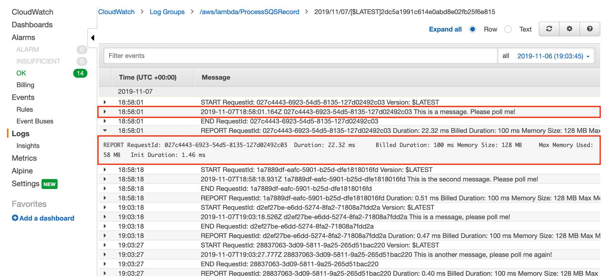
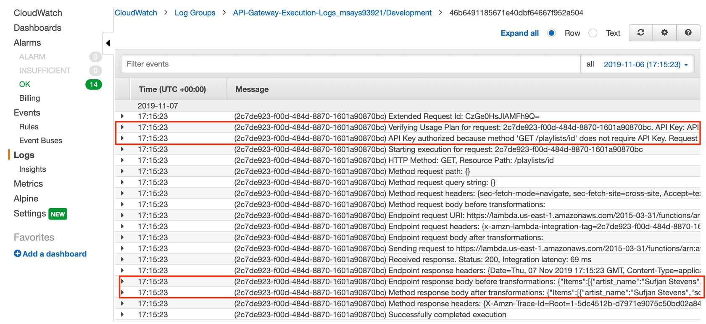
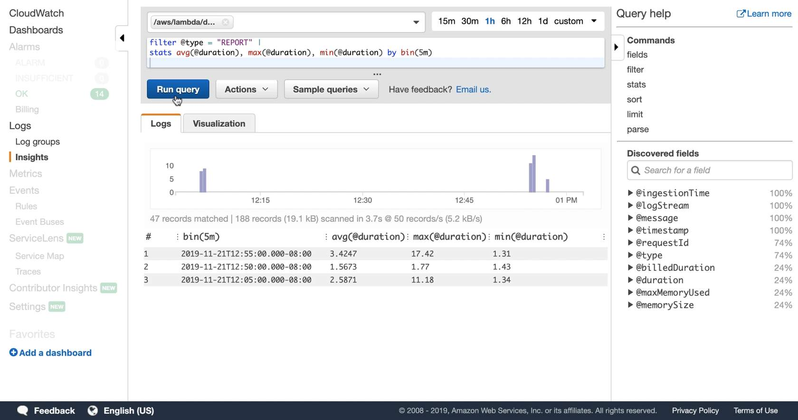

 [General Content AWS Cloud][1]

[1]: https://github.com/weder96/aws-certification-learning

# Module 20: Management and Governance

## Content
1.  <a href="#section-1"> AWS Auto Scaling </a>
2.  <a href="#section-2"> AWS CloudFormation </a>
3.  <a href="#section-3"> AWS CloudTrail </a>
4.  <a href="#section-4"> Amazon CloudWatch </a>
5.  <a href="#section-5"> AWS Command Line Interface (AWS CLI) </a>
6.  <a href="#section-6"> AWS Compute Optimizer </a>
7.  <a href="#section-7"> AWS Config </a>
8.  <a href="#section-8"> AWS Control Tower </a>
9.  <a href="#section-9"> AWS License Manager </a>
10. <a href="#section-10"> Amazon Managed Grafana </a>
11. <a href="#section-11"> Amazon Managed Service for Prometheus </a>
12. <a href="#section-12"> AWS Management Console </a>
13. <a href="#section-13"> AWS Organizations </a>
14. <a href="#section-14"> AWS Personal Health Dashboard </a>
15. <a href="#section-15"> AWS Proton </a>
16. <a href="#section-16"> AWS Service Catalog </a>
17. <a href="#section-17"> AWS Systems Manager </a>
18. <a href="#section-18"> AWS Trusted Advisor </a>
19. <a href="#section-19"> AWS Well-Architected Tool </a>
20. <a href="#section-20"> AWS Launch Wizard </a>

***************************************************************************************************
##   **01 - AWS Auto Scaling**

**References:**

[https://github.com/weder96/aws-certification-learning/tree/main/module-10](https://github.com/weder96/aws-certification-learning/tree/main/module-10)

***************************************************************************************************
##   **02 - AWS CloudFormation**

### **Definitions**

**AWS CloudFormation** is a service that allows you to model and set up your entire AWS infrastructure using declarative code, known as **Infrastructure as Code (IaC)**. With CloudFormation, you define your desired AWS resources (e.g., EC2 instances, S3 buckets, security groups, and more) in a template file, which is then used by CloudFormation to automatically create, update, and manage those resources in the correct order.

### What is a Stack?

- A **stack** is the simplest form of organizing your CloudFormation resources. It's essentially the set of AWS resources that are created and managed by a single CloudFormation template. Once a stack is created, you can manage the entire infrastructure as a single entity.
- **Stack Creation**: When you create a stack, CloudFormation provisions all the resources specified in the template (e.g., EC2 instances, S3 buckets, security groups).
- **Stack Updates**: When changes are made to the CloudFormation template (like adding a new EC2 instance or modifying a security group), you can update the stack to apply those changes automatically, and CloudFormation handles the dependency management.
- **Stack Deletion**: When you delete a stack, all the resources within that stack are automatically deleted, helping you manage the lifecycle of your infrastructure.

> StackSets allow you to create, update, or delete CloudFormation stacks across multiple AWS accounts and regions with a single CloudFormation template.

### Key Features of CloudFormation

1. **Declarative Infrastructure as Code**:
   - CloudFormation enables you to declare the infrastructure you need using templates in **JSON** or **YAML** format. You simply specify the desired state of your infrastructure, and CloudFormation will take care of the execution.
   - For example, in a template, you can specify that:
     - You want a **security group**.
     - You want **two EC2 instances** that use this security group.
     - You want an **S3 bucket**.
     - You want a **load balancer (ELB)** in front of these EC2 instances.
   - CloudFormation ensures that these resources are created in the right order and with the exact configurations you define.

2. **No Manual Resource Creation**:
   - CloudFormation eliminates the need to manually create and configure resources, reducing the potential for human errors and increasing infrastructure control.
   - Resources within the template are automatically created, updated, or deleted according to the changes made to the template.

3. **Cost Management**:
   - CloudFormation allows you to easily manage costs by tagging resources within a stack. You can easily track the costs of individual stacks and determine how much each resource is contributing to the total cost.
   - You can also **estimate the cost** of your resources directly from the CloudFormation template before provisioning them, helping you make informed decisions regarding infrastructure costs.

4. **Productivity and Automation**:
   - CloudFormation improves productivity by allowing you to create and destroy infrastructure quickly. The ability to destroy and recreate your infrastructure on the fly is crucial for development, testing, and troubleshooting environments.
   - You can automate tasks such as deleting and recreating environments at specific times (e.g., automatically deleting templates in the evening and recreating them in the morning), which can help optimize costs and resource management in dev environments.

5. **Declarative Programming**:
   - CloudFormation simplifies the orchestration of complex infrastructure setups by automating resource ordering and dependencies. Unlike imperative programming, where you must define step-by-step processes, CloudFormation declaratively allows you to define the desired outcome without specifying how to achieve it.
   - CloudFormation automatically handles dependencies between resources and ensures they are created or updated in the correct order.

6. **Templates and Reusability**:
   - You don’t have to reinvent the wheel. CloudFormation enables you to use existing templates available from the AWS documentation, community, or other sources.
   - These templates can be customized or extended to fit specific needs, saving time and effort in architecture creation.

7. **Support for AWS Resources**:
   - CloudFormation supports **almost all AWS resources**, and you can create templates for resources like EC2, S3, VPC, Lambda, RDS, and more.
   - For resources that are not supported by default, you can use **custom resources**, which allow you to extend CloudFormation to manage other resources or external services not natively supported.

8. **Mappings in CloudFormation**:
   - **Mappings** are key-value pairs used to define environment-specific configurations.
   - This allows you to adapt a single template to multiple environments (such as **dev**, **staging**, or **prod**) without needing separate templates for each. For instance, an EMR cluster’s configuration could vary based on the environment, and you can use mappings to dynamically set those configurations within the same template.

**Cheat Sheets**

**References:**

**Videos**

***************************************************************************************************
##   **03 - AWS CloudTrail**

### **Definitions**

AWS CloudTrail is an auditing service that monitors API activity in your account. Whenever you perform any operation in the account this results in an API action and this information is recorded to create an audit trail.

Amazon CloudWatch is a performance monitoring service. AWS services send metrics about their utilization to CloudWatch which collects the metrics. Additionally, CloudWatch collects metrics about account activity such as billing information which can also be viewed.

Which AWS services can a company use to gather information about activity in their AWS account.

AWS CloudTrail is a service that enables governance, compliance, operational auditing, and risk auditing for your AWS account. It allows you to track user activity and API usage across your AWS infrastructure. CloudTrail logs account activity, including API calls and actions taken through the AWS Management Console, SDKs, CLI, and other AWS services.

CloudTrail provides a comprehensive history of AWS account activity, enabling you to log, monitor, and retain event data for auditing and security purposes. You can track operations across a wide range of AWS services, providing transparency and accountability for all actions taken within your account.

### CloudTrail Event Types

- **Management Events**: These are operations that are performed on resources in your AWS account, such as creating, modifying, or deleting resources. Examples include:
  - Configuring security (e.g., `IAMAttachRolePolicy`)
  - Configuring rules for routing data (e.g., `Amazon EC2CreateSubnet`)
  - Setting up logging (e.g., `AWS CloudTrailCreateTrail`)

  Management events are enabled by default in CloudTrail, and they can be further categorized into:
  - **Read Events**: Operations that don’t modify resources, such as listing resources or viewing configurations.
  - **Write Events**: Operations that modify resources, such as creating, deleting, or modifying resources.

- **Data Events**: These provide insights into resource-level activity, such as S3 object uploads or Lambda function invocations. Data events are not logged by default due to their high volume but can be enabled for supported resources. For example:
  - Amazon S3 object-level activity (e.g., `GetObject`, `DeleteObject`, `PutObject`)
  - AWS Lambda function execution (e.g., the `Invoke` API call)

### CloudTrail Insights

CloudTrail Insights provides a powerful feature for detecting unusual activity in your AWS account. Insights continuously analyzes CloudTrail management events to establish a baseline of normal activity and then flags any deviations from this baseline, such as:

- Inaccurate resource provisioning
- Hitting service limits
- Unusual bursts of IAM actions
- Gaps in periodic maintenance activity

When CloudTrail detects unusual patterns, it generates **Insights Events** and sends them to your designated Amazon S3 bucket. Additionally, an **EventBridge event** can be generated to automate remediation actions. Insights helps in real-time anomaly detection and alerting.

### AWS CloudTrail Lake

AWS CloudTrail Lake is a managed data lake designed to centralize the collection, storage, and analysis of CloudTrail event data. It provides an optimized and centralized solution for storing and analyzing CloudTrail logs, enabling the retention of logs for up to seven years, which supports long-term data analysis and compliance requirements.

Key features of CloudTrail Lake:

- **Integrated Storage and Querying**: CloudTrail Lake integrates the collection, storage, preparation, and optimization of event data for analysis and query. The data is converted to the **ORC format** for efficient querying.
- **SQL-Based Query Interface**: CloudTrail Lake provides an SQL-based interface for querying your logs, which is particularly useful for auditing, security investigations, and operational troubleshooting.
- **Event Retention**: Logs are retained for up to **seven years**, providing a long-term record of account activity.
- **Data Querying**: CloudTrail Lake allows users to create custom SQL queries or use sample queries to get started. Queries can be constrained by the `eventTime` parameter to help control costs.
- **Event Channels**: You can create channels to integrate CloudTrail events with external services and systems, including built-in integrations with partners like **Okta**, **LaunchDarkly**, and **Clumio**.

### CloudTrail Logging and Integration with Other AWS Services

CloudTrail supports integration with both **Amazon S3** and **Amazon CloudWatch Logs** for storing and processing log data. The integration with **CloudWatch Logs** enables the monitoring of security threats and provides a framework for setting alarms and analyzing CloudTrail logs through tools like **Logs Insights**, **Contributor Insights**, and **CloudWatch Alarms**.

You can create a **multi-region trail** in your AWS account, ensuring that logs are captured from all AWS regions and stored in a centralized S3 bucket for security and compliance purposes. Additionally, CloudTrail supports **organization trails**, allowing you to create a trail that applies to all AWS accounts in an organization.

### Best Practices for CloudTrail Logging and Analysis

- Enable **CloudTrail logging** for all regions to ensure comprehensive monitoring of all activities across your AWS resources.
- Consider using **CloudTrail Insights** to detect and respond to unusual activity patterns, especially those associated with write API calls.
- Direct CloudTrail logs to Amazon S3 and CloudWatch Logs to facilitate long-term storage, monitoring, and analysis.
- Regularly review CloudTrail logs to ensure that any resource deletions or changes are tracked and properly audited.
- Use **CloudTrail Lake** for optimized, SQL-based querying of logs and centralized event management across your AWS environment.

**Cheat Sheets**

https://digitalcloud.training/aws-monitoring-and-logging-services/

**References:**

https://aws.amazon.com/cloudwatch/

https://aws.amazon.com/cloudtrail/

**Videos**

***************************************************************************************************
##   **04 - Amazon CloudWatch**

Amazon CloudWatch is a performance monitoring service. AWS services send metrics about their utilization to CloudWatch which collects the metrics. You can then view the results in CloudWatch and configure alarms.

Amazon CloudWatch is a monitoring service for AWS cloud resources and the applications you run on AWS.

CloudWatch is for performance monitoring (CloudTrail is for auditing).

Used to collect and track metrics, collect, and monitor log files, and set alarms.

Automatically react to changes in your AWS resources.

Monitor resources such as:

- EC2 instances.
- DynamoDB tables.
- RDS DB instances.
- Custom metrics generated by applications and services.
- Any log files generated by your applications.

Gain system-wide visibility into resource utilization.

CloudWatch monitoring includes application performance.

Monitor operational health.

CloudWatch is accessed via API, command-line interface, AWS SDKs, and the AWS Management Console.

CloudWatch integrates with IAM.

Amazon CloudWatch Logs lets you monitor and troubleshoot your systems and applications using your existing system, application, and custom log files.

CloudWatch Logs can be used for real time application and system monitoring as well as long term log retention.

CloudWatch Logs keeps logs indefinitely by default.

CloudTrail logs can be sent to CloudWatch Logs for real-time monitoring.

CloudWatch Logs metric filters can evaluate CloudTrail logs for specific terms, phrases, or values.

CloudWatch retains metric data as follows:

- Data points with a period of less than 60 seconds are available for 3 hours. These data points are high-resolution custom metrics.
- Data points with a period of 60 seconds (1 minute) are available for 15 days.
- Data points with a period of 300 seconds (5 minute) are available for 63 days.
- Data points with a period of 3600 seconds (1 hour) are available for 455 days (15 months).

Dashboards allow you to create, customize, interact with, and save graphs of AWS resources and custom metrics.

Alarms can be used to monitor any Amazon CloudWatch metric in your account.

Events are a stream of system events describing changes in your AWS resources.

Logs help you to aggregate, monitor and store logs.

Basic monitoring = 5 mins (free for EC2 Instances, EBS volumes, ELBs and RDS DBs).

Detailed monitoring = 1 min (chargeable).

Metrics are provided automatically for several AWS products and services.

There is no standard metric for memory usage on EC2 instances.

A custom metric is any metric you provide to Amazon CloudWatch (e.g. time to load a web page or application performance).

Options for storing logs:

1. CloudWatch Logs.
2. Centralized logging system (e.g. Splunk).
3. Custom script and store on S3.

Do not store logs on non-persistent disks:

Best practice is to store logs in CloudWatch Logs or S3.

CloudWatch Logs subscription can be used across multiple AWS accounts (using cross account access).

Amazon CloudWatch uses Amazon SNS to send email.

### **Monitoring serverless applications**

So, you’ve blocked the doors, secured confidential documents, and password-protected your Wi-Fi with something stronger than PASSWORD1. Now it’s time to put some monitoring and notifications in place for when things get crazy. These next videos highlight the key types of monitoring that you need to put in place to monitor the security and health of your serverless architectures.

**CloudWatch metrics**

Developers primarily use CloudWatch metrics to monitor service health and alarm on error cases. For example, you might set a CloudWatch alarm to notify Amazon Simple Notification Service (Amazon SNS) topic subscribers when a metric is outside of an expected range. From there, you could trigger additional automated actions. 

Review the built-in CloudWatch metrics and their dimensions for each of the services you plan to use, so that you can decide how to best leverage them before adding custom metrics. There are also many third-party tools that provide monitoring and metrics reporting from CloudWatch data.

**CloudWatch Logs and Logs Insights**

Logs let you dig into specific issues, but you can also use log data to create business-level metrics via CloudWatch Logs metric filters. It’s important to evaluate which logs and what level of logging you need for test, verses production, environments, and which you need continually verses only when debugging an issue.

There is a cost to logging everything that happens, but you need to weigh that against the business impact of not logging something that will help solve an issue. For example, your logs might show that you have unauthorized access, but you don’t have enough details to do much about it.

At a minimum, you want to know who made the call and when the call was made. Log basic context like the user or what has changed, and log request IDs in your clients. Lambda logs all requests handled by your function and stores them in CloudWatch Logs. This gives you access to information about each invocation of your Lambda function. You can log almost anything to CloudWatch Logs by using "Print" or "Standard out" statements in your functions. When you create custom logs, use a structured format like a JSON event to make it easier to report from them.

API Gateway execution logs include information on errors as well as execution traces.

Things like parameter values, payload, Lambda authorizers used, and API keys appear in the execution logs. You can log just errors or errors and info. Logging is set up per API stage. Now, these logs are detailed, so you want to be thoughtful about what you need. Also, log groups don’t expire by default, so make sure to set retention values suitable to your workload.

You can also create custom access logs and send them to your preferred CloudWatch Group to track who is accessing, and how they are accessing, your APIs. You can specify the access details by selecting context variables and choose the format you want to use. You can interact with logs via CloudWatch Logs to drill into any specific log entry, or filter them based on a pattern to create your own metrics. 

CloudWatch Logs Insights lets you use prebuilt or custom queries on your logs to provide aggregated views and reporting, for example, latency statistics for 5-minute intervals, or statistics on average memory usage of a function to help you fine-tune performance.

If you’ve created structured custom logs, CloudWatch Logs Insights can automatically discover the fields in your logs to make it easy to query and group your log data.

### **Definitions - CloudWatch metrics**

**Business metrics**

Business KPIs measure your application performance against business goals. It is extremely important to know when something is critically affecting your overall business (revenue wise or not).

Examples: Orders placed, debit and credit card operations, flights purchased

**Customer experience metrics**

Customer experience data indicates the overall effectiveness of the user interface/user experience (UI/UX). However, it also indicates whether changes or anomalies are affecting the customer experience in a particular section of your application. These metrics are often measured in percentiles, to prevent outliers, when trying to understand the impact over time and how widespread it is across your customer base.

Examples: 
- Perceived latency
- Time it takes to add an item to a basket or checkout
- Page load times

**System metrics**

Vendor and application metrics are important to underpin root causes. System metrics also tell you if your systems are healthy, at risk, or already affecting your customers.

Examples: 
- Percentage of HTTP errors/success
- Memory utilization
- Function duration/error/throttling
- Queue length
- Stream records length
- Integration latency

**Operational metrics**

Ops metrics are important to understand sustainability and maintenance of a given system and crucial to pinpoint how stability has progressed or degraded over time.

Examples: 
- Number of tickets, such as successful and unsuccessful resolutions
- Number of times people on-call were paged
- Availability
- Continuous integration/continuous delivery (CI/CD) pipeline statistics, such as successful or failed deployments, feedback time, cycle and lead time

**Review these built-in CloudWatch metrics and their dimensions** for each of the services that you plan to use so that you can decide how to best leverage them, as opposed to adding custom metrics. Many third-party tools are also available that provide monitoring and metrics reporting from CloudWatch data.

[Amazon API Gateway dimensions and metrics](https://docs.aws.amazon.com/apigateway/latest/developerguide/api-gateway-metrics-and-dimensions.html)
[Working with Lambda function metrics](https://docs.aws.amazon.com/lambda/latest/dg/monitoring-functions-metrics.html)
[Available CloudWatch metrics for Amazon SQS](https://docs.aws.amazon.com/AWSSimpleQueueService/latest/SQSDeveloperGuide/sqs-available-cloudwatch-metrics.html)
[Monitoring Step Functions Using CloudWatch](https://docs.aws.amazon.com/step-functions/latest/dg/procedure-cw-metrics.html)
[Monitoring Amazon SNS topics using CloudWatch](https://docs.aws.amazon.com/sns/latest/dg/sns-monitoring-using-cloudwatch.html)
[Monitoring the Amazon Kinesis Data Streams Service with Amazon CloudWatch](https://docs.aws.amazon.com/streams/latest/dev/monitoring-with-cloudwatch.html)

### **CloudWatch Logs**

Using logs helps you dig into specific issues, but you can also use log data to create business-level metrics using Amazon CloudWatch Logs metric filters. You can interact with logs using CloudWatch Logs to drill into any specific log entry or filter them based on a pattern to create your own metrics. See how the following services interact with CloudWatch Logs.

**Lambda logs**
Lambda automatically logs all requests handled by your function and stores them in CloudWatch Logs. This gives you access to information about each invocation of your Lambda function.

You can log almost anything to CloudWatch Logs by using print or standard out statements in your functions. When you create custom logs, use a structured format, such as a JavaScript Object Notation (JSON) event to make it easier to report from them.

### **API Gateway execution and access logs**

API Gateway execution logs include information on errors and execution traces. Information such as parameter values, payload, Lambda authorizers used, and API keys appears in the logs. You can log just errors or errors and information. Logging is set up per API stage. These logs are detailed, so you want to be thoughtful about what you need. Also, log groups don’t expire by default, so make sure to set retention values suitable to your workload.

You can also create custom access logs and send them to your preferred CloudWatch group to track who is accessing your APIs and how. You can specify the access details by selecting context variables and choosing the format that you want to use.

### **CloudWatch EMF**
Traditionally, it can be difficult to generate actionable, custom metrics from your ephemeral resources, such as Lambda functions and containers. You can use the embedded metric format (EMF) to instruct CloudWatch Logs to automatically extract metric values that are embedded in structured log events.

By sending your logs in EMF, CloudWatch will automatically extract the custom metrics, so you can visualize them and create alarms, without having to create or maintain separate code.

These detailed log events associated with the extracted metrics can be queried using CloudWatch Logs Insights to provide insights into the root causes of operational events.  

### **CloudWatch Logs Insights**

With CloudWatch Log Insights, you can use prebuilt or custom queries on your logs to provide aggregated views and reporting. If you’ve created structured custom logs, CloudWatch Logs Insights can automatically discover the fields in your logs to help you to query and group your log data. To learn more, choose each the numbered marker:

### Amazon CloudWatch Metrics

CloudWatch provides a variety of metrics for monitoring AWS services, including EC2, ECS, and others. These metrics allow you to track the performance of individual resources and services in real-time.

### EC2 Instance Metrics

Some standard EC2 metrics include:

- **CPU Utilization**: Indicates the processing power required to run an application on an EC2 instance.
- **Network Utilization**: Measures the incoming and outgoing network traffic to a specific instance.
- **Disk Read and Write Metrics**: Tracks the amount of data read from and written to the instance's disk, which can provide insights into application performance.

### Custom Metrics

While CloudWatch provides a wide range of default metrics, certain system-level metrics like **memory utilization** and **disk space utilization** are not available out-of-the-box. You can create **custom metrics** to track these values by using CloudWatch Monitoring Scripts or installing the **CloudWatch Agent**.

### Metric Visualization

You can create CloudWatch Dashboards to visualize your metrics in real-time, allowing you to track performance and operational health across your AWS infrastructure. Dashboards provide a centralized view of all your metrics and alarms in one place.

### CloudWatch Alarms

CloudWatch Alarms are used to monitor AWS resources by setting conditions on various metrics. Once an alarm condition is met, it can trigger predefined actions to help automate management tasks. Some common actions include:

- **Stopping** or **terminating** EC2 instances to save costs when they're no longer needed.
- **Rebooting** EC2 instances to resolve certain system impairments.
- **Recovering** EC2 instances onto new hardware in the event of system health failures.

### Reboot and Recover Actions

The **reboot alarm action** is particularly useful for EC2 instance health check failures. This action is typically favored over the **recover alarm action**, which is better suited for system health check failures. For EC2 instance rebooting, using CloudWatch's native **Reboot Alarm Action** is recommended over using AWS Lambda or EventBridge triggers, which could be less efficient in terms of resource usage.

### Alarm States

CloudWatch alarms monitor resources through various states:

- **OK**: The monitored metric is within the defined threshold.
- **INSUFFICIENT_DATA**: There isn't enough data to evaluate the metric.
- **ALARM**: The metric is outside the defined threshold.

### Alarm Configuration

CloudWatch alarms can be configured based on metrics and include several options for evaluation:

- **Period**: The length of time (in seconds) to evaluate the metric.
- **Sampling options**: This can include evaluating the metric at different granularities (e.g., max, min, %, etc.).
- **High-Resolution Metrics**: CloudWatch allows custom metrics with resolutions as low as 10 seconds or multiples of 60 seconds.

### CloudWatch Composite Alarms

CloudWatch composite alarms allow you to monitor the state of multiple alarms together, combining them with **AND** or **OR** conditions. This helps reduce alarm noise, making it easier to monitor critical issues without being overwhelmed by minor fluctuations.

Composite alarms are especially useful when you need to track more complex situations. For example, you may want to trigger an alarm only if two different services are both showing problems, or if the system is experiencing issues but only in certain regions.

### CloudWatch Logs

### CloudWatch Logs Sources

CloudWatch Logs can be sourced from various AWS services and external systems:

- **EC2 Instances**: Logs from applications running on EC2.
- **AWS Lambda**: Function logs.
- **Elastic Beanstalk**: Collect logs from your application’s environment.
- **ECS Containers**: Capture logs from containers.
- **VPC Flow Logs**: Collect logs related to your VPC's network traffic.
- **CloudTrail**: Log API calls to AWS resources.
- **Route 53**: Log DNS queries.

### CloudWatch Logs Agent and Unified Agent

To enable log collection, you must install and configure the CloudWatch Logs Agent on your EC2 instances or on-premises servers. By default, EC2 instances do not send logs to CloudWatch unless configured.

- The **CloudWatch Logs Agent** can send logs to CloudWatch Logs but does not collect system metrics.
- The **CloudWatch Unified Agent** collects both logs and system-level metrics, such as CPU, memory, and disk utilization.

### Log Groups and Streams

CloudWatch Logs are organized into **Log Groups** and **Log Streams**:

- **Log Groups**: Represent a logical grouping of log data, often associated with a specific application or service.
- **Log Streams**: Contain individual logs, such as logs from specific EC2 instances, containers, or servers.

### Log Retention and Expiration

You can set retention policies for logs, allowing you to define when logs should expire (ranging from 1 day to 10 years). CloudWatch Logs also supports encryption by default, with the option to use **KMS-based encryption** for added security.

### Log Subscription Filters

CloudWatch Logs allows you to stream log data in real-time to destinations such as:

- **Kinesis Data Streams**
- **Kinesis Data Firehose**
- **AWS Lambda**
- **OpenSearch Service**

This enables you to perform advanced analysis or forward logs to other systems for further processing.

### CloudWatch Logs Insights

CloudWatch Logs Insights provides a powerful query language for analyzing log data stored in CloudWatch Logs. You can perform detailed searches to find specific log events, count occurrences of specific errors, and calculate aggregate statistics.

### Features of Logs Insights

- **Querying Multiple Log Groups**: You can query logs across multiple AWS accounts and log groups.
- **Search Flexibility**: Logs Insights allows you to filter logs, sort events, and aggregate data.
- **Dashboards**: You can save your queries and display the results in custom CloudWatch Dashboards.

### Real-Time vs Historical Data

Note that CloudWatch Logs Insights is designed for **log analysis** and **historical data**. It’s not meant for real-time log processing, which is better suited for solutions like **Kinesis** or **Lambda**.

### Integrating CloudWatch with AWS Services

### CloudTrail and CloudWatch Integration

AWS **CloudTrail** provides a detailed log of all API calls made in your AWS environment, which can be ingested into CloudWatch for monitoring and analysis. By analyzing CloudTrail logs in CloudWatch, you can identify potential security threats, track account activity, and create compliance reports.

CloudTrail log data can be transformed into CloudWatch metrics using **metric filters**, allowing you to create alarms based on specific API calls or events.

**Article**

https://plainenglish.io/blog/json-logs-with-cloudwatch-logs-insights

**Cheat Sheets**

https://digitalcloud.training/aws-monitoring-and-logging-services/

**References:**

https://aws.amazon.com/cloudwatch/features/

**Videos**

***************************************************************************************************
##   **05 - AWS Command Line Interface (AWS CLI)**

")

**Cheat Sheets**

**References:**

**Videos**

***************************************************************************************************
##   **06 - AWS Compute Optimizer**

**Definitions**

AWS Compute Optimizer is a service that analyzes the configuration and utilization metrics of your AWS resources. It reports whether your resources are optimal, and generates optimization recommendations to reduce the cost and improve the performance of your workloads. Compute Optimizer also provides graphs showing recent utilization metric history data, as well as projected utilization for recommendations, which you can use to evaluate which recommendation provides the best price-performance trade-off. The analysis and visualization of your usage patterns can help you decide when to move or resize your running resources, and still meet your performance and capacity requirements.

Compute Optimizer provides a console experience, and a set of APIs that allows you to view the findings of the analysis and recommendations for your resources across multiple AWS Regions. You can also view findings and recommendations across multiple accounts, if you opt in the management account of an organization. The findings from the service are also reported in the consoles of the supported services, such as the Amazon EC2 console.

**Cheat Sheets**

**References:**

https://docs.aws.amazon.com/compute-optimizer/latest/ug/what-is-compute-optimizer.html

https://docs.aws.amazon.com/compute-optimizer/latest/ug/getting-started.html

**Videos**

https://www.youtube.com/results?search_query=AWS+Compute+Optimizer

**Hands On**

https://www.youtube.com/results?search_query=AWS+Compute+Optimizer+hands+on

***************************************************************************************************
##   **07 - AWS Config**

### **Definitions**

AWS Config is a service that enables you to assess, audit, and evaluate the configurations of your AWS resources. With AWS Config, you can track the configuration history of AWS resources and assess their compliance with internal guidelines and best practices. It provides a detailed history of resource configurations and can evaluate whether resources meet compliance standards. AWS Config helps answer questions such as, *What did my AWS resource look like at a specific point in time?* and *How has the configuration of my resources changed over time?*

> While AWS Config focuses on resource-specific history, audit, and compliance, it does not offer direct feedback on architectural best practices, unlike services such as AWS Well-Architected Tool.

### Key Features of AWS Config

- **Resource Configuration History**: AWS Config records the configurations of your AWS resources and tracks how they change over time. You can review the historical configurations and relationships between resources.
- **Compliance Evaluation**: AWS Config helps evaluate whether your AWS resources comply with predefined rules, and it allows you to create custom rules tailored to your compliance standards.
- **Managed Rules**: AWS Config provides over 75 predefined, AWS-managed rules that you can use to assess resource compliance. For example, you can check if ACM certificates are expiring, or if security groups allow unrestricted SSH access.
- **Custom Rules**: You can create custom AWS Config rules, defined in AWS Lambda, to evaluate specific conditions in your environment, such as checking whether EC2 instances are of a specific instance type (e.g., `t2.micro`) or if an EBS disk is of a certain type (e.g., `gp2`).
- **Change Tracking and Notifications**: AWS Config tracks changes to resource configurations and can send alerts (SNS notifications) when a change occurs.
- **Region-specific**: AWS Config is a per-region service, but it supports aggregation across multiple regions and accounts for centralized management.
- **Storage and Analysis**: Configuration data can be stored in Amazon S3, and you can analyze this data using Amazon Athena.

### Config Rules and Remediations

- **Evaluation Triggers**: Config rules can be triggered when a configuration change occurs or on a scheduled interval (e.g., daily, weekly). This allows you to continuously monitor the compliance status of your AWS resources.
- **Remediations**: You can automate remediation actions for non-compliant resources by invoking SSM Automation Documents or Lambda functions. If a resource is non-compliant after an automatic remediation attempt, you can set remediation retries.
- **No Preventative Measures**: AWS Config rules do not prevent actions from being taken on resources (i.e., they don’t "deny" actions); they simply provide insights into compliance status.

### AWS Config Pricing

- **Pricing Model**: AWS Config pricing is based on the number of configuration items recorded per region and the number of rule evaluations per region. The cost is:
  - $0.003 per configuration item recorded per region
  - $0.001 per config rule evaluation per region
- **No Free Tier**: AWS Config does not offer a free tier for its service.

### CloudWatch vs CloudTrail vs AWS Config

| Feature | **AWS CloudWatch** | **AWS CloudTrail** | **AWS Config** |
| --- | --- | --- | --- |
| **Primary Function** | Monitor and log AWS resource performance, including metrics and logs | Track user activity, API usage, and changes in AWS resources | Assess, audit, and track AWS resource configurations and compliance |
| **Focus Area** | Metrics, Logs, Alarms, Dashboards | Event logs for actions on AWS resources | Configuration history, compliance, and audits of resources |
| **Event Logging** | Logs and metrics for AWS resources and applications | Logs of AWS API calls and resource activities | Tracks configuration changes and relationships between resources |
| **Visibility** | Resource performance and operational health | User activities and resource changes (e.g., API calls, sign-ins) | Historical configuration of resources and compliance over time |
| **Data Storage** | Logs and metrics stored in CloudWatch, can be archived in S3 | Logs stored in S3 or CloudWatch Logs | Configuration history stored in S3, can be queried with Athena |
| **Automated Actions** | Alarms, Auto Scaling, automated remediation (via Lambda) | Insights events for anomaly detection, can trigger alarms | Remediation via SSM Automation, Lambda, retries for non-compliant resources |
| **Rule Management** | Can create custom alarms and metric filters | No rules (focused on logging) | Predefined AWS-managed rules and customizable Lambda-based rules for compliance |
| **Default Behavior** | Always on, collects resource data and metrics | Always on, logs all API calls and activities by default | Not always on, must be explicitly configured to track resources |
| **Retention Period** | Configurable based on logs (e.g., 7 days, or archived in S3) | Retention up to 7 years | Retention up to 7 years |
| **Integration with Other Services** | Integrates with Lambda, EC2, SNS, S3, etc. | Integrates with CloudWatch, S3, EventBridge, and security tools | Integrates with Lambda, S3, Athena, and Security Hub |
| **Use Case** | Monitoring, alerting, operational troubleshooting | Auditing, security monitoring, and tracking user activity | Compliance auditing, resource configuration tracking, and historical analysis |

- **AWS CloudWatch** is focused on performance monitoring, logs, and metrics for AWS resources and applications, providing real-time monitoring and alerts.
- **AWS CloudTrail** focuses on tracking user and API activity across AWS resources, offering logs of API calls and management events for auditing and security purposes.
- **AWS Config** is specialized in tracking and auditing the configurations of AWS resources, providing a detailed historical record for compliance and resource relationship analysis.

**Cheat Sheets**

**References:**

**Videos**

***************************************************************************************************
##   **08 - AWS Control Tower**

**Cheat Sheets**

https://tutorialsdojo.com/aws-control-tower/

https://digitalcloud.training/what-is-aws-control-tower/

**References:**

https://aws.amazon.com/controltower/

**Videos**

https://www.youtube.com/watch?v=daLvEb44d5Q

https://www.youtube.com/watch?v=3-aaw-B1j8Y

https://www.youtube.com/watch?v=pyiJbkJROTE

***************************************************************************************************
##   **09 - AWS License Manager**

**Definitions**

- A service for centrally managing software licenses across AWS and on-premises environments.
- It gives you control and visibility into license usage, allowing you to limit licensing overages and reduce the risk of noncompliance and misreporting.
- Supports a variety of licensing models:
    - **Perpetual** – lifetime license with no expiration date.
    - **Floating** – shareable licenses.
    - **Subscription** – license with expiration date.
    - **Usage-based** – license with specific terms based on usage.

### **Pricing**
    - You are charged for AWS resources that you create to run your application.

**Cheat Sheets**

https://tutorialsdojo.com/aws-license-manager/

**References:**

https://aws.amazon.com/license-manager/

https://docs.aws.amazon.com/license-manager/latest/userguide/license-manager.html

**Videos**

https://www.youtube.com/results?search_query=AWS+License+Manager

**Hands On**

https://www.youtube.com/results?search_query=AWS+License+Manager+hands+On

***************************************************************************************************
##  **10 - Amazon Managed Grafana**

### **Definitions**

Amazon Managed Grafana is a fully managed service that provides a powerful platform for visualizing and analyzing metrics and logs from various AWS data sources. Grafana is an open-source tool widely used for monitoring and visualizing time-series data, and Amazon Managed Grafana brings the same capabilities with the added benefits of a fully managed, scalable, and secure service. This service enables you to easily create dashboards, configure alerts, and analyze data from multiple sources, all while simplifying the management overhead.

Build, package, and deploy workspaces that are provisioned, set up, scaled, and maintained for you.
Visualize, analyze, and correlate operational data across multiple sources, and query across multiple AWS accounts and Regions.
Integrate with AWS security services to meet your corporate security and compliance requirements.
Migrate from your self-managed Grafana environment, so there’s no need to start from scratch.

- **How it works**

Amazon Managed Grafana is a fully managed service for Grafana, a popular open-source analytics platform that enables you to query, visualize, and alert on  your metrics, logs, and traces.

###  Key Features of Amazon Managed Grafana

- **Open-Source Grafana Integration**: Amazon Managed Grafana uses the popular Grafana platform, an open-source tool that allows for customizable dashboards and advanced data visualization capabilities. It supports a wide range of data sources, helping teams to create unified views of their application, infrastructure, and service metrics.

- **User Management**: Integrated with IAM Identity Center (formerly AWS SSO) and/or SAML for user authentication, making it easier to manage access permissions across users and teams. This integration helps ensure secure and centralized user management for AWS environments.

- **Scalability**: Amazon Managed Grafana is fully managed and automatically scales to accommodate your needs, whether you're monitoring a few systems or handling data from a large, complex infrastructure.

- **Security**: The service is encrypted both in transit and at rest, ensuring that all your monitoring data remains secure. You can also integrate AWS Key Management Service (KMS) for managing encryption keys, providing enhanced control over data security.

- **AWS Data Source Integration**: The service seamlessly integrates with various AWS services, allowing you to pull data directly from popular sources such as:
  - **CloudWatch**: For monitoring AWS resources and applications.
  - **OpenSearch**: For visualizing logs and search data.
  - **Timestream**: For time-series data, ideal for IoT and operational applications.
  - **Athena**: For querying S3 data using SQL.
  - **Redshift**: For analyzing large datasets stored in Amazon Redshift.
  - **X-Ray**: For distributed tracing of applications and microservices.

- **Amazon Managed Service for Prometheus (AMP)**: Grafana integrates directly with AMP for visualizing Prometheus metrics, making it easier to monitor containerized applications, especially in Kubernetes environments.

- **Extensive External Integrations**: Beyond AWS-native data sources, Amazon Managed Grafana supports integration with a wide variety of external data sources such as:
  - **GitHub**, **Google**, **Azure**: For cloud-native monitoring.
  - **MySQL**, **Redis**, **JSON**: For databases and application-specific metrics.
  - **OpenTelemetry**: For collecting and visualizing traces and metrics from microservices.

- **Alerts and Notifications**: Amazon Managed Grafana supports alerts based on your custom queries, helping to keep teams informed about issues as they occur. It integrates with various notification channels, including Amazon SNS, email, and other alerting systems.

###  Use Cases

- **Infrastructure Monitoring**: Monitor the health and performance of your AWS resources and applications by visualizing metrics and logs.
- **Security Monitoring**: Combine data from AWS CloudTrail, GuardDuty, and other services to monitor security events in real time.
- **Application Monitoring**: Visualize data from Amazon X-Ray and other monitoring tools to ensure application performance and detect anomalies.
- **Log Analysis**: Use Grafana dashboards to analyze logs from Amazon OpenSearch and CloudWatch Logs, enabling real-time log monitoring and troubleshooting.

### Pricing

The pricing for Amazon Managed Grafana is based on the number of active users, the amount of data ingested, and the number of dashboards created. Pricing can vary based on factors such as:

- The number of data sources integrated.
- The scale of the AWS environment being monitored.
- The volume of metrics and logs ingested for visualization and alerting.

**Cheat Sheets**

**References:**

https://aws.amazon.com/grafana/?nc1=h_ls

https://aws.amazon.com/grafana/features/?nc=sn&loc=2

https://aws.amazon.com/grafana/pricing/?nc=sn&loc=3

https://aws.amazon.com/grafana/resources/?nc=sn&loc=4&msg-blogs.sort-by=item.additionalFields.createdDate&msg-blogs.sort-order=desc

https://aws.amazon.com/grafana/faqs/?nc=sn&loc=5

**Videos**

https://www.youtube.com/results?search_query=Amazon+Managed+Grafana

***Hands On**

https://www.youtube.com/results?search_query=Amazon+Managed+Grafana+hands+on

***************************************************************************************************
##  **11 - Amazon Managed Service for Prometheus**

**Definitions**

Use Prometheus query language (PromQL) to filter, aggregate, ingest, and query millions of unique time series metrics from your self-managed Kubernetes clusters.

Automatically scale as your ingestion and query needs grow, and maintain consistent response times for large container deployments.

Integrate with AWS security services to meet your corporate security and compliance requirements.

Reduce the operational costs of configuring, upgrading, and scaling standalone Prometheus servers.

**How it works**

Amazon Managed Service for Prometheus is a Prometheus-compatible service that monitors and provides alerts on containerized applications and infrastructure at scale. The service is integrated with Amazon Elastic Kubernetes Service (EKS), Amazon Elastic Container Service (ECS), and AWS Distro for OpenTelemetry.

**Cheat Sheets**

**References:**

https://aws.amazon.com/prometheus/

https://aws.amazon.com/prometheus/features/

https://aws.amazon.com/prometheus/pricing/

https://aws.amazon.com/prometheus/resources/?msg-blogs.sort-by=item.additionalFields.createdDate&msg-blogs.sort-order=desc

https://aws.amazon.com/prometheus/videos/

https://aws.amazon.com/prometheus/faqs/

**Videos**

https://www.youtube.com/watch?v=fW2LOqHDUNM

***Hand On**

***************************************************************************************************
##  **12 - AWS Management Console**

**Definitions**

Console Overview

Discover and experiment with over 150 AWS services, many of which you can try for free.
Build your cloud-based applications in any AWS data center throughout the world.
Manage and monitor users, service usage, health, and monthly billing.
Get in-console help from AWS Support.

**Cheat Sheets**

**References:**

https://aws.amazon.com/console/

**Videos**

***Hand On**

***************************************************************************************************
##  **13 - AWS Organizations**

[Check](https://github.com/weder96/aws-certification-learning/tree/main/module-15#section-18)
***************************************************************************************************
##  **14 - AWS Personal Health Dashboard**

**Definitions**

The AWS Health Dashboard is the single place to learn about the availability and operations of AWS services. You can view the overall status of AWS services, and you can sign in to view personalized communications about your particular AWS account or organization. Your account view provides deeper visibility into resource issues, upcoming changes, and important notifications.

### Benefits

**Personalized view of service health**

When you sign in to the AWS Health Dashboard, you have a personalized view of the AWS service status that powers your application. Use the AWS Health Dashboard to learn about specific operational issues that affect your account. For example, if you receive an event for a lost Amazon Elastic Block Store (EBS) volume associated with one of your Amazon EC2 instances, you can quickly view how your resources are impacted, helping you to troubleshoot and remediate.

**Proactive notifications**

In addition to enabling emails to receive important Health events, you can configure AWS Health Aware to receive information in your Slack channel or operational tooling. For example, if a maintenance event is scheduled for one of your Amazon EC2 instances, you can receive an alert with information in your preferred communication channel so you can actively address any issues for the upcoming change.

**Detailed troubleshooting guidance**

When you get a Health event, it includes remediation details and specific guidance so that you can take action for events that affect your resources. For example, if a hardware issue affects one of your Amazon Elastic Block Store (EBS) volumes, the alert includes a list of affected resources, and recommendations and help links to restore your volume from a snapshot. This helps you reduce the amount of time to resolve issues.

**Integration and automation**

You can use Amazon EventBridge to build custom rules and select targets, such as AWS Lambda functions, to define automated remediation actions for specific events. You can use the AWS Health API, the service that powers AWS Health Dashboard, to integrate health data and notifications with your existing in-house or third-party IT management tools. The AWS Health API is part of an AWS Business Support or AWS Enterprise Support plan.

**Fine-grained access control by using IAM**

The AWS Health Dashboard supports access control so you can set up permissions based on event metadata. This enables you to grant or deny access to an AWS Identity and Access Management (IAM) user based on attributes, such as event types, specific services, or other role-based attributes. You can restrict access of sensitive events, such as security events, to only the users that need to see them.

**Aggregate health events across AWS Organizations**

If you use AWS Organizations, you can use AWS Health to aggregate notifications from all accounts in your organization. This provides you a centralized and real-time view for all AWS Health events posted to individual accounts in your organization, including operational issues, scheduled maintenance, and account notifications. 

**Cheat Sheets**

**References:**

https://aws.amazon.com/premiumsupport/technology/aws-health-dashboard/

https://aws.amazon.com/premiumsupport/pricing/?nc=sn&loc=3

https://aws.amazon.com/premiumsupport/resources/?nc=sn&loc=4

**Videos**

https://www.youtube.com/results?search_query=AWS+Health+Dashboard

**Hands On**

https://www.youtube.com/results?search_query=AWS+Health+Dashboard+hands+on

***************************************************************************************************
##  **15 - AWS Proton**

**Definitions**

Increase your impact with self-service infrastructure templates and provisioning automation.

Amplify platform engineering impact by implementing scalable self-service capabilities for developers.

Empower developers to move faster with a self-service tool to provision infrastructure and manage code deployment.

Accelerate adoption of DevOps best practices within your team.

How it works

AWS Proton is a deployment workflow tool for modern applications that helps platform and DevOps engineers achieve organizational agility.

**Cheat Sheets**

**References:**

https://aws.amazon.com/proton/

https://aws.amazon.com/proton/features/

https://aws.amazon.com/proton/pricing/

https://aws.amazon.com/proton/getting-started/

https://aws.amazon.com/proton/faqs/

**Videos**

https://www.youtube.com/results?search_query=AWS+Proton

**Hands On**

https://www.youtube.com/results?search_query=AWS+Proton+hands+on

***************************************************************************************************
##  **16 - AWS Service Catalog**

**Definitions**

Create, share, organize, and govern your curated IaC templates

1,000 free API calls per month

with the AWS Free Tier

Quickly find and deploy approved, self-service cloud resources.

Stay agile while improving governance over resources across multiple accounts.

Streamline workflows by connecting to ServiceNow and Jira Service Management.

Get up-to-date, accurate application definitions and metadata with AWS Service Catalog AppRegistry.

**How it works**

AWS Service Catalog lets you centrally manage deployed IT services, applications, resources, and metadata to achieve consistent governance of your infrastructure as code (IaC) templates. With AWS Service Catalog, you can meet your compliance requirements while making sure your customers can quickly deploy the approved IT services they need.

**Cheat Sheets**

**References:**

https://aws.amazon.com/servicecatalog/?nc1=h_ls

https://aws.amazon.com/servicecatalog/features/

https://aws.amazon.com/servicecatalog/pricing/

https://aws.amazon.com/servicecatalog/getting-started/

https://aws.amazon.com/servicecatalog/resources/?service-catalog-blogs.sort-by=item.additionalFields.createdDate&service-catalog-blogs.sort-order=desc

https://aws.amazon.com/servicecatalog/faqs/

**Videos**

https://www.youtube.com/results?search_query=AWS+Service+Catalog

**Hands On**

https://www.youtube.com/results?search_query=AWS+Service+Catalog+hands+on

***************************************************************************************************
##  **17 - AWS Systems Manager**

### **Definitions**

**AWS Systems Manager** is a comprehensive suite of services that simplifies the management of your AWS resources and applications. It helps automate common tasks like patch management, resource management, and operational troubleshooting. With AWS Systems Manager, you can monitor, maintain, and secure your infrastructure in a streamlined way.

One of the most important features of AWS Systems Manager is **Parameter Store**, which is a secure and scalable storage solution for managing configuration data, secrets, and application parameters. Parameter Store is widely used for storing sensitive data such as database credentials, API keys, and other configurations that need to be managed securely.

Allows you to centralize operational data from multiple AWS services and automate tasks across your AWS resources.

### **Features**

- Create logical groups of resources such as applications, different layers of an application stack, or production versus development environments.

- You can select a resource group and view its recent API activity, resource configuration changes, related notifications, operational alerts, software inventory, and patch compliance status.

- Collects information about your instances and the software installed on them.
Allows you to safely automate common and repetitive IT operations and management tasks across AWS resources.

- Provides a browser-based interactive shell and CLI for managing Windows and Linux EC2 instances, without the need to open inbound ports, manage SSH keys, or use bastion hosts. Administrators can grant and revoke access to instances through a central location by using IAM policies.

- Helps ensure that your software is up-to-date and meets your compliance policies.
- Lets you schedule windows of time to run administrative and maintenance tasks across your instances.

**SSM Agent** is the tool that processes Systems Manager requests and configures your machine as specified in the request. SSM Agent must be installed on each instance you want to use with Systems Manager. On newer AMIs and instance types, SSM Agent is installed by default. On older versions, you must install it manually.

### **Security**
- Systems Managers is linked directly to IAM for access controls.

### **Pricing**

- For your own packages, you pay only for what you use. Upon transferring a package into Distributor, you will be charged based on the size and duration of storage for that package, the number of Get and Describe API calls made, and the amount of out-of-Region and on-premises data transfer out of Distributor for those packages.
- You are charged based on the following:
    - Number and type of Automation steps.
    - Number of OpsItems, change requests, and API requests.
    - OpsItems created and runbook steps executed.
    - Number of configuration requests and received.
    - Number of advanced parameters stored and instances activated.

### Patch Manager

Patch Manager is a feature of AWS Systems Manager that helps you automate the process of patching and maintaining the security compliance of your EC2 instances. It simplifies patch management across your infrastructure by automatically applying patches to your instances based on predefined schedules or on-demand requests.

### Key Features of Parameter Store

1. **Secure Storage for Configurations and Secrets:**
   - Parameter Store provides a centralized place to store and manage application configurations, secrets, and environment variables securely.
   - Sensitive data such as database credentials, API keys, and passwords can be stored with built-in encryption to ensure data confidentiality.

2. **Encryption with AWS Key Management Service (KMS):**
   - Parameter Store allows you to encrypt sensitive parameters using AWS KMS (Key Management Service). This adds an extra layer of security for your configurations and secrets.
   - You can either use the default AWS KMS key or create and manage your own encryption keys.

3. **Version Tracking:**
   - Parameter Store supports versioning of parameters. This enables you to track changes to your configuration data and retrieve older versions of parameters if necessary.

4. **IAM (Identity and Access Management) Security:**
   - You can control access to the stored parameters using AWS IAM policies. This ensures that only authorized users or services can retrieve or modify the parameters, providing fine-grained control over access.
   - Permissions can be set to restrict who can view or modify specific parameters.

5. **Notifications with Amazon EventBridge:**
   - You can set up notifications for changes to parameters through Amazon EventBridge. This allows you to trigger specific actions or workflows when a parameter is updated or modified.
   - EventBridge integration helps you automate tasks in response to configuration changes, such as triggering Lambda functions or notifying administrators of changes to critical parameters.

6. **Integration with AWS CloudFormation:**
   - Parameter Store integrates with AWS CloudFormation, allowing you to use parameters as inputs for CloudFormation stacks. This enables you to manage parameters as part of your infrastructure as code (IaC) workflows.

### Parameter Policies: Advanced Features

AWS Systems Manager Parameter Store offers **Parameter Policies**, which provide advanced capabilities for managing parameters:

1. **Time-to-Live (TTL) for Parameters:**
   - Parameter policies allow you to set a TTL (expiration date) on parameters, automatically deleting or requiring an update to sensitive data after a specified period.
   - This is particularly useful for scenarios where passwords or API keys should expire after a certain time to improve security and reduce the risk of unauthorized access.

2. **Multiple Policies for Parameters:**
   - You can assign multiple policies to a single parameter. For example, you could set a TTL policy alongside encryption or versioning policies, allowing for more complex control over the lifecycle of your parameters.

3. **Automatic Updates or Deletion:**
   - When the TTL for a parameter expires, the policy can automatically trigger an action, such as deleting the parameter or forcing an update.
   - This helps ensure that sensitive information like credentials is regularly updated or removed from the system as needed, enhancing security practices.

### Common Use Cases for Parameter Store

- **Storing Sensitive Information:** Use Parameter Store to store database passwords, API keys, and other secrets securely. With optional encryption using KMS, you can ensure that sensitive data is protected both at rest and in transit.

- **Configuration Management:** Store configuration data for your applications and retrieve it programmatically, making it easier to manage environment-specific settings (e.g., dev, staging, prod) across different AWS resources.

- **Integration with Automation Services:** Leverage Parameter Store to store input parameters for automated workflows, such as those used in AWS Lambda, AWS CodePipeline, or AWS CloudFormation.

- **Secure Application Settings:** Ensure that only authorized services and users can access specific parameters, leveraging IAM roles and policies to control access. You can also track changes to parameters using versioning and auditing features.

**Cheat Sheets**

https://tutorialsdojo.com/aws-systems-manager/

https://digitalcloud.training/aws-systems-manager/

**References:**

https://docs.aws.amazon.com/systems-manager/latest/userguide

https://aws.amazon.com/systems-manager/features/

https://aws.amazon.com/systems-manager/pricing/

https://aws.amazon.com/systems-manager/faq/

**Videos**

https://youtu.be/nzjTIjFLiow

https://www.youtube.com/results?search_query=AWS+Systems+Manager+

**Hands On**

https://www.youtube.com/results?search_query=AWS+Systems+Manager++Hands+on

***************************************************************************************************
##  **18 - AWS Trusted Advisor**

**Definitions**

- Trusted Advisor analyzes your AWS environment and provides best practice recommendations in five categories:
    - Cost Optimization
    - Performance
    - Security
    - Fault Tolerance
    - Service Limits

- Access to the full set of Trusted Advisor checks is available to Business, Enterprise On-Ramp, and Enterprise Support plans.

### **Concepts**
- The AWS Support API gives you access to some of the AWS Support Center’s features and provides two different groups of operations:
- Support case management – operations to manage your AWS support cases throughout their entire life cycle, from creation to resolution.
- Trusted Advisor – operations to access AWS Trusted Advisor checks.
- The endpoint to access the AWS Support API: https://support.us-east-1.amazonaws.com
- If you have a Business, Enterprise On-Ramp, or Enterprise Support plan, you can access all checks via the AWS Support API and the AWS CLI.
- For the Basic and Developer Support plan, use the Trusted Advisor console to access core security checks and checks for service limits.
- You can use the Trusted Advisor console or the AWS Support API to perform operations on the following Trusted Advisor checks:
- Cost Optimization – identify unused resources and opportunities to lower your bill.
- Performance – improve the speed and responsiveness of your applications.
- Security – recommends settings that can improve the security of your AWS solution.
- Fault Tolerance – highlight redundancy shortfalls, current service limits, and overused resources.
- Service Limits – shows the current usage limit for AWS services and resources.
- The summary checks are displayed on the Trusted Advisor dashboard.
- Action recommended (red) – recommends an action for the check.
- Investigation recommended (yellow) – detects a potential problem with the check.
- No problems detected (green) – no issue identified for the check.
- Excluded items (gray) – resources that you want a check to disregard.

### **Security**
- You can use IAM policies to grant users or roles in your account access to AWS Trusted Advisor’s organizational view.
- With AWS Security Hub, you can view the Trusted Advisor check’s status, the list of affected resources, and then follow recommendations to address security issues.

### **Monitoring**
- You can use Amazon EventBridge to detect when the status of your Trusted Advisor checks changes. Then, based on the rules you define, it performs one or more target actions whenever the status changes to a value specified in a rule.
- To create a rule for Trusted Advisor checks, you must have an AWS Support plan.
- You can also create alarms in Amazon CloudWatch to detect changes in the status of Trusted Advisor metrics.
- Supports logging a subset of the Trusted Advisor console actions and API operations as events in AWS CloudTrail.

**Pricing**
- By default, the Basic support plan is already included in your account.
- You only pay for the Developer, Business, Enterprise On-Ramp, and Enterprise Support plans

**Cheat Sheets**

https://tutorialsdojo.com/aws-trusted-advisor/

https://digitalcloud.training/aws-trusted-advisor/

**References:**

https://aws.amazon.com/premiumsupport/trustedadvisor/

https://aws.amazon.com/premiumsupport/ta-faqs/

**Videos**

https://www.youtube.com/watch?v=PQtM_sPA0M4

https://www.youtube.com/results?search_query=AWS+Trusted+Advisor+

**Hands On**

https://www.youtube.com/results?search_query=AWS+Trusted+Advisor++hands+on

***************************************************************************************************
##  **19 - AWS Well-Architected Tool**

### **Definitions**

The **AWS Well-Architected Tool** is a free service designed to help you review and evaluate your architectures against AWS's **Well-Architected Framework**, which focuses on best practices across six key pillars: Operational Excellence, Security, Reliability, Performance Efficiency, Cost Optimization, and Sustainability. The tool enables you to assess your workloads and identify areas where improvements can be made to adhere to AWS best practices, ultimately optimizing the design and performance of your cloud architecture.

### How It Works

1. **Select Your Workload**: Begin by selecting a workload in your AWS environment that you want to assess.
2. **Answer Questions**: Provide answers to a series of questions related to your architecture. These questions are designed to evaluate the design of your system across the six pillars of the Well-Architected Framework.
3. **Review Against the Six Pillars**: Your answers are analyzed to check compliance with best practices in areas such as security, cost, performance, and more.
4. **Obtain Advice**: After completing the questionnaire, you receive a detailed report, which includes:
   - Relevant **videos** and **documentation** to guide you on improvements.
   - A **report** summarizing your architecture's alignment with best practices.
   - A **dashboard** that provides a visual overview of your architecture's strengths and weaknesses.

- **Security and Compliance**: The tool helps ensure your workload adheres to security best practices, such as using the **least privilege principle**, **data encryption**, and **access control** mechanisms.

- **Reports and Dashboards**: After assessment, the tool generates reports that provide a summary of strengths, weaknesses, and specific recommendations. The interactive dashboard allows you to track progress, monitor improvements, and identify key areas needing attention.

### Best Practices: Network Configuration Example

For high-security environments, such as those dealing with sensitive data, a **private VPC** configuration is highly recommended. One best practice is to:

- **Place all data in a private VPC** and disable internet access.
- **Require access to occur via a VPN or Direct Connect** to restrict unauthorized access.

This configuration ensures that sensitive data is isolated from the public internet, adding an extra layer of security and reducing the risk of unauthorized exposure. Access is only allowed through secure, authorized channels, such as a VPN or Direct Connect, providing strong network-level control.

### Benefits of the AWS Well-Architected Tool

- **Cost-Effective**: It’s a free tool, enabling you to evaluate your architecture without incurring additional costs.
- **Actionable Insights**: The tool provides specific, actionable recommendations for improving your workloads according to AWS best practices.
- **Continuous Improvement**: With regular reviews, you can continuously optimize your workloads to ensure they remain secure, reliable, and cost-effective.
- **Comprehensive View**: The tool covers a wide range of factors, giving you a holistic view of your architecture's performance and security.

---------------------------------------------------------------------------------------------------------------------------------------------

**Cheat Sheets**

**References:**

**Videos**

**Hands On**
##  **20 - AWS Launch Wizard**

**Definitions**

AWS Launch Wizard offers a guided way of sizing, configuring, and deploying AWS resources for third party applications, such as Microsoft SQL Server and SAP ERP systems. With AWS Launch Wizard, you can eliminate the need to manually identify and provision individual AWS resources, instead automating deployment using APIs or a console-based approach. To start, you input your application requirements, including performance, number of nodes, and connectivity on the service console. Launch Wizard then identifies the right AWS resources, such as EC2 instances and EBS volumes, to deploy and run your application. Launch Wizard provides an estimated cost of deployment, and lets you modify your resources to instantly view an updated cost assessment. Once you approve the AWS resources, Launch Wizard automatically provisions and configures the selected resources to create a fully-functioning, production-ready application.

AWS Launch Wizard also creates CloudFormation templates that can serve as a baseline to accelerate subsequent deployments. Launch Wizard is available to you at no additional charge. You only pay for the AWS resources that are provisioned for running your solution.

**Cheat Sheets**

https://portal.tutorialsdojo.com/forums/discussion/aws-launch-wizard-now-automates-deployment-of-sap-solution-manager/

**References:**

https://aws.amazon.com/launchwizard/?nc1=h_ls

**Videos**

https://www.youtube.com/results?search_query=AWS+Launch+Wizard

**Hands On**

