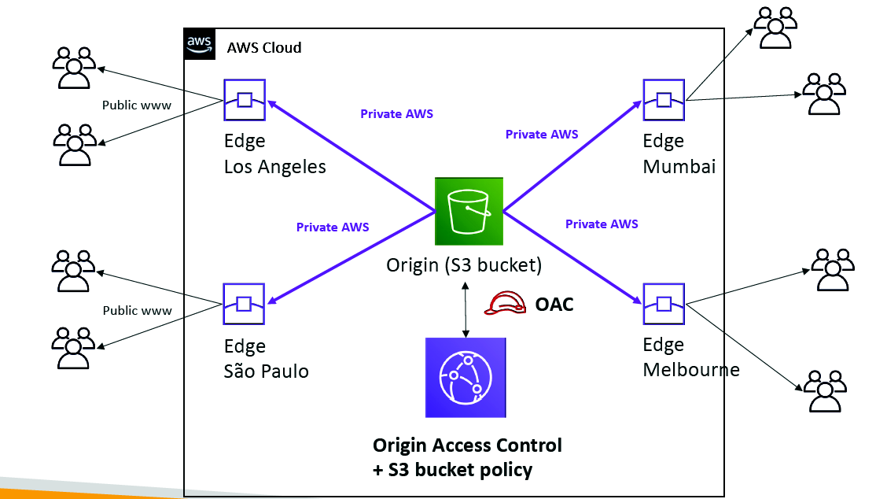

 [General Content AWS Cloud][1]

[1]: https://github.com/weder96/aws-certification-learning

# Module 21: Amazon Cloudfront

## Content
1. <a href="#section-1"> Amazon Cloudfront </a>

***************************************************************************************************
##  **1 - Amazon Cloudfront**

CloudFront is a web service that gives businesses and web application developers an easy and cost-effective way to distribute content with low latency and high data transfer speeds.

CloudFront is a good choice for distribution of frequently accessed static content that benefits from edge delivery—like popular website images, videos, media files or software downloads.

Used for dynamic, static, streaming, and interactive content.

CloudFront is a global service:

- Ingress to upload objects.
- Egress to distribute content.

Amazon CloudFront provides a simple API that lets you:

- Distribute content with low latency and high data transfer rates by serving requests using a network of edge locations around the world.
- Get started without negotiating contracts and minimum commitments.

You can use a zone apex name on CloudFront.

CloudFront supports wildcard CNAME.

Supports wildcard SSL certificates, Dedicated IP, Custom SSL and SNI Custom SSL (cheaper).

Supports Perfect Forward Secrecy which creates a new private key for each SSL session.

### **Global users for our application**

- You have deployed an application and have global users who want to access it directly.
- They go over the publicinternet, which can add a lot of latency due to many hops
- We wish to go as fast as possible through AWS network to minimize latency

### **Unicast IP vs Anycast IP**

- Unicast IP: one server holds one IP address
- Anycast IP: all servers hold the same IP address and the client is routed to the nearest one

### **AWS Global Accelerator**

- Leverage the AWS internal network to route to your application
- 2 Anycast IP are created for your application
- The Anycast IP send traffic directly to Edge Locations
- The Edge locations send the traffic to your application

-  Works with Elastic IP, EC2 instances, ALB, NLB, public or private
-  Consistent Performance
-  Intelligent routing to lowest latency and fast regional failover
-  No issue with client cache (because the IP doesn’t change)
-  Internal AWS network
-  Health Checks
-  Global Accelerator performs a health check of your applications
-  Helps make your application global (failover less than 1 minute for unhealthy)
-  Great for disaster recovery (thanks to the health checks)
-  Security
-  only 2 external IP need to be whitelisted
-  DDoS protection thanks to AWS Shield

### **AWS Global Accelerator vs CloudFront**

- They both use the AWS global network and its edge locations around the world
- Both services integrate with AWS Shield for DDoS protection.

-  CloudFront
    -  Improves performance for both cacheable content (such as images and videos)
    -  Dynamic content (such as API acceleration and dynamic site delivery)
    -  Content is served at the edge

-  Global Accelerator
    -  Improves performance for a wide range of applications over TCP or UDP
    -  Proxying packets at the edge to applications running in one or more AWS Regions.
    -  Good fit for non-HTTP use cases, such as gaming (UDP), IoT (MQTT), or Voice over IP
    -  Good for HTTP use cases that require static IP addresses
    -  Good for HTTP use cases that required deterministic, fast regional failover

### **Edge Locations and Regional Edge Caches**

An edge location is the location where content is cached (separate to AWS regions/AZs).

Requests are automatically routed to the nearest edge location.

Edge locations are not tied to Availability Zones or regions.

Regional Edge Caches are located between origin web servers and global edge locations and have a larger cache.

Regional Edge Caches have larger cache-width than any individual edge location, so your objects remain in cache longer at these locations.

Regional Edge caches aim to get content closer to users.

Proxy methods PUT/POST/PATCH/OPTIONS/DELETE go directly to the origin from the edge locations and do not proxy through Regional Edge caches.

Dynamic content goes straight to the origin and does not flow through Regional Edge caches.

Edge locations are not just read only, you can write to them too.

The diagram below shows where Regional Edge Caches and Edge Locations are placed in relation to end users:

### **Origins**

An origin is the origin of the files that the CDN will distribute.

Origins can be either an S3 bucket, an EC2 instance, an Elastic Load Balancer, or Route 53 – can also be external (non-AWS).

When using Amazon S3 as an origin you place all your objects within the bucket.

You can use an existing bucket and the bucket is not modified in any way.

By default all newly created buckets are private.

You can setup access control to your buckets using:

- Bucket policies.
- Access Control Lists.

You can make objects publicly available or use CloudFront signed URLs.

A custom origin server is a HTTP server which can be an EC2 instance or an on-premises/non-AWS based web server.

When using an on-premises or non-AWS based web server you must specify the DNS name, ports, and protocols that you want CloudFront to use when fetching objects from your origin.

Most CloudFront features are supported for custom origins except RTMP distributions (must be an S3 bucket).

When using EC2 for custom origins Amazon recommend:

- Use an AMI that automatically installs the software for a web server.
- Use ELB to handle traffic across multiple EC2 instances.
- Specify the URL of your load balancer as the domain name of the origin server.

S3 static website:

- Enter the S3 static website hosting endpoint for your bucket in the configuration.
- Example: http://<bucketname>.s3-website-<region>.amazonaws.com.

Objects are cached for 24 hours by default.

The expiration time is controlled through the TTL.

The minimum expiration time is 0.

Static websites on Amazon S3 are considered custom origins.

AWS origins are Amazon S3 buckets (not a static website).

CloudFront keeps persistent connections open with origin servers.

Files can also be uploaded to CloudFront.

High availability with Origin Failover:

Can set up CloudFront with origin failover for scenarios that require high availability.
Uses an origin group in which you designate a primary origin for CloudFront plus a second origin that CloudFront automatically switches to when the primary origin returns specific HTTP status code failure responses.
For more info, check this [article](https://docs.aws.amazon.com/AmazonCloudFront/latest/DeveloperGuide/high_availability_origin_failover.html).
Also works with Lambda@Edge functions.

### **Distributions**

To distribute content with CloudFront you need to create a distribution.

The distribution includes the configuration of the CDN including:

- Content origins.
- Access (public or restricted).
- Security (HTTP or HTTPS).
- Cookie or query-string forwarding.
- Geo-restrictions.
- Access logs (record viewer activity).

There are two types of distribution.

Web Distribution:

- Static and dynamic content including .html, .css, .php, and graphics files.
- Distributes files over HTTP and HTTPS.
- Add, update, or delete objects, and submit data from web forms.
- Use live streaming to stream an event in real time.

RTMP:

- Distribute streaming media files using Adobe Flash Media Server’s RTMP protocol.
- Allows an end user to begin playing a media file before the file has finished downloading from a CloudFront edge location.
- Files must be stored in an S3 bucket.

To use CloudFront live streaming, create a web distribution.

For serving both the media player and media files you need two types of distributions:

- A web distribution for the media player.
- An RTMP distribution for the media files.

S3 buckets can be configured to create access logs and cookie logs which log all requests made to the S3 bucket.

Amazon Athena can be used to analyze access logs.

CloudFront is integrated with CloudTrail.

CloudTrail saves logs to the S3 bucket you specify.

CloudTrail captures information about all requests whether they were made using the CloudFront console, the CloudFront API, the AWS SDKs, the CloudFront CLI, or another service.

CloudTrail can be used to determine which requests were made, the source IP address, who made the request etc.

To view CloudFront requests in CloudTrail logs you must update an existing trail to include global services.

To delete a distribution it must first be disabled (can take up to 15 minutes).

The diagram below depicts Amazon CloudFront Distributions and Origins:

### **Cache Behavior**

Allows you to configure a variety of CloudFront functionality for a given URL path pattern.

For each cache behavior you can configure the following functionality:

- The path pattern (e.g. /images/*.jpg, /images*.php).
- The origin to forward requests to (if there are multiple origins).
- Whether to forward query strings.
- Whether to require signed URLs.
- Allowed HTTP methods.
- Minimum amount of time to retain the files in the CloudFront cache (regardless of the values of any cache-control headers).

The default cache behavior only allows a path pattern of /*.

Additional cache behaviors need to be defined to change the path pattern following creation of the distribution.

You can restrict access to content using the following methods:

- Restrict access to content using signed cookies or signed URLs.
- Restrict access to objects in your S3 bucket.

A special type of user called an Origin Access Identity (OAI) can be used to restrict access to content in an Amazon S3 bucket.

By using an OAI you can restrict users so they cannot access the content directly using the S3 URL, they must connect via CloudFront.

You can define the viewer protocol policy:

- HTTP and HTTPS.
- Redirect HTTP to HTTPS.
- HTTPS only.

You can define the Allowed HTTP Methods:

- GET, HEAD.
- GET, HEAD, OPTIONS.
- GET, HEAD, OPTIONS, PUT, POST, PATCH, DELETE.

For web distributions you can configure CloudFront to require that viewers use HTTPS.

Field-Level Encryption:

- Field-level encryption adds an additional layer of security on top of HTTPS that lets you protect specific data so that it is only visible to specific applications.
- Field-level encryption allows you to securely upload user-submitted sensitive information to your web servers.
- The sensitive information is encrypted at the edge closer to the user and remains encrypted throughout application processing.

Origin policy:

- HTTPS only.
- Match viewer – CloudFront matches the protocol with your custom origin.
- Use match viewer only if you specify Redirect HTTP to HTTPS or HTTPS only for the viewer protocol policy.
- CloudFront caches the object once even if viewers make requests using HTTP and HTTPS.

Object invalidation:

- You can remove an object from the cache by invalidating the object.
- You cannot cancel an invalidation after submission.
- You cannot invalidate media files in the Microsoft Smooth Streaming format when you have enabled Smooth Streaming for the corresponding cache behavior.

Objects are cached for the TTL (always recorded in seconds, default is 24 hours, default max is 1 year).

Only caches for GET requests (not PUT, POST, PATCH, DELETE).

Dynamic content is cached.

Consider how often your files change when setting the TTL.

Invalidation can be used to immediately revoke cached objects – chargeable.

Deletions propagate.

Cache Invalidations:

- In case you update the back-end origin, CloudFront doesn’t know about it and will only get the refreshed content after the TTL has expired
- However, you can force an entire or partial cache refresh (thus bypassing the TTL) by performing a CloudFront Invalidation
- You can invalidate all files (*) or a special path (/images/*) 

### **Cache Hit Ratio**

A good cache hit ratio means more requests are served from the cache.

Methods of improving the cache hit ratio include:

- Use the Cache-Control max-age directive to increase the time objects remain in the cache
- Use Origin Shield.
- Forward only the query string parameters for which your origin will return unique objects.
- Configure CloudFront to forward only specified cookies instead of forwarding all cookies.
- Configure CloudFront to forward and cache based on only specified headers instead of forwarding and caching based on all headers.

### **Restrictions**

Blacklists and whitelists can be used for geography – you can only use one at a time.

There are two options available for geo-restriction (geo-blocking):

- Use the CloudFront geo-restriction feature (use for restricting access to all files in a distribution and at the country level).
- Use a 3rd party geo-location service (use for restricting access to a subset of the files in a distribution and for finer granularity at the country level).

You can restrict who can access your distribution
    - Allowlist: Allow your users to access your content only if they're in one of the countries on a list of approved countries.
    - Blocklist: Prevent your users from accessing your content if they're in one of the countries on a list of banned countries.

- The “country” is determined using a 3rd party Geo-IP database
- Use case: Copyright Laws to control access to content

### **Lambda@Edge**

Can be used to run Lambda at Edge Locations.

Lets you run Node.js and Python Lambda functions to customize content that CloudFront delivers.

Executes the functions in AWS locations closer to the viewer.

You can use Lambda functions to change CloudFront requests and responses at the following points:

- After CloudFront receives a request from a viewer (viewer request).
- Before CloudFront forwards the request to the origin (origin request).
- After CloudFront receives the response from the origin (origin response).
- Before CloudFront forwards the response to the viewer (viewer response).

Lambda@Edge can do the following:

-Inspect cookies and rewrite URLs to perform A/B testing.
- Send specific objects to your users based on the User-Agent header.
- Implement access control by looking for specific headers before passing requests to the origin.
- Add, drop, or modify headers to direct users to different cached objects.
- Generate new HTTP responses.
- Cleanly support legacy URLs.
- Modify or condense headers or URLs to improve cache utilization.
- Make HTTP requests to other Internet resources and use the results to customize responses.

**Exam tip:** Lambda@Edge can be used to load different resources based on the User-Agent HTTP header.

### **Signed URLs and Signed Cookies**

A signed URL includes additional information, for example, an expiration date and time, that gives you more control over access to your content. This additional information appears in a policy statement, which is based on either a canned policy or a custom policy.

CloudFront signed cookies allow you to control who can access your content when you don’t want to change your current URLs or when you want to provide access to multiple restricted files, for example, all the files in the subscribers’ area of a website.

Application must authenticate user and then send three Set-Cookie headers to the viewer; the viewer stores the name-value pair and adds them to the request in a Cookie header when requesting access to content.

Use signed URLs in the following cases:

You want to restrict access to individual files, for example, an installation download for your application.
Your users are using a client (for example, a custom HTTP client) that doesn’t support cookies.
Use signed cookies in the following cases:

You want to provide access to multiple restricted files, for example, all the files for a video in HLS format or all the files in the subscribers’ area of website.
You don’t want to change your current URLs.

### **Origin Access Identity**

Used in combination with signed URLs and signed cookies to restrict direct access to an S3 bucket (prevents bypassing the CloudFront controls).

An origin access identity (OAI) is a special CloudFront user that is associated with the distribution.

Permissions must then be changed on the Amazon S3 bucket to restrict access to the OAI.

If users request files directly by using Amazon S3 URLs, they’re denied access.

The origin access identity has permission to access files in your Amazon S3 bucket, but users don’t.

### **AWS WAF**

AWS WAF is a web application firewall that lets you monitor HTTP and HTTPS requests that are forwarded to CloudFront and lets you control access to your content.

With AWS WAF you can shield access to content based on conditions in a web access control list (web ACL) such as:

Origin IP address.
Values in query strings.
CloudFront responds to requests with the requested content or an HTTP 403 status code (forbidden).

CloudFront can also be configured to deliver a custom error page.

Need to associate the relevant distribution with the web ACL.

### **Security**

PCI DSS compliant but recommended not to cache credit card information at edge locations.

HIPAA compliant as a HIPAA eligible service.

Distributed Denial of Service (DDoS) protection:

CloudFront distributes traffic across multiple edge locations and filters requests to ensure that only valid HTTP(S) requests will be forwarded to backend hosts. CloudFront also supports geo-blocking, which you can use to prevent requests from geographic locations from being served.

### **Domain Names**

CloudFront typically creates a domain name such as a232323.cloudfront.net.

Alternate domain names can be added using an alias record (Route 53).

For other service providers use a CNAME (cannot use the zone apex with CNAME).

Moving domain names between distributions:

- You can move subdomains yourself.
- For the root domain you need to use AWS support.

### **High Availability**

CloudFront caches content at Edge Locations around the world. The more objects served by the cache, the fewer the requests to the origin.  This reduces the load on your origin server and reduces latency.

You can set up CloudFront with origin failover for scenarios that require high availability.

To set up origin failover, you must have a distribution with at least two origins. Next, you create an origin group for your distribution that includes two origins, setting one as the primary. Finally, you create or update a cache behavior to use the origin group.

### **Monitoring and Reporting**

You can view operational metrics about your CloudFront distributions and Lambda@Edge functions in the CloudFront console.

The following default metrics are included for all CloudFront distributions, at no additional cost:

**Requests**

The total number of viewer requests received by CloudFront, for all HTTP methods and for both HTTP and HTTPS requests.

**Bytes downloaded**

The total number of bytes downloaded by viewers for GET, HEAD, and OPTIONS requests.

**Bytes uploaded**

The total number of bytes that viewers uploaded to your origin with CloudFront, using POST and PUT requests.

**4xx error rate**

The percentage of all viewer requests for which the response’s HTTP status code is 4xx.

**5xx error rate**

The percentage of all viewer requests for which the response’s HTTP status code is 5xx.

**Total error rate**

The percentage of all viewer requests for which the response’s HTTP status code is 4xx or 5xx.

In addition to the default metrics, you can enable additional metrics for an additional cost.

These additional metrics must be enabled for each distribution separately:

**Cache hit rate**

The percentage of all cacheable requests for which CloudFront served the content from its cache. HTTP POST and PUT requests, and errors, are not considered cacheable requests.

**Origin latency**

The total time spent from when CloudFront receives a request to when it starts providing a response to the network (not the viewer), for requests that are served from the origin, not the CloudFront cache. This is also known as first byte latency, or time-to-first-byte.

**Error rate by status code**

The percentage of all viewer requests for which the response’s HTTP status code is a particular code in the 4xx or 5xx range. This metric is available for all the following error codes: 401, 403, 404, 502, 503, and 504.

### **Logging and Auditing**

S3 buckets can be configured to create access logs and cookie logs which log all requests made to the S3 bucket.

Amazon Athena can be used to analyze access logs.

CloudFront is integrated with CloudTrail.

CloudTrail saves logs to the S3 bucket you specify.

CloudTrail captures information about all requests whether they were made using the CloudFront console, the CloudFront API, the AWS SDKs, the CloudFront CLI, or another service.

CloudTrail can be used to determine which requests were made, the source IP address, who made the request etc.

To view CloudFront requests in CloudTrail logs you must update an existing trail to include global services.

### **Charges**

There is an option for reserved capacity over 12 months or longer (starts at 10TB of data transfer in a single region).

You pay for:

- Data Transfer Out to Internet.
- Data Transfer Out to Origin.
- Number of HTTP/HTTPS Requests.
- Invalidation Requests.
- Dedicated IP Custom SSL.
- Field level encryption requests.

You do not pay for:

- Data transfer between AWS regions and CloudFront.
- Regional edge cache.
- AWS ACM SSL/TLS certificates.
- Shared CloudFront certificates.

### **S3‌ ‌Transfer‌ ‌Acceleration‌ ‌**

When‌ ‌catering‌ ‌to‌ ‌a‌ ‌global‌ ‌audience,‌ ‌the‌ ‌distance‌ ‌between‌ ‌you‌ ‌and‌ ‌your‌ ‌client‌ ‌is‌ ‌undoubtedly‌ ‌an‌ ‌issue.‌ ‌This‌ ‌is‌‌ also‌ ‌applicable‌ ‌for‌ ‌the‌ ‌S3‌ ‌service,‌ ‌especially‌ ‌when‌ ‌uploading‌ ‌large‌ ‌objects‌ ‌across‌ ‌the‌ ‌regions.‌ ‌It‌ ‌will‌ ‌surely‌ ‌take‌‌
a‌ ‌long‌ ‌time‌ ‌to‌ ‌upload‌ ‌hundreds‌ ‌of‌ ‌gigabytes‌ ‌of‌ ‌things‌ ‌to‌ ‌an‌ ‌S3‌ ‌bucket‌ ‌located‌ ‌on‌ ‌the‌ ‌other‌ ‌side‌ ‌of‌ ‌the‌ ‌globe.‌‌
To‌ ‌address‌ ‌this‌ ‌issue,‌ ‌you‌ ‌can‌ ‌enable‌ ‌the‌ ‌S3‌ ‌Transfer‌ ‌Acceleration‌ ‌feature‌ ‌on‌ ‌S3‌ ‌buckets.‌‌ ‌

S3‌ ‌Transfer‌ ‌Acceleration‌ ‌integrates‌ ‌with‌ ‌**Amazon‌ ‌CloudFront‌** ‌and‌ ‌uses‌ ‌its‌ ‌AWS‌ ‌Edge‌ ‌location‌ ‌around‌ ‌the‌ ‌globe‌‌
to‌ ‌create‌ ‌an‌ ‌accelerated‌ ‌endpoint‌ ‌for‌ ‌a‌ ‌much‌ ‌faster‌ ‌data‌ ‌transfer.‌ ‌In‌ ‌this‌ ‌way,‌ ‌your‌ ‌S3‌ ‌bucket‌ ‌is‌ ‌much‌ ‌closer‌ ‌to‌‌
your‌ ‌users.‌ ‌Data‌ ‌will‌ ‌be‌ ‌uploaded‌ ‌on‌ ‌an‌ ‌AWS‌ ‌Edge‌ ‌Location‌ ‌and‌ ‌routed‌ ‌to‌ ‌your‌ ‌S3‌ ‌bucket‌ ‌through‌ ‌the‌ ‌AWS‌‌
internal‌ ‌network.‌

https://docs.aws.amazon.com/AmazonS3/latest/userguide/transfer-acceleration.html‌

### **CloudFront Pricing ‌**

CloudFront Edge locations are all around the world
The cost of data out per edge location varies

### **CloudFront – Price Classes**
    -  You can reduce the number of edge locations for cost reduction

    -  Three price classes:

1. Price Class All: all regions – best performance

2. Price Class 200: most regions, but excludes the most expensive regions

3. Price Class 100: only the least expensive regions

### **Prices Class Visual**

**Cheat Sheets**

https://digitalcloud.training/amazon-cloudfront/

https://tutorialsdojo.com/s3-pre-signed-urls-vs-cloudfront-signed-urls-vs-origin-access-identity-oai/

https://digitalcloud.training/category/aws-cheat-sheets/aws-solutions-architect-professional/aws-networking-content-delivery-sap/

https://digitalcloud.training/category/aws-cheat-sheets/aws-solutions-architect-professional/security-identity-compliance-sap/

**References:**

https://aws.amazon.com/cloudfront/features/

https://aws.amazon.com/cloudfront/pricing/

https://aws.amazon.com/cloudfront/faqs/

https://docs.aws.amazon.com/AmazonCloudFront/latest/DeveloperGuide

https://docs.aws.amazon.com/AmazonS3/latest/dev/PresignedUrlUploadObject.html

https://docs.aws.amazon.com/AmazonCloudFront/latest/DeveloperGuide/high_availability_origin_failover.html

https://docs.aws.amazon.com/AmazonCloudFront/latest/DeveloperGuide/Expiration.html

https://docs.aws.amazon.com/AmazonCloudFront/latest/DeveloperGuide/private-content-overview.html#forward-custom-headers-restrict-access

https://docs.aws.amazon.com/AmazonCloudFront/latest/DeveloperGuide/private-content-restricting-access-to-s3.html

https://docs.aws.amazon.com/AmazonS3/latest/dev/ShareObjectPreSignedURL.html

https://docs.aws.amazon.com/AmazonCloudFront/latest/DeveloperGuide/PrivateContent.html

https://docs.aws.amazon.com/AmazonCloudFront/latest/DeveloperGuide/private-content-restricting-access-to-s3.html

**Videos**

https://www.youtube.com/user/AmazonWebServices/search?query=CloudFront

