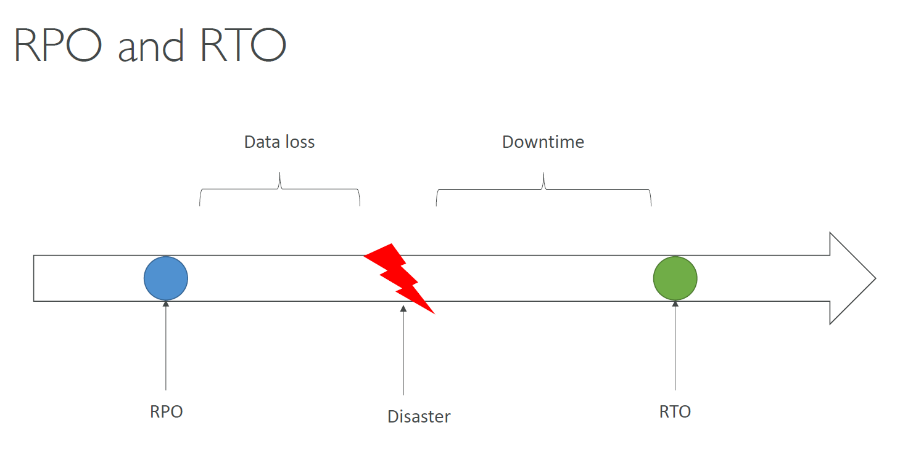
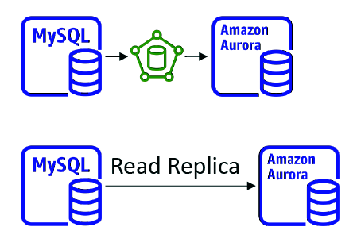
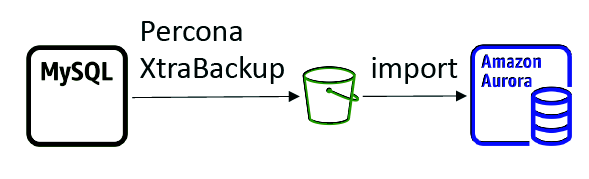
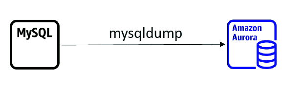
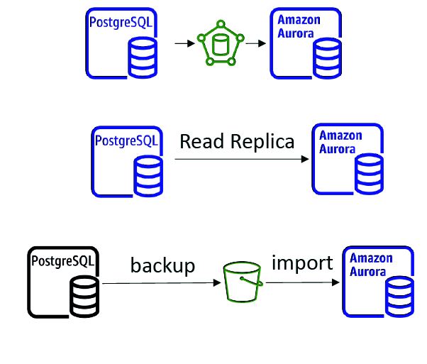

 [General Content AWS Cloud][1]

[1]: https://github.com/weder96/aws certification learning

# Module 29: Disaster recovery and Migrations

## Content

1. <a href="#section_01">  Disaster recovery and Migrations</a>

***************************************************************************************************
##  **1 -  Disaster recovery**

[Disaster recovery](../images/pdf/disaster-recovery-workloads-on-aws.pdf)

[Migrations - Module 13](https://github.com/weder96/aws-certification-learning/tree/main/module-13)

[AWS Backup](https://github.com/weder96/aws-certification-learning/tree/main/module-7#section-8)

[AWS Application Migration Service](https://github.com/weder96/aws-certification-learning/tree/main/module-13#section-07)

[AWS Application Migration Service CloudEndure Migration](https://github.com/weder96/aws-certification-learning/tree/main/module-13#section-08)

### ***Disaster Recovery Tips***

- Backup
- EBS Snapshots, RDS automated backups / Snapshots, etc…
- Regular pushes to S3 / S3 IA / Glacier, Lifecycle Policy, Cross Region Replication
- From On-Premise: Snowball or Storage Gateway
- High Availability
- Use Route53 to migrate DNS over from Region to Region
- RDS Multi-AZ, ElastiCache Multi-AZ, EFS, S3
- Site to Site VPN as a recovery from Direct Connect
- Replication
- RDS Replication (Cross Region), AWS Aurora + Global Databases
- Database replication from on-premises to RDS
- Storage Gateway
- Automation
- CloudFormation / Elastic Beanstalk to re-create a whole new environment
- Recover / Reboot EC2 instances with CloudWatch if alarms fail
- AWS Lambda functions for customized automations
- Chaos
- Netflix has a “simian-army” randomly terminating EC2

### ***On-Premise strategy with AWS***

- Ability to download Amazon Linux 2 AMI as a VM (.iso format)
- VMWare, KVM, VirtualBox (Oracle VM), Microsoft Hyper-V
- VM Import / Export
- Migrate existing applications into EC2
- Create a DR repository strategy for your on-premises VMs
- Can export back the VMs from EC2 to on-premises
- AWS Application Discovery Service
- Gather information about your on-premises servers to plan a migration
- Server utilization and dependency mappings
- Track with AWS Migration Hub
- AWS Database Migration Service (DMS)
- replicate On-premise => AWS , AWS => AWS, AWS => On-premise
- Works with various database technologies (Oracle, MySQL, DynamoDB, etc..)
- AWS Server Migration Service (SMS)
- Incremental replication of on-premises live servers to AWS

### ***Transferring large amount of data into AWS***

- Example: transfer 200 TB of data in the cloud. We have a 100 Mbps internet connection.
- Over the internet / Site-to-Site VPN:
- Immediate to setup
- Will take 200(TB)*1000(GB)*1000(MB)*8(Mb)/100 Mbps = 16,000,000s = 185d
- Over direct connect 1Gbps:
- Long for the one-time setup (over a month)
- Will take 200(TB)*1000(GB)*8(Gb)/1 Gbps = 1,600,000s = 18.5d
- Over Snowball:
- Will take 2 to 3 snowballs in parallel
- Takes about 1 week for the end-to-end transfer
- Can be combined with DMS
- For on-going replication / transfers: Site-to-Site VPN or DX with DMS or DataSync

### **Disaster Recovery Strategies**

- Backup and Restore
- Pilot Light
- Warm Standby
- Hot Site / Multi Site Approach

### **Source and Target**

<a href="https://github.com/weder96/aws-certification-learning/tree/main/module-13#section-01" target="_blank"> AWS Application Migration Service </a>

### **RDS & Aurora MySQL Migrations**

- RDS MySQL to Aurora MySQL
    - Option 1: DB Snapshots from RDS MySQL restored as MySQL Aurora DB
    - Option 2: Create an Aurora Read Replica from your RDS MySQL, and when the replication lag is 0, promote it as its own DB cluster (can take time and cost $)

- External MySQL to Aurora MySQL
    - Option 1:
        - Use Percona XtraBackup to create a file backup in Amazon S3
        - Create an Aurora MySQL DB from Amazon S3
    - Option 2:
        - Create an Aurora MySQL DB
        - Use the mysqldump utility to migrate MySQL into Aurora (slower than S3 method)

- Use DMS if both databases are up and running

### **RDS & Aurora PostgreSQL Migrations**

- RDS PostgreSQL to Aurora PostgreSQL
    - Option 1: DB Snapshots from RDS PostgreSQL restored as PostgreSQL Aurora DB
    - Option 2: Create an Aurora Read Replica from your RDS PostgreSQL, and when the replication lag is 0, promote it as its own DB cluster (can take time and cost $)

- External PostgreSQL to Aurora PostgreSQL
    - Create a backup and put it in Amazon S3
    - Import it using the aws_s3 Aurora extension

- Use DMS if both databases are up and running

**Cheat Sheets**

https://digitalcloud.training/disaster-recovery-in-the-aws-cloud/

https://tutorialsdojo.com/aws-well-architected-framework-disaster-recovery/

https://medium.com/@christopheradamson253/creating-a-disaster-recovery-plan-using-aws-services-7977b651420c

**References:**

https://docs.aws.amazon.com/whitepapers/latest/disaster-recovery-workloads-on-aws/disaster-recovery-options-in-the-cloud.html

**Videos**

https://www.youtube.com/watch?v=cJZw5mrxryA&list=PLU_2FDqvxabSF6LgkACIninFw4zqr-X_a

https://www.youtube.com/watch?v=07EHsPuKXc0

**Hands On**

