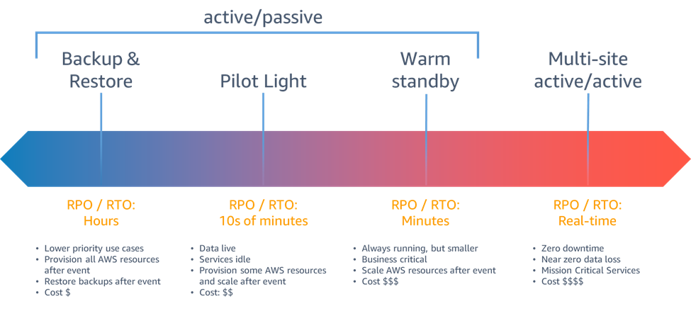
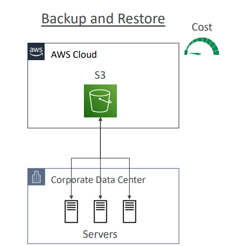
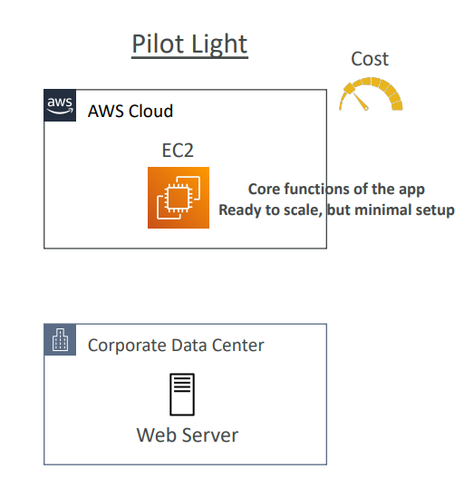
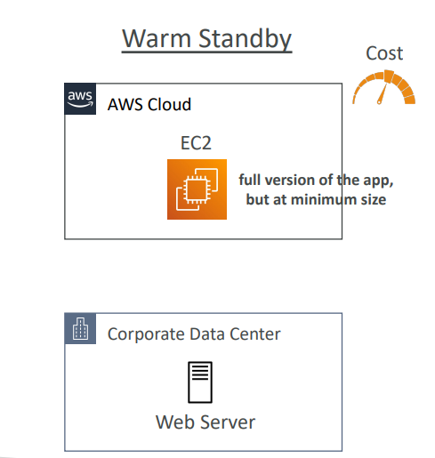
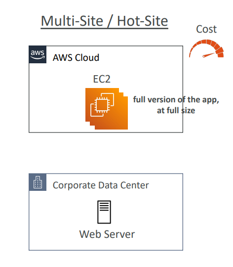

 [General Content AWS Cloud][1]

[1]: https://github.com/weder96/aws certification learning

# Module 29: Disaster recovery and Migrations

## Content

1. <a href="#section_01">  Disaster recovery and Migrations</a>

***************************************************************************************************
##  **1 -  Disaster recovery**

[Disaster recovery](../images/pdf/disaster-recovery-workloads-on-aws.pdf)

[Migrations - Module 13](https://github.com/weder96/aws-certification-learning/tree/main/module-13)

[AWS Backup](https://github.com/weder96/aws-certification-learning/tree/main/module-7#section-8)

[AWS Application Migration Service](https://github.com/weder96/aws-certification-learning/tree/main/module-13#section-07)

[AWS Application Migration Service CloudEndure Migration](https://github.com/weder96/aws-certification-learning/tree/main/module-13#section-08)

### ***Disaster Recovery Tips***

- Backup
- EBS Snapshots, RDS automated backups / Snapshots, etc…
- Regular pushes to S3 / S3 IA / Glacier, Lifecycle Policy, Cross Region Replication
- From On-Premise: Snowball or Storage Gateway
- High Availability
- Use Route53 to migrate DNS over from Region to Region
- RDS Multi-AZ, ElastiCache Multi-AZ, EFS, S3
- Site to Site VPN as a recovery from Direct Connect
- Replication
- RDS Replication (Cross Region), AWS Aurora + Global Databases
- Database replication from on-premises to RDS
- Storage Gateway
- Automation
- CloudFormation / Elastic Beanstalk to re-create a whole new environment
- Recover / Reboot EC2 instances with CloudWatch if alarms fail
- AWS Lambda functions for customized automations
- Chaos
- Netflix has a “simian-army” randomly terminating EC2

### ***On-Premise strategy with AWS***

- Ability to download Amazon Linux 2 AMI as a VM (.iso format)
- VMWare, KVM, VirtualBox (Oracle VM), Microsoft Hyper-V
- VM Import / Export
- Migrate existing applications into EC2
- Create a DR repository strategy for your on-premises VMs
- Can export back the VMs from EC2 to on-premises
- AWS Application Discovery Service
- Gather information about your on-premises servers to plan a migration
- Server utilization and dependency mappings
- Track with AWS Migration Hub
- AWS Database Migration Service (DMS)
- replicate On-premise => AWS , AWS => AWS, AWS => On-premise
- Works with various database technologies (Oracle, MySQL, DynamoDB, etc..)
- AWS Server Migration Service (SMS)
- Incremental replication of on-premises live servers to AWS

### ***Transferring large amount of data into AWS***

- Example: transfer 200 TB of data in the cloud. We have a 100 Mbps internet connection.
- Over the internet / Site-to-Site VPN:
- Immediate to setup
- Will take 200(TB)*1000(GB)*1000(MB)*8(Mb)/100 Mbps = 16,000,000s = 185d
- Over direct connect 1Gbps:
- Long for the one-time setup (over a month)
- Will take 200(TB)*1000(GB)*8(Gb)/1 Gbps = 1,600,000s = 18.5d
- Over Snowball:
- Will take 2 to 3 snowballs in parallel
- Takes about 1 week for the end-to-end transfer
- Can be combined with DMS
- For on-going replication / transfers: Site-to-Site VPN or DX with DMS or DataSync

### **Disaster Recovery Strategies**

**Reference**

https://docs.aws.amazon.com/whitepapers/latest/disaster-recovery-workloads-on-aws/disaster-recovery-options-in-the-cloud.html

if Case necessary access 

[resilience-hub](https://aws.amazon.com/resilience-hub/?nc1=h_ls)

Whats is RTO and RPO ? 

[rto-and-rpo-using-aws-resilience-hub](https://aws.amazon.com/pt/blogs/mt/validating-and-improving-the-rto-and-rpo-using-aws-resilience-hub/)

- Backup and Restore
- Pilot Light
- Warm Standby
- Hot Site / Multi Site Approach

**Backup and Restore**

Backup and restore is a suitable approach for mitigating against data loss or corruption. This approach can also be used to mitigate against a regional disaster by replicating data to other AWS Regions, or to mitigate lack of redundancy for workloads deployed to a single Availability Zone. 

In addition to data, you must redeploy the infrastructure, configuration, and application code in the recovery Region. 

To enable infrastructure to be redeployed quickly without errors, you should always deploy using infrastructure as code (IaC) using services such as AWS CloudFormation or the AWS Cloud Development Kit (AWS CDK). Without IaC, it may be complex to restore workloads in the recovery Region, which will lead to increased recovery times and possibly exceed your RTO. In addition to user data, be sure to also back up code and configuration, including Amazon Machine Images (AMIs) you use to create Amazon EC2 instances. You can use AWS CodePipeline to automate redeployment of application code and configuration.

**Pilot Light**

With the pilot light approach, you replicate your data from one Region to another and provision a copy of your core workload infrastructure. 

Resources required to support data replication and backup, such as databases and object storage, are always on. Other elements, such as application servers, are loaded with application code and configurations, but are "switched off" and are only used during testing or when disaster recovery failover is invoked. In the cloud, you have the flexibility to deprovision resources when you do not need them, and provision them when you do. 

A best practice for “switched off” is to not deploy the resource, and then create the configuration and capabilities to deploy it (“switch on”) when needed. Unlike the backup and restore approach, your core infrastructure is always available and you always have the option to quickly provision a full scale production environment by switching on and scaling out your application servers.

**Warm Standby**

The warm standby approach involves ensuring that there is a scaled down, but fully functional, copy of your production environment in another Region. This approach extends the pilot light concept and decreases the time to recovery because your workload is always-on in another Region. This approach also allows you to more easily perform testing or implement continuous testing to increase confidence in your ability to recover from a disaster.

**Note:** 
The difference between pilot light and warm standby can sometimes be difficult to understand. Both include an environment in your DR Region with copies of your primary Region assets. The distinction is that pilot light cannot process requests without additional action taken first, whereas warm standby can handle traffic (at reduced capacity levels) immediately. The pilot light approach requires you to “turn on” servers, possibly deploy additional (non-core) infrastructure, and scale up, whereas warm standby only requires you to scale up (everything is already deployed and running). Use your RTO and RPO needs to help you choose between these approaches.

**Hot Site / Multi Site Approach**

You can run your workload simultaneously in multiple Regions as part of a multi-site active/active or hot standby active/passive strategy. 

Multi-site active/active serves traffic from all regions to which it is deployed, whereas hot standby serves traffic only from a single region, and the other Region(s) are only used for disaster recovery. 

With a multi-site active/active approach, users are able to access your workload in any of the Regions in which it is deployed. 

This approach is the most complex and costly approach to disaster recovery, but it can reduce your recovery time to near zero for most disasters with the correct technology choices and implementation (however data corruption may need to rely on backups, which usually results in a non-zero recovery point). 

Hot standby uses an active/passive configuration where users are only directed to a single region and DR regions do not take traffic. Most customers find that if they are going to stand up a full environment in the second Region, 

it makes sense to use it active/active. Alternatively, if you do not want to use both Regions to handle user traffic, then Warm Standby offers a more economical and operationally less complex approach.

With multi-site active/active, because the workload is running in more than one Region, there is no such thing as failover in this scenario. 

Disaster recovery testing in this case would focus on how the workload reacts to loss of a Region: Is traffic routed away from the failed Region? 

Can the other Region(s) handle all the traffic? Testing for a data disaster is also required. Backup and recovery are still required and should be tested regularly. 

It should also be noted that recovery times for a data disaster involving data corruption, deletion, or obfuscation will always be greater than zero and the recovery point will always be at some point before the disaster was discovered. 

If the additional complexity and cost of a multi-site active/active (or hot standby) approach is required to maintain near zero recovery times, then additional efforts should be made to maintain security and to prevent human error to mitigate against human disasters.

**Video**

https://www.youtube.com/watch?v=E073XISxrSU

### **Source and Target**

<a href="https://github.com/weder96/aws-certification-learning/tree/main/module-13#section-01" target="_blank"> AWS Application Migration Service </a>

### **RDS & Aurora MySQL Migrations**

- RDS MySQL to Aurora MySQL
    - Option 1: DB Snapshots from RDS MySQL restored as MySQL Aurora DB
    - Option 2: Create an Aurora Read Replica from your RDS MySQL, and when the replication lag is 0, promote it as its own DB cluster (can take time and cost $)

- External MySQL to Aurora MySQL
    - Option 1:
        - Use Percona XtraBackup to create a file backup in Amazon S3
        - Create an Aurora MySQL DB from Amazon S3
    - Option 2:
        - Create an Aurora MySQL DB
        - Use the mysqldump utility to migrate MySQL into Aurora (slower than S3 method)

- Use DMS if both databases are up and running

### **RDS & Aurora PostgreSQL Migrations**

- RDS PostgreSQL to Aurora PostgreSQL
    - Option 1: DB Snapshots from RDS PostgreSQL restored as PostgreSQL Aurora DB
    - Option 2: Create an Aurora Read Replica from your RDS PostgreSQL, and when the replication lag is 0, promote it as its own DB cluster (can take time and cost $)

- External PostgreSQL to Aurora PostgreSQL
    - Create a backup and put it in Amazon S3
    - Import it using the aws_s3 Aurora extension

- Use DMS if both databases are up and running

**Cheat Sheets**

https://digitalcloud.training/disaster-recovery-in-the-aws-cloud/

https://tutorialsdojo.com/aws-well-architected-framework-disaster-recovery/

https://medium.com/@christopheradamson253/creating-a-disaster-recovery-plan-using-aws-services-7977b651420c

**References:**

https://docs.aws.amazon.com/whitepapers/latest/disaster-recovery-workloads-on-aws/disaster-recovery-options-in-the-cloud.html

**Videos**

https://www.youtube.com/watch?v=cJZw5mrxryA&list=PLU_2FDqvxabSF6LgkACIninFw4zqr-X_a

https://www.youtube.com/watch?v=07EHsPuKXc0

**Hands On**

