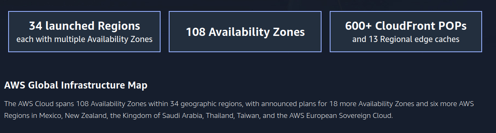
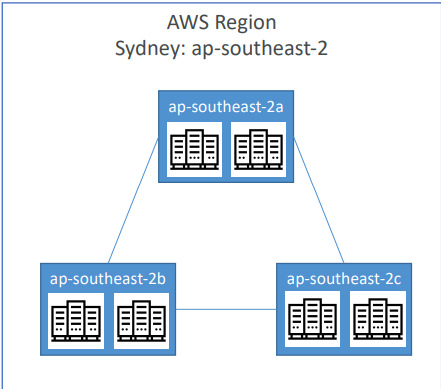
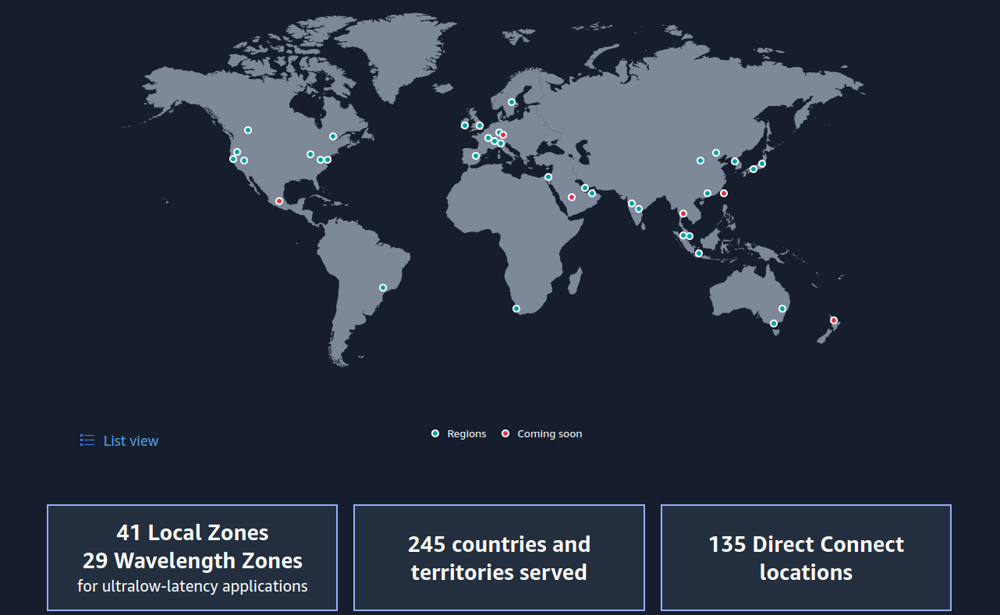

 [General Content AWS Cloud][1]

[1]: https://github.com/weder96/aws-certification-learning

# Module 3: Overview of AWS Global Infrastructure

## Contents
1. <a href="#section-01">AWS Global Infrastructure</a>

****************************************************** ********************************************
##  **1 - Global AWS Infrastructure**
An AWS Region is a physical location in the world where AWS has multiple AZs.

AZs consist of one or more discrete data centers, each with redundant power, network, and connectivity, hosted in separate facilities.

Each region is completely independent. Each Availability Zone is isolated, but Availability Zones within a region are connected through low-latency links.

AWS is constantly expanding around the world and currently there are:
- AWS Regions (AWS Regions)
- AWS Availability Zones
- AWS Data Centers
- AWS Edge Locations / Points of Presence

[infra](https://aws.amazon.com/about-aws/global-infrastructure/regions_az/)

**AWS Regions**
- AWS has regions all over the world
- Names can be us-east-1, eu-west-3…
- A region is a cluster of data centers
- Most AWS services are region-scop

The AWS Region is an area of ​​the world that they have selected for a full deployment of their AWS infrastructure.

**Areas such as countries or states:**
- Ohio
- California
- Singapore
- Beijing
- London
- Paris

**How ​​do I choose an AWS Region?**

If you need to start a new app, where should you do it?

- Compliance with data governance and legal requirements: data never leaves a region without your explicit permission
- Proximity to customers: reduced latency
- Services available in one region: New services and new features are not available in all regions
- Pricing: Pricing varies from region to region and is transparent on the service pricing page

**AWS Availability Zones**

- Each region has many Availability Zones (usually 3, min is 2, max is 6).
    - Example:
        - ap-southeast-2a
        - ap-southeast-2b
        - ap-southeast-2c

Each AWS region contains multiple distinct locations called Availability Zones (AZs). Each AZ is engineered to be isolated from failures in other AZs. An AZ is a data center, and in some cases, an AZ consists of multiple data centers.

AZs within a region provide inexpensive, low-latency network connectivity to other zones in the same region. This allows you to replicate your data across data centers in a synchronous manner so that failover can be automated and be transparent for your users.

"They provide fault isolation"

"They are connected by low-latency network connections"

- Each Availability Zone (AZ) is one or more discrete data centers with redundant power, networking, and connectivity
- They are separated from each other so that they are isolated from disasters
- They are connected with high bandwidth, ultra-low latency network 

# It is important to check the links below for references for updates, AWS is always evolving and data may be out of date on the date you read it.
**AWS Edge Locations**
Local distribution points. Useful for services like Netflix so they can store data closer to customers for high-speed, low-latency transfers.

If a customer wants to access data stored in Brisbane, they will transmit data from the Sydney region through a point of presence hosted in Brisbane.

Amazon has 216 points of presence (205 points of presence and 11 regional points
Caches) in 84 cities in 42 countries

Availability Zones are physically separated and isolated from each other.

AZs span one or more data centers and have direct, low-latency, high-throughput, redundant network connections to each other.

Each AZ is designed as an independent fault zone.

When launching an instance, you can select an Availability Zone or let AWS choose one for you.

If you distribute your EC2 instances across multiple Availability Zones and one instance fails, you can design your application so that an instance in another Availability Zone can handle requests.

You can also use Elastic IP addresses to mask the failure of an instance in one Availability Zone by quickly remapping the address to an instance in another Availability Zone.

An Availability Zone is represented by a region code followed by an identifying letter; for example, us-east-1a.

To ensure that resources are distributed across a region's Availability Zones, AWS independently maps Availability Zones to names in each AWS account.

For example, the Availability Zone us-east-1a for your AWS account might not be the same location as us-east-1a for another AWS account.

To coordinate Availability Zones across accounts, you must use the AZ ID , which is a unique and consistent identifier for an Availability Zone.

AZs are physically separated within a typical metropolitan region and are on lower risk floodplains.

AZs use discrete UPS and on-site backup generation facilities and are powered by different networks of independent facilities.

The AZs are all redundantly connected to multiple tier 1 transit providers.

The following graphic shows three AWS Regions, each with three Availability Zones:

Content is delivered to end users with lower latency

List of Regional Services - [Serviços](https://aws.amazon.com/pt/about-aws/global-infrastructure/regional-product-services/)

**Local Zones**
AWS Local Zones bring select AWS compute, storage, database, and other services closer to end users.

With AWS Local Zones, you can easily run highly demanding applications that require single-digit millisecond latencies for your end users.

Each AWS Local Zone location is an extension of an AWS Region where you can run your latency sensitive applications using AWS services such as Amazon Elastic Compute Cloud, Amazon Virtual Private Cloud, Amazon Elastic Block Store, Amazon File Storage, and Amazon Elastic Load Balancing in geographic proximity to end users.

AWS Local Zones provide a secure, high-bandwidth connection between on-premises workloads and those running in the AWS Region, allowing you to seamlessly connect to the full range of services in the region through the same APIs and data sets. tools.

**AWS Wavelength(AWS Wavelength)**

AWS Wavelength enables developers to build applications that deliver single-digit millisecond latencies to mobile devices and end users.

AWS developers can deploy their applications in wavelength zones, AWS infrastructure deployments that embed AWS compute and storage services in telecom providers' data centers at the edge of 5G networks, and easily access the breadth of AWS services at the region.

AWS Wavelength brings AWS services to the edge of the 5G network, minimizing latency for connecting to an application from a mobile device.

[wavelength Documentation](https://docs.aws.amazon.com/wavelength/)

**Video :**

https://www.youtube.com/watch?v=EhMqwPqPzcY

https://www.youtube.com/watch?v=_UHNoxoyv6A

**AWS Outposts(AWS Outposts)**
AWS Outposts bring native AWS services, infrastructure, and operating models to virtually any data center, co-location space, or on-premises facility.

You can use the same AWS APIs, tools and infrastructure on-premises and in the AWS cloud to deliver a truly consistent hybrid experience.

AWS Outposts is designed for connected environments and can be used to support workloads that need to remain on-premises due to low latency or local data processing needs.

**Edge Locations and Regional Edge Caches**
Edge locations are Content Delivery Network (CDN) endpoints for CloudFront.

There are many more points of presence than regions.

Currently, there are more than 200 points of presence.

Regional edge caches are located between CloudFront origin servers and edge locations.

A regional edge cache has a larger cache width than each of the individual edge locations.

The following diagram shows CloudFront Edge locations:

**Cheat Sheets**

https://digitalcloud.training/aws-global-infrastructure/

https://tutorialsdojo.com/aws-global-infrastructure/

**References:**

https://aws.amazon.com/about-aws/global-infrastructure/regions_az/

https://aws.amazon.com/about-aws/global-infrastructure/

https://docs.aws.amazon.com/aws-technical-content/latest/aws-overview/global-infrastructure.html

https://www.infrastructure.aws/

https://docs.aws.amazon.com/pdfs/local-zones/latest/ug/local-zones.pdf

**Videos**

https://www.youtube.com/results?search_query=AWS+Global+Infrastructure

https://www.youtube.com/watch?v=RPis5mbM8c8

https://www.youtube.com/watch?v=rno8iNfKChM&feature=emb_imp_woyt
