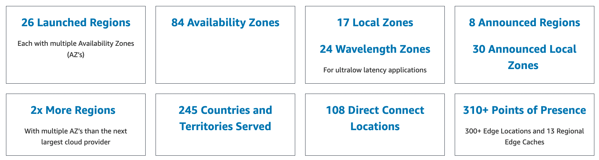

 [Conteudo Geral AWS Cloud][1]

[1]: https://github.com/weder96/aws-certification-learning

# Módulo 3: Visão geral da infraestrutura global da AWS

## Conteúdo
1. <a href="#section-1">Infraestrutura global da AWS</a>

*******************************************************************************************
##  Seção 1 - Infraestrutura global da AWS
Uma região da AWS é um local físico no mundo onde a AWS tem várias AZs.

As AZs consistem em um ou mais data centers discretos, cada um com energia, rede e conectividade redundantes, hospedados em instalações separadas.

Cada região é completamente independente. Cada zona de disponibilidade é isolada, mas as zonas de disponibilidade em uma região são conectadas por meio de links de baixa latência.

A AWS está em constante expansão em todo o mundo e atualmente existem:
- Regiões da AWS (AWS Regions) 
- AWS Availability Zones 
- AWS Data Centers 
- AWS Edge Locations / Points of Presence

[infra](https://aws.amazon.com/pt/about-aws/global-infrastructure/regions_az/)

**Regiões da AWS**  
- A AWS tem regiões em todo o mundo 
- Os nomes podem ser us-east-1, eu-west-3… 
- Uma região é um cluster de data centers 
- A maioria dos serviços da AWS são region-scop

A região da AWS é uma área do mundo que eles selecionaram para uma implantação completa da infraestrutura da AWS.

**Áreas como países ou estados:**
- Ohio
- Califórnia
- Cingapura
- Pequim
- Londres
- Paris

**Como escolher uma região da AWS?**

Se você precisar iniciar um novo aplicativo, onde você deve fazer?

- Conformidade com a governança de dados e legal requisitos: os dados nunca saem de uma região sem sua permissão explícita
- Proximidade com os clientes: latência reduzida
- Serviços disponíveis em uma região: novos serviços e novos recursos não estão disponíveis em todas as regiões
- Preços: os preços variam de região para região e são transparente na página de preços do serviço

**Zonas de disponibilidade da AWS**

-  Cada região tem muitas zonas de disponibilidade (geralmente 3, min é 2, max é 6). 
    - Exemplo:
        - ap-sudeste-2a
        - ap-sudeste-2b
        - ap-sudeste-2c

- Cada zona de disponibilidade (AZ) é uma ou mais data centers discretos com energia redundante, rede e conectividade
- Eles estão separados um do outro, de modo que eles estão isolados de desastres
- Eles estão conectados com alta largura de banda, rede de latência ultrabaixa

**Pontos de presença da AWS(AWS Edge Locations)**
Pontos de distribuição locais. Útil para serviços como Netflix para que possam armazenar dados mais perto dos clientes para transferências de alta velocidade de baixa latência.

Se um cliente quiser acessar dados armazenados em Brisbane, ele transmitirá dados da região de Sydney por meio de um ponto de presença hospedado em Brisbane.

A Amazon tem 216 pontos de presença (205 pontos de presença e 11 pontos regionais
Caches) em 84 cidades em 42 países

As zonas de disponibilidade são fisicamente separadas e isoladas umas das outras.

As AZs abrangem um ou mais data centers e têm conexões de rede diretas, de baixa latência, alta taxa de transferência e redundantes entre si.

Cada AZ é projetada como uma zona de falha independente.

Ao executar uma instância, você pode selecionar uma zona de disponibilidade ou deixar a AWS escolher uma para você.

Se você distribuir suas instâncias do EC2 em várias zonas de disponibilidade e uma instância falhar, você poderá projetar seu aplicativo para que uma instância em outra zona de disponibilidade possa lidar com solicitações.

Você também pode usar endereços IP elásticos para mascarar a falha de uma instância em uma zona de disponibilidade remapeando rapidamente o endereço para uma instância em outra zona de disponibilidade.

Uma zona de disponibilidade é representada por um código de região seguido por uma letra identificadora; por exemplo,  us-east-1a.

Para garantir que os recursos sejam distribuídos nas zonas de disponibilidade de uma região, a AWS mapeia independentemente as zonas de disponibilidade para nomes de cada conta da AWS.

Por exemplo, a zona de disponibilidade  us-east-1a  para sua conta da AWS pode não ser o mesmo local que us-east-1a para outra conta da AWS.

Para coordenar as zonas de disponibilidade entre contas, você deve usar o  AZ ID , que é um identificador exclusivo e consistente para uma zona de disponibilidade.

As AZs são fisicamente separadas dentro de uma região metropolitana típica e estão em planícies de inundação de menor risco.

As AZs usam UPS discretas e instalações de geração de backup no local e são alimentadas por diferentes redes de instalações independentes.

As AZs são todas conectadas de forma redundante a vários provedores de trânsito de nível 1.

O gráfico a seguir mostra três regiões da AWS, cada uma com três zonas de disponibilidade:

O conteúdo é entregue aos usuários finais com menor latência

Lista de Serviços Regionais [Serviços](https://aws.amazon.com/pt/about-aws/global-infrastructure/regional-product-services/)

**Zonas locais (Local Zones)**
As zonas locais da AWS colocam computação, armazenamento, banco de dados e outros serviços selecionados da AWS mais próximos dos usuários finais.

Com as zonas locais da AWS, você pode executar facilmente aplicativos altamente exigentes que exigem latências de milissegundos de um dígito para seus usuários finais.

Cada local da zona local da AWS é uma extensão de uma região da AWS onde você pode executar seus aplicativos sensíveis à latência usando serviços da AWS, como Amazon Elastic Compute Cloud, Amazon Virtual Private Cloud, Amazon Elastic Block Store, Amazon File Storage e Amazon Elastic Load Balancing em proximidade geográfica com os usuários finais.

As zonas locais da AWS fornecem uma conexão segura e de alta largura de banda entre cargas de trabalho locais e aquelas executadas na região da AWS, permitindo que você se conecte perfeitamente a toda a gama de serviços na região por meio das mesmas APIs e conjuntos de ferramentas.

**Comprimento de onda da AWS(AWS Wavelength)**
O AWS Wavelength permite que os desenvolvedores criem aplicativos que fornecem latências de milissegundos de um dígito para dispositivos móveis e usuários finais.

Os desenvolvedores da AWS podem implantar seus aplicativos em zonas de comprimento de onda, implantações de infraestrutura da AWS que incorporam serviços de computação e armazenamento da AWS nos datacenters dos provedores de telecomunicações na borda das redes 5G e acessar facilmente a variedade de serviços da AWS na região.

O AWS Wavelength leva os serviços da AWS para a borda da rede 5G, minimizando a latência para se conectar a um aplicativo a partir de um dispositivo móvel.

**Postos avançados da AWS(AWS Outposts)**
Os AWS Outposts trazem serviços, infraestrutura e modelos operacionais nativos da AWS para praticamente qualquer data center, espaço de co-localização ou instalação local.

Você pode usar as mesmas APIs, ferramentas e infraestrutura da AWS no local e na nuvem da AWS para oferecer uma experiência híbrida verdadeiramente consistente.

O AWS Outposts foi projetado para ambientes conectados e pode ser usado para dar suporte a cargas de trabalho que precisam permanecer no local devido à baixa latência ou às necessidades de processamento de dados locais.

**Locais de borda e caches de borda regionais (Edge Locations and Regional Edge Caches)**
Os pontos de presença são endpoints da Content Delivery Network (CDN) para o CloudFront.

Existem muito mais pontos de presença do que regiões.

Atualmente, existem mais de 200 pontos de presença.

Os caches de borda regionais ficam entre os servidores de origem do CloudFront e os pontos de presença.

Um cache de borda regional tem uma largura de cache maior do que cada um dos pontos de presença individuais.

O diagrama a seguir mostra os locais do CloudFront Edge:

