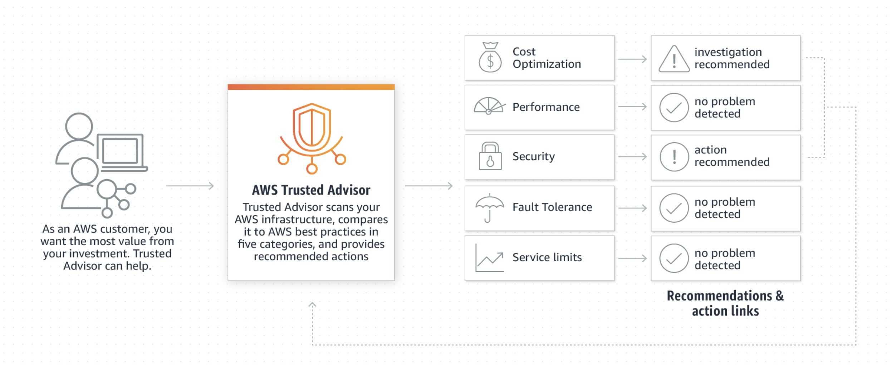

  [Conteudo Geral AWS Cloud][1]

[1]: https://github.com/weder96/aws-certification-learning

# Module 4: Cloud Security (AWS Security Services)

## Contents
1. <a href="#section-1"> Amazon Inspector </a>
2. <a href="#section-2"> Amazon Artifact </a>
3. <a href="#section-3"> Amazon GuardDuty</a>
4. <a href="#section-4"> Amazon WAF & AWS Shield</a>
5. <a href="#section-5"> Amazon Key Management Service (AWS KMS)</a>
6. <a href="#section-6"> Amazon CloudHSM</a>
7. <a href="#section-7"> Amazon Certificate Manager(ACM)</a>
8. <a href="#section-8"> Amazon Inspector and AWS Trusted Advisor</a>
9. <a href="#section-9"> Amazon Penetration Testing</a>
10. <a href="#section-10"> Amazon Single Sign-On (AWS SSO)</a>
11. <a href="#section-11"> Amazon Cognito</a>
12. <a href="#section-12"> Amazon Directory Services </a>
13. <a href="#section-13"> Amazon Systems Manager Parameter Store </a>
14. <a href="#section-14"> Amazon Secrets Manager </a>
15. <a href="#section-15"> Amazon Audit Manager </a>
16. <a href="#section-16"> Amazon Certificate Manager</a>   
17. <a href="#section-17"> Amazon Detective </a>
18. <a href="#section-18"> Amazon Firewall Manager </a>
19. <a href="#section-19"> Amazon Macie </a>
20. <a href="#section-20"> Amazon Network Firewall</a> 
21. <a href="#section-21"> Amazon Resource Access Manager (AWS RAM)</a> 
22. <a href="#section-22"> Amazon Security Hub  </a>
23. <a href="#section-23"> Amazon Shield </a>
24. <a href="#section-24"> Amazon WAF </a>
25. <a href="#section-99"> How do I report abuse of AWS resources? </a>

---------------------------------------------------------------------------------------
##  **1 - Amazon Inspector**

The AWS Cloud allows for a shared responsibility model.

AWS manages cloud security; you are responsible for security in the cloud.

You retain control of the security you choose to implement to protect your own content, platform, applications, systems and networks just as you would in an on-premises data center.

**Amazon Security Benefits**
- Keep your data safe – AWS infrastructure implements strong protections to help.
- Protect your privacy – All data is stored in highly secure AWS data centers.
- Meet compliance requirements – AWS manages dozens of compliance programs across its infrastructure. This means that your compliance segments have already been completed.
- Save money – reduce costs by using AWS data centers. Maintain the highest standard of security without having to manage your own facilities.
- Scale quickly – Security scales using the AWS Cloud. No matter the size of your business, the AWS infrastructure is designed to keep your data safe.

**Compliance**
AWS Cloud Compliance lets you understand the robust controls in place at AWS to keep your data safe and secure in the cloud.

As systems are built on top of the AWS Cloud infrastructure, compliance responsibilities will be shared.

Compliance programs include:
- Certifications / attestations.
- Laws, regulations and privacy.
- Alignments/frames.

**Cheat Sheets**

[https://digitalcloud.training/amazon-inspector/](https://digitalcloud.training/amazon-inspector/)

[https://tutorialsdojo.com/amazon-inspector/](https://tutorialsdojo.com/amazon-inspector/)

**References:**

[https://aws.amazon.com/pt/inspector/](https://aws.amazon.com/pt/inspector/)

[https://docs.aws.amazon.com/inspector/latest/userguide](https://docs.aws.amazon.com/inspector/latest/userguide)

[https://aws.amazon.com/inspector/pricing/](https://docs.aws.amazon.com/inspector/latest/userguide)

[https://aws.amazon.com/inspector/faqs/](https://docs.aws.amazon.com/inspector/latest/userguide)

**Videos**

---------------------------------------------------------------------------------------
##  **2 - Amazon Artifact**

[AWS Artifact](https://aws.amazon.com/en/artifact/) is your one-stop resource for compliance-related information that is important to you.

It provides on-demand access to AWS security and compliance reports and select online contracts.

Reports available on AWS Artifact include our reports for:
- Service Organization Control (SOC)
- Payment Card Industry (PCI) reports
- Certifications from accreditation bodies across geographies and compliance verticals that validate the implementation and operational effectiveness of AWS security controls.

Agreements available on [AWS Artifact](https://aws.amazon.com/en/artifact/) include the Business Associate Addendum (BAA) and Nondisclosure Agreement (NDA).

[AWS Artifact](https://aws.amazon.com/pt/artifact/) is the go-to, central resource for compliance-related information that matters to you. It provides on-demand access to AWS' security and compliance reports and select online agreements.

Reports available in [AWS Artifact](https://aws.amazon.com/en/artifact/) include Service Organization Control [(SOC) reports, Payment Card Industry (PCI) reports](https://aws.amazon. com/blogs/security/tag/aws-soc-reports/),
and certifications from accreditation bodies across geographies and vertical compliance that validate the implementation and operating effectiveness of AWS security controls.

**Cheat Sheets**

[https://tutorialsdojo.com/aws-artifact/](https://tutorialsdojo.com/aws-artifact/)

**References**

[https://aws.amazon.com/artifact/](https://aws.amazon.com/artifact/)

[https://docs.aws.amazon.com/artifact/latest/ug/what-is-aws-artifact.html](https://docs.aws.amazon.com/artifact/latest/ug/what-is-aws-artifact.html)

[https://aws.amazon.com/artifact/faq/](https://aws.amazon.com/artifact/faq/)

---------------------------------------------------------------------------------------
##  **3 - Amazon GuardDuty**

Amazon GuardDuty provides threat detection and continuous security monitoring for malicious or unauthorized behavior to help protect your AWS accounts and workloads.

Intelligent threat detection service.

Detects account compromise, instance compromise, malicious reconnaissance, and bucket compromise.

Continuous monitoring of events in:
- AWS CloudTrail Management Events.
- AWS CloudTrail S3 data events.
- Amazon VPC Flow Logs.
- DNS records.

**Cheat Sheets**
[https://digitalcloud.training/aws-guardduty/](https://digitalcloud.training/aws-guardduty/)

[https://tutorialsdojo.com/amazon-guardduty/](https://tutorialsdojo.com/amazon-guardduty/)

**References**

[https://aws.amazon.com/guardduty/](https://aws.amazon.com/guardduty/)

[https://aws.amazon.com/guardduty/faqs/](https://aws.amazon.com/guardduty/faqs/)

[https://docs.aws.amazon.com/guardduty/latest/ug/what-is-guardduty.html](https://docs.aws.amazon.com/guardduty/latest/ug/what-is-guardduty.html)

[https://www.youtube.com/watch?time_continue=7&v=o2YaIsps5LY](https://www.youtube.com/watch?time_continue=7&v=o2YaIsps5LY)

**Videos**

---------------------------------------------------------------------------------------
##  **4 - AWS WAF & AWS Shield**

**WAF:**
- AWS WAF is a web application firewall.
- Protects against common exploits that can compromise application availability, compromise security, or consume excessive resources.
- WAF allows you to create rules to filter web traffic based on conditions that include IP addresses, HTTP headers and body or custom URIs.
- WAF makes it easy to create rules that block common web exploits such as SQL injection and cross-site scripting.
- Rules are known as Web ACLs.

**AWS Shield**
- AWS Shield is a managed distributed denial-of-service (DDoS) protection service.
- Protects the web application running on AWS with always-on detection and automatic in-line mitigations.
Helps minimize application downtime and latency.
Two levels – Standard and Advanced.

---------------------------------------------------------------------------------------
##  **5 - AWS Key Management Service (AWS KMS)**

AWS Key Management Service gives you centralized control over the encryption keys used to protect your data.

You can create, import, toggle, disable, delete, set usage policies, and audit the usage of encryption keys used to encrypt your data.

The AWS Key Management Service is integrated with most other AWS services, making it easy to encrypt the data stored in those services with encryption keys that you control.

AWS KMS is integrated with AWS CloudTrail, which gives you the ability to audit who used which keys, on which resources, and when.

AWS KMS allows developers to easily encrypt data, either through one-click encryption in the AWS Management Console or using the AWS SDK to easily add encryption to application code.

**Cheat Sheets**

[https://digitalcloud.training/aws-kms/](https://digitalcloud.training/aws-kms/)

[https://tutorialsdojo.com/aws-key-management-service-aws-kms/](https://tutorialsdojo.com/aws-key-management-service-aws-kms/)

**References:**

[https://docs.aws.amazon.com/kms/latest/developerguide](https://docs.aws.amazon.com/kms/latest/developerguide)

[https://aws.amazon.com/kms/features/](https://aws.amazon.com/kms/features/)

[https://aws.amazon.com/kms/pricing/](https://aws.amazon.com/kms/pricing/)

[https://aws.amazon.com/kms/faqs/](https://aws.amazon.com/kms/faqs/)

**Videos**

---------------------------------------------------------------------------------------
##  **6 - AWS CloudHSM**

**AWS CloudHSM** is a cloud-based Hardware Security Module (HSM) that allows you to easily generate and use your own encryption keys in the AWS Cloud.

With CloudHSM, you can manage your own encryption keys using FIPS 140-2 Level 3 validated HSMs.

CloudHSM gives you the flexibility to integrate with your applications using industry-standard APIs such as PKCS#11, Java Cryptography Extensions (JCE), and Microsoft CryptoNG (CNG) libraries.

**Cheat Sheets**

[https://digitalcloud.training/aws-cloudhsm/](https://digitalcloud.training/aws-cloudhsm/)

**References**

**Videos**

---------------------------------------------------------------------------------------
##  **7 - AWS Certificate Manager**

**AWS Certificate Manager** is a service that allows you to easily provision, manage, and deploy public and private Secure Sockets Layer/Transport Layer Security (SSL/TLS) certificates for use with AWS services and their connected internal resources.

SSL/TLS certificates are used to secure network communications and establish the identity of websites on the Internet as well as resources on private networks.

AWS Certificate Manager removes the time-consuming manual process of purchasing, uploading, and renewing SSL/TLS certificates.

**Cheat Sheets**

**References**

**Videos**

https://tutorialsdojo.com/aws-certificate-manager/

---------------------------------------------------------------------------------------
##  **8 - AWS Inspector and AWS Trusted Advisor**

**AWS Inspector:**

**Inspector** is an automated security assessment service that helps improve the security and compliance of applications deployed on AWS.
The **Inspector** automatically assesses applications for vulnerabilities or deviations from best practices.
Uses an agent installed on EC2 instances.
Instances must be tagged.

**Trusted Advisor**
**Trusted Advisor** is an online resource that helps you reduce costs, increase performance, and improve security by optimizing your AWS environment.
**Trusted Advisor** provides real-time guidance to help you provision your resources following best practices.
The **Trusted Advisor** will advise you on cost optimization, performance, security and fault tolerance.

The **Trusted Advisor** checks your AWS infrastructure and compares it to AWS best practices in five categories:
- Cost Optimization.
- Performance.
- Safety.
- Fault tolerance.
- Service limits.

Trusted Advisor comes in two versions:
Core Checks and Recommendations (free):
- Access to top 7 checks to help increase security and performance.
- Checks include:
     - S3 bucket permissions;
     - Security Groups;
     - AMI use;
     - MFA on root account;
     - EBS public snapshots;
     - RDS public snapshots;

Trusted Advisor Full Benefits (Enterprise and Enterprise Support Plans):

Complete set of checks to help optimize your entire AWS infrastructure.
It advises on safety, performance, cost, fault tolerance and service limits.
Additional benefits include weekly update notifications, alerts, automated actions with CloudWatch, and programmatic access using the AWS Support API.

Trusted Advisor is an online resource that helps to reduce cost, increase performance and improve security by optimizing your AWS environment. Trusted Advisor provides real time guidance to help you provision your resources following best practices.

**Cheat Sheets**

**References**

**Videos**

---------------------------------------------------------------------------------------
##  **9 - Penetration Testing**

**Penetration Testing** is the practice of testing the security of the application itself for vulnerabilities, simulating an attack.

AWS allows **Penetration Testing**. There is a limited set of resources on which penetration testing can be performed.

**You do not need permission to perform penetration tests on the following services:**
- Amazon EC2 instances, NAT Gateways, and Elastic Load Balancers.
- Amazon RDS.
- Amazon CloudFront.
- Amazon Aurora.
- Amazon API Gateways.
- AWS Lambda and Lambda Edge functions.
- Amazon LightSail resources.
- Amazon Elastic Beanstalk environments.

You can read the full vulnerability and penetration testing support policy [here](https://aws.amazon.com/en/security/penetration-testing/) .

If an account is or could be compromised, AWS recommends that the following steps be taken:
1. Change your AWS root account password.
2. Change all IAM user's passwords.
3. Delete or rotate all programmatic (API) access keys.
4. Delete any resources in your account that you did not create.
5. Respond to any notifications you received from AWS through the AWS Support Center and/or contact AWS Support to open a support case.

**Cheat Sheets**

**References**

**Videos**

---------------------------------------------------------------------------------------
##  **10 - AWS Single Sign-On (AWS SSO)**

**AWS Single Sign-On (AWS SSO)** is a cloud-based single sign-on (SSO) service that makes it easy to centrally manage SSO access to all your AWS accounts and cloud applications.

It helps you manage SSO access and user permissions across all your AWS accounts in AWS Organizations.

AWS SSO also helps you manage access and permissions for commonly used third-party software-as-a-service (SaaS) applications, applications integrated with AWS SSO, as well as custom applications that support Security Assertion Markup Language (SAML) 2.0.

AWS SSO includes a user portal where your end users can find and access all assigned AWS accounts, cloud applications, and custom applications in one place.

**Cheat Sheets**

**References**

**Videos**

---------------------------------------------------------------------------------------
##  **11 - Amazon Cognito**

Amazon Cognito lets you add user enrollment, login, and access control to your web and mobile apps quickly and easily.

Amazon Cognito scales to millions of users and supports signing in with social identity providers such as Apple, Facebook, Google and Amazon, and corporate identity providers via SAML 2.0 and OpenID Connect.

The two main components of AWS Cognito are User Pools and Identity Pools:
- **User pools** are user directories that provide enrollment and sign-in options for your app users.
- **Identity pools** allow you to grant users access to other AWS services.

You can use identity pools and user pools separately or together.

**Cheat Sheets**

**References**

**Videos**

---------------------------------------------------------------------------------------
##  **12 - AWS Directory Services**

AWS provides several types of directories.

The following three types currently appear on the exam and will be covered on this page:
- Active Directory Service for Microsoft Active Directory.
- Simple AD.
- AD connector.

As an alternative to the AWS Directory service, you can create your own Microsoft AD DCs in the AWS cloud (on EC2).

The table below summarizes the directory services covered on this page, as well as a few others, and provides some typical use cases:

|Directory Service Option |Description |Use Case|
|-------------------------------|-----------|-----------|
|AWS Directory Service for Microsoft Active Directory |Full Microsoft AD managed by AWS running on Windows Server 2012 R2 |Enterprises that want hosted Microsoft AD or you need LDAP for Linux applications|
|AD Connector |Allows on-premises users to sign in to AWS services with their existing AD credentials. It also allows EC2 instances to join the AD domain |Single sign-on for local employees and to add EC2 instances to the domain|
|Simple AD |Low-scale, low-cost AD implementation based on Samba |Simple user directory or you need LDAP compatibility|

**Cheat Sheets**

**References**

**Videos**

---------------------------------------------------------------------------------------
##  **13 - AWS Systems Manager Parameter Store**
Provides secure, hierarchical storage for configuration data management and secret management.

It is highly scalable, available and durable.

You can store data such as passwords, database strings, and license codes as parameter values.

You can store values ​​as plain text (unencrypted data) or ciphertext (encrypted data).

You can then reference values ​​using the unique name you specified when you created the parameter.

**Cheat Sheets**

**References**

**Videos**

---------------------------------------------------------------------------------------
##  **14 - AWS Secrets Manager**

As Parameter Store.

Allows native and automatic key rotation.

Fine-grained permissions.

Central audit for secret rotation.

**Cheat Sheets**

**References**

**Videos**

---------------------------------------------------------------------------------------
##  **15 - Amazon Audit Manager**

**Cheat Sheets**

**References**

**Videos**

---------------------------------------------------------------------------------------
##  **16 - Amazon Certificate Manager**

**Cheat Sheets**

**References**

**Videos**

---------------------------------------------------------------------------------------
##  **17 - Amazon Detective**

**Cheat Sheets**

**References**

**Videos**

---------------------------------------------------------------------------------------
##  **18 - Amazon Firewall Manager**

---------------------------------------------------------------------------------------
##  **19 - Amazon Macie**

**Cheat Sheets**

**References**

**Videos**

---------------------------------------------------------------------------------------
##  **20 - Amazon Network Firewall**

**Cheat Sheets**

**References**

**Videos**

---------------------------------------------------------------------------------------
##  **21 - Amazon Resource Access Manager (AWS RAM)**

**Cheat Sheets**

**References**

**Videos**

---------------------------------------------------------------------------------------
##  **22 - Amazon Security Hub**

**Cheat Sheets**

**References**

**Videos**

---------------------------------------------------------------------------------------
##  **23 - Amazon Shield**

**Cheat Sheets**

**References**

**Videos**

---------------------------------------------------------------------------------------
##  **24 - Amazon WAF**

**Cheat Sheets**

**References**

**Videos**

---------------------------------------------------------------------------------------
##  **25 -  How do I report abuse of AWS resources?**

### **I suspect that AWS resources are used for abusive or illegal purposes. How do I let AWS know?** [here](https://aws.amazon.com/pt/premiumsupport/knowledge-center/report-aws-abuse/)

**Resolution:**
The AWS Trust & Safety team can assist you when AWS resources are used to engage in the following types of abusive behavior:
- **Spam:** You are receiving unwanted emails from an AWS-owned IP address, or AWS resources are used to spam websites or forums.
- **Port scanning:** Your logs show that one or more AWS-owned IP addresses are sending packets to multiple ports on your server. You also believe this is an attempt to discover unsecured ports.
- **Denial-of-service (DoS) attacks:** Your logs show that one or more AWS-owned IP addresses are used to flood ports on your resources with packets. You also believe that this is an attempt to overwhelm or crash your server or the software running on your server.
- **Intrusion attempts:** Your logs show that one or more AWS-owned IP addresses are used to attempt to log in to your resources.
- **Hosting prohibited content:** You have evidence that AWS resources are used to host or distribute prohibited content, such as illegal content or copyrighted content without the consent of the copyright holder.
- **Distributing malware:** You have evidence that AWS resources are used to distribute software that was knowingly created to compromise or cause harm to computers or machines that it's installed on.

If you suspect that AWS resources are used for abusive purposes, contact the AWS Trust & Safety team using the Report Amazon AWS abuse form, or by contacting abuse@amazonaws.com. Provide all the necessary information, including logs in plaintext, email headers, and so on, when you submit your request.

The AWS Trust & Safety team will use the information that you provide in this form to investigate and attempt to resolve the incident you have reported. We might share your information, if it is necessary for the investigation of your report.

Note: AWS Support can't assist with reports of abuse or questions about notifications from the AWS Trust & Safety team. If you have questions for the AWS Trust & Safety team, reply directly to their email.

If you suspect that AWS resources are used for abusive purposes, contact the AWS Trust & Safety team using the Report Amazon AWS abuse form, or by contacting abuse@amazonaws.com. Provide all the necessary information, including logs in plaintext, email headers, and so on, when you submit your request.
AWS Trust & Safety team.

