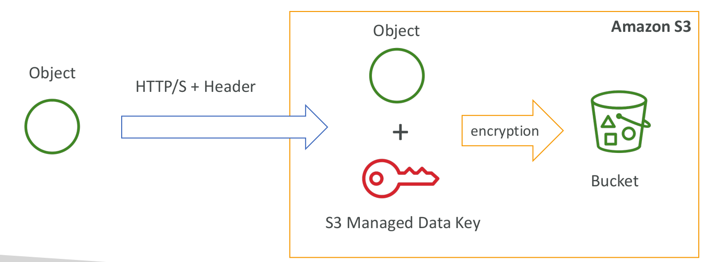
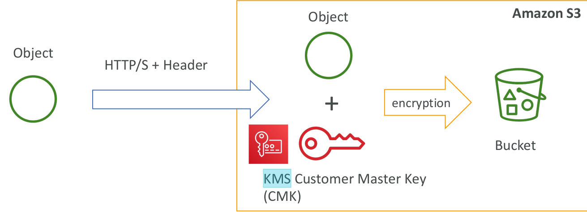
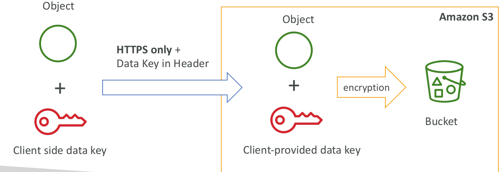
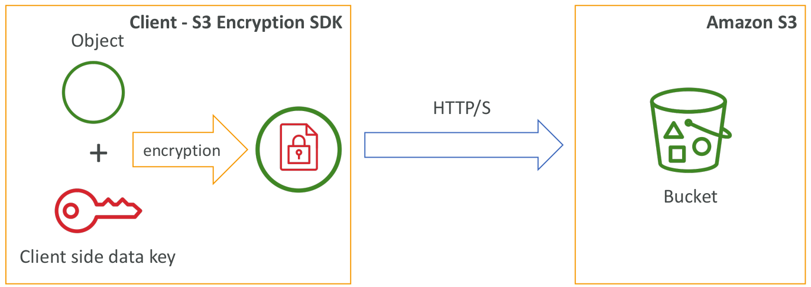

  [General Content AWS Cloud][1]

[1]: https://github.com/weder96/aws-certification-learning

# Module 4: Cloud Security (AWS Security Services)

## Contents
1. <a href="#section-01"> Amazon Inspector </a>
2. <a href="#section-02"> Amazon Artifact </a>
3. <a href="#section-03"> Amazon GuardDuty</a>
4. <a href="#section-04"> Amazon WAF & AWS Shield</a>
5. <a href="#section-05"> Amazon Key Management Service (AWS KMS)</a>
6. <a href="#section-06"> Amazon CloudHSM</a>
7. <a href="#section-07"> Amazon Certificate Manager(ACM)</a>
8. <a href="#section-08"> Amazon Inspector and AWS Trusted Advisor</a>
9. <a href="#section-09"> Amazon Penetration Testing</a>
10. <a href="#section-10"> Amazon Single Sign-On (AWS SSO)</a>
11. <a href="#section-11"> Amazon Cognito</a>
12. <a href="#section-12"> Amazon Directory Services </a>
13. <a href="#section-13"> Amazon Systems Manager Parameter Store </a>
14. <a href="#section-14"> Amazon Secrets Manager </a>
15. <a href="#section-15"> Amazon Audit Manager </a>
16. <a href="#section-16"> Amazon Certificate Manager</a>   
17. <a href="#section-17"> Amazon Detective </a>
18. <a href="#section-18"> Amazon Firewall Manager </a>
19. <a href="#section-19"> Amazon Macie </a>
20. <a href="#section-20"> Amazon Network Firewall</a> 
21. <a href="#section-21"> Amazon Resource Access Manager (AWS RAM)</a> 
22. <a href="#section-22"> Amazon Security Hub  </a>
23. <a href="#section-23"> Amazon Shield </a>
24. <a href="#section-24"> Amazon WAF </a>
25. <a href="#section-25"> AWS account root user </a>
26. <a href="#section-26"> Compliance Programs </a>
27. <a href="#section-27"> Encryption and Unencrypted</a>
99. <a href="#section-99"> How do I report abuse of AWS resources? </a>

---------------------------------------------------------------------------------------
##  **1 - Amazon Inspector**

The AWS Cloud allows for a shared responsibility model.

AWS manages cloud security; you are responsible for security in the cloud.

You retain control of the security you choose to implement to protect your own content, platform, applications, systems and networks just as you would in an on-premises data center.

**Amazon Security Benefits**
- Keep your data safe – AWS infrastructure implements strong protections to help.
- Protect your privacy – All data is stored in highly secure AWS data centers.
- Meet compliance requirements – AWS manages dozens of compliance programs across its infrastructure. This means that your compliance segments have already been completed.
- Save money – reduce costs by using AWS data centers. Maintain the highest standard of security without having to manage your own facilities.
- Scale quickly – Security scales using the AWS Cloud. No matter the size of your business, the AWS infrastructure is designed to keep your data safe.

**Compliance**
AWS Cloud Compliance lets you understand the robust controls in place at AWS to keep your data safe and secure in the cloud.

As systems are built on top of the AWS Cloud infrastructure, compliance responsibilities will be shared.

Compliance programs include:
- Certifications / attestations.
- Laws, regulations and privacy.
- Alignments/frames.

**Cheat Sheets**

[https://digitalcloud.training/amazon-inspector/](https://digitalcloud.training/amazon-inspector/)

[https://tutorialsdojo.com/amazon-inspector/](https://tutorialsdojo.com/amazon-inspector/)

**References:**

[https://aws.amazon.com/pt/inspector/](https://aws.amazon.com/pt/inspector/)

[https://docs.aws.amazon.com/inspector/latest/userguide](https://docs.aws.amazon.com/inspector/latest/userguide)

[https://aws.amazon.com/inspector/pricing/](https://docs.aws.amazon.com/inspector/latest/userguide)

[https://aws.amazon.com/inspector/faqs/](https://docs.aws.amazon.com/inspector/latest/userguide)

**Videos**

https://www.youtube.com/watch?v=Nx8s7lwapoE

https://www.youtube.com/watch?v=05zUYbJ9hC8

https://www.youtube.com/watch?v=F1-hvgZyw80

https://www.youtube.com/results?search_query=aws+inspector

---------------------------------------------------------------------------------------
##  **2 - Amazon Artifact**

[AWS Artifact](https://aws.amazon.com/en/artifact/) is your one-stop resource for compliance-related information that is important to you.

It provides on-demand access to AWS security and compliance reports and select online contracts.

Reports available on AWS Artifact include our reports for:
- Service Organization Control (SOC)
- Payment Card Industry (PCI) reports
- Certifications from accreditation bodies across geographies and compliance verticals that validate the implementation and operational effectiveness of AWS security controls.

Agreements available on [AWS Artifact](https://aws.amazon.com/en/artifact/) include the Business Associate Addendum (BAA) and Nondisclosure Agreement (NDA).

[AWS Artifact](https://aws.amazon.com/pt/artifact/) is the go-to, central resource for compliance-related information that matters to you. It provides on-demand access to AWS' security and compliance reports and select online agreements.

Reports available in [AWS Artifact](https://aws.amazon.com/en/artifact/) include Service Organization Control [(SOC) reports, Payment Card Industry (PCI) reports](https://aws.amazon. com/blogs/security/tag/aws-soc-reports/),
and certifications from accreditation bodies across geographies and vertical compliance that validate the implementation and operating effectiveness of AWS security controls.

AWS Artifact, available in the console, is a self-service audit artifact retrieval portal that provides our customers with on-demand access to AWS’ compliance documentation and AWS agreements.

You can use AWS Artifact Reports to download AWS security and compliance documents, such as AWS ISO certifications, Payment Card Industry (PCI), and System and Organization Control (SOC) reports.

**Cheat Sheets**

[https://tutorialsdojo.com/aws-artifact/](https://tutorialsdojo.com/aws-artifact/)

https://digitalcloud.training/aws-security-services/

**References**

[https://aws.amazon.com/artifact/](https://aws.amazon.com/artifact/)

[https://docs.aws.amazon.com/artifact/latest/ug/what-is-aws-artifact.html](https://docs.aws.amazon.com/artifact/latest/ug/what-is-aws-artifact.html)

[https://aws.amazon.com/artifact/faq/](https://aws.amazon.com/artifact/faq/)

**Videos**

https://www.youtube.com/results?search_query=aws+artifact

https://www.youtube.com/watch?v=u5UV-wr-lIA

https://www.youtube.com/watch?v=lCUATy4emgY

---------------------------------------------------------------------------------------
##  **3 - Amazon GuardDuty**

Amazon GuardDuty provides threat detection and continuous security monitoring for malicious or unauthorized behavior to help protect your AWS accounts and workloads.

Intelligent threat detection service.

Detects account compromise, instance compromise, malicious reconnaissance, and bucket compromise.

Continuous monitoring of events in:
- AWS CloudTrail Management Events.
- AWS CloudTrail S3 data events.
- Amazon VPC Flow Logs.
- DNS records.

**Cheat Sheets**

[https://digitalcloud.training/aws-guardduty/](https://digitalcloud.training/aws-guardduty/)

[https://tutorialsdojo.com/amazon-guardduty/](https://tutorialsdojo.com/amazon-guardduty/)

**References**

[https://aws.amazon.com/guardduty/](https://aws.amazon.com/guardduty/)

[https://aws.amazon.com/guardduty/faqs/](https://aws.amazon.com/guardduty/faqs/)

[https://docs.aws.amazon.com/guardduty/latest/ug/what-is-guardduty.html](https://docs.aws.amazon.com/guardduty/latest/ug/what-is-guardduty.html)

[https://www.youtube.com/watch?time_continue=7&v=o2YaIsps5LY](https://www.youtube.com/watch?time_continue=7&v=o2YaIsps5LY)

**Videos**

https://www.youtube.com/results?search_query=amazon+guardduty

https://www.youtube.com/watch?v=mKJ_ndS8q6M

---------------------------------------------------------------------------------------
##  **4 - AWS WAF & AWS Shield**

**WAF:**
- AWS WAF is a web application firewall.
- Protects against common exploits that can compromise application availability, compromise security, or consume excessive resources.
- WAF allows you to create rules to filter web traffic based on conditions that include IP addresses, HTTP headers and body or custom URIs.
- WAF makes it easy to create rules that block common web exploits such as SQL injection and cross-site scripting.
- Rules are known as Web ACLs.

**AWS Shield**
- AWS Shield is a managed distributed denial-of-service (DDoS) protection service.
- Protects the web application running on AWS with always-on detection and automatic in-line mitigations.
Helps minimize application downtime and latency.
Two levels – Standard and Advanced.

**AWS Shield Standard:**
- Free service that is activated for every AWS customer
- Provides protection from attacks such as SYN/UDP Floods, Reflection attacks and other layer 3/layer 4 attacks

**AWS Shield Advanced:**
- Optional DDoS mitigation service ($3,000 per month per organization)
- Protect against more sophisticated attack on: 
     - Amazon EC2
     - Elastic Load Balancing (ELB)
     - Amazon CloudFront
     - AWS Global Accelerator
     - Route 53

- 24/7 access to AWS DDoS response team (DRP)
- Protect against higher fees during usage spikes due to DDoS

**Cheat Sheets**

https://digitalcloud.training/aws-waf-shield/

https://tutorialsdojo.com/aws-shield/

https://tutorialsdojo.com/aws-waf/

**References:**

https://aws.amazon.com/shield/features/

https://aws.amazon.com/shield/pricing/

https://aws.amazon.com/shield/faqs/

https://docs.aws.amazon.com/waf/latest/developerguide

https://aws.amazon.com/waf/features/

https://aws.amazon.com/waf/pricing/

https://aws.amazon.com/waf/faqs/

**Videos**

https://www.youtube.com/results?search_query=aws+Shield

https://www.youtube.com/watch?v=ZeT5_ZfXMPY

---------------------------------------------------------------------------------------
##  **5 - AWS Key Management Service (AWS KMS)**

AWS Key Management Service gives you centralized control over the encryption keys used to protect your data.

You can create, import, toggle, disable, delete, set usage policies, and audit the usage of encryption keys used to encrypt your data.

The AWS Key Management Service is integrated with most other AWS services, making it easy to encrypt the data stored in those services with encryption keys that you control.

AWS KMS is integrated with AWS CloudTrail, which gives you the ability to audit who used which keys, on which resources, and when.

AWS KMS allows developers to easily encrypt data, either through one-click encryption in the AWS Management Console or using the AWS SDK to easily add encryption to application code.

### **KMS – Customer Master Key (CMK) Types**

- **Symmetric (AES-256 keys)**
     - First offering of KMS, single encryption key that is used to Encrypt and Decrypt
     - AWS services that are integrated with KMS use Symmetric CMKs
     - Necessary for envelope encryption
     - You never get access to the Key unencrypted (must call KMS API to use)

- **Asymmetric (RSA & ECC key pairs)**
     - Public (Encrypt) and Private Key (Decrypt) pair
     - Used for Encrypt/Decrypt, or Sign/Verify operations
     - The public key is downloadable, but you can’t access the Private Key unencrypted
     - Use case: encryption outside of AWS by users who can’t call the KMS API

- **Able to fully manage the keys & policies:**
     - Create
     - Rotation policies
     - Disable
     - Enable

- **Able to audit key usage (using CloudTrail)**
- **Three types of Customer Master Keys (CMK):**
     - AWS Managed Service Default CMK: free
     - User Keys created in KMS: $1 / month
     - User Keys imported (must be 256-bit symmetric key): $1 / month

- **pay for API call to KMS ($0.03 / 10000 calls)**

**Cheat Sheets**

[https://digitalcloud.training/aws-kms/](https://digitalcloud.training/aws-kms/)

[https://tutorialsdojo.com/aws-key-management-service-aws-kms/](https://tutorialsdojo.com/aws-key-management-service-aws-kms/)

**References:**

[https://docs.aws.amazon.com/kms/latest/developerguide](https://docs.aws.amazon.com/kms/latest/developerguide)

[https://aws.amazon.com/kms/features/](https://aws.amazon.com/kms/features/)

[https://aws.amazon.com/kms/pricing/](https://aws.amazon.com/kms/pricing/)

[https://aws.amazon.com/kms/faqs/](https://aws.amazon.com/kms/faqs/)

**Videos**

---------------------------------------------------------------------------------------
##  **6 - AWS CloudHSM**

**AWS CloudHSM** is a cloud-based Hardware Security Module (HSM) that allows you to easily generate and use your own encryption keys in the AWS Cloud.

With CloudHSM, you can manage your own encryption keys using FIPS 140-2 Level 3 validated HSMs.

CloudHSM gives you the flexibility to integrate with your applications using industry-standard APIs such as PKCS#11, Java Cryptography Extensions (JCE), and Microsoft CryptoNG (CNG) libraries.

**Cheat Sheets**

https://tutorialsdojo.com/aws-cloudhsm/

[https://digitalcloud.training/aws-cloudhsm/](https://digitalcloud.training/aws-cloudhsm/)

**References**

https://aws.amazon.com/cloudhsm/

https://docs.aws.amazon.com/cloudhsm/latest/userguide/introduction.html

**Videos**

https://www.youtube.com/results?search_query=amazon+cloudsm

https://www.youtube.com/watch?v=BLnuUtjJNLE

https://www.youtube.com/watch?v=5RRDhNZ6cO0

---------------------------------------------------------------------------------------
##  **7 - AWS Certificate Manager**

**AWS Certificate Manager** is a service that allows you to easily provision, manage, and deploy public and private Secure Sockets Layer/Transport Layer Security (SSL/TLS) certificates for use with AWS services and their connected internal resources.

SSL/TLS certificates are used to secure network communications and establish the identity of websites on the Internet as well as resources on private networks.

AWS Certificate Manager removes the time-consuming manual process of purchasing, uploading, and renewing SSL/TLS certificates.

**Cheat Sheets**

**References**

**Videos**

https://tutorialsdojo.com/aws-certificate-manager/

---------------------------------------------------------------------------------------
##  **8 - AWS Inspector and AWS Trusted Advisor**

**AWS Inspector:**

**Inspector** is an automated security assessment service that helps improve the security and compliance of applications deployed on AWS.
The **Inspector** automatically assesses applications for vulnerabilities or deviations from best practices.
Uses an agent installed on EC2 instances.
Instances must be tagged.

**Trusted Advisor**
**Trusted Advisor** is an online resource that helps you reduce costs, increase performance, and improve security by optimizing your AWS environment.
**Trusted Advisor** provides real-time guidance to help you provision your resources following best practices.
The **Trusted Advisor** will advise you on cost optimization, performance, security and fault tolerance.

The **Trusted Advisor** checks your AWS infrastructure and compares it to AWS best practices in five categories:
- Cost Optimization.
- Performance.
- Safety.
- Fault tolerance.
- Service limits.

Trusted Advisor comes in two versions:
Core Checks and Recommendations (free):
- Access to top 7 checks to help increase security and performance.
- Checks include:
     - S3 bucket permissions;
     - Security Groups;
     - AMI use;
     - MFA on root account;
     - EBS public snapshots;
     - RDS public snapshots;

Trusted Advisor Full Benefits (Enterprise and Enterprise Support Plans):

Complete set of checks to help optimize your entire AWS infrastructure.
It advises on safety, performance, cost, fault tolerance and service limits.
Additional benefits include weekly update notifications, alerts, automated actions with CloudWatch, and programmatic access using the AWS Support API.

AWS Trusted Advisor can improve the performance of your service by checking your service limits, ensuring you take advantage of provisioned throughput, and monitoring for overutilized instances.

Trusted Advisor is an online resource that helps to reduce cost, increase performance and improve security by optimizing your AWS environment. Trusted Advisor provides real time guidance to help you provision your resources following best practices.

**Cheat Sheets**

https://digitalcloud.training/aws-security-services/

**References**

https://aws.amazon.com/premiumsupport/technology/trusted-advisor/

**Videos**

---------------------------------------------------------------------------------------
##  **9 - Penetration Testing**

**Penetration Testing** is the practice of testing the security of the application itself for vulnerabilities, simulating an attack.

AWS allows **Penetration Testing**. There is a limited set of resources on which penetration testing can be performed.

**You do not need permission to perform penetration tests on the following services:**
- Amazon EC2 instances, NAT Gateways, and Elastic Load Balancers.
- Amazon RDS.
- Amazon CloudFront.
- Amazon Aurora.
- Amazon API Gateways.
- AWS Lambda and Lambda Edge functions.
- Amazon LightSail resources.
- Amazon Elastic Beanstalk environments.

You can read the full vulnerability and penetration testing support policy [here](https://aws.amazon.com/en/security/penetration-testing/) .

If an account is or could be compromised, AWS recommends that the following steps be taken:
1. Change your AWS root account password.
2. Change all IAM user's passwords.
3. Delete or rotate all programmatic (API) access keys.
4. Delete any resources in your account that you did not create.
5. Respond to any notifications you received from AWS through the AWS Support Center and/or contact AWS Support to open a support case.

**Cheat Sheets**

**References**

**Videos**

---------------------------------------------------------------------------------------
##  **10 - AWS Single Sign-On (AWS SSO)**

**AWS Single Sign-On (AWS SSO)** is a cloud-based single sign-on (SSO) service that makes it easy to centrally manage SSO access to all your AWS accounts and cloud applications.

It helps you manage SSO access and user permissions across all your AWS accounts in AWS Organizations.

AWS SSO also helps you manage access and permissions for commonly used third-party software-as-a-service (SaaS) applications, applications integrated with AWS SSO, as well as custom applications that support Security Assertion Markup Language (SAML) 2.0.

AWS SSO includes a user portal where your end users can find and access all assigned AWS accounts, cloud applications, and custom applications in one place.

**Cheat Sheets**

**References**

**Videos**

---------------------------------------------------------------------------------------
##  **11 - Amazon Cognito**

Amazon Cognito lets you add user enrollment, login, and access control to your web and mobile apps quickly and easily.

Amazon Cognito scales to millions of users and supports signing in with social identity providers such as Apple, Facebook, Google and Amazon, and corporate identity providers via SAML 2.0 and OpenID Connect.

The two main components of AWS Cognito are User Pools and Identity Pools:
- **User pools** are user directories that provide enrollment and sign-in options for your app users.
- **Identity pools** allow you to grant users access to other AWS services.

You can use identity pools and user pools separately or together.

**Cheat Sheets**

https://tutorialsdojo.com/amazon-cognito/

https://digitalcloud.training/amazon-cognito/

**References**

https://aws.amazon.com/cognito/

https://aws.amazon.com/cognito/faqs/

https://docs.aws.amazon.com/cognito/latest/developerguide/what-is-amazon-cognito.html

**Videos**

https://www.youtube.com/results?search_query=amazon+cognito

https://www.youtube.com/watch?v=KWjgiNgDfwI

https://www.youtube.com/watch?v=OAR4ZHP8DEg

---------------------------------------------------------------------------------------
##  **12 - AWS Directory Services**

AWS provides several types of directories.

The following three types currently appear on the exam and will be covered on this page:
- Active Directory Service for Microsoft Active Directory.
- Simple AD.
- AD connector.

As an alternative to the AWS Directory service, you can create your own Microsoft AD DCs in the AWS cloud (on EC2).

The table below summarizes the directory services covered on this page, as well as a few others, and provides some typical use cases:

|Directory Service Option |Description |Use Case|
|-------------------------------|-----------|-----------|
|AWS Directory Service for Microsoft Active Directory |Full Microsoft AD managed by AWS running on Windows Server 2012 R2 |Enterprises that want hosted Microsoft AD or you need LDAP for Linux applications|
|AD Connector |Allows on-premises users to sign in to AWS services with their existing AD credentials. It also allows EC2 instances to join the AD domain |Single sign-on for local employees and to add EC2 instances to the domain|
|Simple AD |Low-scale, low-cost AD implementation based on Samba |Simple user directory or you need LDAP compatibility|

**Cheat Sheets**

https://tutorialsdojo.com/aws-directory-service/

https://digitalcloud.training/aws-directory-services/

**References**

https://aws.amazon.com/directoryservice/features/?nc=sn&loc=2

https://aws.amazon.com/directoryservice/pricing/?nc=sn&loc=3

https://aws.amazon.com/directoryservice/faqs/?nc=sn&loc=5

https://docs.aws.amazon.com/clouddirectory/latest/developerguide/what_is_cloud_directory.html

https://docs.aws.amazon.com/directoryservice/latest/admin-guide/what_is.html

https://docs.aws.amazon.com/clouddirectory/latest/developerguide/what_is_cloud_directory.html

**Videos**

https://www.youtube.com/results?search_query=aws+Directory+Service

https://www.youtube.com/watch?v=AIdUw0i8rr0&t=2s

https://www.youtube.com/watch?v=AxfAkGDTNRA

---------------------------------------------------------------------------------------
##  **13 - AWS Systems Manager Parameter Store**
Provides secure, hierarchical storage for configuration data management and secret management.

It is highly scalable, available and durable.

You can store data such as passwords, database strings, and license codes as parameter values.

You can store values ​​as plain text (unencrypted data) or ciphertext (encrypted data).

You can then reference values ​​using the unique name you specified when you created the parameter.

**Cheat Sheets**

**References**

**Videos**

---------------------------------------------------------------------------------------
##  **14 - AWS Secrets Manager**

**Definitions**

- A **secret management service** that enables you to easily rotate, manage, and retrieve database credentials, API keys, and other secrets throughout their lifecycle.

#### **Features**

- **AWS Secrets Manager** encrypts secrets at rest using encryption keys that you own and store in AWS Key Management Service [customer managed keys]. When you retrieve a secret, Secrets Manager decrypts the secret and transmits it securely over TLS to your local environment.

You can rotate secrets on a schedule or on demand by using the Secrets Manager console, AWS SDK, or AWS CLI.

Secrets Manager natively supports rotating credentials for databases hosted on Amazon RDS and Amazon DocumentDB and clusters hosted on Amazon Redshift.
You can extend Secrets Manager to rotate other secrets, such as credentials for Oracle databases hosted on EC2 or OAuth refresh tokens, by using custom AWS 

**Lambda functions.**

A secret consists of a set of credentials (user name and password), and the connection details used to access a secured service.

**Security**

- By default, Secrets Manager does not write or cache the secret to persistent storage.
- By default, Secrets Manager only accepts requests from hosts that use the open standard Transport Layer Security (TLS) and Perfect Forward Secrecy.
- You can control access to the secret using AWS Identity and Access Management (IAM) policies. 
- You can tag secrets individually and apply tag-based access controls.
- You can configure VPC endpoints to keep traffic between your VPC and Secrets Manager within the AWS network.
- Secrets Manager does not immediately delete secrets. Instead, Secrets Manager immediately makes the secrets inaccessible and scheduled for deletion after a recovery window of a minimum of seven days. Until the recovery window ends, you can recover a secret you previously deleted. 
- By using the CLI, you can delete a secret without a recovery window.
Compliance

Secrets Manager is HIPAA, PCI DSS and ISO, SOC, FedRAMP, DoD SRG, IRAP, and OSPAR compliant.

**Pricing**
- You pay based on the number of secrets stored and API calls made per month.

**Cheat Sheets**

https://tutorialsdojo.com/aws-secrets-manager/

**References**

https://aws.amazon.com/secrets-manager/

https://aws.amazon.com/secrets-manager/faqs/

https://docs.aws.amazon.com/secretsmanager/latest/userguide/intro.html

**Videos**

https://www.youtube.com/results?search_query=AWS+Secrets+Manager

**Hands On**

https://www.youtube.com/results?search_query=AWS+Secrets+Manager+Hands+on

---------------------------------------------------------------------------------------
##  **15 - Amazon Audit Manager**

**Cheat Sheets**

https://tutorialsdojo.com/aws-audit-manager/

**References**

https://aws.amazon.com/audit-manager/

https://docs.aws.amazon.com/audit-manager/latest/userguide/what-is.html

**Videos**

https://www.youtube.com/results?search_query=amazon+audit-manager

https://www.youtube.com/watch?v=G4yRj4nLwFI

https://www.youtube.com/watch?v=UH9sDD9UT38

---------------------------------------------------------------------------------------
##  **16 - Amazon Certificate Manager**

**Cheat Sheets**

**References**

**Videos**

---------------------------------------------------------------------------------------
##  **17 - Amazon Detective**

**Cheat Sheets**

https://tutorialsdojo.com/amazon-detective/

**References**

https://aws.amazon.com/detective/

https://aws.amazon.com/detective/faqs/

https://docs.aws.amazon.com/detective/latest/adminguide/what-is-detective.html

https://docs.aws.amazon.com/detective/latest/userguide/detective-investigation-about.html

**Videos**

https://www.youtube.com/results?search_query=amazon+detective

https://www.youtube.com/watch?v=Rz8MvzPfTZA

---------------------------------------------------------------------------------------
##  **18 - Amazon Firewall Manager**

**Cheat Sheets**

https://tutorialsdojo.com/aws-firewall-manager/

https://digitalcloud.training/aws-security-services/

**References**

https://aws.amazon.com/firewall-manager/features/

https://aws.amazon.com/firewall-manager/pricing/

https://aws.amazon.com/firewall-manager/faqs/

https://docs.aws.amazon.com/whitepapers/latest/aws-best-practices-ddos-resiliency/mitigation-techniques.html

**Videos**

https://www.youtube.com/results?search_query=aws+firewall+manager

https://www.youtube.com/watch?v=1nir_Mdy3bQ

---------------------------------------------------------------------------------------
##  **19 - Amazon Macie**

Amazon Macie is a fully managed data security and data privacy service that uses machine learning and pattern matching to discover and protect your sensitive data in AWS. Amazon Macie automates the discovery of sensitive data at scale and lowers the cost of protecting your data.

Macie automatically provides an inventory of Amazon S3 buckets including a list of unencrypted buckets, publicly accessible buckets, and buckets shared with AWS accounts outside those you have defined in AWS Organizations.

Then, Macie applies machine learning and pattern matching techniques to the buckets you select to identify and alert you to sensitive data, such as personally identifiable information (PII).

**Cheat Sheets**

https://tutorialsdojo.com/amazon-macie/

https://digitalcloud.training/aws-security-services/

**References**

https://aws.amazon.com/macie/

https://docs.aws.amazon.com/macie/latest/userguide/what-is-macie.html

https://aws.amazon.com/macie/faq/

https://www.youtube.com/watch?v=LCjX2rsQ2wA

**Videos**

https://www.youtube.com/watch?v=ogVamzF2Dzk

---------------------------------------------------------------------------------------
##  **20 - Amazon Network Firewall**

**Cheat Sheets**

https://tutorialsdojo.com/aws-network-firewall/

**References**

https://aws.amazon.com/network-firewall/

**Videos**

https://www.youtube.com/results?search_query=Amazon+Network+Firewall

https://www.youtube.com/watch?v=WNFknf9zyZg

---------------------------------------------------------------------------------------
##  **21 - Amazon Resource Access Manager (AWS RAM)**

**Cheat Sheets**

**References**

**Videos**

---------------------------------------------------------------------------------------
##  **22 - Amazon Security Hub**

**Cheat Sheets**

**References**

**Videos**

---------------------------------------------------------------------------------------
##  **23 - Amazon Shield**

**Definitions**

Shield Tiers and Features

**Standard**

- All AWS customers benefit from the automatic protections of Shield Standard.
- Shield Standard provides always-on network flow monitoring which inspects incoming traffic to AWS and detect malicious traffic in real-time.
- Uses several techniques like deterministic packet filtering, and priority based traffic shaping to automatically mitigate attacks without impact to your applications.
- When you use Shield Standard with CloudFront and Route 53, you receive comprehensive availability protection against all known infrastructure attacks.
- You can also view all the events detected and mitigated by AWS Shield in your account.

**Advanced**

- Shield Advanced provides enhanced detection, inspecting network flows and also monitoring application layer traffic to your Elastic IP address, Elastic Load Balancing, CloudFront, or Route 53 resources.
- It handles the majority of DDoS protection and mitigation responsibilities for layer 3, layer 4, and layer 7 attacks.
- You have 24×7 access to the AWS DDoS Response Team. To contact the DDoS Response Team, customers will need the  Enterprise or Business Support levels of AWS Premium Support.
- It automatically provides additional mitigation capacity to protect against larger DDoS attacks. The DDoS Response Team also applies manual mitigations for more complex and sophisticated DDoS attacks.
- It gives you complete visibility into DDoS attacks with near real-time notification via CloudWatch and detailed diagnostics on the “AWS WAF and AWS Shield” Management Console.
- Shield Advanced comes with “DDoS cost protection”, a safeguard from scaling charges as a result of a DDoS attack that cause usage spikes on your AWS services. It does so by providing service credits for charges due to usage spikes.
- It is available globally on all CloudFront and Route 53 edge locations. 
- With Shield Advanced you will be able to see the history of all incidents in the trailing 13 months.

### **Pricing**
- Shield Standard provides protection at no additional charge.
- Shield Advanced, however, is a paid service. It requires a 1-year subscription commitment and charges a monthly fee, plus a usage fee based on data transfer out from CloudFront, ELB, EC2, and AWS Global Accelerator.

**Cheat Sheets**

https://digitalcloud.training/aws-waf-shield/

https://tutorialsdojo.com/aws-shield/

**References**
https://aws.amazon.com/shield/features/

https://aws.amazon.com/shield/pricing/

https://aws.amazon.com/shield/faqs/

**Videos**

https://www.youtube.com/results?search_query=Amazon+Shield

**Hands on**

https://www.youtube.com/results?search_query=Amazon+Shield+hands+On

---------------------------------------------------------------------------------------
##  **24 - Amazon WAF**

**Cheat Sheets**

**References**

**Videos**
##  **25 - AWS account root user**

Some tasks can only be performed by the root user of an AWS account. This includes changing the account name and changing AWS support plans. For more information view the AWS article referenced below.

* "Changing the account name" is a correct answer.

* "Changing AWS Support plans" is also a correct answer.

**Cheat Sheets**

https://digitalcloud.training/aws-identity-and-access-management/

**References**

https://docs.aws.amazon.com/general/latest/gr/root-vs-iam.html

**Videos**

---------------------------------------------------------------------------------------
##  **26 - Compliance Programs**

AWS enables covered entities and their business associates subject to the U.S. Health Insurance 

Portability and Accountability Act of 1996 (HIPAA) to use the secure AWS environment to process, maintain, and store protected health information.

**Cheat Sheets**

https://digitalcloud.training/aws-identity-and-access-management/

**References**

https://aws.amazon.com/compliance/programs/

https://aws.amazon.com/compliance/hipaa-compliance/

**Videos**

--------------------------------------------------------------------------------------------------------------
##  **27 - Encryption and Unencrypted**

AWS enables covered entities and their business associates subject to the U.S. Health Insurance 

Portability and Accountability Act of 1996 (HIPAA) to use the secure AWS environment to process, maintain, and store protected health information.

AWS also provides open-source cryptographic libraries:

AWS [libcrypto (AWS-LC)](https://github.com/awslabs/aws-lc) provides a general-purpose cryptographic library maintained by the AWS Cryptography team for AWS and their customers. It іs based on code from the Google BoringSSL project and the OpenSSL project. AWS-LC contains portable C implementations of algorithms needed for TLS and common applications. For performance critical algorithms, optimized assembly versions are included for x86 and ARM.

[s2n-tls](https://github.com/aws/s2n-tls) provides an implementation of the TLS/SSL protocols that is designed to be simple, small, fast, and with security as a priority.

Using Encryption Services:
### **Amazon EFS – Elastic File System**
- Encryption at rest using KMS
- Compatible with Linux based AMI (not Windows)

### **EBS Encryption**
- Encryption and decryption are handled transparently (you have nothing todo)
- ncryption has a minimal impact on latency
- EBS Encryption leverages keys from KMS (AES-256)

### **RDS Security - Encryption** 
- At rest encryption
     - Possibility to encrypt the master & read replicas with AWS KMS - AES-256 encryption
     - Encryption has to be defined at launch time
     - If the master is not encrypted, the read replicas cannot be encrypted
     - Transparent Data Encryption (TDE) available for Oracle and SQL Server
- In-flight encryption
     - SSL certificates to encrypt data to RDS in flight
     - Provide SSL options with trust certificate when connecting to database
     - To enforce SSL:
          - PostgreSQL: rds.force_ssl=1 in the AWS RDS Console (Parameter Groups)
          - MySQL: Within the DB:
               GRANT USAGE ON *.* TO 'mysqluser'@'%' REQUIRE SSL;

### **Aurora Security**
- Similar to RDS because uses the same engines
- Encryption at rest using KMS
- Automated backups, snapshots and replicas are also encrypted
- Encryption in flight using SSL (same process as MySQL or Postgres)
- Possibility to authenticate using IAM token (same method as RDS)
- You are responsible for protecting the instance with security groups
- You can’t SSH

### **S3 Security**
- There are 4 methods of encrypting objects in S3
     - SSE-S3: encrypts S3 objects using keys handled & managed by AWS
     - SSE-KMS: leverage AWS Key Management Service to manage encryption keys
     - SSE-C: when you want to manage your own encryption keys
     - Client Side Encryption

- It’s important to understand which ones are adapted to which situation for the exam

1. **SSE-S3**
- SSE-S3: encryption using keys handled & managed by Amazon S3
- Object is encrypted server side
- AES-256 encryption type
- Must set header: “x-amz-server-side-encryption": "AES256"

2. **SSE-KMS**
- SSE-KMS: encryption using keys handled & managed by KMS
- KMS Advantages: user control + audit trail
- Object is encrypted server side
- Must set header: “x-amz-server-side-encryption": ”aws:kms"

3. **SSE-C**
- SSE-C: server-side encryption using data keys fully managed by the customer outside of AWS
- Amazon S3 does not store the encryption key you provide
- HTTPS must be used
- Encryption key must provided in HTTP headers, for every HTTP request made

4. **Client Side Encryption**
- Client library such as the Amazon S3 Encryption Client
- Clients must encrypt data themselves before sending to S3
- Clients must decrypt data themselves when retrieving from S3
- Customer fully manages the keys and encryption cycle

### **S3 – KMS Limitation**
- If you use SSE-KMS, you may be impacted by the KMS limits
- When you upload, it calls the GenerateDataKey KMS API
- When you download, it calls the Decrypt KMS API
- Count towards the KMS quota per second (5500, 10000, 30000 req/s based on region)
- You can request a quota increase using the Service Quotas Console

### **Encryption in transit (SSL/TLS)**

- Amazon S3 exposes:
     - HTTP endpoint: non encrypted
     - HTTPS endpoint: encryption in flight

- You’re free to use the endpoint you want, but HTTPS is recommended
- Most clients would use the HTTPS endpoint by default

- HTTPS is mandatory for SSE-C
- Encryption in flight is also called SSL / TLS

### **Amazon SQS - Security**
- In-flight encryption using HTTPS API
- At-rest encryption using KMS keys
- Client-side encryption if the client wants to perform encryption/decryption itself

### **Amazon SNS – Security**
- In-flight encryption using HTTPS API
- At-rest encryption using KMS keys
- Client-side encryption if the client wants to perform encryption/decryption itself

### **Amazon OpenSearch Service**
- Security through Cognito & IAM, KMS encryption, SSL & VPC

### **Direct Connect – Encryption**
- Data in transit is not encrypted but is private

### **Redis AUTH**
- Support SSL in flight encryption

### **CloudFront – Field Level Encryption**
- Sensitive information encrypted at the edge close to user
- Uses asymmetric encryption

### **Neptune**
- Support for KMS encryption at rest + HTTPS

### **Links and Documentation** 
**Cheat Sheets**

https://digitalcloud.training/aws-kms/
 
https://tutorialsdojo.com/aws-key-management-service-aws-kms/

**References**

https://aws.amazon.com/what-is/cryptography/

https://docs.aws.amazon.com/AmazonS3/latest/dev/UsingEncryption.html

https://docs.aws.amazon.com/AmazonS3/latest/dev/UsingClientSideEncryption.html

**Videos**

https://www.youtube.com/results?search_query=aws+KMS

https://www.youtube.com/watch?v=-1S-RdeAmMo

---------------------------------------------------------------------------------------
##  **99 - How do I report abuse of AWS resources?**
### **I suspect that AWS resources are used for abusive or illegal purposes. How do I let AWS know?** [here](https://aws.amazon.com/pt/premiumsupport/knowledge-center/report-aws-abuse/)

**Resolution:**
The AWS Trust & Safety team can assist you when AWS resources are used to engage in the following types of abusive behavior:
- **Spam:** You are receiving unwanted emails from an AWS-owned IP address, or AWS resources are used to spam websites or forums.
- **Port scanning:** Your logs show that one or more AWS-owned IP addresses are sending packets to multiple ports on your server. You also believe this is an attempt to discover unsecured ports.
- **Denial-of-service (DoS) attacks:** Your logs show that one or more AWS-owned IP addresses are used to flood ports on your resources with packets. You also believe that this is an attempt to overwhelm or crash your server or the software running on your server.
- **Intrusion attempts:** Your logs show that one or more AWS-owned IP addresses are used to attempt to log in to your resources.
- **Hosting prohibited content:** You have evidence that AWS resources are used to host or distribute prohibited content, such as illegal content or copyrighted content without the consent of the copyright holder.
- **Distributing malware:** You have evidence that AWS resources are used to distribute software that was knowingly created to compromise or cause harm to computers or machines that it's installed on.

If you suspect that AWS resources are used for abusive purposes, contact the AWS Trust & Safety team using the Report Amazon AWS abuse form, or by contacting abuse@amazonaws.com. Provide all the necessary information, including logs in plaintext, email headers, and so on, when you submit your request.

The AWS Trust & Safety team will use the information that you provide in this form to investigate and attempt to resolve the incident you have reported. We might share your information, if it is necessary for the investigation of your report.

Note: AWS Support can't assist with reports of abuse or questions about notifications from the AWS Trust & Safety team. If you have questions for the AWS Trust & Safety team, reply directly to their email.

If you suspect that AWS resources are used for abusive purposes, contact the AWS Trust & Safety team using the Report Amazon AWS abuse form, or by contacting abuse@amazonaws.com. Provide all the necessary information, including logs in plaintext, email headers, and so on, when you submit your request.
AWS Trust & Safety team.

If you suspect that AWS resources are used for abusive purposes, contact the AWS Trust & Safety team using the Report Amazon AWS abuse form, or by contacting abuse@amazonaws.com. Provide all the necessary information, including logs in plaintext, email headers, and so on, when you submit your request.

**Cheat Sheets**

https://digitalcloud.training/aws-security-services/

**References:**

https://aws.amazon.com/premiumsupport/knowledge-center/report-aws-abuse/

**Videos**