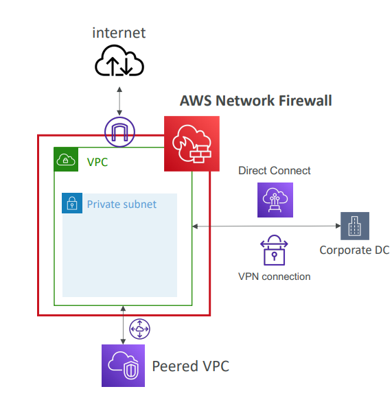

 [General Content AWS Cloud][1]

[1]: https://github.com/weder96/aws-certification-learning

# Module 5: Networking and Content Delivery:

## Content
01. <a href="#section-1">  Amazon CloudFront  </a>
02. <a href="#section-2">  AWS Direct Connect  </a>
03. <a href="#section-3">  Elastic Load Balancing (ELB) </a> 
04. <a href="#section-4">  AWS Global Accelerator  </a>
05. <a href="#section-5">  AWS PrivateLink  </a>
06. <a href="#section-6">  Amazon Route 53  </a>
07. <a href="#section-7">  AWS Transit Gateway  </a> 
08. <a href="#section-8">  Amazon VPC </a> 
09. <a href="#section-9">  AWS VPN </a>
10. <a href="#section-10"> Amazon API Gateway </a>
11. <a href="#section-11"> Amazon VPC Lattice </a>
12. <a href="#section-12"> AWS App Mesh </a>
13. <a href="#section-13"> AWS Client VPN </a>
14. <a href="#section-14"> AWS Cloud WAN </a>
15. <a href="#section-15"> AWS Private 5G </a>
16. <a href="#section-16"> AWS Site-to-Site VPN </a>
17. <a href="#section-17"> AWS Verified Access </a>
18. <a href="#section-18"> AWS Network Firewall </a>
98. <a href="#section-98"> Networks Comments </a>
99. <a href="#section-99"> Additional resources </a>

***************************************************************************************************
##   **01 - Amazon CloudFront**

**Cheat Sheets**

https://tutorialsdojo.com/amazon-cloudfront/

https://digitalcloud.training/amazon-cloudfront/

**References:**

https://docs.aws.amazon.com/AmazonCloudFront/latest/DeveloperGuide

https://aws.amazon.com/cloudfront/features/

https://aws.amazon.com/cloudfront/pricing/

https://aws.amazon.com/cloudfront/faqs/

https://aws.amazon.com/cloudfront/streaming/

https://docs.aws.amazon.com/AmazonCloudFront/latest/DeveloperGuide/on-demand-streaming-video.html

**Videos**

https://www.youtube.com/user/AmazonWebServices/search?query=CloudFront

***************************************************************************************************
##   **02 - AWS Direct Connect**

### **Site-to-Site VPN vs AWS Direct Connect**

### **Site-to-Site VPN**

Amazon VPC offers a **Site-to-Site VPN** connection, which enables you to securely connect your on-premises network to your Amazon VPC over the internet. The connection is based on the **IPsec** protocol to provide encrypted communication between your on-premises network and AWS resources. Here are the key components:

1. **Virtual Private Gateway (VGW)**: The endpoint on the AWS side of the VPN connection. It serves as the AWS counterpart to the Customer Gateway device.

2. **VPN Connection**: A secure link between your on-premises network and your AWS VPCs. The connection utilizes two **VPN Tunnels** for high availability, ensuring that if one tunnel goes down, the other can still maintain the connection.

3. **VPN Tunnel**: An encrypted communication link where data is transferred between your on-premises network and AWS.

4. **Customer Gateway**: The AWS resource that holds the information about your on-premises **Customer Gateway Device**, which is typically a physical device or a software application on your side.

In the case of multiple Site-to-Site VPN connections, AWS provides **VPN CloudHub**, allowing secure communication between different sites (e.g., remote offices) using a hub-and-spoke model. This model can be used for both primary and backup connectivity. This configuration is useful when you have multiple remote offices connected to AWS and want to facilitate communication between these sites without requiring a VPC.

**Key Characteristics:**

- Lower throughput and higher latency compared to AWS Direct Connect, as it depends on internet connections.
- Performance may be affected by external factors like the internet service provider.
- Can be set up quickly and is cost-effective compared to Direct Connect.
- Suitable for environments with low to moderate bandwidth needs.
- Can be used as a temporary solution or backup to other connectivity methods.

### **AWS Direct Connect**

**AWS Direct Connect** establishes a dedicated network connection between your on-premises data center and AWS, bypassing the public internet entirely. This allows for more consistent and reliable network performance, along with potentially lower network costs.

Key characteristics of **AWS Direct Connect**:

- **Private Network Connection**: Unlike VPN, Direct Connect uses a private, dedicated link, which is ideal for applications that require high throughput or low latency.
- **Higher Throughput & Lower Latency**: Direct Connect offers higher speeds, ranging from 50 Mbps to 100 Gbps, and provides a more stable and consistent network experience.
- **No Encryption**: Direct Connect does not encrypt traffic by default. For encryption, you must use the appropriate encryption service, such as IPsec with VPN.
- **Cost & Setup**: Direct Connect involves a higher upfront investment and can take over a month to set up.
- **Combining with VPN**: You can combine **AWS Direct Connect** with Site-to-Site VPN for an encrypted, private connection. This solution offers reduced network costs, increased throughput, and improved reliability compared to internet-based VPN connections.

You can associate **AWS Direct Connect** with either:

- **Transit Gateway**: If you have multiple VPCs within the same AWS Region.
- **Virtual Private Gateway**: If you're using a single VPC.

When using AWS Direct Connect with **VPN** for redundancy, you combine the benefits of private, high-speed connectivity with secure IPsec encryption.

>Note: Setting up direct connect takes a month.

### **Key Comparison Table**

| Feature                     | **Site-to-Site VPN**                           | **AWS Direct Connect**                        |
|-----------------------------|------------------------------------------------|---------------------------------------------|
| **Connection Type**         | Internet-based, encrypted via IPsec            | Dedicated, private connection               |
| **Bandwidth**               | Typically lower, dependent on internet speeds | Offers 50 Mbps to 100 Gbps                  |
| **Latency**                 | Higher due to internet routing                 | Lower, with direct private connection       |
| **Reliability**             | Dependent on internet service provider         | More reliable, private link                 |
| **Cost**                    | Generally lower, uses existing internet        | Higher setup costs, ongoing costs for dedicated connections |
| **Encryption**              | IPsec encryption built-in                      | Does not provide encryption; must use IPsec or other encryption methods |
| **Setup Time**              | Quick setup, usually within minutes            | Longer setup time, typically over a month   |
| **Ideal Use Case**          | Low to moderate bandwidth, backup connections  | High bandwidth, low-latency applications    |
| **Redundancy**              | Supports dual tunnels for high availability    | High availability with dual connections    |
| **Performance**             | Affected by internet and ISP performance       | More consistent performance, no public internet involvement |

**Cheat Sheets**

https://tutorialsdojo.com/aws-direct-connect/

**References:**

https://docs.aws.amazon.com/directconnect/latest/UserGuide

https://aws.amazon.com/directconnect/features/

https://aws.amazon.com/directconnect/pricing/

https://aws.amazon.com/directconnect/faqs/

**Videos**

https://www.youtube.com/results?search_query=aws+direct+connect

***************************************************************************************************
##   **03 - Elastic Load Balancing (ELB)**

")

**Cheat Sheets**

https://digitalcloud.training/aws-elastic-load-balancing-aws-elb/

https://tutorialsdojo.com/aws-elastic-load-balancing-elb/

https://tutorialsdojo.com/application-load-balancer-vs-network-load-balancer-vs-classic-load-balancer/

**References:**

https://docs.aws.amazon.com/elasticloadbalancing/latest/application/introduction.html

https://docs.aws.amazon.com/elasticloadbalancing/latest/network/introduction.html

https://docs.aws.amazon.com/elasticloadbalancing/latest/classic/introduction.html

https://aws.amazon.com/elasticloadbalancing/features/

https://aws.amazon.com/elasticloadbalancing/pricing/?nc=sn&loc=3

**Videos**

https://www.youtube.com/results?search_query=aws+Elastic+Load+Balancing

***************************************************************************************************
##   **04 - AWS Global Accelerator**

**Definitions**

A service that uses the AWS Global Network to improve the availability and performance of your applications to your local and global users. 
It provides static IP addresses that act as a fixed entry point to your application endpoints in a single or multiple AWS Regions, such as your Application Load Balancers, Network Load Balancers or Amazon EC2 instances.
AWS Global Accelerator continually monitors the health of your application endpoints and will detect an unhealthy endpoint and redirect traffic to healthy endpoints in less than 1 minute.

### **Concepts**

An accelerator is the resource you create to direct traffic to optimal endpoints over the AWS global network.

Network zones are isolated units with their own set of physical infrastructure and service IP addresses from a unique IP subnet.

AWS Global Accelerator provides you with a set of two static IP addresses that are anycast from the AWS edge network. It also assigns a default Domain 
Name System (DNS) name to your accelerator, similar to a1234567890abcdef.awsglobalaccelerator.com, that points to the static IP addresses.

A listener processes inbound connections from clients to Global Accelerator, based on the port (or port range) and protocol that you configure. Global 
Accelerator supports both TCP and UDP protocols.

Each endpoint group is associated with a specific AWS Region. Endpoint groups include one or more endpoints in the Region.

Endpoints can be Network Load Balancers, Application Load Balancers, EC2 instances, or Elastic IP addresses.

**Cheat Sheets**

https://tutorialsdojo.com/aws-global-accelerator/

**References:**

https://aws.amazon.com/global-accelerator/

https://aws.amazon.com/global-accelerator/faqs/

https://docs.aws.amazon.com/pt_br/global-accelerator/latest/dg/what-is-global-accelerator.html

**Videos**

https://www.youtube.com/results?search_query=aws+AWS+Global+Accelerator

***************************************************************************************************
##   **05 - AWS PrivateLink**

### **Definitions**

**AWS PrivateLink** enables private, secure communication between your **VPC** and supported AWS services, third-party services, or your own services across different VPCs—without using the public internet. With PrivateLink, traffic flows entirely within the **AWS network**, avoiding exposure to the internet, making it more secure.

AWS PrivateLink uses **interface endpoints** to establish connections to services. These interface endpoints are **Elastic Network Interfaces (ENIs)** that provide a private IP address for the service you're connecting to, whether it's an AWS service or a service hosted in another VPC.

### How AWS PrivateLink Works

- **Service Provider VPC**: The VPC that hosts the service you want to share. The service is exposed via a **network load balancer (NLB)** or **AWS service endpoint**.

- **Service Consumer VPC**: The VPC that will consume the service exposed via PrivateLink. To access the service, it creates an **interface endpoint** that connects to the service provider’s NLB or service endpoint.

The key difference here is that **PrivateLink** doesn’t involve any type of site-to-site VPN connection or even dedicated physical connections like AWS Direct Connect. Instead, it focuses on **privately accessing services** over a network interface with **no exposure to the public internet**.

### PrivateLink vs. Site-to-Site VPN & Direct Connect

- **Site-to-Site VPN** and **AWS Direct Connect** are primarily used for connecting **entire networks** (on-premises environments or different VPCs) to your AWS infrastructure.

- **AWS PrivateLink**, on the other hand, is focused on securely accessing specific services within AWS. You typically use PrivateLink when you want to connect to AWS services (like S3, DynamoDB) or your own services hosted in a different VPC securely over a private network, without exposing traffic to the public internet.

| Feature                        | **Site-to-Site VPN**                           | **AWS Direct Connect**                        | **AWS PrivateLink**                           |
|--------------------------------|------------------------------------------------|---------------------------------------------|---------------------------------------------|
| **Purpose**                    | Connect on-premises networks to AWS            | Establish private, dedicated connections from on-premises to AWS | Securely connect to AWS services or services hosted in other VPCs within AWS |
| **Connection Type**            | VPN connection over the internet               | Dedicated, private connection               | Private connection over the AWS network (no internet exposure) |
| **Use Case**                   | On-premises to AWS VPC network connectivity    | Dedicated, high-performance AWS network connection | Service-to-service or service-to-VPC secure communication |
| **Encryption**                 | IPsec encryption by default                    | No encryption; must use IPsec or other options | Traffic is automatically encrypted within the AWS network |
| **Cost**                       | Lower cost (uses public internet)              | Higher cost (dedicated network)             | Pay-as-you-go based on endpoints and data transfer |
| **Latency and Throughput**     | Varies based on internet conditions            | Low latency, high throughput                | Low latency, optimal for service-to-service communications |
| **Configuration Complexity**   | Easy, quick setup                              | Requires setup time and higher investment    | Simplified configuration, no physical infrastructure needed |

### PrivateLink Use Cases

- **Service Access Across VPCs**: PrivateLink enables you to securely access services across VPCs. For example, if you have a service in one VPC and want another VPC to access it privately, PrivateLink can enable that communication without using public IP addresses or exposing the service to the internet.

- **Accessing AWS Services Privately**: If you want to access AWS services like **S3** or **DynamoDB** securely from your VPC, you can set up PrivateLink to avoid the need for an internet gateway.

- **Third-Party Service Integration**: Many third-party service providers host their services through **AWS PrivateLink**, making it easy to connect to their services securely without leaving the AWS network.

**Cheat Sheets**

**References:**

https://docs.aws.amazon.com/vpc/latest/userguide/endpoint-services-overview.html

**Videos**

https://www.youtube.com/results?search_query=AWS+PrivateLink

***************************************************************************************************
##   **06 - Amazon Route 53**

### **Definitions**

Amazon Route 53 is a highly available and scalable Domain Name System (DNS) web service provided by AWS. It is designed to translate human-readable domain names such as `www.example.com` into machine-readable IP addresses like `203.0.113.77`. This translation ensures that users can easily access applications hosted on AWS or anywhere else by simply entering a domain name, instead of remembering complex numerical IP addresses.

### Record Types and Features

### CNAME Records

A **CNAME** (Canonical Name) record allows you to map one domain name to another. For instance, you might want to map `acme.example.com` to `example.com` or `zenith.example.org`. However, it's important to note that DNS does not allow creating a CNAME record for the **zone apex**, which is the top node of a DNS namespace (e.g., `example.com` itself).

### Alias Records

**Alias records** are an AWS-specific extension of standard DNS functionality, which allow you to route traffic to AWS resources like **Amazon S3 buckets**, **CloudFront distributions**, or other Route 53 records. One of the key benefits of Alias records is that they can be created at the **zone apex** (the root of your domain), which is not possible with CNAME records.

For example, you cannot create a CNAME record for `example.com`, but you can create an alias record that routes traffic from `example.com` to a CloudFront distribution. Additionally, Route 53 does not charge for queries made to alias records that route traffic to AWS resources, unlike CNAME records, which incur charges.

### A Records

**A records** (Address records) are used to map a domain name to an IPv4 address. For example, an A record could map `www.example.com` to the IPv4 address `203.0.113.25`. These records are essential for routing traffic to resources with an IPv4 address.

### AAAA Records

**AAAA records** are similar to A records but are used to map a domain name to an **IPv6** address. For instance, an AAAA record can be used to map `ipv6.example.com` to the IPv6 address `2001:0db8:85a3:0000:0000:8a2e:0370:7334`. As IPv6 adoption increases, these records are increasingly important for ensuring that resources are accessible over the newer IPv6 network.

### Route 53 DNS Resolver

In each VPC, Amazon provides a default DNS server known as the **VPC DNS server**, which is responsible for translating domain names into IP addresses for both public and private domains. When DNS resolution is enabled in a VPC, Route 53 Resolver helps translate domain names into IP addresses, allowing instances in the VPC to access both internal and external resources.

For private hosted zones, DNS queries can only be resolved by the VPC DNS server. Therefore, enabling both **DNS support** and **DNS hostnames** is a prerequisite to successfully resolving queries for a private hosted zone.

### Types of Hosted Zones

Route 53 allows you to create two types of hosted zones: **Public Hosted Zones** and **Private Hosted Zones**.

1. **Public Hosted Zones** are used for resolving domain names that are accessible over the internet. A public hosted zone is typically used for managing the domain and routing traffic for domains like `example.com` and its subdomains, such as `www.example.com`. Public hosted zones allow DNS queries from anywhere on the internet.

2. **Private Hosted Zones** are used for managing domain names within one or more Amazon Virtual Private Clouds (VPCs). These zones ensure that only resources within the specified VPC(s) can resolve DNS queries for domain names in the private hosted zone. For example, you might create a private hosted zone for an internal domain like `internal.example.com`, which is used for internal applications not accessible over the internet.

For a private hosted zone to work properly, the VPC must be configured with two important DNS settings:

- `enableDnsHostnames`: Ensures that instances in the VPC get automatically assigned DNS hostnames, such as `ec2-203-0-113-25.compute-1.amazonaws.com`.
- `enableDnsSupport`: Allows Amazon’s Route 53 Resolver to resolve DNS queries for both internet domain names and internal VPC resources.

### Health Checks and DNS Failover

Amazon Route 53 offers **DNS Health Checks** to ensure that traffic is routed only to healthy endpoints. If you have multiple resources performing the same function (e.g., multiple web servers or load balancers), you can configure **DNS Failover** to reroute traffic from unhealthy resources to healthy ones. This is critical for building resilient and highly available applications.

- **Active-Passive Failover**: In this configuration, a primary resource handles the majority of traffic, while a secondary resource remains on standby to take over if the primary resource becomes unavailable.
- **Active-Active Failover**: In this configuration, all resources are active and Route 53 uses health checks to determine if any resource is unhealthy. Traffic is routed only to healthy resources, ensuring minimal disruption.

Route 53 integrates with **Elastic Load Balancing (ELB)** to manage health checks for your resources. If any resource behind the ELB becomes unhealthy, Route 53 automatically redirects traffic away from the failed resource.

### Advanced Routing Policies

Amazon Route 53 offers several advanced routing policies to optimize traffic management and ensure high availability across global applications. These policies include:

1. **Latency-Based Routing**: This routing policy directs traffic to the AWS region that offers the lowest latency, ensuring that users experience faster response times when accessing your resources.

2. **Geolocation Routing**: With geolocation routing, you can route traffic based on the geographic location from which the DNS query originates. This can be useful for localizing content or ensuring compliance with data residency requirements.

3. **Geoproximity Routing**: Geoproximity routing allows you to route traffic to resources based on both geographic location and the relative bias you assign to a resource. This can help distribute traffic more evenly or focus traffic on specific regions by adjusting the "bias" value.

4. **Weighted Routing**: This policy lets you define how much traffic is routed to each resource based on a weight value. It is useful for load balancing and can be leveraged to test new versions of applications by routing a small percentage of traffic to the new version while the majority continues to go to the old version.

### TTL (Time to Live)

The **Time to Live (TTL)** setting determines how long DNS resolvers cache a record before querying Route 53 again. A longer TTL can reduce the number of DNS queries, thereby lowering the latency and reducing costs. However, if you need to change a record frequently, a shorter TTL ensures that changes are propagated more quickly across the network.

### DNS Query Forwarding

Route 53 allows integration with external DNS resolvers, enabling DNS queries from your VPC to be forwarded to an on-premises network. You can set up **inbound** and **outbound endpoints** for Route 53 Resolver, allowing queries from your on-premises network to be forwarded to Route 53 and vice versa.

- **Inbound Endpoints**: These allow DNS queries from on-premises DNS resolvers to be forwarded to Route 53.
- **Outbound Endpoints**: These allow DNS queries from Route 53 to be forwarded to external DNS resolvers on your on-premises network.

To configure DNS query forwarding, you can set up **Resolver rules** to specify the domain names to forward (such as `example.com`) and the target DNS resolvers.

**Cheat Sheets**

https://digitalcloud.training/amazon-route-53/

https://digitalcloud.training/aws-content-delivery-and-dns-services/

https://tutorialsdojo.com/amazon-route-53/

**References:**

https://docs.aws.amazon.com/Route53/latest/DeveloperGuide/Welcome.html

https://aws.amazon.com/route53/features/

https://aws.amazon.com/route53/pricing/

**Videos**

https://www.youtube.com/user/AmazonWebServices/search?query=Route+53

***************************************************************************************************
##   **07 - AWS Transit Gateway**

**How it works**

AWS Transit Gateway connects your Amazon Virtual Private Clouds (VPCs) and on-premises networks through a central hub. This connection simplifies your network and puts an end to complex peering relationships. Transit Gateway acts as a highly scalable cloud router—each new connection is made only once.

**Benefits**
- Streamline your architecture
- Better visibility and control
- Improve security
- Lift and shift

**Why Transit Gateway?**

AWS Transit Gateway helps you design and implement networks at scale by acting as a cloud router. As your network grows, the complexity of managing incremental connections can slow you down. 
AWS Transit Gateway connects VPCs and on-premises networks through a central hub.

**Use cases**

- Deliver applications around the world
- Rapidly move to global scale
- Smoothly respond to spikes in demand
- Host multicast applications on AWS

**Cheat Sheets**

https://tutorialsdojo.com/aws-transit-gateway/

https://digitalcloud.training/aws-direct-connect/

**References:**

https://aws.amazon.com/transit-gateway/

**Videos**

https://www.youtube.com/results?search_query=AWS+Transit+Gateway

https://youtu.be/xlTHkoKR-Os

***************************************************************************************************
##   **08 - Amazon VPC**

### **Definitions**

An Amazon VPC includes multiple Availability Zones. Within a VPC you can create subnets in each AZ that is available in the Region and distribute your resources across these subnets for high availability.

Amazon Virtual Private Cloud (VPC) is a fundamental service that allows you to create a logically isolated network within the AWS cloud. It enables the definition of your own IP address ranges, subnets, routing tables, and network gateways. A VPC is designed to isolate your AWS resources from other customers, providing control over network traffic and ensuring security within your environment.

### Subnets

subnets are used to divide a VPC into smaller network segments. Each subnet is associated with a specific availability zone (AZ) in a region, and can either be a public subnet or a private subnet

- **Public subnet**: A public subnet is a subnet that is configured to allow communication between resources in the subnet and the internet. Instances placed in a public subnet can have public IP addresses and are typically used for resources that need to be accessed from the internet, such as web servers or load balancers.
  - Use cases: Web servers, Load Balancers.
- **Private subnet**: A private subnet is a subnet that is isolated from direct access to the internet. Instances in a private subnet cannot communicate with the internet unless configured with a NAT Gateway or NAT Instance in a public subnet.
  - Use cases: Databases, backend services.

### IPv6 and VPC CIDR Blocks

By default, VPCs use IPv4 addresses, but they can be configured for dual-stack mode, allowing both IPv4 and IPv6. This mode gives you the flexibility to use IPv4 for legacy applications while supporting IPv6 for newer deployments.

In terms of IP addressing, VPC CIDR blocks must be selected from a specific range. The smallest block is a `/28` (16 IP addresses), and the largest is a `/16` (65,536 IP addresses). These limits ensure that your VPC can scale based on the number of resources needed.

For instance, if a company’s application in one VPC needs to access an ECS cluster in another VPC while adhering to a strict policy of no internet exposure, the correct solution is to use AWS PrivateLink in a service provider model. In this setup, the ECS-hosting VPC acts as the service provider and deploys an NLB, while the application-hosting VPC acts as the consumer and connects through a PrivateLink interface endpoint.

### VPC Endpoint

A VPC endpoint enables private connectivity between a VPC and AWS services or privately hosted applications without exposing traffic to the public internet. This feature is powered by AWS PrivateLink and greatly simplifies network architecture while enhancing security.

There are two types of VPC endpoints. The first type, interface endpoints, uses Elastic Network Interfaces (ENIs) within a subnet as entry points for traffic to AWS services or services hosted by other accounts. These endpoints are charged based on the number of hours they are active and the data they process. The second type, gateway endpoints, is used exclusively for **Amazon S3 and DynamoDB**. These endpoints are added to route tables and incur no additional charges, providing reliable connectivity without requiring NAT devices.

### Internet Gateway

An Internet Gateway (IGW) facilitates communication between a VPC and the internet. It acts as a target in route tables for internet-bound traffic and performs Network Address Translation (NAT) for instances with public IPs. It supports both IPv4 and IPv6 traffic, and its horizontally scaled architecture ensures high availability without introducing bandwidth constraints or availability risks.

To enable internet access for resources within a VPC, an IGW must be attached to the VPC, and a route to the IGW must be added in the subnet’s route table. Subnets associated with a route table that includes a route to an IGW are considered public subnets, while those without such a route are private subnets. Additionally, instances in the public subnet must have globally unique IP addresses, such as public IPv4 addresses or Elastic IPs, and the associated security group and network ACLs must allow relevant traffic.

### NAT Gateway

A NAT Gateway allows instances in private subnets to access the internet or other AWS services while blocking incoming connections initiated from the internet. A NAT Gateway is created in a public subnet and is associated with an Elastic IP address. After creation, the route tables of private subnets must be updated to direct outbound internet traffic to the NAT Gateway.

Unlike NAT instances, NAT Gateways are fully managed by AWS, ensuring scalability and reliability. NAT Gateways support port forwarding and can have security groups associated with them. While NAT Gateways are cost-effective and scalable, they incur charges based on hourly usage and data processing.

NAT Instances, on the other hand, require manual management and maintenance, which makes them less ideal for most use cases. For IPv6 traffic, Egress-Only Internet Gateways should be used instead of NAT.

### VPC Peering Connection

A VPC peering connection provides a private networking link between two VPCs, allowing them to route traffic using private IP addresses. However, VPC peering does not support transitive peering. For example, if VPC A is peered with VPC B and VPC C, there will be no direct communication between VPC B and VPC C through VPC A. To overcome such limitations, AWS Transit Gateway can be used. It acts as a central hub for interconnecting multiple VPCs and on-premises networks, simplifying complex network architectures.

### VPC Sharing

With VPC sharing, enabled through AWS Resource Access Manager, the owner of a VPC can share subnets with other AWS accounts within the same AWS Organization. Participants can use the shared subnets to create and manage their resources but cannot view or modify resources belonging to other participants.

### VPC Flow Logs

VPC Flow Logs enable the capture of detailed information about the traffic to and from resources within a VPC. For instance, capturing flow logs for an Amazon RedShift cluster can help monitor data transfer operations like COPY and UNLOAD commands. These logs can be stored in an Amazon S3 bucket for analysis using Amazon Athena, providing comprehensive insights into network activity and data movement.

### VPN Connection

A VPN connection creates a secure tunnel between on-premises environments and the AWS cloud. This ensures the confidentiality and integrity of data transferred between the two environments. To further enhance security, JDBC with SSL encryption can be used for database connections, ensuring secure data transmission over the VPN.

### Security Groups

A **Security Group** acts as a virtual firewall for instances to control inbound and outbound traffic. It is used to protect Amazon EC2 instances and other AWS resources by defining rules that control the allowed traffic.

- **Stateful**: Security groups are stateful, meaning if a request is allowed in, the response is automatically allowed out, regardless of inbound or outbound rules.
- **Rules**: Security groups have only **allow** rules. You cannot create a rule that denies traffic; all denied traffic is implicitly dropped.
- **Default Behavior**: By default, a security group allows all outbound traffic, but no inbound traffic unless explicitly specified.
- **Association**: You can assign one or more security groups to an instance, and the rules of all associated security groups are evaluated to determine whether traffic is allowed.
- **Modification**: Security group rules can be modified at any time, and changes are automatically applied to all instances associated with the security group.

On the other hand, a **Network Access Control List (ACL)** is an additional layer of security that acts at the subnet level, controlling inbound and outbound traffic for all resources within that subnet.

### Key Differences

| Feature                  | **Security Groups**                                | **Network ACLs**                              |
|--------------------------|----------------------------------------------------|------------------------------------------------|
| **Scope**                | Instance-level                                    | Subnet-level                                  |
| **Stateful/Stateless**   | Stateful (automatically tracks connection state)   | Stateless (must allow both inbound and outbound traffic) |
| **Rules**                | Only **allow** rules                               | Both **allow** and **deny** rules              |
| **Default Behavior**     | Allows all outbound, no inbound unless specified   | Allows all inbound and outbound by default    |
| **Traffic Evaluation**   | Evaluates all rules from all associated security groups | Evaluates rules based on order of evaluation (first match wins) |
| **Modification**         | Automatically applies changes to all instances     | Must be updated separately for each subnet    |
| **Use Case**             | Used to control traffic to individual instances    | Used for additional layer of subnet-level security |

**Cheat Sheets**
https://tutorialsdojo.com/amazon-vpc/

https://digitalcloud.training/aws-networking-services/

**References:**

https://aws.amazon.com/vpc

https://docs.aws.amazon.com/vpc/latest/userguide/what-is-amazon-vpc.html

https://aws.amazon.com/vpc/details/

https://aws.amazon.com/vpc/pricing/

https://aws.amazon.com/vpc/faqs/

**Videos**

https://www.youtube.com/results?search_query=Amazon+vpc

https://www.youtube.com/watch?v=jZAvKgqlrjY&t=1s

***************************************************************************************************
##   **09 - AWS VPN**

**Cheat Sheets**

**References:**

https://docs.aws.amazon.com/vpn/latest/clientvpn-admin/what-is.html

**Videos**

https://www.youtube.com/results?search_query=AWS+Client+VPN

***************************************************************************************************
##  **10 - Amazon API Gateway**

### **Definitions**

Amazon API Gateway is a fully managed service that makes it easy for developers to create, publish, maintain, monitor, and secure APIs at any scale. APIs act as the "front door" for applications to access data, business logic, or functionality from backend services. API Gateway enables you to create **RESTful APIs** and **WebSocket APIs** for real-time, two-way communication applications.

API Gateway supports both **containerized** and **serverless** workloads, making it a versatile choice for a wide range of applications. With API Gateway, you can quickly build and manage scalable and secure APIs with minimal effort.

### API Management and Routing

- **Data Ingestion**: API Gateway serves as the entry point for routing incoming data to backend services like **AWS Lambda**, **Amazon Kinesis**, or other AWS services.
- **RESTful & WebSocket APIs**: You can create both **RESTful APIs** for traditional HTTP-based communication and **WebSocket APIs** for real-time applications that require bi-directional communication.
- **Serverless & Containerized Workloads**: API Gateway integrates seamlessly with serverless technologies like AWS Lambda, as well as with containerized workloads, making it flexible for a variety of architectures.

### Security and Authentication

- **Authentication & Authorization**: API Gateway offers built-in support for managing authentication and authorization. You can integrate it with **AWS IAM**, **Cognito User Pools**, and **Lambda Authorizers** for securing your APIs.
- **API Keys**: API Gateway allows you to create and manage API keys for controlling access to your APIs.
- **Throttling**: API Gateway provides the ability to throttle requests to prevent your backend from being overwhelmed. It uses a **token bucket algorithm** to limit both steady-state request rates and burst requests.

### Caching and Performance Optimization

- **API Caching**: You can enable **caching** in Amazon API Gateway to store responses from your API endpoints. This reduces the number of requests made to the backend, improving the **latency** of API calls and the overall performance.
  - **Time-to-Live (TTL)**: You can set the **TTL** for cached responses, with the default being **300 seconds**. The maximum TTL is **3600 seconds**, and setting TTL to **0** disables caching.
  - **Cache Efficiency**: By caching responses, you reduce load on the backend, improve response times, and lower operational costs.

### Deployment Strategies

- **Canary Releases**: Amazon API Gateway allows you to implement **canary release deployment strategies**. With this approach, you deploy a new version of your API to a small subset of users first. If the new version performs well, you gradually roll it out to the rest of the users. This minimizes the risk of impacting your entire user base with potential bugs or performance issues.
- **Blue-Green Deployment**: Although the blue-green deployment approach (running two environments: blue for the old version and green for the new) is supported, it can add complexity and cost to the deployment process. Canary releases are often a simpler and more cost-effective approach.

### API Versioning

- **Version Control**: API Gateway supports versioning, allowing you to manage different versions of your APIs (e.g., v1, v2). This is essential for maintaining backward compatibility while introducing new features or changes.

### Advanced Features and Integration Options

### 1. **Lambda Function Integration**

- **Invoke Lambda Functions**: API Gateway provides an easy way to invoke **AWS Lambda functions** via HTTP requests. This integration is ideal for serverless applications where you can expose a **REST API** backed by **AWS Lambda**.
- **Serverless Data Ingestion**: This is a perfect solution for serverless architectures, where you don’t need to manage infrastructure.

### 2. **Expose HTTP Endpoints**

- **Backend HTTP APIs**: API Gateway allows you to expose **HTTP endpoints** in the backend. For example, you can expose an internal HTTP API hosted on-premise or behind an **Application Load Balancer**.
- **Use Cases**: You may need to add additional features like **rate limiting**, **caching**, **user authentication**, and **API keys** to these HTTP APIs.

### 3. **Expose Any AWS Service**

- **Service Integration**: API Gateway can expose **AWS services** via APIs. For example, you can start an **AWS Step Functions** workflow or post a message to **Amazon SQS** using API Gateway.
- **Why?**: This helps with adding **authentication**, controlling **rate limits**, and deploying services publicly or privately.

### User Authentication

API Gateway offers various options for user authentication:

- **IAM Roles**: Suitable for internal applications that require AWS-level permissions.
- **Amazon Cognito**: Ideal for external users (e.g., mobile app users) requiring identity management and authentication.
- **Custom Authorizer**: You can implement your own custom logic for authorization using Lambda functions.

### Custom Domain Name

- **HTTPS Security**: API Gateway allows you to set up custom **domain names** with HTTPS security through integration with **AWS Certificate Manager (ACM)**.
  - If using an **Edge-Optimized** endpoint, the certificate must reside in **us-east-1**.
  - For **Regional** endpoints, the certificate must be in the API Gateway region.
  - You must also configure a **CNAME** or **A-alias** record in **Route 53**.

### Use Cases

1. **Serverless Data Ingestion**: API Gateway is commonly used in serverless architectures for **data ingestion** endpoints. Combined with AWS Lambda, you can quickly set up data pipelines without the need for managing infrastructure.
2. **Real-Time Communication**: With **WebSocket APIs**, you can build real-time applications such as **chat apps**, **live notifications**, and **streaming services**.
3. **Microservices Architectures**: API Gateway is ideal for **microservices** that need a unified entry point to route traffic between services. It acts as a **reverse proxy** for different backend services, simplifying service communication and access management.
4. **Mobile and Web Applications**: API Gateway can be used to handle requests from **mobile** and **web apps**, providing a secure and scalable way to expose backend services to users.

### Benefits

- **Fully Managed**: API Gateway is fully managed, so you don’t need to worry about provisioning, scaling, or maintaining infrastructure.
- **Scalable**: API Gateway can scale automatically to handle any amount of traffic, making it suitable for applications of all sizes.
- **Cost-Effective**: With features like caching, API Gateway helps reduce backend load, leading to lower operational costs. You only pay for the requests you make and the data transfer.
- **Integration with AWS Services**: API Gateway integrates easily with other AWS services like Lambda, S3, DynamoDB, and more, enabling you to build robust and complex serverless architectures.
- **Low Latency**: By enabling caching and throttling, API Gateway helps ensure low-latency responses even under high traffic loads.

### Summary Table

| **Feature**                      | **Description**                                                              |
|-----------------------------------|------------------------------------------------------------------------------|
| **Fully Managed**                 | API Gateway is fully managed, requiring no infrastructure management.        |
| **API Types**                     | Supports both RESTful and WebSocket APIs.                                     |
| **Security**                      | Supports authentication via **IAM**, **Cognito**, and **Lambda Authorizers**.|
| **API Keys**                      | Can create and manage API keys for controlling access to APIs.               |
| **Throttling**                    | Throttles requests using a **token bucket algorithm** to prevent overload.    |
| **API Caching**                   | Caches API responses to improve performance and reduce backend load.         |
| **Versioning**                    | Supports API versioning (e.g., v1, v2) for managing updates.                 |
| **Deployment Strategies**         | Supports **Canary Releases** and **Blue-Green Deployments**.                  |
| **Swagger/OpenAPI Support**       | Import **Swagger** or **OpenAPI** specifications to define APIs quickly.     |
| **Monitoring**                    | Integration with **Amazon CloudWatch** for metrics and logging.               |

**Cheat Sheets**

https://tutorialsdojo.com/amazon-api-gateway/

**References:**

https://docs.aws.amazon.com/apigateway/latest/developerguide/

https://aws.amazon.com/api-gateway/features/

https://aws.amazon.com/api-gateway/pricing/

https://aws.amazon.com/api-gateway/faqs/

**Videos**

https://www.youtube.com/results?search_query=aws+api+gateway

***************************************************************************************************
##  **11 - Amazon VPC Lattice**

***************************************************************************************************
##  **12 - AWS App Mesh**

***************************************************************************************************
##  **13 - AWS Client VPN**

***************************************************************************************************
##  **14 - AWS Cloud WAN**

***************************************************************************************************
##  **15 - AWS Private 5G**

***************************************************************************************************
##  **16 - AWS Site-to-Site VPN**

***************************************************************************************************
##  **17 - AWS Verified Access**

***************************************************************************************************
##  **18 - AWS Network Firewall**

- Protect your entire Amazon VPC
- From Layer 3 to Layer 7 protection
- Any direction, you can inspect
    - VPC to VPC traffic
    - Outbound to internet
    - Inbound from internet
    - To / from Direct Connect & Site-to-Site VPN

- AWS Firewall Manager
- Manage security rules in all accounts of an AWS Organization
- Security policy: common set of security rules
    - VPC Security Groups for EC2, Application Load Balancer, etc…
    - WAF rules
    - AWS Shield Advanced
    - AWS Network Firewall
- Rules are applied to new resources as they are created (good for compliance) across all and future accounts in your Organization

**Cheat Sheets**

https://tutorialsdojo.com/aws-network-firewall/

**References**

https://aws.amazon.com/network-firewall/

**Videos**

https://www.youtube.com/results?search_query=Amazon+Network+Firewall

https://www.youtube.com/watch?v=WNFknf9zyZg

***************************************************************************************************
##  **98 - Networks Comments**

**Networks Comments**

- **VPC** – Virtual Private Cloud
- **Subnets** – Tied to an AZ, network partition of the VPC
- **Internet Gateway** – at the VPC level, provide Internet Access
- **NAT Gateway / Instances** – give internet access to private subnets
- **NACL** – Stateless, subnet rules for inbound and outbound
- **Security Groups** – Stateful, operate at the EC2 instance level or ENI
- **VPC Peering** – Connect two VPC with non overlapping IP ranges, nontransitive
- **Elastic IP** –fixed public IPv4, ongoing cost if not in-use
- **VPC Endpoints** – Provide private access to AWS Services within VPC
- **PrivateLink** – Privately connect to a service in a 3rd party VPC
- **VPC Flow Logs** – network traffic logs
- **Site to Site VPN** – VPN over public internet between on-premises DC and AWS
- **Client VPN** – OpenVPN connection from your computer into your VPC
- **Direct Connect** – direct private connection to AWS
- **Transit Gateway** – Connect thousands of VPC and on-premises networks together

***************************************************************************************************
##  **99 - Additional resources**

[Operational Excellence Pillar](https://docs.aws.amazon.com/wellarchitected/latest/operational-excellence-pillar/welcome.html)

[AWS CloudFormation templates in GitHub](https://github.com/aws-cloudformation/aws-cloudformation-templates)

[CloudFormation templates for AWS services](https://docs.aws.amazon.com/AWSCloudFormation/latest/UserGuide/Welcome.html)

[AWS Network Firewall CloudFormation template](https://docs.aws.amazon.com/solutions/latest/centralized-network-inspection-on-aws/aws-cloudformation-template.html)

[AWS Solutions Implementations](https://aws.amazon.com/solutions/?nc1=h_ls)

[Scaling VPN throughput using AWS Transit Gateway](https://aws.amazon.com/pt/blogs/networking-and-content-delivery/scaling-vpn-throughput-using-aws-transit-gateway/)

[Reliability Pillar](https://docs.aws.amazon.com/wellarchitected/latest/reliability-pillar/welcome.html)

[Plan your Network Topology](https://docs.aws.amazon.com/wellarchitected/latest/reliability-pillar/plan-your-network-topology.html)

[Performance Efficiency Pillar](https://docs.aws.amazon.com/wellarchitected/latest/performance-efficiency-pillar/welcome.html)

[Amazon VPC connectivity options](https://docs.aws.amazon.com/whitepapers/latest/aws-vpc-connectivity-options/network-to-amazon-vpc-connectivity-options.html)

[Amazon VPC-to-Amazon VPC connectivity options](https://docs.aws.amazon.com/whitepapers/latest/aws-vpc-connectivity-options/amazon-vpc-to-amazon-vpc-connectivity-options.html)

[Architecture](https://docs.aws.amazon.com/vpc/latest/userguide/how-it-works.html)

[Security Pillar](https://docs.aws.amazon.com/wellarchitected/latest/security-pillar/welcome.html)

[AWS Compliance Resources](https://aws.amazon.com/compliance/resources/) – This collection of workbooks and guides might apply to your industry and location.

[Evaluating Resources with Rules in the AWS Config Developer Guide](https://docs.aws.amazon.com/config/latest/developerguide/evaluate-config.html) – The AWS Config service assesses how well your resource configurations comply with internal practices, industry guidelines, and regulations.

[AWS Security Hub](https://docs.aws.amazon.com/securityhub/latest/userguide/what-is-securityhub.html) – This AWS service provides a comprehensive view of your security state within AWS that helps you check your compliance with security industry standards and best practices.

[AWS Audit Manager](https://docs.aws.amazon.com/audit-manager/latest/userguide/what-is.html) – This AWS service helps you continuously audit your AWS usage to simplify how you manage risk and compliance with regulations and industry standards.

[AWS Direct Connect Service Level Agreement](https://aws.amazon.com/directconnect/sla/)

[AWS Direct Connect Troubleshooting](https://docs.aws.amazon.com/directconnect/latest/UserGuide/Troubleshooting.html)

[AWS Direct Connect Connections configuration](https://docs.aws.amazon.com/directconnect/latest/UserGuide/create-connection.html)

[Example routing options](https://docs.aws.amazon.com/vpc/latest/userguide/route-table-options.html#route-tables-vgw)

[Cost Optimization](https://wa.aws.amazon.com/wellarchitected/2020-07-02T19-33-23/wat.pillar.costOptimization.en.html)

[Cost Optimization Pillar - AWS Well Architected Framework](https://docs.aws.amazon.com/wellarchitected/latest/cost-optimization-pillar/welcome.html)

[AWS Pricing Calculator](https://calculator.aws/#/)

[AWS Network Firewall CloudFormation template](https://docs.aws.amazon.com/solutions/latest/centralized-network-inspection-on-aws/aws-cloudformation-template.html)

[AWS — Difference between Security Groups and Network Access Control List (NACL)](https://medium.com/awesome-cloud/aws-difference-between-security-groups-and-network-acls-adc632ea29ae)

[Difference Between Internet Gateway and NAT Gateway](https://www.geeksforgeeks.org/difference-between-internet-gateway-and-nat-gateway/)

[Amazon VPC FAQs](https://aws.amazon.com/vpc/faqs/?nc1=h_ls)