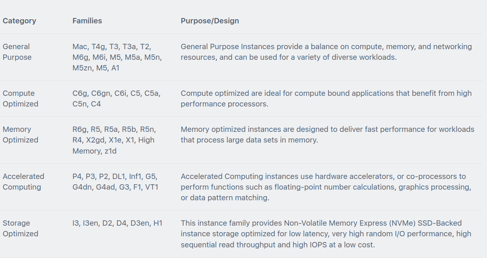
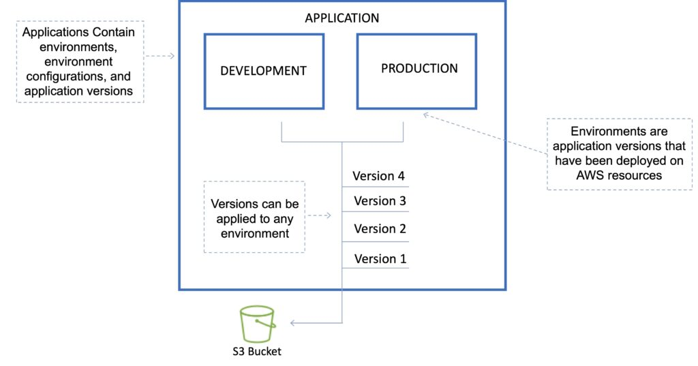
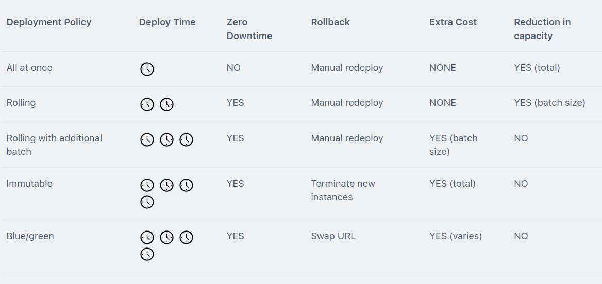
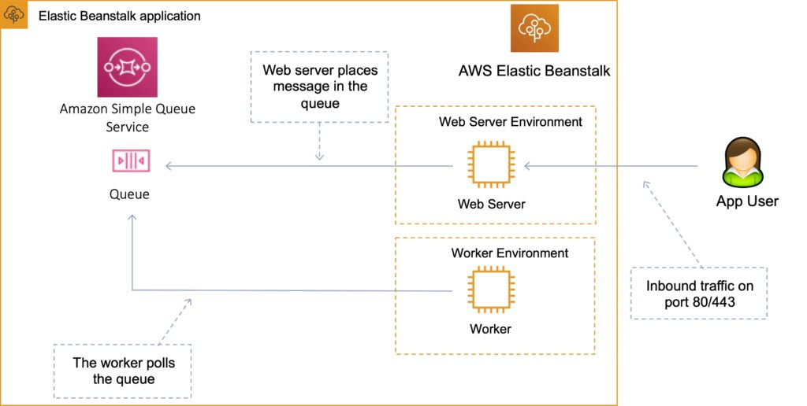
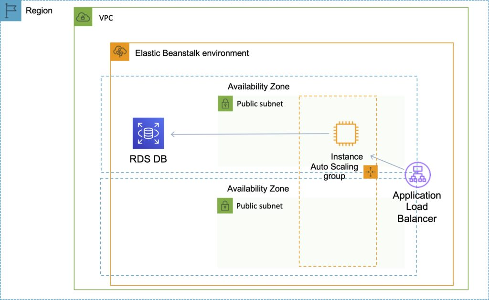
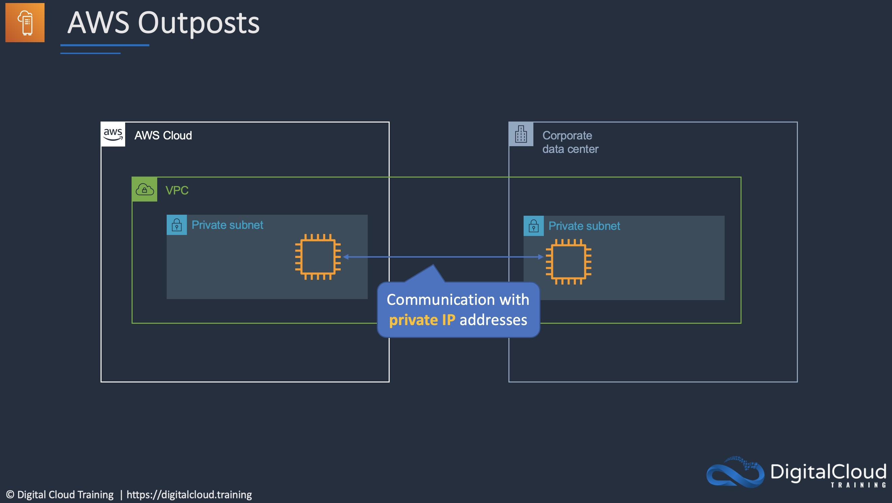

 [General Content AWS Cloud][1]

[1]: https://github.com/weder96/aws-certification-learning

# [Module 6: Compute](https://aws.amazon.com/what-is/compute/)

## Contents
1. <a href="#section-1"> Amazon [EC2](https://aws.amazon.com/ec2/?nc1=h_ls) </a>
2. <a href="#section-2"> Pricing </a>
3. <a href="#section-3"> Instance Types</a>
4. <a href="#section-4"> Amazon Elastic Container Service (ECS)</a>
5. <a href="#section-5"> AWS Lambda</a>
6. <a href="#section-6"> Amazon LightSail</a>
7. <a href="#section-7"> Amazon LightSail Databases</a>
8. <a href="#section-8"> AWS Elastic Beanstalk</a>
9. <a href="#section-9"> AWS Batch </a>
10. <a href="#section-10"> AWS Outposts </a>
11. <a href="#section-11"> AWS Serverless Application Repository </a>
12. <a href="#section-12"> VMware Cloud on AWS </a>
13. <a href="#section-13"> AWS Wavelength </a>
14. <a href="#section-14"> Amazon WorkSpaces Family </a>

***************************************************************************************************
##  **1 - Amazon EC2**

Amazon Elastic Compute Cloud (Amazon [EC2](https://aws.amazon.com/ec2/?nc1=h_ls)) is a web service that provides resizable compute capacity in the cloud.

With Amazon [EC2](https://aws.amazon.com/ec2/?nc1=h_ls) you launch virtual server instances on the AWS cloud.

Each virtual server is known as an “instance”.

You use preconfigured templates for your instances known as Amazon Machine Images (AMIs).

Each AMI includes the information needed to launch your [EC2](https://aws.amazon.com/ec2/?nc1=h_ls) instance (including the operating system and any included software packages).

**Amazon [EC2](https://aws.amazon.com/ec2/?nc1=h_ls) currently supports a variety of operating systems including:**
- Amazon Linux.
- Ubuntu.
- Windows Server.
- MacOS.
- Red Hat Enterprise Linux.
- SUSE Linux Enterprise Server.
- Fedora.
- Debian.
- CentOS.
- Gentoo Linux.
- Oracle Linux.
- FreeBSD.

[EC2](https://aws.amazon.com/ec2/?nc1=h_ls) compute units (ECUs) provide the relative measure of the integer processing power of an Amazon [EC2](https://aws.amazon.com/ec2/?nc1=h_ls) instance.

With [EC2](https://aws.amazon.com/ec2/?nc1=h_ls) you have full control at the operating system layer (root/admin access).

**Key pairs are used to securely connect to [EC2](https://aws.amazon.com/ec2/?nc1=h_ls) instances:**
- A key pair consists of a public key that AWS stores, and a private key file that you store.
- For Windows AMIs, the private key file is required to obtain the password used to log into your instance.
- For Linux AMIs, the private key file allows you to securely SSH (secure shell) into your instance.

**Metadata and User Data:**
- User data is data that is supplied by the user at instance launch in the form of a script.
- Instance metadata is data about your instance that you can use to configure or manage the running instance.
- User data is limited to 16KB.
- User data and metadata are not encrypted.
- Instance metadata is available at http://169.254.169.254/latest/meta-data/ (the trailing “/” is required).
- Instance user data is available at: http://169.254.169.254/latest/user-data.
- The IP address 169.254.169.254 is a link-local address and is valid only from the instance.
- On Linux you can use the curl command to view metadata and user data, e.g.“curl http://169.254.169.254/latest/meta-data/”.
- The Instance Metadata Query tool allows you to query the instance metadata without having to type out the full URI or category names.

**Launching EC2 Instances**

Choose an Amazon Machine Image (AMI).

Choose whether to auto-assign a public IP – default is to use the subnet setting.

Can add an instance to a placement group (more about this below).

Instances can be assigned to IAM roles which configures them with credentials to access AWS resources.

Termination protection can be enabled and prevents you from terminating an instance.

Basic monitoring is enabled by default (5-minute periods), detailed monitoring can be enabled (1-minute periods, chargeable).

Can define shared or dedicated tenancy.

T2 unlimited allows applications to burst past CPU performance baselines as required (chargeable).

Can add a script to run on startup (user data).

Can join to a directory (Windows instances only).

There is an option to enable an Elastic GPU (Windows instances only).

Storage options include adding additional volumes and choosing the volume type.

Use Amazon Elastic File System (EFS) for mounting a shared filesystem to multiple EC2 instances.

Non-root volumes can be encrypted.

Root volumes can be encrypted at launch.

There is an option to create tags (or can be done later).

You can select an existing security group or create a new one.

You must create or use an existing key pair – this is required if you want to access your instances via SSH. However, you can also attach the ‘AmazonEC2RoleforSSM’ IAM role to your EC2 instance to allow connection to your instance via Systems Manager (Session Manager).

### **Amazon Machine Images**

An Amazon Machine Image (AMI) provides the information required to launch an instance.

### **An AMI includes the following:**
- A template for the root volume for the instance (for example, an operating system, an application server, and applications).
- Launch permissions that control which AWS accounts can use the AMI to launch instances.
- A block device mapping that specifies the volumes to attach to the instance when it’s launched.

AMIs are regional. You can only launch an AMI from the region in which it is stored. However, you can copy AMIs to other regions using the console, command line, or the API.

### **Volumes attached to the instance are either EBS or Instance store:**

- Amazon Elastic Block Store (EBS) provides persistent storage. EBS snapshots, which reside on Amazon S3, are used to create the volume.
- Instance store volumes are ephemeral (non-persistent). That means data is lost if the instance is shut down. A template stored on Amazon S3 is used to create the volume.

### **Rehost**

A company is planning to move a number of legacy applications to the AWS Cloud. The solution must be cost-effective. Which approach should the company take

The most cost-effective solution that works is to use Amazon EC2 instances that are right-sized with the most optimum instance types. Right-sizing is the process of ensuring that the instance type selected for each application provides the right amount of resources for the application.

**Cheat Sheets**

https://digitalcloud.training/aws-compute-services/

https://digitalcloud.training/architecting-for-the-cloud/

**References:**

https://d1.awsstatic.com/whitepapers/cost-optimization-right-sizing.pdf

https://wa.aws.amazon.com/wellarchitected/2020-07-02T19-33-23/wat.concept.horizontal-scaling.en.html

**Videos**

***************************************************************************************************
##  **2 - Pricing**
### **Billing and provisioning**

There are several options for how you consume and pay for Amazon EC2 instances.

**On demand**
- Pay for hours used with no commitment.
- Low cost and flexibility with no upfront cost.
- Ideal for auto scaling groups and unpredictable workloads.
- Good for dev/test.

**Spot**
- Amazon EC2 Spot Instances let you take advantage of unused EC2 capacity in the AWS cloud.
- Spot Instances are available at up to a 90% discount compared to On-Demand prices.
- You can use Spot Instances for various stateless, fault-tolerant, or flexible applications such as big data, containerized workloads, CI/CD, web servers, high-performance computing (HPC), and other test & development workloads.
- You can request Spot Instances by using the Spot management console, CLI, API or the same interface that is used for launching On-Demand instances by indicating the option to use Spot.
- You can also select a Launch Template or a pre-configured or custom Amazon Machine Image (AMI), configure security and network access to your Spot instance, choose from multiple instance types and locations, use static IP endpoints, and attach persistent block storage to your Spot instances.
- **New pricing model:** The Spot price is determined by long term trends in supply and demand for EC2 spare capacity.
    - You don’t have to bid for Spot Instances in the new pricing model, and you just pay the Spot price that’s in effect for the current hour for the instances that you launch.
    - Spot Instances receive a two-minute interruption notice when these instances are about to be reclaimed by EC2, because EC2 needs the capacity back.
    - Instances are not interrupted because of higher competing bids.
- To reduce the impact of interruptions and optimize Spot Instances, diversify, and run your application across multiple capacity pools.
- Each instance family, each instance size, in each Availability Zone, in every Region is a separate Spot pool.
- You can use the RequestSpotFleet API operation to launch thousands of Spot Instances and diversify resources automatically.
- To further reduce the impact of interruptions, you can also set up Spot Instances and Spot Fleets to respond to an interruption notice by stopping or hibernating rather than terminating instances when capacity is no longer available.

**Reserved**
- Purchase (or agree to purchase) usage of EC2 instances in advance for significant discounts over On-Demand pricing.
- Provides a capacity reservation when used in a specific AZ.
- AWS Billing automatically applies discounted rates when you launch an instance that matches your purchased RI.
- Capacity is reserved for a term of 1 or 3 years.
- EC2 has three RI types: Standard, Convertible, and Scheduled.
- Standard = commitment of 1 or 3 years, charged whether it’s on or off.
- Scheduled = reserved for specific periods of time, accrue charges hourly, billed in monthly increments over the term (1 year).
- Scheduled RIs match your capacity reservation to a predictable recurring schedule.
- For the differences between standard and convertible RIs, see the table below.
- RIs are used for steady state workloads and predictable usage.
- Ideal for applications that need reserved capacity.
- Upfront payments can reduce the hourly rate.
- Can switch AZ within the same region.
- Can change the instance size within the same instance type.
- Instance type modifications are supported for Linux only.
- Cannot change the instance size of Windows RIs.
- Billed whether running or not.
- Can sell reservations on the AWS marketplace.
- Can be used in Auto Scaling Groups.
- Can be used in Placement Groups.
- Can be shared across multiple accounts within Consolidated Billing.
- If you don’t need your RI’s, you can try to sell them on the Reserved Instance Marketplace.

| 	|Standard	|Convertible|
|---|-----------|-----------|
|Terms	|1 year, 3 year|	1 year, 3 year|
|Average discount off On-Demand price	|40% – 60%	|31% – 54%|
|Change AZ, instance size, networking type	|Yes via ModifyReservedInstance API or console	|Yes via ExchangeReservedInstance API or console|
|Change instance family, OS, tenancy, payment options	|No	|Yes|
|Benefit from price reductions	|No	|Yes|

**RI Attributes:**
- Instance type – designates CPU, memory, networking capability.
- Platform – Linux, SUSE Linux, RHEL, Microsoft Windows, Microsoft SQL Server.
- Tenancy – Default (shared) tenancy, or Dedicated tenancy.
- Availability Zone (optional) – if AZ is selected, RI is reserved, and discount applies to that AZ (Zonal RI). If no AZ is specified, no reservation is created but the discount is applied to any instance in the family in any AZ in the region (Regional RI).

### **Comparing Amazon EC2 Pricing Models**

The following table provides a brief comparison of On-demand, Reserved and Spot pricing models:
|On-Demand	|Reserved	|Spot|
|-----------|-----------|----|
|No upfront fee	|Options: No upfront, partial upfront or all upfront	|No upfront fee|
|Charged by hour or second	|Charged by hour or second	|Charged by hour or second|
|No commitment	|1-year or 3-year commitment	|No commitment|
|Ideal for short term needs or unpredictable workloads	|Ideal for steady-state workloads and predictable usage	|Ideal for cost-sensitive, compute intensive use cases that can withstand interruption|

You are limited to running up to a total of 20 On-Demand instances across the instance family, purchasing 20 Reserved Instances, and requesting Spot Instances per your dynamic spot limit per region (by default).

**Dedicated hosts**
- Physical servers dedicated just for your use.
- You then have control over which instances are deployed on that host.
- Available as On-Demand or with Dedicated Host Reservation.
- Useful if you have server-bound software licenses that use metrics like per-core, per-socket, or per-VM.
- Each dedicated host can only run one EC2 instance size and type.
- Good for regulatory compliance or licensing requirements.
- Predictable performance.
- Complete isolation.
- Most expensive option.
- Billing is per host.

**Dedicated instances**
- Virtualized instances on hardware just for you.
- Also uses physically dedicated EC2 servers.
- Does not provide the additional visibility and controls of dedicated hosts (e.g. how instances are placed on a server).
- Billing is per instance.
- May share hardware with other non-dedicated instances in the same account.
- Available as On-Demand, Reserved Instances, and Spot Instances.
- Cost additional $2 per hour per region.

**The following table describes some of the differences between dedicates instances and dedicated hosts:**

|Characteristic	|Dedicated Instances	|Dedicated Hosts|
|---------------|-----------------------|---------------|
|Enables the use of dedicated physical servers	|YES	|YES|
|Per instance billing (subject to a $2 per region fee)	|YES|	NO| 
|Per host billing	 |	NO|YES|
|Visibility of sockets, cores, host ID|NO	| 	YES|
|Affinity between a host and instance	|NO |	YES|
|Targeted instance placement	|NO 	|YES|
|Automatic instance placement	|YES	| YES|
|Add capacity using an allocation request| 	NO| 	YES|

************************************************************
Partial instance-hours consumed are billed based on instance usage.

Instances are billed when they’re in a running state – need to stop or terminate to avoid paying.

Charging by the hour or second (by the second with Linux instances only).

Data between instances in different regions is charged (in and out).

Regional Data Transfer rates apply if at least one of the following is true, but are only charged once for a given instance even if both are true:
- The other instance is in a different Availability Zone, regardless of which type of address is used.
- Public or Elastic IP addresses are used, regardless of which Availability Zone the other instance is in.

**Capacity‌ ‌Reservations‌‌** ‌
–‌ Allows‌ ‌you‌ ‌to‌ ‌reserve‌ ‌capacity‌ ‌for‌ ‌your‌ ‌EC2‌ ‌instances‌ ‌in‌ ‌a‌ ‌specific‌ ‌Availability‌‌
- Zone‌ ‌for‌ ‌any‌ ‌duration.‌ ‌No‌ ‌commitment‌ ‌required.‌ ‌

**Cost optimization** can include using Auto Scaling groups to scale the number of EC2 instances according to actual demand. Also, using Amazon EC2 reserved instances for suitable workloads is a good way of optimizing costs over the longer term.

* "Implement Auto Scaling groups to add and remove instances based on demand" is a correct answer.

* "Purchase Amazon EC2 Reserved Instances" is also a correct answer.

**Cheat Sheets**

https://digitalcloud.training/aws-billing-and-pricing/

**References:**

https://aws.amazon.com/aws-cost-management/aws-cost-optimization/

**Videos**

***************************************************************************************************
##  **3 - Instance Types**

### **EC2 Instance types**

Amazon EC2 provides a wide selection of instance types optimized to fit different use cases.
Instance types comprise varying combinations of CPU, memory, storage, and networking capacity and give you the flexibility to choose the appropriate mix of resources for your applications.

Each instance type includes one or more instance sizes, allowing you to scale your resources to the requirements of your target workload.

***************************************************************************************************
##  **4 - Amazon Elastic Container Service (ECS)**

**Cheat Sheets**

**References:**

**Videos**

***************************************************************************************************
##  **5 - AWS Lambda**

**References**

[AWS Lambda](https://github.com/weder96/aws-certification-learning/tree/main/module-14#section-1)

***************************************************************************************************
##  **6 - Amazon LightSail**

[Amazon LightSail](https://aws.amazon.com/lightsail/features/)

Amazon LightSail Instances

[Amazon LightSail](https://aws.amazon.com/lightsail/features/) is one of the newest services in the AWS Compute suite of products. Amazon LightSail is great for users who do not have deep AWS technical expertise as it makes it very easy to provision compute services.

[Amazon LightSail](https://aws.amazon.com/lightsail/features/) provides developers compute, storage, and networking capacity and capabilities to deploy and manage websites, web applications, and databases in the cloud.

[Amazon LightSail](https://aws.amazon.com/lightsail/features/) includes everything you need to launch your project quickly – a virtual machine, SSD-based storage, data transfer, DNS management, and a static IP.

[Amazon LightSail](https://aws.amazon.com/lightsail/features/) provides preconfigured virtual private servers (instances) that include everything required to deploy and application or create a database.

The underlying infrastructure and operating system is managed by Amazon LightSail.

Best suited to projects that require a few dozen instances or fewer.

Provides a simple management interface.

Good for blogs, websites, web applications, e-commerce etc.

Can deploy load balancers and attach block storage.

Public API.

**Limited to:** 
    - 20 Amazon LightSail instances 
    - 5 static IPs 
    - 3 DNS zones 
    - 20 TB block storage
    - 40 databases
    - 5 load balancers per account.

Up to 20 certificates per calendar year.

Can connect to each other and other AWS resources through public Internet and private (VPC peering) networking.

Application templates include WordPress, WordPress Multisite, Drupal, Joomla!, Magento, Redmine, LAMP, Nginx (LEMP), MEAN, Node.js, and more.

Amazon LightSail currently supports 6 Linux or Unix-like distributions: Amazon Linux, CentOS, Debian, FreeBSD, OpenSUSE, and Ubuntu, as well as 2 Windows Server versions: 2012 R2 and 2016.

***************************************************************************************************
##  **7 - Amazon LightSail Databases**

### **Amazon LightSail Databases**
Amazon LightSail databases are instances that are dedicated to running databases.

An Amazon LightSail database can contain multiple user-created databases, and you can access it by using the same tools and applications that you use with a stand-alone database.

**Amazon LightSail** managed databases provide an easy, low maintenance way to store your data in the cloud.

**Amazon LightSail** manages a range of maintenance activities and security for your database and its underlying infrastructure.

**Amazon LightSail** automatically backs up your database and allows point in time restore from the past 7 days using the database restore tool.

**Amazon LightSail databases** support the latest major versions of MySQL. Currently, these versions are 5.6, 5.7, and 8.0 for MySQL.

**Amazon LightSail databases** are available in Standard and High Availability plans.

High Availability plans add redundancy and durability to your database, by automatically creating standby database in a separate Availability Zone.

**Amazon LightSail** is very affordable.

**Amazon LightSail** plans are billed on an on-demand hourly rate, so you pay only for what you use.

For every **Amazon LightSail** plan you use, we charge you the fixed hourly price, up to the maximum monthly plan cost.

***************************************************************************************************
##  **8 - AWS Elastic Beanstalk**
[AWS Elastic Beanstalk](https://aws.amazon.com/elasticbeanstalk/)

AWS Elastic Beanstalk can be used to quickly deploy and manage applications in the AWS Cloud.

Developers upload applications and Elastic Beanstalk handles the deployment details of capacity provisioning, load balancing, auto-scaling, and application health monitoring.

You can use multiple availability zones to improve application reliability and availability.

Considered a Platform as a Service (PaaS) solution.

Supports the following platforms:
- [Docker](https://docs.aws.amazon.com/elasticbeanstalk/latest/platforms/platforms-supported.html#platforms-supported.docker)
- Multicontainer Docker
- Preconfigured Docker
- Go
- Java SE
- Tomcat
- .NET Core on Linux
- .NET on Windows Server
- Node.js
- PHP
- Python
- Ruby

Developers can focus on writing code and don’t need to worry about deploying infrastructure.

You pay only for the resources provisioned, not for Elastic Beanstalk itself.

Elastic Beanstalk automatically scales your application up and down.

You can select the [EC2](https://aws.amazon.com/ec2/?nc1=h_ls) instance type that is optimal for your application.

Can retain full administrative control or have Elastic Beanstalk do it for you.

The Managed Platform Updates feature automatically applies updates for your operating system and platform.

Elastic Beanstalk monitors and manages application health and information is viewable via a dashboard.

Integrated with CloudWatch and X-Ray for performance data and metrics.

Integrates with Amazon VPC and AWS IAM.

Can provision most database instances.

Stores your application files and, optionally, server log files in Amazon S3.

Application data can also be stored on S3.

Multiple environments are supported to enable versioning.

Changes from Git repositories are replicated.

Linux and Windows AMI support.

Code is deployed using a WAR file or Git repository.

Can use the AWS toolkit for Visual Studio and the AWS toolkit for Eclipse to deploy Elastic Beanstalk.

Fault tolerance within a single region.

By default applications are publicly accessible.

Can access logs without logging into application servers.

Provides ISO, PCI, SOC 1, [SOC 2](https://docs.aws.amazon.com/audit-manager/latest/userguide/SOC2.html), and SOC 3 compliance along with the criteria for HIPAA eligibility.

Supports AWS Graviton arm64-based processors.

### **Elastic Beanstalk Layers**

There are several layers that make up Elastic Beanstalk and each layer is described below:

**Application:**
- Within Elastic Beanstalk, an application is a collection of different elements, such as environments, environment configurations, and application versions.
- You can have multiple application versions held within an application.

**Application version:**
- An application version is a very specific reference to a section of deployable code.
- The application version will point typically to an Amazon s3 bucket containing the code.

**Environment:**
- An environment refers to an application version that has been deployed on AWS resources.
- The resources are configured and provisioned by AWS Elastic Beanstalk.
- The environment is comprised of all the resources created by Elastic Beanstalk and not just an [EC2](https://aws.amazon.com/ec2/?nc1=h_ls) instance with your uploaded code.

### Elastic Beanstalk Applications Environments and Versions
  

  

**Environment tier:**
- Determines how Elastic Beanstalk provisions resources based on what the application is designed to do.
- Web servers are standard applications that listen for and then process HTTP requests, typically over port 80.
- Workers are specialized applications that have a background processing task that listens for messages on an Amazon SQS queue.

**Environment configurations:**
- An environment configuration is a collection of parameters and settings that dictate how an environment will have its resources provisioned by Elastic Beanstalk and how these resources will behave.

**Configuration template:**
- This is a template that provides the baseline for creating a new, unique environment configuration.

**Deployment Options**
AWS Elastic Beanstalk provides several options for how deployments are processed, including deployment policies and options that let you configure batch size and health check behavior during deployments.
Deployment options

Single instance: great for development.

High availability with load balancer: great for production.
Deployment policies

The deployment policies are: All at once, Rolling, Rolling with additional batch, and Immutable.

**All at once:**
- Deploys the new version to all instances simultaneously.
- All your instances are out of service while the deployment takes place.
- Fastest deployment.
- Good for quick iterations in the development environment.
- You will experience an outage while the deployment is taking place – not ideal for mission-critical systems.
- If the update fails, you need to roll back the changes by re-deploying the original version to all your instances.
- No additional cost.

**Rolling:**
- Update a few instances at a time (batch), and then move onto the next batch once the first batch is healthy (downtime for 1 batch at a time).
- The application is running both versions simultaneously.
- Each batch of instances is taken out of service while the deployment takes place.
- Your environment capacity will be reduced by the number of instances in a batch while the deployment takes place.
- Not ideal for performance-sensitive systems.
- If the update fails, you need to perform an additional rolling update to roll back the changes.
- No additional cost.
- Long deployment time.

**Rolling with additional batch:**
- Like Rolling but launches new instances in a batch ensuring that there is full availability.
- The application is running at capacity.
- You can set the bucket size.
- The application is running both versions simultaneously.
- Small additional cost.
- Additional batch is removed at the end of the deployment.
- Longer deployment.
- Good for production environments.

**Immutable:**
- Launches new instances in a new ASG and deploys the version update to these instances before swapping traffic to these instances once healthy.
- Zero downtime.
- New code is deployed to new instances using an ASG.
- High cost as double the number of instances running during updates.
- Longest deployment.
- Quick rollback in case of failures.
- Great for production environments.

**Additionally, Elastic Beanstalk supports blue/green deployment.**

- **Blue / Green deployment:**
    - This is not a feature within Elastic Beanstalk
    - You create a new “staging” environment and deploy updates there.
    - The new environment (green) can be validated independently, and you can roll back if there are issues.
    - Route 53 can be set up using weighted policies to redirect a percentage of traffic to the staging environment.
    - Using Elastic Beanstalk, you can “swap URLs” when done with the environment test.
    - Zero downtime.

The following tables summarizes the different deployment policies:
  

  

**Golden AMIs**

When deploying code to Amazon [EC2](https://aws.amazon.com/ec2/?nc1=h_ls) using Beanstalk, Elastic Beanstalk must resolve application dependencies which can take a long time.

A golden AMI is a method of reducing this time by packaging all dependencies, configuration, and software into the AMI before deploying.

**Elastic Beanstalk CLI**

There is an additional CLI called “eb cli”.

The EB CLI is a command-line interface for AWS Elastic Beanstalk that provides interactive commands that simplify creating, updating, and monitoring environments from a local repository.

You can use the EB CLI as part of your everyday development and testing cycle as an alternative to the Elastic Beanstalk console.

**Lifecycle Policies**

Elastic Beanstalk can store at most 1000 application versions.

### **To phase out old versions use a lifecycle policy:**
- Time-based – specify max age.
- Count based – specify max number to retain.

Versions that are in use will not be deleted.

Option to not delete the source bundle in S3 to prevent data loss.
Worker environments

If an application performs tasks that take a long time to complete (long-running tasks), offload to a worker environment.

It allows you to decouple your application tiers.

Can define periodic tasks in the cron.yaml file.

  

  

### **Elastic Beanstalk Extensions**

You can add AWS Elastic Beanstalk configuration files (.ebextensions) to your web application’s source code to configure your environment and customize the AWS resources that it contains.

Customization includes defining packages to install, create Linux users and groups, running shell commands, specifying services to enable, configuring a load balancer, etc.

Configuration files are YAML- or JSON-formatted documents with a .config file extension that you place in a folder named .ebextensions and deploy in your application source bundle.

The .ebextensions folder must be included in the top-level directory of your application source code bundle.

All the parameters set in the UI can be configured in the code.

**Requirements:**
- Must be in the .ebextensions/ directory of the source code.
- YAML or JSON format.
- .config extensions can be included (e.g. logging.config).
- You can modify some default settings using “option_settings”.
- You can add resources such as RDS, ElastiCache, and DynamoDB.

Resources managed by .ebextensions get deleted if the environment is terminated.

### **Elastic Beanstalk with Amazon Relational Database Service (RDS)**

You can deploy Amazon RDS within an Elastic Beanstalk environment as in the diagram below:

However, if you terminate your Elastic Beanstalk environment you also lose the database.

The use case is only for development environments, typically not suitable for production.

For production, it is preferable to create the Amazon RDS database outside of Elastic Beanstalk as in the diagram below:
  

  

**Steps to migrate from RDS within a Beanstalk environment to standalone RDS:**
- Take a snapshot of the RDS DB.
- Enable deletion protection on the RDS DB.
- Create a new environment without an RDS DB and point applications to the existing RDS DB.
- Perform a blue/green deployment and swap the new and old environments.
- Terminate the old environment (RDS will not be deleted due to termination protection).
- Delete the CloudFormation stack (will be in the DELETE_FAILED state).

**Connecting to an Amazon RDS database**

When the environment update is complete, the DB instance’s hostname and other connection information are available to your application through the following environment properties:
- RDS_HOSTNAME – The hostname of the DB instance.
- RDS_PORT – The port on which the DB instance accepts connections. The default value varies among DB engines.
- RDS_DB_NAME – The database name, ebdb.
- RDS_USERNAME – The user name that you configured for your database.
- RDS_PASSWORD – The password that you configured for your database.

**Custom Domain Names**

If you’re using AWS Elastic Beanstalk to deploy and manage applications in the AWS Cloud, you can use Amazon Route 53 to route DNS traffic for your domain, such as example.com, to a new or an existing Elastic Beanstalk environment.

You create either a CNAME record or an alias record, depending on whether the domain name for the environment includes the Region, such as us-east-2, in which you deployed the environment. New environments include the Region in the domain name; environments that were created before early 2016 do not.

If the domain name does NOT include the Region: create a CNAME record.

If the domain name DOES include the Region: create an Alias record.

### **Security**

**Elastic Beanstalk works with HTTPS:**
- Load the SSL certificate onto the load balancer.
- Can be performed from the console or in code (.ebextensions/securelistener-alb.config).
- SSL certificate can be provisioned using ACM or CLI.

**For redirecting HTTP to HTTPS:**
- Configure in the application.
- Configure the ALB with a rule.
- Ensure health checks are not redirected.

**Monitoring and Reporting**

Elastic Beanstalk automatically uses Amazon CloudWatch to help you monitor your application and environment status.

You can navigate to the Amazon CloudWatch console to see your dashboard and get an overview of all your resources as well as your alarms.

You can also choose to view more metrics or add custom metrics.

**Logging and Auditing**

With CloudWatch Logs, you can monitor and archive your Elastic Beanstalk application, system, and custom log files from Amazon [EC2](https://aws.amazon.com/ec2/?nc1=h_ls) instances of your environments.

You can also configure alarms that make it easier for you to react to specific log stream events that your metric filters extract.

The CloudWatch Logs agent installed on each Amazon [EC2](https://aws.amazon.com/ec2/?nc1=h_ls) instance in your environment publishes metric data points to the CloudWatch service for each log group you configure.

Each log group applies its own filter patterns to determine what log stream events to send to CloudWatch as data points.

Log streams that belong to the same log group share the same retention, monitoring, and access control settings.

In addition to instance logs, if you enable enhanced health for your environment, you can configure the environment to stream health information to CloudWatch Logs.

### **Authorization and Access Control**

AWS Elastic Beanstalk supports **[identity-based policies](https://docs.aws.amazon.com/elasticbeanstalk/latest/dg/AWSHowTo.iam.html)**.

AWS Elastic Beanstalk does not support **[resource-based policies](https://docs.aws.amazon.com/IAM/latest/UserGuide/access_policies_identity-vs-resource.html)**.

AWS Elastic Beanstalk has partial support for **[resource-level](https://docs.aws.amazon.com/IAM/latest/UserGuide/reference_aws-services-that-work-with-iam.html)** permissions.

When you create an environment, AWS Elastic Beanstalk prompts you to provide two AWS Identity and Access Management (IAM) roles: a service role and an instance profile.

The **[service role](https://docs.aws.amazon.com/elasticbeanstalk/latest/dg/concepts-roles-service.html)** is assumed by Elastic Beanstalk to use other AWS services on your behalf.

The [instance profile](https://docs.aws.amazon.com/elasticbeanstalk/latest/dg/concepts-roles-instance.html) is applied to the instances in your environment and allows them to retrieve [application versions](https://docs.aws.amazon.com/elasticbeanstalk/latest/dg/concepts.html#concepts-version) from Amazon Simple Storage Service (Amazon S3), upload logs to Amazon S3, and perform other tasks that vary depending on the environment type and platform.

You can also create [user policies](https://docs.aws.amazon.com/elasticbeanstalk/latest/dg/concepts-roles-user.html) and apply them to IAM users and groups in your account to allow users to create and manage Elastic Beanstalk applications and environments. Elastic Beanstalk provides managed policies for full access and read-only access.

***************************************************************************************************
##  **9 - AWS Batch**

**Cheat Sheets**

https://tutorialsdojo.com/aws-batch/

**References:**

https://aws.amazon.com/batch/

https://aws.amazon.com/elasticbeanstalk/

https://docs.aws.amazon.com/batch/latest/userguide/

https://aws.amazon.com/batch/features/

https://aws.amazon.com/batch/pricing/

https://aws.amazon.com/batch/faqs/

**Videos**

https://www.youtube.com/results?search_query=aws+batch+

https://www.youtube.com/watch?v=T4aAWrGHmxQ

https://www.youtube.com/watch?v=H8bmHU_z8Ac

***************************************************************************************************
##  **10 - AWS Outposts**

**Definitions**

AWS Outposts is a fully managed service that offers the same AWS infrastructure, AWS services, APIs, and tools to virtually any datacenter, co-location space, or on-premises facility for a truly consistent hybrid experience. With AWS Outposts you can extend your VPC into the on-premises data center as in the following diagram:

#### **Monitoring**
- You can use Amazon Cloudwatch to retrieve Outposts metrics.
- To capture API actions from services on an Outpost, you can use AWS CloudTrail.
- Use VPC Flow Logs to get detailed information about traffic to and from your Outpost, as well as traffic within your Outpost.
- You can also use Traffic Mirroring for content inspection, threat monitoring, troubleshooting, or copying and forwarding network traffic.
- To see changes in the health of AWS resources, you can use AWS Health Dashboard.

#### **Pricing**
- You are charged for Outposts rack capacity for a 3-year term: All, Partial, or No Upfront.
- You are charged for the following:
   - AWS services running on Outposts
   - AWS Marketplace AMIs
   - Outposts and Outpost resources that you share
   - Data transfer associated with Outpost’s service link VPN traffic from AWS Region
- You are not charged for data transfers from Outpost to the parent AWS Region.

**Cheat Sheets**

https://tutorialsdojo.com/aws-outposts/

https://digitalcloud.training/aws-networking-services/

**References:**

https://aws.amazon.com/outposts/

https://aws.amazon.com/outposts/

https://docs.aws.amazon.com/outposts/latest/userguide/what-is-outposts.html

**Videos**

https://www.youtube.com/results?search_query=AWS+Outposts

https://www.youtube.com/watch?v=2cQncaijRoY

**Hands On**

https://www.youtube.com/results?search_query=AWS+Outposts+hands+on

***************************************************************************************************
##  **11 - AWS Serverless Application Repository**

**Definitions**

- The AWS Serverless Application Repository is a managed repository for deploying and publishing serverless applications.
- You can also use pre-built applications instead of cloning, building, packaging, and publishing source code to AWS before deploying it.
- Each application includes an AWS SAM template that specifies the AWS resources that will be used.

### **AWS Serverless Application Repository Monitoring**

Create a trail in AWS CloudTrail to capture all API calls.

Even if you haven’t configured a trail, you can still view the most recent events in the CloudTrail console’s Event history.

### **Pricing**
You are charged for AWS resources used in the applications you deploy.

**Cheat Sheets**

https://tutorialsdojo.com/aws-serverless-application-repository/

**References:**

https://aws.amazon.com/serverless/serverlessrepo/

https://docs.aws.amazon.com/serverlessrepo/latest/devguide/what-is-serverlessrepo.html

**Videos**

https://www.youtube.com/results?search_query=AWS+Serverless+Application+Repository

**Hands On**

https://www.youtube.com/results?search_query=AWS+Serverless+Application+Repository+hands+on

***************************************************************************************************
##  **12 - VMware Cloud on AWS**

**Definitions**

VMware Cloud on AWS provides dedicated, single-tenant cloud infrastructure with support multiple SDDC per organization, with up to 16 hosts per cluster, delivered on the next-generation bare metal AWS infrastructure based on the latest Amazon EC2 Storage Optimized high I/O instances and featuring low-latency Non-Volatile Memory Express (NVMe) based SSDs.

You can quickly create new VMware SDDC clusters on AWS Cloud through a web-based console or by utilizing a RESTful API. VMware manages and operates the service including VMware SDDC software components and the modern web-based console. 

VMware delivers service status with notifications, enterprise-grade 24x7 service support & site reliability operations, and support center with FAQs, forums & chat support. VMware delivers scheduled SDDC software updates and emergency software patches with notifications, and auto-remediation of hardware failures. 

**Cheat Sheets**

**References:**

https://aws.amazon.com/vmware/features/?nc1=h_ls

https://aws.amazon.com/vmware/faqs/

https://aws.amazon.com/vmware/resources/?blog-posts-cards.sort-by=item.additionalFields.modifiedDate&blog-posts-cards.sort-order=desc

**Videos**

https://www.youtube.com/results?search_query=VMware+Cloud+on+AWS

**Hands On**

https://www.youtube.com/results?search_query=VMware+Cloud+on+AWS+hands+ON
***************************************************************************************************
##  **13 - AWS Wavelength**

**Definitons**

- A service that allows developers to create applications with ultra-low latencies for mobile devices and end users.
- Wavelength Zones can be used to extend an Amazon VPC in order to run ultra-low latency applications that use the same AWS services, APIs, tools, and functionalities.

### **Features**
- Wavelength Zones support a wide range of compute instances for general purpose, gaming, and machine learning inference.
- Supports persistent block storage to provide a snapshot, encryption, and restore capabilities without any performance impact.
- Connectivity to 5G networks using VPC and Carrier Gateway.
- Various AWS management and monitoring tools to run and manage workloads in Wavelength Zones.

**Use cases:**
- Create and distribute augmented/virtual reality (AR/VR) apps, as well as HD live video streaming.
- Use AI and ML-powered video and image analytics at the edge to accelerate 5G applications in medical diagnostics, retail, and smart manufacturing settings.
- With near-real-time communication between automobiles and the cloud, you’ll be able to create advanced driver assistance, autonomous driving, and in-vehicle entertainment experiences.

### **Concepts**

- Wavelength is the AWS infrastructure used to run workloads that require ultra-low latencies over mobile networks.

**Wavelength Zone (WZ)** 
- A logical extension of the Region. It is where the Wavelength infrastructure is deployed and is managed by the Region’s control plane.
- Use WZs for application components that require ultra-low latency, enhanced bandwidth, or improved service quality across 5G mobile networks.
- To give the most scalable, robust, and cost-effective alternatives for components, AWS recommends that you design the edge applications in a hub and spoke model with the Region.
- For latency-sensitive applications, you need to have multiple WZs.
- To discover the closest WZ endpoint, you must register the EC2 instance with a discovery service such as AWS Cloud Map.
- For data and app replication, AWS recommends you use an AZ in a different Region as a failover zone.
- Apps running on 4G/LTE mobile phones and devices connected to 4G/LTE networks can also connect to Wavelength Zones’ application servers.

An application that you run on an AWS resource in a WZ is called **Wavelength Application**.

**Carrier Gateway**
- Provides connectivity between WZ and telecommunication carrier.
- Enables inbound traffic from a carrier network in a specific location, as well as outbound traffic to the carrier network and the internet.
- Supports IPv4 traffic.
- Only available for VPCs with WZ subnets.
- To assign a network interface, use a carrier IP address from the network border group.

- You can create AWS compute, storage services, and carrier gateways in WZs.
- You’ll also need VPC, Subnet, and Network Border Group to be able to leverage the 5G edge computing infrastructure of AWS Wavelength.

To manage your resources and WZs, you can use the following interfaces:
- AWS Management Console
- AWS CLI
- AWS SDKs

### **Pricing**
- Prices for AWS resources in WZs will differ from those in the parent region.
- In WZs, EC2 instances are only available on demand.
- Wavelength Zones can be used with your Instance Savings Plan.

**Cheat Sheets**

https://tutorialsdojo.com/aws-wavelength/

**References:**

https://aws.amazon.com/wavelength/

https://docs.aws.amazon.com/wavelength/latest/developerguide/what-is-wavelength.html

**Videos**

https://www.youtube.com/results?search_query=AWS+Wavelength

**Hands On**

https://www.youtube.com/results?search_query=AWS+Wavelength+hands+on

***************************************************************************************************
##  **14 - Amazon WorkSpaces Family**

**Definition**

### Why Amazon WorkSpaces Family?

The Amazon WorkSpaces Family solutions provide the right virtual workspace for varied worker types, from any location. Improve IT agility and maximize user experience, while only paying for the infrastructure that you use.

**Cheat Sheets**

**References:**

https://aws.amazon.com/workspaces/?nc1=h_ls

**Videos**

https://www.youtube.com/results?search_query=amazon+WorkSpaces

**Hands On**

https://www.youtube.com/results?search_query=amazon+WorkSpaces+hands+on

