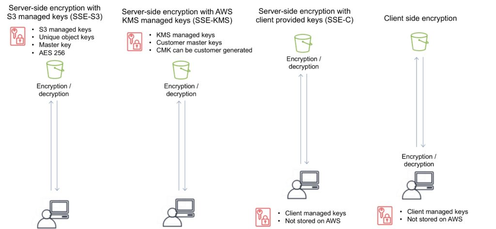
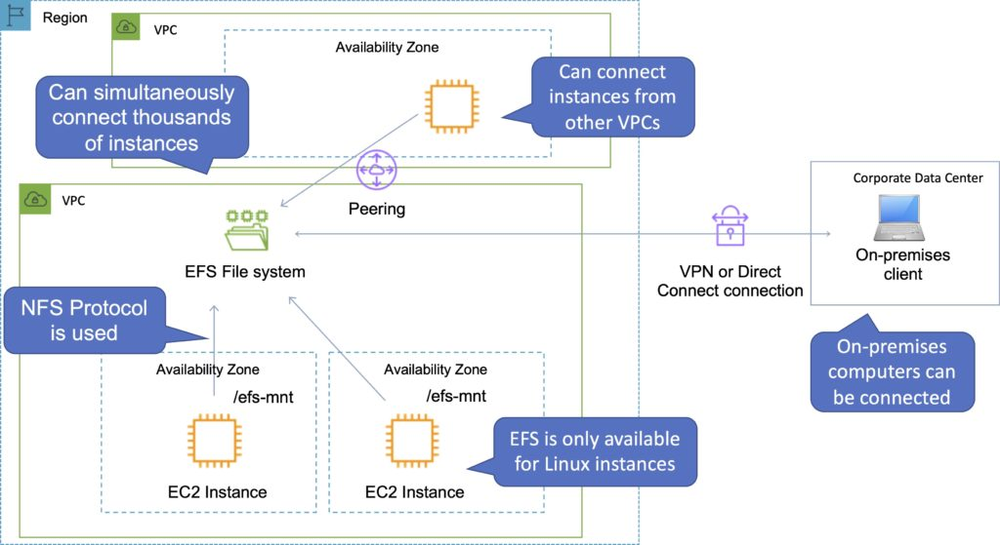
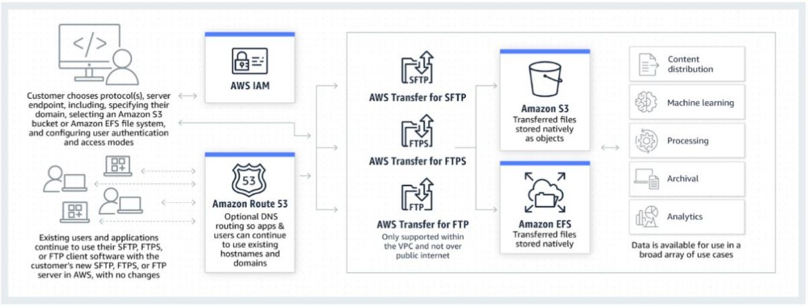

 [General Content AWS Cloud][1]

[1]: https://github.com/weder96/aws-certification-learning

# Module 7: Storege

## Content
1. <a href="#section-1"> Amazon Simple Storage Service (S3) </a>
2. <a href="#section-2"> Amazon Snowball Edge </a>
3. <a href="#section-3"> Amazon Elastic Block Store (EBS) </a>
4. <a href="#section-4"> Amazon Instance Store Volumes </a>
5. <a href="#section-5"> Amazon Elastic File System (EFS) </a>
6. <a href="#section-6"> Amazon Storage Gateway </a>
7. <a href="#section-7"> Amazon FSx </a>
8. <a href="#section-7"> AWS Backup  </a>
9. <a href="#section-7"> AWS Snowmobile </a>
10. <a href="#section-7"> AWS Transfer Family </a>

----------------------------------------------------------------------------------------------------
## <a id="section-1"></a> **1 - Amazon Simple Storage Service (S3)**

Amazon S3 is an object store built to store and retrieve any amount of data from anywhere – websites and mobile apps, enterprise applications, and data from sensors or IoT devices.

You can store any type of file on S3.

The S3 is designed to deliver 99.999999999% durability and stores data from millions of applications used by market leaders across all industries.

S3 offers comprehensive security and compliance features that meet even the most stringent regulatory requirements.

S3 gives customers flexibility in how they manage data for cost optimization, access control and compliance.

Typical use cases include:
- **Backup and Storage** – Provides data backup and storage services to others.
- **App Hosting** – Provides services that deploy, install and manage web applications.
- **Media Hosting** – Create a redundant, scalable, highly available infrastructure that hosts video, photo or music uploads and downloads.
- **Software Delivery** – Host your software applications that customers can download.
- **Static Website** – You can configure a static website to run from an S3 bucket.

S3 provides on-premises query functionality, allowing you to run powerful analytics directly on your data at rest in S3. And Amazon S3 is the most supported cloud storage service available, with integration from the largest community of third-party solutions, systems integrator partners, and other AWS services.

Files can be from 0 bytes to 5 TB.

There is unlimited storage available.

Files are stored in buckets.

Buckets are root-level folders.

Any subfolder within a bucket is known as a “folder”.

S3 is a universal namespace, so bucket names must be globally unique.

**There are seven S3 storage classes.**
- **S3 Standard** (durable, immediately available, frequently accessed).
- **S3 Intelligent-Tiering** (automatically moves data to the most economical level).
- **S3 Standard-IA** (durable, immediately available, infrequently accessed).
- **S3 One Zone-IA** (lower cost for infrequently accessed data with less resiliency).
- **S3 Glacier Instant Retrieval** (data that is rarely accessed and requires millisecond retrieval).
- **S3 Glacier Flexible Retrieval** (archived data, retrieval times in minutes or hours).
- **S3 Glacier Deep Archive** (lowest cost storage class for long-term retention).

The table below provides the details for each Amazon S3 storage class:

|S3 Standard |S3 Intelligent Tiering |S3 Standard-IA |S3 One Zone-IA |S3 Glacier Instant Retrieval |S3 Glacier Flexible Retrieval |S3 Glacier Deep Archive|
|------------|-----------------------|---------------|---------------|-----------------------------|-----------------------------|-----------------------|
|Designed for durability |11 9s |11 9s |11 9s |11 9s |11 9s |11 9s |11 9s|
|Designed for availability |99.99% |99.9& |99.9% |99.5% |99.9% |99.99% |99.99%|
|Availability SLA |99.9% |99% |99% |99% |99% |99.99% |99.9%|
|Availability Zones |≥3 |≥3 |≥3 |1 |≥3 |≥3 |≥3|
|Minimum capacity charge per object |N/A |N/A |128KB |128KB |128KB |40KB |40KB|
|Minimum storage duration charge |N/A |N/A |30 days |30 days |90 days |90 days |180 days|
|Retrieval fee |N/A |N/A |Per GB retrieved |Per GB retrieved |Per GB retrieved |Per GB retrieved |Per GB retrieved|
|First byte latency |milliseconds |milliseconds |milliseconds |milliseconds |milliseconds |minutes or hours| hours|


#### When you successfully upload a file to S3, you receive an HTTP 200 code.

S3 is a highly durable, persistent data store.

Persistent data stores are non-volatile storage systems that retain data when turned off.

This is in contrast to temporary data stores and ephemeral data stores that lose data when turned off.

The following table provides a description of persistent, transient, and ephemeral data stores and which AWS service to use:


|Storage Type |Description |Examples|
|---------------|---------------|--------|
|Persistent Data Store |Data is durable and sticks around after reboots, restarts, or power cycles |S3, Glacier, EBS, EFS|
|Transient Data Store |Data is just temporarily stored and passed along to another process or persistent store |SQS, SNS|
|Ephemeral Data Store |Data is lost when the system is stopped |EC2 Instance Store, Memcached|


**Bucket names must follow a set of rules:**
- Names must be unique across AWS.
- Names must be 3 to 63 characters long.
- Names can only contain lowercase letters, numbers and hyphens.
- Names cannot be formatted as an IP address.

**Objects consist of:**
- Key (object name).
- Value (data formed by a sequence of bytes).
- Version ID (used for version control).
- Metadata (data about stored data).

**Sub-resources:**
- Access control lists.
- Torrent.

Object Sharing – The ability to make any object publicly available via a URL.

Lifecycle Management – ​​Define rules to transfer objects between storage classes at defined time intervals.

Version Control – Automatically maintains multiple versions of an object (when enabled).

Encryption can be enabled for the bucket.

Data is protected using ACLs and bucket policies.

**Charges:**
- Store(Storage).
- Requests.
- Storage management pricing.(Storage management pricing)
- Data transfer pricing. (Data transfer pricing.)
- Transfer acceleration.(Transfer acceleration)

When creating a bucket, you need to select the region where it will be created.

It is a best practice to create buckets in regions that are physically closer to your users to reduce latency.

Additional features offered by Amazon S3 include:


|Additional S3 Capability |How it Works|
|---------------------------|------------|
|Transfer Acceleration |Speed ​​up data uploads using CloudFront in reverse|
|Requester Pays |The requester rather than the bucket owner pays for requests and data transfer|
|Tags |Assign tags to objects to use in costing, billing, security etc.|
|Events |Trigger notifications to SNS, SQS, or Lambda when certain events happen in your bucket|
|Static Web Hosting |Simple and massively scalable static website hosting|
|BitTorrent |Use the BitTorrent protocol to retrieve any publicly available object by automatically generating a .torrent file|


### Policy S3

The Principal element specifies the user, account, service, or other entity that is allowed or denied access to a resource. The bucket policy below has a Principal element set to * which is a wildcard meaning any user. To grant access to a specific IAM user the following format can be used:

"Principal":{"AWS":"arn:aws:iam::AWSACCOUNTNUMBER:user/username"}

```
{
    "Version": "2012-10-17",
    "Statement": [
        {
            "Sid": "PublicRead",
            "Effect": "Allow",
            "Principal": "*",
            "Action": [
                "s3:GetObject",
                "s3:GetObjectVersion"
            ],
            "Resource": [
                "arn:aws:s3:::DOC-EXAMPLE-BUCKET/*"
            ]
        }
    ]
}
```


It’s a simple storage service that offers an extremely durable, highly available, and infinitely scalable data storage infrastructure at very low costs.

Amazon S3 is a distributed architecture and objects are redundantly stored on multiple devices across multiple facilities (AZs) in an Amazon S3 region.

Amazon S3 is a simple key-based object store.

Keys can be any string, and they can be constructed to mimic hierarchical attributes.

Alternatively, you can use S3 Object Tagging to organize your data across all your S3 buckets and/or prefixes.

Amazon S3 provides a simple, standards-based REST web services interface that is designed to work with any Internet-development toolkit.

Files can be from 0 bytes to 5TB.

The largest object that can be uploaded in a single PUT is 5 gigabytes.

For objects larger than 100 megabytes use the Multipart Upload capability.

Updates to an object are atomic – when reading an updated object you will either get the new object or the old one, you will never get partial or corrupt data.

There is unlimited storage available.

It is recommended to access S3 through SDKs and APIs (the console uses APIs).

Event notifications for specific actions, can send alerts or trigger actions.

Notifications can be sent to:

* SNS Topics.
* SQS Queue.
* Lambda functions.
* Need to configure SNS/SQS/Lambda before S3.
* No extra charges from S3 but you pay for SNS, SQS and Lambda.

Requester pays function causes the requester to pay (removes anonymous access).

Can provide time-limited access to objects.

Provides read after write consistency for PUTS of new objects.

Provides eventual consistency for overwrite PUTS and DELETES (takes time to propagate).

You can only store files (objects) on S3.

HTTP 200 code indicates a successful write to S3.

S3 data is made up of:

* Key (name).
*Value (data).
*Version ID.
*Metadata.
* Access Control Lists.


Amazon S3 automatically scales to high request rates.

For example, your application can achieve at least 3,500 PUT/POST/DELETE and 5,500 GET requests per second per prefix in a bucket.

There are no limits to the number of prefixes in a bucket.

For read intensive requests you can also use CloudFront edge locations to offload from S3.

### Additional Capabilities

Additional capabilities offered by Amazon S3 include:


|Additional S3 Capability	| How it works|
|---------------------------|-------------|
|Transfer Acceleration	|Speeds up data uploads using CloudFront in reverse|
|Requester |Pays	The requester rather than the bucket owner pays for requests and data transfer|
|Tags	|Assign tags to objects to use in hosting, billing, security etc.|
|Events	|Trigger notifications to SNS, SQS, or Lambda when certain events happen in your bucket|
|Static Web Hosting	|Simple and massively scalable static web hosting|
|BitTorrent	|Use the BitTorrent protocol to retrieve any publicly available object by automatically generating a .torrent file.|
|Storage Class |Analysis	Analyzes storage access patterns to help you decide when to transition the right data to the right storage class.|
|Storage Lens	|Delivers organization-wide visibility into object storage usage, activity trends, and makes actionable recommendations to improve cost-efficiency and apply data protection best practices.|
|S3 Object Lambda	| Add your own code to S3 GET requests to modify and process data as it is returned to an application.|


### **Use Cases**

Typical use cases include:

* Backup and Storage – Provide data backup and storage services for others.
* Application Hosting – Provide services that deploy, install, and manage web applications.
* Media Hosting – Build a redundant, scalable, and highly available infrastructure that hosts video, photo, or music uploads and downloads.
* Software Delivery – Host your software applications that customers can download.
* Static Website – you can configure a static website to run from an S3 bucket.

S3 is a persistent, highly durable data store.

Persistent data stores are non-volatile storage systems that retain data when powered off.

This contrasts with transient data stores and ephemeral data stores which lose the data when powered off.

The following table provides a description of persistent, transient, and ephemeral data stores and which AWS service to use:


|Storage Type	        |Description	            |Examples|
|-----------------------|---------------------------|--------|
|Persistent data store	|Data is durable and sticks around after reboots, restarts, or power cycles	|S3, Glacier, EBS, EFS|
|Transient Data Store	|Data is just temporarily stored and passed along to another process or persistent store	|SQS, SNS|
|Ephemeral Data Store	|Data is lost when the system is stopped	|EC2 Instance Store, Memcached (Elasticache)|


### **Buckets**

Files are stored in buckets:

* A bucket can be viewed as a container for objects.
* A bucket is a flat container of objects.
* It does not provide a hierarchy of objects.
* You can use an object key name (prefix) to mimic folders.


100 buckets per account by default.

You can store unlimited objects in your buckets.

You can create folders in your buckets (only available through the Console).

You cannot create nested buckets.

Bucket ownership is not transferable.

Bucket names cannot be changed after they have been created.

If a bucket is deleted its name becomes available again.

Bucket names are part of the URL used to access the bucket.

An S3 bucket is region specific.

S3 is a universal namespace so names must be unique globally.

URL is in this format: **https://s3-eu-west-1.amazonaws.com/<bucketname>.**

Can backup a bucket to another bucket in another account.

Can enable logging to a bucket.

Bucket naming:

* Bucket names must be at least 3 and no more than 63 characters in length.
* Bucket names must start and end with a lowercase character or a number.
* Bucket names must be a series of one or more labels which are separated by a period.
* Bucket names can contain lowercase letters, numbers, and hyphens.
* Bucket names cannot be formatted as an IP address.


For better performance, lower latency, and lower cost, create the bucket closer to your clients.


### **Objects**
Each object is stored and retrieved by a unique key (ID or name).

An object in S3 is uniquely identified and addressed through:

* Service endpoint.
* Bucket name.
* Object key (name).
* Optionally, an object version.

Objects stored in a bucket will never leave the region in which they are stored unless you move them to another region or enable cross-region replication.

You can define permissions on objects when uploading and at any time afterwards using the AWS Management Console.

### **Subresources**

Sub-resources are subordinate to objects, they do not exist independently but are always associated with another entity such as an object or bucket.

Sub-resources (configuration containers) associated with buckets include:

* Lifecycle – define an object’s lifecycle.
* Website – configuration for hosting static websites.
* Versioning – retain multiple versions of objects as they are changed.
* Access Control Lists (ACLs) – control permissions access to the bucket.
* Bucket Policies – control access to the bucket.
* Cross Origin Resource Sharing (CORS).
* Logging.


### **Cross-origin-resource-sharing (CORS)**

Used to allow requests to a different origin when connected to the main origin.

The request will fail unless the origin allows the requests using CORS headers (e.g. Access-Control-Allow-Origin).

Must enable the correct CORS headers.

Specify a CORS configuration on the S3 bucket.


### **Storage Classes**

There are six S3 storage classes.

* S3 Standard (durable, immediately available, frequently accessed).
* S3 Intelligent-Tiering (automatically moves data to the most cost-effective tier).
* S3 Standard-IA (durable, immediately available, infrequently accessed).
* S3 One Zone-IA (lower cost for infrequently accessed data with less resilience).
* S3 Glacier (archived data, retrieval times in minutes or hours).
* S3 Glacier Deep Archive (lowest cost storage class for long term retention).

The table below provides the details of each Amazon S3 storage class:


| 	|S3 Standard	|S3 Intelligent Tiering	|S3 Standard-IA	|S3 One Zone-IA	|S3 Glacier Instant Retrieval	|S3 Glacier Flexible Retrieval	|S3 Glacier Deep Archive|
|---|---------------|-----------------------|---------------|---------------|-------------------------------|-------------------------------|-----------------------|
|Designed for durability	|99.999999999% (11 9’s)|99.999999999% (11 9’s) |99.999999999% (11 9’s) |99.999999999% (11 9’s) |99.999999999% (11 9’s) |99.999999999% (11 9’s) |99.999999999%(11 9’s)|
|Designed for availability	|99.99%	|99.9%	|99.9%	|99.5%	|99.9%	|99.99%	|99.99%|
|Availability SLA	|99.9%	|99%	|99%	|99%	|99%	|99.%	|99.9%|
|Availability Zones	|≥3	|≥3	|≥3	|1	|≥3	|≥3	|≥3|
|Minimum capacity charge per object	|N/A	|N/A	|128 KB	|128 KB	|128 KB	|40 KB	|40 KB|
|Minimum storage duration charge	|N/A	|N/A	|30 days	|30 days	|90 days	|90 days	|180 days|
|Retrieval charge	|N/A	|N/A	|per GB |retrieved	|per GB retrieved	|per GB retrieved	|per GB retrieved	|per GB retrieved|
|First byte latency	|milliseconds	|milliseconds	|milliseconds	|milliseconds	|milliseconds	|minutes or hours	|hours|
|Storage type	|Object	|Object	|Object	|Object	|Object	|Object	|Object|
|Lifecycle transitions	|Yes	|Yes	|Yes	|Yes	|Yes	|Yes	Yes|


Objects stored in the S3 One Zone-IA storage class are stored redundantly within a single Availability Zone in the AWS Region you select.

### **Access and Access Policies**

There are four mechanisms for controlling access to Amazon S3 resources:

* IAM policies.
* Bucket policies.
* Access Control Lists (ACLs).
* Query string authentication (URL to an Amazon S3 object which is only valid for a limited time).

Access auditing can be configured by configuring an Amazon S3 bucket to create access log records for all requests made against it.

For capturing IAM/user identity information in logs configure AWS CloudTrail Data Events.

By default a bucket, its objects, and related sub-resources are all private.

By default only a resource owner can access a bucket.

The resource owner refers to the AWS account that creates the resource.

With IAM the account owner rather than the IAM user is the owner.

Within an IAM policy you can grant either programmatic access or AWS Management Console access to Amazon S3 resources.

Amazon Resource Names (ARN) are used for specifying resources in a policy.

The format for any resource on AWS is:

arn:partition:service:region:namespace:relative-id.

**For S3 resources:**

* aws is a common partition name.
* s3 is the service.
* You don’t specify Region and namespace.
* For Amazon S3, it can be a bucket-name or a bucket-name/object-key. You can use wild card.


**The format for S3 resources is:**

* arn:aws:s3:::bucket_name.
* arn:aws:s3:::bucket_name/key_name.

A bucket owner can grant cross-account permissions to another AWS account (or users in an account) to upload objects.

* The AWS account that uploads the objects owns them.
* The bucket owner does not have permissions on objects that other accounts own, however:
    - The bucket owner pays the charges.
    - The bucket owner can deny access to any objects regardless of ownership.
    - The bucket owner can archive any objects or restore archived objects regardless of ownership.


**Access to buckets and objects can be granted to:**

* Individual users.
* AWS accounts.
* Everyone (public/anonymous).
* All authenticated users (AWS users).
* Access policies define access to resources and can be associated with resources (buckets and objects) and users.

You can use the AWS Policy Generator to create a bucket policy for your Amazon S3 bucket.

The categories of policy are resource-based policies and user policies.

**Resource-based policies:**

* Attached to buckets and objects.
* ACL-based policies define permissions.
* ACLs can be used to grant read/write permissions to other accounts.
* Bucket policies can be used to grant other AWS accounts or IAM users’ permission to the bucket and objects.


**User policies:**

* Can use IAM to manage access to S3 resources.
* Using IAM you can create users, groups and roles and attach access policies to them granting them access to resources.
* You cannot grant anonymous permissions in an IAM user policy as the policy is attached to a user.
* User policies can grant permissions to a bucket and the objects in it.


**ACLs:**

* S3 ACLs enable you to manage access to buckets and objects.
* Each bucket and object has an ACL attached to it as a subresource.
* Bucket and object permissions are independent of each other.
* The ACL defines which AWS accounts (grantees) or pre-defined S3 groups are granted access and the type of access.
* A grantee can be an AWS account or one of the predefined Amazon S3 groups.
* When you create a bucket or an object, S3 creates a default ACL that grants the resource owner full control over the resource.

**Cross account access:**

* You grant permission to another AWS account using the email address or the canonical user ID.
* However, if you provide an email address in your grant request, Amazon S3 finds the canonical user ID for that account and adds it to the ACL.
* Grantee accounts can then then delegate the access provided by other accounts to their individual users.


**Pre-defined Groups**

Authenticated Users group:

* This group represents all AWS accounts.
* Access permission to this group allows any AWS account access to the resource.
* All requests must be signed (authenticated).
* Any authenticated user can access the resource.


**All Users group:**

* Access permission to this group allows anyone in the world access to the resource.
* The requests can be signed (authenticated) or unsigned (anonymous).
* Unsigned requests omit the authentication header in the request.
* AWS recommends that you never grant the All Users group WRITE, WRITE_ACP, or FULL_CONTROL permissions.

**Log Delivery group:**

* Providing WRITE permission to this group on a bucket enables S3 to write server access logs.
* Not applicable to objects.

The following table lists the set of permissions that Amazon S3 supports in an ACL.

* The set of ACL permissions is the same for an object ACL and a bucket ACL.
* Depending on the context (bucket ACL or object ACL), these ACL permissions grant permissions for specific buckets or object operations.
* The table lists the permissions and describes what they mean in the context of objects and buckets.


|Permission	        |When granted on a bucket	|When granted on an object|
|-------------------|---------------------------|-------------------------|
|READ	            |Allows grantee to list the objects in the bucket	|Allows grantee to read the object data and its metadata|
|WRITE	            |Allows grantee to create, overwrite and delete any object in the bucket	|N/A|
|READ_ACP	        |Allows grantee to read the bucket ACL	|Allows grantee to read the object ACL|
|WRITE_ACP	        |Allows grantee to write the ACL for the applicable buckets	|Allows grantee to write the ACL for the applicable object|
|FULL_CONTROL	    |Allows grantee the READ, WRITE, READ_ACP, WRITE_ACP permissions on the bucket	|Allows grantee the READ, WRITE, READ_ACP, WRITE_ACP permissions on the object|


**Note the following:**

* Permissions are assigned at the account level for authenticated users.
* You cannot assign permissions to individual IAM users.
* When Read is granted on a bucket it only provides the ability to list the objects in the bucket.
* When Read is granted on an object the data can be read.
* ACP means access control permissions and READ_ACP/WRITE_ACP control who can read/write the ACLs themselves.
* WRITE is only applicable to the bucket level (except for ACP).

Bucket policies are limited to 20 KB in size.

Object ACLs are limited to 100 granted permissions per ACL.

The only recommended use case for the bucket ACL is to grant write permissions to the S3 Log Delivery group.

**There are limits to managing permissions using ACLs:**

* You cannot grant permissions to individual users.
* You cannot grant conditional permissions.
* You cannot explicitly deny access.

When granting other AWS accounts the permissions to upload objects, permissions to these objects can only be managed by the object owner using object ACLs.

**You can use bucket policies for:**

* Granting users permissions to a bucket owned by your account.
* Managing object permissions (where the object owner is the same account as the bucket owner).
* Managing cross-account permissions for all Amazon S3 permissions.

**You can use user policies for:**

* Granting permissions for all Amazon S3 operations.
* Managing permissions for users in your account.
* Granting object permissions to users within the account.

**For an IAM user to access resources in another account the following must be provided:**

* Permission from the parent account through a user policy.
* Permission from the resource owner to the IAM user through a bucket policy, or the parent account through a bucket policy, bucket ACL or object ACL.

If an AWS account owns a resource it can grant permissions to another account, that account can then delegate those permissions or a subset of them to users in the account (permissions delegation).

An account that receives permissions from another account cannot delegate permissions cross-account to a third AWS account.


### Charges

No charge for data transferred between EC2 and S3 in the same region.

Data transfer into S3 is free of charge.

Data transferred to other regions is charged.

Data Retrieval (applies to S3 Standard-IA and S3 One Zone-IA, S3 Glacier and S3 Glacier Deep Archive).

**Charges are:**

* Per GB/month storage fee.
* Data transfer out of S3.
* Upload requests (PUT and GET).
* Retrieval requests (S3-IA or Glacier).

**Requester pays:**

* The bucket owner will only pay for object storage fees.
* The requester will pay for requests (uploads/downloads) and data transfers.
* Can only be enabled at the bucket level.

### Multipart upload

Can be used to speed up uploads to S3.

Multipart upload uploads objects in parts independently, in parallel and in any order.

Performed using the S3 Multipart upload API.


It is recommended for objects of 100MB or larger.

*Can be used for objects from 5MB up to 5TB.
*Must be used for objects larger than 5GB.

If transmission of any part fails it can be retransmitted.

**Improves throughput.**

Can pause and resume object uploads.

Can begin upload before you know the final object size.

### S3 Copy

You can create a copy of objects up to 5GB in size in a single atomic operation.

For files larger than 5GB you must use the multipart upload API.

Can be performed using the AWS SDKs or REST API.

The copy operation can be used to:

* Generate additional copies of objects.
* Renaming objects.
* Changing the copy’s storage class or encryption at rest status.
* Move objects across AWS locations/regions.
* Change object metadata.

Once uploaded to S3 some object metadata cannot be changed, copying the object can allow you to modify this information.

### Transfer acceleration

Amazon S3 Transfer Acceleration enables fast, easy, and secure transfers of files over long distances between your client and your Amazon S3 bucket.

S3 Transfer Acceleration leverages Amazon CloudFront’s globally distributed AWS Edge Locations.

Used to accelerate object uploads to S3 over long distances (latency).

Transfer acceleration is as secure as a direct upload to S3.

You are charged only if there was a benefit in transfer times.

Need to enable transfer acceleration on the S3 bucket.

Cannot be disabled, can only be suspended.

May take up to 30 minutes to implement.

URL is: **<bucketname>.s3-accelerate.amazonaws.com**

Bucket names must be DNS compliance and cannot have periods between labels.

**Now HIPAA compliant**.

You can use multipart uploads with transfer acceleration.

Must use one of the following endpoints:

* .s3-accelerate.amazonaws.com.
*.s3-accelerate.dualstack.amazonaws.com (dual-stack option).

S3 Transfer Acceleration supports all bucket level features including multipart uploads.

### Static Websites

S3 can be used to host static websites.

Cannot use dynamic content such as PHP, .Net etc.

Automatically scales.

You can use a custom domain name with S3 using a Route 53 Alias record.

When using a custom domain name the bucket name must be the same as the domain name.

Can enable redirection for the whole domain, pages, or specific objects.

URL is: <bucketname>.s3-website-.amazonaws.com.

Requester pays does not work with website endpoints.

Does not support HTTPS/SSL.

Returns an HTML document.

Supports object and bucket level redirects.

Only supports GET and HEAD requests on objects.

Supports publicly readable content only.

To enable website hosting on a bucket, specify:

* An Index document (default web page).
* Error document (optional).


|Key Difference	|REST API Endpoint	|Website Endpoint|
|---------------|-------------------|----------------|
|Access Control	|Supports both public and private content	|Supports only publicly readable content|
|Error message handling	|Returns an XML-formatted error response	|Returns an HTML document|
|Redirection support	|Not applicable	|Supports both object-level and bucket-level redirects|
|Requests support	|Supports all bucket and object operations	|Supports only GET and HEAD requests on objects|
|Responses to GET and HEAD requests at the root of the bucket	|Returns a list of the object keys in the bucket	|Returns the Index document that is specified in the website configuration|
|SSL support	|Supports SSL connections	|Does not support SSL connections|


### Pre-Signed URLs

Pre-signed URLs can be used to provide temporary access to a specific object to those who do not have AWS credentials.

By default all objects are private and can only be accessed by the owner.

To share an object you can either make it public or generate a pre-signed URL.

Expiration date and time must be configured.

These can be generated using SDKs for Java and .Net and AWS explorer for Visual Studio.

Can be used for downloading and uploading S3 objects.

### Versioning

Versioning stores all versions of an object (including all writes and even if an object is deleted).

Versioning protects against accidental object/data deletion or overwrites.

Enables “roll-back” and “un-delete” capabilities.

Versioning can also be used for data retention and archive.

Old versions count as billable size until they are permanently deleted.

Enabling versioning does not replicate existing objects.

Can be used for backup.

Once enabled versioning cannot be disabled only suspended.

Can be integrated with lifecycle rules.

Multi-factor authentication (MFA) delete can be enabled.

MFA delete can also be applied to changing versioning settings.

**MFA delete applies to:**

* Changing the bucket’s versioning state.
* Permanently deleting an object.

Cross Region Replication requires versioning to be enabled on the source and destination buckets.

Reverting to previous versions isn’t replicated.

By default a HTTP GET retrieves the most recent version.

Only the S3 bucket owner can permanently delete objects once versioning is enabled.

When you try to delete an object with versioning enabled a DELETE marker is placed on the object.

You can delete the DELETE marker and the object will be available again.

Deletion with versioning replicates the delete marker. But deleting the delete marker is not replicated.

**Bucket versioning states:**

* Enabled.
* Versioned.
* Un-versioned.

Objects that existed before enabling versioning will have a version ID of NULL.

**Suspension:**

* If you suspend versioning the existing objects remain as they are however new versions will not be created.
* While versioning is suspended new objects will have a version ID of NULL and uploaded objects of the same name will overwrite the existing object.


### Object Lifecycle Management
Used to optimize storage costs, adhere to data retention policies and to keep S3 volumes well-maintained.

A lifecycle configuration is a set of rules that define actions that Amazon S3 applies to a group of objects. There are two types of actions:

* **Transition actions** —Define when objects transition to another storage class. For example, you might choose to transition objects to the STANDARD_IA storage class 30 days after you created them, or archive objects to the GLACIER storage class one year after creating them.

There are costs associated with the lifecycle transition requests. For pricing information, see Amazon S3 Pricing.

* **Expiration actions** —Define when objects expire. Amazon S3 deletes expired objects on your behalf.
Lifecycle configuration is an XML file applied at the bucket level as a subresource.

Can be used in conjunction with versioning or independently.

Can be applied to current and previous versions.

Can be applied to specific objects within a bucket: objects with a specific tag or objects with a specific prefix.


### Supported Transitions and Related Constraints

Amazon S3 supports the following lifecycle transitions between storage classes using a lifecycle configuration:

* You can transition from the STANDARD storage class to any other storage class.
* You can transition from any storage class to the GLACIER or DEEP_ARCHIVE storage classes.
* You can transition from the STANDARD_IA storage class to the INTELLIGENT_TIERING or ONEZONE_IA storage classes.
* You can transition from the INTELLIGENT_TIERING storage class to the ONEZONE_IA storage class.
* You can transition from the GLACIER storage class to the DEEP_ARCHIVE storage class.


The following lifecycle transitions are not supported:

* You can’t transition from any storage class to the STANDARD storage class.
* You can’t transition from any storage class to the REDUCED_REDUNDANCY storage class.
* You can’t transition from the INTELLIGENT_TIERING storage class to the STANDARD_IA storage class.
* You can’t transition from the ONEZONE_IA storage class to the STANDARD_IA or INTELLIGENT_TIERING storage classes.
* You can transition from the GLACIER storage class to the DEEP_ARCHIVE storage class only.
* You can’t transition from the DEEP_ARCHIVE storage class to any other storage class.


The lifecycle storage class transitions have the following constraints:

* From the STANDARD or STANDARD_IA storage class to INTELLIGENT_TIERING. The following constraints apply:
    - For larger objects, there is a cost benefit for transitioning to INTELLIGENT_TIERING. Amazon S3 does not transition objects that are smaller than 128 KB to the INTELLIGENT_TIERING storage class because it’s not cost effective.
* From the STANDARD storage classes to STANDARD_IA or ONEZONE_IA. The following constraints apply:
    - For larger objects, there is a cost benefit for transitioning to STANDARD_IA or ONEZONE_IA. Amazon S3 does not transition objects that are smaller than 128 KB to the STANDARD_IA or ONEZONE_IA storage classes because it’s not cost effective.
    - Objects must be stored at least 30 days in the current storage class before you can transition them to STANDARD_IA or ONEZONE_IA. For example, you cannot create a lifecycle rule to transition objects to the STANDARD_IA storage class one day after you create them.
    - Amazon S3 doesn’t transition objects within the first 30 days because newer objects are often accessed more frequently or deleted sooner than is suitable for STANDARD_IA or ONEZONE_IA storage.
    - If you are transitioning noncurrent objects (in versioned buckets), you can transition only objects that are at least 30 days noncurrent to STANDARD_IA or ONEZONE_IA storage.
    - From the STANDARD_IA storage class to ONEZONE_IA. The following constraints apply:

Objects must be stored at least 30 days in the STANDARD_IA storage class before you can transition them to the ONEZONE_IA class.

### Encryption

You can securely upload/download your data to Amazon S3 via SSL endpoints using the HTTPS protocol (In Transit – SSL/TLS).

**Encryption options:**

|Encryption Option	|How It Works|
|-------------------|------------|
|SSE-S3	            |Use S3’s existing encryption key for AES-256|
|SSE-C	            |Upload your own AES-256 encryption key which S3 uses when it writes objects|
|SSE-KMS	        |Use a key generated and managed by AWS KMS|
|Client Side	    |Encrypt objects using your own local encryption process before uploading to S3|


### Server-side encryption options

Server-side encryption protects data at rest.

Amazon S3 encrypts each object with a unique key.

As an additional safeguard, it encrypts the key itself with a master key that it rotates regularly.

Amazon S3 server-side encryption uses one of the strongest block ciphers available to encrypt your data, 256-bit Advanced Encryption Standard (AES-256).

If you need server-side encryption for all the objects that are stored in a bucket, use a bucket policy.

To request server-side encryption using the object creation REST APIs, provide the x-amz-server-side-encryption request header.

Note: You need the kms:Decrypt permission when you upload or download an Amazon S3 object encrypted with an AWS Key Management Service (AWS KMS) customer master key (CMK), and that is in addition to kms:ReEncrypt, kms:GenerateDataKey, and kms:DescribeKey permissions.

There are three options for using server-side encryption: SSE-S3, SSE-KMS and SSE-C. These are detailed below,

### SSE-S3 – Server-Side Encryption with S3 managed keys

When you use Server-Side Encryption with Amazon S3-Managed Keys (SSE-S3), each object is encrypted with a unique key.

As an additional safeguard, it encrypts the key itself with a master key that it regularly rotates.

Amazon S3 server-side encryption uses one of the strongest block ciphers available, 256-bit Advanced Encryption Standard (AES-256), to encrypt your data.

* Each object is encrypted with a unique key.
* Encryption key is encrypted with a master key.
* AWS regularly rotate the master key.
* Uses AES 256.

### SSE-KMS – Server-Side Encryption with AWS KMS keys
Server-Side Encryption with Customer Master Keys (CMKs) Stored in AWS Key Management Service (SSE-KMS) is like SSE-S3, but with some additional benefits and charges for using this service.

There are separate permissions for the use of a CMK that provides added protection against unauthorized access of your objects in Amazon S3.

SSE-KMS also provides you with an audit trail that shows when your CMK was used and by whom.

Additionally, you can create and manage customer managed CMKs or use AWS managed CMKs that are unique to you, your service, and your Region.

* KMS uses Customer Master Keys (CMKs) to encrypt.
* Can use the automatically created CMK key.
* OR you can select your own key (gives you control for management of keys).
* An envelope key protects your keys.
* Chargeable.

### SSE-C – Server-Side Encryption with client provided keys

With Server-Side Encryption with Customer-Provided Keys (SSE-C), you manage the encryption keys and Amazon S3 manages the encryption, as it writes to disks, and decryption, when you access your objects.

* Client manages the keys, S3 manages encryption.
* AWS does not store the encryption keys.
* If keys are lost data cannot be decrypted.

When using server-side encryption with customer-provided encryption keys (SSE-C), you must provide encryption key information using the following request headers:

x-amz-server-side​-encryption​-customer-algorithm – Use this header to specify the encryption algorithm. The header value must be “AES256”.

x-amz-server-side​-encryption​-customer-key – Use this header to provide the 256-bit, base64-encoded encryption key for Amazon S3 to use to encrypt or decrypt your data.

x-amz-server-side​-encryption​-customer-key-MD5 – Use this header to provide the base64-encoded 128-bit MD5 digest of the encryption key according to RFC 1321. Amazon S3 uses this header for a message integrity check to ensure that the encryption key was transmitted without error.

### Client-side encryption

This is the act of encrypting data before sending it to Amazon S3.

To enable client-side encryption, you have the following options:

1. Use a customer master key (CMK) stored in AWS Key Management Service (AWS KMS).
2. Use a master key you store within your application.

### Option 1. Use a customer master key (CMK) stored in AWS Key Management Service (AWS KMS)

When uploading an object—Using the customer master key (CMK) ID, the client first sends a request to AWS KMS for a CMK that it can use to encrypt your object data. AWS KMS returns two versions of a randomly generated data key:

* A plaintext version of the data key that the client uses to encrypt the object data.
* A cipher blob of the same data key that the client uploads to Amazon S3 as object metadata.

When downloading an object—The client downloads the encrypted object from Amazon S3 along with the cipher blob version of the data key stored as object metadata. The client then sends the cipher blob to AWS KMS to get the plaintext version of the data key so that it can decrypt the object data.

#### Option 2. Use a master key you store within your application

When uploading an object—You provide a client-side master key to the Amazon S3 encryption client. The client uses the master key only to encrypt the data encryption key that it generates randomly. The process works like this:

1. The Amazon S3 encryption client generates a one-time-use symmetric key (also known as a data encryption key or data key) locally. It uses the data key to encrypt the data of a single Amazon S3 object. The client generates a separate data key for each object.
2. The client encrypts the data encryption key using the master key that you provide. The client uploads the encrypted data key and its material description as part of the object metadata. The client uses the material description to determine which client-side master key to use for decryption.
3. The client uploads the encrypted data to Amazon S3 and saves the encrypted data key as object metadata (x-amz-meta-x-amz-key) in Amazon S3.

When downloading an object—The client downloads the encrypted object from Amazon S3. Using the material description from the object’s metadata, the client determines which master key to use to decrypt the data key. The client uses that master key to decrypt the data key and then uses the data key to decrypt the object.

The following diagram depicts the options for enabling encryption and shows you where the encryption is applied and where the keys are managed:





### Event Notifications

Amazon S3 event notifications can be sent in response to actions in Amazon S3 like PUTs, POSTs, COPYs, or DELETEs.

Amazon S3 event notifications enable you to run workflows, send alerts, or perform other actions in response to changes in your objects stored in S3.

To enable notifications, you must first add a notification configuration that identifies the events you want Amazon S3 to publish and the destinations where you want Amazon S3 to send the notifications.

You can configure notifications to be filtered by the prefix and suffix of the key name of objects.

**Amazon S3 can publish notifications for the following events:**

* New object created events.
* Object removal events.
* Restore object events.
* Reduced Redundancy Storage (RRS) object lost events.
* Replication events.

**Amazon S3 can send event notification messages to the following destinations:**

* Publish event messages to an Amazon Simple Notification Service (Amazon SNS) topic.
* Publish event messages to an Amazon Simple Queue Service (Amazon SQS) queue.
* Publish event messages to AWS Lambda by invoking a Lambda function and providing the event message as an argument.

Need to grant Amazon S3 permissions to post messages to an Amazon SNS topic or an Amazon SQS queue.

Need to also grant Amazon S3 permission to invoke an AWS Lambda function on your behalf. For information about granting these permissions.

### Object Tags

S3 object tags are key-value pairs applied to S3 objects which can be created, updated, or deleted at any time during the lifetime of the object.

Allow you to create Identity and Access Management (IAM) policies, setup S3 Lifecycle policies, and customize storage metrics.

Up to ten tags can be added to each S3 object and you can use either the AWS Management Console, the REST API, the AWS CLI, or the AWS SDKs to add object tags.

### Amazon S3 CloudWatch Metrics

You can use the AWS Management Console to enable the generation of 1-minute CloudWatch request metrics for your S3 bucket or configure filters for the metrics using a prefix or object tag.

Alternatively, you can call the S3 PUT Bucket Metrics API to enable and configure publication of S3 storage metrics.

CloudWatch Request Metrics will be available in CloudWatch within 15 minutes after they are enabled.

CloudWatch Storage Metrics are enabled by default for all buckets and reported once per day.

**The S3 metrics that can be monitored include:**

* S3 requests.
* Bucket storage.
* Bucket size.
* All requests.
* HTTP 4XX/5XX errors.


### Cross Region Replication

CRR is an Amazon S3 feature that automatically replicates data across AWS Regions.

With CRR, every object uploaded to an S3 bucket is automatically replicated to a destination bucket in a different AWS Region that you choose.

Provides automatic, asynchronous copying of objects between buckets in different regions.

CRR is configured at the S3 bucket level.

You enable a CRR configuration on your source bucket by specifying a destination bucket in a different Region for replication.

You can use either the AWS Management Console, the REST API, the AWS CLI, or the AWS SDKs to enable CRR.

Versioning must be enabled for both the source and destination buckets .

Source and destination buckets must be in different regions.

With CRR you can only replication between regions, not within a region (see SRR below for single region replication).

Replication is 1:1 (one source bucket, to one destination bucket).

You can configure separate S3 Lifecycle rules on the source and destination buckets.

You can replicate KMS-encrypted objects by providing a destination KMS key in your replication configuration.

You can set up CRR across AWS accounts to store your replicated data in a different account in the target region.

Provides low latency access for data by copying objects to buckets that are closer to users.

To activate CRR you need to configure the replication on the source bucket:

* Define the bucket in the other region to replicate to.
* Specify to replicate all objects or a subset of objects with specific key name prefixes.

The replicas will be exact replicas and share the same key names and metadata.

You can specify a different storage class (by default the source storage class will be used).

AWS S3 will encrypt data in-transit with SSL.

AWS S3 must have permission to replicate objects.

Bucket owners must have permission to read the object and object ACL.

Can be used across accounts but the source bucket owner must have permission to replicate objects into the destination bucket.

**Triggers for replication are:**

* Uploading objects to the source bucket.
* DELETE of objects in the source bucket.
* Changes to the object, its metadata, or ACL.

What is replicated:

* New objects created after enabling replication.
* Changes to objects.
* Objects created using SSE-S3 using the AWS managed key.
* Object ACL updates.

What isn’t replicated:

* Objects that existed before enabling replication (can use the copy API).
* Objects created with SSE-C and SSE-KMS.
* Objects to which the bucket owner does not have permissions.
* Updates to bucket-level subresources.
* Actions from lifecycle rules are not replicated.
* Objects in the source bucket that are replicated from another region are not replicated.


**Deletion behavior:**

* If a DELETE request is made without specifying an object version ID a delete marker will be added and replicated.
* If a DELETE request is made specifying an object version ID the object is deleted but the delete marker is not replicated.

Charges:

* Requests for upload.
* Inter-region transfer.
* S3 storage in both regions.

### Same Region replication (SRR)

As the name implies you can use SRR to replication objects to a destination bucket within the same region as the source bucket.

This feature was released in September 2018.

Replication is automatic and asynchronous.

New objects uploaded to an Amazon S3 bucket are configured for replication at the bucket, prefix, or object tag levels.

Replicated objects can be owned by the same AWS account as the original copy or by different accounts, to protect from accidental deletion.

Replication can be to any Amazon S3 storage class, including S3 Glacier and S3 Glacier Deep Archive to create backups and long-term archives.

When an S3 object is replicated using SRR, the metadata, Access Control Lists (ACL), and object tags associated with the object are also part of the replication.

Once SRR is configured on a source bucket, any changes to the object, metadata, ACLs, or object tags trigger a new replication to the destination bucket.

### S3 Analytics
Can run analytics on data stored on Amazon S3.

This includes data lakes, IoT streaming data, machine learning, and artificial intelligence.

The following strategies can be used:


|S3 Analytics Strategies	|Service Used|
|---------------------------|------------|
|Data Lake Concept	        |Athena, Redshift Spectrum, QuickSight|
|IoT Streaming Data Repository	|Kinesis Firehose|
|ML and AI Storage	        |Rekognition, Lex, MXNet|
|Storage Class Analysis	    |S3 Management Analytics|


### S3 Inventory

You can use S3 Inventory to audit and report on the replication and encryption status of your objects for business, compliance, and regulatory needs.

Amazon S3 inventory provides comma-separated values (CSV), **Apache optimized row columnar (ORC)** or **Apache Parquet (Parquet)** output files that list your objects and their corresponding metadata on a daily or weekly basis for an S3 bucket or a shared prefix (that is, objects that have names that begin with a common string).

### Monitoring and Reporting

Amazon CloudWatch metrics for Amazon S3 can help you understand and improve the performance of applications that use Amazon S3. There are several ways that you can use CloudWatch with Amazon S3.

Daily storage metrics for buckets ‐ Monitor bucket storage using CloudWatch, which collects and processes storage data from Amazon S3 into readable, daily metrics. These storage metrics for Amazon S3 are reported once per day and are provided to all customers at no additional cost.
Request metrics ‐ Monitor Amazon S3 requests to quickly identify and act on operational issues. The metrics are available at 1-minute intervals after some latency to process. These CloudWatch metrics are billed at the same rate as the Amazon CloudWatch custom metrics.
Replication metrics ‐ Monitor the total number of S3 API operations that are pending replication, the total size of objects pending replication, and the maximum replication time to the destination Region. Only replication rules that have S3 Replication Time Control (S3 RTC) enabled will publish replication metrics.

### Logging and Auditing

You can record the actions that are taken by users, roles, or AWS services on Amazon S3 resources and maintain log records for auditing and compliance purposes.

To do this, you can use Amazon S3 server access logging, AWS CloudTrail logs, or a combination of both.

AWS recommend that you use AWS CloudTrail for logging bucket and object-level actions for your Amazon S3 resources.

Server access logging provides detailed records for the requests that are made to a bucket.

This information can be used for auditing.

You must not set the bucket being logged to be the destination for the logs as this creates a logging loop and the bucket will grow exponentially.

### S3 performance guidelines

AWS provide some performance guidelines for Amazon S3. These are summarized here:

**Measure Performance** – When optimizing performance, look at network throughput, CPU, and DRAM requirements. Depending on the mix of demands for these different resources, it might be worth evaluating different Amazon EC2 instance types.

**Scale Storage Connections Horizontally** – You can achieve the best performance by issuing multiple concurrent requests to Amazon S3. Spread these requests over separate connections to maximize the accessible bandwidth from Amazon S3.

**Use Byte-Range Fetches** – Using the Range HTTP header in a GET Object request, you can fetch a byte-range from an object, transferring only the specified portion. You can use concurrent connections to Amazon S3 to fetch different byte ranges from within the same object. This helps you achieve higher aggregate throughput versus a single whole-object request. Fetching smaller ranges of a large object also allows your application to improve retry times when requests are interrupted.

**Retry Requests for Latency-Sensitive Applications** – Aggressive timeouts and retries help drive consistent latency. Given the large scale of Amazon S3, if the first request is slow, a retried request is likely to take a different path and quickly succeed. The AWS SDKs have configurable timeout and retry values that you can tune to the tolerances of your specific application.

**Combine Amazon S3 (Storage) and Amazon EC2 (Compute)** in the Same AWS Region – Although S3 bucket names are globally unique, each bucket is stored in a Region that you select when you create the bucket. To optimize performance, we recommend that you access the bucket from Amazon EC2 instances in the same AWS Region when possible. This helps reduce network latency and data transfer costs.

**Use Amazon S3 Transfer Acceleration to Minimize Latency Caused by Distance** – Amazon S3 Transfer Acceleration manages fast, easy, and secure transfers of files over long geographic distances between the client and an S3 bucket. Transfer Acceleration takes advantage of the globally distributed edge locations in Amazon CloudFront. As the data arrives at an edge location, it is routed to Amazon S3 over an optimized network path. Transfer Acceleration is ideal for transferring gigabytes to terabytes of data regularly across continents. It’s also useful for clients that upload to a centralized bucket from all over the world.

### Glacier

Glacier is an archiving storage solution for infrequently accessed data.

There are three storage tiers:

**S3 Glacier Instant Retrieval**

* Data retrieval in milliseconds with the same performance as S3 Standard
* Designed for durability of 99.999999999% of objects across multiple Availability Zones
* Data is resilient in the event of the destruction of one entire Availability Zone
* Designed for 99.9% data availability each year
* 128 KB minimum object size
* Backed with the Amazon S3 Service Level Agreement for availability
* S3 PUT API for direct uploads to S3 Glacier Instant Retrieval, and S3 Lifecycle management for automatic migration of objects

### S3 Glacier Flexible Retrieval (Formerly S3 Glacier)

* Designed for durability of 99.999999999% of objects across multiple Availability Zones
* Data is resilient in the event of one entire Availability Zone destruction
* Supports SSL for data in transit and encryption of data at rest
* Ideal for backup and disaster recovery use cases when large sets of data occasionally need to be retrieved in minutes, without concern for costs
* Configurable retrieval times, from minutes to hours, with free bulk retrievals
* S3 PUT API for direct uploads to S3 Glacier Flexible Retrieval, and S3 Lifecycle management for automatic migration of objects

### Amazon S3 Glacier Deep Archive (S3 Glacier Deep Archive)

* Designed for durability of 99.999999999% of objects across multiple Availability Zones
* Lowest cost storage class designed for long-term retention of data that will be retained for 7-10 years
* Ideal alternative to magnetic tape libraries
* Retrieval time within 12 hours
* S3 PUT API for direct uploads to S3 Glacier Deep Archive, and S3 Lifecycle management for automatic migration of objects

The key difference between the top tiers is that Deep Archive is lower cost, but retrieval times are much longer (12 hours).

The S3 Glacier tier has configurable retrieval times from minutes to hours (you pay accordingly).

Archived objects are not available for real time access and you need to submit a retrieval request.

Glacier must complete a job before you can get its output.

Requested archival data is copied to S3 One Zone-IA.

Following retrieval you have 24 hours to download your data.

You cannot specify Glacier as the storage class at the time you create an object.

Glacier is designed to sustain the loss of two facilities.

Glacier automatically encrypts data at rest using AES 256 symmetric keys and supports secure transfer of data over SSL.

Glacier may not be available in all AWS regions.

Glacier objects are visible through S3 only (not Glacier directly).

Glacier does not archive object metadata; you need to maintain a client-side database to maintain this information.

Archives can be 1 byte up to 40TB.

Glacier file archives of 1 byte – 4 GB can be performed in a single operation.

Glacier file archives from 100MB up to 40TB can be uploaded to Glacier using the multipart upload API.

Uploading archives is synchronous.

Downloading archives is asynchronous.

The contents of an archive that has been uploaded cannot be modified.

You can upload data to Glacier using the CLI, SDKs or APIs – you cannot use the AWS Console.

Glacier adds 32-40KB (indexing and archive metadata) to each object when transitioning from other classes using lifecycle policies.

AWS recommends that if you have lots of small objects they are combined in an archive (e.g. zip file) before uploading.

A description can be added to archives, no other metadata can be added.

Glacier archive IDs are added upon upload and are unique for each upload.

**Archive retrieval:**

* Expedited is 1-5 minutes retrieval (most expensive).
* Standard is 3.5 hours retrieval (cheaper, 10GB data retrieval free per month).
* Bulk retrieval is 5-12 hours (cheapest, use for large quantities of data).

You can retrieve parts of an archive.

When data is retrieved it is copied to S3 and the archive remains in Glacier and the storage class therefore does not change.

AWS SNS can send notifications when retrieval jobs are complete.

Retrieved data is available for 24 hours by default (can be changed).

To retrieve specific objects within an archive you can specify the byte range (Range) in the HTTP GET request (need to maintain a DB of byte ranges).

**Glacier Charges:**

There is no charge for data transfer between EC2 and Glacier in the same region.

There is a charge if you delete data within 90 days.

**When you restore you pay for:**

* The Glacier archive.
* The requests.
* The restored data on S3.


**Cheat Sheets**

https://digitalcloud.training/amazon-s3-and-glacier/

https://digitalcloud.training/aws-storage-services/


**References:**

https://docs.aws.amazon.com/AmazonS3/latest/userguide/s3-bucket-user-policy-specifying-principal-intro.html


**Videos**


----------------------------------------------------------------------------------------------------
## <a id="section-2"></a> **2 - AWS Snowball Edge**

AWS Snowball (Snowball), you can transfer hundreds of terabytes or petabytes of data between your on-premises data centers and Amazon Simple Storage Service (Amazon S3).

Uses a secure storage device for physical transport.

The AWS Snowball Client is software installed on a local computer and used to identify, compress, encrypt, and transfer data.

Uses 256-bit encryption (managed with AWS KMS) and tamper-proof enclosures with TPM.

The table below describes high-level AWS Snow offerings:


|Service |What it Is|
|-----------|----------|
|AWS Snowball |Bulk data transfer, edge storage, and edge compute|
|AWS Snowmobile |A literal shipping container full of storage (up to 100PB) and a truck to transport it|
|AWS Snowcone |The smallest device in the range that is best suited for outside the data center|


Snowball can import to S3 or export from S3.

Import/Export is when you upload your own disks to AWS – this is being deprecated in favor of Snowball.

Snowball must be ordered and returned in the same region.

To speed up data transfer, it is recommended that you run simultaneous instances of the AWS Snowball Client on multiple endpoints and transfer small files in batches.

----------------------------------------------------------------------------------------------------
## <a id="section-3"></a> **3 - Amazon Elastic Block Store (EBS)**

**EBS Pricing**
[EBS Pricing](https://aws.amazon.com/ebs/pricing/)

With Amazon Elastic Block Store (EBS), you pay only for what you provision. Volume storage for all EBS volume types is charged by the amount of GB you provision per month until you release the storage. Costs increase for EBS volumes that support additional input/output operations per second (IOPS) and throughput beyond baseline performance.

- **Free Tier**
    - AWS Free Tier includes 30 GB of storage, 2 million I/Os, and 1 GB of snapshot storage with Amazon Elastic Block Store (EBS).

Amazon Elastic Block Store (Amazon EBS) provides persistent block storage volumes for use with Amazon EC2 instances in the AWS Cloud.

Each Amazon EBS volume is automatically replicated across its Availability Zone to protect against component failures, providing high availability and durability.

Amazon EBS volumes provide the consistent, low-latency performance you need to run your workloads. With Amazon EBS, you can scale your usage up or down in minutes – all while paying a low price just for what you provision.

The following EBS volumes appear most frequently in AWS exams:

|Volume Type |EBS Provisioned IOPS SSD (io1/io2) |EBS General Purpose SSD (gp2/gp3) |Throughput Optimized HDD (st1) |Cold HDD (sc1)|
|---------------|-------------------------------------|------------------------------------|-------------------------------|--------------|
|Short Description |Highest performance SSD volume designed for latency-sensitive transactional workloads| General Purpose SSD volume that balances price performance for a wide variety of transactional workloads| Low-cost HDD volume, designed for frequently accessed. Throughput intensive workloads| Lowest cost HDD volume designed for less frequently accessed workloads|
|Use Cases |I/O-intensive NoSQL and relational databases| Boot volumes, low-latency interactive apps, dev & test| Big data, data warehouses, log processing| Colder data requiring fewer scans per day|
|Volume Size |4 GiB – 16 TiB| 1 GiB – 16 TiB| 125 GB – 16 TiB |125 GB – 16 TiB|
|Max IOPS** / Volume |64,000 |16,000 |500 |250|
|Max Throughput***Volume |1,000 MiB/s |250 MiB/s (gp2) |1000 MiB/s (gp3) |500 MiB/s |250 MiB/s|
|Can be boot volume? |Yes |Yes |No |No|
|EBS Multi-attach |Supported |Not Supported |Not Supported |Not Supported|


EBS volume data persists regardless of the lifetime of the instance.

EBS volumes do not need to be attached to an instance.

You can attach multiple EBS volumes to an instance.

You cannot attach an EBS volume to multiple instances (use Elastic File Store instead).

EBS volumes must be in the same AZ as the instances to which they are attached.

Termination protection is off by default and must be manually enabled (keeps volume/data when instance is terminated).

EBS root volumes are deleted on shutdown by default.

Extra non-boot volumes are not deleted on shutdown by default.

The behavior can be changed by changing the “DeleteOnTermination” attribute.

EBS Snapshots:
- Snapshots capture a point-in-time state of an instance.
- Snapshots are stored on S3.
- Does not provide granular backup (does not replace backup software).
- If you take periodic snapshots of a volume, the Snapshots will be incremental, which means that only the blocks on the device that changed after the last snapshot are saved in the new snapshot.
- Although snapshots are saved incrementally, the snapshot deletion process is designed so that you only need to retain the most recent snapshot to restore the volume.
- Snapshots can only be accessed through EC2 APIs.
- EBS volumes are AZ specific, but Snapshots are region specific.


**Cheat Sheets**

https://tutorialsdojo.com/amazon-ebs/

https://tutorialsdojo.com/ebs-ssd-vs-hdd/

**References:**

https://docs.aws.amazon.com/AWSEC2/latest/UserGuide/AmazonEBS.html

https://aws.amazon.com/ebs/faqs/

**Videos**

https://www.youtube.com/watch?v=LW7x8wyLFvw


----------------------------------------------------------------------------------------------------
## <a id="section-4"></a> **4 - Instance Store Volumes**

**Instance Store Volumes** are high-performance local disks that are physically connected to the host computer on which an EC2 instance runs.

**Instance Store Volumes** are ephemeral, which means data is lost when powered off (non-persistent).

**Instance Store Volumes** are ideal for temporary storage of information that changes frequently, such as buffers, caches or temporary data.

**Instance Store Volumes** root devices are created from AMI templates stored in S3.

**Instance Store Volumes** cannot be detached/reattached.

-------------------------------------------------- --------------------------------------------------
## <a id="section-5"></a> **5 - Amazon Elastic File System (EFS)**

EFS is a fully managed service that makes it easy to configure and scale your file storage on the Amazon Cloud.

Good for big data and analytics, media processing workflows, content management, web service, home directories, etc.

EFS uses the NFS protocol.

Pay for what you use (no pre-provisioning required).

It can scale up to petabytes.

EFS is elastic and grows and shrinks as you add and remove data.

Can simultaneously connect 1 to 1000 EC2 instances from multiple AZs.

A file system can be accessed simultaneously from all AZs in the region where it is located.

By default, you can create up to 10 file systems per account.

Local access can be enabled via Direct Connect or AWS VPN.

You can choose General Purpose or Max I/O (both SSD).

The connecting instance's VPC must have DNS hostnames enabled.

EFS provides a file system interface, file system access semantics (such as strong consistency and file locking).

Data is stored in multiple AZs within a region.

Read after write consistency.

Need to create mount targets and choose AZs to include (recommended to include all AZs).

Instances can be behind an ELB.

**There are two performance modes:**
- “General Purpose” performance mode is suitable for most file systems.
- “Max I/O” performance mode is optimized for applications where tens, hundreds or thousands of EC2 instances are accessing the file system.

Amazon EFS is designed for bursting to allow for high levels of throughput over periods of time.


Amazon EFS is a fully managed service for hosting Network File System (NFS) filesystems in the cloud.

It is an implementation of a NFS file share and is accessed using the NFS protocol.

It provides elastic storage capacity and pay for what you use (in contrast to Amazon EBS with which you pay for what you provision).

You can configure mount-points in one, or many, AZs.

You can mount an AWS EFS filesystem from on-premises systems ONLY if you are using AWS Direct Connect or a VPN connection.

Typical use cases include big data and analytics, media processing workflows, content management, web serving, home directories etc.

Uses a pay for what you use model with no pre-provisioning required.

AWS EFS can scale up to petabytes.

AWS EFS is elastic and grows and shrinks as you add and remove data.

You can concurrently connect up to thousands of Amazon EC2 instances, from multiple AZs.

A file system can be accessed concurrently from all AZs in the region where it is located.

The following diagram depicts the various options for mounting an EFS filesystem:





Access to AWS EFS file systems from on-premises servers can be enabled via AWS Direct Connect or AWS VPN.

You mount an AWS EFS file system on your on-premises Linux server using the standard Linux mount command for mounting a file system via the NFS protocol.

The Amazon VPC of the connecting instance must have DNS hostnames enabled.

EFS provides a file system interface, file system access semantics (such as strong consistency and file locking).

Data is stored across multiple AZs within a region.

Read after write consistency.

Need to create mount targets and choose AZs to include (recommended to include all AZ’s).

Instances can be behind an Elastic Load Balancer (ELB).

Amazon EFS is compatible with all Linux-based AMIs for Amazon EC2.

Using the EFS-to-EFS Backup solution, you can schedule automatic incremental backups of your Amazon EFS file system.

The following table provides a comparison of the storage characteristics of EFS vs EBS:


|	                        |Amazon EFS	                |Amazon EBS Provisioned IOPS|
|---------------------------|---------------------------|---------------------------|
|Availability and durability	|Data is stored redundantly across multiple AZs	|Data is stored redundantly in a single AZ|
|Access	|Up to thousands of Amazon EC2 instances, from multiple AZs, can connect concurrently to a file system	|A single Amazon EC2 instance in a single AZ can connect to a file system|
|Use cases	|Big data and analytics, media processing and workflows, content management, web serving and home directories	|Boot volumes, transactional and NoSQL databases, data warehousing and ETL|


### Backups and Lifecycle Management
Automatic backups are enabled by default and use AWS Backup.

Lifecycle management moves files that have not been accessed for a period of time to the EFS Infrequent Access Storage class.

**Amazon EFS Performance**

There are two performance modes:

* “General Purpose” performance mode is appropriate for most file systems.
* “Max I/O” performance mode is optimized for applications where tens, hundreds, or thousands of EC2 instances are accessing the file system.

Amazon EFS is designed to burst to allow high throughput levels for periods of time.

There are two throughput modes:

* “Bursting” – throughput scales with file system size.
* “Provisioned” – Throughput is fixed at the specified amount.

Amazon EFS file systems are distributed across an unconstrained number of storage servers, enabling file systems to grow elastically to petabyte scale and allowing massively parallel access from Amazon EC2 instances to your data.

This distributed data storage design means that multithreaded applications and applications that concurrently access data from multiple Amazon EC2 instances can drive substantial levels of aggregate throughput and IOPS.

The table below compares high-level performance and storage characteristics for AWS’s file  (EFS) and block (EBS) cloud storage offerings:


|                       |Amazon EFS	                |Amazon EBS Provisioned IOPS|
|-----------------------|---------------------------|---------------------------|
|Per-operation latency	|Low, consistent latency	|Lowest, consistent latency|
|Throughput scale	    |10+ GB per second	        |Up to 2 GB per second|


### Amazon EFS Encryption

EFS offers the ability to encrypt data at rest and in transit.

Encryption keys are managed by the AWS Key Management Service (KMS).

Encryption in transit:

* Data encryption in transit uses Transport Layer Security (TLS) 1.2 to encrypt data sent between your clients and EFS file systems.
* Encryption in transit is enabled when mounting the file system.

Encryption at rest:

* Enable encryption at rest in the EFS console or by using the AWS CLI or SDKs.
* Encryption at rest MUST be enabled at file system creation time.
* Data encrypted at rest is transparently encrypted while being written, and transparently decrypted while being read.

Encryption of data at rest and of data in transit can be configured together or separately.

### Amazon EFS Access Control

When you create a file system, you create endpoints in your VPC called “mount targets”.

When mounting from an EC2 instance, your file system’s DNS name, which you provide in your mount command, resolves to a mount target’s IP address.

You can control who can administer your file system using IAM (user-based and resource-based policies)

You can control the NFS clients that can access your file systems (resource-based policies).

You can control access to files and directories with POSIX-compliant user and group-level permissions.

POSIX permissions allow you to restrict access from hosts by user and group.

EFS Security Groups act as a firewall, and the rules you add define the traffic flow.

Monitoring and Reporting

The Amazon EFS console shows the following monitoring information for your file systems:

* The current metered size.
* The number of mount targets.
* The lifecycle state.

Amazon EFS reports metrics for Amazon CloudWatch.  A few useful metrics are:

* TotalIOBytes – use the daily Sum statistic to determine throughput.
* ClientConnections – use the daily Sum statistic to track the number of connections from EC2 instances.
* BurstCreditBalance – monitor the burst credit balance.


### Logging and Auditing
Amazon EFS is integrated with AWS CloudTrail.

CloudTrail captures all API calls for Amazon EFS as events, including calls from the Amazon EFS console and from code calls to Amazon EFS API operations.


**Cheat Sheets**

https://tutorialsdojo.com/amazon-efs/

https://digitalcloud.training/amazon-efs/

https://tutorialsdojo.com/amazon-s3-vs-ebs-vs-efs/

**References:**

**Videos**

https://www.youtube.com/user/AmazonWebServices/search?query=EFS


----------------------------------------------------------------------------------------------------
## <a id="section-6"></a> **6 - AWS Storage Gateway**

The [**AWS Storage Gateway**](https://aws.amazon.com/storagegateway/?whats-new-cards.sort-by=item.additionalFields.postDateTime&whats-new-cards.sort-order=desc) is a hybrid cloud storage service that gives you virtually unlimited local access to cloud storage.

Customers use Storage Gateway to simplify storage management and reduce costs for key hybrid cloud storage use cases.

This includes moving backups to the cloud, using local file shares with cloud storage support, and providing low-latency access to data in AWS for on-premises applications.

To support these use cases, Storage Gateway offers three different types of gateways:
- **File Gateway** – provides file system interfaces to local servers.
- **Volume Gateway** – provides block-based access to local servers.
- **Tape Gateway** – provides a virtual tape library compatible with common backup software (block and file interfaces).


how it works

AWS Storage Gateway is a set of hybrid cloud storage services that provide on-premises access to virtually unlimited cloud storage.


The AWS Storage Gateway service enables hybrid storage between on-premises environments and the AWS Cloud.

It provides low-latency performance by caching frequently accessed data on premises, while storing data securely and durably in Amazon cloud storage services.

Implemented using a virtual machine that you run on-premises (VMware or Hyper-V virtual appliance).

Provides local storage resources backed by Amazon S3 and Glacier.

Often used in disaster recovery preparedness to sync data to AWS.

AWS Storage Gateway supports three storage interfaces: file, volume, and tape.

The table below shows the different gateways available and the interfaces and use cases:

|New Name	                |Old Name	        |Interface	    |Use Case|
|---------------------------|-------------------|---------------|--------|
|File Gateway	            |None	            |NFS, SMB	    |Allow on-prem or EC2 instances to store objects in S3 via NFS or SMB mount points|
|Volume Gateway Stored Mode	|Gateway-Stored Volumes	|iSCSI	|Asynchronous replication of on-prem data to S3|
|Volume Gateway Cached Mode	|Gateway-Cached Volumes	|iSCSI	|Primary data stored in S3 with frequently accessed data cached locally on-prem|
|Tape Gateway	            |Gateway-Virtual Tape Library	|ISCSI	|Virtual media changer and tape library for use with existing backup software|


Each gateway you have can provide one type of interface.

All data transferred between any type of gateway appliance and AWS storage is encrypted using SSL.

By default, all data stored by AWS Storage Gateway in S3 is encrypted server-side with Amazon S3-Managed Encryption Keys (SSE-S3).

When using the file gateway, you can optionally configure each file share to have your objects encrypted with AWS KMS-Managed Keys using SSE-KMS.

### File Gateway

File gateway provides a virtual on-premises file server, which enables you to store and retrieve files as objects in Amazon S3.

Can be used for on-premises applications, and for Amazon EC2-resident applications that need file storage in S3 for object-based workloads.

Used for flat files only, stored directly on S3.

File gateway offers SMB or NFS-based access to data in Amazon S3 with local caching.

File gateway supports Amazon S3 Standard, S3 Standard – Infrequent Access (S3 Standard – IA) and S3 One Zone – IA.

File gateway supports clients connecting to the gateway using NFS v3 and v4.1.

Microsoft Windows clients that support SMB can connect to file gateway.

The maximum size of an individual file is 5 TB.


### Volume Gateway

The volume gateway represents the family of gateways that support block-based volumes, previously referred to as gateway-cached and gateway-stored modes.

Block storage – iSCSI based.

Cached Volume mode – the entire dataset is stored on S3, and a cache of the most frequently accessed data is cached on-site.

Stored Volume mode – the entire dataset is stored on-site and is asynchronously backed up to S3 (EBS point-in-time snapshots). Snapshots are incremental and compressed.

Each volume gateway can support up to 32 volumes.

In cached mode, each volume can be up to 32 TB for a maximum of 1 PB of data per gateway (32 volumes, each 32 TB in size).

In stored mode, each volume can be up to 16 TB for a maximum of 512 TB of data per gateway (32 volumes, each 16 TB in size).


### Gateway Virtual Tape Library

Used for backup with popular backup software.

Each gateway is preconfigured with a media changer and tape drives. Supported by NetBackup, Backup Exec, Veeam etc.

When creating virtual tapes, you select one of the following sizes: 100 GB, 200 GB, 400 GB, 800 GB, 1.5 TB, and 2.5 TB.

A tape gateway can have up to 1,500 virtual tapes with a maximum aggregate capacity of 1 PB.


### Managing AWS Storage Gateway

You might need to shut down or reboot your VM for maintenance, such as when applying a patch to your hypervisor. Before you shut down the VM, you must first stop the gateway.

* For file gateway, you just shut down your VM.
* For volume and tape gateways, stop the gateway, reboot the VM, then start the gateway.


### Monitoring AWS Storage Gateway

The following metrics are useful when [monitoring](https://docs.aws.amazon.com/storagegateway/index.html) cache usage for file, cached-volume, and tape gateways.


|Metric	            |Description	                    |Applies to|
|-------------------|-----------------------------------|----------|
|CacheHitPercent	|Percent of application reads served from the cache. The sample is taken at the end of the reporting period.
Unit: Percent	|File, cached-volume, and tape gateways.|
|CacheUsed	|The total number of bytes being used in the gateway’s cache storage. The sample is taken at the end of the reporting period. Unit: Bytes	|File, cached-volume, and tape gateways.|

**Cheat Sheets**

https://digitalcloud.training/aws-storage-gateway/

**References:**

https://docs.aws.amazon.com/vpc/latest/privatelink/gateway-endpoints.html#gateway-endpoint-pricing

**Videos**

https://www.youtube.com/watch?v=XXQNXwx8nfE

https://www.youtube.com/watch?v=iAK6_D5T1ic

https://www.youtube.com/watch?v=fGO25_qNRVU

https://www.youtube.com/watch?v=ASMqf1t01bk

https://www.youtube.com/watch?v=GbFoiMpKctI


----------------------------------------------------------------------------------------------------
## <a id="section-7"></a> **7 - Amazon FSx**

Amazon FSx provides fully managed third-party file systems.

Amazon FSx provides you with the native compatibility of third-party file systems with feature sets for workloads such as Windows-based storage, high-performance computing (HPC), machine learning, and electronic design automation (EDA).

You don’t have to worry about managing file servers and storage, as Amazon FSx automates the time-consuming administration tasks such as hardware provisioning, software configuration, patching, and backups.

Amazon FSx integrates the file systems with cloud-native AWS services, making them even more useful for a broader set of workloads.

**Amazon FSx provides you with four file systems to choose from:**

* Amazon FSx for Windows File Server for Windows-based applications
* Amazon FSx for Lustre for compute-intensive workloads.
* Amazon FSx for NetApp ONTAP.
* Amazon FSX for OpenZFS.

This article concentrates on FSx for Windows File Server and FSx for Lustre as these are the only file systems currently featuring on exams.

### Amazon FSx for Windows File Server

**Overview of FSx for Windows File Server**

Amazon FSx for Windows File Server provides a fully managed native Microsoft Windows file system so you can easily move your Windows-based applications that require shared file storage to AWS.

Built on Windows Server, Amazon FSx provides the compatibility and features that your Microsoft applications rely on, including full support for the SMB protocol, Windows NTFS, and Microsoft Active Directory (AD) integration.

Amazon FSx uses SSD storage to provide fast performance with low latency.

This compatibility, performance, and scalability enables business-critical workloads such as home directories, media workflows, and business applications.

Amazon FSx helps you optimize TCO with Data Deduplication, reducing costs by 50-60% for general-purpose file shares.

User quotas give you the option to better monitor and control costs. You pay for only the resources used, with no upfront costs, or licensing fees.

**Details and Benefits**

**High availability:** Amazon FSx automatically replicates your data within an Availability Zone (AZ) it resides in (which you specify during creation) to protect it from component failure, continuously monitors for hardware failures, and automatically replaces infrastructure components in the event of a failure.

**Multi-AZ:** Amazon FSx offers a multiple availability (AZ) deployment option, designed to provide continuous availability to data, even if an AZ is unavailable. Multi-AZ file systems include an active and standby file server in separate AZs, and any changes written to disk in your file system are synchronously replicated across AZs to the standby.

**Supports Windows-native file system features:**

* Access Control Lists (ACLs), shadow copies, and user quotas.
* NTFS file systems that can be accessed from up to thousands of compute instances using the SMB protocol.

Works with Microsoft Active Directory (AD) to easily integrate file systems with Windows environments.

Built on SSD-storage, Amazon FSx provides fast performance with up to 2 GB/second throughput per file system, hundreds of thousands of IOPS, and consistent sub-millisecond latencies.

Can choose a throughput level that is independent of your file system size.

Using DFS Namespaces, you can scale performance up to tens of gigabytes per second of throughput, with millions of IOPS, across hundreds of petabytes of data.

Amazon FSx can connect file systems to Amazon EC2, VMware Cloud on AWS, Amazon WorkSpaces, and Amazon AppStream 2.0 instances.

Amazon FSx also supports on-premises access via AWS Direct Connect or AWS VPN, and access from multiple VPCs, accounts, and regions using VPC Peering or AWS Transit Gateway.

Amazon FSx automatically encrypts your data at-rest and in-transit.

Assessed to comply with ISO, PCI-DSS, and SOC certifications, and is HIPAA eligible.

Integration with AWS CloudTrail monitors and logs your API calls letting you see actions taken by users on Amazon FSx resources.

Pay only for the resources you use, with no minimum commitments or up-front fees.

Can optimize costs by removing redundant data with Data Deduplication.

User quotas provide tracking, monitoring, and enforcing of storage consumption to help reduce costs.

### Amazon FSx for Lustre

### Overview of FSx for Lustre

Amazon FSx for Lustre provides a high-performance file system optimized for fast processing of workloads such as machine learning, high performance computing (HPC), video processing, financial modeling, and electronic design automation (EDA).

These workloads commonly require data to be presented via a fast and scalable file system interface, and typically have data sets stored on long-term data stores like Amazon S3.

Amazon FSx for Lustre provides a fully managed high-performance Lustre file system that allows file-based applications to access data with hundreds of gigabytes per second of data, millions of IOPS, and sub millisecond latencies.

Amazon FSx works natively with Amazon S3, letting you transparently access your S3 objects as files on Amazon FSx to run analyses for hours to months.

You can then write results back to S3, and simply delete your file system. FSx for Lustre also enables you to burst your data processing workloads from on-premises to AWS, by allowing you to access your FSx file system over AWS Direct Connect or VPN.

You can also use FSx for Lustre as a standalone high-performance file system to burst your workloads from on-premises to the cloud.

By copying on-premises data to an FSx for Lustre file system, you can make that data available for fast processing by compute instances running on AWS.

Metadata stored on Metadata Targets (MST).

Performance is based on the size of the filesystem.

**Details and Benefits**

Lustre is a popular open-source parallel file system that is designed for high-performance workloads. These workloads include HPC, machine learning, analytics, and media processing.

A parallel file system provides high throughput for processing large amounts of data and performs operations with consistently low latencies.

It does so by storing data across multiple networked servers that thousands of compute instances can interact with concurrently.

The Lustre file system provides a POSIX-compliant file system interface.

Amazon FSx can scale up to hundreds of gigabytes per second of throughput, and millions of IOPS.

Amazon FSx provides high throughput for processing large amounts of data and performs operations with consistent, sub-millisecond latencies.

Amazon FSx for Lustre supports file access to thousands of EC2 instances, enabling you to provide file storage for your high-performance workloads, like genomics, seismic exploration, and video rendering.

### Amazon S3:

* Amazon FSx works natively with Amazon S3, making it easy to access your S3 data to run data processing workloads.
* Your S3 objects are presented as files in your file system, and you can write your results back to S3.
* This lets you run data processing workloads on FSx for Lustre and store your long-term data on S3 or on-premises data stores.

**On-premises:**

* You can use Amazon FSx for Lustre for on-premises workloads that need to burst to the cloud due to peak demands or capacity limits.
* To move your existing on-premises data into Amazon FSx, you can mount your Amazon FSx for Lustre file system from an on-premises client over AWS Direct Connect or VPN, and then use parallel copy tools to import your data to your Amazon FSx for Lustre file system.
* At any time you can write your results back to be durably stored in your data lake.

**Security:**

* All Amazon FSx file system data is encrypted at rest.
* You can access your file system from your compute instances using the open-source Lustre client.
* Once mounted, you can work with the files and directories in your file system just like you would with a local file system.
* FSx for Lustre is compatible with the most popular Linux-based AMIs, including Amazon Linux, Red Hat Enterprise Linux (RHEL), CentOS, Ubuntu, and SUSE Linux.
* You access your Amazon FSx file system from endpoints in your Amazon VPC, which enables you to isolate your file system in your own virtual network.
* You can configure security group rules and control network access to your Amazon FSx file systems.
* Amazon FSx is integrated with AWS Identity and Access Management (IAM).
* This integration means that you can control the actions your AWS IAM users and groups can take to manage your file systems (such as creating and deleting file systems).
* You can also tag your Amazon FSx resources and control the actions that your IAM users and groups can take based on those tags.

Can be deployed in persistent or scratch.

### Scratch

Scratch is designed for best performance for short term or temporary use cases.

Does not provide HA or replication.

Larger files systems require more servers and disks (more chance of failure).

Auto heals when hardware failure occurs.

Min size is 1.2 TiB with increments of 2.4 TiB.

### Persistent

Longer term use cases.

Provides HA in one AZ and self-healing.

50 MB/s, 100 MB/s, and 200 MB/s per TiB of storage.

Burst up to 1,300 Mb/s per TiB (uses a credit system).


**Cheat Sheets**

https://digitalcloud.training/amazon-fsx/

**References:**

**Videos**

----------------------------------------------------------------------------------------
## <a id="section-8"></a> **8 - Amazon Backup**

A service that enables you to centralize and automate data protection across AWS services and hybrid workloads.

### Concepts

- Backup plan

    - A policy expression that determines when and how you want your AWS resources backed up.

    - Stores periodic backups incrementally.

    - A backup plan can be created using the AWS Backup console, API, CLI, SDK, or an AWS CloudFormation template.

    - Backup plans can be assigned the following:

        - Resource type – every instance or resource.

        - Resource – a single instance of a resource type.

    - Supports multiple backup plans for workloads with different backup requirements.

    - To delete a backup plan, you must first delete all resources associated with it.

    - When you change the retention period in a backup rule, the retention period of backups created before the update remains unchanged.

- Backup vault

    A container to store and organize your backups.

    You can just create multiple backup vaults if you need different encryption keys or access policies for different groups of backups.

    To encrypt the backups placed in the vault, you will need to use an AWS KMS encryption key.

    AWS Backup Vault Lock allows you to enforce retention periods and prevent early deletions.

    You cannot delete the following backup vaults:

    - AWS Backup default backup vault.

    - Amazon EFS automatic backup vault.

- Backup

    The backup or recovery point is the content of a resource at a specific time.

    Recovery points are stored in backup vaults.

    A backup can be restored using the AWS Backup console or API.

    Backups can be created:

    - Automatically with backup plans.

    - Manually by initiating an on-demand backup.

    You can create backup copies across:

    - AWS Regions

    - AWS accounts

    You can configure lifecycle policies and add tags to a backup.


- AWS Backup Audit Manager
    * Audit Frameworks
        - A framework is a set of controls that allows you to assess your backup practices.
        - Find backup activity and resources that aren’t yet in compliance with the controls you’ve set up.
        - Each framework applies to a single account and a maximum of 10 per AWS Region.
        - Frameworks are classified into two types:
            - AWS Backup framework
            - Custom framework

- Audit Reports

    Automatically generate an audit trail of daily and on-demand reports.

    You must first create a report plan from a report template in order to create daily or on-demand reports.

    - Backup report templates

    - Compliance report templates

    Reports can only be in the same region and account as the S3 bucket.

    Each AWS account can only have a maximum of 20 report plans.

### Monitoring
* AWS Organizations to manage and monitor backup, restore, and copy jobs across multiple AWS accounts.
    - Amazon EventBridge to view and monitor AWS Backup events.
    - AWS CloudWatch to track metrics, create alarms, and view dashboards.
    - AWS CloudTrail to monitor AWS Backup API calls.
    - Amazon SNS to subscribe and notify you of AWS Backup events.

### Pricing
* You are charged for the following:
    - Amount of backup storage you use.
    - Amount of backup data that has been transferred between AWS Regions.
    - Amount of backup data you restore.
    - Number of backup evaluations.


**Cheat Sheets**

https://tutorialsdojo.com/aws-backup/

**References:**

https://aws.amazon.com/backup/

https://docs.aws.amazon.com/aws-backup/latest/devguide/whatisbackup.html

**Videos**

https://www.youtube.com/watch?v=peUjKlE3dEk

https://www.youtube.com/watch?v=TCvDhG88zeo

-----------------------------------------------------------------------------------------------------------------------------
## <a id="section-9"></a> **9 - Amazon Snowmobile**

* An exabyte-scale data transfer service used to move extremely large amounts of data to AWS. You can transfer up to 100PB per * Snowmobile.
* Snowmobile will be returned to your designated AWS region where your data will be uploaded into the AWS storage services you have selected, such as S3 or Glacier.
* Snowmobile uses multiple layers of security to help protect your data including dedicated security personnel:
    - GPS tracking, alarm monitoring
    - 24/7 video surveillance
    - an optional escort security vehicle while in transit
    - All data is encrypted with 256-bit encryption keys you manage through the AWS Key Management Service and designed for security and full chain-of-custody of your data.
    - Snowmobile pricing is based on the amount of data stored on the truck per month.


**Cheat Sheets**

https://tutorialsdojo.com/aws-snowmobile/

**References:**

**Videos**

https://www.youtube.com/watch?v=8vQmTZTq7nw

-----------------------------------------------------------------------------------------------------------
## <a id="section-10"></a> **10 - Amazon Transfer Family**

* AWS Transfer Family is a secure transfer service for moving files into and out of AWS storage services, such as Amazon S3 and Amazon EFS.
* With Transfer Family, you do not need to run or maintain any server infrastructure of your own.
* You can provision a Transfer Family server with multiple protocols (SFTP, FTPS, FTP).



### Benefits

1. Fully managed service and scales in real time.

2. You don’t need to modify your applications or run any file transfer protocol infrastructure.

3. Supports up to 3 Availability Zones and is backed by an auto scaling, redundant fleet for your connection and transfer requests.

4. Integration with S3 and EFS lets you capitalize on their features and functionalities as well.

5. Managed File Transfer Workflows (MFTW) is a fully managed, serverless File Transfer Workflow service to set up, run, automate, and monitor processing of files uploaded using Transfer Family.

* Server endpoint types:

1. Publicly accessible
- Can be changed to a VPC hosted endpoint. Server must be stopped before making the change.

2. VPC hosted
- Can be optionally set as Internet Facing. Take note that only SFTP and FTPS are supported for the VPC hosted endpoint.


### Custom Hostnames

1. Your server host name is the hostname that your users enter in their clients when they connect to your server. You can use a custom domain for this. To redirect traffic from your registered custom domain to your server endpoint, you can use Amazon Route 53 or any DNS provider.


### How to delegate access
* You first associate your hostname with the server endpoint, then add your users and provision them with the right level of access. A server hostname must be unique in the AWS Region where it’s created.

* Your users’ transfer requests are then serviced directly out of your Transfer Family server endpoint.

* If you have multiple protocols enabled for the same server endpoint and want to provide access using the same user name over multiple protocols, you can do so as long as the credentials specific to the protocol have been set up in your identity provider.


### Managing Users

* Supported identity provider types:
    - Service managed using SSH keys
    - AWS Managed Microsoft AD (does not support Simple AD)
    - A custom method via a RESTful interface. The custom identity provider method uses Amazon API Gateway and enables you to integrate your directory service to authenticate and authorize your users. The service automatically assigns an identifier that uniquely identifies your server.

* For service managed identities, each user name must be unique on your server.

* You also specify a user’s home directory, or landing directory, and assign an AWS IAM role to the user. 
    - Optionally, you can provide a session policy to limit user access only to the home directory of your Amazon S3 bucket.
    - The home directory is your S3 bucket or EFS filesystem. If no path is specified, your users are redirected to the root folder.
* Amazon S3 vs Amazon EFS access management


|Amazon S3      |Amazon EFS|
|---------------|----------|
|Supports session policies |Supports POSIX user, group, and secondary group IDs|
|Both support public/private keys, home directories and logical directories|


* Logical directories lets you construct a virtual directory structure that uses user-friendly names so that you can avoid disclosing absolute directory paths, Amazon S3 bucket names, and EFS file system names to your end users.

### Pricing

You are billed on an hourly basis for each of the protocols enabled, from the time you create and configure your server endpoint, until the time you delete it. 
You are also billed based on the amount of data uploaded and downloaded over SFTP, FTPS, or FTP.
There is no additional charge for using managed workflows.


### AWS Transfer for SFTP     

* SFTP or Secure Shell File Transfer Protocol is a file transfer over SSH.
* SFTP servers for Transfer Family operate over port 22.  
* SFTP is a newer protocol and uses a single channel for commands and data, requiring fewer port openings than FTPS.

### AWS Transfer for FTPS 

* FTPS or File Transfer Protocol Secure is a file transfer with TLS encryption.
* The port range that AWS Transfer Family uses to establish FTPS data connections is 8192–8200. For access connections, use port 21.
* When creating an FTPS server, you need to provide a server certificate which needs to be uploaded to AWS Certificate Manager.

### AWS Transfer for FTP

* FTP or File Transfer Protocol is an unencrypted file transfer.
* The port range that AWS Transfer Family uses to establish FTP data connections is 8192–8200. For access connections, use port 21.
* Only supported for access within a VPC; cannot be public facing.


**Cheat Sheets**

https://tutorialsdojo.com/aws-transfer-family/

**References:**

https://docs.aws.amazon.com/transfer/latest/userguide/what-is-aws-transfer-family.html

https://aws.amazon.com/aws-transfer-family/faqs/

**Videos**

https://www.youtube.com/results?search_query=aws-transfer-family

https://www.youtube.com/watch?v=AQtTG2N_QCg

https://www.youtube.com/watch?v=wYaL06kAIxs

https://www.youtube.com/watch?v=ldCos3c66s0


