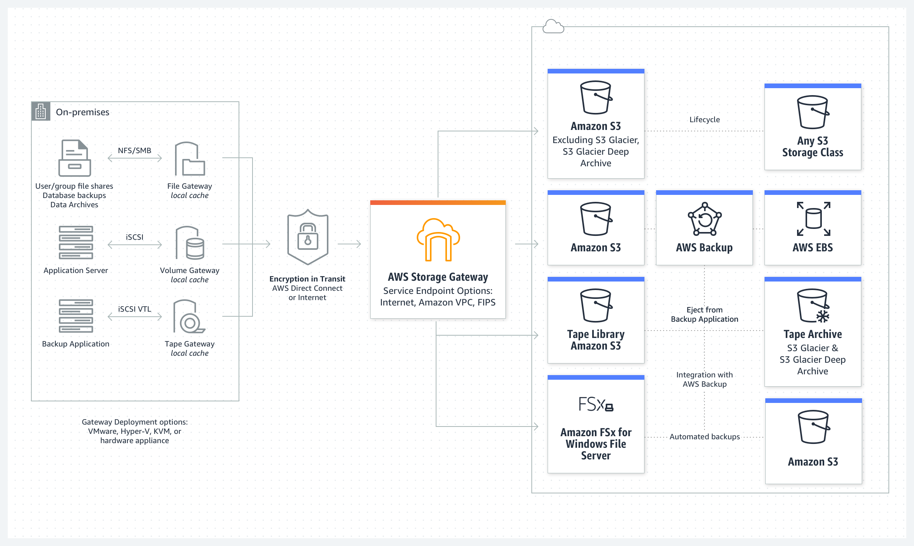

 [Conteudo Geral AWS Cloud][1]

[1]: https://github.com/weder96/aws-certification-learning

# Módulo 7: Armazenamento

## Conteúdo
1. <a href="#section-1"> Amazon Simple Storage Service (S3) </a>
2. <a href="#section-2"> AWS Snowball </a>
3. <a href="#section-3"> Amazon Elastic Block Store (EBS) </a>
4. <a href="#section-4"> Instance Store Volumes </a>
5. <a href="#section-5"> Amazon Elastic File System (EFS) </a>
6. <a href="#section-6"> AWS Storage Gateway </a>

----------------------------------------------------------------------------------------------------

##  **1 - Amazon Simple Storage Service (S3)**

O Amazon S3 é um armazenamento de objetos criado para armazenar e recuperar qualquer quantidade de dados de qualquer lugar – sites e aplicativos móveis, aplicativos corporativos e dados de sensores ou dispositivos de IoT.

Você pode armazenar qualquer tipo de arquivo no S3.

O S3 foi projetado para oferecer 99,999999999% de durabilidade e armazena dados de milhões de aplicativos usados ​​por líderes de mercado em todos os setores.

O S3 oferece recursos abrangentes de segurança e conformidade que atendem até mesmo aos requisitos regulatórios mais rigorosos.

O S3 oferece aos clientes flexibilidade na maneira como gerenciam dados para otimização de custos, controle de acesso e conformidade.

Os casos de uso típicos incluem:
- **Backup e armazenamento** – Fornece serviços de backup e armazenamento de dados para outros.
- **Hospedagem de Aplicativos** – Fornece serviços que implantam, instalam e gerenciam aplicativos da web.
- **Hospedagem de mídia** – Crie uma infraestrutura redundante, escalável e altamente disponível que hospede uploads e downloads de vídeos, fotos ou músicas.
- **Entrega de software** – hospede seus aplicativos de software que os clientes podem baixar.
- **Site estático** – você pode configurar um site estático para ser executado a partir de um bucket do S3.

O S3 fornece funcionalidade de consulta no local, permitindo que você execute análises poderosas diretamente em seus dados em repouso no S3. E o Amazon S3 é o serviço de armazenamento em nuvem com mais suporte disponível, com integração da maior comunidade de soluções de terceiros, parceiros integradores de sistemas e outros serviços da AWS.

Os arquivos podem ter de 0 bytes a 5 TB.

Há armazenamento ilimitado disponível.

Os arquivos são armazenados em buckets.

Os buckets são pastas de nível raiz.

Qualquer subpasta dentro de um bucket é conhecida como “pasta”.

S3 é um namespace universal, portanto, os nomes dos buckets devem ser exclusivos globalmente.

**Existem sete classes de armazenamento S3.**
- **S3 Standard** (durável, disponível imediatamente, acessado com frequência).
- **S3 Intelligent-Tiering** (move automaticamente os dados para o nível mais econômico).
- **S3 Standard-IA** (durável, disponível imediatamente, acessado com pouca frequência).
- **S3 One Zone-IA** (menor custo para dados acessados ​​com pouca frequência com menos resiliência).
- **S3 Glacier Instant Retrieval** (dados raramente acessados ​​e que requerem recuperação em milissegundos).
- **S3 Glacier Flexible Retrieval** (dados arquivados, tempos de recuperação em minutos ou horas).
- **S3 Glacier Deep Archive** (classe de armazenamento de menor custo para retenção de longo prazo).

A tabela abaixo fornece os detalhes de cada classe de armazenamento do Amazon S3:

| 	|S3 Standard	|S3 Intelligent Tiering	|S3 Standard-IA	|S3 One Zone-IA	|S3 Glacier Instant Retrieval	|S3 Glacier Flexible Retrieval	|S3 Glacier Deep Archive|
|---|---------------|-----------------------|---------------|---------------|-------------------------------|-------------------------------|---------------|
|Designed for durability	|11 9s	|11 9s	|11 9s	|11 9s	|11 9s	|11 9s	|11 9s|
|Designed for availability	|99.99%	|99.9&	|99.9%	|99.5%	|99.9%	|99.99%	|99.99%|
|Availability SLA	        |99.9%	|99%	|99%	|99%	|99%	|99.99%	|99.9%|
|Availability Zones	        |≥3	|≥3	|≥3	|1	|≥3	|≥3	|≥3|
|Minimum capacity charge per object	|N/A	|N/A	|128KB	|128KB	|128KB	|40KB	|40KB|
|Minimum storage duration charge	|N/A	|N/A	|30 days	|30 days	|90 days	|90 days	|180 days|
|Retrieval fee	|N/A	|N/A	|Per GB retrieved	|Per GB retrieved	|Per GB retrieved	|Per GB retrieved	|Per GB retrieved|
|First byte latency	|milliseconds	|milliseconds	|milliseconds	|milliseconds	|milliseconds	|minutes or hours|	hours|

Quando você carrega com sucesso um arquivo para o S3, recebe um código HTTP 200.

O S3 é um armazenamento de dados persistente e altamente durável.

Os armazenamentos de dados persistentes são sistemas de armazenamento não voláteis que retêm dados quando desligados.

Isso contrasta com armazenamentos de dados temporários e armazenamentos de dados efêmeros que perdem os dados quando desligados.

A tabela a seguir fornece uma descrição de armazenamentos de dados persistentes, transitórios e efêmeros e qual serviço da AWS usar:

|Storage Type	|Description	|Examples|
|---------------|---------------|--------|
|Persistent Data Store	|Data is durable and sticks around after reboots, restarts, or power cycles	|S3, Glacier, EBS, EFS|
|Transient Data Store	|Data is just temporarily stored and passed along to another process or persistent store	|SQS, SNS|
|Ephemeral Data Store	|Data is lost when the system is stopped	|EC2 Instance Store, Memcached|

**Os nomes dos buckets devem seguir um conjunto de regras:**
- Os nomes devem ser exclusivos em toda a AWS.
- Os nomes devem ter de 3 a 63 caracteres.
- Os nomes só podem conter letras minúsculas, números e hífens.
- Os nomes não podem ser formatados como um endereço IP.

**Os objetos consistem em:**
- Chave (nome do objeto).
- Valor (dados formados por uma sequência de bytes).
- ID da versão (usado para controle de versão).
- Metadados (dados sobre os dados armazenados).

**Sub-recursos:**
- Listas de controle de acesso.
- Torrent.

Compartilhamento de objetos – a capacidade de disponibilizar publicamente qualquer objeto por meio de um URL.

Gerenciamento do ciclo de vida – defina regras para transferir objetos entre classes de armazenamento em intervalos de tempo definidos.

Controle de versão – mantém automaticamente várias versões de um objeto (quando ativado).

A criptografia pode ser habilitada para o bucket.

Os dados são protegidos usando ACLs e políticas de bucket.

**Cobranças:**
- Armazenar(Storage).
- Solicitações(Requests).
- Preços de gerenciamento de armazenamento.(Storage management pricing)
- Preços de transferência de dados. (Data transfer pricing.)
- Aceleração de transferência.(Transfer acceleration)

Ao criar um bucket, você precisa selecionar a região onde ele será criado.

É uma prática recomendada criar buckets em regiões fisicamente mais próximas de seus usuários para reduzir a latência.

Os recursos adicionais oferecidos pelo Amazon S3 incluem:

|Additional S3 Capability	|How it Works|
|---------------------------|------------|
|Transfer Acceleration	|Speed up data uploads using CloudFront in reverse|
|Requester Pays	|The requester rather than the bucket owner pays for requests and data transfer|
|Tags	|Assign tags to objects to use in costing, billing, security etc.|
|Events	|Trigger notifications to SNS, SQS, or Lambda when certain events happen in your bucket|
|Static Web Hosting	|Simple and massively scalable static website hosting|
|BitTorrent	|Use the BitTorrent protocol to retrieve any publicly available object by automatically generating a .torrent file|

----------------------------------------------------------------------------------------------------
##  **2 - AWS Snowball**
AWS Snowball (Snowball), você pode transferir centenas de terabytes ou petabytes de dados entre seus data centers locais e o Amazon Simple Storage Service (Amazon S3).

Usa um dispositivo de armazenamento seguro para transporte físico.

O AWS Snowball Client é um software instalado em um computador local e usado para identificar, compactar, criptografar e transferir dados.

Usa criptografia de 256 bits (gerenciada com o AWS KMS) e gabinetes à prova de adulteração com TPM.

A tabela abaixo descreve as ofertas do AWS Snow em alto nível:

|Service	|What it Is|
|-----------|----------|
|AWS Snowball	|Bulk data transfer, edge storage, and edge compute|
|AWS Snowmobile	|A literal shipping container full of storage (up to 100PB) and a truck to transport it|
|AWS Snowcone	|The smallest device in the range that is best suited for outside the data center|

O Snowball pode importar para o S3 ou exportar do S3.

Importar/exportar é quando você envia seus próprios discos para a AWS – isso está sendo preterido em favor do Snowball.

O Snowball deve ser encomendado e devolvido na mesma região.

Para acelerar a transferência de dados, é recomendável executar instâncias simultâneas do AWS Snowball Client em vários terminais e transferir pequenos arquivos em lotes.

----------------------------------------------------------------------------------------------------
##  **3 - Amazon Elastic Block Store (EBS)**

O Amazon Elastic Block Store (Amazon EBS) fornece volumes de armazenamento em bloco persistentes para uso com instâncias do Amazon EC2 na Nuvem AWS.

Cada volume do Amazon EBS é replicado automaticamente em sua zona de disponibilidade para protegê-lo contra falhas de componentes, oferecendo alta disponibilidade e durabilidade.

Os volumes do Amazon EBS oferecem o desempenho consistente e de baixa latência necessário para executar suas cargas de trabalho. Com o Amazon EBS, você pode aumentar ou diminuir seu uso em minutos – tudo isso pagando um preço baixo apenas pelo que você provisiona.

Os seguintes volumes do EBS aparecem com mais frequência nos exames da AWS:

|Volume Type	|EBS Provisioned IOPS SSD (io1/io2)    |EBS General Purpose SSD (gp2/gp3)	|Throughput Optimized HDD (st1)	|Cold HDD (sc1)|
|---------------|--------------------------------------|------------------------------------|-------------------------------|--------------|
|Short Description	|Highest performance SSD volume designed for latency-sensitive transactional workloads|	General Purpose SSD volume that balances price performance for a wide variety of transactional workloads|	Low-cost HDD volume, designed for frequently accessed. Throughput intensive workloads|	Lowest cost HDD volume designed for less frequently accessed workloads|
|Use Cases	|I/O-intensive NoSQL and relational databases|	Boot volumes, low-latency interactive apps, dev & test|	Big-data, data warehouses, log processing|	Colder data requiring fewer scans per day|
|Volume Size	|4 GiB – 16 TiB|	1 GiB – 16 TiB|	125 GB – 16 TiB	|125 GB – 16 TiB|
|Max IOPS** / Volume	|64,000	|16,000	|500	|250|
|Max Throughput***Volume	|1,000 MiB/s	|250 MiB/s (gp2) |1000 MiB/s (gp3) |500 MiB/s	|250 MiB/s|
|Can be boot volume?	|Yes	|Yes	|No	|No|
|EBS Multi-attach	|Supported	|Not Supported	|Not Supported	|Not Supported|

Os dados do volume EBS persistem independentemente da vida útil da instância.

Os volumes do EBS não precisam ser anexados a uma instância.

Você pode anexar vários volumes do EBS a uma instância.

Você não pode anexar um volume do EBS a várias instâncias (em vez disso, use o Elastic File Store).

Os volumes do EBS devem estar na mesma AZ das instâncias às quais estão anexados.

A proteção contra encerramento é desativada por padrão e deve ser habilitada manualmente (mantém o volume/dados quando a instância é encerrada).

Os volumes raiz do EBS são excluídos no encerramento por padrão.

Volumes extras que não são de inicialização não são excluídos no encerramento por padrão.

O comportamento pode ser alterado alterando o atributo “DeleteOnTermination”.

EBS Snapshots:
- Snapshots capturam um estado pontual de uma instância.
- Snapshots são armazenados no S3.
- Não fornece backup granular (não substitui o software de backup).
- Se você fizer instantâneos periódicos de um volume, os Snapshots serão incrementais, o que significa que apenas os blocos no dispositivo que foram alterados após o último instantâneo são salvos no novo instantâneo.
- Embora os instantâneos sejam salvos de forma incremental, o processo de exclusão de instantâneo é projetado para que você precise reter apenas o instantâneo mais recente para restaurar o volume.
- Snapshots só podem ser acessados ​​por meio das APIs do EC2.
- Os volumes do EBS são específicos da AZ, mas os Snapshots são específicos da região.
----------------------------------------------------------------------------------------------------
##  **4 - Instance Store Volumes**

Os **Instance Store Volumes** são discos locais de alto desempenho que são fisicamente conectados ao computador host no qual uma instância do EC2 é executada.

Os **Instance Store Volumes** são efêmeros, o que significa que os dados são perdidos quando desligados (não persistentes).

Os **Instance Store Volumes** são ideais para armazenamento temporário de informações que mudam com frequência, como buffers, caches ou dados temporários.

Os dispositivos raiz do **Instance Store Volumes** são criados a partir de modelos de AMI armazenados no S3.

Os **Instance Store Volumes** não podem ser desanexados/reanexados.

----------------------------------------------------------------------------------------------------
##  **5 - Amazon Elastic File System (EFS)**

O EFS é um serviço totalmente gerenciado que facilita a configuração e o dimensionamento do armazenamento de arquivos na Amazon Cloud.

Bom para big data e análises, fluxos de trabalho de processamento de mídia, gerenciamento de conteúdo, serviço da Web, diretórios pessoais etc.

O EFS usa o protocolo NFS.

Pague pelo que usar (sem necessidade de pré-provisionamento).

Pode escalar até petabytes.

O EFS é elástico e cresce e diminui à medida que você adiciona e remove dados.

Pode conectar simultaneamente de 1 a 1.000 instâncias do EC2, de várias AZs.

Um sistema de arquivos pode ser acessado simultaneamente de todas as AZs na região onde está localizado.

Por padrão, você pode criar até 10 sistemas de arquivos por conta.

O acesso local pode ser habilitado via Direct Connect ou AWS VPN.

Pode escolher General Purpose ou Max I/O (ambos SSD).

A VPC da instância de conexão deve ter nomes de host DNS habilitados.

O EFS fornece uma interface de sistema de arquivos, semântica de acesso ao sistema de arquivos (como consistência forte e bloqueio de arquivos).

Os dados são armazenados em várias AZs em uma região.

Leia após a consistência da gravação.

Precisa criar destinos de montagem e escolher AZs para incluir (recomendado incluir todas as AZs).

As instâncias podem estar atrás de um ELB.

**Existem dois modos de desempenho:**
- O modo de desempenho “General Purpose” é apropriado para a maioria dos sistemas de arquivos.
- O modo de desempenho “Max I/O” é otimizado para aplicativos em que dezenas, centenas ou milhares de instâncias do EC2 estão acessando o sistema de arquivos.

O Amazon EFS foi projetado para intermitência para permitir altos níveis de taxa de transferência por períodos de tempo.

----------------------------------------------------------------------------------------------------
##  **6 - AWS Storage Gateway**

O [**AWS Storage Gateway**](https://aws.amazon.com/storagegateway/?whats-new-cards.sort-by=item.additionalFields.postDateTime&whats-new-cards.sort-order=desc) é um serviço de armazenamento em nuvem híbrida que oferece acesso local a armazenamento em nuvem praticamente ilimitado.

Os clientes usam o Storage Gateway para simplificar o gerenciamento de armazenamento e reduzir custos para os principais casos de uso de armazenamento em nuvem híbrida.

Isso inclui mover backups para a nuvem, usar compartilhamentos de arquivos locais com suporte de armazenamento em nuvem e fornecer acesso de baixa latência a dados na AWS para aplicativos locais.

Para dar suporte a esses casos de uso, o Storage Gateway oferece três tipos diferentes de gateways:
- **File Gateway** – fornece interfaces de sistema de arquivos para servidores locais.
- **Volume Gateway** – fornece acesso baseado em bloco para servidores locais.
- **Tape Gateway** – fornece uma biblioteca de fitas virtuais compatível com software de backup comum (interfaces de bloco e arquivo).

How it works

AWS Storage Gateway is a set of hybrid cloud storage services that provide on-premises access to virtually unlimited cloud storage.

