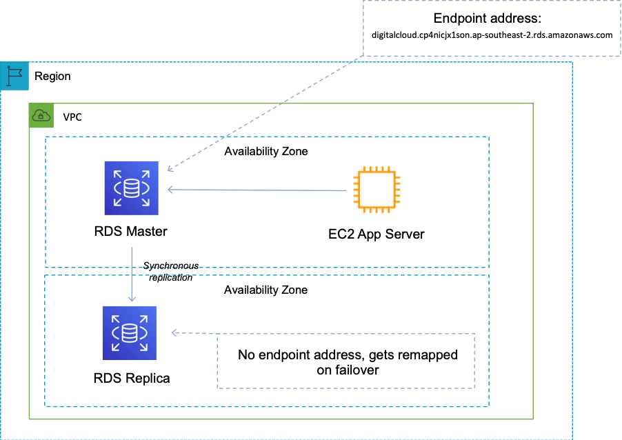

 [General Content AWS Cloud][1]

[1]: https://github.com/weder96/aws-certification-learning

# Module 8: Databases

## Content
1. <a href="#section-01"> Use Cases For Different Database Types </a>
2. <a href="#section-02"> Amazon Relational Database Service (RDS) </a>
3. <a href="#section-03"> Amazon DynamoDB </a>
4. <a href="#section-04"> Amazon RedShift </a>
5. <a href="#section-05"> Amazon ElastiCache </a>
6. <a href="#section-06"> Amazon EMR </a>
7. <a href="#section-07"> Amazon (RDS) Pricing </a>
8. <a href="#section-08"> Amazon (RDS) Multiple Availability Zones (A-Z) </a>
9. <a href="#section-09"> Enable automatic patching for the instances using the Amazon RDS console </a>
10. <a href="#section-10"> Backups and Restoring a DB instance to a specified time </a>
11. <a href="#section-11"> Amazon Neptune </a>
12. <a href="#section-12"> Amazon Aurora </a>
13. <a href="#section-13"> Amazon DocumentDB </a>
14. <a href="#section-14"> Amazon QLDB is serverless </a>

***********************************************************************************************************
##  **1  - Use Cases For Different Database Types**

The table below provides guidance on typical use cases for various AWS database/data storage services:

### **Database on EC2**
- Full control over instance and database
- Preferred DB not available in RDS

### **Amazon RDS**
- Need traditional relational database for OLTP
- Your data is well formed and structured
- Existing applications that require RDBMS

### **Amazon DynamoDB**
- Name/value pair data
- Unpredictable data structure
- In-memory performance with persistence
- High I/O needs
- Requires dynamic scaling

### **Amazon RedShift**
- Data warehouse for large volumes of aggregated data
- Mainly OLAP workloads

### **Amazon Neptune**
- Relationships between objects are of high value

### **Amazon ElastiCache**
- Fast temporary storage for small amounts of data
- Highly volatile (non-persistent) data

### **Amazon S3**
- Large binary objects (BLOBs)
- static websites

We will now cover several of these database types that may come up on the exam.

With AWS managed services you can reduce your time spent performing common IT tasks. With services such as Amazon RDS, AWS will patch the database host operating system and database software and perform patch management activities.

* "Patching database software" is a correct answer.

* "Taking a backup of a database" is also a correct answer.

**Cheat Sheets**

https://digitalcloud.training/aws-database-services/

**References:**

https://aws.amazon.com/rds/

**Videos**

**********************************************************************************************************
##  **2  - Amazon Relational Database Service (RDS)**

Amazon Relational Database Service (Amazon RDS) is a managed service that makes it easy to set up, operate, and scale a relational database in the cloud.

Relational databases are known as SQL (Structured Query Language) databases.

Non-relational databases are known as NoSQL databases.

RDS is a type of OLTP (Online Transaction Processing) database.

Amazon RDS is a managed relational database service on which you can run several types of database software. The service is managed so this reduces the database administration tasks an administrator would normally undertake. The managed service includes hardware provisioning, database setup, patching and backups.

### **RDS Features and Benefits:**
- SQL database type.
- Can be used to perform complex queries and joins.
- Easy to configure, highly available, fault tolerant and scalable.
- Used when the data is clearly defined.
- Common use cases include online stores and banking systems.

### **Amazon RDS supports the following database engines:**
- SQL Server.
- Oracle.
- MySQL Server.
- PostgreSQL.
- Aurora.
- MariaDB.

**Aurora is Amazon's proprietary database**.

RDS is a fully managed service and you do not have access to the underlying EC2 instance (no root access).

### **RDS service includes the following:**
- Security and patching of database instances.
- Automated backup for the DB instances.
- Software updates for the database engine.
- Easy scaling for storage and compute.
- Multi-AZ option with synchronous replication.
- Automatic failover for Multi-AZ option.
- Read replica option for read-heavy workloads.
- A DB instance is a cloud database environment with the compute and storage resources you specify.

### **Cryptography:**

- You can encrypt your Amazon RDS instances and snapshots at rest by enabling the encryption option for your Amazon RDS DB instance.
- Encryption at rest is supported for all database types and uses AWS KMS.
- You cannot encrypt an existing database, you need to create a snapshot, copy it, encrypt the copy and build an encrypted database from the snapshot.

### **Database subnet groups:**

- A DB subnet group is a collection of subnets (usually private) that you create within a VPC and assign to your DB instances.
- Each DB subnet group must have subnets in at least two Availability Zones in each region.
- It is recommended to configure a subnet group with subnets in each AZ (even for standalone instances).

### **AWS billing by:**
- DB instance hours (partial hours are billed as full hours).
- GB/month storage.
- I/O requests/month – for magnetic storage.
- Provisioned IOPS/month – for SSD IOPS provisioned by RDS.
- Outgoing data transfer.
- Backup storage (database backups and manual snapshots).

### **Scalability:**
- You can only increase RDS (compute and storage).
- You cannot decrease the storage allocated to an RDS instance.
- You can scale storage and change storage type for all database engines except MS SQL.

### **RDS provides multi-AZ disaster recovery that provides fault tolerance across Availability Zones:**
- RDS Multi-AZ creates a replica in another AZ and synchronously replicates to it (DR only).
- There is an option to choose multi-AZ during startup wizard.
- AWS recommends using provisioned IOPS storage for multi-AZ RDS DB Instances.
- Each AZ runs on its own physically distinct and independent infrastructure and is designed to be highly reliable.
- You cannot choose which AZ in the region to choose to create the standby DB instance.

### **Read replicas - provide improved performance for reads:**
- Read replicas are used for read heavy databases and replication is asynchronous.
- Read replicas are for workload sharing and offloading.
- Read replicas provide read-only DR.
- Read replicas are created from a snapshot of the master instance.
- Must have automated backups enabled on the primary (retention period > 0).

****************************************************** ****************************************************** ***********
##  **3  - Amazon DynamoDB**
Amazon DynamoDB is a fully managed NoSQL database service that delivers fast, predictable performance with seamless scalability.

### **Features and Benefits of Dynamo DB:**
- NoSQL (non-relational) database type.
- Fast, highly available and fully managed.
- Used when data is fluid and can change.
- Common use cases include social media and web analytics.

Button scaling means you can scale your database at any time without incurring downtime.

SSD-based and uses limited indexing on attributes for performance.

DynamoDB is a web service that uses HTTP over SSL (HTTPS) as the transport and JSON as the message serialization format.

Amazon DynamoDB stores three geographically distributed replicas of each table to enable high availability and data durability.

Data is synchronously replicated across 3 facilities (AZs) in a region.

### **Interregion replication allows you to replicate between regions:**
- Amazon DynamoDB Global Tables provides a fully managed solution for deploying a multi-region, multi-master database.
- When creating a global table, you specify the AWS regions where you want the table to be available.
- DynamoDB performs all the necessary tasks to create identical tables in these regions and propagate rolling data changes to all of them.

Provides low read and write latency.

Increase or decrease storage and throughput as needed, with no code changes or downtime.

DynamoDB has no schema.

DynamoDB can be used to store session state.

It provides two reading models.

### **Occasionally consistent readings (Default):**
- The eventual consistency option maximizes your read throughput (better read performance).
- An eventually consistent read may not reflect the results of a recently completed write.
- Consistency in all copies reached in 1 second.

### **Strongly consistent readings:**
- A strongly consistent read returns a result that reflects all writes that received a successful response before the read (faster consistency).

Amazon DynamoDB Accelerator (DAX) is a fully managed, highly available in-memory cache for DynamoDB that delivers up to a 10x performance improvement – ​​from milliseconds to microseconds – even at millions of requests per second.

****************************************************** ****************************************************** ***********
##  **4  - Amazon RedShift**

Amazon Redshift is a fast, fully managed data warehouse that makes it simple and cost-effective to analyze all your data using standard SQL and existing Business Intelligence (BI) tools.

RedShift is an SQL-based data warehouse used for analytics applications.

RedShift is a relational database used for OLAP (Online Analytics Processing) use cases.

RedShift is used to run complex analytical queries on petabytes of structured data, using sophisticated query optimization, columnar storage on high-performance local disks, and massively parallel query execution.

RedShift is ideal for processing large amounts of data for business intelligence.

RedShift is 10x faster than a traditional SQL database.

### **RedShift uses columnar data storage:**
- Data is stored sequentially in columns instead of rows.
- Column-based database is ideal for data storage and analysis.
- Requires less I/Os, which greatly increases performance.

### **RedShift provides advanced compression:**
- Data is stored sequentially in columns, which allows for much better performance and less storage space.
- RedShift automatically selects the compression scheme.

RedShift uses replication and continuous backups to increase availability and durability and can automatically recover from component and node failures.

### **RedShift always keeps three copies of your data:**
- The original.
- A replica on compute nodes (within the cluster).
- A backup copy on S3.

### **RedShift provides continuous/incremental backups:**
- Multiple copies within a cluster.
- Continuous and incremental backups to S3.
- Continuous and incremental backups between regions.
- Restoration of streaming.

### **RedShift provides fault tolerance for the following faults:**
- Disk failures.
- Faults from us.
- Network failures.
- AZ/region level disasters.

***************************************************************************************************************
##  **5  - Amazon ElastiCache**
ElastiCache is a web service that makes it easy to deploy and run server nodes that support the Memcached or Redis protocol in the cloud.

The in-memory cache provided by ElastiCache can be used to significantly improve latency and throughput for many read-intensive application workloads or compute-intensive workloads.

Best for scenarios where the database load is based on OLAP (Online Analytics Processing) transactions.

### **The following table describes some typical ElastiCache use cases:**
### **Web session store**
- In cases with load balanced web servers, store the web session information in Redis so that if one server is lost, the session information is not lost and another web server can recover it

### **Database caching**
- Use Memcached in front of AWS RDS to cache popular queries to offload RDS work and return results faster to users

### **Leaderboards**
- Use Redis to provide a live leaderboard to millions of users of your mobile app

### **Streaming data dashboards**
- Provide a landing point to transmit sensor data to the shop floor, providing real-time live dashboard views

ElastiCache EC2 nodes cannot be accessed from the internet or EC2 instances in other VPCs.

They can also be On-Demand or Reserved Instances (but not Spot Instances).

ElastiCache can be used to store session state.

### **There are two types of ElastiCache engine:**
- **Memcached** – simpler model, can run large nodes with multiple cores/threads, can scale in and out, can cache objects like databases.
- **Redis** – complex model, supports encryption, master/slave replication, cross AZ (HA), automatic failover and backup/restore.

****************************************************** ****************************************************** ***********
##  **6  - Amazon EMR**

**Amazon EMR** is a web service that enables companies, researchers, data analysts, and developers to process large amounts of data easily and cost-effectively.

EMR uses a hosted Hadoop framework running on Amazon EC2 and Amazon S3.

Managed Hadoop framework for processing large amounts of data.

It also supports **Apache Spark, HBase, Presto and Flink**.

Most commonly used for log analysis, financial analysis, or extract, translate, and load (ETL) activities.

****************************************************** ****************************************************** ***********
##  **7  - Amazon (RDS) Pricing**

[Amazon (RDS) Pricing](https://aws.amazon.com/rds/pricing/?nc1=h_ls)

Amazon Relational Database Service (Amazon RDS) is a managed, highly available, and secure database service that makes it simple to set up, operate, and scale databases in the cloud. Amazon RDS is free to try and you pay only for what you use with no minimum fees. You can pay for Amazon RDS using On-Demand or Reserved Instances. Estimate your monthly bill using the AWS Pricing Calculator.

Amazon RDS provides a selection of instance types optimized to fit different relational database use cases. Select one of the Amazon RDS database engines below to view pricing. See Previous Generation Instances for previous instance pricing not listed here.

For Amazon RDS feature-level pricing, see RDS Performance Insights and RDS Proxy pricing pages.

As part of the AWS Free Tier, Amazon RDS helps new AWS customers get started for free with a managed database service in the cloud. Each calendar month, the 

**Amazon RDS Free Tier allows you to use:**
- 750 hours of Amazon RDS Single-AZ db.t2.micro, db.t3.micro, and db.t4g.micro Instances usage running MySQL, MariaDB, PostgreSQL databases each month. If running more than one instance, usage is aggregated across instance classes.
- 750 hours of Amazon RDS Single-AZ db.t2.micro Instance usage running Oracle BYOL or SQL Server (running SQL Server Express Edition). Oracle BYOL db.t3.micro  Single-AZ Instance usage is also included as part of the Amazon RDS free tier. If running both a db.t2.micro Single-AZ Instance and a db.t3.micro Single-AZ Instance on Oracle BYOL, usage is aggregated across Instance classes.
- 20 GB of General Purpose (SSD) DB storage.
- 20 GB of storage for your automated database backups and any user-initiated DB Snapshots.

With Amazon RDS you are charged for the type and size of database, the uptime, any additional storage of backup (above the DB size), requests, deployment type (e.g. you pay for multi AZ), and data transfer outbound.

***************************************************************************************************************
##  **8  - Amazon (RDS) Multiple Availability Zones (A-Z)**
[Amazon (RDS) Multiple Availability Zones](https://aws.amazon.com/rds/features/multi-az/)

Multi AZ provides a mechanism to failover the RDS database to another synchronously replicated copy in the event of the failure of an AZ. The endpoint address for the RDS instances gets remapped to the standby instance as can be seen in the image below:

##  **9 - Enable automatic patching for the instances using the Amazon RDS console**

[Enable automatic patching](https://docs.aws.amazon.com/AmazonRDS/latest/UserGuide/USER_UpgradeDBInstance.Maintenance.html)

Periodically, Amazon RDS performs maintenance on Amazon RDS resources. Maintenance most often involves updates to the DB instance's underlying hardware, underlying operating system (OS), or database engine version. Updates to the operating system most often occur for security issues and should be done as soon as possible.

Required patching is automatically scheduled only for patches that are related to security and instance reliability. Such patching occurs infrequently (typically once every few months) and seldom requires more than a fraction of your maintenance window.

-----------------------------------------------------------------------------------------------------------------------
##  **9  - Enable automatic patching for the instances using the Amazon RDS console**

**Cheat Sheets**

**References:**

**Videos**

-----------------------------------------------------------------------------------------------------------------------
##  **10 - Backups and Restoring a DB instance to a specified time**
[Restoring a DB instance](https://docs.aws.amazon.com/AmazonRDS/latest/UserGuide/USER_PIT.html)

You can restore an Amazon RDS database instance to a specific point in time with a granularity of 5 minutes. Amazon RDS uses transaction logs which it uploads to Amazon S3 to do this.

**To restore a DB instance to a specified time in aws console:**
 - Restore to point in time.
 - The Restore to point in time window appears.

 **Point-in-time recovery (PITR)
 Point-in-time recovery (PITR) provides continuous backups of your DynamoDB table data. When enabled, DynamoDB maintains incremental backups of your table for the last 35 days until you explicitly turn it off. It is a customer responsibility to enable PITR on and AWS is responsible for actually performing the backups.

"The customer is responsible for configuring and AWS is responsible for performing backups".

**Cheat Sheets**

https://digitalcloud.training/aws-database-services/

**References:**

https://aws.amazon.com/blogs/aws/new-amazon-dynamodb-continuous-backups-and-point-in-time-recovery-pitr/

**Videos**

https://www.youtube.com/watch?v=YVe9amljgaw&t=45s
https://www.youtube.com/watch?v=n0KK094sPnQ

-----------------------------------------------------------------------------------------------------------------------
##  **11 - Amazon Neptune**

**Cheat Sheets**

https://tutorialsdojo.com/amazon-neptune/

**References:**

https://aws.amazon.com/neptune/

**Videos**

https://www.youtube.com/results?search_query=aws+neptume

-----------------------------------------------------------------------------------------------------------------------
##  **12 - Amazon Aurora**

**Cheat Sheets**

https://digitalcloud.training/amazon-aurora/

https://tutorialsdojo.com/amazon-aurora/

**References:**

https://docs.aws.amazon.com/AmazonRDS/latest/AuroraUserGuide/

https://aws.amazon.com/rds/aurora/details/mysql-details/

https://aws.amazon.com/rds/aurora/details/postgresql-details/

https://aws.amazon.com/rds/aurora/global-database/

https://aws.amazon.com/rds/aurora/parallel-query/

https://aws.amazon.com/rds/aurora/serverless/

https://aws.amazon.com/rds/aurora/pricing/

https://aws.amazon.com/rds/aurora/faqs/

**Videos**

https://www.youtube.com/results?search_query=Amazon+Aurora

https://www.youtube.com/watch?v=U42mC_iKSBg

https://www.youtube.com/watch?v=iwS1h7rLNBQ&t=2s

-----------------------------------------------------------------------------------------------------------------------
##  **13 - Amazon DocumentDB**

**Cheat Sheets**

https://tutorialsdojo.com/amazon-documentdb/

**References:**

https://aws.amazon.com/documentdb/faqs/

https://aws.amazon.com/blogs/database/migrating-to-amazon-documentdb-with-the-online-method/

**Videos**

https://www.youtube.com/results?search_query=documentdb+aws

-----------------------------------------------------------------------------------------------------------------------
##  **14 - Amazon QLDB Serverless**

**Cheat Sheets**

https://tutorialsdojo.com/amazon-quantum-ledger-database-qldb/

**References:**

https://aws.amazon.com/qldb/faqs/

https://aws.amazon.com/qldb/pricing/

https://aws.amazon.com/blogs/aws/now-available-amazon-quantum-ledger-database-qldb/

**Videos**

https://www.youtube.com/results?search_query=Amazon+QLDB

**Cheat Sheets**
**References:**
**Videos**