 [General Content AWS Cloud][1]

[1]: https://github.com/weder96/aws-certification-learning

# Module 8: Databases

## Content
1.  <a href="#section-01"> Use Cases For Different Database Types </a>
2.  <a href="#section-02"> Amazon Relational Database Service (RDS) </a>
3.  <a href="#section-03"> Amazon DynamoDB </a>
4.  <a href="#section-04"> Amazon RedShift </a>
5.  <a href="#section-05"> Amazon ElastiCache </a>
6.  <a href="#section-06"> Amazon EMR </a>
7.  <a href="#section-07"> Amazon (RDS) Pricing </a>
8.  <a href="#section-08"> Amazon (RDS) Multiple Availability Zones (A-Z) </a>
9.  <a href="#section-09"> Enable automatic patching for the instances using the Amazon RDS console </a>
10. <a href="#section-10"> Backups and Restoring a DB instance to a specified time </a>
11. <a href="#section-11"> Amazon Neptune </a>
12. <a href="#section-12"> Amazon Aurora </a>
13. <a href="#section-13"> Amazon DocumentDB (with MongoDB compatibility)</a>
14. <a href="#section-14"> Amazon QLDB is serverless </a>
15. <a href="#section-15"> Amazon Aurora Serverless </a>
16. <a href="#section-16"> Amazon Keyspaces (for Apache Cassandra) </a>
17. <a href="#section-17"> Amazon Timestream  </a>
18. <a href="#section-18"> Global Databases  </a>
19. <a href="#section-19"> Amazon MemoryDB for Redis</a>

***********************************************************************************************************
##  **01 - Use Cases For Different Database Types**

The table below provides guidance on typical use cases for various AWS database/data storage services:

### **Database on EC2**
- Full control over instance and database
- Preferred DB not available in RDS

### **Amazon RDS**
- Need traditional relational database for OLTP
- Your data is well formed and structured
- Existing applications that require RDBMS

### **Amazon DynamoDB**
- Name/value pair data
- Unpredictable data structure
- In-memory performance with persistence
- High I/O needs
- Requires dynamic scaling

### **Amazon RedShift**
- Data warehouse for large volumes of aggregated data
- Mainly OLAP workloads

### **Amazon Neptune**
- Relationships between objects are of high value

### **Amazon ElastiCache**
- Fast temporary storage for small amounts of data
- Highly volatile (non-persistent) data

### **Amazon S3**
- Large binary objects (BLOBs)
- static websites

We will now cover several of these database types that may come up on the exam.

With AWS managed services you can reduce your time spent performing common IT tasks. With services such as Amazon RDS, AWS will patch the database host operating system and database software and perform patch management activities.

* "Patching database software" is a correct answer.

* "Taking a backup of a database" is also a correct answer.

[sample-aws-database-cookbook](https://github.com/aws-samples/sample-aws-database-cookbook)

**Cheat Sheets**

https://digitalcloud.training/aws-database-services/

**References:**

https://aws.amazon.com/rds/

https://docs.aws.amazon.com/AmazonRDS/latest/UserGuide/USER_ReadRepl.html

https://docs.aws.amazon.com/AmazonRDS/latest/UserGuide/Overview.Encryption.html

https://docs.aws.amazon.com/AmazonRDS/latest/UserGuide/UsingWithRDS.SSL.html

https://docs.aws.amazon.com/prescriptive-guidance/latest/patterns/encrypt-an-existing-amazon-rds-for-postgresql-db-instance.html

**Videos**

**********************************************************************************************************
##  **02 - Amazon Relational Database Service (RDS)**

Amazon RDS (Relational Database Service) is a fully managed database service that simplifies the process of setting up, operating, and scaling relational databases in the cloud. AWS offers six familiar database engines for RDS, including:

- **Amazon Aurora**
- **PostgreSQL**
- **MySQL**
- **MariaDB**
- **Oracle Database**
- **SQL Server**

RDS handles routine database tasks such as hardware provisioning, database setup, patching, backups, and scaling, allowing users to focus on their applications rather than on database management. Amazon RDS is designed for applications with traditional relational database needs but **is not meant for Big Data** scenarios.

Relational databases are known as SQL (Structured Query Language) databases.

Non-relational databases are known as NoSQL databases.

RDS is a type of OLTP (Online Transaction Processing) database.

Amazon RDS is a managed relational database service on which you can run several types of database software. The service is managed so this reduces the database administration tasks an administrator would normally undertake. The managed service includes hardware provisioning, database setup, patching and backups.

### **RDS Features and Benefits:**
- SQL database type.
- Can be used to perform complex queries and joins.
- Easy to configure, highly available, fault tolerant and scalable.
- Used when the data is clearly defined.
- Common use cases include online stores and banking systems.

### **Amazon RDS supports the following database engines:**
- SQL Server.
- Oracle.
- MySQL Server.
- PostgreSQL.
- Aurora.
- MariaDB.

**Aurora is Amazon's proprietary database**.

RDS is a fully managed service and you do not have access to the underlying EC2 instance (no root access).

### **RDS service includes the following:**
- Security and patching of database instances.
- Automated backup for the DB instances.
- Software updates for the database engine.
- Easy scaling for storage and compute.
- Multi-AZ option with synchronous replication.
- Automatic failover for Multi-AZ option.
- Read replica option for read-heavy workloads.
- A DB instance is a cloud database environment with the compute and storage resources you specify.

### **Cryptography:**

- You can encrypt your Amazon RDS instances and snapshots at rest by enabling the encryption option for your Amazon RDS DB instance.
- Encryption at rest is supported for all database types and uses AWS KMS.
- You cannot encrypt an existing database, you need to create a snapshot, copy it, encrypt the copy and build an encrypted database from the snapshot.

### **Database subnet groups:**

- A DB subnet group is a collection of subnets (usually private) that you create within a VPC and assign to your DB instances.
- Each DB subnet group must have subnets in at least two Availability Zones in each region.
- It is recommended to configure a subnet group with subnets in each AZ (even for standalone instances).

### **AWS billing by:**
- DB instance hours (partial hours are billed as full hours).
- GB/month storage.
- I/O requests/month – for magnetic storage.
- Provisioned IOPS/month – for SSD IOPS provisioned by RDS.
- Outgoing data transfer.
- Backup storage (database backups and manual snapshots).

### **Scalability:**
- You can only increase RDS (compute and storage).
- You cannot decrease the storage allocated to an RDS instance.
- You can scale storage and change storage type for all database engines except MS SQL.

### **RDS provides multi-AZ disaster recovery that provides fault tolerance across Availability Zones:**
- RDS Multi-AZ creates a replica in another AZ and synchronously replicates to it (DR only).
- There is an option to choose multi-AZ during startup wizard.
- AWS recommends using provisioned IOPS storage for multi-AZ RDS DB Instances.
- Each AZ runs on its own physically distinct and independent infrastructure and is designed to be highly reliable.
- You cannot choose which AZ in the region to choose to create the standby DB instance.

### **Read replicas - provide improved performance for reads:**
- Read replicas are used for read heavy databases and replication is asynchronous.
- Read replicas are for workload sharing and offloading.
- Read replicas provide read-only DR.
- Read replicas are created from a snapshot of the master instance.
- Must have automated backups enabled on the primary (retention period > 0).

### High Availability and Durability

Amazon RDS provides several features to ensure the availability and durability of your database deployments.

### Multi-AZ Deployments

RDS Multi-AZ deployments enhance availability and durability by automatically replicating data across different Availability Zones (AZs). When you enable Multi-AZ, Amazon RDS creates a primary DB instance and synchronously replicates the data to a standby instance in a different AZ. Each AZ operates on distinct, independent infrastructure to ensure high reliability.

- In the event of a failure, RDS automatically fails over to the standby DB instance in another AZ.
- Failover times typically range from **60 to 120 seconds**.
- The standby takes over the primary’s DNS name.
- The standby replica, while highly available, cannot be used for reads or writes during normal operations; it only becomes active during a failover.
- **Cross-region Multi-AZ deployments are not supported**, but you can configure **Cross-Region Read Replicas** for disaster recovery.

### Cross-Region Automated Backups

RDS supports **Cross-Region Automated Backups**, **Manual Snapshots**, and **Read Replicas** across regions, which enable enhanced disaster recovery and high availability solutions. Automated backups can be copied to a different region, helping to protect against regional failures.

Read Replicas allow you to offload read traffic from your primary DB instance. These replicas can be asynchronously copied from the source instance and even promoted to become a standalone source in case of failure. This feature is valuable for **disaster recovery (DR)** and can be implemented across multiple AWS regions for additional resilience.

- The maximum number of read replicas depends on the database engine but generally supports up to **5 replicas**.
- Read replicas can be in the same region or in a different region.

### Security

RDS provides various layers of security to protect your data.

### Data Encryption

RDS supports **encryption at rest** using **AWS Key Management Service (KMS)**, as well as **encryption in transit** with **SSL/TLS**. You can encrypt your database connections, ensuring that sensitive data is securely transmitted between your applications and your database.

- **SSL certificates** are automatically created and installed when you provision an RDS instance.
- For **MySQL**, you launch the MySQL client using the `–ssl` parameter to reference the public key to encrypt connections.
- For **PostgreSQL**, you can force all connections to your PostgreSQL DB instance to use SSL.

Amazon RDS does not support enabling encryption for an existing database instance directly. To encrypt an existing unencrypted RDS database, the recommended approach is to take a snapshot of the unencrypted database, copy the snapshot with encryption, and then restore the RDS instance from this encrypted snapshot.

### Networking and Access Control

RDS supports Virtual Private Cloud (VPC) configurations, allowing you to isolate your database instances in your own network environment. **VPC Security Groups** and **IAM roles** are used to control access to your RDS instances.

### Backup and Recovery

RDS offers automated backups, point-in-time recovery, and manual snapshots, which help protect your data and ensure business continuity.

### Automated Backups

Amazon RDS allows you to configure automated backups to ensure that you can restore your database to any point in time within the retention period. The backups are stored in **Amazon S3**, and you can restore your database to any second during the backup retention period.

- Automated backups are enabled by default and provide point-in-time recovery.
- You can specify a backup window for RDS to minimize disruption during backups.

### Manual Snapshots

You can take manual snapshots of your DB instances at any time. These snapshots are stored in **Amazon S3** and can be restored as new DB instances. Unlike automated backups, manual snapshots are retained until you delete them.

- Snapshots can be shared across AWS accounts.
- Manual snapshots are ideal for retaining consistent backups of your database.

### Caching with ElastiCache

Amazon ElastiCache is an ideal front-end for data stores such as Amazon RDS, providing a high-performance middle tier for applications with extremely high request rates and/or low latency requirements. The best part of caching is that it’s minimally invasive to implement and by doing so, your application performance regarding both scale and speed is dramatically improved.

### Performance and Scaling

Amazon RDS is designed to scale easily with your application. Scaling can be achieved both vertically (by changing instance types) and horizontally (via read replicas).

### Vertical Scaling

You can vertically scale your database by modifying the instance type of your DB instance. This allows you to increase CPU, RAM, and storage capacity to handle more load or larger datasets. However, vertical scaling can involve some downtime.

### Horizontal Scaling

**Read Replicas** allow for horizontal scaling by offloading read traffic from the primary DB instance. This increases read throughput and provides higher availability for applications that require read-heavy workloads. Read replicas can be used to:

- Distribute read traffic.
- Serve as a disaster recovery mechanism by promoting a read replica to the primary DB instance in case of a failure.

### Aurora vs. RDS

While Amazon RDS supports multiple engines, **Amazon Aurora** is specifically optimized for high performance and scalability. Aurora offers **five times the throughput of MySQL** and **three times the throughput of PostgreSQL**.

- Aurora replicates data **six times** across three Availability Zones, offering higher durability than traditional RDS.
- Failover in Aurora happens automatically via **read replicas**, whereas in RDS Multi-AZ, the failover is typically to a standby replica.
- Aurora scales quickly as it separates **compute** and **storage**, enabling automatic storage scaling without downtime.

### Upgrades and Maintenance

### Engine Version Upgrades

Upgrades to the database engine level require downtime. Even if your Amazon RDS DB instance uses a Multi-AZ deployment, both the primary and standby DB instances are upgraded at the same time. This causes downtime until the upgrade is complete, and the duration of the downtime varies based on the size of your database instance.

- To minimize downtime, RDS applies operating system updates in a staged process:
  1. Perform maintenance on the standby.
  2. Promote the standby to primary.
  3. Perform maintenance on the old primary, which becomes the new standby.

### Warm Standby

The term **warm standby** is used to describe a **disaster recovery (DR)** scenario in which a scaled-down version of a fully functional environment is always running in the cloud. A warm standby solution extends the **pilot light** concept and ensures that essential services are always operational, which decreases recovery time.

- A warm standby solution involves duplicating business-critical systems in AWS, ensuring they are always available for rapid recovery.

### Pilot Light

The **pilot light** DR strategy is akin to a backup-and-restore approach. A minimal version of the critical system is always running in AWS, and full-scale recovery is enabled once a failure is detected. This is beneficial for maintaining **core elements** of your system in AWS.

- The pilot light approach enables rapid scaling of the environment once a disaster occurs.

### Multi-Site

A **multi-site** solution operates across both AWS and your on-premises infrastructure in an **active-active configuration**. Data replication methods will depend on the recovery point objectives (RPO) that you define for your environment.

### RDS Storage Auto Scaling

Amazon RDS provides **storage auto-scaling** to automatically adjust your storage capacity in response to growing database workloads. With storage auto-scaling, there is no downtime involved, making it an efficient and seamless way to handle increasing storage demands.

- When your database nears its storage capacity, RDS automatically increases the allocated storage size to accommodate the additional data.

### Best Practices

Here are some best practices for managing Amazon RDS:

- **Monitor System Metrics**: Use **Amazon CloudWatch** to monitor memory, CPU usage, replica lag, and storage. Set up alarms to notify you when these metrics exceed thresholds to ensure system performance and availability.

- **Scale Storage as Needed**: Scale your DB instance when you're nearing storage capacity limits. Always maintain some buffer in storage and memory to handle unforeseen demand spikes.

- **Automate Backups**: Enable automatic backups and schedule them during periods of low database activity to minimize disruption. Set your backup window to occur during the daily low in write IOPS.

- **DNS Caching**: If your application is caching the **Domain Name System (DNS)** data of your DB instances, set a **time-to-live (TTL)** value of less than 30 seconds to ensure clients always get the most recent information about your DB instance.

- **Enhanced Monitoring**: Enable **Enhanced Monitoring** to get real-time metrics for your DB instance’s operating system, providing deeper insights into its performance.

- **Optimize MySQL and MariaDB Tables**: Avoid tables growing too large. If your table sizes approach the 16 TiB limit for MySQL or MariaDB, partition large tables. Ensure fewer than 10,000 tables are present across all databases in your instance.

- **Autovacuum for PostgreSQL**: Use **autovacuum** to maintain the health of your PostgreSQL DB instance. Autovacuum automates the execution of **VACUUM** and **ANALYZE** commands, which help reclaim storage occupied by dead tuples and ensure that the database statistics are up-to-date.

> **Note:** Important to know about PostgreSQL, you can explicitly use the LOCK command in your application code to control the level. PostGIS extensions to handle spatial and geographic data.

****************************************************** ****************************************************** ***********
##  **03 - Amazon DynamoDB**

### **Definitions**
Amazon DynamoDB is a fully managed, serverless, NoSQL database designed for high-performance applications. DynamoDB provides single-digit millisecond latency at any scale, supporting key-value and document data models for a wide range of use cases. Its serverless architecture frees developers from provisioning or managing servers, allowing them to focus on application development rather than database maintenance.

In addition to high performance, DynamoDB offers built-in security, cross-region replication through global tables, and flexible pricing models that adapt to varying throughput needs. It integrates broadly with other AWS services like AWS CloudFormation, Amazon CloudWatch, Amazon S3, IAM, and AWS Auto Scaling, streamlining scalability and operational ease.

DynamoDB Streams further extends DynamoDB’s functionality by enabling real-time data processing, as it captures a continuous, ordered flow of information about changes to table items.

### **Features and Benefits of Dynamo DB:**
- NoSQL (non-relational) database type.
- Fast, highly available and fully managed.
- Used when data is fluid and can change.
- Common use cases include social media and web analytics.

Button scaling means you can scale your database at any time without incurring downtime.

SSD-based and uses limited indexing on attributes for performance.

DynamoDB is a web service that uses HTTP over SSL (HTTPS) as the transport and JSON as the message serialization format.

Amazon DynamoDB stores three geographically distributed replicas of each table to enable high availability and data durability.

Data is synchronously replicated across 3 facilities (AZs) in a region.

### **Interregion replication allows you to replicate between regions:**
- Amazon DynamoDB Global Tables provides a fully managed solution for deploying a multi-region, multi-master database.
- When creating a global table, you specify the AWS regions where you want the table to be available.
- DynamoDB performs all the necessary tasks to create identical tables in these regions and propagate rolling data changes to all of them.

Provides low read and write latency.

Increase or decrease storage and throughput as needed, with no code changes or downtime.

DynamoDB has no schema.

DynamoDB can be used to store session state.

It provides two reading models.

### **Occasionally consistent readings (Default):**
- The eventual consistency option maximizes your read throughput (better read performance).
- An eventually consistent read may not reflect the results of a recently completed write.
- Consistency in all copies reached in 1 second.

### **Strongly consistent readings:**
- A strongly consistent read returns a result that reflects all writes that received a successful response before the read (faster consistency).

Amazon DynamoDB Accelerator (DAX) is a fully managed, highly available in-memory cache for DynamoDB that delivers up to a 10x performance improvement – ​​from milliseconds to microseconds – even at millions of requests per second.

### **Managing throughput capacity automatically with DynamoDB auto scaling**

**How DynamoDB auto scaling works**

https://docs.aws.amazon.com/amazondynamodb/latest/developerguide/AutoScaling.Console.html

The following diagram provides a high-level overview of how DynamoDB auto scaling manages throughput capacity for a table.

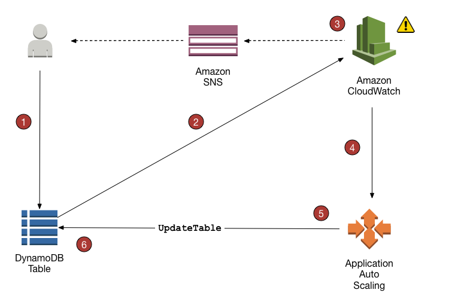

### **DAX: How it works**

https://docs.aws.amazon.com/amazondynamodb/latest/developerguide/DAX.concepts.html

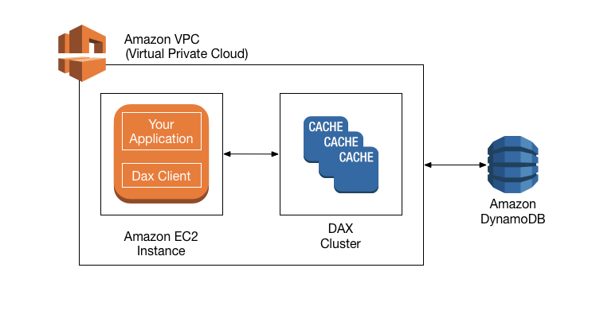

### Capacity Modes

Amazon DynamoDB offers two capacity modes to handle table throughput:

### On-Demand Capacity

With on-demand capacity mode, DynamoDB automatically scales based on workload demands without requiring prior capacity planning. This pay-per-request model is ideal for applications with unpredictable or variable traffic.

### Provisioned Capacity

In provisioned capacity mode, you specify the read and write throughput required. Best suited for applications with predictable workloads, this mode allows cost optimization for stable traffic patterns. Throughput is measured in capacity units:

- **Read Capacity Units (RCUs):** One RCU provides one strongly consistent read per second (or two eventually consistent reads) for items up to 4 KB in size.
- **Write Capacity Units (WCUs):** One WCU supports one write request per second for items up to 1 KB in size.

#### Read Consistency

- **Strongly Consistent Reads:** Returns the most recent version of data, ensuring that a read immediately reflects any preceding writes.
- **Eventually Consistent Reads:** Provides a more cost-effective read option, though recent writes may not be immediately reflected.

Example calculations:

1. 9 strongly consistent reads per second for 4 KB items require 9 RCUs.
2. 16 eventually consistent reads per second for 12 KB items require 24 RCUs.
3. Writing 10 items per second at 2 KB each requires 20 WCUs.
4. Writing 6 items per second at 4.5 KB each requires 30 WCUs.

The AWS Management Console includes a Capacity Calculator to help estimate RCUs and WCUs based on application requirements.

### Secondary Indexes

Each DynamoDB table contains uniquely identifiable items with a primary key. This primary key can be:

- **Simple:** A single partition key.
- **Composite:** A partition key and a sort key, allowing multiple items with the same partition key to be stored together.

### Global Secondary Indexes (GSIs)

GSIs offer flexible access patterns by allowing queries on non-primary key attributes. They operate with independent provisioned capacity and can be added at any time, even to existing tables.

#### Example: BlogPosts Table

**Primary Key:**

- **Partition Key:** `AuthorID` (unique identifier for each author).
- **Sort Key:** `PostID` (unique identifier for each post).

**Attributes:**

- `Title`, `Content`, `Category`, `PublishDate`

**Global Secondary Index:** Allows queries based on `Category` and `PublishDate` to retrieve posts by category, sorted by publish date.

### Local Secondary Indexes (LSIs)

LSIs enhance query flexibility within partitions by enabling additional sort key attributes while keeping the same partition key. Unlike GSIs, LSIs must be defined at table creation and share the partition key with the base table. LSIs allow up to five per table, offering access patterns by projecting additional non-key attributes for efficient querying. Important, LSI shares the same read and write capacity as the base table.

### Data Distribution

Data in DynamoDB is distributed across multiple partitions based on the **partition key**. This distribution can lead to "hot partitions" if a small subset of partition keys receives the majority of traffic, potentially causing throttling issues. Optimizing partition key design, such as using **high-cardinality keys**, helps distribute load evenly across partitions to prevent hot partition problems.

### Auto Scaling and Performance

 While DynamoDB Auto Scaling is effective for gradually adjusting capacity in response to changing access patterns, it might not always scale up quickly enough to accommodate sudden, massive spikes in traffic, such as those expected during a major sale event. Auto Scaling adjusts capacity units based on predefined utilization metrics and thresholds, which can introduce a lag between the onset of increased demand and the scaling action, potentially leading to Provisioned Throughput Exceptions during periods of rapid traffic increase.

Application Auto Scaling with pre-defined schedules is ideal for this scenario, as it allows the company to automatically scale up DynamoDB capacity during known periods of high traffic and scale down during low-traffic times.

### Caching with DynamoDB Accelerator (DAX)

As datasets grow, the primary key design remains crucial, but for read-intensive workloads, the implementation of an in-memory cache can be a game-changer in maintaining high performance.

DAX is an in-memory cache that reduces read times to microseconds for high-performance applications. It supports:

- **Item Cache:** Caches items based on primary key values for GetItem requests.
- **Query Cache:** Stores result sets for Query and Scan operations.

A DAX cluster consists of one or more nodes. Each node runs its own instance of the DAX caching software. One of the nodes serves as the primary node for the cluster. Additional nodes (if present) serve as read replicas.

In a DAX cluster, throttling can occur if the request rate exceeds the capacity of the DAX cluster itself. Adding more nodes to the cluster increases its capacity and can help mitigate this issue or addin retry logic.

### Global Tables

DynamoDB’s global tables provide multi-Region, multi-active replication, making it ideal for globally distributed applications requiring low-latency access. Data changes propagate to all specified AWS regions, allowing users to access data with minimal delay from anywhere in the world.

DynamoDB global tables are ideal for massively scaled applications with globally dispersed users. In such an environment, users expect very fast application performance. Global tables provide automatic multi-active replication to AWS Regions worldwide. They enable you to deliver low-latency data access to your users no matter where they are located.

- **Monitoring:** You can use CloudWatch to observe the metric `ReplicationLatency`. This tracks the elapsed time between when an item is written to a replica table, and when that item appears in another replica in the global table. It’s expressed in milliseconds and is emitted for every source-Region and destination-Region pair. This metric is kept at the source Region. This is the only CloudWatch metric provided by Global Tables v2

- **Time To Live (TTL):** With global tables you configure TTL in one Region, and that setting is auto replicated to the other Region(s). When an item is deleted via a TTL rule, that work is performed without consuming Write Units on the source table - but the target table(s) will incur Replicated Write Unit costs.

- **Consistency:** Global tables employ a last-writer-wins reconciliation method to handle write conflicts, which can occur when multiple applications update the same item in different regions at the same time. This approach simplifies the design for developers by automatically resolving conflicts without the need for custom conflict resolution logic.

- **Streams:** Each global table maintains its own DynamoDB Stream that captures all write operations performed on the table. This stream includes write activities from every region that forms part of the global table. If you want processed local writes but not replicated writes, you can add your own Region attribute to each item. Then you can use a Lambda event filter to invoke only the Lambda for writes in the local Region.

### Streams

Amazon DynamoDB stream is an ordered flow of information about changes to items in Amazon DynamoDB table. When you enable a stream on a table, DynamoDB captures information about every modification to data items in the table. Whenever an application creates, updates, or deletes items in the table, DynamoDB Streams writes a stream record with the primary key attributes of the items that were modified. A stream record contains information about a data modification to a **single** item in a DynamoDB table. It can be chained with an AWS Lambda function that will be triggered to react to these changes.

A stream consists of stream records. Each stream record represents a single data modification in the DynamoDB table to which the stream belongs. Each stream record is assigned a sequence number, reflecting the order in which the record was published to the stream.

Stream records are organized into groups, or shards. Each shard acts as a container for multiple stream records, and contains information required for accessing and iterating through these records. The stream records within a shard are removed automatically **after 24 hours**.

You can enable a stream on a new table when you create it using the AWS CLI or one of the AWS SDKs. You can also enable or disable a stream on an existing table, or change the settings of a stream. DynamoDB Streams operates asynchronously, so there is no performance impact on a table if you enable a stream.

AWS maintains separate endpoints for DynamoDB and DynamoDB Streams. To work with database tables and indexes, your application must access a DynamoDB endpoint. To read and process DynamoDB Streams records, your application must access a DynamoDB Streams endpoint in the same Region. To read and process a stream, your application must connect to a DynamoDB Streams endpoint and issue API requests.

### PartiQL Support

PartiQL, a SQL-compatible query language, provides a familiar SQL syntax for managing data in DynamoDB. Available through AWS Management Console, NoSQL Workbench, CLI, and DynamoDB APIs, PartiQL simplifies querying, updating, and deleting data for developers accustomed to SQL.

**Cheat Sheets**

https://tutorialsdojo.com/amazon-dynamodb/

https://digitalcloud.training/category/aws-cheat-sheets/aws-solutions-architect-professional/aws-database-sap/

**References:**

https://docs.aws.amazon.com/amazondynamodb/latest/developerguide/Introduction.html?shortFooter=true

https://aws.amazon.com/dynamodb/faqs/

**Videos**

https://www.youtube.com/watch?v=HaEPXoXVf2k

****************************************************** ****************************************************** ***********
##  **04 - Amazon RedShift**

### **Definitions**

Amazon Redshift is a fast, fully managed data warehouse that makes it simple and cost-effective to analyze all your data using standard SQL and existing Business Intelligence (BI) tools.

- RedShift is an SQL-based data warehouse used for analytics applications.
- RedShift is a relational database used for OLAP (Online Analytics Processing) use cases.
- RedShift is used to run complex analytical queries on petabytes of structured data, using sophisticated query optimization, columnar storage on high-performance local disks, and massively parallel query execution.
- RedShift is ideal for processing large amounts of data for business intelligence.
- RedShift is 10x faster than a traditional SQL database.
- Amazon Redshift is a fully managed, petabyte-scale cloud data warehouse service designed for fast and scalable storage and analysis of large datasets. It is built for performing complex queries and analytics on vast amounts of structured and semi-structured data.
- Amazon Redshift is a relational database management system (RDBMS) that provides the same functionality as typical RDBMS platforms, including online transaction processing (OLTP) features such as inserting and deleting data. However, Redshift is optimized for high-performance data analysis and reporting, especially for large datasets.
- A Redshift data warehouse consists of a cluster of computing resources called **nodes**. These nodes are grouped together into a **cluster**, and if the cluster is provisioned with two or more compute nodes, an additional **leader node** is used to coordinate the compute nodes and handle communication with external systems.

### **RedShift uses columnar data storage:**
- Data is stored sequentially in columns instead of rows.
- Column-based database is ideal for data storage and analysis.
- Requires less I/Os, which greatly increases performance.

### **RedShift provides advanced compression:**
- Data is stored sequentially in columns, which allows for much better performance and less storage space.
- RedShift automatically selects the compression scheme.

RedShift uses replication and continuous backups to increase availability and durability and can automatically recover from component and node failures.

### **RedShift always keeps three copies of your data:**
- The original.
- A replica on compute nodes (within the cluster).
- A backup copy on S3.

### **RedShift provides continuous/incremental backups:**
- Multiple copies within a cluster.
- Continuous and incremental backups to S3.
- Continuous and incremental backups between regions.
- Restoration of streaming.

### **RedShift provides fault tolerance for the following faults:**
- Disk failures.
- Faults from us.
- Network failures.
- AZ/region level disasters.

### Node and Cluster Architecture

- **Leader Node**: The leader node is responsible for managing communications between client applications and the compute nodes, parsing and developing execution plans, and distributing workloads. The leader node processes queries that don’t require compute nodes, and it allocates data to the compute nodes when necessary.

- **Compute Nodes**: These nodes carry out the heavy lifting of processing data. Each compute node has its own dedicated CPU and memory, based on its node type. Compute nodes are partitioned into **slices**, which are responsible for processing a portion of the workload.

- **Slices**: Each slice is allocated a portion of a compute node's memory and disk space, allowing the parallel processing of workloads across nodes. This architecture helps speed up data loading and query execution.

As workloads grow, you can scale your Redshift cluster by adding more nodes, upgrading node types, or both.

### Data Distribution and Storage

- **Distribution Keys**: When creating tables, you can specify a **distribution key** that helps distribute data across slices and nodes. This enables parallel processing and efficient query execution.

- **Storage Decoupling**: Traditionally, in data warehousing, storage and compute resources are tightly coupled. Redshift decouples these resources, leveraging **Amazon S3** for scalable, petabyte-scale storage. Frequently accessed (hot) data is stored in **SSD-based local storage** for fast access. When local storage fills up, Redshift automatically overflows data to Amazon S3 without manual intervention. This offers virtually unlimited storage capacity while maintaining performance.

### Data Loading and Performance

- **Parallel Processing**: Redshift utilizes parallel processing to handle large data sets more efficiently. By dividing the data into smaller chunks and processing these chunks in parallel across compute nodes, Redshift speeds up both data loading and query performance.

- **Compression**: Data compression in Redshift reduces storage costs and increases the speed of data loading and querying. You can select from several compression encodings to best suit your data.

### Federated Queries

Amazon Redshift supports **federated queries**, allowing you to query data from external databases (e.g., PostgreSQL on Amazon RDS) directly from Redshift. This capability eliminates the need for data movement or duplication, enabling cross-database queries without leaving Redshift. This is particularly useful for running analyses across datasets stored in multiple locations.

Remember, Amazon Timestream is not currently supported as a source since Timestream is a specialized time-series database requiring specific query capabilities not addressed by Redshift's federated queryingfeatures.

### Redshift Spectrum

**Redshift Spectrum** allows you to run SQL queries directly against data stored in **Amazon S3** without having to load it into Redshift tables. This enables you to query both structured and semi-structured data (e.g., JSON, Parquet) without having to move the data, saving time and resources.

Redshift Spectrum leverages **massive parallel processing (MPP)**, ensuring fast query performance even on large datasets. By offloading much of the compute-intensive processing to the Spectrum layer, it reduces the burden on your Redshift cluster.

You can create **Redshift Spectrum tables** by registering data stored in Amazon S3 and defining the table structure in an external data catalog (e.g., AWS Glue, Amazon Athena, or your own Apache Hive metastore). Once registered, you can query and join these external tables in the same way you would query native Redshift tables. However, note that **Redshift Spectrum does not support update operations** on external tables.

### Data Sharing

Redshift supports **data sharing**, allowing live data to be seamlessly shared between different Redshift clusters or Redshift Serverless endpoints. This eliminates the need for data replication, reduces storage costs, and simplifies data sharing between business units or organizations.

### Redshift Serverless

**Redshift Serverless** optimizes capacity by automatically scaling compute resources up or down based on usage. It charges only for the compute resources used and incurs no charges during idle periods. This is ideal for environments with unpredictable or sporadic workloads. For instance, if your cluster operates only for a few hours every couple of weeks, Redshift Serverless provides a cost-effective solution without the overhead of managing clusters.

When Redshift needs to be operational every X time during the week, using Redshift Serverless is a prudent choice to minimize compute costs.

### Performance Insights

Amazon Redshift provides powerful tools to monitor and optimize query performance:

- **Query Performance Insights**: This tool offers a comprehensive view of query performance, allowing data engineers to quickly identify long-running or problematic queries and optimize them for better performance.

- **Amazon Redshift Advisor**: Redshift Advisor offers automated recommendations to optimize the performance of Redshift clusters, such as distribution style changes, sort key additions, and more.

Together, **Query Performance Insights** and **Amazon Redshift Advisor** provide an effective solution for monitoring and optimizing query performance.

### System Tables and View

Amazon Redshift has many system tables and views that contain information about how the system is functioning. You can query these system tables and views the same way that you would query any other database tables.

There are several types of system tables and views:

- **SVV** views contain information about database objects with references to transient STV tables.
- **SYS** views are used to monitor query and workload usage for provisioned clusters and serverless workgroups.
- **STL** views are generated from logs that have been persisted to disk to provide a history of the system.
- **STV** tables are virtual system tables that contain snapshots of the current system data. They are based on transient in-memory data and are not persisted to disk-based logs or regular tables.
- **SVCS** views provide details about queries on both the main and concurrency scaling clusters.
- **SVL** views provide details about queries on main clusters.

Important tables to remember:

- **VACUUM SORT ONLY**: This option is used to optimize the physical layout of data within tables. It is particularly useful for improving query performance in cases where frequent updates and insertions have caused data to become unsorted. This command does not delete any data, ensuring that it aligns with requirements to maintain datasets while improving efficiency.

- **STL_ALERT_EVENT_LOG**: The `STL_ALERT_EVENT_LOG` table is tailored to identify queries where the query optimizer has detected potential performance issues, such as inefficient joins or excessive data scanning. This helps users address and resolve performance bottlenecks.

- **STL_WLM_QUERY**: This table primarily records information about query execution such as CPU time, number of rows read, and disk space used for spills. While useful for performance tuning, it does not directly provide alerts or event information that would indicate problematic database operations.

- **STL_USAGE_CONTROL**: This table only logs changes in WLM configuration and when queries are paused or canceled due to WLM rules. It is helpful for understanding WLM configuration impacts.

- **STL_QUERY_METRICS**: This view provides detailed information about query execution, including the query text, start time, end time, and execution duration. This system view is designed specifically for monitoring and analyzing query performance, making it an invaluable resource for data engineers looking to optimize query execution times and evaluate the effectiveness of various optimization strategies.

- **STV_BLOCKLIST**: is a system table that provides information about blocks that are currently marked for deletion in the cluster. It is useful for understanding vacuum operations but not for analyzing query performance.

- **STV_TBL_PERM**: shows snapshot data about the current state of permanent tables, including information on disk space usage. While it can help assess storage utilization, it does not offer insights into query execution times.

### Importing/Exporting Data

Amazon Redshift offers powerful tools like the COPY and UNLOAD commands for efficiently managing data transfers between Redshift clusters and external storage solutions, such as Amazon S3.

### COPY

The **COPY** command facilitates the import of data into Amazon Redshift from sources including Amazon S3, Amazon EMR, DynamoDB, or remote hosts via SSH. It's optimized for loading extensive volumes of data rapidly and efficiently, making it the preferred choice for bulk data loading due to its speed and parallel processing capabilities.
The COPY command supports various data formats, including JSON, CSV, Avro, Parquet, and ORC. To execute a COPY operation, you merely need three key parameters: a table name, a data source, and the authorization to access the data.

    COPY your_table
    FROM 's3://your-bucket/data-files/'
    IAM_ROLE 'arn:aws:iam::123456789012:role/MyRedshiftRole'
    FORMAT AS JSON 'auto';

Authorization is necessary to access data in other AWS resources, such as Amazon S3, Amazon EMR, Amazon DynamoDB, and Amazon EC2. This can be accomplished through referring to an IAM role attached to your cluster or providing an access key ID and secret access key for an IAM user.

### UNLOAD

The **UNLOAD** command exports query results to one or more text, JSON, or Apache Parquet files on Amazon S3, with options for Amazon S3 server-side encryption (SSE-S3), AWS Key Management Service key (SSE-KMS) encryption, or client-side encryption using a customer managed key. This is useful for archiving data, analyzing data externally, or transferring data to other databases.

Unloading Redshift queries to your Amazon S3 data lake in Apache Parquet format is efficient for analytics, as Parquet is faster to unload and conserves more storage in Amazon S3 compared to text formats. This allows you to retain data transformations and enrichments done in Redshift into your S3 data lake in an open format and analyze through Redshift Spectrum or other AWS services like Amazon Athena, Amazon EMR, and Amazon SageMaker.

To execute the UNLOAD command, SELECT privileges on the database data and permission to write to the Amazon S3 location are required.

    UNLOAD ('SELECT * FROM your_table')
    TO 's3://your-bucket/unload/'
    IAM_ROLE 'arn:aws:iam::123456789012:role/MyRedshiftRole'
    PARALLEL OFF
    FORMAT AS JSON;

### Amazon Redshift Integration

### **ODBC and JDBC Connections**

Amazon Redshift supports **ODBC** and **JDBC** connections, allowing you to connect to your Redshift cluster from many third-party SQL client tools and applications. You can set up these connections from your client computer or Amazon EC2 instance.

While **ODBC** connections are widely supported, you may prefer to use **JDBC** due to its easier configuration and better support for Java-based applications. If your client tool supports JDBC, it is generally the preferred option for connecting to Redshift.

### **Using the Data API**

The **Amazon Redshift Data API** is ideal for running SQL queries on Redshift clusters without needing to manage database connections. This is especially beneficial for diverse applications, such as microservices architectures, where database connection management can be a challenge.

The Data API executes queries asynchronously, allowing for a more scalable and efficient way to retrieve results, especially for use cases that require integration with external applications and services.

### Internal Management

### **Implementing Sorted Keys**

Sorted keys in Amazon Redshift can significantly improve query performance by reducing the amount of data scanned during query execution.

When setting up sorted keys, focus on columns that are frequently used in filtering, joining, or as part of the `WHERE` clause (e.g., `date`, `product_category`). This helps Redshift organize data efficiently and can greatly speed up query performance.

### **Handling Locks and DDL Statements**

**Locking** is a protection mechanism that controls how many sessions can access a table at the same time. Locking also determines which operations can be performed in those sessions. Most relational databases use row-level locks. However, Amazon Redshift uses table-level locks. You might experience locking conflicts if you perform frequent DDL statements on user tables or DML queries.

Amazon Redshift has three lock modes:

- **AccessExclusiveLock**: Acquired primarily during DDL operations, such as ALTER TABLE, DROP, or TRUNCATE. AccessExclusiveLock blocks all other locking attempts.
- **AccessShareLock**: Acquired during UNLOAD, SELECT, UPDATE, or DELETE operations. AccessShareLock blocks only AccessExclusiveLock attempts. AccessShareLock doesn’t block other sessions that are trying to read or write on the table.
- **ShareRowExclusiveLock**: Acquired during COPY, INSERT, UPDATE, or DELETE operations. ShareRowExclusiveLock blocks AccessExclusiveLock and other ShareRowExclusiveLock attempts but doesn’t block AccessShareLock attempts.

When DDL statements like **TRUNCATE** are executed, they require an `AccessExclusiveLock` on the table. This lock can conflict with other queries that hold `AccessShareLock`, potentially causing blocking or delays.

If a **TRUNCATE** operation is hanging due to locked tables, you can identify and terminate the session (PID) that is holding the lock using the `pg_terminate_backend` function. If this does not resolve the issue, consider rebooting the cluster.

#### **Lock command**

The Lock command restricts access to the database table. This command enables the acquisition of a table-level lock in `ACCESS EXCLUSIVE` mode. It waits, if necessary, for any conflicting locks to be released. Explicitly locking a table in this way causes other transactions or sessions to wait when attempting to read or write to the table.

### **Procedures**

In Amazon Redshift, stored procedures serve as a mechanism to encapsulate logic for various operations, such as data transformation and validation, as well as business-specific logic. This encapsulation allows for a more streamlined and efficient process, particularly when dealing with multiple SQL statements. By bundling these statements into a single stored procedure, the number of round trips between the custom-built application and the database can be significantly reduced, thereby simplifying the operation and enhancing network traffic efficiency.

Stored procedures are stored directly in the database, making them accessible to any user with the appropriate privileges. They offer a level of flexibility not found in user-defined functions (UDFs), as they can incorporate not only SELECT queries but also data definition language (DDL) and data manipulation language (DML). Unlike UDFs, stored procedures do not necessarily need to return a value.

### **Query Editor**

The query editor v2 in Amazon Redshift can execute SQL commands directly within the Redshift console, including commands to refresh materialized views. These commands can be scheduled to execute automatically and can be set up directly in the Redshift environment. This provides a straightforward method to automate materialized view updates without additional infrastructure or services, thereby minimizing operational overhead.

### **Query Performance**

Amazon Redshift offers several features to enhance query performance, such as result caching, concurrency scaling, and **materialized views**.

Materialized views in Redshift provide a powerful way to optimize query performance for repeated and predictable query workloads. They precompute and store the results of a query, which improves the speed of data retrieval for complex queries that are run frequently. This makes them particularly useful for scenarios where data from historical records stored in Amazon S3 is regularly queried alongside newer data. Redshift can use materialized views to serve query results from precomputed data, reducing the compute resources required and accelerating query performance, thus enabling near real-time analytics on large datasets.

Amazon Redshift Concurrency Scaling allows the system to handle a varying number of incoming queries. As concurrency increases, Amazon Redshift automatically adds query processing power in seconds to process queries without any delays. Once the workload demand subsides, this extra processing power is automatically removed, so you pay only for the time when Concurrency Scaling clusters are in use.

### **VACUUM Command**

In Amazon Redshift, the **VACUUM** command is crucial for optimizing query performance and reclaiming disk space. It consolidates blocks of data marked for deletion through updates and deletes.

Over time, inserting, updating, or deleting rows leads to logically marked rows for deletion, consuming space until VACUUM is executed.

The primary VACUUM commands are:

- **VACUUM FULL**: Reclaims disk space, rebuilds indexes, and re-sorts all rows.
- **VACUUM DELETE ONLY**: Reclaims disk space from deleted rows without re-sorting, faster than FULL.
- **VACUUM REINDEX**: Analyzes interleaved sort key column distributions and performs a full VACUUM with re-sorting.
- **VACUUM SORT ONLY**: Sorts the table without reclaiming disk space, useful when rows are unsorted but space is adequate.

> Note: Redshift automatically runs VACUUM DELETE ONLY to reclaim space from deleted rows.

### Redshift Workload Management

Amazon Redshift workload management (WLM) enables flexible management priorities within workloads so that short, fast-running queries don't get stuck in queues behind long-running queries. Amazon Redshift creates query queues at runtime according to service classes, which define the configuration parameters for various types of queues, including internal system queues and user-accessible queues.

Redshift offers automatic workload management, called automatic WLM, which is tuned to handle varying workloads and is the recommended default. With automatic WLM, Redshift determines resource utilization as queries arrive and dynamically determines whether to run them on the main cluster, on a currency-scaling cluster, or to send each to a queue. When queries are queued, automatic WLM prioritizes shorter-duration queries. Automatic WLM maximizes total throughput and enables you to maintain efficient data-warehouse resources.

An important metric to measure the success of workload management configuration is system throughput, which in other words is how many queries are completed successfully. System throughput is measured in queries per second.

Each queue can be configured to run a certain number of queries concurrently. The maximum number depends on your Redshift cluster's size and configuration. Queries can be prioritized within queues based on criteria such as user groups or query groups, ensuring critical reports and dashboards have resources prioritized over less critical jobs.

### **Amazon Redshift Logging and Auditing**

 Amazon Redshift provides **database auditing** functionality, logging connections, user activities, and query execution details. These logs are stored in Amazon S3 for easy access and security.

- **Connection Log**: Records authentication attempts, connections, and disconnections.
- **User Log**: Tracks changes to database user definitions.
- **User Activity Log**: Records the queries users run, providing insight into query patterns and system usage.

These logs are helpful for security audits, troubleshooting, and monitoring database operations. You can query these logs directly from Amazon S3.

While the connection and user log contain the same information as the system tables, the log files provide an easier way to retrieve and review the information. You need database permissions to query the system tables, while the log files rely on Amazon S3 permissions. Viewing the information in log files instead of querying system tables also helps reduce the impact of interacting with the database.

### CloudTrail

AWS CloudTrail and Amazon Redshift integration offers detailed records of Redshift API calls, including API caller identity, time, source IP address, request parameters, and response elements. This integration provides a comprehensive audit trail that includes the actions taken within the Redshift cluster and API interactions that affect the cluster’s configuration or data query. The built-in audit logging and CloudTrail integration create a robust monitoring solution that secures and audits a Redshift environment, ensuring compliance obligations are met, and data is safeguarded. This dual approach simplifies audit log management and enhances the visibility of operations within and around the Redshift clusters, making it easier to take a proactive stance on security and compliance.

### Access

### **Managing User Access with Database Groups**

- Amazon Redshift allows you to create **database groups** to manage user access efficiently. By assigning users to groups based on their roles and responsibilities, you can streamline permission management.
- Permissions are granted at the group level, allowing for easier access control across multiple users. This approach helps with scaling and managing large teams by reducing the need for individual user permission modifications.

### **Granting and Revoking User Permissions**

- Use the **GRANT** and **REVOKE** commands to manage user permissions in Amazon Redshift. These commands allow you to specify which actions a user or role can perform on specific tables, views, and schemas, ensuring proper access control.

### **Row-Level Security**

- Implement **row-level security** to control access to specific rows within a table based on user roles. This ensures that users (such as analysts) only have access to the data that is relevant to their tasks.
- With row-level security, users can be granted access to an entire table but restricted to specific rows based on predefined conditions, ensuring data privacy and compliance.
- Additionally, integrating Amazon Cognito provides a seamless way to authenticate users using their Amazon.com accounts, ensuring a secure and scalable solution for managing user identities and access.

### **Role-Based Access Control (RBAC)**

- Amazon Redshift supports **Role-Based Access Control (RBAC)**, which allows you to define hierarchical roles and assign permissions to these roles. This simplifies permission management, as a role can inherit the privileges of other roles.
- With RBAC, Redshift ensures that users only have access to the data they are authorized to view and interact with, helping maintain data security and integrity.

### Reliability

- Amazon Redshift is launching data warehouse availability improvements by introducing a **Multi-AZ** deployment that supports running a Redshift data warehouse in multiple AWS Availability Zones (AZ) simultaneously to continue operating in unforeseen failure scenarios.

- The **cluster relocation** feature moves a cluster to another AZ in one step without requiring application changes. You can invoke the relocation function in cases where resource constraints in a given AZ are disrupting cluster operations such as the ability to resume or resize a cluster. This feature is available for use on clusters leveraging the RA3 instance family and is offered at no additional cost.

- Amazon Redshift offers **automated snapshots** and **recovery points** to customers at no charge. These snapshots and recovery points can be used to recover an entire cluster or table from a previous point in time to recover from failures. You can configure Amazon Redshift to automatically copy snapshots (automated or manual) for a cluster to another AWS Region. When a snapshot is created in the cluster's primary AWS Region, it's copied to a secondary AWS Region. If you store a copy of your snapshots in another AWS Region, you can restore your cluster from recent data if anything affects the primary AWS Region.

### Scaling

Amazon Redshift offers two main methods for scaling, allowing accommodation for both storage and computing needs: **Elastic Resize** and **Concurrency Scaling**. Additionally, Redshift supports managed storage to automatically scale storage capacity.

- **Elastic Resize** is used to change the number of nodes in a Redshift cluster to adjust the compute resources available, or by switching to nodes of different types or sizes within the cluster. This method is ideal for scenarios where you need more (or fewer) compute resources due to changes in demand, such as end-of-month reporting or seasonal data analysis increases. Elastic Resize usually completes within a few minutes, minimizing downtime. It's particularly useful for workload spikes that can be anticipated and planned for.

- **Concurrency Scaling** enables Redshift to support thousands of concurrent users and concurrent queries, with consistently fast query performance. When you turn on concurrency scaling, Amazon Redshift automatically adds additional cluster capacity to process an increase in both read and write queries. Users see the most current data, whether the queries run on the main cluster or a concurrency-scaling cluster. Elastic Resize changes the cluster's actual size; Concurrency Scaling temporarily augments processing capability for queries without altering the cluster's physical configuration.

### **RA3 Nodes and Managed Storage**

**RA3 nodes** use **Managed Storage**, which automatically offloads infrequently accessed (cold) data to Amazon S3 while keeping frequently accessed (hot) data on SSDs. This helps in cost-effective scaling of storage, as compute and storage can be scaled independently.

This feature helps optimize both storage costs and query performance by using high-performance SSDs for hot data and utilizing Amazon S3's scalability for cold data.

**DC2 Nodes:** Processing and storage are coupled. To increase disk space, you are required to add more nodes, which increases computing costs even if you don't need more CPUs.

### 2. Storage Technology and Performance

**RA3 Nodes:** Data is permanently stored in Amazon S3 in an optimized format, while the nodes' local SSD disks act as a high-performance cache for "hot" (frequently accessed) data.

**DC2 Nodes:** Use fixed local NVMe-SSD storage on each node, offering extreme performance for datasets that do not exceed local capacity.

### 3. Advanced Features and Use Cases
- Proof Trigger for RA3: Recommended for large data warehouses (generally above 1 TB) and use cases requiring Data Sharing (live data sharing between clusters) or Multi-AZ deployments.
- DC2 Exam Trigger: Recommended for small data warehouses (less than 1 TB compressed) that have computationally intensive workloads and stable data volumes.

- **Comparative Summary for the Exam**

|Feature            |Redshift RA3           | Redshift DC2 |
|-------------------|-----------------------|--------------|
|Architecture       |S3-based (RMS)         |Local SSD     |
|Scalability        |Independent (Compute vs. Storage) |Coupled (Increases both simultaneously)|
|Data Sharing       |Natively supported     |Not supported|
|Multi-AZ           |Supported (for high availability)     |Not supported|
|Ideal for          |Large-scale and unpredictable         |workloads Small and CPU-intensive workloads|

### Distribution

Distribution styles determine how data is allocated across the nodes in a cluster. Choosing an optimal distribution style is crucial for query performance, as it affects both the storage and the speed of your query executions.

- **Auto**: When you choose AUTO, Redshift automatically manages the data distribution based on the size of the tables and the query workload. For large tables, Redshift might use the **KEY** distribution style, while for smaller tables, it might choose the **ALL** distribution style.
- **Even**: Redshift distributes the rows of the table evenly across all slices in the cluster. It doesn't use any specific column as the distribution key. Suitable for tables without a natural join key or those not frequently joined. It prevents skew but can lead to more cross-node traffic during queries that involve table joins.
- **Key**: You specify a column as the distribution key. Redshift distributes the rows of the table across the nodes based on the values in the distribution key column. Rows with the same key value are stored on the same slice. Best for tables frequently joined on the distribution key column. It minimizes data movement across nodes during joins, leading to faster query execution. Choose a key that distributes data evenly to avoid data skew.
- **All**: The ALL distribution style copies the entire table to every node. This results in faster query performance for small tables due to local joins (no network traffic) but uses more storage.

### Redshift Lambda UDF

Amazon Redshift can use custom functions defined in AWS Lambda as part of SQL queries. You can write scalar Lambda UDFs in any programming languages supported by Lambda, such as Java, Go, PowerShell, Node.js, C#, Python, and Ruby. Or you can use a custom runtime. You do so by creating an EXTERNAL FUNCTION linking to the lambda.

The CREATE EXTERNAL FUNCTION command requires authorization to invoke Lambda functions in AWS Lambda. To start authorization, specify an AWS Identity and Access Management (IAM) role when you run the CREATE EXTERNAL FUNCTION command with enough permissions.

### Extras for the exam

- A star schema, ideal for data warehousing with Redshift, consists of a central fact table linked to dimension tables (e.g., customers, products).
- Redshift Streaming Ingestion allows near real-time data ingestion from Kinesis data streams, handling high volumes with low latency.
- The **MERGE** operation efficiently ingests data by performing combined INSERT and UPDATE operations based on specified conditions, minimizing separate operations and performance impacts.

***************************************************************************************************************
##  **05 - Amazon ElastiCache**

ElastiCache is a web service that makes it easy to deploy and run server nodes that support the Memcached or Redis protocol in the cloud.

The in-memory cache provided by ElastiCache can be used to significantly improve latency and throughput for many read-intensive application workloads or compute-intensive workloads.

Best for scenarios where the database load is based on OLAP (Online Analytics Processing) transactions.

### **The following table describes some typical ElastiCache use cases:**
### **Web session store**
- In cases with load balanced web servers, store the web session information in Redis so that if one server is lost, the session information is not lost and another web server can recover it

### **Database caching**
- Use Memcached in front of AWS RDS to cache popular queries to offload RDS work and return results faster to users

### **Leaderboards**
- Use Redis to provide a live leaderboard to millions of users of your mobile app

### **Streaming data dashboards**
- Provide a landing point to transmit sensor data to the shop floor, providing real-time live dashboard views

ElastiCache EC2 nodes cannot be accessed from the internet or EC2 instances in other VPCs.

They can also be On-Demand or Reserved Instances (but not Spot Instances).

ElastiCache can be used to store session state.

### **There are two types of ElastiCache engine:**
- **Memcached** – simpler model, can run large nodes with multiple cores/threads, can scale in and out, can cache objects like databases.
- **Redis** – complex model, supports encryption, master/slave replication, cross AZ (HA), automatic failover and backup/restore.

**References**

https://aws.amazon.com/elasticache/

**cheat sheets**

https://digitalcloud.training/amazon-elasticache/

**Videos**

https://www.youtube.com/watch?v=v0zozYN-mdI

https://www.youtube.com/watch?v=lU4cHVL9IXM

****************************************************** ****************************************************** ***********
##  **06 - Amazon EMR**

**Amazon EMR** is a web service that enables companies, researchers, data analysts, and developers to process large amounts of data easily and cost-effectively.

EMR uses a hosted Hadoop framework running on Amazon EC2 and Amazon S3.

Managed Hadoop framework for processing large amounts of data.

It also supports **Apache Spark, HBase, Presto and Flink**.

Most commonly used for log analysis, financial analysis, or extract, translate, and load (ETL) activities.

****************************************************** ****************************************************** ***********
##  **07 - Amazon (RDS) Pricing**

[Amazon (RDS) Pricing](https://aws.amazon.com/rds/pricing/?nc1=h_ls)

Amazon Relational Database Service (Amazon RDS) is a managed, highly available, and secure database service that makes it simple to set up, operate, and scale databases in the cloud. Amazon RDS is free to try and you pay only for what you use with no minimum fees. You can pay for Amazon RDS using On-Demand or Reserved Instances. Estimate your monthly bill using the AWS Pricing Calculator.

Amazon RDS provides a selection of instance types optimized to fit different relational database use cases. Select one of the Amazon RDS database engines below to view pricing. See Previous Generation Instances for previous instance pricing not listed here.

For Amazon RDS feature-level pricing, see RDS Performance Insights and RDS Proxy pricing pages.

As part of the AWS Free Tier, Amazon RDS helps new AWS customers get started for free with a managed database service in the cloud. Each calendar month, the 

**Amazon RDS Free Tier allows you to use:**
- 750 hours of Amazon RDS Single-AZ db.t2.micro, db.t3.micro, and db.t4g.micro Instances usage running MySQL, MariaDB, PostgreSQL databases each month. If running more than one instance, usage is aggregated across instance classes.
- 750 hours of Amazon RDS Single-AZ db.t2.micro Instance usage running Oracle BYOL or SQL Server (running SQL Server Express Edition). Oracle BYOL db.t3.micro  Single-AZ Instance usage is also included as part of the Amazon RDS free tier. If running both a db.t2.micro Single-AZ Instance and a db.t3.micro Single-AZ Instance on Oracle BYOL, usage is aggregated across Instance classes.
- 20 GB of General Purpose (SSD) DB storage.
- 20 GB of storage for your automated database backups and any user-initiated DB Snapshots.

With Amazon RDS you are charged for the type and size of database, the uptime, any additional storage of backup (above the DB size), requests, deployment type (e.g. you pay for multi AZ), and data transfer outbound.

***************************************************************************************************************
##  **08 - Amazon (RDS) Multiple Availability Zones (A-Z)**
[Amazon (RDS) Multiple Availability Zones](https://aws.amazon.com/rds/features/multi-az/)

Multi AZ provides a mechanism to failover the RDS database to another synchronously replicated copy in the event of the failure of an AZ. The endpoint address for the RDS instances gets remapped to the standby instance as can be seen in the image below:

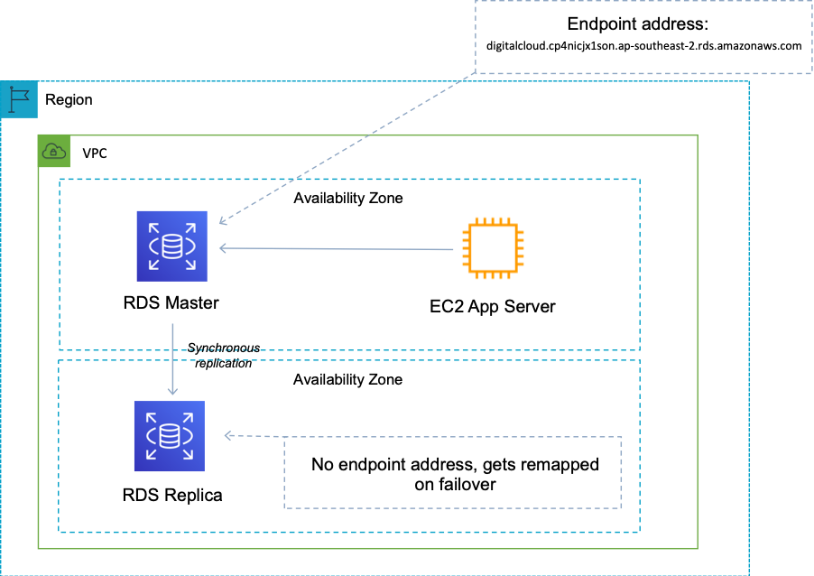
##  **9 - Enable automatic patching for the instances using the Amazon RDS console**

[Enable automatic patching](https://docs.aws.amazon.com/AmazonRDS/latest/UserGuide/USER_UpgradeDBInstance.Maintenance.html)

Periodically, Amazon RDS performs maintenance on Amazon RDS resources. Maintenance most often involves updates to the DB instance's underlying hardware, underlying operating system (OS), or database engine version. Updates to the operating system most often occur for security issues and should be done as soon as possible.

Required patching is automatically scheduled only for patches that are related to security and instance reliability. Such patching occurs infrequently (typically once every few months) and seldom requires more than a fraction of your maintenance window.

-----------------------------------------------------------------------------------------------------------------------
##  **09 - Enable automatic patching for the instances using the Amazon RDS console**

**Cheat Sheets**

**References:**

**Videos**

-----------------------------------------------------------------------------------------------------------------------
##  **10 - Backups and Restoring a DB instance to a specified time**
[Restoring a DB instance](https://docs.aws.amazon.com/AmazonRDS/latest/UserGuide/USER_PIT.html)

You can restore an Amazon RDS database instance to a specific point in time with a granularity of 5 minutes. Amazon RDS uses transaction logs which it uploads to Amazon S3 to do this.

**To restore a DB instance to a specified time in aws console:**
 - Restore to point in time.
 - The Restore to point in time window appears.

 **Point-in-time recovery (PITR)
 Point-in-time recovery (PITR) provides continuous backups of your DynamoDB table data. When enabled, DynamoDB maintains incremental backups of your table for the last 35 days until you explicitly turn it off. It is a customer responsibility to enable PITR on and AWS is responsible for actually performing the backups.

"The customer is responsible for configuring and AWS is responsible for performing backups".

**Cheat Sheets**

https://digitalcloud.training/aws-database-services/

**References:**

https://aws.amazon.com/blogs/aws/new-amazon-dynamodb-continuous-backups-and-point-in-time-recovery-pitr/

**Videos**

https://www.youtube.com/watch?v=YVe9amljgaw&t=45s
https://www.youtube.com/watch?v=n0KK094sPnQ

-----------------------------------------------------------------------------------------------------------------------
##  **11 - Amazon Neptune**

**Definitions**

Amazon Neptune is a fully managed, fast, and reliable graph database service provided by AWS, tailored for applications that involve highly connected datasets. Built around a high-performance, purpose-driven graph database engine, Neptune is optimized to handle billions of relationships and enables querying with millisecond latency. This performance makes it ideal for **complex graph-based use cases**, including recommendation engines, fraud detection, knowledge graphs, drug discovery, and network security.

With Neptune, AWS aims to simplify the development and management of **graph databases**, allowing developers to create and manage graph applications without dealing with the complexities of traditional database management.

Optimized for storing billions of relationships between pieces of information.
Provide milliseconds latency when querying the graph.
Neptune supports graph query languages like Apache TinkerPop Gremlin and W3C’s SPARQL.

### **Pricing**
- You are billed based on the DB instance hours, I/O requests, storage, and Data transfer.
- Storage rate and I/O rate is billed in per GB-month increments and per million request increments respectively.

### **Monitoring**
- Visualize your graph using the Neptune Workbench.
- You can receive event notifications on your Amazon Neptune DB clusters, DB instances, DB cluster snapshots, parameter groups, or security groups through Amazon SNS.

### **Limitations**
- It does not support cross-region replicas.
- Encryption of an existing Neptune instance is not supported.
- Sharing of automatic DB snapshots to other accounts is not allowed. A workaround for this is to manually copy the snapshot from the automatic snapshot, then, copy the manual snapshot to another account.

### Key Features of Amazon Neptune

### 1. Performance and Scalability

- **Purpose-Built Graph Engine**: Neptune’s core graph engine is designed specifically for graph storage and querying, optimized to handle massive volumes of interconnected data while maintaining low-latency performance.
- **Support for Large Datasets**: Neptune’s architecture efficiently manages large datasets, making it capable of storing billions of relationships and performing complex queries with sub-second responses.
- **High Throughput for Interactive Queries**: This high-throughput support enables interactive and responsive graph queries that can quickly return results to users, essential for applications like social media, recommendation engines, and more.

### 2. Highly Available and Reliable Architecture

- **Read Replicas**: Neptune supports multiple read replicas, allowing applications to distribute read operations and achieve load balancing. This replication also helps in scaling read-heavy applications.
- **Multi-AZ Replication**: Neptune automatically replicates data across multiple Availability Zones (AZs), ensuring that applications have minimal downtime in the event of a failure in one AZ.
- **Continuous Backup to Amazon S3**: Continuous backups to Amazon S3 provide an additional layer of data protection and enable quick recovery from any data loss.
- **Point-in-Time Recovery**: Neptune supports point-in-time recovery (PITR), allowing users to roll back to a specific time to recover data, helping mitigate unintended changes or data loss.

### 3. Security and Data Protection

- **Encryption at Rest and In Transit**: Neptune ensures secure data management with encryption at rest using AWS Key Management Service (KMS) and in transit using HTTPS/TLS.
- **Network Isolation**: With support for Amazon Virtual Private Cloud (VPC) integration, Neptune allows users to securely isolate their network environment, enhancing data security.
- **IAM Authentication**: Through AWS Identity and Access Management (IAM), Neptune allows fine-grained access control, enabling organizations to manage who can access specific resources and data.

### Use Cases and Application Scenarios for Amazon Neptune

### 1. Recommendation Engines

- Neptune’s graph database is particularly well-suited for building recommendation systems that analyze and suggest relevant items, users, or services based on interconnected data. By using graph algorithms, developers can implement personalized recommendations with minimal delay, enhancing user engagement.

### 2. Fraud Detection

- Fraud detection applications often need to uncover hidden relationships within complex data structures to detect anomalous patterns. Neptune’s low-latency querying and ability to handle complex relationships enable real-time fraud analysis, making it useful for banking, insurance, and e-commerce applications.

### 3. Knowledge Graphs and Enterprise Knowledge Management

- With its graph capabilities, Neptune can structure vast amounts of data into knowledge graphs that represent complex relationships between entities. Knowledge graphs are useful in sectors like legal research, enterprise knowledge management, and semantic search, where discovering relationships between items is critical.

### 4. Social Networking Applications

- Neptune enables interactive and high-throughput queries ideal for applications with social features, such as those managing large sets of user profiles and interactions. For instance, it allows applications to power social feeds by prioritizing recent updates from a user’s close connections or friends located nearby. This application of Neptune’s graph capabilities can enhance user experience by delivering timely, relevant content.

**Cheat Sheets**

https://tutorialsdojo.com/amazon-neptune/

**References:**

https://aws.amazon.com/neptune/

**Videos**

https://www.youtube.com/results?search_query=aws+neptume

**Hands On**

https://www.youtube.com/results?search_query=Amazon+Neptune++hands+on

-----------------------------------------------------------------------------------------------------------------------
##  **12 - Amazon Aurora**

**Definitions**

Aurora is a fully managed relational database that combines the speed and availability of high-end commercial databases with the simplicity and cost-effectiveness of open-source databases. It is compatible with MySQL and PostgreSQL. Storage and compute are separated.

Aurora features a distributed, fault-tolerant, and self-healing storage system that is decoupled from compute resources and auto-scales up to 128 TiB per database instance. It delivers high performance and availability with up to 15 low-latency read replicas, point-in-time recovery, continuous backup to Amazon Simple Storage Service (Amazon S3), and automatic replication across three Availability Zones (AZs).

- With some workloads, Aurora can deliver up to five times the throughput of MySQL and up to three times the throughput of PostgreSQL.
- Aurora includes a high-performance storage subsystem. The underlying storage grows automatically as needed, up to 128 terabytes. The minimum storage is 10GB.
- Aurora will keep your database up-to-date with the latest patches.
- Aurora supports quick, efficient cloning operations.
- You can share your Amazon Aurora DB clusters with other AWS accounts for quick and efficient database cloning.
- Aurora is fault-tolerant and self-healing.
- Aurora is a proprietary technology from AWS (not open sourced)
- Postgres and MySQL are both supported as Aurora DB (that means your drivers will work as if Aurora was a Postgres or MySQL database)
- Aurora is “AWS cloud optimized” and claims 5x performance improvement over MySQL on RDS, over 3x the performance of Postgres on RDS
- Aurora storage automatically grows in increments of 10GB, up to 128 TB.
- Aurora can have up to 15 replicas and the replication process is faster than MySQL (sub 10 ms replica lag)
- Failover in Aurora is instantaneous. It’s HA (High Availability) native.
- Aurora costs more than RDS (20% more) – but is more efficient

### **Aurora High Availability and Read Scaling**

-  6 copies of your data across 3 AZ:
-  4 copies out of 6 needed for writes
-  3 copies out of 6 need for reads
-  Self healing with peer-to-peer replication
-  Storage is striped across 100s of volumes
-  One Aurora Instance takes writes (master)
-  Automated failover for master in less than 30 seconds
-  Master + up to 15 Aurora Read Replicas serve reads
-  Support for Cross Region Replication

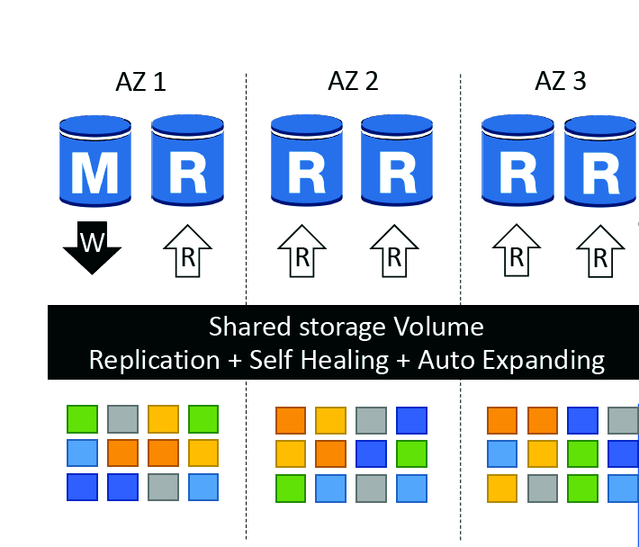

### **Features of Aurora**

-  Automatic fail-over
-  Backup and Recovery
-  Isolation and security
-  Industry compliance
-  Push-button scaling
-  Automated Patching with Zero Downtime
-  Advanced Monitoring
-  Routine Maintenance
-  Backtrack: restore data at any point of time without using backups

### **Aurora DB Cluster**

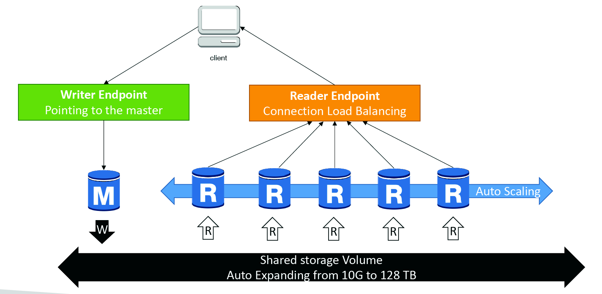

---------------------------------------------------------------------------

### **Aurora – Custom Endpoints**

-  Define a subset of Aurora Instances as a Custom Endpoint
-  Example: Run analytical queries on specific replicas
-  The Reader Endpoint is generally not used after defining Custom Endpoints

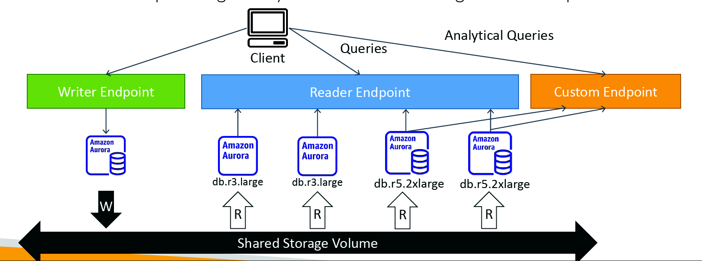

### **Aurora Replicas - Auto Scaling**

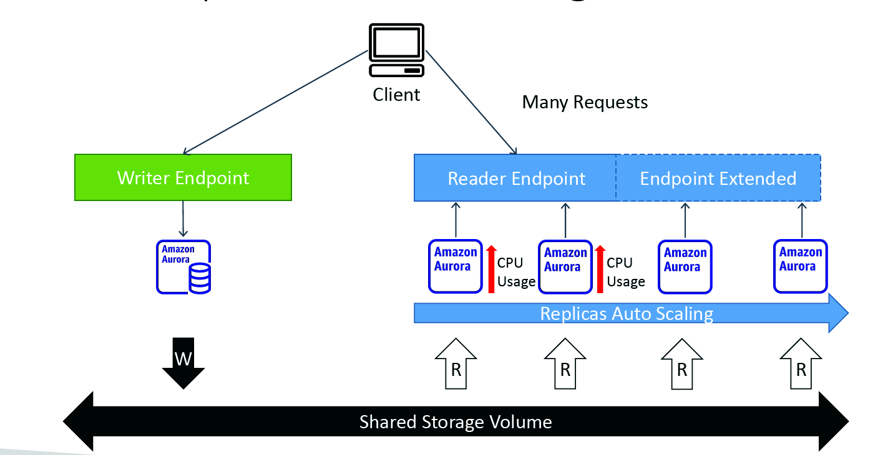

### **Aurora Machine Learning**

-  Enables you to add ML-based predictions to your applications via SQL
-  Simple, optimized, and secure integration between Aurora and AWS ML services
-  Supported services
-  Amazon SageMaker (use with any ML model)
-  Amazon Comprehend (for sentiment analysis)
-  You don’t need to have ML experience
-  Use cases: fraud detection, ads targeting, sentiment analysis, product recommendations

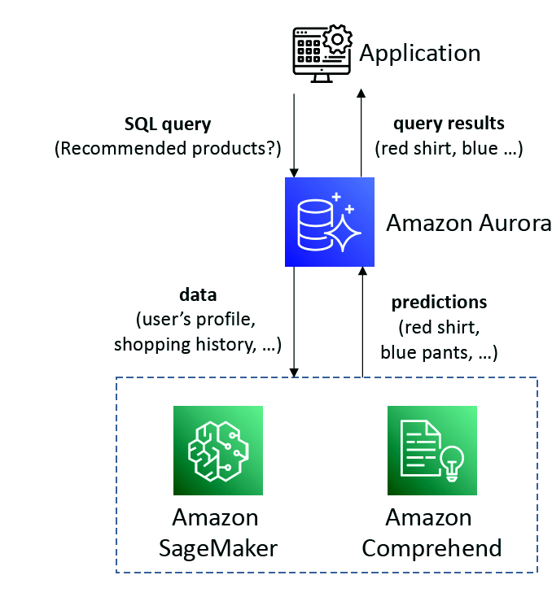

### **Aurora Backups**
-  Automated backups
-  1 to 35 days (cannot be disabled)
-  point-in-time recovery in that timeframe
-  Manual DB Snapshots
-  Manually triggered by the user
-  Retention of backup for as long as you want

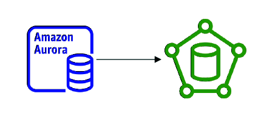

### **RDS & Aurora Restore options**

-  Restoring a RDS / Aurora backup or a snapshot creates a new database
-  Restoring MySQL RDS database from S3
-  Create a backup of your on-premises database
-  Store it on Amazon S3 (object storage)
-  Restore the backup file onto a new RDS instance running MySQL
-  Restoring MySQL Aurora cluster from S3
-  Create a backup of your on-premises database using Percona XtraBackup
-  Store the backup file on Amazon S3
-  Restore the backup file onto a new Aurora cluster running MySQL

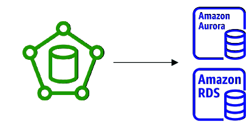

### **Aurora Database Cloning**

-  Create a new Aurora DB Cluster from an existing one
-  Faster than snapshot & restore
-  Uses copy-on-write protocol
-  Initially, the new DB cluster uses the same data volume as the original DB cluster (fast and efficient – no copying is needed)
-  When updates are made to the new DB cluster data, then additional storage is allocated and data is copied to be separated
-  Very fast & cost-effective
-  Useful to create a “staging” database from a “production” database without impacting the production database

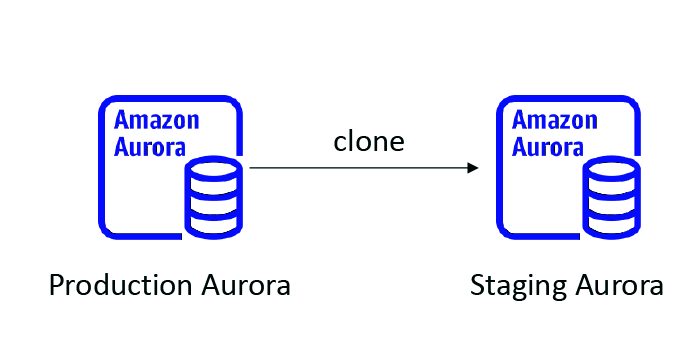

### **Monitoring**
- Subscribe to Amazon RDS events to be notified when changes occur with a DB instance, DB cluster, DB cluster snapshot, DB parameter group, or DB security group.
- Database log files
- RDS Enhanced Monitoring — Look at metrics in real time for the operating system.
- RDS Performance Insights monitors your Amazon RDS DB instance load so that you can analyze and troubleshoot your database performance.
- Use CloudWatch Metrics, Alarms and Logs

### **Pricing**
- You are charged for DB instance hours, I/O requests, Backup storage and Data transfer.
- You can purchase On-Demand Instances and pay by the hour for the DB instance hours that you use, or Reserved Instances to reserve a DB instance for a one-year or three-year term and receive a significant discount compared to the on-demand DB instance pricing.
- Aurora PostgreSQL support for Kerberos and Microsoft Active Directory provides the benefits of single sign-on and centralized authentication of Aurora PostgreSQL database users. In addition to password-based and IAM-based authentication methods, you can also authenticate using AWS Managed Microsoft AD Service

### **RDS & Aurora Security**

-  At-rest encryption:
-  Database master & replicas encryption using AWS KMS – must be defined as launch time
-  If the master is not encrypted, the read replicas cannot be encrypted
-  To encrypt an un-encrypted database, go through a DB snapshot & restore as encrypted
-  In-flight encryption: TLS-ready by default, use the AWS TLS root certificates client-side
-  IAM Authentication: IAM roles to connect to your database (instead of username/pw)
-  Security Groups: Control Network access to your RDS / Aurora DB
-  No SSH available except on RDS Custom
-  Audit Logs can be enabled and sent to CloudWatch Logs for longer retention

### Data Replication

Aurora stores copies of the data in a DB cluster across three Availability Zones in a single AWS Region by default. When data is written to the primary DB instance, Aurora synchronously replicates the data across three Availability Zones (AZs) to six storage nodes associated with your cluster volume. Doing so provides data redundancy, eliminates I/O freezes, and minimizes latency spikes during system backups. Even if some or all DB instances become unavailable, the data remains safe due to six node storages spread in 3 AZ.

Unlike RDS Multi-AZ deployments, where a primary DB instance has a standby instance in a different AZ, Aurora uses Read Replicas that have access to the same underlying data as the primary instance. There are no standby instances in Aurora.

### Aurora Read Replicas

Aurora Read Replicas are optional independent endpoints in an Aurora DB cluster, best used for scaling read operations. Up to 15 Aurora Replicas can be distributed across the Availability Zones (AZs) that a DB cluster spans within an AWS Region. You can also set up two Aurora MySQL DB clusters in different AWS Regions, by creating an Aurora Read Replica of an Amazon Aurora MySQL DB cluster in a different AWS Region. In this way, Aurora Read Replicas can be deployed globally. The replication is asynchronous. While read replicas access the same underlying storage volume as the primary instance, the visibility of the new data is slightly delayed.

Aurora Read Replicas have two main purposes:

1. **Scale read operations**: You can issue queries to them to scale the read operations for your application. You typically do so by connecting to the reader endpoint of the cluster. That way, Aurora can spread the load for read-only connections across as many Aurora Replicas as you have in the cluster.
2. **Increase availability**: If the writer instance in a cluster becomes unavailable, Aurora automatically promotes one of the reader instances to take its place as the new writer.

For Amazon Aurora, each Read Replica is associated with a priority tier (0-15). In the event of a failover, Amazon Aurora will promote the Read Replica that has the highest priority (the lowest numbered tier). If two or more Aurora Replicas share the same priority, then Amazon RDS promotes the replica that is largest in size. If two or more Aurora Replicas share the same priority and size, then Amazon Aurora promotes an arbitrary replica in the same promotion tier.

### Aurora Node and Storage

A node or instance (compute) refers to an individual instance within an Aurora DB cluster. There’s always one primary node that handles all write operations, but it can also serve read queries, and then read replicas that have a reading purpose only. All nodes in a cluster share the same underlying storage volume. Be careful, the six storage nodes aren’t compute nodes, they work at the distributed storage layer.

### Aurora Serverless

Aurora Serverless is an on-demand, auto-scaling configuration for Amazon Aurora (MySQL-compatible and PostgreSQL-compatible editions), where the database will automatically start-up, shut down, and scale capacity up or down based on your application’s needs. It enables you to run your database in the cloud without managing any database instances. It’s a simple, cost-effective option for infrequent, intermittent, or unpredictable workloads. You pay on a per-second basis for the database capacity you use when the database is active and migrate between standard and serverless configurations with a few clicks in the Amazon RDS Management Console.

### Aurora Global Database

An Aurora global database provides more comprehensive failover capabilities than the failover provided by a default Aurora DB cluster. By using an Aurora global database, you can plan for and recover from disasters fairly quickly.

 **Recovery Time Objective** (the time it takes a system to return to a working state after a disaster), for an Aurora global database can be in the order of minutes. **Recovery Point Objective** is typically measured in seconds.

With an Aurora global database, you can choose from two different approaches to failover:

- **Managed planned failover**: This feature is intended for controlled environments, such as disaster recovery (DR) testing scenarios, operational maintenance, and other planned operational procedures. Managed planned failover allows you to relocate the primary DB cluster of your Aurora global database to one of the secondary Regions. Because this feature synchronizes secondary DB clusters with the primary before making any other changes, RPO is 0 (no data loss).
- **Unplanned failover**: To recover from an unplanned outage, you can perform a cross-Region failover to one of the secondaries in your Aurora global database. The RTO for this manual process depends on how quickly you can perform the tasks listed in Recovering an Amazon Aurora global database from an unplanned outage. The RPO is typically measured in seconds, but this depends on the Aurora storage replication lag across the network at the time of the failure.

### Aurora Cloning and Backtracking

You can quickly create clones of an Aurora DB by using the database cloning feature. In addition, database cloning uses a copy-on-write protocol, in which data is copied only at the time the data changes, either on the source database or the clone database. Cloning is much faster than a manual snapshot of the DB cluster. You cannot clone databases across AWS regions. The clone databases must be created in the same region as the source databases. Currently, you are limited to 15 clones based on a copy, including clones based on other clones.

Using **Backtracking**, you can "rewind" the DB cluster to any time you specify. One of the major advantages of backtracking is that it can rewind the DB cluster much faster compared to restoring a DB cluster via point-in-time restore (PITR) or via a manual DB cluster snapshot, which can take hours. Backtracking a DB cluster doesn’t require a new DB cluster and rewinds the DB cluster in minutes.

### Aurora Backup and Restore

Aurora backs up your cluster volume automatically and retains restore data for the length of the backup retention period. Aurora backups are continuous and incremental so you can quickly restore to any point within the backup retention period. No performance impact or interruption of database service occurs as backup data is being written.

Automated backups occur daily during the preferred backup window. If the backup requires more time than allotted to the backup window, the backup continues after the window ends, until it finishes. The backup window can't overlap with the weekly maintenance window for the DB cluster. Aurora backups are continuous and incremental, but the backup window is used to create a daily system backup that is preserved within the backup retention period. The latest restorable time for a DB cluster is the most recent point at which you can restore your DB cluster, typically within 5 minutes of the current time.

### Aurora Auto Scaling

Aurora Auto Scaling is particularly useful for businesses that have fluctuating workloads. It ensures that your database cluster scales up or down as needed without manual intervention. This feature saves time and resources, allowing businesses to focus on other aspects of their operations. Aurora Auto Scaling is also cost-effective, as it helps minimize unnecessary expenses associated with overprovisioning or underprovisioning database resources.

### Aurora Endpoints

Using endpoints, you can map each connection to the appropriate instance or group of instances based on your use case. For example, to perform DDL statements, you can connect to whichever instance is the primary instance. To perform queries, you can connect to the reader endpoint, with Aurora automatically performing load-balancing among all the Aurora Replicas. For clusters with DB instances of different capacities or configurations, you can connect to custom endpoints associated with different subsets of DB instances. For diagnosis or tuning, you can connect to a specific instance endpoint to examine details about a specific DB instance.

### Aurora Limitations and Integrations

While Amazon Aurora offers many advanced features, there are some limitations and considerations when it comes to specific use cases:

### Row-Level Security and Amazon Cognito Integration

Amazon Aurora supports row-level security; however, it does not natively integrate with Amazon Cognito for authentication with Amazon accounts. This means that Aurora may not be the best option if you're looking for tight integration with Amazon Cognito for managing user authentication at a granular level.

### Zero-ETL Integration with Amazon Redshift

Aurora offers a zero-ETL integration with Amazon Redshift, allowing direct analysis of data without the need for traditional ETL jobs. This integration enables near real-time analytics and machine learning on large volumes of transactional data.

With this integration, transactional data from Aurora is made available in Amazon Redshift within seconds of being written into Aurora, making it easier for businesses to perform real-time analytics on massive data sets without the overhead of maintaining separate ETL pipelines. This integration provides a streamlined, cost-effective solution for businesses requiring quick access to large amounts of data for analytics.

**Cheat Sheets**

https://digitalcloud.training/amazon-aurora/

https://tutorialsdojo.com/amazon-aurora/

**References:**

https://docs.aws.amazon.com/AmazonRDS/latest/AuroraUserGuide/Aurora.Replication.html

https://docs.aws.amazon.com/AmazonCloudFront/latest/DeveloperGuide/Introduction.html

https://docs.aws.amazon.com/AmazonRDS/latest/AuroraUserGuide/

https://aws.amazon.com/rds/aurora/details/mysql-details/

https://aws.amazon.com/rds/aurora/details/postgresql-details/

https://aws.amazon.com/rds/aurora/global-database/

https://aws.amazon.com/rds/aurora/parallel-query/

https://aws.amazon.com/rds/aurora/serverless/

https://aws.amazon.com/rds/aurora/pricing/

https://aws.amazon.com/rds/aurora/faqs/

**Videos**

https://www.youtube.com/results?search_query=Amazon+Aurora

https://www.youtube.com/watch?v=U42mC_iKSBg

https://www.youtube.com/watch?v=iwS1h7rLNBQ&t=2s

**Hands On**

https://www.youtube.com/results?search_query=Amazon+Aurora+Hans+on

-----------------------------------------------------------------------------------------------------------------------
##  **13 - Amazon DocumentDB (with MongoDB compatibility)**

**Definitions**

**Amazon DocumentDB** (with MongoDB compatibility) is a fully managed, fast, and reliable database service that enables easy setup, operation, and scaling of MongoDB-compatible databases in the cloud. With Amazon DocumentDB, you can use the same application code, drivers, and tools commonly used with MongoDB, providing a seamless transition to a managed, cloud-native service.

- Fully managed document database service designed to be fast, scalable, and highly available.
- Data is stored in JSON-like documents.
- Compatible with MongoDb.
- Flexible schema and indexing.
- Commonly used for content management, user profiles, and real-time big data.

### **Pricing**
- You are billed based on four categories
    - On-demand instances
        - Pricing per second with a 10-minute minimum
    - Database I/O
        - Pricing per million I/Os
    - Database Storage
        - Pricing per GB/month
    - Backup Storage
        - Pricing per GB/month

### **Limitations**
- Amazon DocumentDB supports the Global Clusters feature which allows you to launch up to five read-only replicas.
- Encryption of an existing DocumentDB instance is not supported.
- Sharing of automatic DB snapshots to other accounts is not allowed. A workaround for this is to manually copy the snapshot from the automatic snapshot, then, copy the manual snapshot to another account.

### Components of Amazon DocumentDB

### Instances

An Amazon DocumentDB instance represents an isolated database environment within the cloud, capable of hosting multiple user-defined databases. Instances are manageable through the AWS Management Console or the AWS CLI, providing flexibility and control in database administration.

### Clusters

DocumentDB clusters can contain up to 16 instances within the same AWS region. Before creating Amazon DocumentDB instances, you must set up a cluster to contain and organize them. Within a cluster:

- **Primary Instance**: Handles all read-write operations.
- **Read Replicas**: You can provision up to 15 read replica instances for read-only operations, enhancing both read capacity and failover support.

### Instance Classes

Each instance’s memory and compute capacity are determined by its **instance class**, allowing users to select the class that best fits their workload. As requirements evolve, the instance class can be modified to adjust resources accordingly. However, not all instance classes are available in every region.

> **Note**: Amazon DocumentDB operates as a regional service.

### Storage and Compute Architecture

Amazon DocumentDB is built on AWS’s custom Aurora platform, which **decouples storage and compute** to optimize flexibility and scalability. The storage layer, known as the **cluster volume**, ensures data durability by replicating data six times across three AWS Availability Zones. This multi-zone redundancy reduces data loss risks and minimizes downtime in the event of disruptions in any single zone.

### Endpoints

Each DocumentDB cluster comes with unique endpoints:

- **Cluster Endpoint**: Directs read-write traffic to the primary instance.
- **Reader Endpoint**: Provides a load-balanced connection for read operations across the replica instances within the cluster.

### Features of Amazon DocumentDB

Amazon DocumentDB offers a variety of features that make it a robust solution for managing MongoDB-compatible databases:

### High Availability and Automated Failover

In case of an instance failure, DocumentDB automates the failover process:

- If one instance fails, DocumentDB automatically fails over to one of the up to 15 replicas in other Availability Zones.
- If no replicas are available, DocumentDB will attempt to create a new instance to maintain cluster availability and performance.

### Seamless Scaling

DocumentDB scales storage automatically as data storage requirements grow:

- Storage scales in **10 GB increments**, up to a maximum of 128 TiB, without the need for manual intervention.
- Users can also adjust compute and memory resources as needed, with scaling operations typically completing within minutes.

### Security Features

Amazon DocumentDB provides robust, multi-layered security features to protect your data:

- **Network Isolation**: Uses Amazon VPC for secure network isolation.
- **Encryption**: Supports encryption at rest (managed by AWS Key Management Service) and in transit (using MongoDB wire protocol encryption).
- **Backup and Snapshots**: Automated backups, snapshots, and replicas are encrypted within the same cluster, providing a secure backup and data redundancy solution.

### Continuous Backup and Point-in-Time Recovery

DocumentDB continuously backs up cluster data to **Amazon S3**:

- Point-in-time recovery enables restoration to any second within the configured retention period, up to the last five minutes.
- The backup retention period can be configured for up to **35 days**.

### Time to Live (TTL)

The Time to Live (TTL) feature allows users to specify an expiration time for data items, based on an attribute’s value:

- TTL is expressed as seconds since the Unix epoch.
- Expired items can be automatically deleted without incurring write costs, keeping the database lean and efficient by removing outdated data.

**Cheat Sheets**

https://tutorialsdojo.com/amazon-documentdb/

**References:**

https://aws.amazon.com/documentdb/faqs/

https://aws.amazon.com/blogs/database/migrating-to-amazon-documentdb-with-the-online-method/

**Videos**

https://www.youtube.com/results?search_query=documentdb+aws

**Hands on**

https://www.youtube.com/results?search_query=Amazon+DocumentDB+hands+on++

-----------------------------------------------------------------------------------------------------------------------
##  **14 - Amazon QLDB Serverless**

**Definitions**

Amazon Quantum Ledger Database (QLDB):

- Fully managed ledger database that provides a transparent, immutable, and cryptographically verifiable transaction log owned by a central trusted authority.
- Used to track all application data changes, and maintain a complete and verifiable history of changes over time
- **Amazon QLDB is serverless**.  No capacity provisioning required or setting read/write limits.
- QLDB transactions are ACID (atomicity, consistency, isolation, and durability) compliant.
- Amazon QLDB uses PartiQL as its query language.

### **Pricing**

- You are billed based on five categories
    - Write I/Os
        - Pricing per 1 million requests
    - Read I/Os
        - Pricing per 1 million requests
    - Journal Storage Rate
        - Pricing per GB-month
    - Indexed Storage Rate
        - Pricing per GB-month
    - Data Transfer OUT From Amazon QLDB To Internet
        -  You are charged based on the amount of data transferred per month. The rate varies for different regions.

### **Limitations**
- Amazon QLDB does not support Backup and Restore. But you can export your data from QLDB to S3.
- Does not support Point-in-time restore feature.
- Does  not support cross-region replication.
- Does not support the use of customer managed CMKs (Customer Managed Keys).

**Cheat Sheets**

https://tutorialsdojo.com/amazon-quantum-ledger-database-qldb/

**References:**

https://aws.amazon.com/qldb/faqs/

https://aws.amazon.com/qldb/pricing/

https://aws.amazon.com/blogs/aws/now-available-amazon-quantum-ledger-database-qldb/

**Videos**

https://www.youtube.com/results?search_query=Amazon+QLDB

**Hands on**

https://www.youtube.com/results?search_query=Amazon+QLDB+hands+on++

------------------------------------------------------------------------------------------------------------------------
##  **15 - Amazon Aurora Serverless**

**Definitions**

Check <a href="#section-12"> Amazon Aurora </a>

### **Aurora Serverless**
- Amazon Aurora Serverless is an on-demand, autoscaling configuration for the MySQL-compatible and PostgreSQL-compatible editions of Aurora.
- An Aurora Serverless DB cluster automatically starts up, shuts down, and scales capacity up or down based on the application’s needs. 
- Enables running database in the cloud without managing any database instances.
- Provides a relatively simple, cost-effective option for infrequent, intermittent, or unpredictable workloads.
- use Cases include
    - Infrequently-Used Applications
    - New Applications – where the needs and instance size is yet to be determined.
    - Variable and Unpredictable Workloads – scale as per the needs
    - Development and Test Databases
    - Multi-tenant Applications
- DB cluster does not have a public IP address and can be accessed only from within a VPC based on the VPC service.
-  Automated database instantiation and autoscaling based on actual usage
-  Good for infrequent, intermittent or unpredictable workloads
-  No capacity planning needed
-  Pay per second, can be more cost-effective

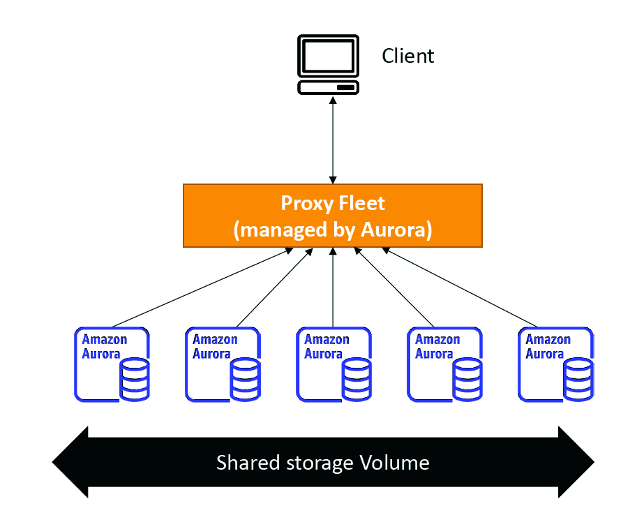

### **Aurora Serverless and Failover**
- Aurora Serverless compute layer is placed in a Single AZ
- Separates computation capacity and storage, and the storage volume for the cluster is spread across multiple AZs. The data remains available even if outages affect the DB instance or the associated AZ.
- Supports automatic multi-AZ failover where if the DB instance for a DB cluster becomes unavailable or the Availability Zone (AZ) it is in fails, Aurora recreates the DB instance in a different AZ.
- Failover mechanism takes longer than for an Aurora Provisioned cluster.
- Failover time is currently undefined because it depends on demand and capacity available in other AZs within the given AWS Region

### **Aurora Serverless Auto Scaling**
- Aurora Serverless automatically scales based on the active database workload ( CPU or connections), in some cases, capacity might not scale fast enough to meet a sudden workload change, such as a large number of new transactions.
- Once a scaling operation is initiated, Aurora Serverless attempts to find a scaling point, which is a point in time at which the database can safely complete scaling.
- Might not be able to find a scaling point and will not scale if there are:
    - long-running queries or transactions in progress, or
    - temporary tables or table locks in use.
- Supports cooldown period
- After Scale up, it has a 15 minutes cooldown period for subsequent scale down
- After Scale down, it has a 310 secs cooldown period for subsequent scale down
- Has no cooldown period for scaling up activities and scales as and when necessary

**Cheat Sheets**

https://jayendrapatil.com/aws-rds-aurora-serverless/

**References:**

https://aws.amazon.com/rds/aurora/serverless/

**Videos**

https://youtu.be/xKFA6PJgp0o

https://www.youtube.com/results?search_query=Amazon+Aurora+Serverless

**Hands On**

https://www.youtube.com/results?search_query=Amazon+Aurora+Serverless+Hans+on

------------------------------------------------------------------------------------------------------------------------
##  **16 - Amazon Keyspaces (for Apache Cassandra)**

**Definitions**

Amazon Keyspaces (for Apache Cassandra) is a **scalable, highly available, and fully managed database service** that is compatible with Apache Cassandra. With Amazon Keyspaces, you can run Cassandra workloads on AWS while continuing to use your existing Cassandra application code and developer tools. This service eliminates the need to **provision, patch, or manage servers** and removes the need for **software installation, maintenance, or operation**—tasks that are traditionally associated with managing a Cassandra environment.

Amazon Keyspaces (for Apache Cassandra) is a scalable, highly available, and managed Apache Cassandra–compatible database service. With Amazon Keyspaces, you can run your Cassandra workloads on 

AWS using the same Cassandra application code and developer tools that you use today. You don’t have to provision, patch, or manage servers, and you don’t have to install, maintain, or operate software. 

Amazon Keyspaces is serverless, so you pay for only the resources you use and the service can automatically scale tables up and down in response to application traffic. 

You can build applications that serve thousands of requests per second with virtually unlimited throughput and storage. Data is encrypted by default and Amazon Keyspaces enables you to back up your table data continuously using point-in-time recovery. 

Amazon Keyspaces gives you the performance, elasticity, and enterprise features you need to operate business-critical Cassandra workloads at scale.

### Key Features

### Serverless Architecture

Amazon Keyspaces operates on a **serverless architecture**, meaning it automatically scales tables up or down in response to the traffic your application generates. This elasticity enables applications to handle thousands of requests per second with **virtually unlimited throughput and storage**.

Since Amazon Keyspaces is serverless, **you pay only for the resources you use**, providing cost efficiency without sacrificing performance. This is particularly valuable in fluctuating workload environments, where traffic volumes may vary over time.

### Data Security

Data in Amazon Keyspaces is **encrypted by default**, which helps ensure data privacy and compliance with security standards. The service also supports **continuous backup with point-in-time recovery** (PITR), allowing users to restore data to any point within the last 35 days. This feature is essential for critical applications where data integrity and availability are top priorities.

### Performance and Elasticity

Amazon Keyspaces provides the **performance, elasticity, and enterprise-grade features** necessary for running business-critical Cassandra workloads at scale. Designed to meet the high demands of enterprise applications, Amazon Keyspaces can adapt to both high throughput and storage requirements without manual intervention. This elasticity allows for significant flexibility in handling unexpected workload spikes.

### Seamless Integration with AWS Services

Amazon Keyspaces integrates with a variety of other AWS services, enabling **end-to-end solutions for data management, analytics, and security**. Key integration features include:

- **Authentication and Authorization**: Integration with **AWS Identity and Access Management (IAM)** allows you to manage access and permissions effectively, leveraging AWS’s role-based security model.
- **Monitoring**: With **Amazon CloudWatch**, you can monitor the performance and health of your Keyspaces tables, set alerts, and create custom metrics to maintain optimal performance.
- **Serverless Computing**: **AWS Lambda** enables you to execute custom serverless functions in response to events on your Amazon Keyspaces tables, which can be useful for data processing, analytics, and other automation tasks.

These integrations make Amazon Keyspaces a powerful tool for creating scalable, secure, and robust data solutions within the AWS ecosystem.

### Pricing Model

Amazon Keyspaces offers a **pay-as-you-go pricing model**, allowing you to avoid upfront costs or long-term commitments. Charges are based on **capacity, read and write throughput, and data storage consumed**. This flexible pricing structure is particularly advantageous for dynamic workloads, where demand for throughput and storage may change frequently.

**Cheat Sheets**

https://tutorialsdojo.com/aws-cheat-sheets-database-services/

**References:**

https://aws.amazon.com/keyspaces/?nc1=h_ls

https://aws.amazon.com/keyspaces/features/

https://aws.amazon.com/keyspaces/pricing/

https://aws.amazon.com/keyspaces/scaling-data/

https://aws.amazon.com/keyspaces/resources/?blog-items.sort-by=item.additionalFields.createdDate&blog-items.sort-order=desc

https://aws.amazon.com/keyspaces/getting-started/

https://aws.amazon.com/keyspaces/faqs/

https://aws.amazon.com/keyspaces/what-is-cassandra/

**Videos**

https://www.youtube.com/watch?v=PYdLIvBHe2E

https://www.youtube.com/results?search_query=Amazon+Keyspaces

**Hands On**
https://www.youtube.com/results?search_query=Amazon+Keyspaces+hands+on

------------------------------------------------------------------------------------------------------------------------
##  **17 - Amazon Timestream**

**Definitions**

### **Amazon Timestream**

- Fast, scalable, and serverless time-series database
- Quickly analyze time-series data using SQL, with built-in analytic functions for smoothing, approximation, and interpolation.
- Serverless database processes millions of queries per day and automatically scales as needed.
- Simplify data lifecycle management with storage tiers, including a memory store for recent data and a magnetic store for historical data.
- Derive faster insights from your data and make business decisions at a fraction of the cost of existing time-series solutions.

### **How it works**
- Amazon Timestream is a fast, scalable, and serverless time-series database service that makes it easier to store and analyze trillions of events per day up to 1,000 times faster. 
- Amazon Timestream automatically scales up or down to adjust capacity and performance, so that you don’t have to manage the underlying infrastructure.

**Cheat Sheets**

**References:**

https://aws.amazon.com/timestream/?nc1=h_ls

https://aws.amazon.com/timestream/features/?nc=sn&loc=2

https://aws.amazon.com/timestream/pricing/?nc=sn&loc=3

https://aws.amazon.com/timestream/getting-started/?nc=sn&loc=4

https://aws.amazon.com/timestream/faq/?nc=sn&loc=5

https://aws.amazon.com/timestream/customers/?nc=sn&loc=6

**Videos**

https://www.youtube.com/results?search_query=Amazon+Timestream

**Hands On**

https://www.youtube.com/results?search_query=Amazon+Timestream+hands+on

------------------------------------------------------------------------------------------------------------------------
##  **18 - Global Database**

**Definitions**

Global Aurora

-  Aurora Cross Region Read Replicas:
-  Useful for disaster recovery
-  Simple to put in place
-  Aurora Global Database (recommended):
-  1 Primary Region (read / write)
-  Up to 5 secondary (read-only) regions, replication lag is less than 1 second
-  Up to 16 Read Replicas per secondary region
-  Helps for decreasing latency
-  Promoting another region (for disaster recovery) has an RTO of < 1 minute
-  Typical cross-region replication takes less than 1 second

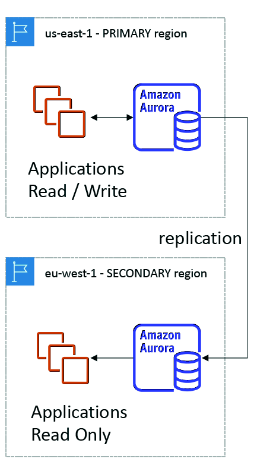

**Cheat Sheets**

**References:**

https://aws.amazon.com/pt/rds/aurora/global-database/

**Videos**

**Hands On**

------------------------------------------------------------------------------------------------------------------------
##  **19 - Amazon MemoryDB for Redis**

**Definitions**

**Amazon MemoryDB for Redis** is a **fully managed, Redis-compatible, in-memory database service** offered by AWS, designed specifically for modern applications that demand high performance, scalability, and availability. With MemoryDB, you can achieve **ultra-fast, sub-millisecond read and write operations**, making it particularly well-suited for applications that need real-time access to data. Common use cases include **caching**, **session stores**, **gaming leaderboards**, **geospatial services**, and **real-time analytics**.

### Redis Compatibility

MemoryDB is **compatible with Redis**, a widely adopted open-source in-memory data structure store that serves as a database, cache, and message broker. This compatibility allows you to leverage **existing Redis application code, clients, and commands** within MemoryDB, simplifying both migration and integration with existing Redis-based applications. By maintaining Redis compatibility, MemoryDB supports a seamless transition for organizations looking to move their workloads to a fully managed Redis-compatible service in AWS.

### Persistent Data Storage

While traditional caching solutions typically offer **ephemeral storage** (where data is lost if the cache is restarted), Amazon MemoryDB goes beyond caching by providing **data durability and high availability**:

- **Six-Way Replication Across Three Availability Zones**: MemoryDB automatically replicates data six ways across **three distinct AWS Availability Zones**, offering a high level of fault tolerance. This architecture ensures data remains available even in the event of multiple hardware failures.
- **Continuous Backups to Amazon S3**: MemoryDB continuously backs up data to **Amazon S3** to provide durable storage, ensuring that critical data can be restored in the event of an outage.

This dual-layered approach to durability makes Amazon MemoryDB a robust option for applications requiring not only fast data access but also **data persistence and high availability**.

### Security Features

Amazon MemoryDB offers a comprehensive security framework with multiple layers to protect data and support regulatory compliance. Key security features include:

- **Encryption at Rest**: MemoryDB uses **AWS Key Management Service (KMS)** to encrypt data at rest, protecting stored data from unauthorized access.
- **Encryption in Transit**: To secure data during transmission, MemoryDB employs **Transport Layer Security (TLS)**, safeguarding data as it moves between MemoryDB nodes and client applications.
- **VPC Support**: MemoryDB integrates with **Amazon Virtual Private Cloud (VPC)**, providing network isolation for greater control over access to your database. By using VPC, you can ensure that MemoryDB operates in a dedicated, isolated network environment.

These security capabilities are essential for organizations with stringent data protection requirements, ensuring that sensitive information remains secure while still benefiting from MemoryDB’s high performance.

### High Performance and Low Latency

One of MemoryDB’s core advantages is its **ultra-low latency**. By operating as an in-memory database, MemoryDB delivers **sub-millisecond read and write operations**, which is crucial for real-time applications that cannot tolerate delays in data retrieval or updates. This speed is particularly beneficial in scenarios like gaming leaderboards, where players’ scores need instant updates, or in live analytics, where rapid access to data impacts decision-making.

### Key Use Cases

MemoryDB's high availability, Redis compatibility, and low-latency performance make it ideal for a variety of high-demand applications:

- **Caching**: Quickly retrieve frequently accessed data to reduce load on primary databases and improve application response times.
- **Session Stores**: Store and manage user sessions with rapid access to session data, enabling smooth user experiences across web applications.
- **Gaming Leaderboards**: Process and update real-time player rankings, which is essential for games with a competitive element.
- **Geospatial Services**: Efficiently store and retrieve geospatial data, often used in navigation, delivery tracking, and mapping services.
- **Real-Time Analytics**: Power analytics systems that require near-instant access to constantly updated data.

### Cost Efficiency

MemoryDB is a fully managed service, which reduces operational overhead and allows teams to focus on building applications rather than managing infrastructure. **Automatic scaling** and **Redis compatibility** help lower migration costs, as existing Redis tools and code can be reused. Furthermore, **you only pay for the resources you consume** based on MemoryDB's usage-based pricing, making it a flexible choice for applications with varying workloads.

**Cheat Sheets**

**References:**

**Videos**

**Hands On**

------------------------------------------------------------------------------------------------------------------------