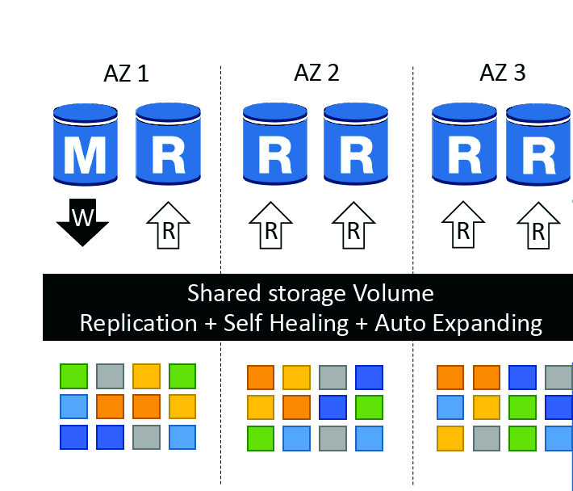

 [General Content AWS Cloud][1]

[1]: https://github.com/weder96/aws-certification-learning

# Module 8: Databases

## Content
1.  <a href="#section-01"> Use Cases For Different Database Types </a>
2.  <a href="#section-02"> Amazon Relational Database Service (RDS) </a>
3.  <a href="#section-03"> Amazon DynamoDB </a>
4.  <a href="#section-04"> Amazon RedShift </a>
5.  <a href="#section-05"> Amazon ElastiCache </a>
6.  <a href="#section-06"> Amazon EMR </a>
7.  <a href="#section-07"> Amazon (RDS) Pricing </a>
8.  <a href="#section-08"> Amazon (RDS) Multiple Availability Zones (A-Z) </a>
9.  <a href="#section-09"> Enable automatic patching for the instances using the Amazon RDS console </a>
10. <a href="#section-10"> Backups and Restoring a DB instance to a specified time </a>
11. <a href="#section-11"> Amazon Neptune </a>
12. <a href="#section-12"> Amazon Aurora </a>
13. <a href="#section-13"> Amazon DocumentDB </a>
14. <a href="#section-14"> Amazon QLDB is serverless </a>
15. <a href="#section-15"> Amazon Aurora Serverless </a>
16. <a href="#section-16"> Amazon Keyspaces (for Apache Cassandra) </a>
17. <a href="#section-17"> Amazon Timestream  </a>
18. <a href="#section-18"> Gobal Databases  </a>

***********************************************************************************************************
##  **1  - Use Cases For Different Database Types**

The table below provides guidance on typical use cases for various AWS database/data storage services:

### **Database on EC2**
- Full control over instance and database
- Preferred DB not available in RDS

### **Amazon RDS**
- Need traditional relational database for OLTP
- Your data is well formed and structured
- Existing applications that require RDBMS

### **Amazon DynamoDB**
- Name/value pair data
- Unpredictable data structure
- In-memory performance with persistence
- High I/O needs
- Requires dynamic scaling

### **Amazon RedShift**
- Data warehouse for large volumes of aggregated data
- Mainly OLAP workloads

### **Amazon Neptune**
- Relationships between objects are of high value

### **Amazon ElastiCache**
- Fast temporary storage for small amounts of data
- Highly volatile (non-persistent) data

### **Amazon S3**
- Large binary objects (BLOBs)
- static websites

We will now cover several of these database types that may come up on the exam.

With AWS managed services you can reduce your time spent performing common IT tasks. With services such as Amazon RDS, AWS will patch the database host operating system and database software and perform patch management activities.

* "Patching database software" is a correct answer.

* "Taking a backup of a database" is also a correct answer.

**Cheat Sheets**

https://digitalcloud.training/aws-database-services/

**References:**

https://aws.amazon.com/rds/

https://docs.aws.amazon.com/AmazonRDS/latest/UserGuide/USER_ReadRepl.html

https://docs.aws.amazon.com/AmazonRDS/latest/UserGuide/Overview.Encryption.html

https://docs.aws.amazon.com/AmazonRDS/latest/UserGuide/UsingWithRDS.SSL.html

https://docs.aws.amazon.com/prescriptive-guidance/latest/patterns/encrypt-an-existing-amazon-rds-for-postgresql-db-instance.html

**Videos**

**********************************************************************************************************
##  **2  - Amazon Relational Database Service (RDS)**

Amazon Relational Database Service (Amazon RDS) is a managed service that makes it easy to set up, operate, and scale a relational database in the cloud.

Relational databases are known as SQL (Structured Query Language) databases.

Non-relational databases are known as NoSQL databases.

RDS is a type of OLTP (Online Transaction Processing) database.

Amazon RDS is a managed relational database service on which you can run several types of database software. The service is managed so this reduces the database administration tasks an administrator would normally undertake. The managed service includes hardware provisioning, database setup, patching and backups.

### **RDS Features and Benefits:**
- SQL database type.
- Can be used to perform complex queries and joins.
- Easy to configure, highly available, fault tolerant and scalable.
- Used when the data is clearly defined.
- Common use cases include online stores and banking systems.

### **Amazon RDS supports the following database engines:**
- SQL Server.
- Oracle.
- MySQL Server.
- PostgreSQL.
- Aurora.
- MariaDB.

**Aurora is Amazon's proprietary database**.

RDS is a fully managed service and you do not have access to the underlying EC2 instance (no root access).

### **RDS service includes the following:**
- Security and patching of database instances.
- Automated backup for the DB instances.
- Software updates for the database engine.
- Easy scaling for storage and compute.
- Multi-AZ option with synchronous replication.
- Automatic failover for Multi-AZ option.
- Read replica option for read-heavy workloads.
- A DB instance is a cloud database environment with the compute and storage resources you specify.

### **Cryptography:**

- You can encrypt your Amazon RDS instances and snapshots at rest by enabling the encryption option for your Amazon RDS DB instance.
- Encryption at rest is supported for all database types and uses AWS KMS.
- You cannot encrypt an existing database, you need to create a snapshot, copy it, encrypt the copy and build an encrypted database from the snapshot.

### **Database subnet groups:**

- A DB subnet group is a collection of subnets (usually private) that you create within a VPC and assign to your DB instances.
- Each DB subnet group must have subnets in at least two Availability Zones in each region.
- It is recommended to configure a subnet group with subnets in each AZ (even for standalone instances).

### **AWS billing by:**
- DB instance hours (partial hours are billed as full hours).
- GB/month storage.
- I/O requests/month – for magnetic storage.
- Provisioned IOPS/month – for SSD IOPS provisioned by RDS.
- Outgoing data transfer.
- Backup storage (database backups and manual snapshots).

### **Scalability:**
- You can only increase RDS (compute and storage).
- You cannot decrease the storage allocated to an RDS instance.
- You can scale storage and change storage type for all database engines except MS SQL.

### **RDS provides multi-AZ disaster recovery that provides fault tolerance across Availability Zones:**
- RDS Multi-AZ creates a replica in another AZ and synchronously replicates to it (DR only).
- There is an option to choose multi-AZ during startup wizard.
- AWS recommends using provisioned IOPS storage for multi-AZ RDS DB Instances.
- Each AZ runs on its own physically distinct and independent infrastructure and is designed to be highly reliable.
- You cannot choose which AZ in the region to choose to create the standby DB instance.

### **Read replicas - provide improved performance for reads:**
- Read replicas are used for read heavy databases and replication is asynchronous.
- Read replicas are for workload sharing and offloading.
- Read replicas provide read-only DR.
- Read replicas are created from a snapshot of the master instance.
- Must have automated backups enabled on the primary (retention period > 0).

****************************************************** ****************************************************** ***********
##  **3  - Amazon DynamoDB**
Amazon DynamoDB is a fully managed NoSQL database service that delivers fast, predictable performance with seamless scalability.

### **Features and Benefits of Dynamo DB:**
- NoSQL (non-relational) database type.
- Fast, highly available and fully managed.
- Used when data is fluid and can change.
- Common use cases include social media and web analytics.

Button scaling means you can scale your database at any time without incurring downtime.

SSD-based and uses limited indexing on attributes for performance.

DynamoDB is a web service that uses HTTP over SSL (HTTPS) as the transport and JSON as the message serialization format.

Amazon DynamoDB stores three geographically distributed replicas of each table to enable high availability and data durability.

Data is synchronously replicated across 3 facilities (AZs) in a region.

### **Interregion replication allows you to replicate between regions:**
- Amazon DynamoDB Global Tables provides a fully managed solution for deploying a multi-region, multi-master database.
- When creating a global table, you specify the AWS regions where you want the table to be available.
- DynamoDB performs all the necessary tasks to create identical tables in these regions and propagate rolling data changes to all of them.

Provides low read and write latency.

Increase or decrease storage and throughput as needed, with no code changes or downtime.

DynamoDB has no schema.

DynamoDB can be used to store session state.

It provides two reading models.

### **Occasionally consistent readings (Default):**
- The eventual consistency option maximizes your read throughput (better read performance).
- An eventually consistent read may not reflect the results of a recently completed write.
- Consistency in all copies reached in 1 second.

### **Strongly consistent readings:**
- A strongly consistent read returns a result that reflects all writes that received a successful response before the read (faster consistency).

Amazon DynamoDB Accelerator (DAX) is a fully managed, highly available in-memory cache for DynamoDB that delivers up to a 10x performance improvement – ​​from milliseconds to microseconds – even at millions of requests per second.

### **Managing throughput capacity automatically with DynamoDB auto scaling**

**How DynamoDB auto scaling works**

https://docs.aws.amazon.com/amazondynamodb/latest/developerguide/AutoScaling.Console.html

The following diagram provides a high-level overview of how DynamoDB auto scaling manages throughput capacity for a table.

###**DAX: How it works**

https://docs.aws.amazon.com/amazondynamodb/latest/developerguide/DAX.concepts.html

**Cheat Sheets**

https://tutorialsdojo.com/amazon-dynamodb/

https://digitalcloud.training/category/aws-cheat-sheets/aws-solutions-architect-professional/aws-database-sap/

**References:**

https://docs.aws.amazon.com/amazondynamodb/latest/developerguide/Introduction.html?shortFooter=true

https://aws.amazon.com/dynamodb/faqs/

**Videos**

https://www.youtube.com/watch?v=HaEPXoXVf2k

****************************************************** ****************************************************** ***********
##  **4  - Amazon RedShift**

Amazon Redshift is a fast, fully managed data warehouse that makes it simple and cost-effective to analyze all your data using standard SQL and existing Business Intelligence (BI) tools.

RedShift is an SQL-based data warehouse used for analytics applications.

RedShift is a relational database used for OLAP (Online Analytics Processing) use cases.

RedShift is used to run complex analytical queries on petabytes of structured data, using sophisticated query optimization, columnar storage on high-performance local disks, and massively parallel query execution.

RedShift is ideal for processing large amounts of data for business intelligence.

RedShift is 10x faster than a traditional SQL database.

### **RedShift uses columnar data storage:**
- Data is stored sequentially in columns instead of rows.
- Column-based database is ideal for data storage and analysis.
- Requires less I/Os, which greatly increases performance.

### **RedShift provides advanced compression:**
- Data is stored sequentially in columns, which allows for much better performance and less storage space.
- RedShift automatically selects the compression scheme.

RedShift uses replication and continuous backups to increase availability and durability and can automatically recover from component and node failures.

### **RedShift always keeps three copies of your data:**
- The original.
- A replica on compute nodes (within the cluster).
- A backup copy on S3.

### **RedShift provides continuous/incremental backups:**
- Multiple copies within a cluster.
- Continuous and incremental backups to S3.
- Continuous and incremental backups between regions.
- Restoration of streaming.

### **RedShift provides fault tolerance for the following faults:**
- Disk failures.
- Faults from us.
- Network failures.
- AZ/region level disasters.

***************************************************************************************************************
##  **5  - Amazon ElastiCache**

ElastiCache is a web service that makes it easy to deploy and run server nodes that support the Memcached or Redis protocol in the cloud.

The in-memory cache provided by ElastiCache can be used to significantly improve latency and throughput for many read-intensive application workloads or compute-intensive workloads.

Best for scenarios where the database load is based on OLAP (Online Analytics Processing) transactions.

### **The following table describes some typical ElastiCache use cases:**
### **Web session store**
- In cases with load balanced web servers, store the web session information in Redis so that if one server is lost, the session information is not lost and another web server can recover it

### **Database caching**
- Use Memcached in front of AWS RDS to cache popular queries to offload RDS work and return results faster to users

### **Leaderboards**
- Use Redis to provide a live leaderboard to millions of users of your mobile app

### **Streaming data dashboards**
- Provide a landing point to transmit sensor data to the shop floor, providing real-time live dashboard views

ElastiCache EC2 nodes cannot be accessed from the internet or EC2 instances in other VPCs.

They can also be On-Demand or Reserved Instances (but not Spot Instances).

ElastiCache can be used to store session state.

### **There are two types of ElastiCache engine:**
- **Memcached** – simpler model, can run large nodes with multiple cores/threads, can scale in and out, can cache objects like databases.
- **Redis** – complex model, supports encryption, master/slave replication, cross AZ (HA), automatic failover and backup/restore.

**References**

https://aws.amazon.com/elasticache/

**cheat sheets**

https://digitalcloud.training/amazon-elasticache/

**Videos**

https://www.youtube.com/watch?v=v0zozYN-mdI

https://www.youtube.com/watch?v=lU4cHVL9IXM

****************************************************** ****************************************************** ***********
##  **6  - Amazon EMR**

**Amazon EMR** is a web service that enables companies, researchers, data analysts, and developers to process large amounts of data easily and cost-effectively.

EMR uses a hosted Hadoop framework running on Amazon EC2 and Amazon S3.

Managed Hadoop framework for processing large amounts of data.

It also supports **Apache Spark, HBase, Presto and Flink**.

Most commonly used for log analysis, financial analysis, or extract, translate, and load (ETL) activities.

****************************************************** ****************************************************** ***********
##  **7  - Amazon (RDS) Pricing**

[Amazon (RDS) Pricing](https://aws.amazon.com/rds/pricing/?nc1=h_ls)

Amazon Relational Database Service (Amazon RDS) is a managed, highly available, and secure database service that makes it simple to set up, operate, and scale databases in the cloud. Amazon RDS is free to try and you pay only for what you use with no minimum fees. You can pay for Amazon RDS using On-Demand or Reserved Instances. Estimate your monthly bill using the AWS Pricing Calculator.

Amazon RDS provides a selection of instance types optimized to fit different relational database use cases. Select one of the Amazon RDS database engines below to view pricing. See Previous Generation Instances for previous instance pricing not listed here.

For Amazon RDS feature-level pricing, see RDS Performance Insights and RDS Proxy pricing pages.

As part of the AWS Free Tier, Amazon RDS helps new AWS customers get started for free with a managed database service in the cloud. Each calendar month, the 

**Amazon RDS Free Tier allows you to use:**
- 750 hours of Amazon RDS Single-AZ db.t2.micro, db.t3.micro, and db.t4g.micro Instances usage running MySQL, MariaDB, PostgreSQL databases each month. If running more than one instance, usage is aggregated across instance classes.
- 750 hours of Amazon RDS Single-AZ db.t2.micro Instance usage running Oracle BYOL or SQL Server (running SQL Server Express Edition). Oracle BYOL db.t3.micro  Single-AZ Instance usage is also included as part of the Amazon RDS free tier. If running both a db.t2.micro Single-AZ Instance and a db.t3.micro Single-AZ Instance on Oracle BYOL, usage is aggregated across Instance classes.
- 20 GB of General Purpose (SSD) DB storage.
- 20 GB of storage for your automated database backups and any user-initiated DB Snapshots.

With Amazon RDS you are charged for the type and size of database, the uptime, any additional storage of backup (above the DB size), requests, deployment type (e.g. you pay for multi AZ), and data transfer outbound.

***************************************************************************************************************
##  **8  - Amazon (RDS) Multiple Availability Zones (A-Z)**
[Amazon (RDS) Multiple Availability Zones](https://aws.amazon.com/rds/features/multi-az/)

Multi AZ provides a mechanism to failover the RDS database to another synchronously replicated copy in the event of the failure of an AZ. The endpoint address for the RDS instances gets remapped to the standby instance as can be seen in the image below:

##  **9 - Enable automatic patching for the instances using the Amazon RDS console**

[Enable automatic patching](https://docs.aws.amazon.com/AmazonRDS/latest/UserGuide/USER_UpgradeDBInstance.Maintenance.html)

Periodically, Amazon RDS performs maintenance on Amazon RDS resources. Maintenance most often involves updates to the DB instance's underlying hardware, underlying operating system (OS), or database engine version. Updates to the operating system most often occur for security issues and should be done as soon as possible.

Required patching is automatically scheduled only for patches that are related to security and instance reliability. Such patching occurs infrequently (typically once every few months) and seldom requires more than a fraction of your maintenance window.

-----------------------------------------------------------------------------------------------------------------------
##  **9  - Enable automatic patching for the instances using the Amazon RDS console**

**Cheat Sheets**

**References:**

**Videos**

-----------------------------------------------------------------------------------------------------------------------
##  **10 - Backups and Restoring a DB instance to a specified time**
[Restoring a DB instance](https://docs.aws.amazon.com/AmazonRDS/latest/UserGuide/USER_PIT.html)

You can restore an Amazon RDS database instance to a specific point in time with a granularity of 5 minutes. Amazon RDS uses transaction logs which it uploads to Amazon S3 to do this.

**To restore a DB instance to a specified time in aws console:**
 - Restore to point in time.
 - The Restore to point in time window appears.

 **Point-in-time recovery (PITR)
 Point-in-time recovery (PITR) provides continuous backups of your DynamoDB table data. When enabled, DynamoDB maintains incremental backups of your table for the last 35 days until you explicitly turn it off. It is a customer responsibility to enable PITR on and AWS is responsible for actually performing the backups.

"The customer is responsible for configuring and AWS is responsible for performing backups".

**Cheat Sheets**

https://digitalcloud.training/aws-database-services/

**References:**

https://aws.amazon.com/blogs/aws/new-amazon-dynamodb-continuous-backups-and-point-in-time-recovery-pitr/

**Videos**

https://www.youtube.com/watch?v=YVe9amljgaw&t=45s
https://www.youtube.com/watch?v=n0KK094sPnQ

-----------------------------------------------------------------------------------------------------------------------
##  **11 - Amazon Neptune**

**Definitions**

Amazon Neptune is a fully managed graph database service used for building applications that work with highly connected datasets.
Optimized for storing billions of relationships between pieces of information.
Provide milliseconds latency when querying the graph.
Neptune supports graph query languages like Apache TinkerPop Gremlin and W3C’s SPARQL.

### **Pricing**
- You are billed based on the DB instance hours, I/O requests, storage, and Data transfer.
- Storage rate and I/O rate is billed in per GB-month increments and per million request increments respectively.

### **Monitoring**
- Visualize your graph using the Neptune Workbench.
- You can receive event notifications on your Amazon Neptune DB clusters, DB instances, DB cluster snapshots, parameter groups, or security groups through Amazon SNS.

### **Limitations**
- It does not support cross-region replicas.
- Encryption of an existing Neptune instance is not supported.
- Sharing of automatic DB snapshots to other accounts is not allowed. A workaround for this is to manually copy the snapshot from the automatic snapshot, then, copy the manual snapshot to another account.

**Cheat Sheets**

https://tutorialsdojo.com/amazon-neptune/

**References:**

https://aws.amazon.com/neptune/

**Videos**

https://www.youtube.com/results?search_query=aws+neptume

**Hands On**

https://www.youtube.com/results?search_query=Amazon+Neptune++hands+on

-----------------------------------------------------------------------------------------------------------------------
##  **12 - Amazon Aurora**

**Definitions**

- With some workloads, Aurora can deliver up to five times the throughput of MySQL and up to three times the throughput of PostgreSQL.
- Aurora includes a high-performance storage subsystem. The underlying storage grows automatically as needed, up to 128 terabytes. The minimum storage is 10GB.
- Aurora will keep your database up-to-date with the latest patches.
- Aurora supports quick, efficient cloning operations.
- You can share your Amazon Aurora DB clusters with other AWS accounts for quick and efficient database cloning.
- Aurora is fault-tolerant and self-healing.
- Aurora is a proprietary technology from AWS (not open sourced)
- Postgres and MySQL are both supported as Aurora DB (that means your drivers will work as if Aurora was a Postgres or MySQL database)
- Aurora is “AWS cloud optimized” and claims 5x performance improvement over MySQL on RDS, over 3x the performance of Postgres on RDS
- Aurora storage automatically grows in increments of 10GB, up to 128 TB.
- Aurora can have up to 15 replicas and the replication process is faster than MySQL (sub 10 ms replica lag)
- Failover in Aurora is instantaneous. It’s HA (High Availability) native.
- Aurora costs more than RDS (20% more) – but is more efficient

### **Aurora High Availability and Read Scaling**

-  6 copies of your data across 3 AZ:
-  4 copies out of 6 needed for writes
-  3 copies out of 6 need for reads
-  Self healing with peer-to-peer replication
-  Storage is striped across 100s of volumes
-  One Aurora Instance takes writes (master)
-  Automated failover for master in less than 30 seconds
-  Master + up to 15 Aurora Read Replicas serve reads
-  Support for Cross Region Replication

### **Features of Aurora**

-  Automatic fail-over
-  Backup and Recovery
-  Isolation and security
-  Industry compliance
-  Push-button scaling
-  Automated Patching with Zero Downtime
-  Advanced Monitoring
-  Routine Maintenance
-  Backtrack: restore data at any point of time without using backups

### **Aurora DB Cluster**

---------------------------------------------------------------------------

### **Aurora – Custom Endpoints**

-  Define a subset of Aurora Instances as a Custom Endpoint
-  Example: Run analytical queries on specific replicas
-  The Reader Endpoint is generally not used after defining Custom Endpoints

### **Aurora Replicas - Auto Scaling**

### **Aurora Machine Learning**

-  Enables you to add ML-based predictions to your applications via SQL
-  Simple, optimized, and secure integration between Aurora and AWS ML services
-  Supported services
-  Amazon SageMaker (use with any ML model)
-  Amazon Comprehend (for sentiment analysis)
-  You don’t need to have ML experience
-  Use cases: fraud detection, ads targeting, sentiment analysis, product recommendations

### **Aurora Backups**
-  Automated backups
-  1 to 35 days (cannot be disabled)
-  point-in-time recovery in that timeframe
-  Manual DB Snapshots
-  Manually triggered by the user
-  Retention of backup for as long as you want

### **RDS & Aurora Restore options**

-  Restoring a RDS / Aurora backup or a snapshot creates a new database
-  Restoring MySQL RDS database from S3
-  Create a backup of your on-premises database
-  Store it on Amazon S3 (object storage)
-  Restore the backup file onto a new RDS instance running MySQL
-  Restoring MySQL Aurora cluster from S3
-  Create a backup of your on-premises database using Percona XtraBackup
-  Store the backup file on Amazon S3
-  Restore the backup file onto a new Aurora cluster running MySQL

### **Aurora Database Cloning**

-  Create a new Aurora DB Cluster from an existing one
-  Faster than snapshot & restore
-  Uses copy-on-write protocol
-  Initially, the new DB cluster uses the same data volume as the original DB cluster (fast and efficient – no copying is needed)
-  When updates are made to the new DB cluster data, then additional storage is allocated and data is copied to be separated
-  Very fast & cost-effective
-  Useful to create a “staging” database from a “production” database without impacting the production database

### **Monitoring**
- Subscribe to Amazon RDS events to be notified when changes occur with a DB instance, DB cluster, DB cluster snapshot, DB parameter group, or DB security group.
- Database log files
- RDS Enhanced Monitoring — Look at metrics in real time for the operating system.
- RDS Performance Insights monitors your Amazon RDS DB instance load so that you can analyze and troubleshoot your database performance.
- Use CloudWatch Metrics, Alarms and Logs

### **Pricing**
- You are charged for DB instance hours, I/O requests, Backup storage and Data transfer.
- You can purchase On-Demand Instances and pay by the hour for the DB instance hours that you use, or Reserved Instances to reserve a DB instance for a one-year or three-year term and receive a significant discount compared to the on-demand DB instance pricing.
- Aurora PostgreSQL support for Kerberos and Microsoft Active Directory provides the benefits of single sign-on and centralized authentication of Aurora PostgreSQL database users. In addition to password-based and IAM-based authentication methods, you can also authenticate using AWS Managed Microsoft AD Service

### **RDS & Aurora Security**

-  At-rest encryption:
-  Database master & replicas encryption using AWS KMS – must be defined as launch time
-  If the master is not encrypted, the read replicas cannot be encrypted
-  To encrypt an un-encrypted database, go through a DB snapshot & restore as encrypted
-  In-flight encryption: TLS-ready by default, use the AWS TLS root certificates client-side
-  IAM Authentication: IAM roles to connect to your database (instead of username/pw)
-  Security Groups: Control Network access to your RDS / Aurora DB
-  No SSH available except on RDS Custom
-  Audit Logs can be enabled and sent to CloudWatch Logs for longer retention

**Cheat Sheets**

https://digitalcloud.training/amazon-aurora/

https://tutorialsdojo.com/amazon-aurora/

**References:**

https://docs.aws.amazon.com/AmazonRDS/latest/AuroraUserGuide/Aurora.Replication.html

https://docs.aws.amazon.com/AmazonCloudFront/latest/DeveloperGuide/Introduction.html

https://docs.aws.amazon.com/AmazonRDS/latest/AuroraUserGuide/

https://aws.amazon.com/rds/aurora/details/mysql-details/

https://aws.amazon.com/rds/aurora/details/postgresql-details/

https://aws.amazon.com/rds/aurora/global-database/

https://aws.amazon.com/rds/aurora/parallel-query/

https://aws.amazon.com/rds/aurora/serverless/

https://aws.amazon.com/rds/aurora/pricing/

https://aws.amazon.com/rds/aurora/faqs/

**Videos**

https://www.youtube.com/results?search_query=Amazon+Aurora

https://www.youtube.com/watch?v=U42mC_iKSBg

https://www.youtube.com/watch?v=iwS1h7rLNBQ&t=2s

**Hands On**

https://www.youtube.com/results?search_query=Amazon+Aurora+Hans+on

-----------------------------------------------------------------------------------------------------------------------
##  **13 - Amazon DocumentDB**

**Definitions**
- Fully managed document database service designed to be fast, scalable, and highly available.
- Data is stored in JSON-like documents.
- Compatible with MongoDb.
- Flexible schema and indexing.
- Commonly used for content management, user profiles, and real-time big data.

### **Pricing**
- You are billed based on four categories
    - On-demand instances
        - Pricing per second with a 10-minute minimum
    - Database I/O
        - Pricing per million I/Os
    - Database Storage
        - Pricing per GB/month
    - Backup Storage
        - Pricing per GB/month

### **Limitations**
- Amazon DocumentDB supports the Global Clusters feature which allows you to launch up to five read-only replicas.
- Encryption of an existing DocumentDB instance is not supported.
- Sharing of automatic DB snapshots to other accounts is not allowed. A workaround for this is to manually copy the snapshot from the automatic snapshot, then, copy the manual snapshot to another account.

**Cheat Sheets**

https://tutorialsdojo.com/amazon-documentdb/

**References:**

https://aws.amazon.com/documentdb/faqs/

https://aws.amazon.com/blogs/database/migrating-to-amazon-documentdb-with-the-online-method/

**Videos**

https://www.youtube.com/results?search_query=documentdb+aws

**Hands on**

https://www.youtube.com/results?search_query=Amazon+DocumentDB+hands+on++

-----------------------------------------------------------------------------------------------------------------------
##  **14 - Amazon QLDB Serverless**

**Definitions**

Amazon Quantum Ledger Database (QLDB):

- Fully managed ledger database that provides a transparent, immutable, and cryptographically verifiable transaction log owned by a central trusted authority.
- Used to track all application data changes, and maintain a complete and verifiable history of changes over time
- **Amazon QLDB is serverless**.  No capacity provisioning required or setting read/write limits.
- QLDB transactions are ACID (atomicity, consistency, isolation, and durability) compliant.
- Amazon QLDB uses PartiQL as its query language.

### **Pricing**

- You are billed based on five categories
    - Write I/Os
        - Pricing per 1 million requests
    - Read I/Os
        - Pricing per 1 million requests
    - Journal Storage Rate
        - Pricing per GB-month
    - Indexed Storage Rate
        - Pricing per GB-month
    - Data Transfer OUT From Amazon QLDB To Internet
        -  You are charged based on the amount of data transferred per month. The rate varies for different regions.

### **Limitations**
- Amazon QLDB does not support Backup and Restore. But you can export your data from QLDB to S3.
- Does not support Point-in-time restore feature.
- Does  not support cross-region replication.
- Does not support the use of customer managed CMKs (Customer Managed Keys).

**Cheat Sheets**

https://tutorialsdojo.com/amazon-quantum-ledger-database-qldb/

**References:**

https://aws.amazon.com/qldb/faqs/

https://aws.amazon.com/qldb/pricing/

https://aws.amazon.com/blogs/aws/now-available-amazon-quantum-ledger-database-qldb/

**Videos**

https://www.youtube.com/results?search_query=Amazon+QLDB

**Hands on**

https://www.youtube.com/results?search_query=Amazon+QLDB+hands+on++

------------------------------------------------------------------------------------------------------------------------
##  **15 - Amazon Aurora Serverless**

**Definitions**

Check <a href="#section-12"> Amazon Aurora </a>

### **Aurora Serverless**
- Amazon Aurora Serverless is an on-demand, autoscaling configuration for the MySQL-compatible and PostgreSQL-compatible editions of Aurora.
- An Aurora Serverless DB cluster automatically starts up, shuts down, and scales capacity up or down based on the application’s needs. 
- Enables running database in the cloud without managing any database instances.
- Provides a relatively simple, cost-effective option for infrequent, intermittent, or unpredictable workloads.
- use Cases include
    - Infrequently-Used Applications
    - New Applications – where the needs and instance size is yet to be determined.
    - Variable and Unpredictable Workloads – scale as per the needs
    - Development and Test Databases
    - Multi-tenant Applications
- DB cluster does not have a public IP address and can be accessed only from within a VPC based on the VPC service.
-  Automated database instantiation and autoscaling based on actual usage
-  Good for infrequent, intermittent or unpredictable workloads
-  No capacity planning needed
-  Pay per second, can be more cost-effective

### **Aurora Serverless and Failover**
- Aurora Serverless compute layer is placed in a Single AZ
- Separates computation capacity and storage, and the storage volume for the cluster is spread across multiple AZs. The data remains available even if outages affect the DB instance or the associated AZ.
- Supports automatic multi-AZ failover where if the DB instance for a DB cluster becomes unavailable or the Availability Zone (AZ) it is in fails, Aurora recreates the DB instance in a different AZ.
- Failover mechanism takes longer than for an Aurora Provisioned cluster.
- Failover time is currently undefined because it depends on demand and capacity available in other AZs within the given AWS Region

### **Aurora Serverless Auto Scaling**
- Aurora Serverless automatically scales based on the active database workload ( CPU or connections), in some cases, capacity might not scale fast enough to meet a sudden workload change, such as a large number of new transactions.
- Once a scaling operation is initiated, Aurora Serverless attempts to find a scaling point, which is a point in time at which the database can safely complete scaling.
- Might not be able to find a scaling point and will not scale if there are:
    - long-running queries or transactions in progress, or
    - temporary tables or table locks in use.
- Supports cooldown period
- After Scale up, it has a 15 minutes cooldown period for subsequent scale down
- After Scale down, it has a 310 secs cooldown period for subsequent scale down
- Has no cooldown period for scaling up activities and scales as and when necessary

**Cheat Sheets**

https://jayendrapatil.com/aws-rds-aurora-serverless/

**References:**

https://aws.amazon.com/rds/aurora/serverless/

**Videos**

https://youtu.be/xKFA6PJgp0o

https://www.youtube.com/results?search_query=Amazon+Aurora+Serverless

**Hands On**

https://www.youtube.com/results?search_query=Amazon+Aurora+Serverless+Hans+on

------------------------------------------------------------------------------------------------------------------------
##  **16 - Amazon Keyspaces (for Apache Cassandra)**

**Definitions**

Amazon Keyspaces (for Apache Cassandra) is a scalable, highly available, and managed Apache Cassandra–compatible database service. With Amazon Keyspaces, you can run your Cassandra workloads on 

AWS using the same Cassandra application code and developer tools that you use today. You don’t have to provision, patch, or manage servers, and you don’t have to install, maintain, or operate software. 

Amazon Keyspaces is serverless, so you pay for only the resources you use and the service can automatically scale tables up and down in response to application traffic. 

You can build applications that serve thousands of requests per second with virtually unlimited throughput and storage. Data is encrypted by default and Amazon Keyspaces enables you to back up your table data continuously using point-in-time recovery. 

Amazon Keyspaces gives you the performance, elasticity, and enterprise features you need to operate business-critical Cassandra workloads at scale.

**Cheat Sheets**

https://tutorialsdojo.com/aws-cheat-sheets-database-services/

**References:**

https://aws.amazon.com/keyspaces/?nc1=h_ls

https://aws.amazon.com/keyspaces/features/

https://aws.amazon.com/keyspaces/pricing/

https://aws.amazon.com/keyspaces/scaling-data/

https://aws.amazon.com/keyspaces/resources/?blog-items.sort-by=item.additionalFields.createdDate&blog-items.sort-order=desc

https://aws.amazon.com/keyspaces/getting-started/

https://aws.amazon.com/keyspaces/faqs/

https://aws.amazon.com/keyspaces/what-is-cassandra/

**Videos**

https://www.youtube.com/watch?v=PYdLIvBHe2E

https://www.youtube.com/results?search_query=Amazon+Keyspaces

**Hands On**
https://www.youtube.com/results?search_query=Amazon+Keyspaces+hands+on

------------------------------------------------------------------------------------------------------------------------
##  **17 - Amazon Timestream**

**Definitions**

### **Amazon Timestream**

- Fast, scalable, and serverless time-series database
- Quickly analyze time-series data using SQL, with built-in analytic functions for smoothing, approximation, and interpolation.
- Serverless database processes millions of queries per day and automatically scales as needed.
- Simplify data lifecycle management with storage tiers, including a memory store for recent data and a magnetic store for historical data.
- Derive faster insights from your data and make business decisions at a fraction of the cost of existing time-series solutions.

### **How it works**
- Amazon Timestream is a fast, scalable, and serverless time-series database service that makes it easier to store and analyze trillions of events per day up to 1,000 times faster. 
- Amazon Timestream automatically scales up or down to adjust capacity and performance, so that you don’t have to manage the underlying infrastructure.

**Cheat Sheets**

**References:**

https://aws.amazon.com/timestream/?nc1=h_ls

https://aws.amazon.com/timestream/features/?nc=sn&loc=2

https://aws.amazon.com/timestream/pricing/?nc=sn&loc=3

https://aws.amazon.com/timestream/getting-started/?nc=sn&loc=4

https://aws.amazon.com/timestream/faq/?nc=sn&loc=5

https://aws.amazon.com/timestream/customers/?nc=sn&loc=6

**Videos**

https://www.youtube.com/results?search_query=Amazon+Timestream

**Hands On**

https://www.youtube.com/results?search_query=Amazon+Timestream+hands+on

------------------------------------------------------------------------------------------------------------------------

##  **18 - Global Database**

**Definitions**

Global Aurora

-  Aurora Cross Region Read Replicas:
-  Useful for disaster recovery
-  Simple to put in place
-  Aurora Global Database (recommended):
-  1 Primary Region (read / write)
-  Up to 5 secondary (read-only) regions, replication lag is less than 1 second
-  Up to 16 Read Replicas per secondary region
-  Helps for decreasing latency
-  Promoting another region (for disaster recovery) has an RTO of < 1 minute
-  Typical cross-region replication takes less than 1 second

**Cheat Sheets**

**References:**

https://aws.amazon.com/pt/rds/aurora/global-database/

**Videos**

**Hands On**

------------------------------------------------------------------------------------------------------------------------

